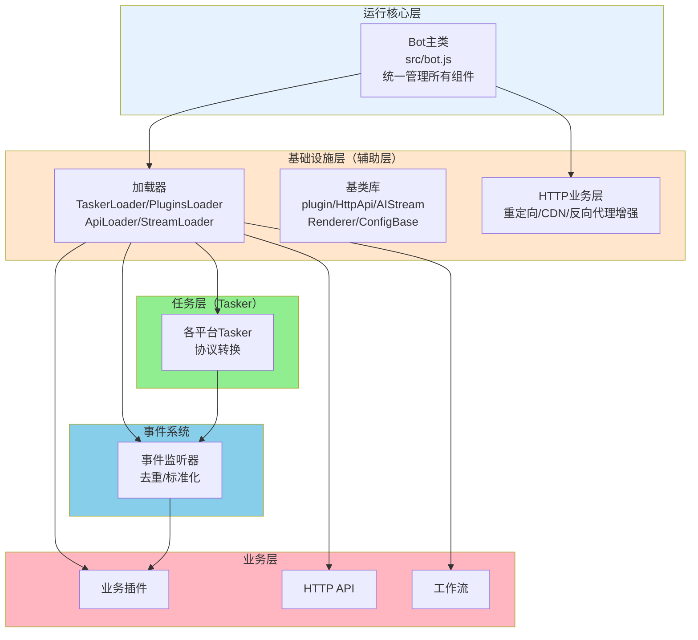
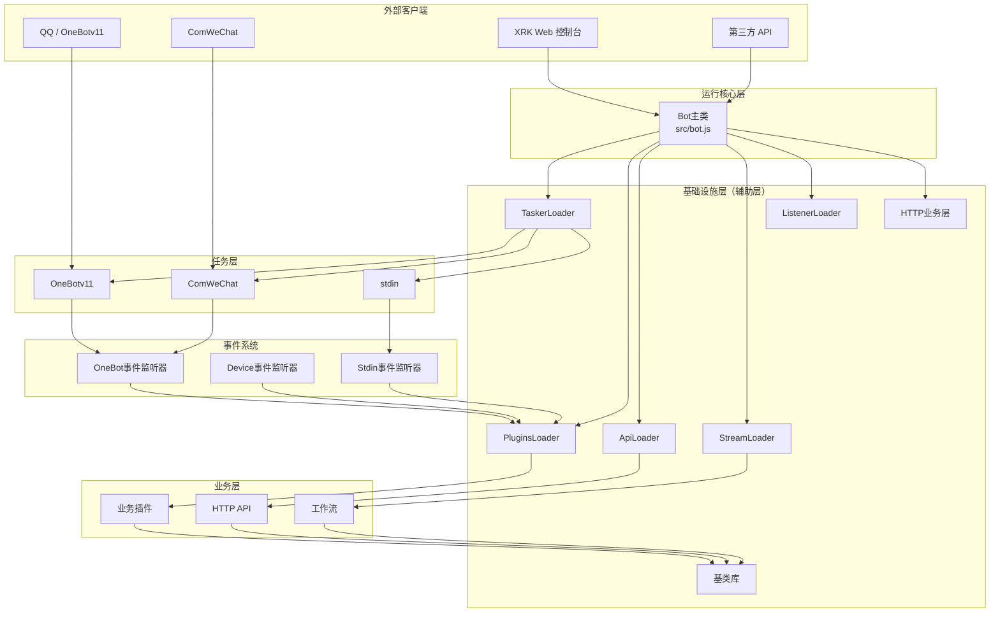
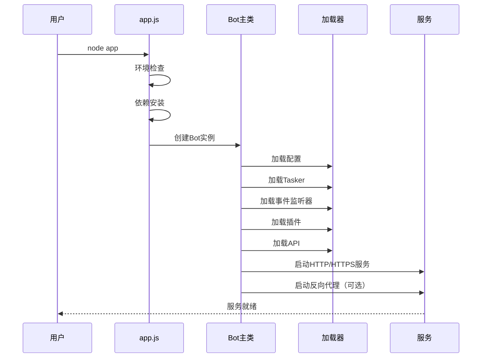
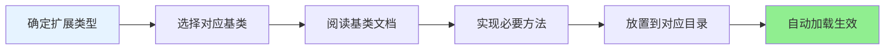
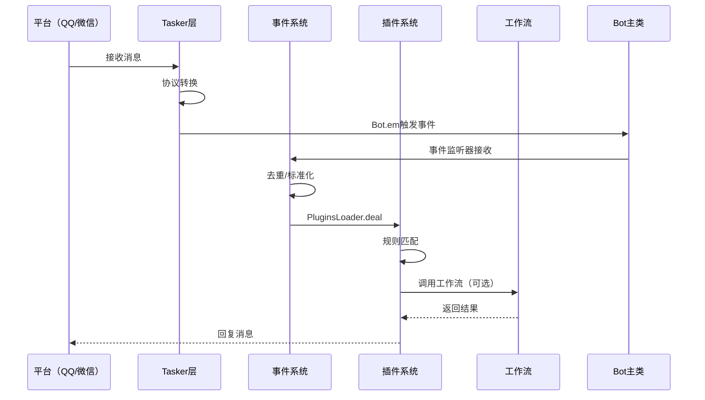
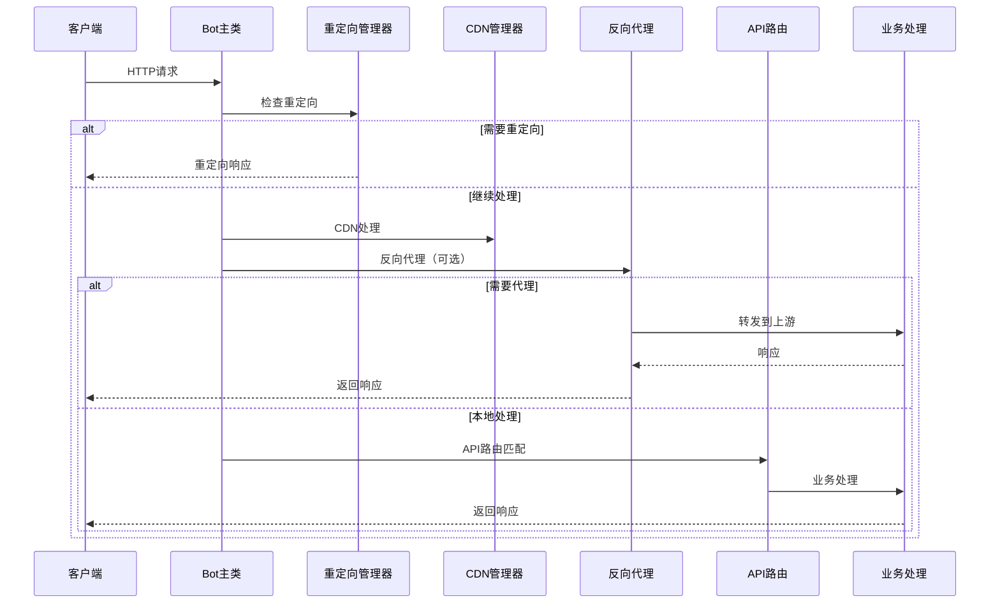

# XRK-AGT 项目概览

> **更新日期**: 2024-12-26  
> **Node.js 版本要求**: ≥ 24.12.0 (LTS)  
> 本文档提供 XRK-AGT 项目的完整架构概览、目录结构说明和核心特性介绍。

## 📋 目录

- [项目简介](#项目简介)
- [核心特性](#核心特性)
- [架构层次总览](#架构层次总览)
- [目录结构详解](#目录结构详解)
- [Node.js 24.12 新特性应用](#nodejs-2412-新特性应用)
- [HTTP业务层功能](#http业务层功能)
- [快速开始](#快速开始)
- [开发指南](#开发指南)

---

## 项目简介

XRK-AGT 是向日葵工作室基于 **Node.js 24.12** 打造的多平台、多Tasker、工作流驱动型智能体平台，采用清晰的分层架构设计，支持：

- **多平台消息接入**：OneBotv11 / ComWeChat / 自定义 Tasker
- **插件工作流**：指令插件 + AI 工作流 (`AIStream`)
- **Web 与 HTTP/API 服务**：内置 Web 控制台 + REST API + WebSocket
- **HTTP业务层**：重定向、CDN支持、反向代理增强（负载均衡、健康检查）
- **渲染与截图**：基于 Puppeteer / Playwright 的页面渲染与图片输出

### 技术栈

- **运行时**: Node.js 24.12.0+ (LTS)
- **Web框架**: Express 4.x
- **数据库**: Redis 5.0+, MongoDB 4.0+ (可选)
- **渲染引擎**: Puppeteer / Playwright
- **包管理**: pnpm (仅支持)

---

## 核心特性

### 1. 分层架构设计



**架构优势**：
- 清晰的层次划分，职责明确
- 基础设施与业务分离，易于维护
- 基于基类设计，便于扩展

### 2. Node.js 24.12 新特性应用

- **全局 URLPattern API**：无需导入，直接使用路径匹配
- **Error.isError()**：可靠的错误类型判断
- **原生 fetch API**：使用 AbortController 控制超时
- **AsyncLocalStorage 优化**：提升异步上下文追踪性能
- **V8 13.6 引擎**：支持 Float16Array、RegExp.escape 等新特性

### 3. HTTP业务层功能

- **重定向管理**：支持301/302/307/308重定向，通配符匹配，条件重定向
- **CDN支持**：静态资源CDN回源、缓存控制、CDN头部处理
- **反向代理增强**：负载均衡（轮询/加权/最少连接）、健康检查、故障转移

### 4. 插件与工作流系统

- 兼容 Yunzai 风格插件开发体验
- 通用工作流系统，基于 `AIStream` 基类
- 支持增强插件（Enhancer），为特定 Tasker 提供功能增强
- 内建多种 Embedding 与函数调用（Function Calling）

### 5. 生产级能力

- **反向代理**：多域名 + SNI + HTTP/2 + 负载均衡
- **安全与观测**：CORS / Helmet / 速率限制 / 请求日志
- **资源管理**：自动清理临时文件，适合长期稳定运行

---

## 架构层次总览

### 层次关系图



### 各层职责说明

#### 1. 运行核心层 (`src/bot.js`)

**职责**：
- 统一管理 HTTP/HTTPS/WebSocket 服务
- 中间件配置（CORS、认证、限流、压缩等）
- 反向代理支持（多域名、SNI、负载均衡）
- HTTP业务层集成（重定向、CDN、反向代理增强）
- 事件总线 (`Bot.em`)
- 资源清理和生命周期管理

**特点**：系统入口，协调所有组件

#### 2. 基础设施层（辅助层）(`src/infrastructure/`)

**职责**：提供所有基础设施和基类，为业务层提供通用能力

**包含**：
- **加载器**：
  - `TaskerLoader` - 任务层加载器
  - `PluginsLoader` - 插件加载与调度
  - `ApiLoader` - API 加载器
  - `StreamLoader` - 工作流加载器
  - `ListenerLoader` - 事件监听器加载器
- **基类库**：
  - `plugin` - 插件基类
  - `HttpApi` - HTTP API 基类
  - `AIStream` - AI 工作流基类
  - `Renderer` - 渲染器基类
  - `ConfigBase` - 配置基类
  - `EventListener` - 事件监听器基类
- **HTTP业务层**：
  - `http-business.js` - 重定向、CDN、反向代理增强
- **数据库客户端**：`redis.js`、`mongodb.js`
- **配置管理**：`config/`、`commonconfig/`

**特点**：不包含具体业务逻辑，只提供抽象和工具

#### 3. 任务层（Tasker）(`core/tasker/`)

**职责**：对接各平台协议（QQ/微信/自定义），将平台消息转换为统一事件模型，通过 `Bot.em` 触发事件

**包含**：
- `OneBotv11.js` - OneBot v11 协议
- `ComWeChat.js` - ComWeChat 协议
- `stdin.js` - 标准输入任务器
- 自定义 Tasker

**特点**：事件生成器，负责协议转换

#### 4. 事件系统 (`core/events/`)

**职责**：监听 `Bot.em` 事件，进行去重、标记、预处理，然后调用 `PluginsLoader.deal(e)` 分发到插件

**包含**：
- `onebot.js` - OneBot 事件监听器
- `device.js` - 设备事件监听器
- `stdin.js` - 标准输入事件监听器

**特点**：事件标准化和预处理层

#### 5. 业务层 (`core/`)

**职责**：实现具体业务逻辑

**包含**：
- **业务插件** (`core/plugin/`)：
  - `enhancer/` - 增强插件（为特定 Tasker 提供功能增强）
  - `example/` - 示例插件
- **HTTP API** (`core/http/`)：具体的 REST/WebSocket API 实现
- **工作流** (`core/stream/`)：基于 `AIStream` 的业务工作流实现

**特点**：基于基础设施层的基类实现具体功能

---

## 目录结构详解

### 项目根目录结构

```
XRK-AGT/
├── app.js                    # 应用启动入口（依赖检查、环境验证）
├── start.js                  # 主启动脚本（创建Bot实例）
├── package.json              # 项目配置和依赖
├── pnpm-lock.yaml            # pnpm 锁定文件
├── PROJECT_OVERVIEW.md       # 项目概览文档（本文档）
│
├── src/                      # 运行核心与基础设施
│   ├── bot.js                # Bot主类（核心运行时）
│   ├── infrastructure/       # 基础设施层
│   │   ├── tasker/          # Tasker加载器
│   │   ├── plugins/         # 插件系统基础设施
│   │   ├── listener/        # 事件监听器基础设施
│   │   ├── http/            # HTTP API基础设施
│   │   ├── aistream/        # AI工作流基础设施
│   │   ├── renderer/        # 渲染器基础设施
│   │   ├── commonconfig/    # 配置系统基础设施
│   │   └── config/          # 配置加载器
│   ├── utils/               # 工具函数
│   │   ├── botutil.js       # 核心工具类
│   │   ├── http-business.js # HTTP业务层（重定向/CDN/反向代理增强）
│   │   ├── paths.js         # 路径管理
│   │   └── ...              # 其他工具
│   ├── factory/             # 工厂类（ASR/TTS/LLM/Vision）
│   ├── modules/             # 业务模块
│   └── renderers/           # 渲染实现（Puppeteer/Playwright）
│
├── core/                     # 业务层与任务层
│   ├── tasker/              # 任务层（协议转换）
│   │   ├── OneBotv11.js    # OneBot v11 Tasker
│   │   ├── ComWeChat.js    # ComWeChat Tasker
│   │   └── stdin.js        # 标准输入Tasker
│   ├── events/              # 事件系统
│   │   ├── onebot.js       # OneBot事件监听器
│   │   ├── device.js       # 设备事件监听器
│   │   └── stdin.js        # 标准输入事件监听器
│   ├── plugin/              # 业务插件
│   │   ├── enhancer/       # 增强插件
│   │   └── example/        # 示例插件
│   ├── http/                # HTTP API
│   │   ├── ai.js           # AI相关API
│   │   ├── bot.js          # Bot相关API
│   │   └── ...             # 其他API
│   ├── stream/              # 工作流
│   │   ├── chat.js         # 聊天工作流
│   │   ├── device.js       # 设备工作流
│   │   └── ...             # 其他工作流
│   └── commonconfig/        # 业务配置
│
├── config/                   # 配置文件
│   ├── default_config/      # 默认配置
│   │   ├── server.yaml      # 服务器配置（HTTP/HTTPS/反向代理/CDN/重定向）
│   │   ├── bot.yaml         # Bot配置
│   │   └── ...              # 其他配置
│   └── server_config/        # 服务器配置
│       └── api_key.json     # API密钥
│
├── data/                     # 运行期数据
│   ├── server_bots/          # 服务器Bot配置（按端口分目录）
│   ├── configs/              # 运行时配置
│   ├── media/                # 媒体文件
│   ├── uploads/              # 上传文件
│   └── ...                   # 其他数据
│
├── www/                       # 前端静态资源
│   ├── index.html            # 首页
│   ├── xrk/                  # Web控制台
│   └── ...                   # 其他静态资源
│
├── docs/                      # 文档
│   ├── 完整文档.md            # 完整文档（推荐从这里开始）
│   ├── server.md             # Server服务器架构文档
│   ├── http-business-layer.md # HTTP业务层文档
│   └── ...                   # 其他文档
│
├── resources/                 # 渲染模板和资源
├── logs/                      # 日志文件
└── trash/                     # 回收站（自动清理）
```

### 关键目录说明

#### `src/` - 运行核心与基础设施

- **`bot.js`**：Bot主类，系统核心运行时
- **`infrastructure/`**：基础设施层，提供基类和加载器
- **`utils/http-business.js`**：HTTP业务层，提供重定向、CDN、反向代理增强功能
- **`utils/`**：工具函数集合

#### `core/` - 业务层与任务层

- **`tasker/`**：任务层，协议转换
- **`events/`**：事件系统，事件标准化和预处理
- **`plugin/`**：业务插件实现
- **`http/`**：HTTP API实现
- **`stream/`**：AI工作流实现

#### `config/` - 配置文件

- **`default_config/`**：默认配置模板
- **`server_config/`**：服务器运行时配置

#### `data/` - 运行期数据

- **`server_bots/`**：按端口分目录的Bot配置
- **`media/`**、**`uploads/`**：媒体和上传文件

---

## Node.js 24.12 新特性应用

### 1. 全局 URLPattern API

**应用场景**：HTTP重定向规则匹配、白名单路径匹配

```javascript
// 无需导入，直接使用
const pattern = new URLPattern({ pathname: '/api/*' });
const match = pattern.test({ pathname: '/api/users' });
```

**使用位置**：
- `src/utils/http-business.js` - 重定向管理器
- `src/bot.js` - 认证中间件白名单匹配

### 2. Error.isError()

**应用场景**：可靠的错误类型判断

```javascript
// 替代 instanceof Error，更可靠
if (Error.isError(err)) {
  console.error(err.message);
}
```

**使用位置**：
- `src/bot.js` - WebSocket错误处理
- `src/utils/http-business.js` - 错误处理

### 3. 原生 fetch API

**应用场景**：健康检查、公网IP获取

```javascript
// 使用AbortController控制超时
const controller = new AbortController();
const timeout = setTimeout(() => controller.abort(), 5000);
const response = await fetch(url, { signal: controller.signal });
clearTimeout(timeout);
```

**使用位置**：
- `src/utils/http-business.js` - 反向代理健康检查
- `src/bot.js` - 公网IP获取

### 4. AsyncLocalStorage 优化

**应用场景**：请求追踪、上下文传递（未来扩展）

Node.js 24.12 对 AsyncLocalStorage 进行了性能优化，可在需要时用于请求追踪。

### 5. V8 13.6 引擎特性

- **Float16Array**：高性能数值计算
- **RegExp.escape**：正则表达式转义
- **WebAssembly Memory64**：大内存支持

---

## HTTP业务层功能

### 功能概览

HTTP业务层（`src/utils/http-business.js`）提供：

1. **重定向管理**（`RedirectManager`）
   - 支持301/302/307/308重定向
   - 通配符匹配（使用URLPattern API）
   - 条件重定向（基于请求头）
   - 查询参数保留

2. **CDN支持**（`CDNManager`）
   - CDN回源识别
   - 静态资源CDN URL生成
   - 缓存控制（按文件类型）
   - CDN头部设置

3. **反向代理增强**（`ProxyManager`）
   - 负载均衡（轮询/加权/最少连接）
   - 健康检查（自动故障检测）
   - 故障转移（自动切换）

### 配置示例

```yaml
# 重定向配置
redirects:
  - from: "/old-page"
    to: "/new-page"
    status: 301

# CDN配置
cdn:
  enabled: true
  domain: "cdn.example.com"
  cacheControl:
    static: 31536000
    images: 604800

# 反向代理配置（负载均衡）
proxy:
  enabled: true
  healthCheck:
    enabled: true
    interval: 30000
  domains:
    - domain: "api.example.com"
      target:
        - url: "http://backend1:3000"
          weight: 3
        - url: "http://backend2:3000"
          weight: 1
      loadBalance: "weighted"
```

**详细文档**：参见 [`docs/http-business-layer.md`](docs/http-business-layer.md)

---

## 快速开始

### 环境要求

- **Node.js**: ≥ 24.12.0 (LTS)
- **pnpm**: 最新版本
- **Redis**: ≥ 5.0.0
- **MongoDB**: ≥ 4.0.0 (可选)

### 安装与运行

```bash
# 克隆项目
git clone --depth=1 https://github.com/sunflowermm/XRK-AGT.git
cd XRK-AGT

# 安装依赖（仅支持pnpm）
pnpm install

# 运行
node app
```

### 启动流程



**说明**：启动后可通过浏览器访问配置中的服务地址（默认2537端口），具体访问URL会在启动日志中打印。

---

## 开发指南

### 扩展开发流程



### 7大核心扩展点

1. **插件扩展** (`core/plugin/`)
   - 基类：`src/infrastructure/plugins/plugin.js`
   - 文档：`docs/plugin-base.md`

2. **工作流扩展** (`core/stream/`)
   - 基类：`src/infrastructure/aistream/aistream.js`
   - 文档：`docs/工作流系统完整文档.md`

3. **Tasker扩展** (`core/tasker/`)
   - 规范：`docs/tasker-base-spec.md`
   - 文档：`docs/tasker-loader.md`

4. **事件监听器扩展** (`core/events/`)
   - 基类：`src/infrastructure/listener/base.js`
   - 文档：`docs/事件监听器开发指南.md`

5. **HTTP API扩展** (`core/http/`)
   - 基类：`src/infrastructure/http/http.js`
   - 文档：`docs/http-api.md`

6. **渲染器扩展** (`src/renderers/`)
   - 基类：`src/infrastructure/renderer/Renderer.js`
   - 文档：`docs/renderer.md`

7. **配置扩展** (`core/commonconfig/`)
   - 基类：`src/infrastructure/commonconfig/commonconfig.js`
   - 文档：`docs/config-base.md`

**详细说明**：参见 [`docs/框架可扩展性指南.md`](docs/框架可扩展性指南.md)

---

## 核心模块一览

### 运行核心层

| 模块 | 文件/目录 | 职责 |
|------|----------|------|
| Bot主类 | `src/bot.js` | 管理HTTP/HTTPS/WS服务、中间件、认证、反向代理、事件总线 |

### 基础设施层

| 模块 | 文件/目录 | 职责 |
|------|----------|------|
| Tasker加载器 | `src/infrastructure/tasker/loader.js` | 扫描并加载Tasker |
| 插件系统 | `src/infrastructure/plugins/` | 插件基类和加载器 |
| 事件监听器 | `src/infrastructure/listener/` | 事件监听器基类和加载器 |
| HTTP API | `src/infrastructure/http/` | HTTP API基类和加载器 |
| AI工作流 | `src/infrastructure/aistream/` | AI工作流基类和加载器 |
| 渲染器 | `src/infrastructure/renderer/` | 渲染器基类和加载器 |
| 配置系统 | `src/infrastructure/commonconfig/` | 配置基类和通用配置 |
| HTTP业务层 | `src/utils/http-business.js` | 重定向、CDN、反向代理增强 |

### 任务层

| 模块 | 文件/目录 | 职责 |
|------|----------|------|
| OneBotv11 | `core/tasker/OneBotv11.js` | OneBot v11协议转换 |
| ComWeChat | `core/tasker/ComWeChat.js` | ComWeChat协议转换 |
| stdin | `core/tasker/stdin.js` | 标准输入任务器 |

### 业务层

| 模块 | 文件/目录 | 职责 |
|------|----------|------|
| 业务插件 | `core/plugin/` | 具体业务插件实现 |
| HTTP API | `core/http/` | 具体的REST/WebSocket API |
| 工作流 | `core/stream/` | 基于AIStream的业务工作流 |

---

## 数据流向

### 消息处理流程



### HTTP请求流程



---

## 配置体系

### 配置文件结构

```
config/
├── default_config/          # 默认配置模板
│   ├── server.yaml         # 服务器配置（HTTP/HTTPS/反向代理/CDN/重定向）
│   ├── bot.yaml            # Bot配置
│   ├── aistream.yaml       # 工作流配置
│   └── ...                 # 其他配置
└── server_config/          # 服务器运行时配置
    └── api_key.json        # API密钥

data/
└── server_bots/            # Bot运行时配置（按端口分目录）
    └── {port}/             # 端口目录
        ├── server.yaml     # 服务器配置
        ├── bot.yaml        # Bot配置
        └── ...             # 其他配置
```

### 配置加载流程

```mermaid
flowchart TB
    A[启动应用] --> B[读取default_config]
    B --> C[读取server_bots/{port}]
    C --> D[合并配置]
    D --> E[验证配置]
    E --> F[应用配置]
    F --> G[启动服务]
```

---

## 性能优化

### Node.js 24.12 优化

1. **V8 13.6 引擎**：提升JavaScript执行性能
2. **AsyncLocalStorage优化**：提升异步上下文追踪性能
3. **HTTP客户端升级**：Undici 7提升网络请求性能
4. **全局URLPattern**：简化路由匹配，无需导入

### 框架优化

1. **并行依赖检查**：使用`Promise.all`批量检查
2. **并行插件依赖安装**：同时处理多个插件
3. **批量日志写入**：优化日志队列刷新机制
4. **高效端口扫描**：优化端口列表获取算法

---

## 安全特性

### HTTP安全

- **Helmet安全头**：自动添加安全相关的HTTP头部
- **CORS跨域**：灵活的跨域配置
- **速率限制**：防止恶意请求
- **API认证**：API密钥认证机制

### 反向代理安全

- **SNI支持**：多域名SSL证书
- **健康检查**：自动故障检测和转移
- **负载均衡**：分散请求压力

---

## 文档导航

### 核心文档

- **[完整文档](docs/完整文档.md)** - 整合了所有核心文档，推荐从这里开始
- **[Server服务器架构](docs/server.md)** - HTTP/HTTPS/WebSocket服务、反向代理详细说明
- **[HTTP业务层](docs/http-business-layer.md)** - 重定向、CDN、反向代理增强功能
- **[框架可扩展性指南](docs/框架可扩展性指南.md)** - 7大核心扩展点详解

### 开发文档

- **[Bot主类](docs/bot.md)** - Bot主类详细文档
- **[插件系统](docs/plugin-base.md)** - 插件基类和加载器
- **[工作流系统](docs/工作流系统完整文档.md)** - AI工作流完整文档
- **[HTTP API](docs/http-api.md)** - HTTP API基类文档

---

## 相关资源

- **GitHub仓库**: https://github.com/sunflowermm/XRK-AGT
- **GitCode仓库**: https://gitcode.com/Xrkseek/XRK-AGT
- **完整文档**: [`docs/完整文档.md`](docs/完整文档.md)

---

*本文档持续更新中，如有问题或建议，请提交Issue。*

