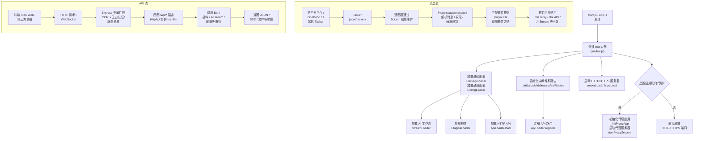

## XRK-AGT 项目主文档（架构与对象说明）

XRK-AGT 是一个基于 Node.js 的智能体运行平台，提供 **多适配器消息接入、插件工作流、HTTP/API 服务、AI 工作流与渲染能力** 等。  
本文作为主文档，包含整体运行逻辑图、项目目录解析，以及对重要对象文档的导航。

---

## 整体运行逻辑（API 与核心组件交互图）

下面使用流程图描述从启动到处理一条消息 / API 请求的大致流程。

---

## 项目目录结构解析

- **项目根目录**
  - `start.js` / `app.js`：项目启动入口，创建并运行 `Bot` 实例。
  - `package.json`：依赖与脚本定义。
  - `README.md`：项目基础说明。
  - 各类补充文档：项目相关说明文档。

- **核心运行层（src）**
  - `src/bot.js`  
    - **Bot 主类**，负责：
      - 初始化 Express 与 HTTP/HTTPS/WebSocket 服务。
      - 加载配置 (`#infrastructure/config`)、插件 (`#infrastructure/plugins`)、AI 工作流 (`#infrastructure/aistream`)、HTTP API (`#infrastructure/http`)。
      - 管理反向代理、CORS、安全头、静态资源、认证与速率限制。
      - 统一对外事件总线 `Bot.em`，为适配器与插件提供事件派发。
  - `src/infrastructure`（基础设施层）
    - `tasker/loader.js`：扫描 `core/tasker` 目录，动态加载各类 Tasker（事件生成器，如 OneBotv11）。
    - `aistream/aistream.js`：`AIStream` 基类，封装 AI 调用、Embedding、相似度检索、函数调用等能力。
    - `commonconfig/commonconfig.js`：基于 `ConfigBase` 的通用配置系统封装。
    - `config/config.js`：服务端运行配置（端口、HTTPS、CORS、认证、静态资源等）。
    - `http/http.js`：`HttpApi` 基类，提供统一的 REST/WebSocket API 定义方式。
    - `http/loader.js` (`ApiLoader`)：动态加载 `core/http` 中的 API 模块，并注册到 Express。
    - `listener/`：事件监听器加载器，用于挂接自定义事件监听逻辑。
    - `log.js`：统一日志封装。
    - `plugins/`：
      - `plugin.js`：插件基类 `plugin`，封装规则匹配、上下文管理、工作流集成等功能。
      - `loader.js` (`PluginsLoader`)：插件加载与运行核心，负责：
        - 扫描 `core/plugin` 目录并实例化插件。
        - 将接入层事件统一分发给插件。
        - 管理定时任务、上下文、冷却时间、黑白名单等。
      - `runtime.js` / `handler.js`：插件运行时与 Handler 管理。
    - `renderer/Renderer.js`：渲染器基类，统一 HTML 模板渲染与图片生成逻辑。
    - `redis.js`：Redis 客户端封装。
    - `mongodb.js`：MongoDB 客户端封装，提供文档数据库支持。
  - `src/factory`  
    - `asr/`：语音识别工厂 `ASRFactory` 与 `VolcengineASRClient`。
    - `tts/`：语音合成工厂 `TTSFactory` 与 `VolcengineTTSClient`。
    - `llm/`：大模型工厂 `LLMFactory` 与 `GenericLLMClient`，统一封装 Chat Completion 调用。
  - `src/modules`  
    - `oicq/`：与 OICQ/QQ 相关的模块封装。
    - `puppeteer.js` / `systemmonitor.js`：浏览器渲染与系统监控等扩展功能。
  - `src/renderers`  
    - `puppeteer/`、`playwright/`：基于不同引擎的页面渲染实现，最终都基于 `Renderer` 基类工作。
  - `src/utils`  
    - `paths.js`：统一路径管理（core、config、data、www、trash、temp 等）。
    - `botutil.js`：日志、文件、随机字符串、延迟等常用工具。
    - `deviceutil.js`、`screenshotutil.js` 等：设备与截图相关工具。

- **适配器与事件层（core）**
  - `core/tasker/*.js`  
    - `OneBotv11.js`：QQ/OneBotv11 适配器，实现消息收发、好友/群/频道对象封装、事件转译等。
    - `ComWeChat.js`、`GSUIDCORE.js`、`QBQBot.js`、`stdin.js`：其它平台或输入通道的适配器。
  - `core/http/*.js`  
    - 通过 `ApiLoader` 被动态加载为 HTTP API 模块，通常导出 `HttpApi` 风格的配置或类。
  - `core/events/*.js`  
    - 对不同 post_type（message/notice/request/device 等）的事件进行拆分与预处理。
  - `core/stream/*.js`  
    - 工作流级别的封装（如 chat/device 流），通常基于 `AIStream`。
  - `core/commonconfig/system.js`  
    - 系统级通用配置定义。
  - `core/plugin/example/`  
    - 示例插件：加法、重启、定时任务、状态查询、远程指令等，展示如何继承 `plugin`。

- **配置与数据**
  - `config/default_config/*.yaml`：系统默认配置（bot、server、device、redis、mongodb、renderer 等）。
  - `config/cmd/tools.yaml`：命令行工具及相关配置。
  - `data/`：
    - `bots/`：各 Bot 账号运行时数据。
    - `server_bots/`：服务端机器人配置。
    - `importsJson/`：导入数据缓存。
    - `backups/`：配置或数据备份。

- **前端与静态资源**
  - `www/`：HTTP 静态目录，由 `Bot._setupStaticServing` 暴露。
    - `xrk/`：内置 Web 控制台（前端应用）。
    - `favicon.ico`、`robots.txt`：基础站点文件。
  - `resources/`：渲染模板与静态资源（如字体 `Genshin.ttf`、说明文件等）。
  - `temp/`：运行期生成的 HTML / 图片等临时文件。
  - `trash/`：用于定时清理的临时文件（如截图），由 `Bot._startTrashCleaner` 管理。

---

## 重要对象与基类文档索引

以下对象是 XRK-AGT 的核心抽象，建议按顺序阅读：

- **运行核心**
  - [`docs/bot.md`](docs/bot.md) —— `Bot` 主类
  - [`docs/tasker-loader.md`](docs/tasker-loader.md) —— `TaskerLoader`（Tasker 加载器）
  - [`docs/plugins-loader.md`](docs/plugins-loader.md) —— `PluginsLoader`（插件加载与调度器）

- **插件与工作流**
  - [`docs/plugin-base.md`](docs/plugin-base.md) —— 插件基类 `plugin`
  - [`docs/aistream.md`](docs/aistream.md) —— AI 工作流基类 `AIStream`

- **HTTP/API 与前后端交互**
  - [`docs/http-api.md`](docs/http-api.md) —— HTTP API 基类 `HttpApi`
  - [`docs/api-loader.md`](docs/api-loader.md) —— `ApiLoader`（API 加载与注册）

- **配置与渲染**
  - [`docs/config-base.md`](docs/config-base.md) —— 配置基类 `ConfigBase`
  - [`docs/renderer.md`](docs/renderer.md) —— 渲染器基类 `Renderer`

- **Tasker 示例**
  - [`docs/tasker-onebotv11.md`](docs/tasker-onebotv11.md) —— QQ/OneBotv11 Tasker 说明

---

## 阅读建议

- **只想快速上手：**
  1. 阅读本主文档的「整体运行逻辑」与「项目目录结构解析」。
  2. 再阅读 `docs/bot.md` 与 `docs/plugin-base.md`，即可编写基础插件。

- **需要扩展协议 / 接入新平台：**
  1. 阅读 `docs/tasker-loader.md` 与 `docs/tasker-onebotv11.md`。
  2. 参考 `core/tasker` 中的现有实现编写新 Tasker。

- **需要开发 HTTP API / 前端后台一体化：**
  1. 阅读 `docs/http-api.md` 与 `docs/api-loader.md`。
  2. 在 `core/http/` 中新增 API 模块，通过 `HttpApi` 定义路由。

- **需要接入外部 AI / 向量检索 / 工具调用：**
  1. 阅读 `docs/aistream.md`。
  2. 基于 `AIStream` 实现自定义工作流，并在插件内调用。

---

## 文档更新时间

- **最新更新日期**：2025-11-26

