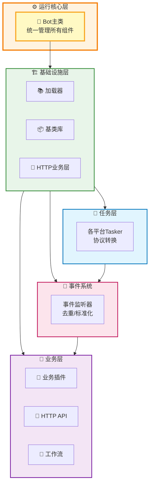
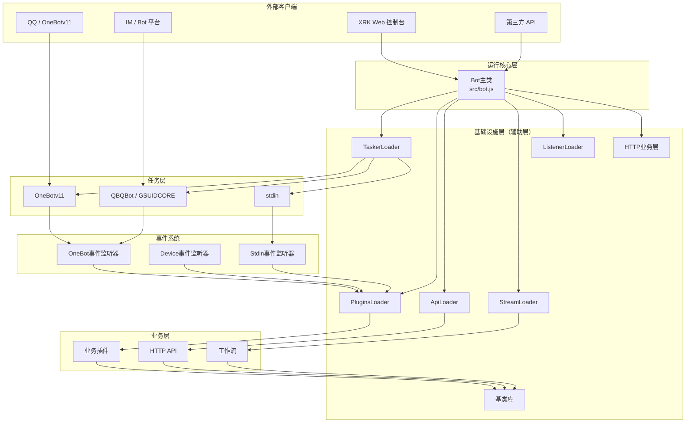
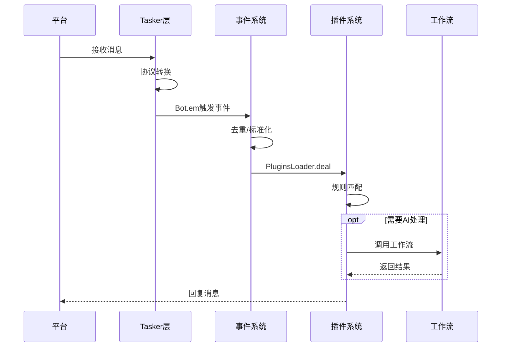
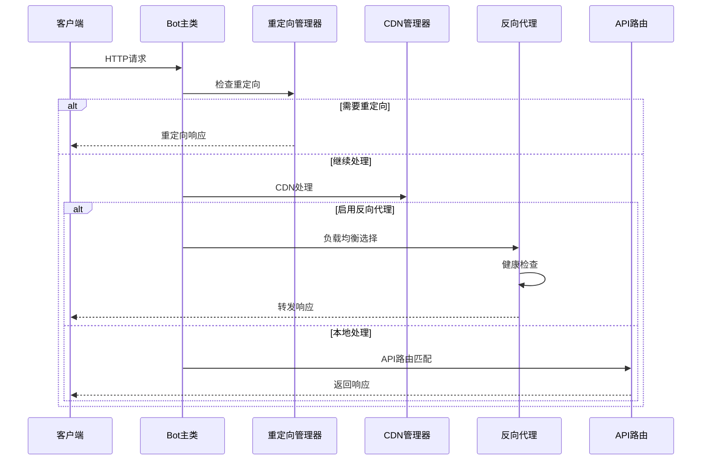
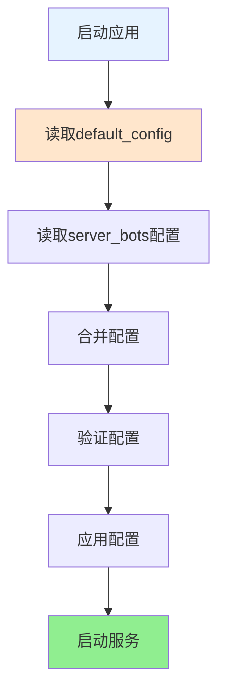

# XRK-AGT 项目概览

> **Node.js 版本要求**: ≥ 24.12.0 (LTS)  
> 本文档提供 XRK-AGT 项目的完整架构概览、目录结构说明和核心特性介绍。  
> 如需快速开始，请查看 [README.md](README.md)；详细开发与扩展指南请结合 [docs/README.md](docs/README.md) 与各模块文档阅读。

## 📋 目录

- [项目简介](#项目简介)
- [核心特性](#核心特性)
- [架构层次总览](#架构层次总览)
- [目录结构详解](#目录结构详解)
- [Node.js 24.12 新特性应用](#nodejs-2412-新特性应用)
- [HTTP业务层功能](#http业务层功能)
- [快速开始](#快速开始)
- [开发指南](#开发指南)

---

## 项目简介

XRK-AGT 是向日葵工作室基于 **Node.js 24.12** 打造的多平台、多Tasker、工作流驱动型智能体平台，采用清晰的分层架构设计，支持：

- **多平台消息接入**：OneBotv11 / QBQBot / GSUIDCORE / stdin / 自定义 Tasker
- **插件工作流**：指令插件 + AI 工作流 (`AIStream`)
- **Web 与 HTTP/API 服务**：内置 Web 控制台 + REST API + WebSocket
- **HTTP业务层**：重定向、CDN支持、反向代理增强（负载均衡、健康检查）
- **渲染与截图**：基于 Puppeteer / Playwright 的页面渲染与图片输出

### 技术栈

- **运行时**: Node.js 24.12.0+ (LTS)
- **Web框架**: Express 4.x
- **数据库**: Redis 5.0+, MongoDB 4.0+ (可选)
- **渲染引擎**: Puppeteer / Playwright
- **包管理**: pnpm (仅支持)
- **跨平台支持**: Windows 10+ / Linux / macOS / Docker

---

## 核心特性

### 1. 分层架构设计



**架构优势**：清晰的层次划分、基础设施与业务分离、基于基类设计便于扩展

### 2. Node.js 24.12 新特性应用

- **全局 URLPattern API**：无需导入，直接使用路径匹配
- **Error.isError()**：可靠的错误类型判断
- **原生 fetch API**：使用 AbortController 控制超时
- **AsyncLocalStorage 优化**：提升异步上下文追踪性能
- **V8 13.6 引擎**：支持 Float16Array、RegExp.escape 等新特性

### 3. HTTP业务层功能

- **重定向管理**：支持301/302/307/308重定向，通配符匹配，条件重定向
- **CDN支持**：静态资源CDN回源、缓存控制、CDN头部处理
- **反向代理增强**：负载均衡（轮询/加权/最少连接）、健康检查、故障转移

### 4. 插件与工作流系统

- 兼容 Yunzai 风格插件开发体验
- 通用工作流系统，基于 `AIStream` 基类
- 支持增强插件（Enhancer），为特定 Tasker 提供功能增强
- 内建多种 Embedding 与函数调用（Function Calling）

### 5. 生产级能力

- **反向代理**：多域名 + SNI + HTTP/2 + 负载均衡
- **安全与观测**：CORS / Helmet / 速率限制 / 请求日志
- **资源管理**：自动清理临时文件，适合长期稳定运行

### 6. system-Core 内置模块

XRK-AGT 内置了完整的 system-Core 模块，提供开箱即用的功能：

- **10个HTTP API模块**：核心系统、机器人管理、配置管理、文件管理、插件管理、AI服务、MCP服务、设备管理、标准输入、数据编辑
- **7个工作流**：50+个MCP工具，覆盖聊天、桌面、工具、记忆、知识库、设备、文档索引
- **4个Tasker**：OneBotv11、GSUIDCORE、QBQBot、stdin
- **Web控制台**：企业级管理界面（`/xrk/`），支持系统监控、API调试、配置管理

详细说明请参考 [system-Core 特性文档](docs/system-core.md)。

---

## 架构层次总览

### 层次关系图



### 各层职责说明

#### 1. 运行核心层 (`src/bot.js`)

**职责**：
- 统一管理 HTTP/HTTPS/WebSocket 服务
- 中间件配置（CORS、认证、限流、压缩等）
- 反向代理支持（多域名、SNI、负载均衡）
- HTTP业务层集成（重定向、CDN、反向代理增强）
- 事件总线 (`Bot.em`)
- 资源清理和生命周期管理

**特点**：系统入口，协调所有组件

#### 2. 基础设施层（辅助层）(`src/infrastructure/`)

**职责**：提供所有基础设施和基类，为业务层提供通用能力

**包含**：
- **加载器**：TaskerLoader、PluginsLoader、ApiLoader、StreamLoader、ListenerLoader
- **基类库**：plugin、HttpApi、AIStream、Renderer、ConfigBase、EventListener
- **HTTP业务层**：`http-business.js` - 重定向、CDN、反向代理增强
- **数据库客户端**：`redis.js`、`mongodb.js`
- **配置管理**：`config/`、`commonconfig/`

**特点**：不包含具体业务逻辑，只提供抽象和工具

#### 3. 任务层（Tasker）(`core/*/tasker/`)

**职责**：对接各平台协议（QQ/IM/自定义），将平台消息转换为统一事件模型，通过 `Bot.em` 触发事件

**包含**：`OneBotv11.js`、`QBQBot.js`、`GSUIDCORE.js`、`stdin.js`、自定义 Tasker

**特点**：事件生成器，负责协议转换

#### 4. 事件系统 (`core/*/events/`)

**职责**：监听 `Bot.em` 事件，进行去重、标记、预处理，然后调用 `PluginsLoader.deal(e)` 分发到插件

**包含**：`onebot.js`、`device.js`、`stdin.js`

**特点**：事件标准化和预处理层

#### 5. 业务层 (`core/*/`)

**职责**：实现具体业务逻辑

**包含**：
- **业务插件** (`core/*/plugin/`)：指令插件、增强插件（Enhancer）等
- **HTTP API** (`core/*/http/`)：REST/WebSocket API 实现
- **工作流** (`core/*/stream/`)：基于 `AIStream` 的业务工作流实现

**特点**：基于基础设施层的基类实现具体功能

---

## 目录结构详解

### 项目根目录结构

```
XRK-AGT/
├── app.js                    # 应用启动入口
├── start.js                  # 主启动脚本
├── package.json              # 项目配置和依赖
├── PROJECT_OVERVIEW.md        # 项目概览文档（本文档）
│
├── src/                      # 运行核心与基础设施
│   ├── bot.js                # Bot主类（核心运行时）
│   ├── infrastructure/       # 基础设施层
│   │   ├── tasker/          # Tasker加载器
│   │   ├── plugins/         # 插件系统基础设施
│   │   ├── listener/        # 事件监听器基础设施
│   │   ├── http/            # HTTP API基础设施
│   │   ├── aistream/        # AI工作流基础设施
│   │   ├── renderer/        # 渲染器基础设施
│   │   ├── commonconfig/    # 配置系统基础设施（ConfigBase基类）
│   │   └── config/          # 配置加载器
│   ├── utils/               # 工具函数
│   │   ├── botutil.js       # 核心工具类
│   │   ├── http-business.js # HTTP业务层
│   │   └── paths.js         # 路径管理
│   ├── factory/             # 工厂类（ASR/TTS/LLM/Vision）
│   ├── modules/             # 业务模块
│   └── renderers/           # 渲染实现（Puppeteer/Playwright）
│
├── core/                     # 业务层与任务层
│   ├── system-Core/         # 系统核心模块（内置，开箱即用）
│   │   ├── plugin/          # 业务插件目录（增强器、功能插件）
│   │   ├── tasker/          # 任务层目录（OneBotv11、GSUIDCORE、QBQBot、stdin）
│   │   ├── events/          # 事件系统目录（onebot、device、stdin）
│   │   ├── http/            # HTTP API目录（10个API模块）
│   │   ├── stream/          # 工作流目录（7个工作流，50+个MCP工具）
│   │   ├── commonconfig/    # 配置管理（system.js、LLM配置、工具配置）
│   │   └── www/             # 静态资源（Web控制台 /xrk/）
│   │       └── xrk/         # Web控制台前端（系统监控、API调试、配置管理）
│   └── my-core/             # 自定义core模块
│
├── config/                   # 配置文件
│   ├── default_config/      # 默认配置
│   └── server_config/       # API 密钥等（如 api_key.json）
│
├── data/                     # 运行期数据
│   ├── server_bots/          # 服务器Bot配置（按端口分目录）
│   ├── configs/              # 运行时配置
│   ├── media/                # 媒体文件
│   └── uploads/              # 上传文件
│
├── www/                       # 前端静态资源
├── docs/                     # 文档
├── resources/                 # 渲染模板和资源
├── logs/                      # 日志文件
└── trash/                     # 回收站（自动清理）
```

### 关键目录说明

- **`src/bot.js`**：Bot主类，系统核心运行时
- **`src/infrastructure/`**：基础设施层，提供基类和加载器
- **`src/utils/http-business.js`**：HTTP业务层，提供重定向、CDN、反向代理增强功能
- **`core/*/tasker/`**：任务层，协议转换
- **`core/*/events/`**：事件系统，事件标准化和预处理
- **`core/*/plugin/`**：业务插件实现
- **`core/*/http/`**：HTTP API实现
- **`core/*/stream/`**：AI工作流实现
- **`core/*/www/`**：静态资源（⚠️ 必须创建子目录，避免与根目录www冲突）

---

## Node.js 24.12 新特性应用

### 1. 全局 URLPattern API

**应用场景**：HTTP重定向规则匹配、白名单路径匹配

```javascript
// 无需导入，直接使用
const pattern = new URLPattern({ pathname: '/api/*' });
const match = pattern.test({ pathname: '/api/users' });
```

**使用位置**：
- `src/utils/http-business.js` - 重定向管理器
- `src/bot.js` - 认证中间件白名单匹配

### 2. Error.isError()

**应用场景**：可靠的错误类型判断

```javascript
// 替代 instanceof Error，更可靠
if (Error.isError(err)) {
  console.error(err.message);
}
```

**使用位置**：
- `src/bot.js` - WebSocket错误处理
- `src/utils/http-business.js` - 错误处理

### 3. 原生 fetch API

**应用场景**：健康检查、公网IP获取

```javascript
// 使用AbortController控制超时
const controller = new AbortController();
const timeout = setTimeout(() => controller.abort(), 5000);
const response = await fetch(url, { signal: controller.signal });
clearTimeout(timeout);
```

**使用位置**：
- `src/utils/http-business.js` - 反向代理健康检查
- `src/bot.js` - 公网IP获取

### 4. AsyncLocalStorage 优化

**应用场景**：请求追踪、上下文传递

Node.js 24.12 对 AsyncLocalStorage 进行了性能优化，提升异步上下文追踪性能。

### 5. V8 13.6 引擎特性

- **Float16Array**：高性能数值计算
- **RegExp.escape**：正则表达式转义
- **WebAssembly Memory64**：大内存支持

---

## HTTP业务层功能

### 功能概览

HTTP业务层（`src/utils/http-business.js`）提供：

1. **重定向管理**（`RedirectManager`）
   - 支持301/302/307/308重定向
   - 通配符匹配（使用URLPattern API）
   - 条件重定向（基于请求头）
   - 查询参数保留

2. **CDN支持**（`CDNManager`）
   - CDN回源识别
   - 静态资源CDN URL生成
   - 缓存控制（按文件类型）
   - CDN头部设置

3. **反向代理增强**（`ProxyManager`）
   - 负载均衡（轮询/加权/最少连接）
   - 健康检查（自动故障检测）
   - 故障转移（自动切换）

### 配置示例

```yaml
# 重定向配置
redirects:
  - from: "/old-page"
    to: "/new-page"
    status: 301

# CDN配置
cdn:
  enabled: true
  domain: "cdn.example.com"
  cacheControl:
    static: 31536000
    images: 604800

# 反向代理配置（负载均衡）
proxy:
  enabled: true
  healthCheck:
    enabled: true
    interval: 30000
  domains:
    - domain: "api.example.com"
      target:
        - url: "http://backend1:3000"
          weight: 3
        - url: "http://backend2:3000"
          weight: 1
      loadBalancingAlgorithm: "weighted"
```

**详细文档**：参见 [`docs/http-business-layer.md`](docs/http-business-layer.md)

---

## 快速开始

参见 [README.md](README.md) 的「快速开始」章节。

---

## 开发指南

**7 大核心扩展点**（插件、工作流、Tasker、事件监听器、HTTP API、渲染器、配置）及扩展流程、目录与基类说明，详见 **[`docs/框架可扩展性指南.md`](docs/框架可扩展性指南.md)**。

**system-Core 内置模块**：XRK-AGT 内置了完整的 system-Core 模块，提供10个HTTP API模块、7个工作流（50+个MCP工具）、4个Tasker和Web控制台。详见 **[`docs/system-core.md`](docs/system-core.md)**。

---

## 数据流向

### 消息处理流程



### HTTP请求流程



### 配置加载流程



---

## 性能优化

### Node.js 24.12 优化

1. **V8 13.6 引擎**：提升JavaScript执行性能
2. **AsyncLocalStorage优化**：提升异步上下文追踪性能
3. **HTTP客户端升级**：Undici 7提升网络请求性能
4. **全局URLPattern**：简化路由匹配，无需导入

### 框架优化

1. **并行加载**：使用`Promise.allSettled`批量加载插件、API、工作流
2. **动态批次**：根据内存使用情况动态调整插件加载批次大小
3. **热加载优化**：支持插件、API、配置的完整热加载，资源清理完善
4. **缓存机制**：配置缓存、事件历史缓存，减少重复计算

---

## 安全特性

### HTTP安全

- **Helmet安全头**：自动添加安全相关的HTTP头部
- **CORS跨域**：灵活的跨域配置
- **速率限制**：防止恶意请求
- **API认证**：API密钥认证机制

### 反向代理安全

- **SNI支持**：多域名SSL证书
- **健康检查**：自动故障检测和转移
- **负载均衡**：分散请求压力

---

## 文档导航

参见 [docs/README.md](docs/README.md)。

**重要文档**：
- **[system-Core 特性文档](docs/system-core.md)** ⭐ - system-Core 内置模块完整说明
- **[框架可扩展性指南](docs/框架可扩展性指南.md)** ⭐ - 7大扩展点、Core模块开发指南

---

## 相关资源

- **GitHub仓库**: https://github.com/sunflowermm/XRK-AGT
- **GitCode仓库**: https://gitcode.com/Xrkseek/XRK-AGT

---

*最后更新：2026-02-06*
