## XRK-AGT 项目主文档（架构与对象说明）

XRK-AGT 是一个基于 Node.js 的智能体运行平台，采用**分层架构设计**，提供 **多平台消息接入、插件工作流、HTTP/API 服务、AI 工作流与渲染能力** 等。  
本文作为主文档，包含整体运行逻辑图、项目目录解析，以及对重要对象文档的导航。

---

## 架构层次总览

XRK-AGT 采用清晰的分层架构，各层职责明确：

```mermaid
flowchart TB
    subgraph Runtime["运行核心层"]
      Bot["Bot 主类<br/>src/bot.js<br/>统一管理所有组件"]
    end

    subgraph Infrastructure["基础设施层（辅助层）<br/>src/infrastructure/"]
      Loaders["加载器<br/>TaskerLoader/PluginsLoader<br/>ApiLoader/StreamLoader<br/>ListenerLoader"]
      BaseClasses["基类库<br/>plugin/HttpApi/AIStream<br/>Renderer/ConfigBase/EventListener"]
      DB["数据库客户端<br/>redis/mongodb"]
    end

    subgraph Tasker["任务层（Tasker）<br/>core/tasker/"]
      Taskers["各平台 Tasker<br/>OneBotv11/ComWeChat<br/>stdin/自定义"]
    end

    subgraph EventSystem["事件系统<br/>core/events/"]
      Listeners["事件监听器<br/>onebot/device/stdin"]
    end

    subgraph Business["业务层<br/>core/"]
      Plugins["业务插件<br/>core/plugin/"]
      HttpApis["HTTP API<br/>core/http/"]
      Streams["工作流<br/>core/stream/"]
    end

    Bot --> Infrastructure
    Infrastructure --> Tasker
    Infrastructure --> EventSystem
    Infrastructure --> Business
    Tasker -->|Bot.em 触发| EventSystem
    EventSystem -->|去重/标记| Business
```

### 层次职责说明

- **运行核心层**：系统入口，统一管理所有组件
- **基础设施层（辅助层）**：提供基类、加载器、工具，不包含业务逻辑
- **任务层（Tasker）**：协议转换，生成统一事件
- **事件系统**：事件标准化和预处理
- **业务层**：具体业务实现

---

## 整体运行逻辑（启动与消息处理流程）

下面使用流程图描述从启动到处理一条消息 / API 请求的大致流程。

```mermaid
flowchart TD
    Start["🚀 start.js / app.js<br/>启动"] --> InitBot["创建 Bot 实例<br/>src/bot.js"]
    
    InitBot --> LoadConfig["📋 加载配置<br/>Packageloader<br/>ConfigLoader"]
    InitBot --> LoadInfra["🔧 加载基础设施<br/>TaskerLoader<br/>ListenerLoader"]
    InitBot --> LoadBusiness["💼 加载业务层<br/>StreamLoader<br/>PluginsLoader<br/>ApiLoader"]
    
    LoadConfig --> InitServer["🌐 初始化服务器<br/>HTTP/HTTPS/WS"]
    LoadInfra --> InitServer
    LoadBusiness --> InitServer
    
    InitServer --> ProxyCheck{是否启用<br/>反向代理?}
    ProxyCheck -->|是| Proxy["🔀 启动代理服务器<br/>多域名 + SNI + HTTP/2"]
    ProxyCheck -->|否| Direct["直接暴露<br/>HTTP/HTTPS 端口"]
    
    subgraph MessageFlow["📨 消息处理流程"]
        Platform["第三方平台<br/>QQ/微信/自定义"] --> Tasker["任务层 Tasker<br/>core/tasker/"]
        Tasker -->|Bot.em 触发| EventListener["事件监听器<br/>core/events/"]
        EventListener -->|去重/标记/预处理| PluginsLoader["插件加载器<br/>PluginsLoader.deal(e)"]
        PluginsLoader -->|规则匹配| Plugin["业务插件<br/>core/plugin/"]
        Plugin --> Response["回复/调用服务<br/>AIStream/Renderer/API"]
    end
    
    subgraph APIFlow["🌐 API 处理流程"]
        Client["前端/第三方调用"] --> Express["Express 中间件栈<br/>CORS/日志/认证/静态资源"]
        Express --> ApiRoute["匹配 /api/* 路由<br/>HttpApi 实例 handler"]
        ApiRoute --> BusinessLogic["调用业务逻辑<br/>Bot/插件/AIStream/配置"]
        BusinessLogic --> Response2["返回响应<br/>JSON/SSE/文件等"]
    end
    
    InitServer --> MessageFlow
    InitServer --> APIFlow
```

---

## 项目目录结构解析

### 项目根目录

- `start.js` / `app.js`：项目启动入口，创建并运行 `Bot` 实例
- `package.json`：依赖与脚本定义
- `README.md`：项目基础说明
- `PROJECT_OVERVIEW.md`：本文档
- 各类补充文档：项目相关说明文档

### 运行核心层（src）

#### `src/bot.js` - Bot 主类

**职责**：
- 初始化 Express 与 HTTP/HTTPS/WebSocket 服务
- 加载配置 (`#infrastructure/config`)、插件 (`#infrastructure/plugins`)、AI 工作流 (`#infrastructure/aistream`)、HTTP API (`#infrastructure/http`)
- 管理反向代理、CORS、安全头、静态资源、认证与速率限制
- 统一对外事件总线 `Bot.em`，为 Tasker 与插件提供事件派发

### 基础设施层（辅助层）- `src/infrastructure/`

基础设施层提供所有基础设施和基类，为业务层提供通用能力，**不包含具体业务逻辑**。

#### 加载器模块

- **`tasker/loader.js`** (`TaskerLoader`)：扫描 `core/tasker` 目录，动态加载各类 Tasker（事件生成器，如 OneBotv11）
- **`plugins/loader.js`** (`PluginsLoader`)：插件加载与运行核心
  - 扫描 `core/plugin` 目录并实例化插件
  - 将事件统一分发给插件
  - 管理定时任务、上下文、冷却时间、黑白名单等
- **`http/loader.js`** (`ApiLoader`)：动态加载 `core/http` 中的 API 模块，并注册到 Express
- **`aistream/loader.js`** (`StreamLoader`)：加载 `core/stream` 中的 AI 工作流
- **`listener/loader.js`** (`ListenerLoader`)：事件监听器加载器，用于挂接自定义事件监听逻辑

#### 基类库

- **`plugins/plugin.js`**：插件基类 `plugin`，封装规则匹配、上下文管理、工作流集成等功能
- **`http/http.js`**：`HttpApi` 基类，提供统一的 REST/WebSocket API 定义方式
- **`aistream/aistream.js`**：`AIStream` 基类，封装 AI 调用、Embedding、相似度检索、函数调用等能力
- **`renderer/Renderer.js`**：渲染器基类，统一 HTML 模板渲染与图片生成逻辑
- **`commonconfig/commonconfig.js`**：基于 `ConfigBase` 的通用配置系统封装
- **`listener/listener.js`**：事件监听器基类 `EventListener`

#### 配置与数据库

- **`config/config.js`**：服务端运行配置（端口、HTTPS、CORS、认证、静态资源等）
- **`redis.js`**：Redis 客户端封装
- **`mongodb.js`**：MongoDB 客户端封装，提供文档数据库支持
- **`log.js`**：统一日志封装

#### 运行时管理

- **`plugins/runtime.js`** / **`plugins/handler.js`**：插件运行时与 Handler 管理

### 其他核心模块（src）

- **`src/factory/`**：工厂类
  - `asr/`：语音识别工厂 `ASRFactory` 与 `VolcengineASRClient`
  - `tts/`：语音合成工厂 `TTSFactory` 与 `VolcengineTTSClient`
  - `llm/`：大模型工厂 `LLMFactory` 与 `GenericLLMClient`，统一封装 Chat Completion 调用
- **`src/modules/`**：业务模块
  - `oicq/`：与 OICQ/QQ 相关的模块封装
  - `puppeteer.js` / `systemmonitor.js`：浏览器渲染与系统监控等扩展功能
- **`src/renderers/`**：渲染实现
  - `puppeteer/`、`playwright/`：基于不同引擎的页面渲染实现，最终都基于 `Renderer` 基类工作
- **`src/utils/`**：工具函数
  - `paths.js`：统一路径管理（core、config、data、www、trash、temp 等）
  - `botutil.js`：日志、文件、随机字符串、延迟等常用工具
  - `deviceutil.js` 等：设备相关工具

### 任务层（Tasker）- `core/tasker/`

**职责**：对接各平台协议（QQ/微信/自定义），将平台消息转换为统一事件模型，通过 `Bot.em` 触发事件

- **`OneBotv11.js`**：QQ/OneBotv11 Tasker，实现消息收发、好友/群/频道对象封装、事件转译等
- **`ComWeChat.js`**、**`GSUIDCORE.js`**、**`QBQBot.js`**、**`stdin.js`**：其它平台或输入通道的 Tasker

### 事件系统 - `core/events/`

**职责**：监听 `Bot.em` 事件，进行去重、标记、预处理，然后调用 `PluginsLoader.deal(e)` 分发到插件

- **`onebot.js`**：OneBot 事件监听器，对不同 post_type（message/notice/request）的事件进行拆分与预处理
- **`device.js`**：Device 事件监听器
- **`stdin.js`**：Stdin 事件监听器

### 业务层 - `core/`

业务层基于基础设施层的基类实现具体业务功能。

#### 业务插件 - `core/plugin/`

- **`enhancer/`**：增强插件（Tasker 特定功能增强）
  - `OneBotEnhancer.js`、`ComWeChatEnhancer.js`、`DeviceEnhancer.js` 等
- **`example/`**：示例插件
  - 加法、重启、定时任务、状态查询、远程指令等，展示如何继承 `plugin`

#### HTTP API - `core/http/`

通过 `ApiLoader` 被动态加载为 HTTP API 模块，通常导出 `HttpApi` 风格的配置或类：

- `ai.js`：AI 相关 API
- `bot.js`：Bot 相关 API
- `config.js`：配置相关 API
- `device.js`：设备相关 API
- `files.js`：文件相关 API
- `plugin.js`：插件相关 API
- `stdin.js`：标准输入相关 API
- `write.js`：写入相关 API
- 等等

#### 工作流 - `core/stream/`

工作流级别的封装（如 chat/device 流），通常基于 `AIStream`：

- `chat.js`：聊天工作流
- `device.js`：设备工作流

#### 系统配置 - `core/commonconfig/`

- `system.js`：系统级通用配置定义

### 配置与数据

- **`config/default_config/*.yaml`**：系统默认配置（bot、server、device、redis、mongodb、renderer 等）
- **`config/cmd/tools.yaml`**：命令行工具及相关配置
- **`data/`**：
  - `bots/`：各 Bot 账号运行时数据
  - `server_bots/`：服务端机器人配置（按端口拆分）
  - `importsJson/`：导入数据缓存
  - `backups/`：配置或数据备份

### 前端与静态资源

- **`www/`**：HTTP 静态目录，由 `Bot._setupStaticServing` 暴露
  - `xrk/`：内置 Web 控制台（前端应用）
  - `favicon.ico`、`robots.txt`：基础站点文件
- **`resources/`**：渲染模板与静态资源（如字体 `Genshin.ttf`、说明文件等）
- **`temp/`**：运行期生成的 HTML / 图片等临时文件
- **`trash/`**：用于定时清理的临时文件（如截图），由 `Bot._startTrashCleaner` 管理

---

## 重要对象与基类文档索引

以下对象是 XRK-AGT 的核心抽象，建议按层次阅读：

### 运行核心

- [`docs/bot.md`](docs/bot.md) —— `Bot` 主类

### 基础设施层（辅助层）

- [`docs/tasker-loader.md`](docs/tasker-loader.md) —— `TaskerLoader`（Tasker 加载器）
- [`docs/plugins-loader.md`](docs/plugins-loader.md) —— `PluginsLoader`（插件加载与调度器）
- [`docs/api-loader.md`](docs/api-loader.md) —— `ApiLoader`（API 加载与注册）
- [`docs/plugin-base.md`](docs/plugin-base.md) —— 插件基类 `plugin`
- [`docs/http-api.md`](docs/http-api.md) —— HTTP API 基类 `HttpApi`
- [`docs/aistream.md`](docs/aistream.md) —— AI 工作流基类 `AIStream`
- [`docs/config-base.md`](docs/config-base.md) —— 配置基类 `ConfigBase`
- [`docs/renderer.md`](docs/renderer.md) —— 渲染器基类 `Renderer`

### 任务层与事件系统

- [`docs/tasker-base-spec.md`](docs/tasker-base-spec.md) —— Tasker 底层规范（事件生成器规范）
- [`docs/tasker-onebotv11.md`](docs/tasker-onebotv11.md) —— QQ/OneBotv11 Tasker 说明
- [`docs/事件系统标准化文档.md`](docs/事件系统标准化文档.md) —— 事件系统详细说明
- [`docs/事件监听器开发指南.md`](docs/事件监听器开发指南.md) —— 事件监听器开发指南

---

## 阅读建议

### 只想快速上手

1. 阅读本主文档的「架构层次总览」与「整体运行逻辑」
2. 再阅读 `docs/bot.md` 与 `docs/plugin-base.md`，即可编写基础插件

### 需要扩展协议 / 接入新平台

1. 阅读 `docs/tasker-loader.md` 与 `docs/tasker-onebotv11.md`
2. 参考 `core/tasker` 中的现有实现编写新 Tasker
3. 阅读 `docs/事件监听器开发指南.md`，创建对应的事件监听器

### 需要开发 HTTP API / 前端后台一体化

1. 阅读 `docs/http-api.md` 与 `docs/api-loader.md`
2. 在 `core/http/` 中新增 API 模块，通过 `HttpApi` 定义路由

### 需要接入外部 AI / 向量检索 / 工具调用

1. 阅读 `docs/aistream.md`
2. 基于 `AIStream` 实现自定义工作流，并在插件内调用

### 需要开发插件

1. 阅读 `docs/plugin-base.md` 与 `docs/plugins-loader.md`
2. 参考 `core/plugin/example/` 中的示例插件
3. 了解事件系统：`docs/事件系统标准化文档.md`

---

## 架构设计原则

### 分层清晰

- **基础设施层（辅助层）**：提供通用能力，不包含业务逻辑
- **业务层**：基于基础设施层实现具体功能
- **任务层**：协议转换，生成统一事件
- **事件系统**：事件标准化和预处理

### 职责明确

- 每个模块职责单一，便于维护和扩展
- 基类提供统一接口，业务层专注实现
- 加载器负责动态加载，支持热重载

### 易于扩展

- 基于基类设计，便于添加新功能
- 事件驱动架构，松耦合设计
- 支持自定义 Tasker、插件、API 和工作流

---

## 文档更新时间

- **最新更新日期**：2025-01-XX
