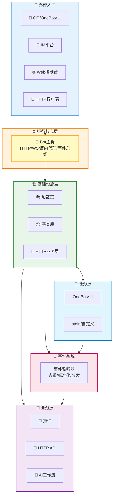

<div align="center">

# 🚀 XRK-AGT

**多平台、多Tasker、工作流驱动型智能体平台**

[](https://opensource.org/licenses/MIT)
[](https://nodejs.org/)
[](https://github.com/sunflowermm/XRK-AGT)
[](https://github.com/sunflowermm/XRK-AGT)

**最后更新**: 2026-02-12 | **跨平台支持**: Windows 10+ / Linux / macOS / Docker | **Node.js 版本要求**: ≥ 24.12.0 (LTS)

</div>

<div align="center">

### 联合研制单位

<!-- 第一排：沈阳农业大学 -->
<div align="center">
  
</div>

<!-- 第二排：其他五所大学 -->
<div align="center">
  
  
  
  
  
</div>

</div>

XRK-AGT 是由向日葵开发，各个大学志同道合的学生联合研制，基于 Node.js 打造的 **多平台、多Tasker、工作流驱动型智能体平台**，采用分层架构设计，支持：

- **🌐 多平台消息接入**：OneBotv11 / QBQBot / GSUIDCORE / stdin / 自定义 Tasker
- **🔌 插件工作流**：指令插件 + AI 工作流 (AIStream)
- **🌐 Web 与 HTTP/API 服务**：内置 Web 控制台 + REST API + WebSocket
- **⭐ system-Core 内置模块**：10个HTTP API、6个工作流（50+个MCP工具）、4个Tasker、企业级Web控制台
- **🎨 渲染与截图**：基于 Puppeteer / Playwright 的页面渲染与图片输出

**如果你是第一次接触本项目：**

- 仅想**先跑起来**：直接看下面的「快速开始」
- 想**了解整体架构**：先看「架构层次说明」和 [`PROJECT_OVERVIEW.md`](PROJECT_OVERVIEW.md)
- 想**做二次开发/写插件**：阅读 [`docs/README.md`](docs/README.md) 与各子文档

---


---

## 🏗️ 架构层次说明

XRK-AGT 采用清晰的分层架构设计，各层职责明确，便于扩展和维护。



**分层说明**：
- **⚙️ 运行核心层**：统一管理 HTTP/HTTPS/WebSocket、中间件、认证、反向代理、事件总线
- **🏗️ 基础设施层**：提供基类、加载器、HTTP 业务层和数据库客户端
- **📡 任务层**：对接各协议，将平台消息转换为统一事件结构
- **📢 事件系统**：对事件做去重、标准化与预处理，再分发到插件系统
- **💼 业务层**：具体业务实现，包括指令插件、HTTP API 与 AI 工作流

**详细架构说明**：请参见 [`PROJECT_OVERVIEW.md`](PROJECT_OVERVIEW.md)

---

## 🚀 快速开始

### 📥 1. 克隆项目

```bash
# 使用 Github
git clone --depth=1 https://github.com/sunflowermm/XRK-AGT.git

# 或使用 Gitcode
git clone --depth=1 https://gitcode.com/Xrkseek/XRK-AGT.git

cd XRK-AGT
```

### 📦 2. 安装依赖

```bash
# 推荐：pnpm（仅支持 pnpm）
pnpm install
```

### ⚙️ 3. 配置环境变量（可选）

创建 `.env` 文件（用于代理配置等）：

```bash
# 主服务端口（默认 8080）
XRK_SERVER_PORT=8080

# 代理配置（用于模型下载，可选）
HTTP_PROXY=http://host.docker.internal:7890
HTTPS_PROXY=http://host.docker.internal:7890
NO_PROXY=127.0.0.1,localhost

# MongoDB 认证（可选）
MONGO_ROOT_USERNAME=admin
MONGO_ROOT_PASSWORD=password
```

### 🚀 4. 启动服务

XRK-AGT 支持多种启动方式，包括本地运行和 Docker 部署。

#### 🐳 Docker 启动（推荐）

> **提示**：Docker 构建会自动构建子服务端（Python FastAPI），提供 LangChain 和向量服务，无需手动配置。

```bash
# 启动所有服务（包括主服务端和子服务端）
docker-compose up -d

# 查看日志
docker-compose logs -f

# 停止服务
docker-compose down
```

**服务说明**：
- `xrk-agt`: 主服务端（端口：8080）
- `xrk-subserver`: Python 子服务端（端口：8000，自动构建）
- `redis`: Redis 缓存服务（端口：6379）
- `mongodb`: MongoDB 数据库服务（端口：27017）

**详细 Docker 部署指南**：参见 [`docs/docker.md`](docs/docker.md)

#### 💻 本地启动（开发环境）

**Windows/Linux/macOS:**
```bash
# 方式1：使用 app.js（推荐，自动检查依赖）
node app

# 方式2：使用启动脚本
# Windows
start.bat server 8080

# Linux/macOS
chmod +x start.sh
./start.sh server 8080

# 方式3：直接使用 start.js
node start.js server 8080
```

**指定端口：**
```bash
# 方式1：环境变量
XRK_SERVER_PORT=3000 node app

# 方式2：命令行参数
node start.js server 3000
```

**首次启动**：
- 启动后按终端提示完成首次登录配置
- 访问 `http://localhost:8080` 使用 Web 控制台
- 访问 `http://localhost:8080/xrk/` 进入管理界面

**端口配置**：
- 默认端口：8080
- 通过环境变量：`XRK_SERVER_PORT=3000 node app`
- 通过命令行参数：`node start.js server 3000`

---

## ✨ 核心特性

### 🏗️ 分层架构设计

清晰的分层架构，基础设施与业务分离，职责明确，易于维护和扩展。

### 🚀 零配置扩展

只需将代码放置到对应目录即可自动加载，无需手动注册：
- **插件**：`core/*/plugin/my-plugin.js` → 自动加载
- **工作流**：`core/*/stream/my-workflow.js` → 自动注册 MCP 工具
- **HTTP API**：`core/*/http/my-api.js` → 自动注册路由

### 💡 现代技术栈

基于 Node.js 24.12 LTS，充分利用现代 JavaScript 特性：全局 URLPattern API、原生 fetch API、AsyncLocalStorage 优化等。

### 🔧 7 大扩展点

插件系统、工作流系统、Tasker 扩展、事件监听器、HTTP API、渲染器、配置系统，覆盖所有常见扩展需求。

### 🛡️ 生产级可靠性

内置反向代理、HTTP 业务层、安全特性（CORS、Helmet、速率限制），开箱即用，适合生产环境部署。

**详细说明**：参见 [`docs/框架可扩展性指南.md`](docs/框架可扩展性指南.md) 和 [`PROJECT_OVERVIEW.md`](PROJECT_OVERVIEW.md)

---

## 📚 文档与开发指南

### 🔌 在 Cursor 中使用

XRK-AGT 支持 MCP（Model Context Protocol）协议，可在 Cursor 等 AI 编辑器中直接调用。

**快速配置**：

1. 启动 XRK-AGT
2. 配置 Cursor 的 `mcp.json`：
```json
{
  "mcpServers": {
    "xrk-agt": {
      "url": "http://localhost:8080/api/mcp/jsonrpc",
      "transport": "http"
    }
  }
}
```
3. 重启 Cursor 即可使用

**详细文档**：[MCP 完整文档](docs/mcp-guide.md)

---

**框架可扩展性**：[`docs/框架可扩展性指南.md`](docs/框架可扩展性指南.md) — 7 大扩展点、Core 模块开发、扩展示例与最佳实践 ⭐ 推荐

**核心文档索引**（详见 [docs/README.md](docs/README.md) 导航）：

| 模块 | 文档 |
|------|------|
| 概览与运行 | [项目概览](PROJECT_OVERVIEW.md)、[Bot 主类文档](docs/bot.md)、[Server 服务器架构文档](docs/server.md)、[Docker 部署指南](docs/docker.md) |
| system-Core | [system-Core 特性文档](docs/system-core.md) ⭐ - 内置模块完整说明（10个HTTP API、6个工作流、4个Tasker、Web控制台） |
| 任务与事件 | [Tasker 底层规范](docs/tasker-base-spec.md)、[OneBotv11 Tasker 文档](docs/tasker-onebotv11.md)、[Tasker 加载器文档](docs/tasker-loader.md)、[事件系统标准化文档](docs/事件系统标准化文档.md)（包含事件监听器开发指南） |
| 插件 | [插件基类文档](docs/plugin-base.md)、[插件加载器文档](docs/plugins-loader.md) |
| HTTP/API | [HTTP API 基类文档](docs/http-api.md)、[API 加载器文档](docs/api-loader.md) |
| AI / MCP | [AIStream 工作流基类文档](docs/aistream.md)、[工厂系统文档](docs/factory.md)、[子服务端 API 文档](docs/subserver-api.md)、[MCP 完整指南](docs/mcp-guide.md) |
| 配置与渲染 | [配置基类文档](docs/config-base.md)、[渲染器基类文档](docs/renderer.md) |
| 工具与应用 | [BotUtil 工具类文档](docs/botutil.md)、[应用开发指南](docs/app-dev.md) |

---

## ❓ 常见问题

### Q: 如何配置代理？

A: 在 `.env` 文件中配置：
```bash
HTTP_PROXY=http://127.0.0.1:7890
HTTPS_PROXY=http://127.0.0.1:7890
```

### Q: 如何修改服务端口？

A: 三种方式：
1. 环境变量：`XRK_SERVER_PORT=3000 node app`
2. 命令行参数：`node start.js server 3000`
3. 配置文件：修改 `data/server_bots/{port}/server.yaml`

### Q: 如何开发自定义插件？

A: 参考 [插件基类文档](docs/plugin-base.md) 和 [框架可扩展性指南](docs/框架可扩展性指南.md)

### Q: 如何接入新的 IM 平台？

A: 参考 [Tasker 底层规范](docs/tasker-base-spec.md) 和 [Tasker 加载器](docs/tasker-loader.md)

### Q: Docker 部署时子服务端如何配置？

A: Docker 构建会自动包含子服务端，无需手动配置。详见 [Docker 部署指南](docs/docker.md)

---

## 🤝 贡献指南

欢迎贡献代码、文档或提出建议！

- **提交 Issue**：报告 Bug 或提出功能建议
- **提交 PR**：修复 Bug 或添加新功能
- **完善文档**：改进文档内容，帮助其他开发者

---

## 🙏 致谢

- **大学联合研制团队**：持续打磨架构与运行稳定性
- **所有提交 Issue / PR 的社区成员**：为 XRK-AGT 带来了真实场景的需求和改进建议
- **开源生态中的优秀组件作者**：包括 Node.js、Redis、MongoDB、Puppeteer/Playwright 等，为本项目提供了坚实基础

---

## 📄 许可证

本项目由大学联合研制。详见 [LICENSE](LICENSE) 文件。

---

*最后更新：2026-02-12*
