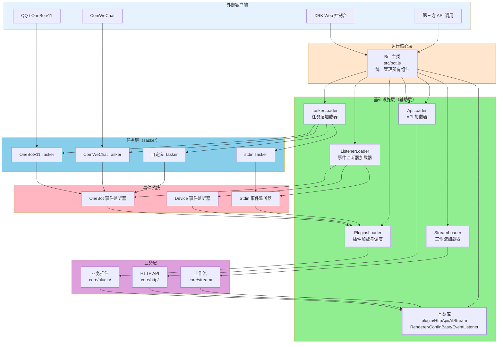
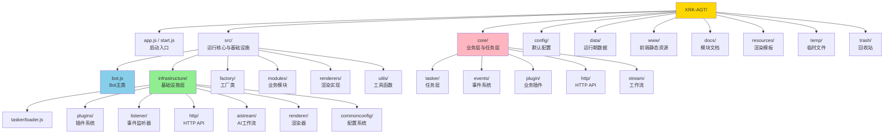
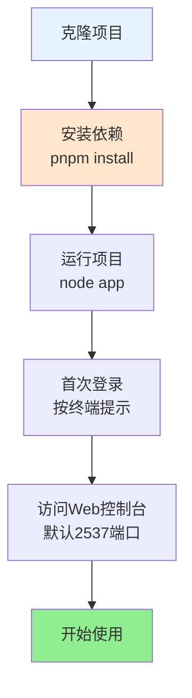

## XRK-AGT v1.0.0

XRK-AGT 是向日葵工作室基于 Node.js 打造的 **多平台、多Tasker、工作流驱动型智能体平台**，采用分层架构设计，支持：

- **多平台消息接入**：OneBotv11 / ComWeChat / 自定义 Tasker
- **插件工作流**：指令插件 + AI 工作流 (`AIStream`)
- **Web 与 HTTP/API 服务**：内置 Web 控制台 + REST API + WebSocket
- **渲染与截图**：基于 Puppeteer / Playwright 的页面渲染与图片输出

**如果你是第一次接触本项目：**

- 仅想**先跑起来**：直接看下面的「快速开始」
- 想**了解整体架构**：先看「架构层次说明」和 [`PROJECT_OVERVIEW.md`](PROJECT_OVERVIEW.md)
- 想**做二次开发/写插件**：阅读 [`docs/README.md`](docs/README.md) + 各子文档（原 `docs/完整文档.md` 内容已合并）

---

## 架构层次说明

XRK-AGT 采用清晰的分层架构，各层职责明确，便于扩展和维护：

### 🏗️ 架构层次图



### 📋 各层职责说明

#### 1. **运行核心层** (`src/bot.js`)
- **职责**：统一管理 HTTP/HTTPS/WebSocket 服务、中间件、认证、反向代理、事件总线 (`Bot.em`)
- **特点**：系统入口，协调所有组件

#### 2. **基础设施层（辅助层）** (`src/infrastructure/`)
- **职责**：提供所有基础设施和基类，为业务层提供通用能力
- **包含**：
  - **加载器**：`TaskerLoader`、`PluginsLoader`、`ApiLoader`、`StreamLoader`、`ListenerLoader`
  - **基类库**：`plugin`（插件基类）、`HttpApi`（API 基类）、`AIStream`（工作流基类）、`Renderer`（渲染器基类）、`ConfigBase`（配置基类）、`EventListener`（事件监听器基类）
  - **数据库客户端**：`redis.js`、`mongodb.js`
  - **配置管理**：`config/`、`commonconfig/`
- **特点**：不包含具体业务逻辑，只提供抽象和工具

#### 3. **任务层（Tasker）** (`core/tasker/`)
- **职责**：对接各平台协议（QQ/微信/自定义），将平台消息转换为统一事件模型，通过 `Bot.em` 触发事件
- **包含**：`OneBotv11.js`、`ComWeChat.js`、`stdin.js` 等
- **特点**：事件生成器，负责协议转换

#### 4. **事件系统** (`core/events/`)
- **职责**：监听 `Bot.em` 事件，进行去重、标记、预处理，然后调用 `PluginsLoader.deal(e)` 分发到插件
- **包含**：`onebot.js`、`device.js`、`stdin.js` 等事件监听器
- **特点**：事件标准化和预处理层

#### 5. **业务层** (`core/`)
- **职责**：实现具体业务逻辑
- **包含**：
  - **业务插件** (`core/plugin/`)：包括 `enhancer/`（增强插件）和 `example/`（示例插件）
  - **HTTP API** (`core/http/`)：具体的 REST/WebSocket API 实现
  - **工作流** (`core/stream/`)：基于 `AIStream` 的业务工作流实现
- **特点**：基于基础设施层的基类实现具体功能

---

## 模块一览表（按层次分类）

### 运行核心层

| 模块 | 主要文件/目录 | 职责概述 |
|------|---------------|----------|
| Bot 主类 | `src/bot.js` | 管理 HTTP/HTTPS/WS 服务、中间件、认证、反向代理、事件总线 (`Bot.em`) 及资源清理 |

### 基础设施层（辅助层）

| 模块 | 主要文件/目录 | 职责概述 |
|------|---------------|----------|
| Tasker 加载器 | `src/infrastructure/tasker/loader.js` | 扫描并加载 `core/tasker/` 中的 Tasker |
| 插件系统基础设施 | `src/infrastructure/plugins/` | 插件基类 `plugin`、插件加载器 `PluginsLoader`、运行时管理 |
| 事件监听器基础设施 | `src/infrastructure/listener/` | 事件监听器基类 `EventListener` 和加载器 |
| HTTP/API 基础设施 | `src/infrastructure/http/` | HTTP API 基类 `HttpApi` 和 `ApiLoader` |
| AI 工作流基础设施 | `src/infrastructure/aistream/` | AI 工作流基类 `AIStream` 和加载器 |
| 渲染器基础设施 | `src/infrastructure/renderer/` | 渲染器基类 `Renderer` 和加载器 |
| 配置系统基础设施 | `src/infrastructure/commonconfig/` | 配置基类 `ConfigBase` 和通用配置封装 |
| 配置加载器 | `src/infrastructure/config/` | 服务端配置管理（端口、HTTPS、CORS 等） |
| 数据库客户端 | `src/infrastructure/redis.js`、`src/infrastructure/mongodb.js` | Redis 和 MongoDB 客户端封装 |

### 任务层（Tasker）

| 模块 | 主要文件/目录 | 职责概述 |
|------|---------------|----------|
| 任务层 | `core/tasker/` | 对接各平台协议，将平台消息转换为统一事件模型，通过 `Bot.em` 触发事件 |

### 事件系统

| 模块 | 主要文件/目录 | 职责概述 |
|------|---------------|----------|
| 事件监听器 | `core/events/` | 监听 `Bot.em` 事件，进行去重、标记、预处理，调用 `PluginsLoader.deal(e)` |

### 业务层

| 模块 | 主要文件/目录 | 职责概述 |
|------|---------------|----------|
| 业务插件 | `core/plugin/` | 具体业务插件实现（包括 `enhancer/` 增强插件和 `example/` 示例插件） |
| HTTP API | `core/http/` | 具体的 REST/WebSocket API 实现 |
| 工作流 | `core/stream/` | 基于 `AIStream` 的业务工作流实现 |

### 工具与辅助

| 模块 | 主要文件/目录 | 职责概述 |
|------|---------------|----------|
| 工具类 | `src/utils/botutil.js`、`src/utils/paths.js` | 封装通用工具方法与路径管理 |
| 渲染实现 | `src/renderers/` | 基于 Puppeteer/Playwright 的渲染实现 |
| 工厂类 | `src/factory/` | ASR/TTS/LLM 工厂类 |

各模块对应的详细说明，请参见 [`docs/README.md`](docs/README.md) 中的模块文档索引。

---

## 项目结构总览（目录 & 作用）

> 更详细的逐目录解析，可参考 [`PROJECT_OVERVIEW.md`](PROJECT_OVERVIEW.md)；这里给出精简但完整的一眼总览。



### 层次关系说明

- **运行核心层** (`src/bot.js`)：系统入口，统一管理所有组件
- **基础设施层** (`src/infrastructure/`)：提供基类和加载器，不包含业务逻辑
- **任务层** (`core/tasker/`)：协议转换，生成统一事件
- **事件系统** (`core/events/`)：事件标准化和预处理
- **业务层** (`core/plugin/`、`core/http/`、`core/stream/`)：具体业务实现

若你想 **改造底层** 或 **做二次开发**，推荐顺序是：

1. 快速扫一遍上面的结构树，了解目录布局
2. 阅读「架构层次说明」理解各层职责
3. 阅读 [`PROJECT_OVERVIEW.md`](PROJECT_OVERVIEW.md) 中的详细目录解析
4. 再进入 [`docs/README.md`](docs/README.md) 与对应模块文档深入具体基类和对象

---

## 使用方法概览（你能拿它干什么）

### 基础运行环境

- Windows / Linux + Chrome / Chromium / Edge（用于渲染功能）
- Node.js ≥ **24.12.0**（LTS 版本，推荐）
- Redis ≥ **5.0.0**
- MongoDB ≥ **4.0.0**（可选，用于持久化存储）

### 典型使用场景

- 搭建 QQ 智能体（聊天机器人、任务助手、数据监控等）
- 在农业等垂直场景中落地「任务流 + AI + 渲染」的自动化工作流
- 作为一个可扩展的 Bot 平台，对接自定义 API 与前端控制台

详细架构与对象说明请参见：

- **项目主文档**：[`PROJECT_OVERVIEW.md`](PROJECT_OVERVIEW.md)
- **文档中心**：[`docs/README.md`](docs/README.md) - 文档导航与各模块索引

---

## 快速开始（5 分钟跑起来）

### 🐳 Docker 部署（推荐）

如果你熟悉 Docker，可以使用 Docker 快速部署：

```bash
# 使用 Docker Compose（默认端口 2537）
docker-compose up -d

# 使用自定义端口
XRK_SERVER_PORT=8080 docker-compose up -d

# 查看日志
docker-compose logs -f xrk-agt
```

**详细 Docker 部署指南**：参见 [`docs/docker.md`](docs/docker.md)

> **提示**：
> - Docker 部署支持通过环境变量 `XRK_SERVER_PORT` 指定端口，默认为 2537
> - 修改端口时需要同时修改 `docker-compose.yml` 中的端口映射和环境变量
> - 支持多实例运行，每个实例使用不同端口

### 本地部署

**快速开始流程图**:



### 克隆项目

```sh
# 使用 Github
git clone --depth=1 https://github.com/sunflowermm/XRK-AGT.git
# 使用 Gitcode
git clone --depth=1 https://gitcode.com/Xrkseek/XRK-AGT.git
cd XRK-AGT
```

### 安装依赖

> 外网环境可先根据需要调整本地 `.npmrc`（如切换为官方源），再安装依赖。  

```sh
# 推荐：pnpm，且仅支持pnpm
pnpm install
```

### 运行与登录

> 首次运行按终端提示完成登录。  
> 支持多开窗口登录，模仿 QQ 客户端的多实例处理方式，保证多 Bot 回复的兼容性。   
> 服务器登录相关插件配置位于 `config/server_config/`，便于迁移。

启动脚本：

```sh
node app   # 或 node start.js
```

启动后可通过浏览器访问配置中的服务地址（默认 2537 端口），具体访问 URL 会在启动日志中打印。

---

## 核心特性（为什么选 XRK-AGT）

### 分层架构设计

- **清晰的层次划分**：运行核心层、基础设施层、任务层、事件系统、业务层职责明确
- **基础设施与业务分离**：基础设施层提供通用能力，业务层专注具体实现
- **易于扩展**：基于基类设计，便于添加新的 Tasker、插件、API 和工作流

### 模块化架构

- **运行核心** (`src/bot.js`)：统一管理 HTTP/HTTPS/WebSocket、反向代理、中间件与认证
- **任务层** (`core/tasker/`)：事件生成器，将各平台协议转换为统一事件模型
- **事件系统** (`core/events/`)：事件标准化、去重、标记和预处理
- **插件系统** (`src/infrastructure/plugins/` + `core/plugin/`)：插件加载与事件调度核心
- **AI 工作流** (`src/infrastructure/aistream/` + `core/stream/`)：AI 工作流抽象层与业务实现
- **HTTP/API** (`src/infrastructure/http/` + `core/http/`)：API 模块与加载器

### 插件与工作流

- 兼容 Yunzai 风格插件开发体验（规则匹配、权限控制、上下文管理）
- **通用工作流系统**：基于 `AIStream` 的通用、可扩展、标准化工作流框架
  - **无特化逻辑**：底层代码不包含任何针对特定业务场景的硬编码
  - **快速构建**：通过函数注册机制，5分钟即可创建自定义工作流
  - **自动上下文传递**：步骤间自动传递执行结果，无需手动管理
  - **标准化接口**：统一的接口和规范，易于集成和扩展
- 内建工作流基类 `AIStream`，支持多种 Embedding 与函数调用（Function Calling）
- 支持增强插件（Enhancer），为特定 Tasker 提供功能增强

### 性能优化

- **Node.js 24.12.0 LTS 优化**：
  - V8 引擎 13.6：提升 JavaScript 执行性能，支持 Float16Array、RegExp.escape、Error.isError 等新特性
  - AsyncLocalStorage 优化：默认使用 AsyncContextFrame，提升异步上下文追踪性能
  - HTTP 客户端升级至 Undici 7：提升网络请求性能和可靠性
  - 全局 URLPattern API：简化路由匹配，无需显式导入
- 并行依赖检查：使用 `Promise.all` 批量检查依赖，提升启动速度
- 并行插件依赖安装：同时处理多个插件的依赖检查与安装
- 批量日志写入：优化日志队列刷新机制，使用批量写入和异步处理
- 高效端口扫描：优化端口列表获取算法，减少文件系统操作

### 生产级能力

- **反向代理**：多域名 + SNI + HTTP/2 + 负载均衡 + 健康检查
- **HTTP业务层**：重定向管理、CDN支持、反向代理增强
- 安全与观测：CORS / Helmet / 速率限制 / 请求日志
- 资源管理：自动清理 `trash/` 目录中的临时文件，适合长期稳定运行

更多详细说明请查看：

- [`docs/bot.md`](docs/bot.md)：`Bot` 主类与生命周期
- [`docs/plugins-loader.md`](docs/plugins-loader.md) / [`docs/plugin-base.md`](docs/plugin-base.md)：插件加载器与插件基类
- [`docs/aistream.md`](docs/aistream.md)：AI 工作流与上下文检索
- [`docs/事件系统标准化文档.md`](docs/事件系统标准化文档.md)：事件系统详细说明

---

## 文档与开发指南

### 🔌 在 Cursor 中使用

XRK-AGT 支持 MCP（Model Context Protocol）协议，可以在 Cursor 等 AI 编辑器中直接调用。

### 快速配置

1. 启动 XRK-AGT：`node app` 或 `node start.js`
2. 配置 Cursor 的 `mcp.json`：
```json
{
  "mcpServers": {
    "xrk-agt": {
      "url": "http://localhost:2537/api/mcp/jsonrpc",
      "transport": "http",
      "description": "XRK-AGT 智能助手服务器"
    }
  }
}
```
3. 重启 Cursor，即可使用！

### 可用功能

- 桌面操作（回桌面、截屏、打开工具等）
- 文件操作（创建Word/Excel、文件管理等）
- 信息查询（系统信息、天气、股票等）
- 工作流管理（多步骤任务自动化）

详细文档：
- [完整 MCP 文档](./docs/mcp-guide.md) - MCP 协议完整指南，包含工具注册、外部平台连接等

#### 🤖 AI 对话/工具（Node）& 智能体/RAG（Python）
- **[`docs/aistream.md`](docs/aistream.md)** - Node 侧单次对话 + MCP 工具调用（复杂多步在 Python 子服务端）
- **[`docs/subserver-api.md`](docs/subserver-api.md)** - Python 子服务端（LangChain/LangGraph + 向量服务）与主服务 v3 的衔接
- **[`docs/mcp-guide.md`](docs/mcp-guide.md)** - **MCP (Model Context Protocol) 完整指南** ⭐
  - MCP概述与架构图
  - MCP服务器与HTTP API
  - 工具注册机制详解
  - 外部平台连接（小智AI、Claude、豆包）
  - 示例工具与开发指南
  - 配置说明

#### 🔧 框架可扩展性（重点）
- **[`docs/框架可扩展性指南.md`](docs/框架可扩展性指南.md)** - **框架可扩展性完整指南** ⭐ 推荐
  - 可扩展性概述与设计原则
  - 7大核心扩展点详解（插件、工作流、Tasker、事件监听器、HTTP API、渲染器、配置）
  - 完整扩展示例和代码模板
  - 扩展开发流程和最佳实践
  - 扩展能力矩阵和特性对比

#### 📖 其他核心文档

##### 运行核心与基础设施
- [`PROJECT_OVERVIEW.md`](PROJECT_OVERVIEW.md)：项目整体架构与目录结构详细说明
- [`docs/bot.md`](docs/bot.md)：Bot 主类详细文档
- **[`docs/server.md`](docs/server.md)** - **Server 服务器架构文档** ⭐ 新
  - 统一的HTTP/HTTPS/WebSocket服务
  - 反向代理系统（多域名、SNI支持）
  - 端口运行逻辑与配置
  - 平台SDK适配度
  - 快速搭建各种通讯协议
- **[`docs/docker.md`](docs/docker.md)** - **Docker 部署指南** ⭐ 新
  - Docker Compose 快速部署
  - 端口配置与多实例运行
  - 数据持久化与健康检查
  - 生产环境建议

##### 任务层与事件系统
- [`docs/tasker-base-spec.md`](docs/tasker-base-spec.md)：Tasker 底层规范（事件生成器规范）
- [`docs/tasker-onebotv11.md`](docs/tasker-onebotv11.md)：OneBot Tasker 详细文档
- [`docs/tasker-loader.md`](docs/tasker-loader.md)：Tasker 加载器文档
- [`docs/事件系统标准化文档.md`](docs/事件系统标准化文档.md)：事件系统详细说明
- [`docs/事件监听器开发指南.md`](docs/事件监听器开发指南.md)：事件监听器开发指南

##### 插件系统
- [`docs/plugin-base.md`](docs/plugin-base.md)：插件基类详细文档
- [`docs/plugins-loader.md`](docs/plugins-loader.md)：插件加载器详细文档

##### HTTP/API
- [`docs/http-api.md`](docs/http-api.md)：HTTP API 基类文档
- [`docs/api-loader.md`](docs/api-loader.md)：API 加载器文档

##### AI 工作流
- [`docs/aistream.md`](docs/aistream.md)：AIStream（Node 单次对话 + MCP 工具调用）
- [`docs/subserver-api.md`](docs/subserver-api.md)：子服务端 API（LangChain/LangGraph + 向量服务）

##### 配置与渲染
- [`docs/config-base.md`](docs/config-base.md)：配置系统详细文档
- [`docs/renderer.md`](docs/renderer.md)：渲染系统详细文档

##### 工具类
- [`docs/botutil.md`](docs/botutil.md)：工具类详细文档
- [`docs/app-dev.md`](docs/app-dev.md)：应用开发详细文档

---

## 致谢

- **向日葵工作室开发与测试团队**：持续打磨架构与运行稳定性
- **所有提交 Issue / PR 的社区成员**：为 XRK-AGT 带来了真实场景的需求和改进建议
- **开源生态中的优秀组件作者**：包括 Node.js、Redis、MongoDB、Puppeteer/Playwright 等，为本项目提供了坚实基础
