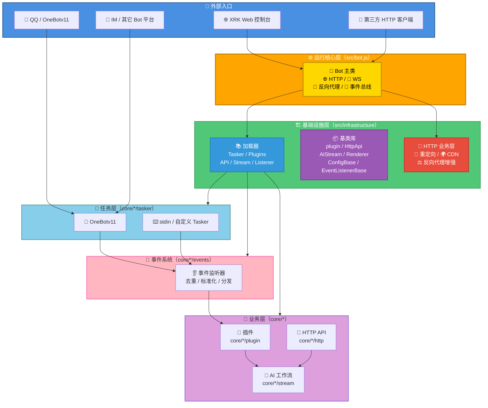
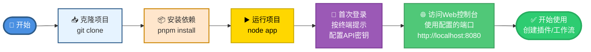

## XRK-AGT v1.0.1

> **最后更新**: 2026-01-27  
> **跨平台支持**: Windows 10+ / Linux / macOS / Docker  
> **Node.js 版本要求**: ≥ 24.12.0 (LTS)

XRK-AGT 是向日葵工作室基于 Node.js 打造的 **多平台、多Tasker、工作流驱动型智能体平台**，采用分层架构设计，支持：

- **多平台消息接入**：OneBotv11 / QBQBot / GSUIDCORE / stdin / 自定义 Tasker
- **插件工作流**：指令插件 + AI 工作流 (`AIStream`)
- **Web 与 HTTP/API 服务**：内置 Web 控制台 + REST API + WebSocket
- **system-Core 内置模块**：10个HTTP API模块、7个工作流（50+个MCP工具）、4个Tasker、企业级Web控制台
- **渲染与截图**：基于 Puppeteer / Playwright 的页面渲染与图片输出

**如果你是第一次接触本项目：**

- 仅想**先跑起来**：直接看下面的「快速开始」
- 想**了解整体架构**：先看「架构层次说明」和 [`PROJECT_OVERVIEW.md`](PROJECT_OVERVIEW.md)
- 想**做二次开发/写插件**：阅读 [`docs/README.md`](docs/README.md) 与各子文档

---

## 架构层次说明

XRK-AGT 采用清晰的分层架构设计，各层职责明确，便于扩展和维护。

**一图总览：**



**详细架构说明**：请参见 [`PROJECT_OVERVIEW.md`](PROJECT_OVERVIEW.md) 的「架构层次总览」章节。

**文字版分层摘要：**
- **运行核心层**（`src/bot.js`）：统一管理 HTTP/HTTPS/WebSocket、中间件、认证、反向代理、事件总线 `Bot.em`。
- **基础设施层**（`src/infrastructure/`）：提供基类、加载器、HTTP 业务层和数据库客户端，不包含业务逻辑。
- **任务层**（`core/*/tasker/`）：对接各协议，将平台消息转换为统一事件结构。
- **事件系统**（`core/*/events/`）：对事件做去重、标准化与预处理，再分发到插件系统。
- **业务层**（`core/*/(plugin|http|stream)/`）：具体业务实现，包括指令插件、HTTP API 与 AI 工作流。

**system-Core 内置模块**：XRK-AGT 内置了完整的 system-Core 模块，提供开箱即用的功能。详见 [`docs/system-core.md`](docs/system-core.md)。

若你想 **改造底层** 或 **做二次开发**，推荐顺序是：

1. 阅读 [`PROJECT_OVERVIEW.md`](PROJECT_OVERVIEW.md) 了解详细架构和目录结构
2. 阅读 [`docs/README.md`](docs/README.md) 与对应模块文档深入具体基类和对象
3. 参考 [`docs/system-core.md`](docs/system-core.md) 了解内置模块的实际实现

---

## 快速开始（5 分钟跑起来）

### 🐳 Docker 部署（推荐）

如果你熟悉 Docker，可以使用 Docker 快速部署：

```bash
# 使用 Docker Compose（端口可通过环境变量配置）
docker-compose up -d

# 使用自定义端口
XRK_SERVER_PORT=8080 docker-compose up -d

# 查看日志
docker-compose logs -f xrk-agt
```

**详细 Docker 部署指南**：参见 [`docs/docker.md`](docs/docker.md)

> **提示**：
> - Docker 部署支持通过环境变量 `XRK_SERVER_PORT` 指定端口
> - 修改端口时需要同时修改 `docker-compose.yml` 中的端口映射和环境变量
> - 支持多实例运行，每个实例使用不同端口

### 本地部署

**快速开始流程图**:



### 克隆项目

```sh
# 使用 Github
git clone --depth=1 https://github.com/sunflowermm/XRK-AGT.git
# 使用 Gitcode
git clone --depth=1 https://gitcode.com/Xrkseek/XRK-AGT.git
cd XRK-AGT
```

### 安装依赖

> 外网环境可先根据需要调整本地 `.npmrc`（如切换为官方源），再安装依赖。  

```sh
# 推荐：pnpm，且仅支持pnpm
pnpm install
```

### 运行与登录

> 首次运行按终端提示完成登录。  
> 支持多开窗口登录，模仿 QQ 客户端的多实例处理方式，保证多 Bot 回复的兼容性。   
> API 密钥等配置位于 `config/server_config/`，主配置与 Bot 配置位于 `data/server_bots/`，便于迁移。

**启动方式（跨平台支持）**：

**Windows:**
```cmd
REM 方式1：使用 app.js（推荐，自动检查依赖）
node app

REM 方式2：使用启动脚本
start.bat server 8080

REM 方式3：直接使用 start.js
node start.js server 8080
```

**Linux/macOS:**
```bash
# 方式1：使用 app.js（推荐，自动检查依赖）
node app

# 方式2：使用启动脚本（需要先添加执行权限）
chmod +x start.sh
./start.sh server 8080

# 方式3：直接使用 start.js
node start.js server 8080
```

**Docker:**
```bash
# 使用 Docker Compose（推荐）
docker-compose up -d

# 或使用 Dockerfile
docker build -t xrk-agt .
docker run -d -p 8080:8080 -e XRK_SERVER_PORT=8080 xrk-agt
```

启动后可通过浏览器访问配置中的服务地址，具体访问 URL 和端口会在启动日志中打印。

**端口配置**：
- 默认端口：8080
- 通过环境变量指定：`XRK_SERVER_PORT=3000 node app`
- 通过命令行参数指定：`node start.js server 3000`
- Docker 环境：通过 `docker-compose.yml` 或环境变量配置

---

## 为什么选择 XRK-AGT？

在众多 Bot 框架中，XRK-AGT 以其**先进的设计理念、卓越的开发体验和强大的扩展能力**脱颖而出。以下是我选择并推荐 XRK-AGT 的核心原因：

### 🏗️ 架构设计的先进性

**分层架构 + 基础设施与业务分离**：XRK-AGT 采用清晰的分层架构设计，每一层职责明确，互不干扰。基础设施层（`src/infrastructure/`）专注于提供通用能力，不包含任何业务逻辑；业务层（`core/*/`）基于基类扩展，专注于具体实现。这种设计带来的好处是：

- **易于维护**：修改业务逻辑不会影响基础设施，升级基础设施不会破坏业务代码
- **易于测试**：各层可以独立测试，降低测试复杂度
- **易于扩展**：新增功能只需在对应层添加代码，无需修改其他层

**无特化逻辑原则**：框架底层代码不包含任何针对特定业务场景的硬编码，所有特化逻辑都通过扩展点实现。这意味着：

- **真正的通用性**：框架可以适配任何业务场景，不会被特定需求绑架
- **长期可维护性**：不会因为业务变化而需要重构底层代码
- **清晰的边界**：开发者明确知道哪些是框架能力，哪些是业务实现

### 🚀 开发体验的优越性

**零配置扩展**：XRK-AGT 的扩展机制极其简单，只需将代码放置到对应目录即可自动加载：

- **插件**：`core/*/plugin/my-plugin.js` → 自动加载，无需注册
- **工作流**：`core/*/stream/my-workflow.js` → 自动加载，自动注册 MCP 工具
- **HTTP API**：`core/*/http/my-api.js` → 自动加载，自动注册路由
- **事件监听器**：`core/*/events/my-listener.js` → 自动加载，自动注册事件

**基类设计 + 自动加载**：所有扩展都基于统一的基类，通过继承即可快速实现功能。加载器自动发现和加载扩展，无需手动配置。这种设计带来的好处是：

- **学习成本低**：只需了解基类接口，即可快速上手
- **开发效率高**：5分钟即可创建一个完整的工作流或插件
- **代码质量高**：基类保证了代码的一致性和规范性

**热重载支持**：修改代码后自动重载，无需重启服务。这对于开发调试来说极其友好，大大提升了开发效率。

### 💡 技术栈的前瞻性

**Node.js 24.12 LTS**：XRK-AGT 基于最新的 Node.js LTS 版本，充分利用了现代 JavaScript 特性：

- **V8 13.6 引擎**：更快的执行速度，支持 Float16Array、RegExp.escape、Error.isError 等新特性
- **AsyncLocalStorage 优化**：默认使用 AsyncContextFrame，提升异步上下文追踪性能
- **全局 URLPattern API**：无需导入，直接使用路径匹配
- **原生 fetch API**：使用 AbortController 控制超时，性能更优

**现代 JavaScript 实践**：框架代码大量使用 ES6+ 特性，代码简洁、可读性强，符合现代开发规范。

### 🔧 可扩展性的强大

**7 大扩展点**：XRK-AGT 提供了 7 个核心扩展点，覆盖了所有常见的扩展需求：

1. **插件系统**：基于 `plugin` 基类，支持规则匹配、权限控制、上下文管理
2. **工作流系统**：基于 `AIStream` 基类，支持 Function Calling、Embedding、MCP 工具注册
3. **Tasker 扩展**：支持自定义协议适配器，轻松接入新平台
4. **事件监听器**：基于 `EventListenerBase` 基类，支持自定义事件源
5. **HTTP API**：基于 `HttpApi` 基类，支持 REST API 和 WebSocket
6. **渲染器**：基于 `Renderer` 基类，支持 Puppeteer / Playwright
7. **配置系统**：基于 `ConfigBase` 基类，支持 YAML/JSON 配置

**Core 模块架构**：框架支持多 Core 模块，每个 Core 是一个独立的业务模块，可以包含所有类型的扩展。这种设计带来的好处是：

- **模块化开发**：不同业务可以独立开发，互不干扰
- **易于复用**：Core 模块可以在不同项目中复用
- **清晰的边界**：业务代码和框架代码完全分离

### 🛡️ 生产级的可靠性

**反向代理系统**：内置完整的反向代理功能，支持多域名、SNI、HTTP/2、负载均衡和健康检查。这使得 XRK-AGT 可以直接作为生产环境的网关使用，无需额外的 Nginx 或 Traefik。

**HTTP 业务层**：提供重定向管理、CDN 支持、反向代理增强等企业级功能，满足复杂业务场景的需求。

**安全与观测**：内置 CORS、Helmet、速率限制、请求日志等安全特性，开箱即用。

**资源管理**：自动清理临时文件，支持长期稳定运行，适合生产环境部署。

### 🌐 实际应用价值

**多平台支持**：支持 OneBotv11、QBQBot、GSUIDCORE、stdin 等多种平台，一套代码适配多个平台。

**工作流驱动**：基于 AIStream 的工作流系统，支持 Function Calling、Embedding、MCP 工具注册，可以快速构建复杂的 AI 应用。

**MCP 协议支持**：支持 Model Context Protocol，可以与 Cursor、Claude、豆包等外部 AI 平台无缝集成。

**跨平台部署**：支持 Windows、Linux、macOS 和 Docker，一次开发，到处运行。

### 📊 总结

选择 XRK-AGT 的理由可以概括为：**先进的设计理念 + 卓越的开发体验 + 强大的扩展能力 + 生产级的可靠性**。无论你是想要快速构建一个 Bot 应用，还是想要构建一个复杂的智能体平台，XRK-AGT 都能为你提供坚实的基础和强大的能力。

更重要的是，XRK-AGT 不仅仅是一个框架，更是一个**可扩展的架构**。你可以基于它快速构建自己的业务，也可以深入底层进行定制化改造。这种灵活性是其他框架难以提供的。

更多说明见 [文档与开发指南](#文档与开发指南) 及 [docs/README.md](docs/README.md)。

---

## 文档与开发指南

### 🔌 在 Cursor 中使用

XRK-AGT 支持 MCP（Model Context Protocol）协议，可以在 Cursor 等 AI 编辑器中直接调用。

### 快速配置

1. 启动 XRK-AGT：`node app` 或 `node start.js`
2. 配置 Cursor 的 `mcp.json`（将端口替换为实际使用的端口）：
```json
{
  "mcpServers": {
    "xrk-agt": {
      "url": "http://localhost:8080/api/mcp/jsonrpc",
      "transport": "http",
      "description": "XRK-AGT 智能助手服务器"
    }
  }
}
```
3. 重启 Cursor，即可使用！

### 可用功能

- 桌面操作（回桌面、截屏、打开工具等）
- 文件操作（创建Word/Excel、文件管理等）
- 信息查询（系统信息、天气、股票等）
- 工作流管理（多步骤任务自动化）

**详细文档**：[完整 MCP 文档](docs/mcp-guide.md)（工具注册、外部平台连接等）

---

**框架可扩展性**：[`docs/框架可扩展性指南.md`](docs/框架可扩展性指南.md) — 7 大扩展点、Core 模块开发、扩展示例与最佳实践 ⭐ 推荐

**核心文档索引**（详见 [docs/README.md](docs/README.md) 导航）：

| 模块 | 文档 |
|------|------|
| 概览与运行 | [PROJECT_OVERVIEW](PROJECT_OVERVIEW.md)、[bot](docs/bot.md)、[server](docs/server.md)、[docker](docs/docker.md) |
| system-Core | [system-Core 特性](docs/system-core.md) ⭐ - 内置模块完整说明（10个HTTP API、7个工作流、4个Tasker、Web控制台） |
| 任务与事件 | [tasker-base-spec](docs/tasker-base-spec.md)、[tasker-onebotv11](docs/tasker-onebotv11.md)、[tasker-loader](docs/tasker-loader.md)、[事件系统标准化文档](docs/事件系统标准化文档.md)（包含事件监听器开发指南） |
| 插件 | [plugin-base](docs/plugin-base.md)、[plugins-loader](docs/plugins-loader.md) |
| HTTP/API | [http-api](docs/http-api.md)、[api-loader](docs/api-loader.md) |
| AI / MCP | [aistream](docs/aistream.md)、[factory](docs/factory.md)、[subserver-api](docs/subserver-api.md)、[mcp-guide](docs/mcp-guide.md) |
| 配置与渲染 | [config-base](docs/config-base.md)、[renderer](docs/renderer.md) |
| 工具与应用 | [botutil](docs/botutil.md)、[app-dev](docs/app-dev.md) |

---

## 致谢

- **向日葵工作室开发与测试团队**：持续打磨架构与运行稳定性
- **所有提交 Issue / PR 的社区成员**：为 XRK-AGT 带来了真实场景的需求和改进建议
- **开源生态中的优秀组件作者**：包括 Node.js、Redis、MongoDB、Puppeteer/Playwright 等，为本项目提供了坚实基础
