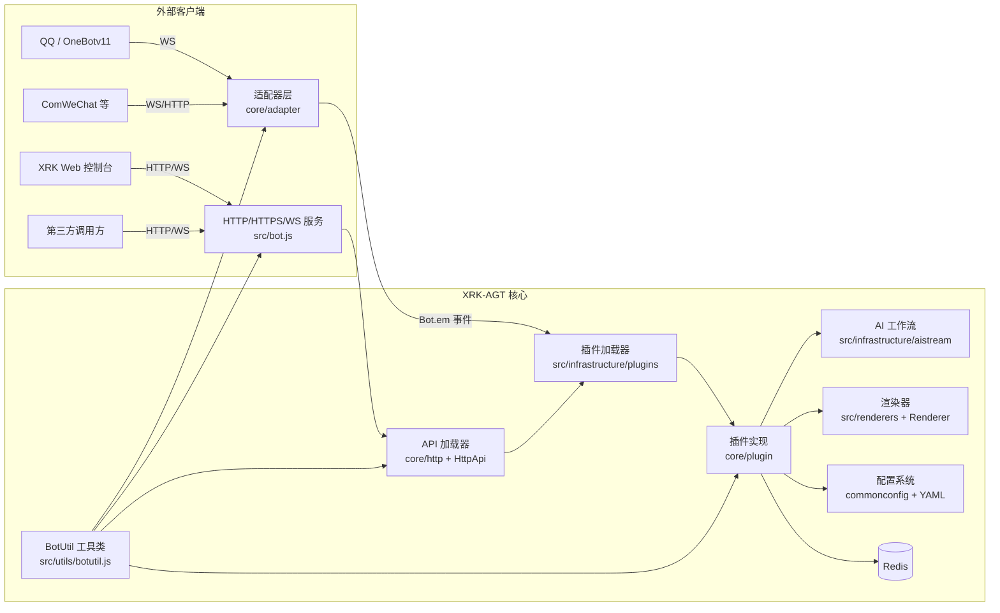

## XRK-AGT v1.0.0


XRK-AGT 是向日葵工作室基于 Node.js 打造的 **多语言、多适配器、工作流驱动型智能体平台**，支持：

- **多平台消息接入**：OneBotv11 / ComWeChat / 自定义适配器。
- **插件工作流**：指令插件 + AI 工作流 (`AIStream`)。
- **Web 与 HTTP/API 服务**：内置 Web 控制台 + REST API + WebSocket。
- **渲染与截图**：基于 Puppeteer / Playwright 的页面渲染与图片输出。

想快速理解整体架构与对象关系，请优先阅读：`PROJECT_OVERVIEW.md` 与 `docs/README.md`。

---

## 架构总览图（核心组件关系）



---

## 模块一览表

| 模块 | 主要文件/目录 | 职责概述 |
|------|---------------|----------|
| 运行核心 | `src/bot.js` | 管理 HTTP/HTTPS/WS 服务、中间件、认证、反向代理、事件派发及资源清理 |
| 适配器层 | `core/adapter/` | 对接 QQ/ComWeChat 等平台协议，将上报转译为统一事件模型 |
| 插件系统 | `src/infrastructure/plugins/`、`core/plugin/` | 扫描加载插件、规则匹配、上下文管理与定时任务调度 |
| HTTP/API | `core/http/`、`src/infrastructure/http/` | 定义 REST/WS API 模块并统一由 `ApiLoader` 挂载到 Express |
| AI 工作流 | `src/infrastructure/aistream/` | 封装 Chat Completion、Embedding、函数调用与上下文增强 |
| 渲染子系统 | `src/renderers/`、`src/infrastructure/renderer/` | 基于模板 + 浏览器引擎生成图片/HTML 等输出 |
| 配置系统 | `config/default_config/`、`src/infrastructure/commonconfig/` | 提供 YAML/JSON 配置读写与校验，抽象为 `ConfigBase` |
| 工具与路径 | `src/utils/botutil.js`、`src/utils/paths.js` | 封装通用工具方法与路径管理，为所有模块提供基础能力 |

各模块对应的详细说明，请参见 `docs/README.md` 中的模块文档索引。

---

## 使用方法概览

- **基础运行环境**
  - Windows / Linux + Chrome / Chromium / Edge（用于渲染功能）。
  - Node.js ≥ **18.14.0**。
  - Redis ≥ **5.0.0**。

- **典型使用场景**
  - 搭建 QQ 智能体（聊天机器人、任务助手、数据监控等）。
  - 在农业等垂直场景中落地「任务流 + AI + 渲染」的自动化工作流。
  - 作为一个可扩展的 Bot 平台，对接自定义 API 与前端控制台。

详细架构与对象说明请参见：

- **项目主文档**：`PROJECT_OVERVIEW.md`
- **模块文档索引**：`docs/README.md`

---

## 快速开始

### 克隆项目

```sh
# 使用 Github
git clone --depth=1 https://github.com/Xrkseek/XRK-AGT.git
cd XRK-AGT
```

### 安装依赖

> 外网环境可先根据需要调整本地 `.npmrc`（如切换为官方源），再安装依赖。  
> 国内环境一般可直接安装；若个别依赖安装失败，可在运行后通过向日葵插件发送 `#打依赖` 自动补齐。

```sh
# 推荐：pnpm
pnpm install

# 或使用 npm
npm install
```

### 运行与登录（无需先手动「打依赖」）

> 首次运行按终端提示完成登录。  
> 支持多开窗口登录，模仿 QQ 客户端的多实例处理方式，保证多 Bot 回复的兼容性。  
> 与 Yunzai-Bot v3 不同，icqq 登录配置文件存放在 `data/bots/<QQ号>/`；  
> 服务器登录相关插件配置位于 `config/server_config/`，便于迁移。

启动脚本：

```sh
node app   # 或 node start.js
```

启动后可通过浏览器访问配置中的服务地址（默认 2537 端口），具体访问 URL 会在启动日志中打印。

---

## 核心特性

- **模块化架构**
  - `src/bot.js`：统一管理 HTTP/HTTPS/WebSocket、反向代理、中间件与认证。
  - `core/adapter`：适配器层（QQ / WeChat / 自定义协议）。
  - `src/infrastructure/plugins`：插件加载与事件调度核心。
  - `src/infrastructure/aistream`：AI 工作流抽象层。
  - `core/http` + `src/infrastructure/http`：API 模块与加载器。

- **插件与工作流**
  - 兼容 Yunzai 风格插件开发体验（规则匹配、权限控制、上下文管理）。
  - 内建工作流基类 `AIStream`，支持多种 Embedding 与函数调用（Function Calling）。

- **生产级能力**
  - 反向代理：多域名 + SNI + HTTP/2。
  - 安全与观测：CORS / Helmet / 速率限制 / 请求日志。
  - 资源管理：自动清理 `trash/` 目录中的临时文件，适合长期稳定运行。

更多详细说明请查看：

- `docs/bot.md`：`Bot` 主类与生命周期。
- `docs/plugins-loader.md` / `docs/plugin-base.md`：插件加载器与插件基类。
- `docs/aistream.md`：AI 工作流与上下文检索。

---

## 文档与开发指南

- **总览文档**
  - `docs/README.md`：模块文档导航（Bot / 插件 / 适配器 / AI 工作流 / HTTP API / 配置 / 渲染 / 工具 / 应用开发等）。
  - `docs/app-dev.md`：从 `app.js` 引导到 `Bot`，并串联插件、API、配置、渲染器与 Web 前端的综合指南。

- **模块文档（docs/）**
  - `bot.md`：`Bot` 主类与服务生命周期。
  - `plugin-base.md` / `plugins-loader.md`：插件基类与加载器。
  - `adapter-loader.md` / `adapter-onebotv11.md`：适配器加载与 QQ OneBotv11 说明。
  - `aistream.md`：AI 工作流基类与 Embedding / Function Calling。
  - `http-api.md` / `api-loader.md`：HTTP API 基类与 API 加载器。
  - `config-base.md`：配置基类与路径/校验规则。
  - `renderer.md`：渲染器基类与模板机制。
  - `botutil.md`：全局工具类（日志、缓存、文件、HTTP、批处理等）。

- **Bug 修复与变更文档（可选阅读）**
  - `INDEX.md`：修复文档索引。
  - `FIX_README.md` / `EXECUTIVE_SUMMARY.md` / `TECHNICAL_SUMMARY.md` 等：历史问题的详细修复说明。

---

## XRK-AGT 后续计划（节选）

- **已完成**
  - PM2 启动方式支持。
  - 开源对接任务处理器（对接 MySQL、微信公众号等）。
  - 投入农业场景实践使用。
  - 剥离 icqq 等底层以便类型扩展与二次开发。
  - 规范化任务处理逻辑与类型定义。

- **规划方向**
  - 丰富官方插件与 AI 工作流示例。
  - 提供更完善的 Web 控制台与可视化配置工具。

---

## 致谢

- **向日葵工作室开发与测试团队**：持续打磨架构与运行稳定性。  
- **所有提交 Issue / PR 的社区成员**：为 XRK-AGT 带来了真实场景的需求和改进建议。  
- **开源生态中的优秀组件作者**：包括 Node.js、Redis、Puppeteer/Playwright 等，为本项目提供了坚实基础。  


