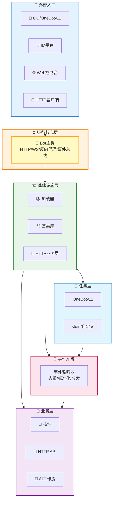

<div align="center">

# 🚀 XRK-AGT

**多平台、多Tasker、工作流驱动型智能体平台**

[](https://opensource.org/licenses/MIT)
[](https://nodejs.org/)
[](https://github.com/sunflowermm/XRK-AGT)
[](https://github.com/sunflowermm/XRK-AGT)

**最后更新**: 2026-02-12 | **跨平台支持**: Windows 10+ / Linux / macOS / Docker | **Node.js 版本要求**: ≥ 24.12.0 (LTS)

</div>

<div align="center">

### 联合研制单位

<!-- 第一排：沈阳农业大学 -->
<div style="display: flex; justify-content: center; align-items: center; margin: 20px 0;">
  
</div>

<!-- 第二排：其他五所大学 -->
<div style="display: flex; justify-content: center; align-items: center; gap: 24px; flex-wrap: wrap; margin: 20px 0;">
  
  
  
  
  
</div>

</div>

<div align="center">

<p style="font-size: 18px; color: #666; margin: 20px 0;">
  XRK-AGT 是由向日葵开发，各个大学志同道合的学生联合研制，基于 Node.js 打造的<br>
  <strong style="color: #1976D2; font-size: 20px;">多平台、多Tasker、工作流驱动型智能体平台</strong>
</p>

</div>

<div style="display: grid; grid-template-columns: repeat(auto-fit, minmax(280px, 1fr)); gap: 20px; margin: 30px 0;">

<div style="background: linear-gradient(135deg, #667eea 0%, #764ba2 100%); padding: 20px; border-radius: 12px; color: white; box-shadow: 0 4px 12px rgba(0,0,0,0.15);">
  <h3 style="margin-top: 0; color: white;">🌐 多平台消息接入</h3>
  <p style="margin-bottom: 0; color: rgba(255,255,255,0.9);">OneBotv11 / QBQBot / GSUIDCORE / stdin / 自定义 Tasker</p>
</div>

<div style="background: linear-gradient(135deg, #f093fb 0%, #f5576c 100%); padding: 20px; border-radius: 12px; color: white; box-shadow: 0 4px 12px rgba(0,0,0,0.15);">
  <h3 style="margin-top: 0; color: white;">🔌 插件工作流</h3>
  <p style="margin-bottom: 0; color: rgba(255,255,255,0.9);">指令插件 + AI 工作流 (AIStream)</p>
</div>

<div style="background: linear-gradient(135deg, #4facfe 0%, #00f2fe 100%); padding: 20px; border-radius: 12px; color: white; box-shadow: 0 4px 12px rgba(0,0,0,0.15);">
  <h3 style="margin-top: 0; color: white;">🌐 Web 与 HTTP/API 服务</h3>
  <p style="margin-bottom: 0; color: rgba(255,255,255,0.9);">内置 Web 控制台 + REST API + WebSocket</p>
</div>

<div style="background: linear-gradient(135deg, #43e97b 0%, #38f9d7 100%); padding: 20px; border-radius: 12px; color: white; box-shadow: 0 4px 12px rgba(0,0,0,0.15);">
  <h3 style="margin-top: 0; color: white;">⭐ system-Core 内置模块</h3>
  <p style="margin-bottom: 0; color: rgba(255,255,255,0.9);">10个HTTP API、6个工作流（50+个MCP工具）、4个Tasker、企业级Web控制台</p>
</div>

<div style="background: linear-gradient(135deg, #fa709a 0%, #fee140 100%); padding: 20px; border-radius: 12px; color: white; box-shadow: 0 4px 12px rgba(0,0,0,0.15);">
  <h3 style="margin-top: 0; color: white;">🎨 渲染与截图</h3>
  <p style="margin-bottom: 0; color: rgba(255,255,255,0.9);">基于 Puppeteer / Playwright 的页面渲染与图片输出</p>
</div>

</div>

<div align="center">

### 🎯 快速导航

<div style="display: flex; justify-content: center; gap: 15px; flex-wrap: wrap; margin: 20px 0;">

<a href="#快速开始" style="text-decoration: none;">
  <div style="background: #f5f5f5; padding: 12px 24px; border-radius: 8px; border: 2px solid #1976D2; color: #1976D2; font-weight: bold; transition: all 0.3s;">
    🚀 快速开始
  </div>
</a>

<a href="#架构层次说明" style="text-decoration: none;">
  <div style="background: #f5f5f5; padding: 12px 24px; border-radius: 8px; border: 2px solid #388E3C; color: #388E3C; font-weight: bold; transition: all 0.3s;">
    🏗️ 架构说明
  </div>
</a>

<a href="PROJECT_OVERVIEW.md" style="text-decoration: none;">
  <div style="background: #f5f5f5; padding: 12px 24px; border-radius: 8px; border: 2px solid #7B1FA2; color: #7B1FA2; font-weight: bold; transition: all 0.3s;">
    📖 项目概览
  </div>
</a>

<a href="docs/README.md" style="text-decoration: none;">
  <div style="background: #f5f5f5; padding: 12px 24px; border-radius: 8px; border: 2px solid #F57C00; color: #F57C00; font-weight: bold; transition: all 0.3s;">
    📚 开发文档
  </div>
</a>

</div>

</div>

---

<div align="center">

<div style="background: linear-gradient(135deg, #667eea 0%, #764ba2 100%); padding: 30px; border-radius: 16px; margin: 30px 0; color: white; box-shadow: 0 8px 24px rgba(0,0,0,0.2);">

<h2 style="margin: 0; color: white; font-size: 28px;">✨ 多平台智能体平台</h2>
<p style="margin: 10px 0 0 0; color: rgba(255,255,255,0.9); font-size: 18px;">工作流驱动架构 · 零配置扩展 · 企业级可靠性</p>

</div>

</div>

---

<div align="center">

## 🏗️ 架构层次说明

<p style="font-size: 16px; color: #666; margin: 10px 0;">
  XRK-AGT 采用清晰的分层架构设计，各层职责明确，便于扩展和维护。
</p>

</div>



<div style="background: linear-gradient(135deg, #f5f7fa 0%, #c3cfe2 100%); padding: 25px; border-radius: 12px; margin: 20px 0; box-shadow: 0 4px 12px rgba(0,0,0,0.1);">

<h3 style="margin-top: 0; color: #1976D2;">📋 分层说明</h3>

<div style="display: grid; grid-template-columns: repeat(auto-fit, minmax(200px, 1fr)); gap: 15px;">

<div style="background: white; padding: 15px; border-radius: 8px; border-left: 4px solid #F57C00;">
  <strong style="color: #F57C00;">⚙️ 运行核心层</strong><br>
  <small style="color: #666;">统一管理 HTTP/HTTPS/WebSocket、中间件、认证、反向代理、事件总线</small>
</div>

<div style="background: white; padding: 15px; border-radius: 8px; border-left: 4px solid #388E3C;">
  <strong style="color: #388E3C;">🏗️ 基础设施层</strong><br>
  <small style="color: #666;">提供基类、加载器、HTTP 业务层和数据库客户端</small>
</div>

<div style="background: white; padding: 15px; border-radius: 8px; border-left: 4px solid #0277BD;">
  <strong style="color: #0277BD;">📡 任务层</strong><br>
  <small style="color: #666;">对接各协议，将平台消息转换为统一事件结构</small>
</div>

<div style="background: white; padding: 15px; border-radius: 8px; border-left: 4px solid #C2185B;">
  <strong style="color: #C2185B;">📢 事件系统</strong><br>
  <small style="color: #666;">对事件做去重、标准化与预处理，再分发到插件系统</small>
</div>

<div style="background: white; padding: 15px; border-radius: 8px; border-left: 4px solid #7B1FA2;">
  <strong style="color: #7B1FA2;">💼 业务层</strong><br>
  <small style="color: #666;">具体业务实现，包括指令插件、HTTP API 与 AI 工作流</small>
</div>

</div>

<p style="text-align: center; margin-top: 20px; margin-bottom: 0;">
  <strong>详细架构说明</strong>：请参见 <a href="PROJECT_OVERVIEW.md">📖 PROJECT_OVERVIEW.md</a>
</p>

</div>

---

<div align="center">

## 🚀 快速开始

</div>

<div style="background: #f8f9fa; padding: 20px; border-radius: 12px; margin: 20px 0; border-left: 5px solid #1976D2;">

<h3 style="margin-top: 0; color: #1976D2;">📥 1. 克隆项目</h3>

```bash
# 使用 Github
git clone --depth=1 https://github.com/sunflowermm/XRK-AGT.git

# 或使用 Gitcode
git clone --depth=1 https://gitcode.com/Xrkseek/XRK-AGT.git

cd XRK-AGT
```

</div>

<div style="background: #f8f9fa; padding: 20px; border-radius: 12px; margin: 20px 0; border-left: 5px solid #388E3C;">

<h3 style="margin-top: 0; color: #388E3C;">📦 2. 安装依赖</h3>

```bash
# 推荐：pnpm（仅支持 pnpm）
pnpm install
```

</div>

<div style="background: #f8f9fa; padding: 20px; border-radius: 12px; margin: 20px 0; border-left: 5px solid #7B1FA2;">

<h3 style="margin-top: 0; color: #7B1FA2;">⚙️ 3. 配置环境变量（可选）</h3>

<p>创建 <code>.env</code> 文件（用于代理配置等）：</p>

```bash
# 主服务端口（默认 8080）
XRK_SERVER_PORT=8080

# 代理配置（用于模型下载，可选）
HTTP_PROXY=http://host.docker.internal:7890
HTTPS_PROXY=http://host.docker.internal:7890
NO_PROXY=127.0.0.1,localhost

# MongoDB 认证（可选）
MONGO_ROOT_USERNAME=admin
MONGO_ROOT_PASSWORD=password
```

<div style="background: #f8f9fa; padding: 20px; border-radius: 12px; margin: 20px 0; border-left: 5px solid #F57C00;">

<h3 style="margin-top: 0; color: #F57C00;">🚀 4. 启动服务</h3>

<p style="color: #666;">XRK-AGT 支持多种启动方式，包括本地运行和 Docker 部署。</p>

</div>

<div style="background: linear-gradient(135deg, #667eea 0%, #764ba2 100%); padding: 25px; border-radius: 12px; margin: 25px 0; color: white; box-shadow: 0 4px 12px rgba(0,0,0,0.15);">

<h4 style="margin-top: 0; color: white;">🐳 Docker 启动（推荐）</h4>

<blockquote style="border-left: 4px solid rgba(255,255,255,0.5); padding-left: 15px; margin: 15px 0; color: rgba(255,255,255,0.9);">
  <strong>提示</strong>：Docker 构建会自动构建子服务端（Python FastAPI），提供 LangChain 和向量服务，无需手动配置。
</blockquote>

<pre style="background: rgba(0,0,0,0.2); padding: 15px; border-radius: 8px; overflow-x: auto; color: white;"><code># 启动所有服务（包括主服务端和子服务端）
docker-compose up -d

# 查看日志
docker-compose logs -f

# 停止服务
docker-compose down</code></pre>

<div style="background: rgba(0,0,0,0.2); padding: 15px; border-radius: 8px; margin-top: 15px;">
  <p style="margin-top: 0; color: white;"><strong>服务说明</strong>：</p>
  <ul style="color: rgba(255,255,255,0.9); margin-bottom: 0;">
    <li><code>xrk-agt</code>: 主服务端（端口：8080）</li>
    <li><code>xrk-subserver</code>: Python 子服务端（端口：8000，自动构建）</li>
    <li><code>redis</code>: Redis 缓存服务（端口：6379）</li>
    <li><code>mongodb</code>: MongoDB 数据库服务（端口：27017）</li>
  </ul>
</div>

<p style="margin-bottom: 0; color: rgba(255,255,255,0.9);">
  <strong>详细 Docker 部署指南</strong>：参见 <a href="docs/docker.md" style="color: white; text-decoration: underline;">docs/docker.md</a>
</p>

</div>

</div>

<div style="background: linear-gradient(135deg, #f093fb 0%, #f5576c 100%); padding: 25px; border-radius: 12px; margin: 25px 0; color: white; box-shadow: 0 4px 12px rgba(0,0,0,0.15);">

<h4 style="margin-top: 0; color: white;">💻 本地启动（开发环境）</h4>

<p style="color: rgba(255,255,255,0.9);"><strong>Windows/Linux/macOS:</strong></p>
```bash
# 方式1：使用 app.js（推荐，自动检查依赖）
node app

# 方式2：使用启动脚本
# Windows
start.bat server 8080

# Linux/macOS
chmod +x start.sh
./start.sh server 8080

# 方式3：直接使用 start.js
node start.js server 8080
```

<p style="color: rgba(255,255,255,0.9);"><strong>指定端口：</strong></p>

<pre style="background: rgba(0,0,0,0.2); padding: 15px; border-radius: 8px; overflow-x: auto; color: white;"><code># 方式1：环境变量
XRK_SERVER_PORT=3000 node app

# 方式2：命令行参数
node start.js server 3000</code></pre>

</div>

<div style="background: white; padding: 25px; border-radius: 12px; margin: 25px 0; box-shadow: 0 4px 12px rgba(0,0,0,0.1); border-top: 4px solid #43e97b;">

<h4 style="margin-top: 0; color: #43e97b;">✨ 首次启动</h4>

<ul style="color: #666;">
  <li>启动后按终端提示完成首次登录配置</li>
  <li>访问 <code>http://localhost:8080</code> 使用 Web 控制台</li>
  <li>访问 <code>http://localhost:8080/xrk/</code> 进入管理界面</li>
</ul>

<h4 style="color: #43e97b;">🔧 端口配置</h4>

<ul style="color: #666;">
  <li>默认端口：<code>8080</code></li>
  <li>通过环境变量：<code>XRK_SERVER_PORT=3000 node app</code></li>
  <li>通过命令行参数：<code>node start.js server 3000</code></li>
</ul>

</div>

---

<div align="center">

## ✨ 核心特性

</div>

<div style="display: grid; grid-template-columns: repeat(auto-fit, minmax(300px, 1fr)); gap: 20px; margin: 30px 0;">

<div style="background: white; padding: 25px; border-radius: 12px; box-shadow: 0 4px 12px rgba(0,0,0,0.1); border-top: 4px solid #F57C00;">
  <h3 style="margin-top: 0; color: #F57C00;">🏗️ 分层架构设计</h3>
  <p style="color: #666; margin-bottom: 0;">清晰的分层架构，基础设施与业务分离，职责明确，易于维护和扩展。</p>
</div>

<div style="background: white; padding: 25px; border-radius: 12px; box-shadow: 0 4px 12px rgba(0,0,0,0.1); border-top: 4px solid #388E3C;">
  <h3 style="margin-top: 0; color: #388E3C;">🚀 零配置扩展</h3>
  <p style="color: #666; margin-bottom: 10px;">只需将代码放置到对应目录即可自动加载：</p>
  <ul style="color: #666; margin: 0; padding-left: 20px;">
    <li><code>core/*/plugin/</code> → 自动加载</li>
    <li><code>core/*/stream/</code> → 自动注册 MCP 工具</li>
    <li><code>core/*/http/</code> → 自动注册路由</li>
  </ul>
</div>

<div style="background: white; padding: 25px; border-radius: 12px; box-shadow: 0 4px 12px rgba(0,0,0,0.1); border-top: 4px solid #1976D2;">
  <h3 style="margin-top: 0; color: #1976D2;">💡 现代技术栈</h3>
  <p style="color: #666; margin-bottom: 0;">基于 Node.js 24.12 LTS，充分利用现代 JavaScript 特性：全局 URLPattern API、原生 fetch API、AsyncLocalStorage 优化等。</p>
</div>

<div style="background: white; padding: 25px; border-radius: 12px; box-shadow: 0 4px 12px rgba(0,0,0,0.1); border-top: 4px solid #7B1FA2;">
  <h3 style="margin-top: 0; color: #7B1FA2;">🔧 7 大扩展点</h3>
  <p style="color: #666; margin-bottom: 0;">插件系统、工作流系统、Tasker 扩展、事件监听器、HTTP API、渲染器、配置系统，覆盖所有常见扩展需求。</p>
</div>

<div style="background: white; padding: 25px; border-radius: 12px; box-shadow: 0 4px 12px rgba(0,0,0,0.1); border-top: 4px solid #C2185B;">
  <h3 style="margin-top: 0; color: #C2185B;">🛡️ 生产级可靠性</h3>
  <p style="color: #666; margin-bottom: 0;">内置反向代理、HTTP 业务层、安全特性（CORS、Helmet、速率限制），开箱即用，适合生产环境部署。</p>
</div>

</div>

<div align="center" style="margin: 30px 0;">

<p style="font-size: 16px; color: #666;">
  <strong>详细说明</strong>：参见 
  <a href="docs/框架可扩展性指南.md" style="color: #1976D2; text-decoration: none; font-weight: bold;">📖 框架可扩展性指南</a> 
  和 
  <a href="PROJECT_OVERVIEW.md" style="color: #1976D2; text-decoration: none; font-weight: bold;">📋 项目概览</a>
</p>

</div>

---

<div align="center">

## 📚 文档与开发指南

</div>

<div style="background: linear-gradient(135deg, #667eea 0%, #764ba2 100%); padding: 25px; border-radius: 12px; margin: 20px 0; color: white; box-shadow: 0 4px 12px rgba(0,0,0,0.15);">

<h3 style="margin-top: 0; color: white;">🔌 在 Cursor 中使用</h3>

XRK-AGT 支持 MCP（Model Context Protocol）协议，可在 Cursor 等 AI 编辑器中直接调用。

**快速配置**：

1. 启动 XRK-AGT
2. 配置 Cursor 的 `mcp.json`：
```json
{
  "mcpServers": {
    "xrk-agt": {
      "url": "http://localhost:8080/api/mcp/jsonrpc",
      "transport": "http"
    }
  }
}
```
3. 重启 Cursor 即可使用

<p style="margin-bottom: 0; color: rgba(255,255,255,0.9);">
  <strong>详细文档</strong>：<a href="docs/mcp-guide.md" style="color: white; text-decoration: underline;">MCP 完整文档</a>
</p>

</div>

---

<div align="center">

<h3>⭐ 推荐阅读</h3>

</div>

<div style="background: #f8f9fa; padding: 25px; border-radius: 12px; margin: 20px 0; border-left: 5px solid #1976D2;">

<p style="margin-top: 0; font-size: 16px;">
  <strong>📖 框架可扩展性指南</strong>：<a href="docs/框架可扩展性指南.md">docs/框架可扩展性指南.md</a> — 7 大扩展点、Core 模块开发、扩展示例与最佳实践 ⭐
</p>

</div>

<div align="center">

<h3>📋 核心文档索引</h3>

<p style="color: #666; margin-bottom: 20px;">详见 <a href="docs/README.md">docs/README.md</a> 导航</p>

</div>

<div style="overflow-x: auto; margin: 20px 0;">

<table style="width: 100%; border-collapse: collapse; box-shadow: 0 4px 12px rgba(0,0,0,0.1); border-radius: 12px; overflow: hidden;">
<thead>
<tr style="background: linear-gradient(135deg, #667eea 0%, #764ba2 100%); color: white;">
  <th style="padding: 15px; text-align: left; font-weight: bold;">模块</th>
  <th style="padding: 15px; text-align: left; font-weight: bold;">文档</th>
</tr>
</thead>
<tbody>
<tr style="background: #f8f9fa;">
  <td style="padding: 12px; border-bottom: 1px solid #e0e0e0;"><strong>概览与运行</strong></td>
  <td style="padding: 12px; border-bottom: 1px solid #e0e0e0;">[项目概览](PROJECT_OVERVIEW.md)、[Bot 主类文档](docs/bot.md)、[Server 服务器架构文档](docs/server.md)、[Docker 部署指南](docs/docker.md)</td>
</tr>
<tr style="background: white;">
  <td style="padding: 12px; border-bottom: 1px solid #e0e0e0;"><strong>system-Core</strong></td>
  <td style="padding: 12px; border-bottom: 1px solid #e0e0e0;">[system-Core 特性文档](docs/system-core.md) ⭐ - 内置模块完整说明（10个HTTP API、6个工作流、4个Tasker、Web控制台）</td>
</tr>
<tr style="background: #f8f9fa;">
  <td style="padding: 12px; border-bottom: 1px solid #e0e0e0;"><strong>任务与事件</strong></td>
  <td style="padding: 12px; border-bottom: 1px solid #e0e0e0;">[Tasker 底层规范](docs/tasker-base-spec.md)、[OneBotv11 Tasker 文档](docs/tasker-onebotv11.md)、[Tasker 加载器文档](docs/tasker-loader.md)、[事件系统标准化文档](docs/事件系统标准化文档.md)（包含事件监听器开发指南）</td>
</tr>
<tr style="background: white;">
  <td style="padding: 12px; border-bottom: 1px solid #e0e0e0;"><strong>插件</strong></td>
  <td style="padding: 12px; border-bottom: 1px solid #e0e0e0;">[插件基类文档](docs/plugin-base.md)、[插件加载器文档](docs/plugins-loader.md)</td>
</tr>
<tr style="background: #f8f9fa;">
  <td style="padding: 12px; border-bottom: 1px solid #e0e0e0;"><strong>HTTP/API</strong></td>
  <td style="padding: 12px; border-bottom: 1px solid #e0e0e0;">[HTTP API 基类文档](docs/http-api.md)、[API 加载器文档](docs/api-loader.md)</td>
</tr>
<tr style="background: white;">
  <td style="padding: 12px; border-bottom: 1px solid #e0e0e0;"><strong>AI / MCP</strong></td>
  <td style="padding: 12px; border-bottom: 1px solid #e0e0e0;">[AIStream 工作流基类文档](docs/aistream.md)、[工厂系统文档](docs/factory.md)、[子服务端 API 文档](docs/subserver-api.md)、[MCP 完整指南](docs/mcp-guide.md)</td>
</tr>
<tr style="background: #f8f9fa;">
  <td style="padding: 12px; border-bottom: 1px solid #e0e0e0;"><strong>配置与渲染</strong></td>
  <td style="padding: 12px; border-bottom: 1px solid #e0e0e0;">[配置基类文档](docs/config-base.md)、[渲染器基类文档](docs/renderer.md)</td>
</tr>
<tr style="background: white;">
  <td style="padding: 12px;"><strong>工具与应用</strong></td>
  <td style="padding: 12px;">[BotUtil 工具类文档](docs/botutil.md)、[应用开发指南](docs/app-dev.md)</td>
</tr>
</tbody>
</table>

</div>

---

<div align="center">

## ❓ 常见问题

</div>

<div style="display: grid; grid-template-columns: repeat(auto-fit, minmax(300px, 1fr)); gap: 20px; margin: 30px 0;">

<div style="background: white; padding: 20px; border-radius: 12px; box-shadow: 0 4px 12px rgba(0,0,0,0.1); border-left: 4px solid #1976D2;">
  <h4 style="margin-top: 0; color: #1976D2;">❓ 如何配置代理？</h4>
  <p style="color: #666; margin-bottom: 10px;">在 <code>.env</code> 文件中配置：</p>
  <pre style="background: #f5f5f5; padding: 10px; border-radius: 6px; overflow-x: auto;"><code>HTTP_PROXY=http://127.0.0.1:7890
HTTPS_PROXY=http://127.0.0.1:7890</code></pre>
</div>

<div style="background: white; padding: 20px; border-radius: 12px; box-shadow: 0 4px 12px rgba(0,0,0,0.1); border-left: 4px solid #388E3C;">
  <h4 style="margin-top: 0; color: #388E3C;">❓ 如何修改服务端口？</h4>
  <p style="color: #666; margin-bottom: 0;">三种方式：</p>
  <ol style="color: #666; margin-top: 10px;">
    <li>环境变量：<code>XRK_SERVER_PORT=3000 node app</code></li>
    <li>命令行参数：<code>node start.js server 3000</code></li>
    <li>配置文件：修改 <code>data/server_bots/{port}/server.yaml</code></li>
  </ol>
</div>

<div style="background: white; padding: 20px; border-radius: 12px; box-shadow: 0 4px 12px rgba(0,0,0,0.1); border-left: 4px solid #7B1FA2;">
  <h4 style="margin-top: 0; color: #7B1FA2;">❓ 如何开发自定义插件？</h4>
  <p style="color: #666; margin-bottom: 0;">参考 <a href="docs/plugin-base.md">插件基类文档</a> 和 <a href="docs/框架可扩展性指南.md">框架可扩展性指南</a></p>
</div>

<div style="background: white; padding: 20px; border-radius: 12px; box-shadow: 0 4px 12px rgba(0,0,0,0.1); border-left: 4px solid #F57C00;">
  <h4 style="margin-top: 0; color: #F57C00;">❓ 如何接入新的 IM 平台？</h4>
  <p style="color: #666; margin-bottom: 0;">参考 <a href="docs/tasker-base-spec.md">Tasker 底层规范</a> 和 <a href="docs/tasker-loader.md">Tasker 加载器</a></p>
</div>

<div style="background: white; padding: 20px; border-radius: 12px; box-shadow: 0 4px 12px rgba(0,0,0,0.1); border-left: 4px solid #C2185B;">
  <h4 style="margin-top: 0; color: #C2185B;">❓ Docker 部署时子服务端如何配置？</h4>
  <p style="color: #666; margin-bottom: 0;">Docker 构建会自动包含子服务端，无需手动配置。详见 <a href="docs/docker.md">Docker 部署指南</a></p>
</div>

</div>

---

<div align="center">

## 🤝 贡献指南

<p style="font-size: 16px; color: #666; margin: 20px 0;">
  欢迎贡献代码、文档或提出建议！
</p>

</div>

<div style="display: flex; justify-content: center; gap: 20px; flex-wrap: wrap; margin: 30px 0;">

<div style="background: linear-gradient(135deg, #667eea 0%, #764ba2 100%); padding: 20px; border-radius: 12px; color: white; text-align: center; min-width: 200px; box-shadow: 0 4px 12px rgba(0,0,0,0.15);">
  <h4 style="margin-top: 0; color: white;">🐛 提交 Issue</h4>
  <p style="margin-bottom: 0; color: rgba(255,255,255,0.9);">报告 Bug 或提出功能建议</p>
</div>

<div style="background: linear-gradient(135deg, #f093fb 0%, #f5576c 100%); padding: 20px; border-radius: 12px; color: white; text-align: center; min-width: 200px; box-shadow: 0 4px 12px rgba(0,0,0,0.15);">
  <h4 style="margin-top: 0; color: white;">💻 提交 PR</h4>
  <p style="margin-bottom: 0; color: rgba(255,255,255,0.9);">修复 Bug 或添加新功能</p>
</div>

<div style="background: linear-gradient(135deg, #4facfe 0%, #00f2fe 100%); padding: 20px; border-radius: 12px; color: white; text-align: center; min-width: 200px; box-shadow: 0 4px 12px rgba(0,0,0,0.15);">
  <h4 style="margin-top: 0; color: white;">📝 完善文档</h4>
  <p style="margin-bottom: 0; color: rgba(255,255,255,0.9);">改进文档内容，帮助其他开发者</p>
</div>

</div>

---

<div align="center">

## 🙏 致谢

</div>

<div style="background: linear-gradient(135deg, #f5f7fa 0%, #c3cfe2 100%); padding: 25px; border-radius: 12px; margin: 20px 0; box-shadow: 0 4px 12px rgba(0,0,0,0.1);">

<div style="display: grid; grid-template-columns: repeat(auto-fit, minmax(250px, 1fr)); gap: 20px;">

<div style="background: white; padding: 20px; border-radius: 8px;">
  <h4 style="margin-top: 0; color: #1976D2;">👥 大学联合研制团队</h4>
  <p style="color: #666; margin-bottom: 0;">持续打磨架构与运行稳定性</p>
</div>

<div style="background: white; padding: 20px; border-radius: 8px;">
  <h4 style="margin-top: 0; color: #388E3C;">💡 社区成员</h4>
  <p style="color: #666; margin-bottom: 0;">所有提交 Issue / PR 的社区成员，为 XRK-AGT 带来了真实场景的需求和改进建议</p>
</div>

<div style="background: white; padding: 20px; border-radius: 8px;">
  <h4 style="margin-top: 0; color: #7B1FA2;">🌐 开源生态</h4>
  <p style="color: #666; margin-bottom: 0;">Node.js、Redis、MongoDB、Puppeteer/Playwright 等优秀组件作者，为本项目提供了坚实基础</p>
</div>

</div>

</div>

---

<div align="center">

## 📄 许可证

<div style="background: white; padding: 25px; border-radius: 12px; margin: 20px 0; box-shadow: 0 4px 12px rgba(0,0,0,0.1); display: inline-block;">

<p style="font-size: 18px; margin: 10px 0;">
  本项目由<strong style="color: #1976D2;">大学联合研制</strong>
</p>

<p style="margin: 10px 0;">
  <a href="LICENSE" style="color: #1976D2; text-decoration: none; font-weight: bold;">📖 查看 LICENSE 文件</a>
</p>

<p style="margin: 10px 0; color: #666; font-size: 14px;">
  采用 <strong>MIT</strong> 许可证
</p>

</div>

---

<p style="color: #999; font-size: 14px; margin-top: 30px;">
  <em>最后更新：2026-02-12</em>
</p>

</div>
