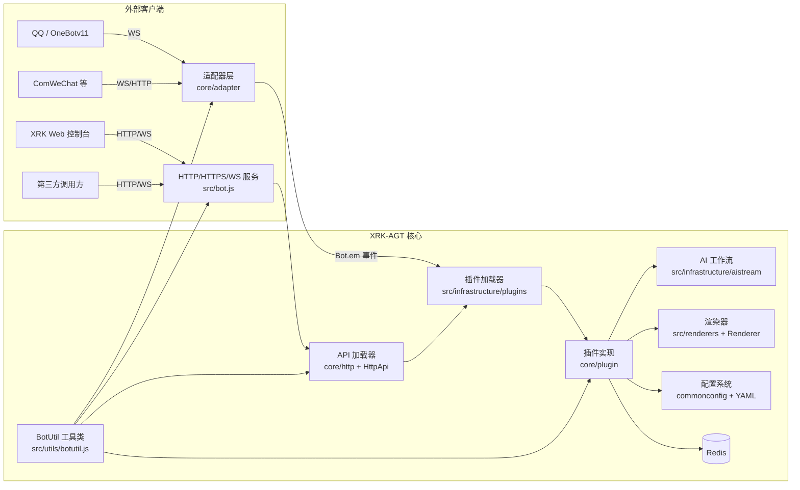

## XRK-AGT v1.0.0


XRK-AGT 是向日葵工作室基于 Node.js 打造的 **多语言、多适配器、工作流驱动型智能体平台**，支持：

- **多平台消息接入**：OneBotv11 / ComWeChat / 自定义适配器。
- **插件工作流**：指令插件 + AI 工作流 (`AIStream`)。
- **Web 与 HTTP/API 服务**：内置 Web 控制台 + REST API + WebSocket。
- **渲染与截图**：基于 Puppeteer / Playwright 的页面渲染与图片输出。

**如果你是第一次接触本项目：**

- 仅想**先跑起来**：直接看下面的「快速开始」。  
- 想**了解整体架构**：先看 [`PROJECT_OVERVIEW.md`](PROJECT_OVERVIEW.md)。  
- 想**做二次开发/写插件**：按顺序阅读：
  1. [`PROJECT_OVERVIEW.md`](PROJECT_OVERVIEW.md)  
  2. [`docs/README.md`](docs/README.md)  
  3. [`docs/app-dev.md`](docs/app-dev.md)（应用 & 前后端总览）  

---

## 架构总览图（核心组件关系）



---

## 模块一览表（代码视角）

| 模块 | 主要文件/目录 | 职责概述 |
|------|---------------|----------|
| 运行核心 | `src/bot.js` | 管理 HTTP/HTTPS/WS 服务、中间件、认证、反向代理、事件派发及资源清理 |
| 适配器层 | `core/adapter/` | 对接 QQ/ComWeChat 等平台协议，将上报转译为统一事件模型 |
| 插件系统 | `src/infrastructure/plugins/`、`core/plugin/` | 扫描加载插件、规则匹配、上下文管理与定时任务调度 |
| HTTP/API | `core/http/`、`src/infrastructure/http/` | 定义 REST/WS API 模块并统一由 `ApiLoader` 挂载到 Express |
| AI 工作流 | `src/infrastructure/aistream/` | 封装 Chat Completion、Embedding、函数调用与上下文增强 |
| 渲染子系统 | `src/renderers/`、`src/infrastructure/renderer/` | 基于模板 + 浏览器引擎生成图片/HTML 等输出 |
| 配置系统 | `config/default_config/`、`src/infrastructure/commonconfig/` | 提供 YAML/JSON 配置读写与校验，抽象为 `ConfigBase` |
| 工具与路径 | `src/utils/botutil.js`、`src/utils/paths.js` | 封装通用工具方法与路径管理，为所有模块提供基础能力 |

各模块对应的详细说明，请参见 [`docs/README.md`](docs/README.md) 中的模块文档索引。

---

## 项目结构总览（目录 & 作用）

> 更详细的逐目录解析，可参考 [`PROJECT_OVERVIEW.md`](PROJECT_OVERVIEW.md)；这里给出精简但完整的一眼总览。

```text
XRK-AGT/
├─ app.js / start.js          # 启动引导与主入口
├─ package.json               # 项目依赖与脚本
├─ README.md                  # 根 README（当前文件）
├─ PROJECT_OVERVIEW.md        # 架构 & 目录详细说明
├─ docs/                      # 模块文档（Bot/插件/适配器/AI/API/配置/渲染/工具等）
├─ src/                       # 运行核心与基础设施
│  ├─ bot.js                  # Bot 主类（HTTP/WS/适配器/插件/API 统筹）
│  ├─ infrastructure/         # 基础设施层
│  │  ├─ adapter/loader.js    # AdapterLoader，加载 core/adapter 适配器
│  │  ├─ aistream/            # AIStream 基类与实现
│  │  ├─ commonconfig/        # ConfigBase 基类与通用配置封装
│  │  ├─ config/config.js     # cfg：按端口拆分 server 配置
│  │  ├─ http/                # HttpApi 基类与 ApiLoader
│  │  ├─ plugins/             # 插件基类 plugin 与 PluginsLoader
│  │  ├─ renderer/Renderer.js # 渲染器基类
│  │  └─ redis.js             # Redis 客户端封装
│  ├─ factory/                # 语音 ASR/TTS 等工厂
│  ├─ modules/                # 与 oicq/系统监控等相关的业务模块
│  ├─ renderers/              # puppeteer/playwright 渲染实现
│  └─ utils/                  # paths/botutil 等工具函数
├─ core/                      # 适配器、API、工作流与示例插件
│  ├─ adapter/                # 各平台适配器（OneBotv11/ComWeChat 等）
│  ├─ http/                   # 具体 HTTP API 模块
│  ├─ events/                 # 事件拆分与预处理
│  ├─ stream/                 # 基于 AIStream 的工作流封装
│  └─ plugin/                 # 业务插件与示例插件
├─ config/                    # 默认配置、命令行工具配置
│  ├─ default_config/         # bot/server/redis/device/renderer 等默认 YAML
│  └─ cmd/                    # 命令行工具定义
├─ data/                      # 运行期数据 & 服务器配置
│  ├─ bots/                   # 各账号运行时数据（icqq 等）
│  ├─ server_bots/            # 按端口拆分的服务器 YAML 配置
│  ├─ backups/                # 备份文件
│  └─ importsJson/            # 动态 imports 配置片段
├─ www/                       # 前端静态资源根目录
│  └─ xrk/                    # XRK Web 控制台（index.html + app.js + styles）
├─ resources/                 # 渲染模板与静态资源（字体/HTML 模板/图片等）
├─ temp/                      # 运行中生成的 HTML/图片等临时文件
└─ trash/                     # Bot 定期清理的回收站目录
```

若你想 **改造底层** 或 **做二次开发**，推荐顺序是：

1. 快速扫一遍上面的结构树，了解目录布局；  
2. 阅读 [`PROJECT_OVERVIEW.md`](PROJECT_OVERVIEW.md) 中的详细目录解析；  
3. 再进入 [`docs/README.md`](docs/README.md) 与对应模块文档深入具体基类和对象。

---

## 使用方法概览（你能拿它干什么）

- **基础运行环境**
  - Windows / Linux + Chrome / Chromium / Edge（用于渲染功能）。
  - Node.js ≥ **18.14.0**。
  - Redis ≥ **5.0.0**。

- **典型使用场景**
  - 搭建 QQ 智能体（聊天机器人、任务助手、数据监控等）。
  - 在农业等垂直场景中落地「任务流 + AI + 渲染」的自动化工作流。
  - 作为一个可扩展的 Bot 平台，对接自定义 API 与前端控制台。

详细架构与对象说明请参见：

- **项目主文档**：[`PROJECT_OVERVIEW.md`](PROJECT_OVERVIEW.md)
- **模块文档索引**：[`docs/README.md`](docs/README.md)

---

## 快速开始（5 分钟跑起来）

### 克隆项目

```sh
# 使用 Github
git clone --depth=1 https://github.com/Xrkseek/XRK-AGT.git
cd XRK-AGT
```

### 安装依赖

> 外网环境可先根据需要调整本地 `.npmrc`（如切换为官方源），再安装依赖。  
> 国内环境一般可直接安装；若个别依赖安装失败，可在运行后通过向日葵插件发送 `#打依赖` 自动补齐。

```sh
# 推荐：pnpm
pnpm install

# 或使用 npm
npm install
```

### 运行与登录（无需先手动「打依赖」）

> 首次运行按终端提示完成登录。  
> 支持多开窗口登录，模仿 QQ 客户端的多实例处理方式，保证多 Bot 回复的兼容性。  
> 与 Yunzai-Bot v3 不同，icqq 登录配置文件存放在 `data/bots/<QQ号>/`；  
> 服务器登录相关插件配置位于 `config/server_config/`，便于迁移。

启动脚本：

```sh
node app   # 或 node start.js
```

启动后可通过浏览器访问配置中的服务地址（默认 2537 端口），具体访问 URL 会在启动日志中打印。

---

## 核心特性（为什么选 XRK-AGT）

- **模块化架构**
  - `src/bot.js`：统一管理 HTTP/HTTPS/WebSocket、反向代理、中间件与认证。
  - `core/adapter`：适配器层（QQ / WeChat / 自定义协议）。
  - `src/infrastructure/plugins`：插件加载与事件调度核心。
  - `src/infrastructure/aistream`：AI 工作流抽象层。
  - `core/http` + `src/infrastructure/http`：API 模块与加载器。

- **插件与工作流**
  - 兼容 Yunzai 风格插件开发体验（规则匹配、权限控制、上下文管理）。
  - 内建工作流基类 `AIStream`，支持多种 Embedding 与函数调用（Function Calling）。

- **性能优化**
  - 并行依赖检查：使用 `Promise.all` 批量检查依赖，提升启动速度。
  - 并行插件依赖安装：同时处理多个插件的依赖检查与安装。
  - 批量日志写入：优化日志队列刷新机制，使用批量写入和异步处理。
  - 高效端口扫描：优化端口列表获取算法，减少文件系统操作。

- **生产级能力**
  - 反向代理：多域名 + SNI + HTTP/2。
  - 安全与观测：CORS / Helmet / 速率限制 / 请求日志。
  - 资源管理：自动清理 `trash/` 目录中的临时文件，适合长期稳定运行。

更多详细说明请查看：

- [`docs/bot.md`](docs/bot.md)：`Bot` 主类与生命周期。
- [`docs/plugins-loader.md`](docs/plugins-loader.md) / [`docs/plugin-base.md`](docs/plugin-base.md)：插件加载器与插件基类。
- [`docs/aistream.md`](docs/aistream.md)：AI 工作流与上下文检索。

---

## 文档与开发指南（跳转总览）

### 📚 总览文档
- [`PROJECT_OVERVIEW.md`](PROJECT_OVERVIEW.md)：整体架构、运行逻辑图、目录结构解析与重要对象索引。
- [`docs/README.md`](docs/README.md)：模块文档导航（Bot / 插件 / 适配器 / API / 配置 / 渲染 / 工具 / 应用开发等）。
- [`docs/app-dev.md`](docs/app-dev.md)：应用 & 前后端开发总览（`app.js` 引导、Web 控制台、配置体系等）。

### 🔧 核心基类 / 运行时对象
- [`docs/bot.md`](docs/bot.md)：`Bot` 主类与服务生命周期。
- [`docs/plugin-base.md`](docs/plugin-base.md) / [`docs/plugins-loader.md`](docs/plugins-loader.md)：插件基类与插件加载器。
- [`docs/adapter-loader.md`](docs/adapter-loader.md) / [`docs/adapter-onebotv11.md`](docs/adapter-onebotv11.md)：适配器加载与 QQ OneBotv11 实现。
- [`docs/aistream.md`](docs/aistream.md)：AI 工作流基类与 Embedding / Function Calling。
- [`docs/http-api.md`](docs/http-api.md) / [`docs/api-loader.md`](docs/api-loader.md)：HTTP API 基类与 API 加载器。
- [`docs/config-base.md`](docs/config-base.md)：配置基类与路径/校验规则、与 `cfg` 的关系。
- [`docs/renderer.md`](docs/renderer.md)：渲染器基类、模板渲染与截图流程。
- [`docs/botutil.md`](docs/botutil.md)：`BotUtil` 工具类（日志、缓存、文件/网络、批处理等）。

### 📖 事件系统文档
- [`docs/事件系统标准化文档.md`](docs/事件系统标准化文档.md)：事件系统标准化说明。
- [`docs/事件监听器开发指南.md`](docs/事件监听器开发指南.md)：事件监听器开发指南。


---

## XRK-AGT 后续计划（节选）

- **已完成**
  - PM2 启动方式支持。
  - 开源对接任务处理器（对接 MySQL、微信公众号等）。
  - 投入农业场景实践使用。
  - 剥离 icqq 等底层以便类型扩展与二次开发。
  - 规范化任务处理逻辑与类型定义。

- **规划方向**
  - 丰富官方插件与 AI 工作流示例。
  - 提供更完善的 Web 控制台与可视化配置工具。

---

## 致谢

- **向日葵工作室开发与测试团队**：持续打磨架构与运行稳定性。  
- **所有提交 Issue / PR 的社区成员**：为 XRK-AGT 带来了真实场景的需求和改进建议。  
- **开源生态中的优秀组件作者**：包括 Node.js、Redis、Puppeteer/Playwright 等，为本项目提供了坚实基础。  


