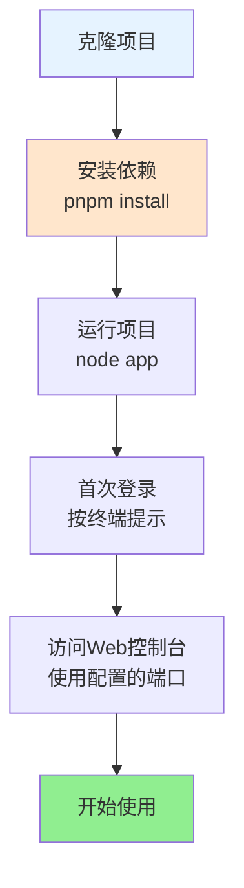

## XRK-AGT v1.0.1

XRK-AGT 是向日葵工作室基于 Node.js 打造的 **多平台、多Tasker、工作流驱动型智能体平台**，采用分层架构设计，支持：

- **多平台消息接入**：OneBotv11 / IM / 自定义 Tasker
- **插件工作流**：指令插件 + AI 工作流 (`AIStream`)
- **Web 与 HTTP/API 服务**：内置 Web 控制台 + REST API + WebSocket
- **渲染与截图**：基于 Puppeteer / Playwright 的页面渲染与图片输出

**如果你是第一次接触本项目：**

- 仅想**先跑起来**：直接看下面的「快速开始」
- 想**了解整体架构**：先看「架构层次说明」和 [`PROJECT_OVERVIEW.md`](PROJECT_OVERVIEW.md)
- 想**做二次开发/写插件**：阅读 [`docs/README.md`](docs/README.md) 与各子文档

---

## 架构层次说明

XRK-AGT 采用清晰的分层架构设计，各层职责明确，便于扩展和维护。

**详细架构说明**：请参见 [`PROJECT_OVERVIEW.md`](PROJECT_OVERVIEW.md) 的「架构层次总览」章节。

**简要层次**：
- **运行核心层** (`src/bot.js`)：统一管理 HTTP/HTTPS/WebSocket、中间件、认证、反向代理、事件总线
- **基础设施层** (`src/infrastructure/`)：提供基类和加载器，不包含业务逻辑
- **任务层** (`core/*/tasker/`)：协议转换，生成统一事件
- **事件系统** (`core/*/events/`)：事件标准化和预处理
- **业务层** (`core/*/plugin/`、`core/*/http/`、`core/*/stream/`)：具体业务实现

若你想 **改造底层** 或 **做二次开发**，推荐顺序是：

1. 阅读 [`PROJECT_OVERVIEW.md`](PROJECT_OVERVIEW.md) 了解详细架构和目录结构
2. 阅读 [`docs/README.md`](docs/README.md) 与对应模块文档深入具体基类和对象

---

## 快速开始（5 分钟跑起来）

### 🐳 Docker 部署（推荐）

如果你熟悉 Docker，可以使用 Docker 快速部署：

```bash
# 使用 Docker Compose（端口可通过环境变量配置）
docker-compose up -d

# 使用自定义端口
XRK_SERVER_PORT=8080 docker-compose up -d

# 查看日志
docker-compose logs -f xrk-agt
```

**详细 Docker 部署指南**：参见 [`docs/docker.md`](docs/docker.md)

> **提示**：
> - Docker 部署支持通过环境变量 `XRK_SERVER_PORT` 指定端口
> - 修改端口时需要同时修改 `docker-compose.yml` 中的端口映射和环境变量
> - 支持多实例运行，每个实例使用不同端口

### 本地部署

**快速开始流程图**:



### 克隆项目

```sh
# 使用 Github
git clone --depth=1 https://github.com/sunflowermm/XRK-AGT.git
# 使用 Gitcode
git clone --depth=1 https://gitcode.com/Xrkseek/XRK-AGT.git
cd XRK-AGT
```

### 安装依赖

> 外网环境可先根据需要调整本地 `.npmrc`（如切换为官方源），再安装依赖。  

```sh
# 推荐：pnpm，且仅支持pnpm
pnpm install
```

### 运行与登录

> 首次运行按终端提示完成登录。  
> 支持多开窗口登录，模仿 QQ 客户端的多实例处理方式，保证多 Bot 回复的兼容性。   
> API 密钥等配置位于 `config/server_config/`，主配置与 Bot 配置位于 `data/server_bots/`，便于迁移。

启动脚本：

```sh
node app   # 或 node start.js
```

启动后可通过浏览器访问配置中的服务地址，具体访问 URL 和端口会在启动日志中打印。

---

## 核心特性（为什么选 XRK-AGT）

### 分层与模块化架构

- **层次划分**：运行核心层 (`src/bot.js`) 统一管理 HTTP/HTTPS/WebSocket、反向代理、中间件与认证；基础设施层提供基类与加载器；任务层 (`core/*/tasker/`) 将各平台协议转为统一事件；事件系统 (`core/*/events/`) 负责标准化、去重与预处理；业务层 (`core/*/plugin/`、`core/*/http/`、`core/*/stream/`) 实现具体功能
- **基础设施与业务分离**：基础设施层不包含业务逻辑，业务层基于基类扩展
- **易于扩展**：基于基类与加载器，便于添加 Tasker、插件、API、工作流

### 插件与工作流

- 兼容 Yunzai 风格插件开发体验（规则匹配、权限控制、上下文管理）
- **通用工作流系统**：基于 `AIStream` 的通用、可扩展、标准化工作流框架
  - **无特化逻辑**：底层代码不包含任何针对特定业务场景的硬编码
  - **快速构建**：通过函数注册机制，5分钟即可创建自定义工作流
  - **自动上下文传递**：步骤间自动传递执行结果，无需手动管理
  - **标准化接口**：统一的接口和规范，易于集成和扩展
- 内建工作流基类 `AIStream`，支持多种 Embedding 与函数调用（Function Calling）
- 支持增强插件（Enhancer），为特定 Tasker 提供功能增强

### 性能优化

- **Node.js 24.12.0 LTS 优化**：
  - V8 引擎 13.6：提升 JavaScript 执行性能，支持 Float16Array、RegExp.escape、Error.isError 等新特性
  - AsyncLocalStorage 优化：默认使用 AsyncContextFrame，提升异步上下文追踪性能
  - HTTP 客户端升级至 Undici 7：提升网络请求性能和可靠性
  - 全局 URLPattern API：简化路由匹配，无需显式导入
- 并行依赖检查：使用 `Promise.all` 批量检查依赖，提升启动速度
- 并行插件依赖安装：同时处理多个插件的依赖检查与安装
- 批量日志写入：优化日志队列刷新机制，使用批量写入和异步处理
- 高效端口扫描：优化端口列表获取算法，减少文件系统操作

### 生产级能力

- **反向代理**：多域名 + SNI + HTTP/2 + 负载均衡 + 健康检查
- **HTTP业务层**：重定向管理、CDN支持、反向代理增强
- 安全与观测：CORS / Helmet / 速率限制 / 请求日志
- 资源管理：自动清理 `trash/` 目录中的临时文件，适合长期稳定运行

更多说明见 [文档与开发指南](#文档与开发指南) 及 [docs/README.md](docs/README.md)。

---

## 文档与开发指南

### 🔌 在 Cursor 中使用

XRK-AGT 支持 MCP（Model Context Protocol）协议，可以在 Cursor 等 AI 编辑器中直接调用。

### 快速配置

1. 启动 XRK-AGT：`node app` 或 `node start.js`
2. 配置 Cursor 的 `mcp.json`（将端口替换为实际使用的端口）：
```json
{
  "mcpServers": {
    "xrk-agt": {
      "url": "http://localhost:8080/api/mcp/jsonrpc",
      "transport": "http",
      "description": "XRK-AGT 智能助手服务器"
    }
  }
}
```
3. 重启 Cursor，即可使用！

### 可用功能

- 桌面操作（回桌面、截屏、打开工具等）
- 文件操作（创建Word/Excel、文件管理等）
- 信息查询（系统信息、天气、股票等）
- 工作流管理（多步骤任务自动化）

**详细文档**：[完整 MCP 文档](docs/mcp-guide.md)（工具注册、外部平台连接等）

---

**框架可扩展性**：[`docs/框架可扩展性指南.md`](docs/框架可扩展性指南.md) — 7 大扩展点、Core 模块开发、扩展示例与最佳实践 ⭐ 推荐

**核心文档索引**（详见 [docs/README.md](docs/README.md) 导航）：

| 模块 | 文档 |
|------|------|
| 概览与运行 | [PROJECT_OVERVIEW](PROJECT_OVERVIEW.md)、[bot](docs/bot.md)、[server](docs/server.md)、[docker](docs/docker.md) |
| 任务与事件 | [tasker-base-spec](docs/tasker-base-spec.md)、[tasker-onebotv11](docs/tasker-onebotv11.md)、[tasker-loader](docs/tasker-loader.md)、[事件系统](docs/事件系统标准化文档.md)、[事件监听器](docs/事件监听器开发指南.md) |
| 插件 | [plugin-base](docs/plugin-base.md)、[plugins-loader](docs/plugins-loader.md) |
| HTTP/API | [http-api](docs/http-api.md)、[api-loader](docs/api-loader.md) |
| AI / MCP | [aistream](docs/aistream.md)、[subserver-api](docs/subserver-api.md)、[mcp-guide](docs/mcp-guide.md) |
| 配置与渲染 | [config-base](docs/config-base.md)、[renderer](docs/renderer.md) |
| 工具与应用 | [botutil](docs/botutil.md)、[app-dev](docs/app-dev.md) |

---

## 致谢

- **向日葵工作室开发与测试团队**：持续打磨架构与运行稳定性
- **所有提交 Issue / PR 的社区成员**：为 XRK-AGT 带来了真实场景的需求和改进建议
- **开源生态中的优秀组件作者**：包括 Node.js、Redis、MongoDB、Puppeteer/Playwright 等，为本项目提供了坚实基础
