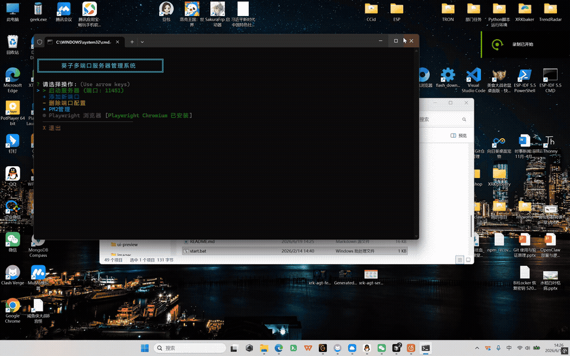
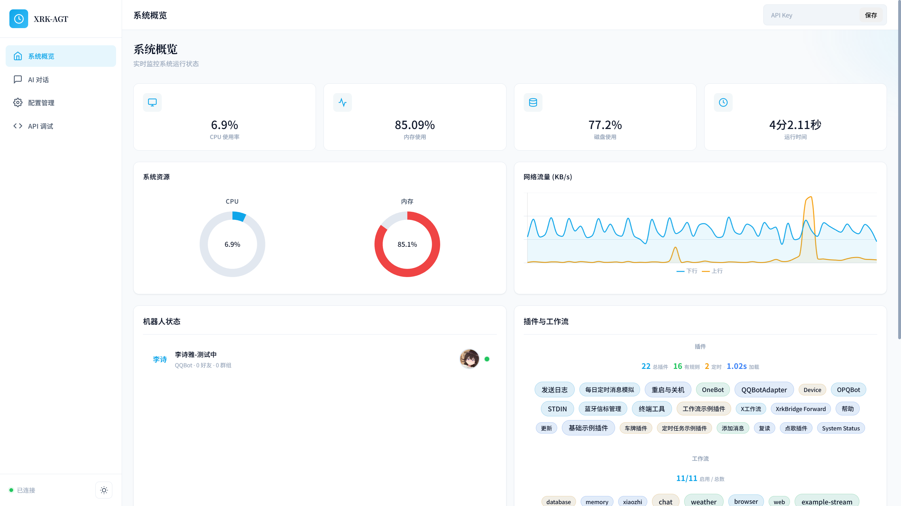
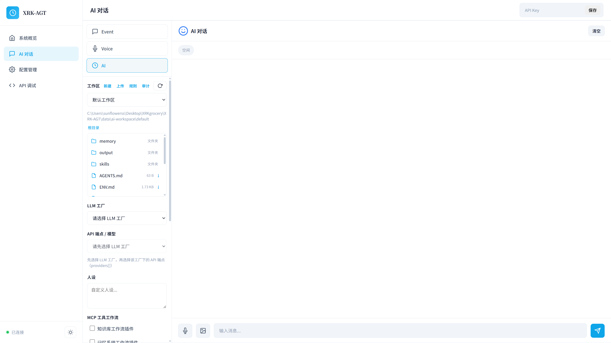
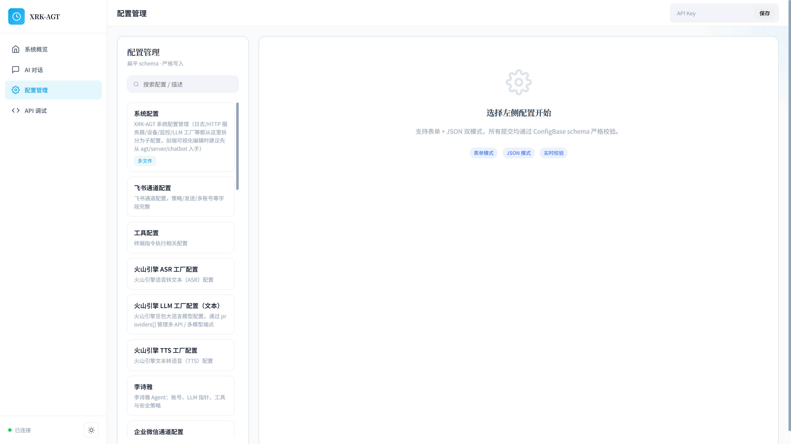
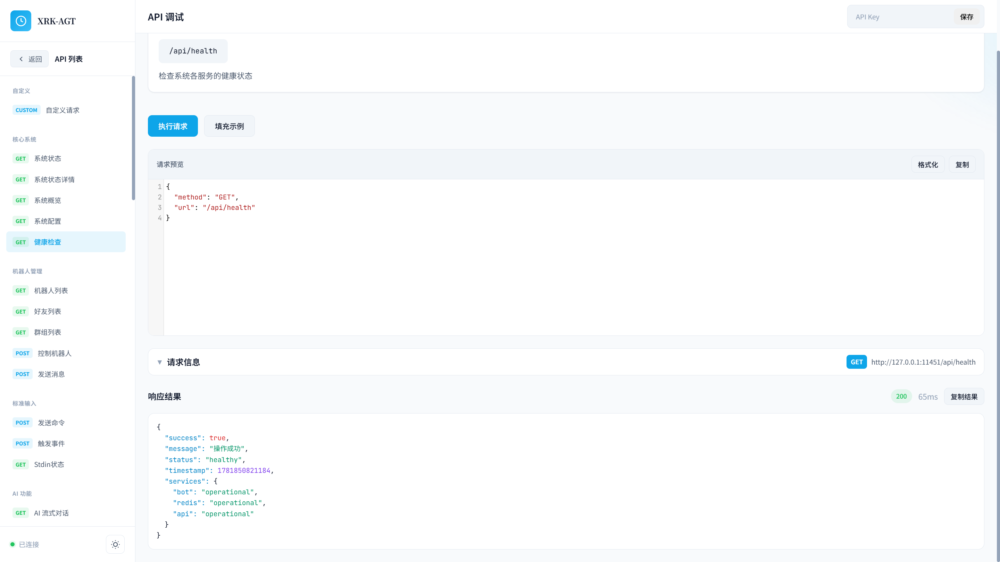
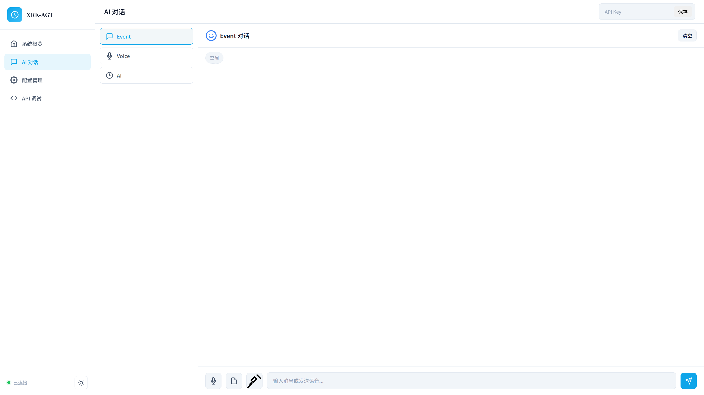
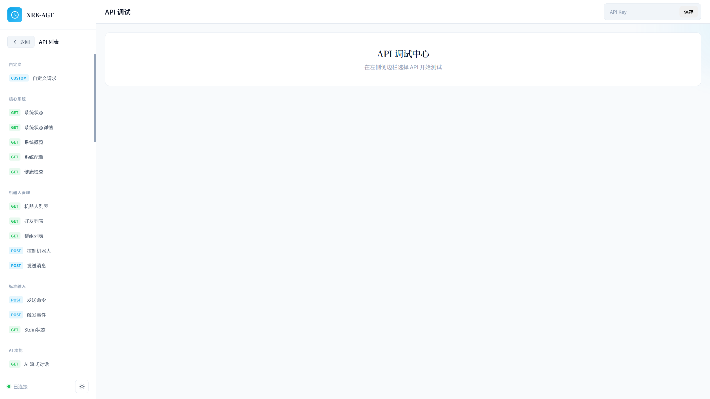

<div align="center">

# 🚀 XRK-AGT

**融合智能体业务逻辑的通用后端**

[](https://opensource.org/licenses/MIT)
[](https://nodejs.org/)
[](https://github.com/sunflowermm/XRK-AGT)
[](https://github.com/sunflowermm/XRK-AGT)
[](https://github.com/sunflowermm/XRK-AGT/stargazers)

</div>

## 目录

- [架构](#-架构)
- [项目展示](#-项目展示)
- [Star 趋势](#-star-趋势)
- [快速开始](#-快速开始)
- [核心特性](#-核心特性)
- [文档与开发指南](#-文档与开发指南)
- [测试与质量](#测试与质量)
- [常见问题](#-常见问题)
- [贡献指南](#-贡献指南)
- [致谢](#-致谢)
- [许可证](#-许可证)
- [联合研制单位](#联合研制单位)
- [联合研制工作室](#联合研制工作室)

XRK-AGT 是由向日葵开发、各大学志同道合的学生联合研制的 **通用后端运行时**：`src/` 提供 HTTP/WS、加载器与 AI 工厂，`core/*/` 承载插件、API、工作流与智能体业务。支持多平台消息接入与工作流编排：

- **🌐 多平台消息接入**：OneBotv11 / QBQBot / GSUIDCORE / stdin / 自定义 Tasker
- **🔌 插件与工作流**：指令插件 + AI 工作流 (AiWorkflow)
- **🌐 Web 与 HTTP/API**：内置 Web 控制台 + REST API + WebSocket
- **⭐ system-Core**：12 HTTP API、7 工作流（80 MCP 工具）、15 插件、4 Tasker、4 events、Web 控制台（`/xrk/`）
- **🎨 渲染**：默认 Playwright；Chromium 经启动菜单或 `pnpm run setup:browsers` 安装

---

## 📸 项目展示

> 以下均为 **本机真实运行** 录屏/截图（端口 `11451`，控制台 `http://127.0.0.1:11451/xrk/`）。

### 终端启动

`node app.js` 引导菜单 → 选择端口 → 加载插件 / 工作流 / Tasker → 服务 online。



### Web 控制台

| 系统概览 | AI 对话 · MCP 工作流 |
|:---:|:---:|
|  |  |

| 配置管理 | API 调试 · `/api/health` |
|:---:|:---:|
|  |  |

<details>
<summary><strong>更多截图</strong></summary>

**AI 对话（Event 模式）**



**API 调试中心（端点列表）**



</details>

**如果你是第一次接触本项目：**

- 仅想**先跑起来**：「快速开始」
- 想**懂架构**：[`docs/底层架构设计.md`](docs/底层架构设计.md)（单一架构图）
- 想**看清启动链**：[`docs/startup.md`](docs/startup.md)
- 想**配 Redis**：[`docs/database.md`](docs/database.md)
- 想**看目录该放哪**：[`PROJECT_OVERVIEW.md`](PROJECT_OVERVIEW.md) · [`docs/README.md`](docs/README.md)
- 想**写插件 / Core**：[`docs/runtime-surface.md`](docs/runtime-surface.md) → [`docs/coding-style.md`](docs/coding-style.md) → [`docs/base-classes.md`](docs/base-classes.md)
- 想**跑测试 / 发布前审查**：[`docs/框架测试指南.md`](docs/框架测试指南.md) → [`docs/代码审查清单.md`](docs/代码审查清单.md)
- **文档中心**：[`docs/README.md`](docs/README.md)

---

## 🏗️ 架构

Runtime（`src/agent-runtime.js`）+ 基础设施（加载器、基类、工厂）+ **Core 业务层**（`core/*/`：插件、HTTP、工作流、Tasker）。分层图与 AI 链路仅维护于 **[`docs/底层架构设计.md`](docs/底层架构设计.md)**；启动链见 **[`docs/startup.md`](docs/startup.md)**；目录树见 **[`PROJECT_OVERVIEW.md`](PROJECT_OVERVIEW.md)**。

---

## ⭐ Star 趋势

<div align="center">

[](https://star-history.com/#sunflowermm/XRK-AGT&Date)

</div>

## 🚀 快速开始

### 📥 1. 克隆项目

**请使用浅克隆以减小下载体积**（`--depth=1` 仅拉取最新提交）：

```bash
# Github
git clone --depth=1 https://github.com/sunflowermm/XRK-AGT.git

# Gitee
git clone --depth=1 https://gitee.com/xrkseek/XRK-AGT.git

# Gitcode
git clone --depth=1 https://gitcode.com/Xrkseek/XRK-AGT.git

cd XRK-AGT
```

### 📦 2. 安装依赖

```bash
# 需 Node.js >= 26.0.0
pnpm install
```

**Redis**：框架内置数据库，启动前须可用。Windows / Unix 入口会跑 `node scripts/ensure-redis.mjs`（TCP 探测 + 本机拉起 Memurai / MSI Redis / `redis-server`）。Docker 见下文；配置与生命周期见 **[docs/database.md](docs/database.md)**。

### ⚙️ 3. 配置环境变量（可选）

创建 `.env` 文件（可选；**勿提交仓库**）：

```bash
# 主服务端口（默认 8080）
XRK_SERVER_PORT=8080

# 容器出网代理（可选；按本机代理软件端口填写，留空则不走代理）
# HTTP_PROXY=http://host.docker.internal:<端口>
# HTTPS_PROXY=http://host.docker.internal:<端口>
# NO_PROXY=127.0.0.1,localhost
```

### 🚀 4. 启动服务

XRK-AGT 支持多种启动方式，包括本地运行和 Docker 部署。

#### 🐳 Docker 启动（推荐）

> **提示**：Docker Compose 会一并构建可选的 Python 子服务端（FastAPI 扩展框架），主服务 LLM/工作流无需依赖子服务即可运行。

```bash
# 启动所有服务（包括主服务端和子服务端）
docker-compose up -d

# 查看日志
docker-compose logs -f

# 停止服务
docker-compose down
```

**服务说明**：
- `xrk-agt`: 主服务端（端口：8080）
- `xrk-subserver`: Python 子服务端（端口：8000，自动构建）
- `redis`: Redis 缓存服务（端口：6379，框架必需）

**详细 Docker 部署指南**：参见 [`docs/docker.md`](docs/docker.md)

#### 💻 本地启动（开发环境）

**Windows/Linux/macOS:**
```bash
# 方式1：使用 app.js（推荐，自动检查依赖与环境后启动）
node app.js

# 方式2：使用启动脚本（会先经 app.js 做依赖检查再启动）
# Windows
start.bat

# Linux/macOS
chmod +x start.sh
./start.sh server 8080

# 方式3：node start 会重定向到 app.js，同样会做依赖检查
node start.js server 8080
```

**指定端口：**
```bash
# 环境变量
XRK_SERVER_PORT=3000 node app.js

# 命令行参数
node start.js server 3000
```

**首次启动**：
- 启动后按终端提示完成首次登录配置
- 截图功能需先在菜单安装 **Playwright Chromium**（或 `pnpm run setup:browsers`）
- 访问 `http://localhost:8080/xrk/` 进入管理界面

**端口配置**：
- 默认端口：8080
- 通过环境变量：`XRK_SERVER_PORT=3000 node app`
- 通过命令行参数：`node start.js server 3000`

---

## ✨ 核心特性

### 🏗️ 分层架构设计

清晰的分层架构，基础设施与业务分离，职责明确，易于维护和扩展。

### 🚀 零配置扩展

只需将代码放置到对应目录即可自动加载，无需手动注册：
- **插件**：`core/*/plugin/my-plugin.js` → 自动加载
- **工作流**：`core/*/stream/my-workflow.js` → 自动注册 MCP 工具
- **HTTP API**：`core/*/http/my-api.js` → 自动注册路由

### 💡 现代技术栈

基于 Node.js 26 Current，使用 `Error.isError`、`Map.getOrInsert*`、`Uint8Array` 内置 base64/hex、全局 `URLPattern`、原生 `fetch`（Undici 8）与 `AbortSignal.timeout` 等。详见 [docs/node-26-runtime.md](docs/node-26-runtime.md)。

### 🔧 7 大扩展点

插件系统、工作流系统、Tasker 扩展、事件监听器、HTTP API、渲染器、配置系统，覆盖所有常见扩展需求。

### 🛡️ 生产级可靠性

内置反向代理、HTTP 业务层、安全特性（CORS、Helmet、速率限制），开箱即用，适合生产环境部署。

**详细说明**：参见 [`docs/框架可扩展性指南.md`](docs/框架可扩展性指南.md) 和 [`PROJECT_OVERVIEW.md`](PROJECT_OVERVIEW.md)

---

## 📚 文档与开发指南

### 🔌 在 Cursor 中使用

XRK-AGT 支持 MCP（Model Context Protocol）协议，可在 Cursor 等 AI 编辑器中直接调用。

**快速配置**：

1. 启动 XRK-AGT
2. 配置 Cursor 的 `mcp.json`：
```json
{
  "mcpServers": {
    "xrk-agt": {
      "url": "http://localhost:8080/api/mcp/jsonrpc",
      "transport": "http"
    }
  }
}
```
3. 重启 Cursor 即可使用

**详细文档**：[MCP 完整文档](docs/mcp-guide.md)

---

**框架可扩展性**：[`docs/框架可扩展性指南.md`](docs/框架可扩展性指南.md) — 7 大扩展点、Core 模块开发、扩展示例与最佳实践 ⭐ 推荐

**文档中心**：[docs/README.md](docs/README.md)（全量索引、配图导读与按角色阅读路径）

| 模块 | 文档 |
|------|------|
| 质量与发布 | [框架测试指南](docs/框架测试指南.md)、[代码审查清单](docs/代码审查清单.md)、[文档审查清单](docs/文档审查清单.md) |
| 概览与运行 | [运行时挂载面](docs/runtime-surface.md)、[底层写法规范](docs/coding-style.md)、[底层架构设计](docs/底层架构设计.md)、[启动与引导](docs/startup.md)、[database](docs/database.md)、[AgentRuntime](docs/agent-runtime.md)、[Server](docs/server.md) |
| 开发契约 | [base-classes](docs/base-classes.md)、[infrastructure-shared](docs/infrastructure-shared.md)、[DOCSTYLE](docs/DOCSTYLE.md) |
| system-Core | [system-core.md](docs/system-core.md)（12 HTTP / 7 stream / 15 plugin / 4 tasker / 4 events） |
| 生态索引 | [AGT-Cores-Tools-Index](https://github.com/sunflowermm/AGT-Cores-Tools-Index) |
| 任务与事件 | [Tasker 底层规范](docs/tasker-base-spec.md)、[OneBotv11 Tasker 文档](docs/tasker-onebotv11.md)、[Tasker 加载器文档](docs/tasker-loader.md)、[事件系统标准化文档](docs/事件系统标准化文档.md)（包含事件监听器开发指南） |
| 插件 | [插件基类文档](docs/plugin-base.md)、[插件加载器文档](docs/plugins-loader.md) |
| HTTP/API | [HTTP API 基类文档](docs/http-api.md)、[API 加载器文档](docs/api-loader.md) |
| AI / MCP | [AiWorkflow 工作流基类文档](docs/aistream.md)、[工厂系统文档](docs/factory.md)、[子服务端 API 文档](docs/subserver-api.md)、[MCP 完整指南](docs/mcp-guide.md) |
| 配置与渲染 | [配置基类文档](docs/config-base.md)、[渲染器基类文档](docs/renderer.md) |
| 工具与应用 | [RuntimeUtil 工具类文档](docs/runtime-util.md)、[应用开发指南](docs/app-dev.md) |
| 基础设施 | [runtime-surface.md](docs/runtime-surface.md)、[coding-style.md](docs/coding-style.md)、[base-classes.md](docs/base-classes.md)、[infrastructure-shared.md](docs/infrastructure-shared.md) |

---

## 测试与质量

框架 CI **只统计 `core/system-Core/` 官方模块**（其他 core 不计入达标线；vendor = 未 git 入库的本地插件）。标准值源码：本地 `tests/helpers/system-core.mjs`（`tests/` **不入库**）。运行测试需 **Node ≥ 26**（见 `package.json` → `engines.node`）。

| 类型 | 标准值 | 验证命令 |
|------|--------|----------|
| HTTP / stream / plugin / tasker / events | 12 / 7 / 15 / 4 / 4 | `pnpm test` |
| 端到端探活 | 3 项 API + `/xrk/` | `pnpm test:e2e` |

- **标准值与实测**：[docs/框架测试指南.md](docs/框架测试指南.md)
- **代码审查**：[docs/代码审查清单.md](docs/代码审查清单.md)
- **文档审查**：[docs/文档审查清单.md](docs/文档审查清单.md)
- **全文档索引**：[docs/README.md](docs/README.md)

> MCP 工具：system-Core 七个工作流内 `registerMCPTool` 合计 **80** 个（以 `core/system-Core/stream/*.js` 实时计数为准）；全仓库启动日志可能更高（含扩展 core）。

---

## ❓ 常见问题

### Q: 如何配置代理？

A: 按需在本机 `.env` 或 `config/docker.env` 中设置（**勿提交**）。容器内访问宿主机代理用 `host.docker.internal:<端口>`，本机 shell 用 `127.0.0.1:<端口>`。详见 [docs/docker.md](docs/docker.md) 与 [subserver/SETUP.md](subserver/SETUP.md)。

### Q: 如何修改服务端口？

A: 环境变量 `XRK_SERVER_PORT=3000 node app.js`、命令行 `node start.js server 3000`，或修改 `data/server_bots/{port}/server.yaml`。

### Q: 如何开发自定义插件？

A: 参考 [插件基类文档](docs/plugin-base.md) 和 [框架可扩展性指南](docs/框架可扩展性指南.md)

### Q: 如何接入新的 IM 平台？

A: 参考 [Tasker 底层规范](docs/tasker-base-spec.md) 和 [Tasker 加载器](docs/tasker-loader.md)

### Q: Docker 部署时子服务端如何配置？

A: Docker 构建会自动包含子服务端，无需手动配置。详见 [Docker 部署指南](docs/docker.md)

---

## 🤝 贡献指南

欢迎贡献代码、文档或提出建议！

- **提交 Issue**：报告 Bug 或提出功能建议
- **提交 PR**：修复 Bug 或添加新功能
- **完善文档**：改进文档内容，帮助其他开发者

**维护者**：建议用户始终使用 `git clone --depth=1` 以减小下载体积。若需从历史中移除大文件以进一步减小仓库体积，可使用 [git-filter-repo](https://github.com/newren/git-filter-repo) 等工具清理后 force-push。

---

## 🙏 致谢

- **所有提交 Issue / PR 的社区成员**：为 XRK-AGT 带来了真实场景的需求和改进建议
- **开源生态中的优秀组件作者**：包括 Node.js、Redis、MongoDB、Puppeteer/Playwright 等，为本项目提供了坚实基础

---

## 📄 许可证

详见 [LICENSE](LICENSE) 文件。

---

<div align="center">

## 联合研制单位

<!-- 第一排：沈阳农业大学 -->
<div align="center">
  
</div>

<br>

<!-- 第二排：其他大学 -->
<div align="center">
  <p>
    
    
    
    
    
    
    
  </p>
</div>

### 联合研制工作室


</div>

---

*最后更新：2026-06-19*
