## XRK-AGT v1.0.0

XRK-AGT 是向日葵工作室基于 Node.js 打造的 **多平台、多适配器、工作流驱动型智能体平台**，采用分层架构设计，支持：

- **多平台消息接入**：OneBotv11 / ComWeChat / 自定义 Tasker
- **插件工作流**：指令插件 + AI 工作流 (`AIStream`)
- **Web 与 HTTP/API 服务**：内置 Web 控制台 + REST API + WebSocket
- **渲染与截图**：基于 Puppeteer / Playwright 的页面渲染与图片输出

**如果你是第一次接触本项目：**

- 仅想**先跑起来**：直接看下面的「快速开始」
- 想**了解整体架构**：先看「架构层次说明」和 [`PROJECT_OVERVIEW.md`](PROJECT_OVERVIEW.md)
- 想**做二次开发/写插件**：阅读 [`docs/完整文档.md`](docs/完整文档.md) - 整合了所有核心文档

---

## 架构层次说明

XRK-AGT 采用清晰的分层架构，各层职责明确，便于扩展和维护：

### 🏗️ 架构层次图

```mermaid
flowchart TB
    subgraph Clients["外部客户端"]
      QQ["QQ / OneBotv11"]
      WeChat["ComWeChat"]
      WebUI["XRK Web 控制台"]
      ThirdAPI["第三方 API 调用"]
    end

    subgraph Runtime["运行核心层"]
      Bot["Bot 主类<br/>src/bot.js<br/>统一管理所有组件"]
    end

    subgraph Infrastructure["基础设施层（辅助层）<br/>src/infrastructure/"]
      TaskerLoader["TaskerLoader<br/>任务层加载器"]
      PluginsLoader["PluginsLoader<br/>插件加载与调度"]
      ApiLoader["ApiLoader<br/>API 加载器"]
      StreamLoader["StreamLoader<br/>工作流加载器"]
      ListenerLoader["ListenerLoader<br/>事件监听器加载器"]
      BaseClasses["基类库<br/>plugin/HttpApi/AIStream<br/>Renderer/ConfigBase/EventListener"]
    end

    subgraph Tasker["任务层（Tasker）<br/>core/tasker/"]
      OneBotTasker["OneBotv11 Tasker"]
      ComWeChatTasker["ComWeChat Tasker"]
      StdinTasker["stdin Tasker"]
      CustomTasker["自定义 Tasker"]
    end

    subgraph EventSystem["事件系统<br/>core/events/"]
      OneBotEvent["OneBot 事件监听器"]
      DeviceEvent["Device 事件监听器"]
      StdinEvent["Stdin 事件监听器"]
    end

    subgraph Business["业务层<br/>core/"]
      Plugins["业务插件<br/>core/plugin/"]
      HttpApis["HTTP API<br/>core/http/"]
      Streams["工作流<br/>core/stream/"]
    end

    Clients -->|协议转换| Tasker
    Tasker -->|Bot.em 触发事件| EventSystem
    EventSystem -->|去重/标记/预处理| PluginsLoader
    PluginsLoader -->|规则匹配| Plugins
    
    WebUI -->|HTTP/WS| Bot
    ThirdAPI -->|HTTP/WS| Bot
    Bot --> ApiLoader
    ApiLoader --> HttpApis
    
    Plugins --> BaseClasses
    HttpApis --> BaseClasses
    Streams --> BaseClasses
    
    Bot --> Infrastructure
    Infrastructure --> Tasker
    Infrastructure --> EventSystem
    Infrastructure --> Business
```



### 📋 各层职责说明

#### 1. **运行核心层** (`src/bot.js`)
- **职责**：统一管理 HTTP/HTTPS/WebSocket 服务、中间件、认证、反向代理、事件总线 (`Bot.em`)
- **特点**：系统入口，协调所有组件

#### 2. **基础设施层（辅助层）** (`src/infrastructure/`)
- **职责**：提供所有基础设施和基类，为业务层提供通用能力
- **包含**：
  - **加载器**：`TaskerLoader`、`PluginsLoader`、`ApiLoader`、`StreamLoader`、`ListenerLoader`
  - **基类库**：`plugin`（插件基类）、`HttpApi`（API 基类）、`AIStream`（工作流基类）、`Renderer`（渲染器基类）、`ConfigBase`（配置基类）、`EventListener`（事件监听器基类）
  - **数据库客户端**：`redis.js`、`mongodb.js`
  - **配置管理**：`config/`、`commonconfig/`
- **特点**：不包含具体业务逻辑，只提供抽象和工具

#### 3. **任务层（Tasker）** (`core/tasker/`)
- **职责**：对接各平台协议（QQ/微信/自定义），将平台消息转换为统一事件模型，通过 `Bot.em` 触发事件
- **包含**：`OneBotv11.js`、`ComWeChat.js`、`stdin.js` 等
- **特点**：事件生成器，负责协议转换

#### 4. **事件系统** (`core/events/`)
- **职责**：监听 `Bot.em` 事件，进行去重、标记、预处理，然后调用 `PluginsLoader.deal(e)` 分发到插件
- **包含**：`onebot.js`、`device.js`、`stdin.js` 等事件监听器
- **特点**：事件标准化和预处理层

#### 5. **业务层** (`core/`)
- **职责**：实现具体业务逻辑
- **包含**：
  - **业务插件** (`core/plugin/`)：包括 `enhancer/`（增强插件）和 `example/`（示例插件）
  - **HTTP API** (`core/http/`)：具体的 REST/WebSocket API 实现
  - **工作流** (`core/stream/`)：基于 `AIStream` 的业务工作流实现
- **特点**：基于基础设施层的基类实现具体功能

---

## 架构总览图（核心组件关系）

```mermaid
flowchart LR
    subgraph Clients["外部客户端"]
      QQ["QQ / OneBotv11"] -->|WS| Taskers
      WeChat["ComWeChat 等"] -->|WS/HTTP| Taskers
      WebUI["XRK Web 控制台"] -->|HTTP/WS| Express
      ThirdAPI["第三方调用方"] -->|HTTP/WS| Express
    end

    subgraph Core["XRK-AGT 核心"]
      Taskers["任务层<br/>core/tasker"] -->|Bot.em 事件| EventSystem
      EventSystem["事件系统<br/>core/events"] -->|去重/标记| PluginsLoader
      Express["HTTP/HTTPS/WS 服务<br/>src/bot.js"] --> ApiLoader
      ApiLoader["API 加载器<br/>src/infrastructure/http"] --> HttpApis
      PluginsLoader["插件加载器<br/>src/infrastructure/plugins"] --> Plugins["业务插件<br/>core/plugin"]
      Plugins --> AIStream["AI 工作流基类<br/>src/infrastructure/aistream"]
      Plugins --> Renderer["渲染器基类<br/>src/infrastructure/renderer"]
      Plugins --> Config["配置系统<br/>src/infrastructure/commonconfig"]
      Plugins --> Redis[("Redis")]
      Plugins --> MongoDB[("MongoDB")]
      HttpApis["HTTP API<br/>core/http"] --> AIStream
      HttpApis --> Renderer
      HttpApis --> Config
    end
```



---

## 模块一览表（按层次分类）

### 运行核心层

| 模块 | 主要文件/目录 | 职责概述 |
|------|---------------|----------|
| Bot 主类 | `src/bot.js` | 管理 HTTP/HTTPS/WS 服务、中间件、认证、反向代理、事件总线 (`Bot.em`) 及资源清理 |

### 基础设施层（辅助层）

| 模块 | 主要文件/目录 | 职责概述 |
|------|---------------|----------|
| Tasker 加载器 | `src/infrastructure/tasker/loader.js` | 扫描并加载 `core/tasker/` 中的 Tasker |
| 插件系统基础设施 | `src/infrastructure/plugins/` | 插件基类 `plugin`、插件加载器 `PluginsLoader`、运行时管理 |
| 事件监听器基础设施 | `src/infrastructure/listener/` | 事件监听器基类 `EventListener` 和加载器 |
| HTTP/API 基础设施 | `src/infrastructure/http/` | HTTP API 基类 `HttpApi` 和 `ApiLoader` |
| AI 工作流基础设施 | `src/infrastructure/aistream/` | AI 工作流基类 `AIStream` 和加载器 |
| 渲染器基础设施 | `src/infrastructure/renderer/` | 渲染器基类 `Renderer` 和加载器 |
| 配置系统基础设施 | `src/infrastructure/commonconfig/` | 配置基类 `ConfigBase` 和通用配置封装 |
| 配置加载器 | `src/infrastructure/config/` | 服务端配置管理（端口、HTTPS、CORS 等） |
| 数据库客户端 | `src/infrastructure/redis.js`、`src/infrastructure/mongodb.js` | Redis 和 MongoDB 客户端封装 |

### 任务层（Tasker）

| 模块 | 主要文件/目录 | 职责概述 |
|------|---------------|----------|
| 任务层 | `core/tasker/` | 对接各平台协议，将平台消息转换为统一事件模型，通过 `Bot.em` 触发事件 |

### 事件系统

| 模块 | 主要文件/目录 | 职责概述 |
|------|---------------|----------|
| 事件监听器 | `core/events/` | 监听 `Bot.em` 事件，进行去重、标记、预处理，调用 `PluginsLoader.deal(e)` |

### 业务层

| 模块 | 主要文件/目录 | 职责概述 |
|------|---------------|----------|
| 业务插件 | `core/plugin/` | 具体业务插件实现（包括 `enhancer/` 增强插件和 `example/` 示例插件） |
| HTTP API | `core/http/` | 具体的 REST/WebSocket API 实现 |
| 工作流 | `core/stream/` | 基于 `AIStream` 的业务工作流实现 |

### 工具与辅助

| 模块 | 主要文件/目录 | 职责概述 |
|------|---------------|----------|
| 工具类 | `src/utils/botutil.js`、`src/utils/paths.js` | 封装通用工具方法与路径管理 |
| 渲染实现 | `src/renderers/` | 基于 Puppeteer/Playwright 的渲染实现 |
| 工厂类 | `src/factory/` | ASR/TTS/LLM 工厂类 |

各模块对应的详细说明，请参见 [`docs/README.md`](docs/README.md) 中的模块文档索引。

---

## 项目结构总览（目录 & 作用）

> 更详细的逐目录解析，可参考 [`PROJECT_OVERVIEW.md`](PROJECT_OVERVIEW.md)；这里给出精简但完整的一眼总览。

```text
XRK-AGT/
├─ app.js / start.js          # 启动引导与主入口
├─ package.json               # 项目依赖与脚本
├─ README.md                  # 根 README（当前文件）
├─ PROJECT_OVERVIEW.md        # 架构 & 目录详细说明
├─ docs/                      # 模块文档（Bot/插件/Tasker/事件/API/AI/配置/渲染/工具等）
│
├─ src/                       # 运行核心与基础设施
│  ├─ bot.js                  # Bot 主类（运行核心层）
│  ├─ infrastructure/         # 基础设施层（辅助层）
│  │  ├─ tasker/loader.js    # TaskerLoader，加载 core/tasker Tasker
│  │  ├─ plugins/             # 插件系统基础设施（plugin 基类、PluginsLoader）
│  │  ├─ listener/            # 事件监听器基础设施（EventListener 基类、ListenerLoader）
│  │  ├─ http/                # HTTP API 基础设施（HttpApi 基类、ApiLoader）
│  │  ├─ aistream/            # AI 工作流基础设施（AIStream 基类、StreamLoader）
│  │  ├─ renderer/            # 渲染器基础设施（Renderer 基类、RendererLoader）
│  │  ├─ commonconfig/        # 配置系统基础设施（ConfigBase 基类）
│  │  ├─ config/              # 配置加载器（服务端配置管理）
│  │  ├─ redis.js             # Redis 客户端封装
│  │  └─ mongodb.js           # MongoDB 客户端封装
│  ├─ factory/                # 工厂类（ASR/TTS/LLM）
│  ├─ modules/                # 业务模块（oicq/系统监控等）
│  ├─ renderers/              # 渲染实现（puppeteer/playwright）
│  └─ utils/                  # 工具函数（paths/botutil 等）
│
├─ core/                      # 业务层与任务层
│  ├─ tasker/                 # 任务层（Tasker）- 各平台适配器
│  │  ├─ OneBotv11.js         # OneBotv11 Tasker
│  │  ├─ ComWeChat.js         # ComWeChat Tasker
│  │  ├─ stdin.js             # stdin Tasker
│  │  └─ ...                  # 其他 Tasker
│  ├─ events/                 # 事件系统 - 事件监听器
│  │  ├─ onebot.js            # OneBot 事件监听器
│  │  ├─ device.js            # Device 事件监听器
│  │  └─ stdin.js             # Stdin 事件监听器
│  ├─ plugin/                 # 业务层 - 业务插件
│  │  ├─ enhancer/            # 增强插件（Tasker 特定功能增强）
│  │  └─ example/             # 示例插件
│  ├─ http/                   # 业务层 - HTTP API
│  │  ├─ ai.js                # AI 相关 API
│  │  ├─ bot.js               # Bot 相关 API
│  │  ├─ config.js            # 配置相关 API
│  │  └─ ...                  # 其他 API
│  └─ stream/                 # 业务层 - 工作流
│     ├─ chat.js              # 聊天工作流
│     └─ device.js            # 设备工作流
│
├─ config/                    # 默认配置、命令行工具配置
│  ├─ default_config/         # bot/server/redis/mongodb/device/renderer 等默认 YAML
│  └─ cmd/                    # 命令行工具定义
│
├─ data/                      # 运行期数据 & 服务器配置
│  ├─ bots/                   # 各账号运行时数据（icqq 等）
│  ├─ server_bots/            # 按端口拆分的服务器 YAML 配置
│  ├─ backups/                # 备份文件
│  └─ importsJson/            # 动态 imports 配置片段
│
├─ www/                       # 前端静态资源根目录
│  └─ xrk/                    # XRK Web 控制台（index.html + app.js + styles）
│
├─ resources/                 # 渲染模板与静态资源（字体/HTML 模板/图片等）
├─ temp/                      # 运行中生成的 HTML/图片等临时文件
└─ trash/                     # Bot 定期清理的回收站目录
```

### 层次关系说明

- **运行核心层** (`src/bot.js`)：系统入口，统一管理所有组件
- **基础设施层** (`src/infrastructure/`)：提供基类和加载器，不包含业务逻辑
- **任务层** (`core/tasker/`)：协议转换，生成统一事件
- **事件系统** (`core/events/`)：事件标准化和预处理
- **业务层** (`core/plugin/`、`core/http/`、`core/stream/`)：具体业务实现

若你想 **改造底层** 或 **做二次开发**，推荐顺序是：

1. 快速扫一遍上面的结构树，了解目录布局
2. 阅读「架构层次说明」理解各层职责
3. 阅读 [`PROJECT_OVERVIEW.md`](PROJECT_OVERVIEW.md) 中的详细目录解析
4. 再进入 [`docs/README.md`](docs/README.md) 与对应模块文档深入具体基类和对象

---

## 使用方法概览（你能拿它干什么）

### 基础运行环境

- Windows / Linux + Chrome / Chromium / Edge（用于渲染功能）
- Node.js ≥ **18.14.0**
- Redis ≥ **5.0.0**
- MongoDB ≥ **4.0.0**（可选，用于持久化存储）

### 典型使用场景

- 搭建 QQ 智能体（聊天机器人、任务助手、数据监控等）
- 在农业等垂直场景中落地「任务流 + AI + 渲染」的自动化工作流
- 作为一个可扩展的 Bot 平台，对接自定义 API 与前端控制台

详细架构与对象说明请参见：

- **项目主文档**：[`PROJECT_OVERVIEW.md`](PROJECT_OVERVIEW.md)
- **完整文档**：[`docs/完整文档.md`](docs/完整文档.md) - 整合了所有核心文档和 API 参考

---

## 快速开始（5 分钟跑起来）

### 克隆项目

```sh
# 使用 Github
git clone --depth=1 https://github.com/sunflowermm/XRK-AGT.git
# 使用 Gitcode
git clone --depth=1 https://gitcode.com/Xrkseek/XRK-AGT.git
cd XRK-AGT
```

### 安装依赖

> 外网环境可先根据需要调整本地 `.npmrc`（如切换为官方源），再安装依赖。  

```sh
# 推荐：pnpm，且仅支持pnpm
pnpm install
```

### 运行与登录

> 首次运行按终端提示完成登录。  
> 支持多开窗口登录，模仿 QQ 客户端的多实例处理方式，保证多 Bot 回复的兼容性。   
> 服务器登录相关插件配置位于 `config/server_config/`，便于迁移。

启动脚本：

```sh
node app   # 或 node start.js
```

启动后可通过浏览器访问配置中的服务地址（默认 2537 端口），具体访问 URL 会在启动日志中打印。

---

## 核心特性（为什么选 XRK-AGT）

### 分层架构设计

- **清晰的层次划分**：运行核心层、基础设施层、任务层、事件系统、业务层职责明确
- **基础设施与业务分离**：基础设施层提供通用能力，业务层专注具体实现
- **易于扩展**：基于基类设计，便于添加新的 Tasker、插件、API 和工作流

### 模块化架构

- **运行核心** (`src/bot.js`)：统一管理 HTTP/HTTPS/WebSocket、反向代理、中间件与认证
- **任务层** (`core/tasker/`)：事件生成器，将各平台协议转换为统一事件模型
- **事件系统** (`core/events/`)：事件标准化、去重、标记和预处理
- **插件系统** (`src/infrastructure/plugins/` + `core/plugin/`)：插件加载与事件调度核心
- **AI 工作流** (`src/infrastructure/aistream/` + `core/stream/`)：AI 工作流抽象层与业务实现
- **HTTP/API** (`src/infrastructure/http/` + `core/http/`)：API 模块与加载器

### 插件与工作流

- 兼容 Yunzai 风格插件开发体验（规则匹配、权限控制、上下文管理）
- 内建工作流基类 `AIStream`，支持多种 Embedding 与函数调用（Function Calling）
- 支持增强插件（Enhancer），为特定 Tasker 提供功能增强

### 性能优化

- 并行依赖检查：使用 `Promise.all` 批量检查依赖，提升启动速度
- 并行插件依赖安装：同时处理多个插件的依赖检查与安装
- 批量日志写入：优化日志队列刷新机制，使用批量写入和异步处理
- 高效端口扫描：优化端口列表获取算法，减少文件系统操作

### 生产级能力

- 反向代理：多域名 + SNI + HTTP/2
- 安全与观测：CORS / Helmet / 速率限制 / 请求日志
- 资源管理：自动清理 `trash/` 目录中的临时文件，适合长期稳定运行

更多详细说明请查看：

- [`docs/bot.md`](docs/bot.md)：`Bot` 主类与生命周期
- [`docs/plugins-loader.md`](docs/plugins-loader.md) / [`docs/plugin-base.md`](docs/plugin-base.md)：插件加载器与插件基类
- [`docs/aistream.md`](docs/aistream.md)：AI 工作流与上下文检索
- [`docs/事件系统标准化文档.md`](docs/事件系统标准化文档.md)：事件系统详细说明

---

## 文档与开发指南

### 📚 完整文档

**[`docs/完整文档.md`](docs/完整文档.md)** - **推荐从这里开始**

整合了所有核心文档，包含：
- 快速开始指南
- 架构总览
- 核心模块详细说明（Bot、插件、Tasker、事件、API、AI、配置、渲染、工具）
- 开发指南（编写插件、创建 Tasker、开发 API 等）
- API 参考
- 最佳实践

### 📖 其他文档

#### 运行核心与基础设施
- [`PROJECT_OVERVIEW.md`](PROJECT_OVERVIEW.md)：项目整体架构与目录结构详细说明
- [`docs/bot.md`](docs/bot.md)：Bot 主类详细文档

#### 任务层与事件系统
- [`docs/tasker-base-spec.md`](docs/tasker-base-spec.md)：Tasker 底层规范（事件生成器规范）
- [`docs/tasker-onebotv11.md`](docs/tasker-onebotv11.md)：OneBot Tasker 详细文档
- [`docs/tasker-loader.md`](docs/tasker-loader.md)：Tasker 加载器文档
- [`docs/事件系统标准化文档.md`](docs/事件系统标准化文档.md)：事件系统详细说明
- [`docs/事件监听器开发指南.md`](docs/事件监听器开发指南.md)：事件监听器开发指南

#### 插件系统
- [`docs/plugin-base.md`](docs/plugin-base.md)：插件基类详细文档
- [`docs/plugins-loader.md`](docs/plugins-loader.md)：插件加载器详细文档

#### HTTP/API
- [`docs/http-api.md`](docs/http-api.md)：HTTP API 基类文档
- [`docs/api-loader.md`](docs/api-loader.md)：API 加载器文档

#### AI 工作流
- [`docs/aistream.md`](docs/aistream.md)：AI 工作流详细文档

#### 配置与渲染
- [`docs/config-base.md`](docs/config-base.md)：配置系统详细文档
- [`docs/renderer.md`](docs/renderer.md)：渲染系统详细文档

#### 工具类
- [`docs/botutil.md`](docs/botutil.md)：工具类详细文档
- [`docs/app-dev.md`](docs/app-dev.md)：应用开发详细文档

---

## XRK-AGT 后续计划（节选）

### 已完成

- PM2 启动方式支持
- 开源对接任务处理器（对接 MySQL、微信公众号等）
- 投入农业场景实践使用
- 剥离 icqq 等底层以便类型扩展与二次开发
- 规范化任务处理逻辑与类型定义
- 分层架构设计，明确基础设施层与业务层职责

### 规划方向

- 丰富官方插件与 AI 工作流示例
- 提供更完善的 Web 控制台与可视化配置工具
- 优化事件系统性能
- 增强 Tasker 扩展能力

---

## 致谢

- **向日葵工作室开发与测试团队**：持续打磨架构与运行稳定性
- **所有提交 Issue / PR 的社区成员**：为 XRK-AGT 带来了真实场景的需求和改进建议
- **开源生态中的优秀组件作者**：包括 Node.js、Redis、MongoDB、Puppeteer/Playwright 等，为本项目提供了坚实基础
