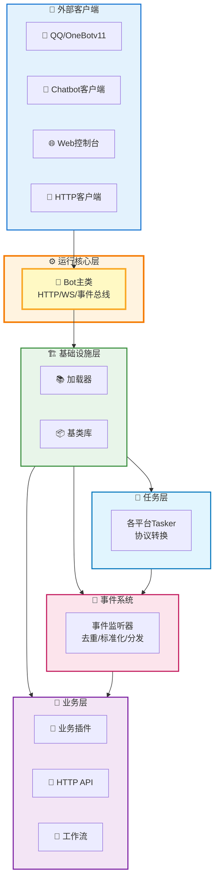

# XRK-AGT 文档中心

欢迎来到 XRK-AGT 框架文档中心。

> **主入口文档**：建议从 [PROJECT_OVERVIEW.md](../PROJECT_OVERVIEW.md) 与本页开始阅读。

---

## 📚 文档导航

### 🚀 快速开始

- **[项目概览 (PROJECT_OVERVIEW.md)](../PROJECT_OVERVIEW.md)** - 了解项目整体架构和目录结构
- **[Bot 主类文档 (docs/bot.md)](bot.md)** - 核心运行时对象，负责服务生命周期、HTTP/WebSocket、事件派发等
- **[框架可扩展性指南 (docs/框架可扩展性指南.md)](框架可扩展性指南.md)** - 7 大扩展点与 Core 开发完整说明，包含最佳实践和代码质量规范 ⭐

### 🏗️ 架构层次

XRK-AGT 采用清晰的分层架构，各层职责如下：

**层次说明**：

- **运行核心层**（`src/bot.js`）：系统入口，统一管理 HTTP/HTTPS/WebSocket、反向代理和事件总线 `Bot.em`
- **基础设施层（辅助层）**（`src/infrastructure/`）：提供基类、加载器、HTTP 业务层、数据库客户端等通用能力，不包含业务逻辑
- **核心模块层（Core）**（`core/*/`）：按业务拆分的模块集合，内部再分为 `tasker/`、`events/`、`plugin/`、`http/`、`stream/`、`commonconfig/`、`www/` 等子目录

> **重要说明**：本项目的"业务实现"都应该放在 `core/*/(plugin|http|stream)` 下；`src/*` 主要是基础设施/工厂/通用能力，**不要把业务 API/工作流写进 `src`**（否则会破坏多 core 扩展机制）。

**system-Core 内置模块**：XRK-AGT 内置了完整的 system-Core 模块，提供10个HTTP API模块、6个工作流（50+个MCP工具）、4个Tasker和Web控制台。详见 **[system-Core 特性文档](system-core.md)** ⭐。

详细说明请参考 [项目概览](../PROJECT_OVERVIEW.md) 的「架构层次总览」章节。

### 🔌 插件与事件系统

- **[插件基类 (docs/plugin-base.md)](plugin-base.md)** - 插件基类 `plugin` 的设计、规则匹配与上下文管理
- **[插件加载器 (docs/plugins-loader.md)](plugins-loader.md)** - `PluginsLoader` 的插件加载、事件调度、冷却与节流机制
- **[事件系统标准化文档 (docs/事件系统标准化文档.md)](事件系统标准化文档.md)** - 事件命名规范、字段责任、处理流程、事件监听器开发指南

### 🔄 Tasker 系统（任务层/事件生成器）

- **[Tasker 加载器 (docs/tasker-loader.md)](tasker-loader.md)** - `TaskerLoader` 如何扫描并加载 Tasker（事件生成器）
- **[Tasker 底层规范 (docs/tasker-base-spec.md)](tasker-base-spec.md)** - Tasker 基础接口规范
- **[OneBotv11 Tasker (docs/tasker-onebotv11.md)](tasker-onebotv11.md)** - OneBotv11 Tasker 完整文档，包含全局对象说明和使用示例

### 🌐 HTTP/API 层

- **[HTTP API 基类 (docs/http-api.md)](http-api.md)** - `HttpApi` 基类，统一路由、WebSocket 与中间件注册方式
- **[API 加载器 (docs/api-loader.md)](api-loader.md)** - `ApiLoader` 的 API 自动加载、排序与热重载机制
- **[Server 服务器架构 (docs/server.md)](server.md)** - HTTP/HTTPS/WebSocket 服务、反向代理、静态文件服务等完整说明
- **[HTTP 业务层 (docs/http-business-layer.md)](http-business-layer.md)** - 重定向、CDN、反向代理增强、负载均衡等企业级功能
- **[system-Core 特性 (docs/system-core.md)](system-core.md)** - system-Core 内置模块完整说明，包含所有HTTP API、工作流、插件和Web控制台 ⭐

### 🤖 AI 工作流

- **说明**：Node 侧"多步工作流/WorkflowManager/TODO"已移除；复杂 Agent 编排请使用 **Python 子服务端（LangChain/LangGraph）**，主服务端提供统一的 **v3 LLM Provider** 与 **MCP 工具注入/执行**。
- **[MCP 完整指南 (docs/mcp-guide.md)](mcp-guide.md)** - MCP 工具注册与连接
- **[MCP 配置指南 (docs/mcp-config-guide.md)](mcp-config-guide.md)** - Cursor、Claude Desktop 等外部平台连接配置
- **[AI Stream (docs/aistream.md)](aistream.md)** - `AIStream` 基类技术文档，涵盖 Embedding、多提供商支持、Function Calling 与上下文增强（MCP 工具 vs Call Function 见该文档）
- **[工厂系统 (docs/factory.md)](factory.md)** - LLM/Vision/ASR/TTS 工厂系统，统一管理多厂商 AI 服务提供商
- **[子服务端 API (docs/subserver-api.md)](subserver-api.md)** - Python 子服务端 API 文档，LangChain + 向量服务 + 与主服务 v3 的衔接

### ⚙️ 配置与工具

- **[配置基类 (docs/config-base.md)](config-base.md)** - 配置基类 `ConfigBase`，包括 YAML/JSON 读写、校验、按路径读写、多文件配置等
- **[渲染器 (docs/renderer.md)](renderer.md)** - 渲染器基类 `Renderer`，模板渲染与文件监听机制
- **[工具类 (docs/botutil.md)](botutil.md)** - 工具类 `BotUtil`，封装日志、缓存、文件/网络操作与异步控制等基础能力

### 📱 应用开发

- **[应用开发指南 (docs/app-dev.md)](app-dev.md)** - 应用 & 前后端开发总览（`app.js` 引导、Web 控制台、配置体系等）
- **[Docker 部署指南 (docs/docker.md)](docker.md)** - Docker 容器化部署说明，包含 docker-compose 配置和使用指南

---

## 🎯 按角色推荐阅读

### 插件开发者

1. **[项目概览](../PROJECT_OVERVIEW.md)** - 了解整体架构和分层设计
2. **[Bot 主类](bot.md)** - 了解整体运行环境与事件来源
3. **[框架可扩展性指南](框架可扩展性指南.md)** - 学习扩展开发的最佳实践和代码质量规范 ⭐
4. **[插件基类](plugin-base.md)** - 学习插件基类与规则/上下文用法
5. **[插件加载器](plugins-loader.md)** - 了解事件如何流转到插件
6. **[事件系统标准化文档](事件系统标准化文档.md)** - 了解事件命名规范、监听器开发和监听方式
7. **[AI Stream](aistream.md)** - 了解 AI 调用与上下文增强（复杂多步编排在子服务端）

### Tasker 开发者（任务层/事件生成器开发者）

1. **[项目概览](../PROJECT_OVERVIEW.md)** - 了解架构层次和 Tasker 定位
2. **[Tasker 加载器](tasker-loader.md)** - 了解 Tasker 是如何被框架加载的
3. **[Tasker 底层规范](tasker-base-spec.md)** - 了解 Tasker 基础接口规范
4. **[OneBotv11 Tasker](tasker-onebotv11.md)** - 参考成熟实现，学习事件转译与对象封装方式
5. **[事件系统标准化文档](事件系统标准化文档.md)** - 学习如何创建新的事件监听器（包含开发指南）
6. **[Bot 主类](bot.md)** - 理解 Tasker 与 `Bot` 的交互点（`Bot.tasker` / `Bot.wsf` / `Bot.em`）

### 后端/API 开发者

1. **[项目概览](../PROJECT_OVERVIEW.md)** - 了解架构层次和 API 定位
2. **[Bot 主类](bot.md)** - 了解 HTTP 服务器、认证、中间件栈
3. **[HTTP API 基类](http-api.md)** - 学习如何定义一个新的 API 模块
4. **[API 加载器](api-loader.md)** - 理解 API 模块如何被自动加载与热重载
5. **[Server 服务器架构](server.md)** - 了解 HTTP/HTTPS/WebSocket 服务、反向代理等
6. **[HTTP 业务层](http-business-layer.md)** - 了解重定向、CDN、负载均衡等企业级功能

### 运维 / 配置管理者

1. **[项目概览](../PROJECT_OVERVIEW.md)** - 了解整体架构和目录结构
2. **[配置基类](config-base.md)** - 理解配置读写与校验机制
3. **[工厂系统](factory.md)** - 了解 AI 服务提供商的配置与管理
4. **[Bot 主类](bot.md)** - 了解服务端口、反向代理、CORS 与安全策略
5. **[Docker 部署指南](docker.md)** - Docker 容器化部署说明
6. **[Server 服务器架构](server.md)** - 了解服务器配置和部署

### 前端 / 渲染相关开发者

1. **[项目概览](../PROJECT_OVERVIEW.md)** - 了解架构层次
2. **[渲染器](renderer.md)** - 了解 HTML 模板渲染与文件生成
3. **[应用开发指南](app-dev.md)** - 了解 Web 控制台开发
4. **[HTTP API 基类](http-api.md)** - 了解后端 API 接口设计
5. **[system-Core 特性](system-core.md)** - 了解内置 Web 控制台和 API

---

## 典型开发路径

### 创建自己的 Core 模块

业务均在 `core/` 下按模块开发；每个 core 内含 `plugin/`、`tasker/`、`events/`、`http/`、`stream/`、`commonconfig/`、`www/<目录名>/` 等业务目录（按需创建）。继承对应基类、使用 `#` 别名导入、放置到约定目录即可自动加载。

**完整流程与目录说明**：详见 **[框架可扩展性指南 - Core 模块开发](框架可扩展性指南.md#core-模块开发)** ⭐

### 编写一个简单指令插件

1. 阅读 **[项目概览](../PROJECT_OVERVIEW.md)** 中的架构层次说明
2. 阅读 **[Bot 主类](bot.md)** 与 **[插件基类](plugin-base.md)**
3. 在任意 core 目录的 `plugin/` 子目录下新建插件 JS 文件（如 `core/my-core/plugin/my-plugin.js`）

### 新增一个 API 接口

1. 阅读 **[HTTP API 基类](http-api.md)** 与 **[API 加载器](api-loader.md)**
2. 在任意 core 目录的 `http/` 子目录下新建一个 `.js` 文件，导出一个符合 `HttpApi` 结构的对象或类
3. 重启或等待 `ApiLoader` 热重载，使用浏览器或 Postman 验证新接口

### 接入新的 IM 平台（创建新 Tasker）

1. 阅读 **[项目概览](../PROJECT_OVERVIEW.md)** 了解架构层次
2. 阅读 **[Tasker 加载器](tasker-loader.md)** 与 **[Tasker 底层规范](tasker-base-spec.md)**
3. 参考 **[OneBotv11 Tasker](tasker-onebotv11.md)**，在任意 core 目录的 `tasker/` 子目录中编写新 Tasker 文件
4. 阅读 **[事件系统标准化文档](事件系统标准化文档.md)** 中的"事件监听器开发指南"章节，在对应 core 的 `events/` 子目录中创建事件监听器
5. 确保对外暴露统一的事件结构（`post_type/message_type/notice_type` 等），这样可以复用现有插件

### 创建新的 AI 工作流

1. 阅读 **[AI Stream](aistream.md)** 了解基类设计
2. 阅读 **[工厂系统](factory.md)** 了解如何选择和使用 LLM 提供商
3. 在任意 core 目录的 `stream/` 子目录中创建新的工作流文件
4. 基于 `AIStream` 实现自定义工作流逻辑
5. 在插件或 API 中调用新工作流

### 接入新的 AI 服务提供商

1. 阅读 **[工厂系统](factory.md)** 了解工厂系统的设计和扩展方式
2. 实现新的客户端类（遵循接口规范）
3. 使用工厂的 `registerProvider()` 方法注册新提供商
4. 创建对应的配置文件（如 `myprovider_llm.yaml`）
5. 在配置管理界面中配置 API Key 等参数

### 配置外部 AI 平台连接（MCP）

1. 阅读 **[MCP 配置指南](mcp-config-guide.md)** 了解如何配置 Cursor、Claude Desktop 等外部平台
2. 阅读 **[MCP 完整指南](mcp-guide.md)** 了解 MCP 工具注册与连接机制
3. 在外部平台配置文件中添加 XRK-AGT 的 MCP 服务器地址

### 部署到生产环境

1. 阅读 **[Docker 部署指南](docker.md)** 了解容器化部署
2. 阅读 **[Server 服务器架构](server.md)** 了解服务器配置
3. 阅读 **[HTTP 业务层](http-business-layer.md)** 了解反向代理、负载均衡等企业级功能

---

## 🔍 全局对象说明

### Bot 主对象

`Bot` 是系统的核心全局对象，继承自 `EventEmitter`。详细说明请参考：

- **[Bot 主类文档](bot.md)** - 完整的 Bot 类说明
- **[OneBotv11 Tasker 文档](tasker-onebotv11.md)** - Bot 对象结构和使用示例

### 常用全局对象

- `Bot` - Bot 主实例（EventEmitter）
- `Bot[self_id]` - 特定 Bot 实例
- `Bot.tasker` - Tasker 列表（事件生成器列表）
- `Bot.uin` - Bot QQ 号列表
- `Bot.wsf` - WebSocket 工厂函数映射
- `Bot.em()` - 事件触发方法
- `Bot.makeLog()` - 日志方法

详细说明请参考各 Tasker 文档。

---

## ⚠️ 重要提示

1. **架构层次**：理解基础设施层（辅助层）和业务层的区别，基础设施层提供通用能力，业务层实现具体功能
2. **全局对象访问**：始终通过 `Bot[self_id]` 访问 Bot 实例，不要直接使用 `e.bot`（除非确保已初始化）
3. **事件命名**：遵循 `tasker.类型.子类型` 格式，如 `onebot.message.group.normal`
4. **错误处理**：所有异步操作都应使用 try-catch，API 调用失败会抛出错误
5. **Bot 实例创建**：不要手动 `import Bot` 或 `new Bot()`，通过 `node app` / `node start.js` 启动，框架会自动创建并挂载全局 `Bot` 实例

---

## 相关资源

- **[项目概览](../PROJECT_OVERVIEW.md)** - 项目整体架构说明
- **[GitHub 仓库](https://github.com/sunflowermm/XRK-AGT)** - 源代码仓库
- **[GitCode 仓库](https://gitcode.com/Xrkseek/XRK-AGT)** - 国内镜像仓库

---

*最后更新：2026-02-12*

