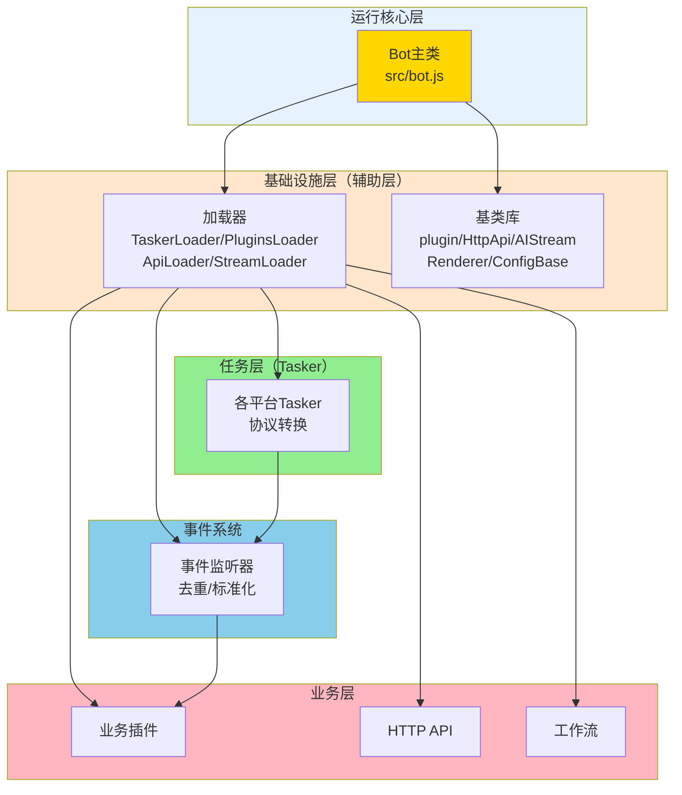

# XRK-AGT 文档中心

欢迎来到 XRK-AGT 框架文档中心。

> **推荐阅读**: [`完整文档.md`](完整文档.md) - 整合了所有核心文档，提供完整的开发指南和API参考

---

## 📚 文档导航

### 🚀 快速开始

- **[完整文档](完整文档.md)** - **推荐从这里开始**，整合了所有核心文档
- **[项目概览](../PROJECT_OVERVIEW.md)** - 了解项目整体架构和目录结构
- **[Bot 主类](bot.md)** - 核心运行时对象，负责服务生命周期、HTTP/WebSocket、事件派发等

### 🏗️ 架构层次

XRK-AGT 采用清晰的分层架构：

**层次说明**：

- **运行核心层** (`src/bot.js`) - 系统入口，统一管理所有组件
- **基础设施层（辅助层）** (`src/infrastructure/`) - 提供基类、加载器、工具，不包含业务逻辑
- **核心模块层（Core）** (`core/*/`) - 每个 core 是一个独立的模块，包含：
  - **任务层（Tasker）** (`core/*/tasker/`) - 协议转换，生成统一事件
  - **事件系统** (`core/*/events/`) - 事件标准化和预处理
  - **业务层** (`core/*/plugin/`, `core/*/http/`, `core/*/stream/`) - 具体业务实现
  - **配置层** (`core/*/commonconfig/`) - 配置管理
  - **静态资源** (`core/*/www/`) - 静态文件，自动挂载到 `/core/{coreName}/*`

详细说明请参考 [项目概览](../PROJECT_OVERVIEW.md) 的「架构层次总览」章节。

### 🔌 插件系统

- **[插件基类](plugin-base.md)** - 插件基类 `plugin` 的设计、规则匹配与上下文管理
- **[插件加载器](plugins-loader.md)** - `PluginsLoader` 的插件加载、事件调度、冷却与节流机制
- **[事件系统](事件系统标准化文档.md)** - 事件命名/字段责任/流程速览（精简版）
- **[事件监听器开发](事件监听器开发指南.md)** - 最小事件监听器模版与去重注意事项

### 🔄 Tasker 系统（任务层/事件生成器）

- **[Tasker 加载器](tasker-loader.md)** - `TaskerLoader` 如何扫描并加载 Tasker（事件生成器）
- **[Tasker 底层规范](tasker-base-spec.md)** - Tasker 基础接口规范
- **[OneBotv11 Tasker](tasker-onebotv11.md)** - OneBotv11 Tasker 完整文档，包含全局对象说明和使用示例

### 📡 事件系统

- **[事件系统标准化文档](事件系统标准化文档.md)** - 事件命名规范、字段责任、处理流程
- **[事件监听器开发指南](事件监听器开发指南.md)** - 如何为框架注册新的事件监听器

### 🌐 HTTP/API 层

- **[HTTP API 基类](http-api.md)** - `HttpApi` 基类，统一路由、WebSocket 与中间件注册方式
- **[API 加载器](api-loader.md)** - `ApiLoader` 的 API 自动加载、排序与热重载机制

### 🤖 AI 工作流

- **[工作流系统完整文档](工作流系统完整文档.md)** - **工作流系统完整文档** ⭐ 推荐
  - 系统概述与核心架构
  - 工作流执行流程（简单任务和复杂任务）
  - 工作流管理器详解
  - 工作流开发指南
  - 记忆系统与工作流合并机制
  - MCP工具注册
  - 最佳实践与常见问题
- **[工作流开发文档](工作流开发文档.md)** - 工作流开发文档（补充）
- **[复杂任务示例](workflow-complex-task-example.md)** - 复杂任务完整调用流程模拟
- **[记忆系统文档](workflow-memory-system.md)** - 工作流记忆系统详细文档
- **[MCP完整指南](mcp-guide.md)** - MCP工具注册与连接
- **[AI Stream](aistream.md)** - `AIStream` 基类技术文档，涵盖 Embedding、多提供商支持、Function Calling 与上下文增强

### ⚙️ 配置与工具

- **[配置基类](config-base.md)** - 配置基类 `ConfigBase`，包括 YAML/JSON 读写、校验、按路径读写、多文件配置等
- **[渲染器](renderer.md)** - 渲染器基类 `Renderer`，模板渲染与文件监听机制
- **[工具类](botutil.md)** - 工具类 `BotUtil`，封装日志、缓存、文件/网络操作与异步控制等基础能力

### 📱 应用开发

- **[应用开发指南](app-dev.md)** - 应用 & 前后端开发总览（`app.js` 引导、Web 控制台、配置体系等）

---

## 🎯 按角色推荐阅读

### 插件开发者

1. **[项目概览](../PROJECT_OVERVIEW.md)** - 了解整体架构和分层设计
2. **[Bot 主类](bot.md)** - 了解整体运行环境与事件来源
3. **[插件基类](plugin-base.md)** - 学习插件基类与规则/上下文用法
4. **[插件加载器](plugins-loader.md)** - 了解事件如何流转到插件
5. **[事件系统](事件系统标准化文档.md)** - 了解事件命名规范和监听方式
6. **[工作流系统完整文档](工作流系统完整文档.md)** - 需要使用 AI 工作流时再阅读

### Tasker 开发者（任务层/事件生成器开发者）

1. **[项目概览](../PROJECT_OVERVIEW.md)** - 了解架构层次和 Tasker 定位
2. **[Tasker 加载器](tasker-loader.md)** - 了解 Tasker 是如何被框架加载的
3. **[Tasker 底层规范](tasker-base-spec.md)** - 了解 Tasker 基础接口规范
4. **[OneBotv11 Tasker](tasker-onebotv11.md)** - 参考成熟实现，学习事件转译与对象封装方式
5. **[事件监听器开发指南](事件监听器开发指南.md)** - 学习如何创建新的事件监听器
6. **[Bot 主类](bot.md)** - 理解 Tasker 与 `Bot` 的交互点（`Bot.tasker` / `Bot.wsf` / `Bot.em`）

### 后端/API 开发者

1. **[项目概览](../PROJECT_OVERVIEW.md)** - 了解架构层次和 API 定位
2. **[Bot 主类](bot.md)** - 了解 HTTP 服务器、认证、中间件栈
3. **[HTTP API 基类](http-api.md)** - 学习如何定义一个新的 API 模块
4. **[API 加载器](api-loader.md)** - 理解 API 模块如何被自动加载与热重载

### 运维 / 配置管理者

1. **[项目概览](../PROJECT_OVERVIEW.md)** - 了解整体架构和目录结构
2. **[配置基类](config-base.md)** - 理解配置读写与校验机制
3. **[Bot 主类](bot.md)** - 了解服务端口、反向代理、CORS 与安全策略

### 前端 / 渲染相关开发者

1. **[项目概览](../PROJECT_OVERVIEW.md)** - 了解架构层次
2. **[渲染器](renderer.md)** - 了解 HTML 模板渲染与文件生成
3. **[应用开发指南](app-dev.md)** - 了解 Web 控制台开发

---

## 📖 典型开发路径

### 创建自己的 Core 模块

框架支持多 core 模块架构，每个 core 是一个独立的模块：

1. **创建 core 目录**：在 `core/` 目录下创建新的 core 目录（如 `core/my-core/`）

2. **创建子目录结构**（可选，根据需要创建）：
   - `plugin/` - 业务插件
   - `tasker/` - 任务层（协议适配器）
   - `events/` - 事件监听器
   - `http/` - HTTP API
   - `stream/` - AI 工作流
   - `commonconfig/` - 配置管理
   - `www/` - 静态资源（可选，会自动挂载到 `/core/{coreName}/*`）
     - 每个 `www/<目录名>` 会自动挂载到 `/<目录名>`（避免路径冲突）

3. **package.json 支持**（可选）：
   - 可以在 core 目录下创建 `package.json` 来管理该 core 的依赖
   - 在项目根目录执行 `pnpm install` 时，会自动安装所有 core 的依赖
   - 框架支持 pnpm workspace，core 目录会自动加入 workspace

4. **放置扩展文件**：
   - 将扩展文件放置到对应的子目录中
   - 框架会自动扫描并加载所有 core 目录
   - 不同 core 的资源可以相互使用（如 core A 的 plugin 可以使用 core B 的 tasker）

### 编写一个简单指令插件

1. 阅读 **[项目概览](../PROJECT_OVERVIEW.md)** 中的架构层次说明
2. 阅读 **[Bot 主类](bot.md)** 与 **[插件基类](plugin-base.md)**
3. 在任意 core 目录的 `plugin/` 子目录下新建插件 JS 文件（如 `core/my-core/plugin/my-plugin.js`）

### 新增一个 API 接口

1. 阅读 **[HTTP API 基类](http-api.md)** 与 **[API 加载器](api-loader.md)**
2. 在任意 core 目录的 `http/` 子目录下新建一个 `.js` 文件，导出一个符合 `HttpApi` 结构的对象或类
3. 重启或等待 `ApiLoader` 热重载，使用浏览器或 Postman 验证新接口

### 接入新的 IM 平台（创建新 Tasker）

1. 阅读 **[项目概览](../PROJECT_OVERVIEW.md)** 了解架构层次
2. 阅读 **[Tasker 加载器](tasker-loader.md)** 与 **[Tasker 底层规范](tasker-base-spec.md)**
3. 参考 **[OneBotv11 Tasker](tasker-onebotv11.md)**，在任意 core 目录的 `tasker/` 子目录中编写新 Tasker 文件
4. 阅读 **[事件监听器开发指南](事件监听器开发指南.md)**，在对应 core 的 `events/` 子目录中创建事件监听器
5. 确保对外暴露统一的事件结构（`post_type/message_type/notice_type` 等），这样可以复用现有插件

### 创建新的 AI 工作流

1. 阅读 **[AI Stream](aistream.md)** 了解基类设计
2. 在任意 core 目录的 `stream/` 子目录中创建新的工作流文件
3. 基于 `AIStream` 实现自定义工作流逻辑
4. 在插件或 API 中调用新工作流

---

## 🔍 全局对象说明

### Bot 主对象

`Bot` 是系统的核心全局对象，继承自 `EventEmitter`。详细说明请参考：

- **[Bot 主类文档](bot.md)** - 完整的 Bot 类说明
- **[OneBotv11 Tasker 文档](tasker-onebotv11.md)** - Bot 对象结构和使用示例

### 常用全局对象

- `Bot` - Bot 主实例（EventEmitter）
- `Bot[self_id]` - 特定 Bot 实例
- `Bot.tasker` - Tasker 列表（事件生成器列表）
- `Bot.uin` - Bot QQ 号列表
- `Bot.wsf` - WebSocket 工厂函数映射
- `Bot.em()` - 事件触发方法
- `Bot.makeLog()` - 日志方法

详细说明请参考各 Tasker 文档。

---

## ⚠️ 重要提示

1. **架构层次**：理解基础设施层（辅助层）和业务层的区别，基础设施层提供通用能力，业务层实现具体功能
2. **全局对象访问**：始终通过 `Bot[self_id]` 访问 Bot 实例，不要直接使用 `e.bot`（除非确保已初始化）
3. **事件命名**：遵循 `tasker.类型.子类型` 格式，如 `onebot.message.group.normal`
4. **错误处理**：所有异步操作都应使用 try-catch，API 调用失败会抛出错误
5. **文档更新**：本文档会持续更新，请定期查看最新版本

---

## 📝 文档贡献

如果发现文档错误或需要补充内容，请：

1. 检查代码实现是否与文档一致
2. 确保示例代码可以正常运行
3. 避免无端引用不存在的对象或方法
4. 提供完整、准确的说明
5. 保持与架构层次的一致性

---

## 🔗 相关资源

- **[项目概览](../PROJECT_OVERVIEW.md)** - 项目整体架构说明
- **[GitHub 仓库](https://github.com/sunflowermm/XRK-AGT)** - 源代码仓库
- **[GitCode 仓库](https://gitcode.com/Xrkseek/XRK-AGT)** - 国内镜像仓库

---

*最后更新：2025-12-26*
