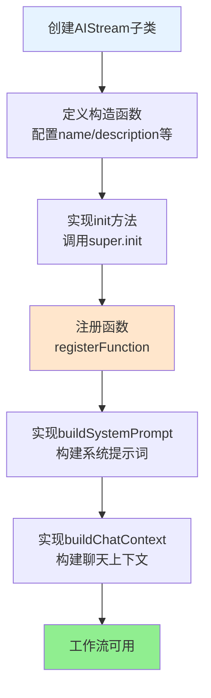

# 工作流系统开发指南

## 概述

工作流系统是一个通用的、可扩展的多步骤任务执行框架。它允许你快速构建自定义工作流，无需修改底层代码。

**核心特性**：
- **通用性**：底层不包含任何特化逻辑，适用于所有业务场景
- **可扩展性**：通过注册函数和自定义提示，轻松扩展功能
- **上下文传递**：自动在步骤间传递执行结果
- **标准化**：统一的接口和规范，易于集成

## 快速开始

**工作流开发流程**:



### 创建你的第一个工作流

```javascript
import AIStream from '#infrastructure/aistream/aistream.js';
import BotUtil from '#utils/botutil.js';

export default class MyWorkflow extends AIStream {
  constructor() {
    super({
      name: 'my_workflow',
      description: '我的自定义工作流',
      version: '1.0.0',
      author: 'YourName',
      priority: 100,
      config: {
        enabled: true,
        temperature: 0.7,
        maxTokens: 2000
      }
    });
  }

  async init() {
    await super.init();
    this.registerAllFunctions();
    BotUtil.makeLog('info', `[${this.name}] 工作流已初始化`, 'MyWorkflow');
  }

  registerAllFunctions() {
    this.registerFunction('my_function', {
      description: '我的功能',
      prompt: `[我的功能:参数] - 功能描述`,
      parser: (text, context) => {
        const functions = [];
        const reg = /\[我的功能:([^\]]+)\]/gi;
        let match;
        while ((match = reg.exec(text)) !== null) {
          functions.push({ 
            type: 'my_function', 
            params: { param: match[1].trim() } 
          });
        }
        return { 
          functions, 
          cleanText: text.replace(reg, '').trim() 
        };
      },
      handler: async (params, context) => {
        const { param } = params || {};
        if (!param) return;
        
        context.myResult = '执行结果';
        
        if (context.workflowId) {
          await this.storeNote(
            context.workflowId, 
            `【执行结果】\n${context.myResult}`, 
            'my_function', 
            true
          );
        }
      },
      enabled: true
    });
  }

  buildSystemPrompt(context) {
    return `【我的工作流】
这是我的自定义工作流描述。

【可用功能】
1. [我的功能:参数] - 功能说明`;
  }

  async buildChatContext(e, question) {
    return [];
  }
}
```

## 核心概念

### 1. 函数注册

函数是工作流的基本执行单元。每个函数包含：
- `description`: 函数描述
- `prompt`: 用户可见的命令格式
- `parser`: 解析文本中的函数调用
- `handler`: 执行函数逻辑
- `enabled`: 是否启用

```javascript
this.registerFunction('function_name', {
  description: '函数描述',
  prompt: `[命令格式] - 使用说明`,
  parser: (text, context) => {
    // 返回 { functions: [], cleanText: '' }
  },
  handler: async (params, context) => {
    // 执行逻辑
  },
  enabled: true
});
```

### 2. 上下文传递

工作流会自动在步骤间传递上下文：

```javascript
// 步骤1：设置数据
handler: async (params, context) => {
  context.myData = '数据';
  context.myResult = { success: true };
}

// 步骤2：自动获取数据
handler: async (params, context) => {
  const data = context.myData; // 自动可用
  const result = context.myResult; // 自动可用
}
```

### 3. 笔记系统

在工作流中自动存储笔记：

```javascript
if (context.workflowId) {
  await this.storeNote(
    context.workflowId,
    '笔记内容',
    'source',
    true // temporary
  );
}
```

### 4. 工作流决策

系统会自动判断是否需要多步骤执行：

```javascript
const decision = await this.workflowManager.decideWorkflowMode(e, goal);
if (decision.shouldUseTodo) {
  await this.workflowManager.createWorkflow(e, goal, decision.todos);
}
```

## 实际使用场景

### 场景1：数据处理工作流

```javascript
export default class DataProcessingWorkflow extends AIStream {
  registerAllFunctions() {
    // 读取数据
    this.registerFunction('read_data', {
      description: '读取数据文件',
      prompt: `[读取数据:文件路径] - 读取数据文件`,
      parser: (text, context) => {
        const functions = [];
        const reg = /\[读取数据:([^\]]+)\]/gi;
        let match;
        while ((match = reg.exec(text)) !== null) {
          functions.push({ 
            type: 'read_data', 
            params: { filePath: match[1].trim() } 
          });
        }
        return { 
          functions, 
          cleanText: text.replace(reg, '').trim() 
        };
      },
      handler: async (params, context) => {
        const { filePath } = params || {};
        if (!filePath) return;
        
        const data = await this.readDataFile(filePath);
        context.dataContent = data;
        
        if (context.workflowId) {
          await this.storeNote(
            context.workflowId,
            `【数据读取】\n文件：${filePath}\n数据行数：${data.length}`,
            'read_data',
            true
          );
        }
      },
      enabled: true
    });

    // 处理数据
    this.registerFunction('process_data', {
      description: '处理数据',
      prompt: `[处理数据] - 处理已读取的数据`,
      parser: (text, context) => {
        if (!text.includes('[处理数据]')) {
          return { functions: [], cleanText: text };
        }
        return {
          functions: [{ type: 'process_data', params: {} }],
          cleanText: text.replace(/\[处理数据\]/g, '').trim()
        };
      },
      handler: async (params, context) => {
        if (!context.dataContent) {
          context.processError = '未找到数据内容';
          return;
        }
        
        const processed = await this.processData(context.dataContent);
        context.processedData = processed;
        
        if (context.workflowId) {
          await this.storeNote(
            context.workflowId,
            `【数据处理】\n处理完成，结果行数：${processed.length}`,
            'process_data',
            true
          );
        }
      },
      enabled: true
    });
  }
}
```

### 场景2：API集成工作流

```javascript
export default class APIIntegrationWorkflow extends AIStream {
  registerAllFunctions() {
    this.registerFunction('call_api', {
      description: '调用外部API',
      prompt: `[调用API:URL:参数] - 调用外部API`,
      parser: (text, context) => {
        const functions = [];
        const reg = /\[调用API:([^:]+):([^\]]+)\]/gi;
        let match;
        while ((match = reg.exec(text)) !== null) {
          functions.push({ 
            type: 'call_api', 
            params: { 
              url: match[1].trim(),
              params: JSON.parse(match[2].trim())
            } 
          });
        }
        return { 
          functions, 
          cleanText: text.replace(reg, '').trim() 
        };
      },
      handler: async (params, context) => {
        const { url, params: apiParams } = params || {};
        if (!url) return;
        
        try {
          const response = await fetch(url, {
            method: 'POST',
            headers: { 'Content-Type': 'application/json' },
            body: JSON.stringify(apiParams)
          });
          
          const data = await response.json();
          context.apiResponse = data;
          
          if (context.workflowId) {
            await this.storeNote(
              context.workflowId,
              `【API调用】\nURL：${url}\n响应：${JSON.stringify(data)}`,
              'call_api',
              true
            );
          }
        } catch (error) {
          context.apiError = error.message;
        }
      },
      enabled: true
    });
  }
}
```

## 高级用法

### 自定义系统提示

```javascript
buildSystemPrompt(context) {
  const functionsPrompt = this.buildFunctionsPrompt();
  
  return `【工作流名称】
工作流描述。

【可用功能】
${functionsPrompt}

【执行规则】
1. 规则1
2. 规则2`;
}
```

### 错误处理

统一使用context传递错误：

```javascript
handler: async (params, context) => {
  try {
    // 执行逻辑
  } catch (error) {
    context.myError = error.message;
    // 工作流会自动处理错误
  }
}
```

### 工作流合并

工作流可以自动合并多个stream的功能，无需额外配置。

## 最佳实践

### 1. 函数命名
- 使用小写字母和下划线：`my_function`
- 保持描述性：`create_document` 而不是 `create`

### 2. 参数解析
- 使用正则表达式精确匹配
- 清理文本中的函数调用标记
- 验证参数有效性

### 3. 上下文管理
- 使用有意义的键名：`fileContent` 而不是 `data`
- 避免覆盖重要上下文
- 及时清理不需要的数据

### 4. 错误处理
- 统一使用context传递错误
- 提供有意义的错误消息
- 记录错误到笔记系统

### 5. 性能优化
- 避免在handler中执行耗时操作
- 使用异步操作
- 合理使用笔记系统（避免过度存储）

## API参考

### WorkflowManager

#### createWorkflow(e, goal, initialTodos)
创建工作流

**参数**：
- `e`: 事件对象
- `goal`: 工作流目标
- `initialTodos`: 初始任务列表（可选）

**返回**：`workflowId`

#### decideWorkflowMode(e, goal)
判断是否需要工作流

**参数**：
- `e`: 事件对象
- `goal`: 任务目标

**返回**：`{ shouldUseTodo, response, todos }`

#### getWorkflow(workflowId)
获取工作流

**参数**：
- `workflowId`: 工作流ID

**返回**：工作流对象

### AIStream

#### registerFunction(name, config)
注册函数

**参数**：
- `name`: 函数名称
- `config`: 函数配置对象

#### buildSystemPrompt(context)
构建系统提示

**参数**：
- `context`: 上下文对象

**返回**：系统提示字符串

## 常见问题

### Q: 工作流不启动怎么办？

**A**: 检查以下几点：
1. `workflowManager`是否正确注入
2. `decideWorkflowMode`的返回值
3. 查看日志中的错误信息

### Q: 上下文不传递怎么办？

**A**: 确保：
1. 在handler中设置`context.xxx`
2. `workflowId`是否存在
3. 数据格式正确

### Q: 函数不执行怎么办？

**A**: 检查：
1. 函数是否已注册
2. parser是否正确解析
3. `enabled`是否为true

### Q: 如何调试工作流？

**A**: 
1. 查看工作流笔记：`workflow.notes`
2. 查看执行历史：`workflow.history`
3. 检查上下文：`workflow.context`

## 更多资源

- **架构文档**：[`WORKFLOW_ARCHITECTURE.md`](WORKFLOW_ARCHITECTURE.md) - 深入了解系统架构
- **代码示例**：查看`core/stream/tools.js`了解基础工具实现
- **复杂示例**：查看`core/stream/desktop.js`了解复杂工作流实现

- **代码示例**：查看`core/stream/tools.js`了解基础工具实现
- **复杂示例**：查看`core/stream/desktop.js`了解复杂工作流实现
