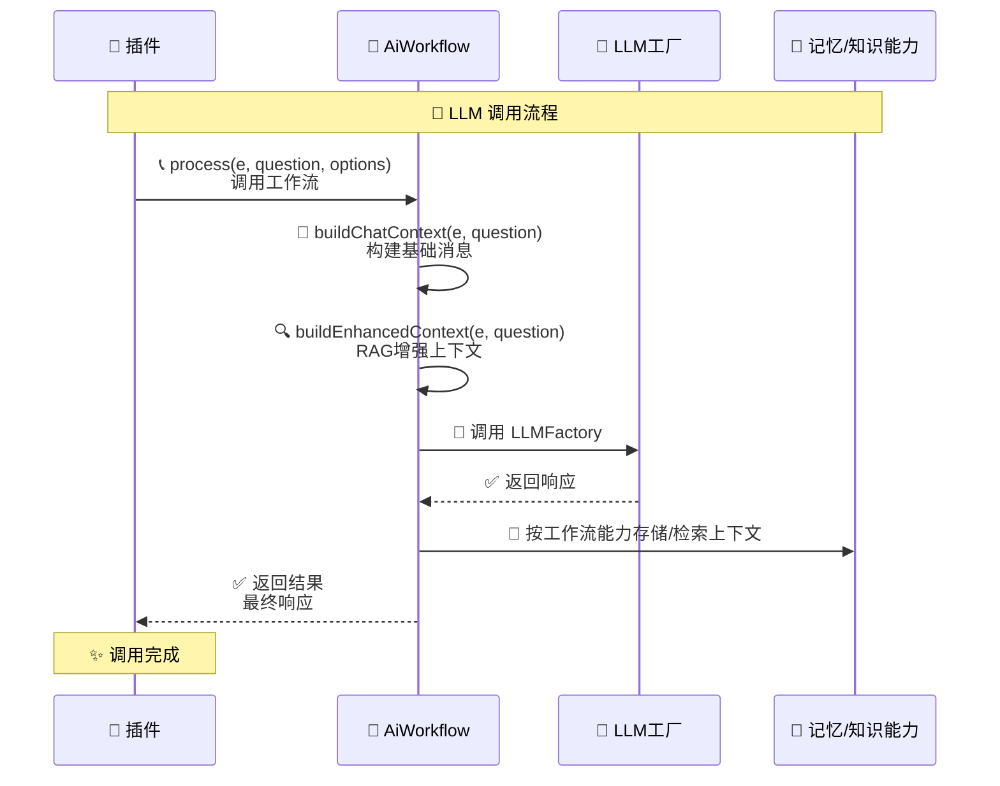

# AiWorkflow 工作流基类文档

> **文件位置**：`src/infrastructure/ai-workflow/ai-workflow.js`  
> **说明**：本文档描述 Node 侧 `AiWorkflow` 基类与 LLM/MCP 集成方式。  
> **底层基线**：[底层架构设计](底层架构设计.md) · **基类契约**：[base-classes.md](base-classes.md) · **Loader 模式**：[infrastructure-shared.md](infrastructure-shared.md)

`AiWorkflow` 是 XRK-AGT 的工作流基类，用于统一处理：
- 消息上下文构建
- LLM 调用（经 `LLMFactory`）
- MCP 工具调用（tool calling）
- 记忆/知识增强（按已加载工作流能力）

---

## 核心结论


- 工作流发现路径固定为 `core/*/workflow/*.js`
- 工具调用统一走 **LLM tool calling + MCP**，不走文本函数解析
- 当前不依赖已下线的子服务端 AI 业务接口
- 配置以 `runtimeConfig.aiWorkflow` + `core/system-Core/commonconfig/system.js` 为准

---

## 配置要点（对齐现状）

运行时文件：`data/server_bots/{port}/ai-workflow.yaml`  
模板文件：`config/default_config/ai-workflow.yaml`

常用字段：
- `llm.Provider`
- `llm.timeout`
- `llm.retry.*`
- `embedding.enabled` / `embedding.maxContexts`
- `mcp.*`
- `agentWorkspace.*`
- `tools.file.*`

说明：
- `ai-workflow.tools` 当前仅包含 `file` 配置段
- 工具工作流配置以现行 schema 与代码实现为准
- 工作流扫描路径固定为 `core/*/workflow/*.js`

---

## 常用方法

### `async init()`

初始化工作流（仅执行一次），由 `AiWorkflowLoader` 在加载时自动调用。

**初始化内容**：
- 若尚未存在，则初始化 MCP 工具映射 `this.mcpTools = new Map()`
- 子类可重写此方法进行自定义初始化（例如注册 MCP 工具）

### `buildSystemPrompt(context)` / `buildChatContext(e, question)`

抽象方法（可选实现）：
- `buildSystemPrompt` - 构建系统级提示词（角色设定、回复风格等）
- `buildChatContext` - 将事件与用户问题转换为 `messages` 数组

> 若子类未实现，基类会提供默认实现（返回空字符串/空数组）

---

## Embedding 与上下文增强

`AiWorkflow` 支持在工作流中执行上下文增强。是否使用、如何增强，以当前加载的记忆/知识工作流实现为准。

**核心方法**：

| 方法 | 说明 |
|------|------|
| `storeMessageMemory(groupId, message)` | 写入 MemoryManager 短期记忆 |
| `retrieveRelevantContexts(groupId, query)` | 经 MemoryManager 检索相关历史 |
| `buildEnhancedContext(e, question, baseMessages)` | RAG：历史对话 + 知识库（如 database 工作流） |

## 函数调用与 MCP 工具

AiWorkflow **不再解析/执行任何“文本函数调用 / ReAct”**，所有工具调用均通过 **LLM 工厂的 tool calling + MCP 协议** 完成：

- **tool calls 多轮交互**：由 `LLMFactory` 及各提供商客户端内部处理 `tool_calls` 循环，最终返回整理好的 `assistant.content` 文本给 AiWorkflow；流式场景下，客户端一边向前端推送 `delta.content`，一边在遇到 `finish_reason = "tool_calls"` 时收集并执行 MCP 工具。
- **MCP 工具注册**：AiWorkflow 通过 `registerMCPTool(name, options)` 将工具注册到 `this.mcpTools`，供 MCP 服务器发现和调用。
- **工作流工具作用域（streams）**：当通过 `/api/v3/chat/completions` 调用时，前端选择的工作流名称会被整理为 `streams` 白名单，传递给 LLM 客户端和 `MCPToolAdapter`，保证只有这些工作流下的工具可以被使用。

### `registerMCPTool(name, options)`

注册 MCP 工具（供 MCP 协议调用的标准工具）。

**参数**：
- `name` - 工具名称
- `options.handler` - 工具处理函数 `async (args, context) => {...}`，返回结构化结果
- `options.description` - 工具描述
- `options.inputSchema` - JSON Schema 格式的输入参数定义
- `options.enabled` - 是否启用（可被 `functionToggles` 覆盖）

> 工具返回值推荐 `this.successResponse(data)` / `this.errorResponse(code, message)`（AiWorkflow 基类）：
> - `successResponse(data)` → `{ success: true, data: { ...data, timestamp } }`
> - `errorResponse(code, message)` → `{ success: false, error: { code, message } }`

---

## LLM 调用

> **提示**：关于 LLM 工厂的详细说明、支持的提供商列表、如何扩展新提供商等，请参考 **[工厂系统文档](factory.md)**。



**核心方法**：

| 方法 | 说明 |
|------|------|
| `callAI(messages, apiConfig)` | 非流式调用 AI 接口 |
| `callAiWorkflow(messages, apiConfig, onDelta, options)` | 流式调用AI接口，通过 `onDelta` 回调返回增量文本 |
| `execute(e, question, config)` | 执行：构建上下文 → 调用LLM（含 MCP tool calling）→ 存储记忆 |
| `process(e, question, options)` | 工作流处理入口（单次对话 + MCP 工具调用） |

**process 方法参数**：
- `mergeWorkflows` - **唯一推荐**组合路径：副工作流名称列表（如 `memory`、`database`、`tools`、`desktop`）
- `enableMemory` / `enableDatabase` / `enableTools` - 无 `mergeWorkflows` 时的兼容别名，映射为副流后仍走 `AiWorkflowLoader.mergeWorkflows`（**不再**原地 mutate 主单例）
- 其余字段 - 作为 LLM `apiConfig` 覆盖（与 `this.config` 合并）

**工作流分类**：
- **对话主表面**：`chat`（及 `mergeWorkflows` 合成实例）
- **能力副流**：`memory`、`database`、`tools`、`desktop` 等，按名列入 `mergeWorkflows`
- **框架自研工具面**：声明 `frameworkToolSurface: true` 的流（如 `web`、`browser`）自动并入 chat 工具白名单，无需写入 `mergeWorkflows`

**请求上下文**：`runWithWorkflowRequestContext`（ALS）；MCP handler 的 `context.e` / `turnState` 只读 ALS。

**调用流程**：
1. `buildChatContext` / chat 自定义上下文 - 构建消息
2. `buildEnhancedContext` - 可选知识库钩子；长期记忆为简单 includes，**非**向量 embedding RAG
3. `callAI` - 调用 LLM（含 MCP tool calling）
4. 基类可 `storeMessageMemory` 写短期；chat 可见历史另有通路
5. 发送回复（chat 走 reply 协议；基类可直接 `e.reply`）

## 完整API参考

### 核心方法详解

#### `async process(e, question, options)`

工作流处理入口，支持工作流合并和上下文增强。

**参数**：
- `e` - 事件对象（QQ/IM/Chatbot 等消息事件）
- `question` - 用户问题（字符串或对象）
- `options` - 选项对象
  - `mergeWorkflows` - 副工作流名称数组（推荐唯一组合入口）
  - `enableMemory` / `enableDatabase` / `enableTools` - 兼容别名 → 并入副流列表
  - 其它键 - LLM 配置覆盖（provider, model, temperature 等）

**返回**：`Promise<string|null>` - AI回复文本

**示例**：
```javascript
// 基础调用（仅使用当前工作流）
await stream.process(e, e.msg);

// 推荐：显式 mergeWorkflows
await stream.process(e, e.msg, {
  mergeWorkflows: ['memory', 'database', 'tools', 'desktop']
});

// 兼容别名（无 mergeWorkflows 时映射为同上副流，不 mutate 单例）
await stream.process(e, e.msg, {
  enableMemory: true,
  enableDatabase: true,
  enableTools: true
});

// 自定义 LLM 字段与 merge 并列
await stream.process(e, e.msg, {
  mergeWorkflows: ['memory', 'tools'],
  provider: 'volcengine',
  temperature: 0.7
});
```

#### `async callAI(messages, apiConfig)`

非流式调用AI接口，支持重试和错误处理。

**参数**：
- `messages` - 消息数组（OpenAI格式）
- `apiConfig` - API配置（可选）

**返回**：`Promise<string>` - AI回复文本

**特点**：
- 通过 LLMFactory 执行统一调用
- 支持重试机制（可配置）
- 自动记录 Token 使用和成本

#### `async callAiWorkflow(messages, apiConfig, onDelta, options)`

流式调用AI接口，实时返回增量文本。

**参数**：
- `messages` - 消息数组
- `apiConfig` - API配置
- `onDelta` - 增量回调函数 `(delta: string) => void`
- `options` - 选项（可选）

**返回**：`Promise<string>` - 完整回复文本

**示例**：
```javascript
let fullText = '';
await stream.callAiWorkflow(messages, {}, (delta) => {
  fullText += delta;
  // 实时发送增量文本
  e.reply(delta);
});
```

#### `async buildEnhancedContext(e, question, baseMessages)`

构建增强上下文（RAG流程）。

**流程**：
1. 提取查询文本
2. 检索历史对话（`retrieveRelevantContexts`）
3. 检索知识库（`retrieveKnowledgeContexts`）
4. 优化和压缩上下文
5. 合并到消息数组

**返回**：`Promise<Array>` - 增强后的消息数组

### 上下文检索方法

#### `async retrieveRelevantContexts(groupId, query)`

检索相关历史对话。

**参数**：
- `groupId` - 群组ID或用户ID
- `query` - 查询文本

**返回**：`Promise<Array>` - 上下文数组，每个元素包含：
- `message` - 消息内容
- `similarity` - 相似度分数（0-1）
- `time` - 时间戳
- `userId` - 用户ID
- `nickname` - 昵称

#### `async retrieveKnowledgeContexts(query)`

检索知识库上下文（从合并的工作流中查找）。

**参数**：
- `query` - 查询文本

**返回**：`Promise<Array>` - 知识库上下文数组

### 工作流合并

禁止原地 `merge()`。合并请用：

- `process({ mergeWorkflows: ['tools', 'memory'] })`
- 或 `AiWorkflowLoader.mergeWorkflows({ main, secondary, ... })`

无 `mergeWorkflows` 时，`enableTools` / `enableMemory` / `enableDatabase` 会映射为副工作流名（兼容别名）：

```javascript
await workflow.process(e, question, {
  mergeWorkflows: ['tools', 'memory', 'database']
  // 或：enableTools: true, enableMemory: true, enableDatabase: true
});
```

---

## 使用示例

### 基础工作流实现

```javascript
import AiWorkflow from '#infrastructure/ai-workflow/ai-workflow.js';

export default class MyStream extends AiWorkflow {
  constructor() {
    super({
      name: 'my-stream',
      description: '我的自定义工作流',
      version: '1.0.5',
      priority: 50,
      config: {
        temperature: 0.8,
        maxTokens: 2000
      },
      embedding: { enabled: true }
    });
  }

  async init() {
    await super.init();
    // 在此注册 MCP 工具等初始化逻辑
    this.registerMCPTool('get_info', {
      description: '获取信息',
      inputSchema: {
        type: 'object',
        properties: {
          key: { type: 'string' }
        },
        required: ['key']
      },
      handler: async (args, context) => {
        return this.successResponse({ value: `you asked for ${args.key}` });
      }
    });
  }

  buildSystemPrompt(context) {
    return '你是一个智能助手...';
  }

  async buildChatContext(e, question) {
    const messages = [];
    messages.push({
      role: 'system',
      content: this.buildSystemPrompt({ e, question })
    });
    messages.push({
      role: 'user',
      content: typeof question === 'string' ? question : question?.text || ''
    });
    return messages;
  }
}
```

### 插件中调用工作流

```javascript
// 基础调用
const stream = this.getWorkflow('chat');
await stream.process(e, e.msg);

// 启用记忆和知识库
await stream.process(e, e.msg, {
  enableMemory: true,
  enableDatabase: true
});

// 合并主工作流 + 整合工具工作流
await stream.process(e, e.msg, {
  mergeWorkflows: ['desktop'],  // 合并主工作流
  enableMemory: true,         // 整合工具工作流
  enableDatabase: true,       // 整合工具工作流
  enableTools: true          // 整合工具工作流
});

// 自定义LLM配置
await stream.process(e, e.msg, {
  apiConfig: {
    provider: 'volcengine',
    model: 'gpt-4',
    temperature: 0.7
  }
});

// 流式调用（需要手动发送回复）
let fullText = '';
await stream.callAiWorkflow(messages, {}, (delta) => {
  fullText += delta;
  e.reply(delta);
});
```

### 工作流合并示例

```javascript
// 工作流合并应通过调用参数控制，不需要在 init() 中主动合并
// 调用时通过参数指定：
await stream.process(e, question, {
  enableTools: true,      // 自动整合 tools 工作流
  enableMemory: true,    // 自动整合 memory 工作流
  enableDatabase: true   // 自动整合 database 工作流
});
```

---

## 错误处理与重试

### 重试配置

与 **`core/system-Core/commonconfig/system.js`** 中 `ai-workflow.schema.fields.llm.retry` 一致，仅下列字段有效：

```yaml
llm:
  retry:
    enabled: true
    maxAttempts: 3
    delay: 2000
    retryOn: ["timeout", "network", "5xx"]   # 可选含 all，见 schema enum
```

> 若文档其它处出现 `maxDelay`、`backoffMultiplier`、`rate_limit` 等而未写入 schema，以 **schema + 实际 LLM 工厂实现** 为准。

### 错误分类（概念）

工厂侧可能对错误做分类与重试策略；具体以 **`LLMFactory`** 及各 provider 客户端为准。

---

## 性能优化

### 上下文优化

- **文本压缩**：`compressText()` 截断注入 prompt 的历史/知识片段
- **Token 估算**：`estimateTokens()` 估算文本 token 数量

### 缓存机制

- 工作流实例缓存（`AiWorkflowLoader`）
- 知识库 JSON 内存缓存（`database` 工作流）

---

## 监控与追踪

### MonitorService集成

基类 `AiWorkflow.execute` 会用流名作为 `traceId` 记步骤与 token；`ChatStream` 覆盖 `execute` 后以自有路径为主。Monitor 为进程内轻量观测，**非** OpenTelemetry；勿当作完整 APM。

`recordTokens` 的 traceId 须与 `startTrace` 一致（流名，如 `chat`），勿使用 `chat.callAI` 这类找不到 trace 的键。

---

## 相关文档

- **[system-Core 特性](system-core.md)** - system-Core 内置模块与工作流清单（以 `core/system-Core/workflow/*.js` 为准，含 `web` 等） ⭐
- **[框架可扩展性指南](框架可扩展性指南.md)** - 扩展开发完整指南
- **[工厂系统](factory.md)** - LLM（含多模态）/ASR/TTS 工厂系统
- **[子服务端 API](subserver-api.md)** - 子服务端底层系统接口与扩展装载说明
- **[MCP 完整指南](mcp-guide.md)** - MCP 工具注册与连接

---

*最后更新：2026-04-26*