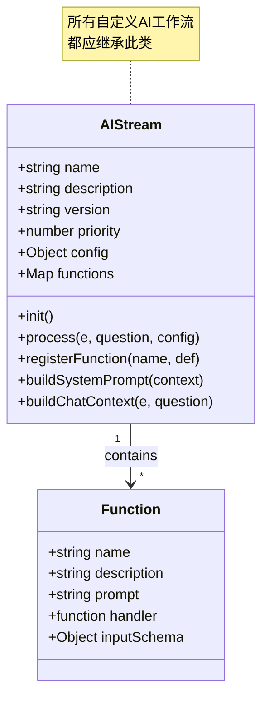
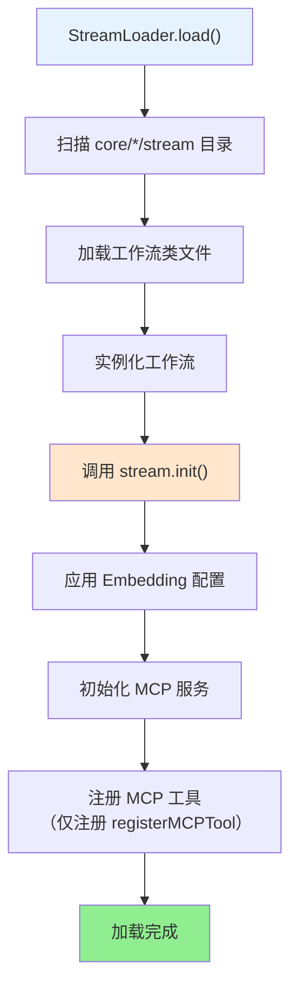
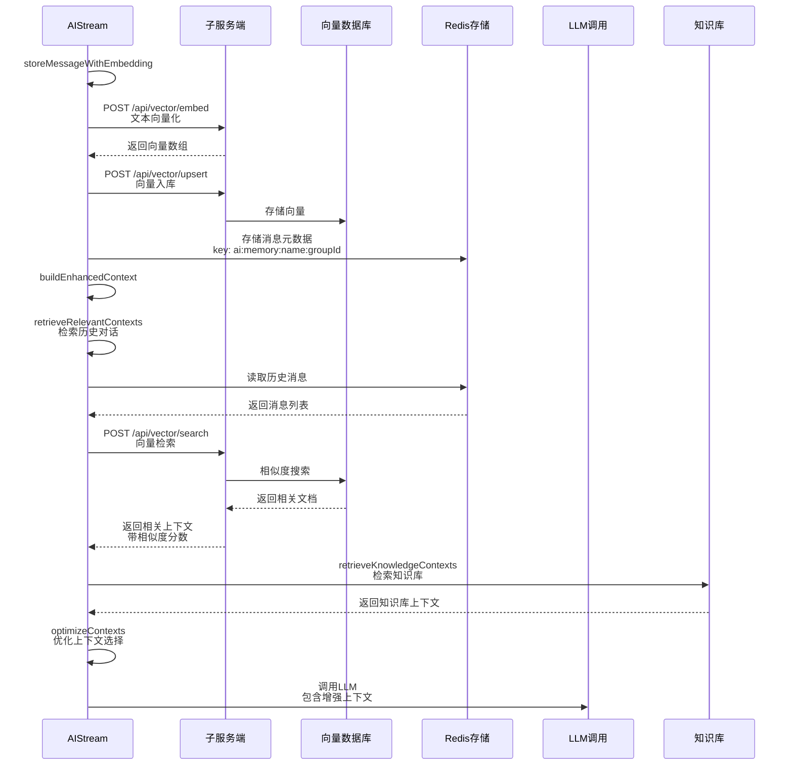
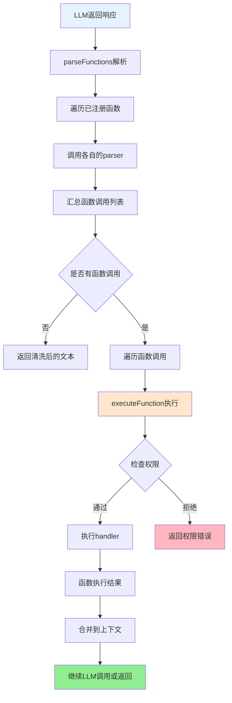
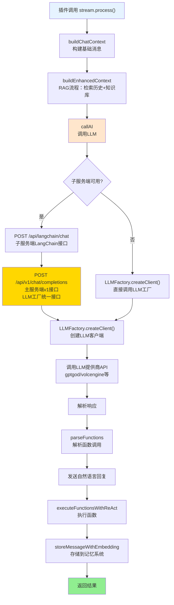

## AIStream 文档（src/infrastructure/aistream/aistream.js）

> **注意**：本文档是AIStream基类的技术文档。  
> **完整文档**：请参考 **[工作流系统完整文档](工作流系统完整文档.md)** - 包含系统概述、架构设计、执行流程等完整内容。  
> **可扩展性**：AIStream是工作流系统的核心扩展点。通过继承AIStream，开发者可以快速创建自定义工作流。详见 **[框架可扩展性指南](框架可扩展性指南.md)** ⭐

`AIStream` 是 XRK-AGT 中的 **AI 工作流基类**，用于封装：

### 扩展特性

- ✅ **零配置扩展**：放置到任意 `core/*/stream/` 目录即可自动加载
- ✅ **函数注册系统**：支持动态prompt和复杂解析
- ✅ **向量服务集成**：统一通过子服务端向量服务进行文本向量化和检索
- ✅ **工作流合并**：支持功能合并和组合
- ✅ **上下文增强**：自动上下文检索和增强（RAG流程）
- ✅ **热重载支持**：修改代码后自动重载

- 调用 LLM API（优先使用子服务端LangChain接口，失败时回退到LLM工厂）
- 向量服务支持（通过子服务端 `/api/vector/*` 接口）
- 相似度检索与历史上下文增强
- 函数调用（Function Calling）与权限控制

所有自定义 AI 工作流都应继承此类，可选择实现 `buildSystemPrompt` 与 `buildChatContext`。

---

## 基础属性与配置

**AIStream结构图**:



**基础信息**：
- `name` - 工作流名称（默认 `base-stream`）
- `description` - 描述（默认 `基础工作流`）
- `version` - 版本号
- `author` - 作者标识
- `priority` - 工作流优先级

**AI调用配置 `this.config`**：
- `enabled` - 是否启用（默认 `true`）
- `temperature`、`maxTokens`、`topP`、`presencePenalty`、`frequencyPenalty` 等
- 运行时可在插件中额外传入 `apiConfig` 覆盖部分字段

### 运行时配置来源（`data/server_bots/aistream.yaml` - 全局配置）

`cfg.aistream` 会在 `AIStream` 和设备管理模块中统一读取，实际配置结构：

```yaml
# 是否启用工作流系统
enabled: true

# 工作流目录路径（已废弃，框架自动扫描所有 core/*/stream 目录）
# streamDir: "core/stream"

# 工作流全局设置
global:
  maxTimeout: 360000      # 最大执行超时时间（毫秒）
  debug: false            # 是否启用调试日志
  maxConcurrent: 5        # 并发执行限制

# 工作流缓存设置
cache:
  enabled: true           # 是否启用缓存
  ttl: 300                # 缓存过期时间（秒）
  maxSize: 100            # 最大缓存条数

# LLM 工厂运营商选择（gptgod / volcengine / xiaomimimo）
# 文本 LLM 配置分别位于 data/server_bots/{port}/gptgod_llm.yaml、volcengine_llm.yaml、xiaomimimo_llm.yaml（工厂配置，不随端口变化）
llm:
  Provider: gptgod        # LLM 提供商
  timeout: 360000         # LLM请求超时时间（毫秒），默认360000（6分钟）
  retry:                  # LLM请求重试配置
    enabled: true         # 是否启用重试
    maxAttempts: 3        # 最大重试次数
    delay: 2000           # 重试延迟（毫秒）
    retryOn: ["timeout", "network", "5xx"]  # 重试条件

# 识图工厂运营商选择（gptgod / volcengine）
# 一个工厂一个配置文件：gptgod_vision.yaml、volcengine_vision.yaml
vision:
  Provider: gptgod

# ASR 工厂运营商选择
# 详细配置位于 data/server_bots/volcengine_asr.yaml（工厂配置，全局，不随端口变化）
asr:
  Provider: volcengine
  workflow: device        # ASR识别结果调用的工作流名称

# TTS 工厂运营商选择
# 详细配置位于 data/server_bots/volcengine_tts.yaml（工厂配置，全局，不随端口变化）
tts:
  Provider: volcengine
  onlyForASR: true        # 是否只有ASR触发才有TTS

# Embedding 配置（统一使用子服务端向量服务）
embedding:
  enabled: true           # 是否启用向量检索
  maxContexts: 5          # 最大上下文条数
  similarityThreshold: 0.6  # 相似度阈值
  cacheExpiry: 86400      # 缓存时长（秒）

# 设备运行参数
device:
  heartbeatInterval: 30
  heartbeatTimeout: 180
  commandTimeout: 10000
  maxDevices: 100
  maxLogsPerDevice: 100
  messageQueueSize: 100
  wsPingIntervalMs: 30000
  wsPongTimeoutMs: 10000
  wsReconnectDelayMs: 2000
  wsMaxReconnectAttempts: 5
  enableDetailedLogs: true
  enablePerformanceLogs: true
  audioSaveDir: "./data/wav"

# 表情映射
emotions:
  keywords:
    开心: happy
    伤心: sad
    生气: angry
    惊讶: surprise
    爱: love
    酷: cool
    睡觉: sleep
    思考: think
    眨眼: wink
    大笑: laugh
  supported:
    - happy
    - sad
    - angry
    - surprise
    - love
    - cool
    - sleep
    - think
    - wink
    - laugh
```

> **注意**：
> - LLM、Vision、ASR、TTS 的详细配置位于各自的配置文件中，不在 `aistream.yaml` 中
> - Embedding 配置会自动从 `cfg.aistream.embedding` 读取，工作流只需设置 `embedding: { enabled: true }`

### LLM 提供商配置

LLM 配置通过 `llm.Provider` 指定，支持动态扩展的提供商系统：

**配置解析机制**：
- 优先从运行时配置获取：`llm.config[providerName]`
- 从全局配置获取：`cfg[providerName]_llm` 或 `cfg[providerName]`
- 支持命名约定：`{providerName}_llm` 或 `{providerName}_vision`

**添加新提供商**：
1. 在 `LLMFactory` 中注册提供商工厂函数
2. 创建配置文件：`data/server_bots/{providerName}_llm.yaml`
3. 在 `aistream.yaml` 中设置 `llm.Provider: {providerName}`

**现有提供商示例**：
- **gptgod**：GPTGod 提供商（默认）
  - 配置文件：`data/server_bots/gptgod_llm.yaml`
  - 支持标准 OpenAI Chat Completions 协议
  
- **volcengine**：火山引擎豆包大模型
  - 配置文件：`data/server_bots/volcengine_llm.yaml`
  - 接口地址：`https://ark.cn-beijing.volces.com/api/v3`

- **xiaomimimo**：小咪咪莫提供商
  - 配置文件：`data/server_bots/xiaomimimo_llm.yaml`

> **注意**：
> - LLM 的详细配置（如 `baseUrl`、`apiKey`、`model` 等）位于各自的配置文件中
> - 基类不再硬编码提供商映射，支持动态扩展
> - 不支持的提供商会抛出错误，不再静默回退

### Embedding 配置 `this.embeddingConfig`

Embedding 配置会自动从 `cfg.aistream.embedding` 读取，**统一使用子服务端向量服务**：

- `enabled`：是否启用向量检索（从 `cfg.aistream.embedding.enabled` 读取，默认 `true`）
- `maxContexts`：最多拼接多少条历史上下文（从 `cfg.aistream.embedding.maxContexts` 读取，默认 `5`）
- `similarityThreshold`：相似度阈值（从 `cfg.aistream.embedding.similarityThreshold` 读取，默认 `0.6`）
- `cacheExpiry`：Redis 缓存过期时间（从 `cfg.aistream.embedding.cacheExpiry` 读取，默认 `86400` 秒）

**向量服务接口**（子服务端）：
- `POST /api/vector/embed` - 文本向量化
- `POST /api/vector/search` - 向量检索
- `POST /api/vector/upsert` - 向量入库

> **注意**：工作流构造函数中只需设置 `embedding: { enabled: true }`，其他配置会自动从 `cfg.aistream.embedding` 读取。向量服务由子服务端统一提供，无需额外配置。

---

## 生命周期与初始化

**工作流加载流程**（StreamLoader）：



**步骤说明**：

- `StreamLoader.load()` - 工作流加载器统一加载
  - 扫描所有 `core/*/stream/` 目录下的 `.js` 文件
  - 动态导入并实例化工作流类
  - 调用每个工作流的 `init()` 方法
  - 统一应用 Embedding 配置（从 `cfg.aistream.embedding` 读取）
  - 初始化 MCP 服务并注册所有 MCP 工具（`registerMCPTool` 注册的工具）
  - **注意**：`registerFunction` 注册的 Call Function 不会注册为 MCP 工具，只出现在 AI prompt 中

- `init()` - 工作流基本初始化（仅执行一次）
  - 初始化函数映射 `this.functions = new Map()`
  - 初始化与 Embedding 相关的内部字段
  - 子类可重写此方法进行自定义初始化

> 通常由工作流加载器在系统启动时统一初始化，插件只需通过 `StreamLoader.getStream(name)` 获取工作流实例即可

---

## Embedding 与上下文增强

**向量服务调用流程**:



**核心方法**：

- `generateEmbedding(text)` - 调用子服务端向量化接口
  - 调用 `POST /api/vector/embed` 生成文本向量
  - 返回向量数组或 `null`（失败时）
- `storeMessageWithEmbedding(groupId, message)` - 存储消息到向量数据库和Redis
  - 调用 `POST /api/vector/upsert` 存储向量到向量数据库
  - 存储消息元数据到Redis（key: `ai:memory:${name}:${groupId}`）
- `retrieveRelevantContexts(groupId, query, includeNotes, workflowId)` - 检索相关上下文
  - 优先使用 `MemoryManager` 检索长期记忆
  - 调用 `POST /api/vector/search` 进行向量相似度检索
  - 返回相关上下文列表（带相似度分数）
- `buildEnhancedContext(e, question, baseMessages)` - 构建增强上下文（完整RAG流程）
  - 自动检索历史对话上下文（如果启用Embedding）
  - 自动检索知识库上下文（如果合并了database stream）
  - 合并所有上下文，使用 `optimizeContexts` 优化选择
  - 构建上下文提示词，附加到 `baseMessages` 开头

---

## 函数调用（Function Calling）

**函数调用完整流程**:



**核心方法**：

- `registerFunction(name, options)` - 注册 Call Function（供 AI 内部调用）
  - `handler` - 实际执行函数（不返回 JSON）
  - `prompt` - 系统提示说明（会出现在 AI prompt 中）
  - `parser` - 解析AI输出中的函数调用
  - `enabled` - 是否启用
  - `permission` - 权限标识
  - **特点**：出现在 AI prompt 中，供 AI 直接调用，不返回结构化数据

- `registerMCPTool(name, options)` - 注册 MCP 工具（供外部系统调用）
  - `description` - 工具描述
  - `inputSchema` - JSON Schema 格式的输入参数定义
  - `handler` - 工具处理函数（返回 JSON 格式结果）
  - `enabled` - 是否启用
  - **特点**：返回结构化 JSON 数据，不会出现在 AI prompt 中，通过 MCP 协议调用

- `parseFunctions(text, context)` - 解析函数调用，返回函数列表和清洗后的文本（仅解析 Call Function）
- `executeFunction(type, params, context)` - 执行函数，检查权限后调用handler（仅执行 Call Function）

**功能分类**：
- **MCP 工具**：读取信息类功能（read, grep, query_memory, system_info 等），返回 JSON，不出现在 prompt 中
- **Call Function**：执行操作类功能（write, run, save_memory, show_desktop 等），出现在 prompt 中，供 AI 调用

---

## 抽象方法（必须由子类实现）

- `buildSystemPrompt(context)`  
  - 构建系统级提示词，如：
    - 角色设定。
    - 回复风格约束。
    - 场景限制等。
  - **注意**：此方法为可选实现，子类可根据需要实现。未实现时返回空字符串。

- `buildChatContext(e, question)`  
  - 将事件与用户问题转换为 Chat Completion 的 `messages` 数组：
    - `[{ role: 'system', content: ... }, { role: 'user', content: ... }, ...]`。
  - 可以根据群聊 / 私聊 / 设备事件等差异，做不同上下文拼装。
  - **注意**：此方法为可选实现，子类可根据需要实现。未实现时返回空数组。

> 若子类未实现上述方法，基类会提供默认实现，不会抛出错误。

---

## LLM 调用流程

详细的 LLM 调用流程、消息格式规范和工厂处理逻辑，请参考：[LLM 工作流文档](./llm-workflow.md)

### 完整调用流程

**工作流执行流程**:



### 核心方法

- `callAI(messages, apiConfig = {})`
  - 以非流式方式调用AI接口
  - **优先调用子服务端LangChain接口** (`POST /api/langchain/chat`)
  - 子服务端内部调用主服务端的 `/api/v1/chat/completions`（LLM工厂提供的统一接口）
  - 如果子服务端不可用，直接调用LLM工厂（`LLMFactory.createClient()`）
  - 组合 `this.config` 与 `apiConfig`，支持覆盖 `model/baseUrl/apiKey` 等
  - 支持重试机制（超时、网络错误、5xx错误等）
  - **注意：** 工厂负责读取运营商配置，工作流只需传入 messages

- `callAIStream(messages, apiConfig = {}, onDelta, options = {})`
  - 使用 `stream: true` 方式调用AI接口
  - **优先调用子服务端LangChain接口** (`POST /api/langchain/chat`)
  - 子服务端内部调用主服务端的 `/api/v1/chat/completions`（LLM工厂提供的统一接口）
  - 如果子服务端不可用，直接调用LLM工厂（`LLMFactory.createClient()`）
  - 逐行解析 `data: ...` SSE 流，将增量文本通过 `onDelta(delta)` 回调返回
  - 支持函数调用（`enableFunctionCalling: true`）

- `execute(e, question, config)`
  - 接收插件传入的事件对象、用户问题和LLM配置
  - 构建基础上下文：`buildChatContext(e, question)` - 将事件和问题转换为消息数组
  - 增强上下文：`buildEnhancedContext(e, question, baseMessages)` - 自动检索历史对话和知识库（RAG流程）
  - 调用 `callAI(messages, config)` 获取回复文本（优先使用子服务端LangChain）
  - 调用 `parseFunctions(response, context)` 解析函数调用
  - 先发送自然语言回复（如果有 `cleanText`）
  - 执行函数：`executeFunctionsWithReAct(functions, context, question)` - 使用ReAct模式
  - 如启用 Embedding，则将 Bot 回复写入向量数据库和Redis以备后续检索
  - 返回清洗后的文本 `cleanText`

**参数**：
- `e`: 事件对象（可选）
- `question`: 用户问题（字符串或对象 `{content: string, text: string}`）
- `config`: LLM配置对象（可选，会与 `this.config` 合并）

**返回值**：`Promise<string|null>` - 清洗后的AI回复文本

- `process(e, question, options = {})`
  - 工作流处理的简化入口，支持工作流合并、TODO决策、记忆系统等高级功能
  - 内部调用 `execute`，但提供了更丰富的参数选项

**参数**：
- `e`: 事件对象
- `question`: 用户问题（字符串或对象）
- `options`: 处理选项对象
  - `mergeStreams`: `Array<string>` - 要合并的工作流名称列表
  - `enableTodo`: `boolean` - 是否启用TODO智能决策（默认 `false`）
  - `enableMemory`: `boolean` - 是否启用记忆系统（默认 `false`）
  - `enableDatabase`: `boolean` - 是否启用知识库系统（默认 `false`）
  - `apiConfig`: `Object` - LLM配置（可选，会与 `this.config` 合并）

**返回值**：`Promise<string|null>` - AI回复文本

---

### 配置探查 API

- `GET /api/ai/models`
  - 返回可用的 LLM 提供商列表和配置信息。
  - 前端（如 `www/xrk`）可动态渲染模型选择器。

---

## 与插件系统的协作方式

**重要：** 详细的协作方式和消息格式规范，请参考 [LLM 工作流文档](./llm-workflow.md)。

### 插件调用工作流的标准方式

插件应按照以下方式使用工作流：

```javascript
// 1. 获取工作流实例
const stream = this.getStream('chat');

// 2. 调用 process 方法（推荐）
await stream.process(e, question, {
  enableMemory: true,      // 启用记忆系统
  enableDatabase: true,   // 启用知识库
  enableTodo: false       // 是否启用TODO工作流
});

// 3. 工作流内部自动处理：
//    - buildChatContext: 构建基础消息数组
//    - buildEnhancedContext: 检索历史对话和知识库（RAG流程）
//    - callAI: 调用LLM工厂
//    - parseFunctions: 解析函数调用
//    - executeFunctionsWithReAct: 执行函数（ReAct模式）
//    - storeMessageWithEmbedding: 存储到记忆系统
//    - 自动发送回复（插件不需要再次调用reply）
```

### 职责划分

1. **插件职责**：
   - 监听事件、提取消息内容
   - 调用 `stream.process(e, question, options)`
   - 处理错误和异常情况

2. **工作流职责**：
   - 构建消息上下文（`buildChatContext`）
   - 增强上下文（`buildEnhancedContext` - RAG流程）
   - 调用LLM（优先子服务端LangChain，不可用时直接调用LLM工厂）
   - 解析和执行函数调用（`parseFunctions` + `executeFunctionsWithReAct`）
   - 存储到记忆系统（`storeMessageWithEmbedding` - 调用子服务端向量服务）
   - 自动发送回复

3. **子服务端职责**：
   - 提供LangChain服务（`/api/langchain/chat`）- 内部调用主服务端 `/api/v1/chat/completions`
   - 提供向量服务（`/api/vector/*`）
   - 支持MCP工具调用

4. **主服务端v1接口职责**：
   - 提供统一的LLM调用接口（`/api/v1/chat/completions`）
   - 内部调用LLM工厂（`LLMFactory.createClient()`）
   - 支持OpenAI兼容格式

5. **工厂职责**：
   - 处理图片识别（VisionFactory）
   - 调用LLM API（LLMFactory）
   - 读取运营商配置

> **注意**：插件不需要构建 `messages` 数组，工作流会通过 `buildChatContext` 和 `buildEnhancedContext` 自动构建。插件只需要传入事件对象 `e` 和用户问题 `question`。

---

## 清理与关闭：`cleanup()`

- 记录日志 `[name] 清理资源`。
- 重置 Embedding 状态与初始化标记。
- 清理函数映射和合并的工作流引用。

> 框架层可在应用关闭或热重载时调用该方法，以避免内存泄漏。


