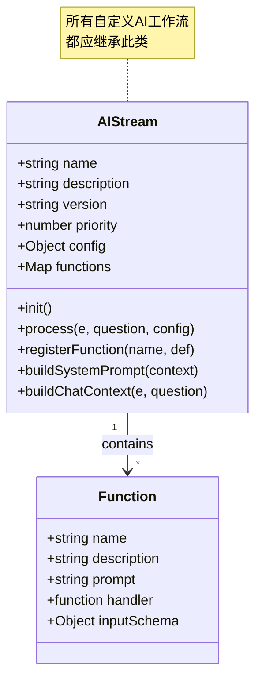
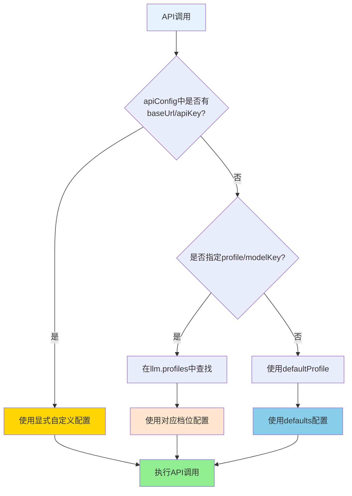
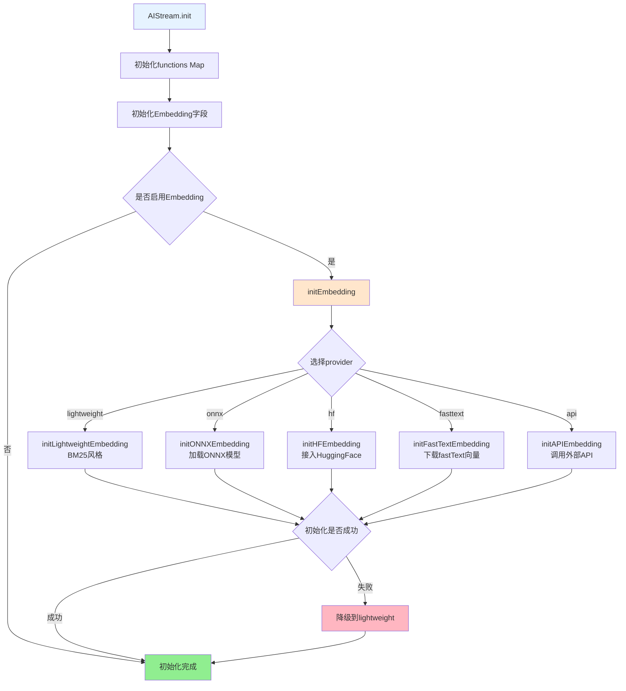
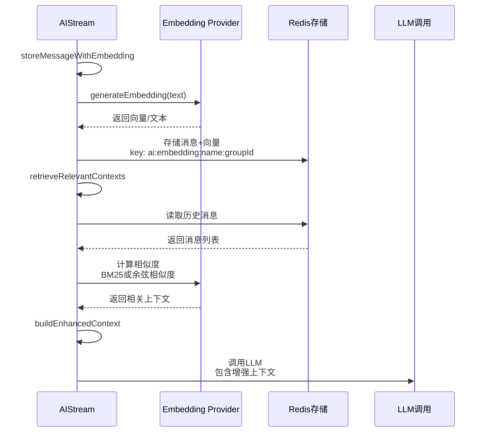
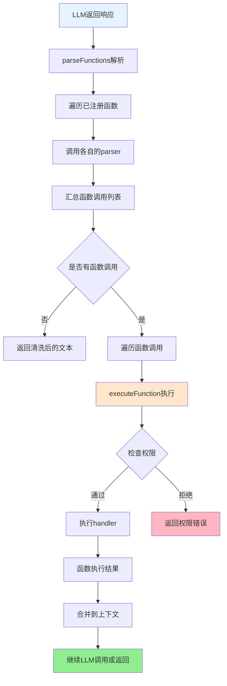

## AIStream 文档（src/infrastructure/aistream/aistream.js）

> **注意**：本文档是AIStream基类的技术文档。  
> **完整文档**：请参考 **[工作流系统完整文档](工作流系统完整文档.md)** - 包含系统概述、架构设计、执行流程等完整内容。  
> **可扩展性**：AIStream是工作流系统的核心扩展点。通过继承AIStream，开发者可以快速创建自定义工作流。详见 **[框架可扩展性指南](框架可扩展性指南.md)** ⭐

`AIStream` 是 XRK-AGT 中的 **AI 工作流基类**，用于封装：

### 扩展特性

- ✅ **零配置扩展**：放置到 `core/stream/` 目录即可自动加载
- ✅ **函数注册系统**：支持动态prompt和复杂解析
- ✅ **Embedding提供商**：支持多种Embedding提供商（lightweight/onnx/hf/fasttext/api）
- ✅ **工作流合并**：支持功能合并和组合
- ✅ **上下文增强**：自动上下文检索和增强
- ✅ **热重载支持**：修改代码后自动重载

- 调用外部 Chat Completion API（如 OpenAI 兼容接口）。
- 多种 Embedding 提供商（ONNX/HuggingFace/FastText/API/轻量级 BM25）。
- 相似度检索与历史上下文增强。
- 函数调用（Function Calling）与权限控制。

所有自定义 AI 工作流都应继承此类，并实现 `buildSystemPrompt` 与 `buildChatContext`。

---

## 基础属性与配置

**AIStream结构图**:



**基础信息**：
- `name` - 工作流名称（默认 `base-stream`）
- `description` - 描述（默认 `基础工作流`）
- `version` - 版本号
- `author` - 作者标识
- `priority` - 工作流优先级

**AI调用配置 `this.config`**：
- `enabled` - 是否启用（默认 `true`）
- `temperature`、`maxTokens`、`topP`、`presencePenalty`、`frequencyPenalty` 等
- 运行时可在插件中额外传入 `apiConfig` 覆盖部分字段

### 运行时配置来源（`config/default_config/aistream.yaml`）

`cfg.aistream` 会在 `AIStream` 和设备管理模块中统一读取，结构示例：

```yaml
enabled: true
streamDir: "core/stream"

llm:
  enabled: true
  defaultProfile: balanced  # 默认使用 balanced 档位
  persona: "你是一名友好、简洁的智能语音助手。"
  displayDelay: 1500
  defaults:
    provider: generic  # 默认提供商：generic（GPT-LLM 标准调用方式）
    baseUrl: https://api.example.com/v1
    apiKey: ""
    model: general-task  # 默认聊天模型
    visionModel: glm-4v  # 默认识图模型
    temperature: 0.8
    maxTokens: 2000
    timeout: 30000
  profiles:
    balanced:
      label: 通用对话
      provider: generic
      model: smart-balanced
      visionModel: glm-4v
      maxTokens: 4096
    fast:
      label: 极速润色
      provider: generic
      model: smart-fast
      visionModel: glm-4v
      maxTokens: 1024
    long:
      label: 长文本
      provider: generic
      model: smart-long
      visionModel: glm-4v
      maxTokens: 8000
    device:
      label: 设备友好
      provider: generic
      model: smart-device
      visionModel: glm-4v
      maxTokens: 1024
    creative:
      label: 灵感工坊
      provider: generic
      model: smart-creative
      visionModel: glm-4v
      maxTokens: 4096
    volcengine:
      label: 火山引擎
      provider: volcengine  # 使用火山引擎提供商
      baseUrl: https://ark.cn-beijing.volces.com/api/v3
      apiKey: ""
      model: doubao-pro-4k
      visionModel: doubao-pro-vision
      maxTokens: 4096

embedding:
  enabled: true
  defaultProfile: lightweight
  defaults:
    provider: lightweight
    maxContexts: 5
    similarityThreshold: 0.6
    cacheExpiry: 86400
    cachePath: ./data/models
  profiles:
    lightweight:
      provider: lightweight
    onnx:
      provider: onnx
      onnxModel: Xenova/all-MiniLM-L6-v2
    hf:
      provider: hf
      hfModel: sentence-transformers/all-MiniLM-L6-v2
    fasttext:
      provider: fasttext
      fasttextModel: cc.zh.300.bin
    api:
      provider: api
      apiUrl: ""
      apiKey: ""
      apiModel: text-embedding-3-small

tts:
  defaultProvider: volcengine
  providers:
    volcengine:
      wsUrl: wss://openspeech.bytedance.com/api/v3/tts/bidirection
      appKey: YOUR_APP_KEY

asr:
  defaultProvider: volcengine
  providers:
    volcengine:
      wsUrl: wss://openspeech.bytedance.com/api/v3/sauc/bigmodel_async

device:
  heartbeatInterval: 30
  heartbeatTimeout: 180
  messageQueueSize: 100

emotions:
  keywords:
    开心: happy
  supported:
    - happy
    - sad

drawing:
  defaultModel: sketch
  models:
    sketch:
      provider: generic
      baseUrl: https://api.example.com/draw
```

> `drawing` 段目前仅提供占位符，方便后续扩展图像/渲染模型。

### 调用优先级（LLM & Embedding）

**配置优先级流程图**:



**优先级说明**：

1. **显式传自定义配置** - `apiConfig` 中包含 `baseUrl/apiKey` 时，直接以调用方参数为准
2. **仅指定模型/档位 key** - 在 `llm.profiles` 中查找对应参数
3. **完全未指定** - 按 `defaultProfile → defaults` 的顺序解析

### 提供商支持

- **generic**：默认提供商，使用 GPT-LLM 标准调用方式（兼容 OpenAI Chat Completions 协议）
  - 适用于所有遵循 OpenAI 协议的 API（如 GPTGod、OpenAI、Azure OpenAI 等）
  - 无需额外配置，默认使用此提供商
  
- **volcengine**：火山引擎豆包大模型
  - 接口地址：`https://ark.cn-beijing.volces.com/api/v3`
  - 支持的模型：`doubao-pro-4k`、`doubao-pro-32k`、`doubao-lite-4k` 等
  - 详细文档：https://www.volcengine.com/docs/82379

- **Embedding 配置 `this.embeddingConfig`**
  - `enabled`：是否启用向量检索。
  - `provider`：`lightweight/onnx/hf/fasttext/api`。
  - `maxContexts`：最多拼接多少条历史上下文。
  - `similarityThreshold`：相似度阈值。
  - `cacheExpiry`：Redis 缓存过期时间。
  - 模型配置：
    - ONNX：`onnxModel/onnxQuantized`。
    - HuggingFace：`hfToken/hfModel`。
    - FastText：`fasttextModel`。
    - API：`apiUrl/apiKey/apiModel`。

---

## 生命周期与初始化

**初始化流程**:



**步骤说明**：

- `init()` - 基本初始化（仅执行一次）
  - 初始化函数映射 `this.functions = new Map()`
  - 初始化与 Embedding 相关的内部字段
- `initEmbedding()` - Embedding 初始化
  - 根据 `embeddingConfig.provider` 调用对应的初始化方法
  - 若指定 provider 初始化失败，会尝试降级到 `lightweight`

> 通常由工作流加载器在系统启动时统一初始化，插件只需假定可用即可

---

## Embedding 与上下文增强

**Embedding处理流程**:



**核心方法**：

- `generateEmbedding(text)` - 根据provider生成向量或返回文本
- `storeMessageWithEmbedding(groupId, message)` - 存储消息到Redis（key: `ai:embedding:${name}:${groupId}`）
- `retrieveRelevantContexts(groupId, query)` - 检索相关上下文（BM25或余弦相似度）
- `buildEnhancedContext(e, question, baseMessages)` - 构建增强上下文，附加到messages开头

---

## 函数调用（Function Calling）

**函数调用完整流程**:



**核心方法**：

- `registerFunction(name, options)` - 注册函数
  - `handler` - 实际执行函数
  - `prompt` - 系统提示说明
  - `parser` - 解析AI输出中的函数调用
  - `enabled` - 是否启用
  - `permission` - 权限标识
- `parseFunctions(text, context)` - 解析函数调用，返回函数列表和清洗后的文本
- `executeFunction(type, params, context)` - 执行函数，检查权限后调用handler

---

## 抽象方法（必须由子类实现）

- `buildSystemPrompt(context)`  
  - 构建系统级提示词，如：
    - 角色设定。
    - 回复风格约束。
    - 场景限制等。

- `buildChatContext(e, question)`  
  - 将事件与用户问题转换为 Chat Completion 的 `messages` 数组：
    - `[{ role: 'system', content: ... }, { role: 'user', content: ... }, ...]`。
  - 可以根据群聊 / 私聊 / 设备事件等差异，做不同上下文拼装。

> 若子类未实现上述方法，会抛出错误，提示必须实现。

---

## LLM 调用流程

详细的 LLM 调用流程、消息格式规范和工厂处理逻辑，请参考：[LLM 工作流文档](./llm-workflow.md)

### 基础方法

- `callAI(messages, apiConfig = {})`
  - 以非流式方式调用兼容 OpenAI 的 `/chat/completions` 接口。
  - 组合 `this.config` 与 `apiConfig`，支持覆盖 `model/baseUrl/apiKey` 等。
  - 底层由 `LLMFactory` 创建具体客户端（如 `gptgod`、`volcengine`）。
  - **注意：** 工厂负责读取运营商配置，工作流只需传入 messages。

- `callAIStream(messages, apiConfig = {}, onDelta)`
  - 使用 `stream: true` 方式调用 Chat Completion。
  - 逐行解析 `data: ...` SSE 流，将增量文本通过 `onDelta(delta)` 回调返回。

- `execute(e, messages, config)`
  - 接收插件传入的 `messages` 数组。
  - 合并消息历史（如有）。
  - 通过 `buildEnhancedContext` 加入 embedding 检索上下文。
  - 调用 `callAI` 获取回复文本。
  - 调用 `parseFunctions` 解析函数调用，并依次执行。
  - 如启用 Embedding，则将 Bot 回复写入 Redis 以备后续检索。
  - 返回清洗后的文本 `cleanText`。

- `process(e, messages, apiConfig = {})`
  - 一个轻量包装，内部调用 `execute`，适合插件直接调用。

---

### 配置探查 API

- `GET /api/ai/models`
  - 返回 `profiles`（模型档位列表）、`defaultProfile`。
  - 前端（如 `www/xrk`）可动态渲染模型选择器，不必硬编码配置。

---

## 与插件系统的协作方式

**重要：** 详细的协作方式和消息格式规范，请参考 [LLM 工作流文档](./llm-workflow.md)。

插件应按照以下方式使用工作流：

1. 插件负责构建标准化的 `messages` 数组（包含人设和当前消息）。
2. 调用 `stream.execute(e, messages)` 传入 messages。
3. 工作流负责合并历史、增强上下文、调用工厂。
4. 工厂负责处理图片、上传、调用 LLM API。

---

## 清理与关闭：`cleanup()`

- 记录日志 `[name] 清理资源`。
- 若存在可释放的资源（如 ONNX Session、FastText 模型等），尝试释放。
- 重置 Embedding 状态与初始化标记。

> 框架层可在应用关闭或热重载时调用该方法，以避免内存泄漏。


