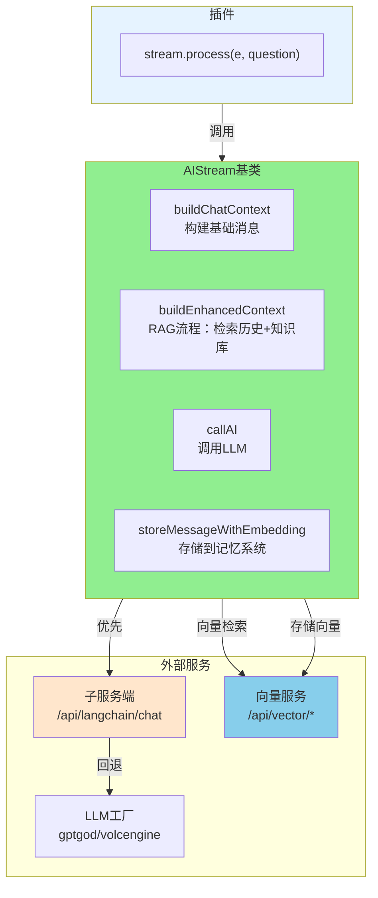
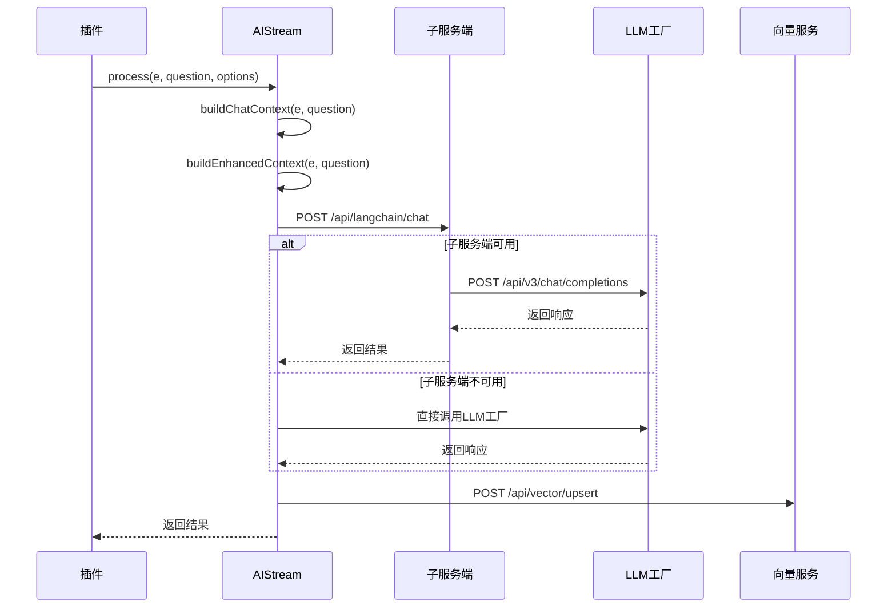

# AIStream 文档

> **文件位置**: `src/infrastructure/aistream/aistream.js`  
> Node 侧“多步工作流/WorkflowManager/TODO”已移除；复杂多步编排请使用 Python 子服务端（LangChain/LangGraph）。本文档描述的是 Node 侧 `AIStream` 基类与 LLM/MCP 集成方式。
> **可扩展性**：AIStream是工作流系统的核心扩展点。通过继承AIStream，开发者可以快速创建自定义工作流。详见 **[框架可扩展性指南](框架可扩展性指南.md)** ⭐

`AIStream` 是 XRK-AGT 中的 **AI 工作流基类**，用于封装 LLM 调用、向量服务、上下文增强等能力（工具调用由 LLM 工厂的 tool calling + MCP 统一处理）。

### 扩展特性

- ✅ **零配置扩展**：放置到任意 `core/*/stream/` 目录即可自动加载
- ✅ **函数注册系统**：支持 Call Function 和 MCP 工具注册
- ✅ **向量服务集成**：统一通过子服务端向量服务进行文本向量化和检索
- ✅ **工作流合并**：支持功能合并和组合
- ✅ **上下文增强**：自动上下文检索和增强（RAG流程）
- ✅ **热重载支持**：修改代码后自动重载

所有自定义 AI 工作流都应继承此类，可选择实现 `buildSystemPrompt` 与 `buildChatContext`。

---

## 架构概览



---

## 构造参数

```javascript
constructor(options = {})
```

**参数说明**：

| 参数 | 类型 | 说明 | 默认值 |
|------|------|------|--------|
| `name` | `string` | 工作流名称 | `'base-stream'` |
| `description` | `string` | 描述 | `'基础工作流'` |
| `version` | `string` | 版本号 | `'1.0.0'` |
| `author` | `string` | 作者标识 | `'unknown'` |
| `priority` | `number` | 工作流优先级 | `100` |
| `config` | `Object` | AI调用配置 | `{ enabled: true, temperature: 0.8, ... }` |
| `embedding` | `Object` | Embedding配置 | `{ enabled: true, maxContexts: 5 }` |
| `functionToggles` | `Object` | 函数开关配置 | `{}` |

**AI调用配置** (`config`)：
- `enabled` - 是否启用（默认 `true`）
- `temperature`、`maxTokens`、`topP`、`presencePenalty`、`frequencyPenalty` 等
- 运行时可在插件中额外传入 `apiConfig` 覆盖部分字段

### 全局配置

工作流系统全局配置位于 `data/server_bots/aistream.yaml`：

**关键配置项**：
- `llm.Provider` - LLM提供商（`gptgod`/`volcengine`/`xiaomimimo`）
- `embedding.enabled` - 是否启用向量检索
- `embedding.maxContexts` - 最大上下文条数
- `embedding.similarityThreshold` - 相似度阈值

**LLM提供商配置**：
- 配置文件：`data/server_bots/{providerName}_llm.yaml`
- 配置合并优先级：`apiConfig` > `this.config` > `providerConfig`
- 支持动态扩展，无需修改基类代码

**Embedding配置**：
- 统一使用子服务端向量服务（`/api/vector/*`）
- 工作流构造函数只需设置 `embedding: { enabled: true }`
- 其他配置自动从 `cfg.aistream.embedding` 读取

---

## 核心方法

### `async init()`

初始化工作流（仅执行一次），由 `StreamLoader` 在加载时自动调用。

**初始化内容**：
- 初始化函数映射 `this.functions = new Map()`
- 初始化 MCP 工具映射 `this.mcpTools = new Map()`
- 子类可重写此方法进行自定义初始化

### `registerFunction(name, options)`

注册 Call Function（供 AI 内部调用）。

**参数**：
- `name` - 函数名称
- `options.handler` - 处理函数
- `options.prompt` - 系统提示说明（会出现在 AI prompt 中）
- `options.parser` - 解析AI输出中的函数调用
- `options.enabled` - 是否启用
- `options.permission` - 权限标识

**特点**：出现在 AI prompt 中，供 AI 直接调用，不返回结构化数据

### `registerMCPTool(name, options)`

注册 MCP 工具（供外部系统调用）。

**参数**：
- `name` - 工具名称
- `options.handler` - 工具处理函数（返回 JSON 格式结果）
- `options.description` - 工具描述
- `options.inputSchema` - JSON Schema 格式的输入参数定义
- `options.enabled` - 是否启用

**特点**：返回结构化 JSON 数据，不会出现在 AI prompt 中，通过 MCP 协议调用

### `buildSystemPrompt(context)` / `buildChatContext(e, question)`

抽象方法（可选实现）：
- `buildSystemPrompt` - 构建系统级提示词（角色设定、回复风格等）
- `buildChatContext` - 将事件与用户问题转换为 `messages` 数组

> 若子类未实现，基类会提供默认实现（返回空字符串/空数组）

---

## Embedding 与上下文增强

**核心方法**：

| 方法 | 说明 |
|------|------|
| `generateEmbedding(text)` | 调用子服务端 `/api/vector/embed` 生成文本向量 |
| `storeMessageWithEmbedding(groupId, message)` | 存储消息到向量数据库和Redis（key: `ai:memory:${name}:${groupId}`） |
| `retrieveRelevantContexts(groupId, query)` | 检索相关上下文（优先使用MemoryManager，再调用向量检索） |
| `buildEnhancedContext(e, question, baseMessages)` | 构建增强上下文（完整RAG流程：历史对话 + 知识库） |

**向量服务接口**（子服务端）：
- `POST /api/vector/embed` - 文本向量化
- `POST /api/vector/search` - 向量检索
- `POST /api/vector/upsert` - 向量入库

---

## 函数调用

AIStream **不再解析/执行**任何 “文本函数调用 / ReAct”。

- **MCP 工具调用**：由 LLMFactory（各厂商 tool calling 协议）+ `MCPToolAdapter` 内部完成多轮 `tool_calls` → 返回最终 `assistant.content`。
- **Call Function（本地注册函数）**：仍可在 stream 内部按需调用（例如特殊业务逻辑），但不推荐让模型通过“文本协议”来触发。

**功能分类**：
- **MCP 工具**：读取信息类功能（read, grep, query_memory等），返回 JSON，不出现在 prompt 中
- **Call Function**：执行操作类功能（write, run, save_memory等），出现在 prompt 中，供 AI 调用

---

## LLM 调用



**核心方法**：

| 方法 | 说明 |
|------|------|
| `callAI(messages, apiConfig)` | 非流式调用AI接口（优先子服务端LangChain，失败时回退到LLM工厂） |
| `callAIStream(messages, apiConfig, onDelta, options)` | 流式调用AI接口，通过 `onDelta` 回调返回增量文本 |
| `execute(e, question, config)` | 执行：构建上下文 → 调用LLM（含 MCP tool calling）→ 存储记忆 |
| `process(e, question, options)` | 工作流处理入口（单次对话 + MCP 工具调用；复杂多步编排在 Python 子服务端） |

**process 方法参数**：
- `mergeStreams` - 要合并的工作流名称列表
- `enableMemory` - 是否启用记忆系统（默认 `false`）
- `enableDatabase` - 是否启用知识库系统（默认 `false`）
- `apiConfig` - LLM配置（可选，会与 `this.config` 合并）

**调用流程**：
1. `buildChatContext` - 构建基础消息数组
2. `buildEnhancedContext` - RAG流程：检索历史对话和知识库
3. `callAI` - 调用LLM（优先子服务端LangChain）
4. `storeMessageWithEmbedding` - 存储到记忆系统
5. 自动发送回复（插件不需要再次调用 `reply()`）

---

## 使用示例

```javascript
// 插件中调用工作流
const stream = this.getStream('chat');
await stream.process(e, e.msg, {
  enableMemory: true,      // 启用记忆系统
  enableDatabase: true,   // 启用知识库
});
// 注意：工作流内部已发送回复，不需要再次调用 reply()
```

---

## 相关文档

- **[框架可扩展性指南](框架可扩展性指南.md)** - 扩展开发完整指南
- **[子服务端 API](subserver-api.md)** - LangChain + 向量服务 + 与主服务 v3 的衔接
- **[MCP 完整指南](mcp-guide.md)** - MCP 工具注册与连接


