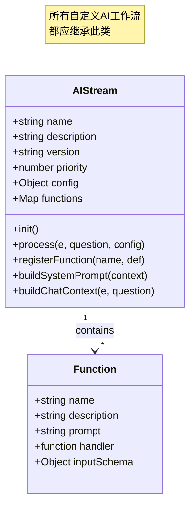
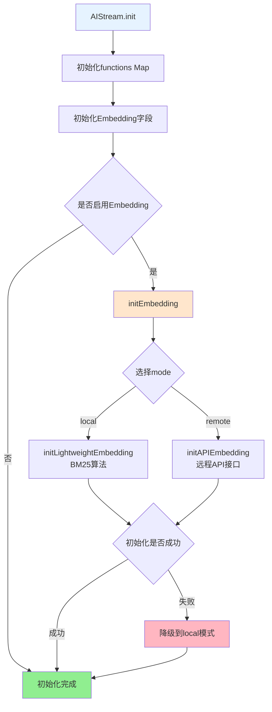
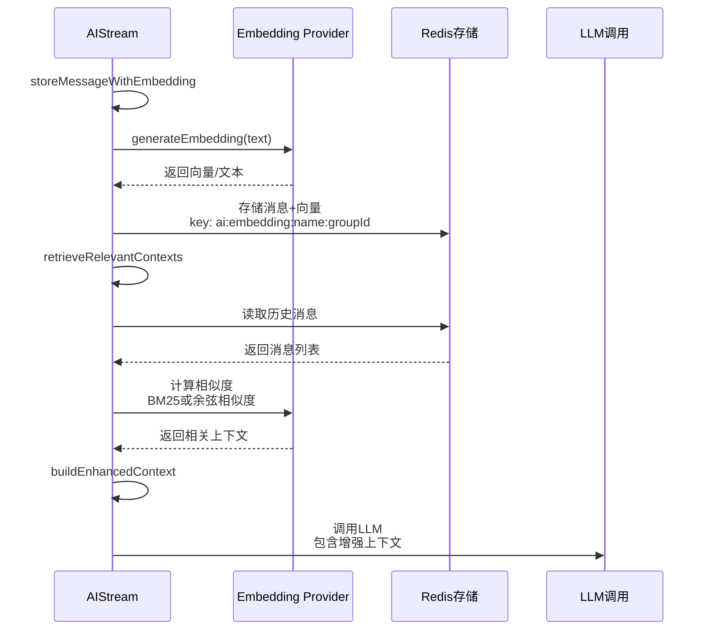
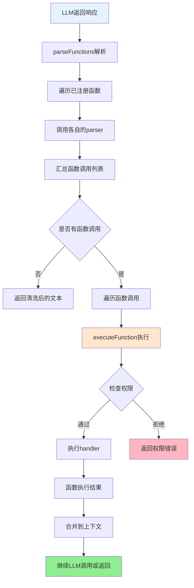

## AIStream 文档（src/infrastructure/aistream/aistream.js）

> **注意**：本文档是AIStream基类的技术文档。  
> **完整文档**：请参考 **[工作流系统完整文档](工作流系统完整文档.md)** - 包含系统概述、架构设计、执行流程等完整内容。  
> **可扩展性**：AIStream是工作流系统的核心扩展点。通过继承AIStream，开发者可以快速创建自定义工作流。详见 **[框架可扩展性指南](框架可扩展性指南.md)** ⭐

`AIStream` 是 XRK-AGT 中的 **AI 工作流基类**，用于封装：

### 扩展特性

- ✅ **零配置扩展**：放置到 `core/stream/` 目录即可自动加载
- ✅ **函数注册系统**：支持动态prompt和复杂解析
- ✅ **Embedding模式**：支持本地（BM25）和远程（API）两种模式
- ✅ **工作流合并**：支持功能合并和组合
- ✅ **上下文增强**：自动上下文检索和增强
- ✅ **热重载支持**：修改代码后自动重载

- 调用外部 Chat Completion API（如 OpenAI 兼容接口）。
- Embedding 支持（本地 BM25 算法 / 远程 API 接口）。
- 相似度检索与历史上下文增强。
- 函数调用（Function Calling）与权限控制。

所有自定义 AI 工作流都应继承此类，可选择实现 `buildSystemPrompt` 与 `buildChatContext`。

---

## 基础属性与配置

**AIStream结构图**:



**基础信息**：
- `name` - 工作流名称（默认 `base-stream`）
- `description` - 描述（默认 `基础工作流`）
- `version` - 版本号
- `author` - 作者标识
- `priority` - 工作流优先级

**AI调用配置 `this.config`**：
- `enabled` - 是否启用（默认 `true`）
- `temperature`、`maxTokens`、`topP`、`presencePenalty`、`frequencyPenalty` 等
- 运行时可在插件中额外传入 `apiConfig` 覆盖部分字段

### 运行时配置来源（`config/default_config/aistream.yaml`）

`cfg.aistream` 会在 `AIStream` 和设备管理模块中统一读取，实际配置结构：

```yaml
# 是否启用工作流系统
enabled: true

# 工作流目录路径（相对于项目根目录）
streamDir: "core/stream"

# 工作流全局设置
global:
  maxTimeout: 360000      # 最大执行超时时间（毫秒）
  debug: false            # 是否启用调试日志
  maxConcurrent: 5        # 并发执行限制

# 工作流缓存设置
cache:
  enabled: true           # 是否启用缓存
  ttl: 300                # 缓存过期时间（秒）
  maxSize: 100            # 最大缓存条数

# LLM 工厂运营商选择（gptgod / volcengine / xiaomimimo）
# 文本 LLM 配置分别位于 data/server_bots/{port}/god.yaml、volcengine_llm.yaml、xiaomimimo_llm.yaml
llm:
  Provider: gptgod        # LLM 提供商
  timeout: 360000         # LLM请求超时时间（毫秒），默认360000（6分钟）
  retry:                  # LLM请求重试配置
    enabled: true         # 是否启用重试
    maxAttempts: 3        # 最大重试次数
    delay: 2000           # 重试延迟（毫秒）
    retryOn: ["timeout", "network", "5xx"]  # 重试条件

# 识图工厂运营商选择（gptgod / volcengine）
# 一个工厂一个配置文件：god_vision.yaml、volcengine_vision.yaml
vision:
  Provider: gptgod

# ASR 工厂运营商选择
# 详细配置位于 data/server_bots/{port}/volcengine_asr.yaml
asr:
  Provider: volcengine
  workflow: device        # ASR识别结果调用的工作流名称

# TTS 工厂运营商选择
# 详细配置位于 data/server_bots/{port}/volcengine_tts.yaml
tts:
  Provider: volcengine
  onlyForASR: true        # 是否只有ASR触发才有TTS

# Embedding 配置（简化：仅支持本地和远程两种模式）
embedding:
  enabled: true
  mode: local             # local: 本地 BM25 算法 | remote: 远程 API 接口
  remote:                 # 远程模式配置（mode: remote 时使用）
    apiUrl: ""            # API 地址，如 https://api.openai.com/v1/embeddings
    apiKey: ""            # API 密钥
    apiModel: "text-embedding-3-small"  # 模型名称
  maxContexts: 5          # 最大上下文条数
  similarityThreshold: 0.6  # 相似度阈值
  cacheExpiry: 86400      # 缓存时长（秒）

# 设备运行参数
device:
  heartbeatInterval: 30
  heartbeatTimeout: 180
  commandTimeout: 10000
  maxDevices: 100
  maxLogsPerDevice: 100
  messageQueueSize: 100
  wsPingIntervalMs: 30000
  wsPongTimeoutMs: 10000
  wsReconnectDelayMs: 2000
  wsMaxReconnectAttempts: 5
  enableDetailedLogs: true
  enablePerformanceLogs: true
  audioSaveDir: "./data/wav"

# 表情映射
emotions:
  keywords:
    开心: happy
    伤心: sad
    生气: angry
    惊讶: surprise
    爱: love
    酷: cool
    睡觉: sleep
    思考: think
    眨眼: wink
    大笑: laugh
  supported:
    - happy
    - sad
    - angry
    - surprise
    - love
    - cool
    - sleep
    - think
    - wink
    - laugh
```

> **注意**：
> - LLM、Vision、ASR、TTS 的详细配置位于各自的配置文件中，不在 `aistream.yaml` 中
> - Embedding 配置会自动从 `cfg.aistream.embedding` 读取，工作流只需设置 `embedding: { enabled: true }`

### LLM 提供商配置

LLM 配置通过 `llm.Provider` 指定，支持的提供商：

- **gptgod**：GPTGod 提供商（默认）
  - 配置文件：`data/server_bots/{port}/god.yaml`
  - 支持标准 OpenAI Chat Completions 协议

- **volcengine**：火山引擎豆包大模型
  - 配置文件：`data/server_bots/{port}/volcengine_llm.yaml`
  - 接口地址：`https://ark.cn-beijing.volces.com/api/v3`
  - 支持的模型：`doubao-pro-4k`、`doubao-pro-32k`、`doubao-lite-4k` 等
  - 详细文档：https://www.volcengine.com/docs/82379

- **xiaomimimo**：小咪咪莫提供商
  - 配置文件：`data/server_bots/{port}/xiaomimimo_llm.yaml`

> **注意**：LLM 的详细配置（如 `baseUrl`、`apiKey`、`model` 等）位于各自的配置文件中，不在 `aistream.yaml` 中。

### Embedding 配置 `this.embeddingConfig`

Embedding 配置会自动从 `cfg.aistream.embedding` 读取：

- `enabled`：是否启用向量检索（从 `cfg.aistream.embedding.enabled` 读取，默认 `true`）
- `mode`：`local`（本地 BM25）或 `remote`（远程 API，从 `cfg.aistream.embedding.mode` 读取，默认 `local`）
- `maxContexts`：最多拼接多少条历史上下文（从 `cfg.aistream.embedding.maxContexts` 读取，默认 `5`）
- `similarityThreshold`：相似度阈值（从 `cfg.aistream.embedding.similarityThreshold` 读取，默认 `0.6`）
- `cacheExpiry`：Redis 缓存过期时间（从 `cfg.aistream.embedding.cacheExpiry` 读取，默认 `86400` 秒）
- 远程模式配置（`mode: remote` 时，从 `cfg.aistream.embedding.remote` 读取）：
  - `apiUrl`：API 地址（如 `https://api.openai.com/v1/embeddings`）
  - `apiKey`：API 密钥
  - `apiModel`：模型名称（默认 `text-embedding-3-small`）

> **注意**：工作流构造函数中只需设置 `embedding: { enabled: true }`，其他配置会自动从 `cfg.aistream.embedding` 读取。

---

## 生命周期与初始化

**初始化流程**:



**步骤说明**：

- `init()` - 基本初始化（仅执行一次）
  - 初始化函数映射 `this.functions = new Map()`
  - 初始化与 Embedding 相关的内部字段
- `initEmbedding()` - Embedding 初始化
  - 根据 `embeddingConfig.mode` 选择本地（`local`）或远程（`remote`）模式
  - 本地模式：使用 BM25 算法，无需额外配置
  - 远程模式：调用外部 API，需要配置 `apiUrl`、`apiKey`、`apiModel`
  - 若远程模式初始化失败，会自动回退到本地模式

> 通常由工作流加载器在系统启动时统一初始化，插件只需假定可用即可

---

## Embedding 与上下文增强

**Embedding处理流程**:



**核心方法**：

- `generateEmbedding(text)` - 根据provider生成向量或返回文本
- `storeMessageWithEmbedding(groupId, message)` - 存储消息到Redis（key: `ai:embedding:${name}:${groupId}`）
- `retrieveRelevantContexts(groupId, query)` - 检索相关上下文（BM25或余弦相似度）
- `buildEnhancedContext(e, question, baseMessages)` - 构建增强上下文，附加到messages开头

---

## 函数调用（Function Calling）

**函数调用完整流程**:



**核心方法**：

- `registerFunction(name, options)` - 注册函数
  - `handler` - 实际执行函数
  - `prompt` - 系统提示说明
  - `parser` - 解析AI输出中的函数调用
  - `enabled` - 是否启用
  - `permission` - 权限标识
- `parseFunctions(text, context)` - 解析函数调用，返回函数列表和清洗后的文本
- `executeFunction(type, params, context)` - 执行函数，检查权限后调用handler

---

## 抽象方法（必须由子类实现）

- `buildSystemPrompt(context)`  
  - 构建系统级提示词，如：
    - 角色设定。
    - 回复风格约束。
    - 场景限制等。
  - **注意**：此方法为可选实现，子类可根据需要实现。未实现时返回空字符串。

- `buildChatContext(e, question)`  
  - 将事件与用户问题转换为 Chat Completion 的 `messages` 数组：
    - `[{ role: 'system', content: ... }, { role: 'user', content: ... }, ...]`。
  - 可以根据群聊 / 私聊 / 设备事件等差异，做不同上下文拼装。
  - **注意**：此方法为可选实现，子类可根据需要实现。未实现时返回空数组。

> 若子类未实现上述方法，基类会提供默认实现，不会抛出错误。

---

## LLM 调用流程

详细的 LLM 调用流程、消息格式规范和工厂处理逻辑，请参考：[LLM 工作流文档](./llm-workflow.md)

### 基础方法

- `callAI(messages, apiConfig = {})`
  - 以非流式方式调用兼容 OpenAI 的 `/chat/completions` 接口。
  - 组合 `this.config` 与 `apiConfig`，支持覆盖 `model/baseUrl/apiKey` 等。
  - 底层由 `LLMFactory` 创建具体客户端（如 `gptgod`、`volcengine`）。
  - **注意：** 工厂负责读取运营商配置，工作流只需传入 messages。

- `callAIStream(messages, apiConfig = {}, onDelta)`
  - 使用 `stream: true` 方式调用 Chat Completion。
  - 逐行解析 `data: ...` SSE 流，将增量文本通过 `onDelta(delta)` 回调返回。

- `execute(e, messages, config)`
  - 接收插件传入的 `messages` 数组。
  - 合并消息历史（如有）。
  - 通过 `buildEnhancedContext` 加入 embedding 检索上下文。
  - 调用 `callAI` 获取回复文本。
  - 调用 `parseFunctions` 解析函数调用，并依次执行。
  - 如启用 Embedding，则将 Bot 回复写入 Redis 以备后续检索。
  - 返回清洗后的文本 `cleanText`。

- `process(e, messages, apiConfig = {})`
  - 一个轻量包装，内部调用 `execute`，适合插件直接调用。

---

### 配置探查 API

- `GET /api/ai/models`
  - 返回可用的 LLM 提供商列表和配置信息。
  - 前端（如 `www/xrk`）可动态渲染模型选择器。

---

## 与插件系统的协作方式

**重要：** 详细的协作方式和消息格式规范，请参考 [LLM 工作流文档](./llm-workflow.md)。

插件应按照以下方式使用工作流：

1. 插件负责构建标准化的 `messages` 数组（包含人设和当前消息）。
2. 调用 `stream.execute(e, messages)` 传入 messages。
3. 工作流负责合并历史、增强上下文、调用工厂。
4. 工厂负责处理图片、上传、调用 LLM API。

---

## 清理与关闭：`cleanup()`

- 记录日志 `[name] 清理资源`。
- 重置 Embedding 状态与初始化标记。
- 清理函数映射和合并的工作流引用。

> 框架层可在应用关闭或热重载时调用该方法，以避免内存泄漏。


