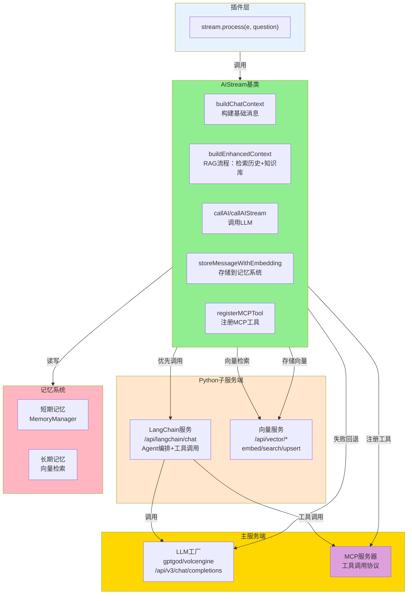
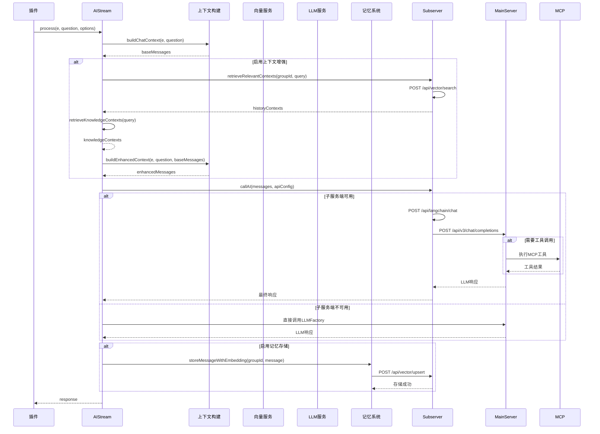
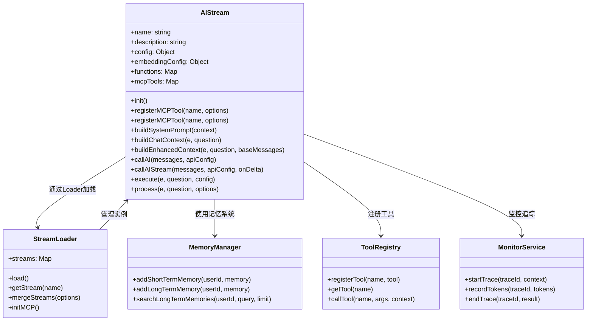
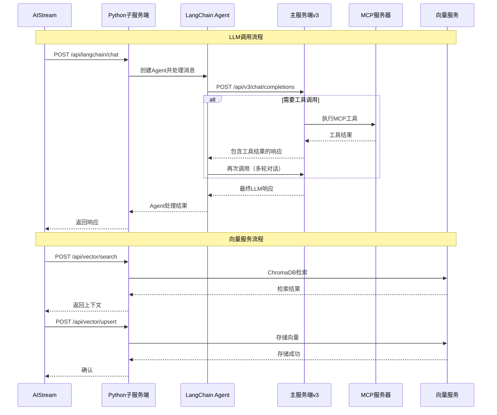

# AIStream 文档

> **文件位置**: `src/infrastructure/aistream/aistream.js`  
> Node 侧“多步工作流/WorkflowManager/TODO”已移除；复杂多步编排请使用 Python 子服务端（LangChain/LangGraph）。本文档描述的是 Node 侧 `AIStream` 基类与 LLM/MCP 集成方式。
> **可扩展性**：AIStream是工作流系统的核心扩展点。通过继承AIStream，开发者可以快速创建自定义工作流。详见 **[框架可扩展性指南](框架可扩展性指南.md)** ⭐

`AIStream` 是 XRK-AGT 中的 **AI 工作流基类**，用于封装 LLM 调用、向量服务、上下文增强等能力（工具调用由 LLM 工厂的 tool calling + MCP 统一处理）。

### 扩展特性

- ✅ **零配置扩展**：放置到任意 `core/*/stream/` 目录即可自动加载
- ✅ **函数注册系统**：统一使用 MCP 工具注册
- ✅ **向量服务集成**：统一通过子服务端向量服务进行文本向量化和检索
- ✅ **工作流合并**：支持功能合并和组合
- ✅ **上下文增强**：自动上下文检索和增强（RAG流程）
- ✅ **热重载支持**：修改代码后自动重载

所有自定义 AI 工作流都应继承此类，可选择实现 `buildSystemPrompt` 与 `buildChatContext`。

---

## 架构概览

### 系统架构图



### 工作流执行流程图



### 组件关系图



---

## 构造参数

```javascript
constructor(options = {})
```

**参数说明**：

| 参数 | 类型 | 说明 | 默认值 |
|------|------|------|--------|
| `name` | `string` | 工作流名称 | `'base-stream'` |
| `description` | `string` | 描述 | `'基础工作流'` |
| `version` | `string` | 版本号 | `'1.0.0'` |
| `author` | `string` | 作者标识 | `'unknown'` |
| `priority` | `number` | 工作流优先级 | `100` |
| `config` | `Object` | AI调用配置 | `{ enabled: true, temperature: 0.8, ... }` |
| `embedding` | `Object` | Embedding配置 | `{ enabled: true, maxContexts: 5 }` |
| `functionToggles` | `Object` | 函数开关配置 | `{}` |

**AI调用配置** (`config`)：
- `enabled` - 是否启用（默认 `true`）
- `temperature`、`maxTokens`、`topP`、`presencePenalty`、`frequencyPenalty` 等
- 运行时可在插件中额外传入 `apiConfig` 覆盖部分字段

### 全局配置

工作流系统全局配置位于 `data/server_bots/aistream.yaml`：

**关键配置项**：
- `llm.Provider` - LLM提供商（`gptgod`/`volcengine`/`xiaomimimo`）
- `subserver.host` - 子服务端地址（默认 `127.0.0.1`）
- `subserver.port` - 子服务端端口（默认 `8000`）
- `subserver.timeout` - 请求超时时间（毫秒，默认 `30000`）

**LLM提供商配置**：
- 配置文件：`data/server_bots/{port}/{providerName}_llm.yaml`
- 配置合并优先级：`apiConfig` > `providerConfig` > `this.config` > 默认值
- 支持动态扩展，无需修改基类代码
- `enableTools`：控制是否启用工具调用，由各提供商配置决定

**Embedding配置**：
- 统一使用子服务端向量服务（`/api/vector/*`）
- 工作流构造函数只需设置 `embedding: { enabled: true, maxContexts: 5 }`
- 向量服务配置位于子服务端配置文件（`data/subserver/config.yaml`）
- `maxContexts` 为工作流级别配置，控制检索上下文条数

---

## 核心方法

### `async init()`

初始化工作流（仅执行一次），由 `StreamLoader` 在加载时自动调用。

**初始化内容**：
- 初始化函数映射 `this.functions = new Map()`
- 初始化 MCP 工具映射 `this.mcpTools = new Map()`
- 子类可重写此方法进行自定义初始化

### `registerMCPTool(name, options)`

注册 MCP 工具（统一工具注册方式）。

**参数**：
- `name` - 函数名称
- `options.handler` - 处理函数
- `options.prompt` - 系统提示说明（会出现在 AI prompt 中）
- `options.parser` - 解析AI输出中的函数调用
- `options.enabled` - 是否启用
- `options.permission` - 权限标识

**特点**：出现在 AI prompt 中，供 AI 直接调用，不返回结构化数据

### `registerMCPTool(name, options)`

注册 MCP 工具（供外部系统调用）。

**参数**：
- `name` - 工具名称
- `options.handler` - 工具处理函数（返回 JSON 格式结果）
- `options.description` - 工具描述
- `options.inputSchema` - JSON Schema 格式的输入参数定义
- `options.enabled` - 是否启用

**特点**：返回结构化 JSON 数据，不会出现在 AI prompt 中，通过 MCP 协议调用

### `buildSystemPrompt(context)` / `buildChatContext(e, question)`

抽象方法（可选实现）：
- `buildSystemPrompt` - 构建系统级提示词（角色设定、回复风格等）
- `buildChatContext` - 将事件与用户问题转换为 `messages` 数组

> 若子类未实现，基类会提供默认实现（返回空字符串/空数组）

---

## Embedding 与上下文增强

**重要说明**：
- **向量服务统一由子服务端提供**，主服务端只需配置子服务端连接信息（`subserver.host`、`subserver.port`、`subserver.timeout`）
- 向量服务配置（模型、维度等）位于子服务端配置文件（`data/subserver/config.yaml`）
- 工作流只需设置 `embedding: { enabled: true, maxContexts: 5 }` 即可启用
- `maxContexts` 为工作流级别配置，控制检索上下文条数，不是向量服务配置

**核心方法**：

| 方法 | 说明 |
|------|------|
| `generateEmbedding(text)` | 调用子服务端 `/api/vector/embed` 生成文本向量 |
| `storeMessageWithEmbedding(groupId, message)` | 存储消息到向量数据库和Redis（key: `ai:memory:${name}:${groupId}`） |
| `retrieveRelevantContexts(groupId, query)` | 检索相关上下文（优先使用MemoryManager，再调用子服务端向量检索） |
| `buildEnhancedContext(e, question, baseMessages)` | 构建增强上下文（完整RAG流程：历史对话 + 知识库） |

**向量服务接口**（子服务端）：
- `POST /api/vector/embed` - 文本向量化（由子服务端提供）
- `POST /api/vector/search` - 向量检索（由子服务端提供）
- `POST /api/vector/upsert` - 向量入库（由子服务端提供）

**子服务端配置**：
- 配置文件：`data/subserver/config.yaml`
- 向量模型、维度等配置在子服务端配置文件中设置

---

## 函数调用

AIStream **不再解析/执行**任何 “文本函数调用 / ReAct”。

- **MCP 工具调用**：由 LLMFactory（各厂商 tool calling 协议）+ `MCPToolAdapter` 内部完成多轮 `tool_calls` → 返回最终 `assistant.content`。
- **统一工具注册**：所有功能都通过 `registerMCPTool` 注册为 MCP 工具，返回标准 JSON 格式

---

## LLM 调用


**核心方法**：

| 方法 | 说明 |
|------|------|
| `callAI(messages, apiConfig)` | 非流式调用AI接口（优先子服务端LangChain，失败时回退到LLM工厂） |
| `callAIStream(messages, apiConfig, onDelta, options)` | 流式调用AI接口，通过 `onDelta` 回调返回增量文本 |
| `execute(e, question, config)` | 执行：构建上下文 → 调用LLM（含 MCP tool calling）→ 存储记忆 |
| `process(e, question, options)` | 工作流处理入口（单次对话 + MCP 工具调用；复杂多步编排在 Python 子服务端） |

**process 方法参数**：
- `mergeStreams` - 要合并的工作流名称列表
- `enableMemory` - 是否启用记忆系统（默认 `false`）
- `enableDatabase` - 是否启用知识库系统（默认 `false`）
- `apiConfig` - LLM配置（可选，会与 `this.config` 合并）

**调用流程**：
1. `buildChatContext` - 构建基础消息数组
2. `buildEnhancedContext` - RAG流程：检索历史对话和知识库
3. `callAI` - 调用LLM（优先子服务端LangChain，失败时回退到LLM工厂）
4. `storeMessageWithEmbedding` - 存储到记忆系统（通过子服务端向量服务）
5. 自动发送回复（插件不需要再次调用 `reply()`）

**子服务端集成详细流程**：



---

## 完整API参考

### 核心方法详解

#### `async process(e, question, options)`

工作流处理入口，支持工作流合并和上下文增强。

**参数**：
- `e` - 事件对象（QQ/IM/Chatbot 等消息事件）
- `question` - 用户问题（字符串或对象）
- `options` - 选项对象
  - `mergeStreams` - 要合并的工作流名称数组
  - `enableMemory` - 是否启用记忆系统（自动合并 `memory` 工作流）
  - `enableDatabase` - 是否启用知识库系统（自动合并 `database` 工作流）
  - `apiConfig` - LLM配置覆盖（provider, model, temperature等）

**返回**：`Promise<string|null>` - AI回复文本

**示例**：
```javascript
// 基础调用
await stream.process(e, e.msg);

// 启用记忆和知识库
await stream.process(e, e.msg, {
  enableMemory: true,
  enableDatabase: true
});

// 合并多个工作流
await stream.process(e, e.msg, {
  mergeStreams: ['tools', 'memory']
});

// 自定义LLM配置
await stream.process(e, e.msg, {
  apiConfig: {
    provider: 'gptgod',
    model: 'gpt-4',
    temperature: 0.7
  }
});
```

#### `async callAI(messages, apiConfig)`

非流式调用AI接口，支持重试和错误处理。

**参数**：
- `messages` - 消息数组（OpenAI格式）
- `apiConfig` - API配置（可选）

**返回**：`Promise<string>` - AI回复文本

**特点**：
- 优先使用子服务端（LangChain）
- 失败时自动回退到LLM工厂
- 支持重试机制（可配置）
- 自动记录Token使用和成本

#### `async callAIStream(messages, apiConfig, onDelta, options)`

流式调用AI接口，实时返回增量文本。

**参数**：
- `messages` - 消息数组
- `apiConfig` - API配置
- `onDelta` - 增量回调函数 `(delta: string) => void`
- `options` - 选项（可选）

**返回**：`Promise<string>` - 完整回复文本

**示例**：
```javascript
let fullText = '';
await stream.callAIStream(messages, {}, (delta) => {
  fullText += delta;
  // 实时发送增量文本
  e.reply(delta);
});
```

#### `async buildEnhancedContext(e, question, baseMessages)`

构建增强上下文（RAG流程）。

**流程**：
1. 提取查询文本
2. 检索历史对话（`retrieveRelevantContexts`）
3. 检索知识库（`retrieveKnowledgeContexts`）
4. 优化和压缩上下文
5. 合并到消息数组

**返回**：`Promise<Array>` - 增强后的消息数组

### 工具注册方法

#### `registerMCPTool(name, options)`

注册MCP工具（统一工具注册方式）。

**参数**：
```javascript
{
  name: 'function_name',
  handler: async (params, context) => {
    // 处理逻辑
  },
  description: '函数描述（出现在prompt中）',
  enabled: true,
  permission: 'admin', // 可选：权限要求
  parser: null // 可选：解析函数
}
```

**示例**：
```javascript
this.registerFunction('save_note', {
  description: '保存笔记到文件',
  handler: async (params, context) => {
    const { content } = params;
    await fs.writeFile('note.txt', content);
  },
  enabled: true
});
```

#### `registerMCPTool(name, options)`

注册MCP工具（供外部系统调用）。

**参数**：
```javascript
{
  name: 'tool_name',
  description: '工具描述',
  inputSchema: {
    type: 'object',
    properties: {
      param1: { type: 'string', description: '参数1' }
    },
    required: ['param1']
  },
  handler: async (args, context) => {
    return { success: true, data: {} };
  },
  enabled: true
}
```

**示例**：
```javascript
this.registerMCPTool('read_file', {
  description: '读取文件内容',
  inputSchema: {
    type: 'object',
    properties: {
      filePath: { type: 'string', description: '文件路径' }
    },
    required: ['filePath']
  },
  handler: async (args, context) => {
    const content = await fs.readFile(args.filePath, 'utf8');
    return {
      success: true,
      data: { content, path: args.filePath }
    };
  }
});
```

### 上下文检索方法

#### `async retrieveRelevantContexts(groupId, query)`

检索相关历史对话。

**参数**：
- `groupId` - 群组ID或用户ID
- `query` - 查询文本

**返回**：`Promise<Array>` - 上下文数组，每个元素包含：
- `message` - 消息内容
- `similarity` - 相似度分数（0-1）
- `time` - 时间戳
- `userId` - 用户ID
- `nickname` - 昵称

#### `async retrieveKnowledgeContexts(query)`

检索知识库上下文（从合并的工作流中查找）。

**参数**：
- `query` - 查询文本

**返回**：`Promise<Array>` - 知识库上下文数组

### 工作流合并

#### `merge(stream, options)`

合并其他工作流的功能。

**参数**：
- `stream` - 要合并的工作流实例
- `options` - 选项
  - `overwrite` - 是否覆盖同名函数（默认 `false`）
  - `prefix` - 函数名前缀（默认 `''`）

**返回**：`Object` - `{ mergedCount, skippedCount }`

**示例**：
```javascript
const toolsStream = StreamLoader.getStream('tools');
this.merge(toolsStream, { prefix: 'tools.' });
```

---

## 使用示例

### 基础工作流实现

```javascript
import AIStream from '#infrastructure/aistream/aistream.js';

export default class MyStream extends AIStream {
  constructor() {
    super({
      name: 'my-stream',
      description: '我的自定义工作流',
      version: '1.0.0',
      priority: 50,
      config: {
        temperature: 0.8,
        maxTokens: 2000
      },
      embedding: { enabled: true }
    });
  }

  async init() {
    await super.init();
    this.registerAllFunctions();
  }

  registerAllFunctions() {
    // 注册Call Function
    this.registerFunction('do_something', {
      description: '执行某个操作',
      handler: async (params, context) => {
        // 处理逻辑
      }
    });

    // 注册MCP工具
    this.registerMCPTool('get_info', {
      description: '获取信息',
      inputSchema: {
        type: 'object',
        properties: {
          key: { type: 'string' }
        }
      },
      handler: async (args, context) => {
        return { success: true, data: {} };
      }
    });
  }

  buildSystemPrompt(context) {
    return '你是一个智能助手...';
  }

  async buildChatContext(e, question) {
    const messages = [];
    messages.push({
      role: 'system',
      content: this.buildSystemPrompt({ e, question })
    });
    messages.push({
      role: 'user',
      content: typeof question === 'string' ? question : question?.text || ''
    });
    return messages;
  }
}
```

### 插件中调用工作流

```javascript
// 基础调用
const stream = this.getStream('chat');
await stream.process(e, e.msg);

// 启用记忆和知识库
await stream.process(e, e.msg, {
  enableMemory: true,
  enableDatabase: true
});

// 合并多个工作流
await stream.process(e, e.msg, {
  mergeStreams: ['tools', 'memory']
});

// 自定义LLM配置
await stream.process(e, e.msg, {
  apiConfig: {
    provider: 'gptgod',
    model: 'gpt-4',
    temperature: 0.7
  }
});

// 流式调用（需要手动发送回复）
let fullText = '';
await stream.callAIStream(messages, {}, (delta) => {
  fullText += delta;
  e.reply(delta);
});
```

### 工作流合并示例

```javascript
// 在desktop工作流中合并tools工作流
async init() {
  await super.init();
  this.registerAllFunctions();
  
  const toolsStream = StreamLoader.getStream('tools');
  if (toolsStream) {
    this.merge(toolsStream);
  }
}
```

---

## 子服务端集成

AIStream系统与Python子服务端紧密集成，实现LLM调用和向量服务的统一管理。

### 架构设计

```
主服务端 (Node.js)                    Python子服务端 (FastAPI)
├─ AIStream基类          ──────HTTP──────>  ├─ LangChain服务
├─ LLM工厂                                  │  └─ Agent编排
├─ MCP服务器                                │  └─ 工具调用
└─ 插件/工作流                             └─ 向量服务
                                              ├─ 向量化 (embed)
                                              ├─ 向量检索 (search)
                                              └─ 向量入库 (upsert)
```

**核心原则**：
- **主服务端**：统一LLM Provider入口、MCP工具执行、工作流管理
- **子服务端**：LangChain生态、向量服务、Python AI能力

### 向量服务接口

AIStream通过子服务端提供向量化服务（统一通过 `Bot.callSubserver` 调用）：

- **POST /api/vector/embed** - 文本向量化
  ```json
  {
    "texts": ["文本1", "文本2"]
  }
  ```
  返回：`{ embeddings: [{ text, embedding }] }`

- **POST /api/vector/search** - 向量检索
  ```json
  {
    "query": "查询文本",
    "collection": "memory_group123",
    "top_k": 5
  }
  ```
  返回：`{ results: [{ text, score, metadata }] }`

- **POST /api/vector/upsert** - 向量入库
  ```json
  {
    "collection": "memory_group123",
    "documents": [{
      "text": "文本内容",
      "metadata": {}
    }]
  }
  ```

### LLM调用接口

- **POST /api/langchain/chat** - LLM对话（优先使用）
  ```json
  {
    "messages": [...],
    "model": "gpt-4",
    "provider": "gptgod",
    "enableTools": false
    "temperature": 0.8,
    "max_tokens": 2000,
    "stream": false,
    "enableTools": true
  }
  ```
  
  **调用流程**：
  1. AIStream调用子服务端 `/api/langchain/chat`
  2. 子服务端通过LangChain Agent处理消息
  3. 子服务端调用主服务端 `/api/v3/chat/completions` 获取LLM响应
  4. 如需工具调用，主服务端执行MCP工具并返回结果
  5. 子服务端返回最终响应给AIStream

  **回退机制**：如果子服务端不可用，AIStream自动回退到直接调用LLM工厂。

### 错误处理

- 子服务端调用失败时，自动回退到LLM工厂
- 向量服务调用失败时，记录日志但不中断流程
- 支持重试机制（可配置）

---

## 错误处理与重试

### 重试配置

在 `aistream.yaml` 中配置：

```yaml
llm:
  retry:
    enabled: true
    maxAttempts: 3
    delay: 2000
    maxDelay: 10000
    backoffMultiplier: 2
    retryOn: ["timeout", "network", "5xx", "rate_limit"]
```

### 错误分类

系统自动分类错误类型：
- `timeout` - 超时错误
- `network` - 网络错误
- `5xx` - 服务器错误
- `rate_limit` - 限流错误
- `auth` - 认证错误（不重试）

---

## 性能优化

### 上下文优化

- **自动去重**：`deduplicateContexts()` 去除重复上下文
- **智能压缩**：`optimizeContexts()` 按相似度排序并压缩
- **Token估算**：`estimateTokens()` 估算文本token数量

### 缓存机制

- Embedding结果缓存（通过子服务端）
- 上下文检索结果缓存
- 工作流实例缓存（StreamLoader）

---

## 监控与追踪

### MonitorService集成

工作流执行自动记录：
- 执行追踪（traceId）
- Token使用统计
- 成本统计
- 错误日志

**示例**：
```javascript
const traceId = MonitorService.startTrace(this.name, {
  agentId: e?.user_id,
  workflow: this.name
});

// ... 执行逻辑 ...

MonitorService.endTrace(traceId, { success: true });
```

---

## 相关文档

- **[框架可扩展性指南](框架可扩展性指南.md)** - 扩展开发完整指南
- **[子服务端 API](subserver-api.md)** - LangChain + 向量服务 + 与主服务 v3 的衔接
- **[MCP 完整指南](mcp-guide.md)** - MCP 工具注册与连接


