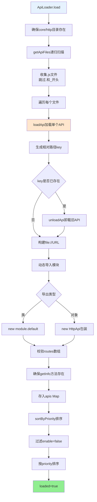
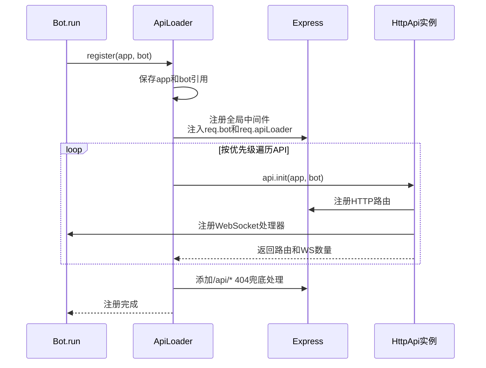
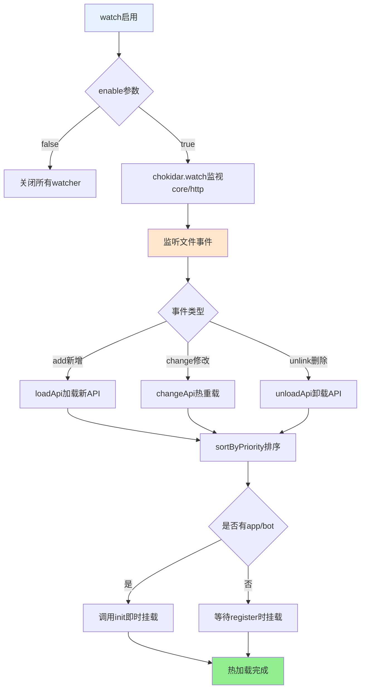

## ApiLoader 文档（src/infrastructure/http/loader.js）

`ApiLoader` 负责从 `core/http` 目录动态加载所有 HTTP API 模块，并完成：

- API 实例化与优先级排序。
- 将路由与 WebSocket 处理器注册到 Express 与 Bot。
- 监控 API 文件变更，实现热加载。

---

## 核心属性

- `apis: Map<string, apiInstance>`：以相对路径 key 存储所有 API 实例。
- `priority: apiInstance[]`：按优先级排序后的 API 列表。
- `watcher: { [name: string]: FSWatcher }`：文件监视器。
- `loaded: boolean`：是否已经完成初次加载。
- `app`：当前 Express 实例。
- `bot`：当前 Bot 实例。

---

## 加载流程：`load()`

**API加载完整流程**:

**步骤说明**：

1. 确保 `paths.coreHttp` 目录存在
2. 调用 `getApiFiles` 递归扫描，收集 `.js` 文件
3. 对每个文件调用 `loadApi`：
   - 生成相对路径 key
   - 动态导入模块并实例化
   - 校验并存入 `apis` Map
4. 调用 `sortByPriority` 排序
5. 标记 `loaded = true`

---

## 注册流程：`register(app, bot)`

**API注册完整流程**:

**步骤说明**：

1. 保存 `app` 与 `bot` 引用
2. 注册全局中间件，注入 `req.bot` 和 `req.apiLoader`
3. 按优先级初始化每个 API，注册路由和 WebSocket
4. 添加 `/api/*` 404 兜底处理

> 所有 API 路由都会经过 Bot 的认证中间件与通用中间件栈，确保有统一的安全与日志策略

---

## 单个 API 重载：`changeApi(key)`

- 使用场景：文件变化触发，或手动重载单个 API。

1. 通过 key 找到旧 API 实例。
2. 输出「重载 API」日志。
3. 调用 `loadApi(api.filePath)` 重新加载模块。
4. `sortByPriority()` 调整顺序。
5. 若新 API 存在且已经有 `app` 和 `bot`：
   - 调用 `newApi.init(this.app, this.bot)` 重新注册其路由。
6. 输出重载完成日志。

> 注意：旧路由不会自动卸载，通常需要配合 `Bot` 重启或明确设计幂等初始化逻辑。

---

## 文件监视与热加载：`watch(enable = true)`

**热加载流程**:

**事件处理**：

- `add` - 新增文件时加载并排序，若已初始化则即时挂载
- `change` - 文件修改时热重载
- `unlink` - 文件删除时卸载并重新排序

---

## API 信息获取：`getApiList()` 与 `getApi(key)`

- `getApiList()`：
  - 遍历 `this.apis`，对每个实例调用 `getInfo()`（若存在），否则构造基本信息。
  - 返回数组，适合用于：
    - 后台管理面板展示。
    - 对外提供 API 文档与统计。

- `getApi(key)`：
  - 按 key 返回对应实例，不存在则返回 `null`。

---

## 使用建议

- **新增 API 模块**
  - 在 `core/http` 下创建新的 `.js` 文件。
  - 按 `docs/http-api.md` 中的推荐方式导出 `default`。
  - `ApiLoader` 会在启动或文件变更时自动加载。

- **调试路由问题**
  - 确认 API 是否出现在 `getApiList()` 输出中。
  - 查看启动日志中对应 API 的「注册路由」信息。
  - 检查是否被 `enable === false` 禁用。

- **热更新注意事项**
  - 若 API 内部在 `init` 中注册了全局中间件，应确保多次调用不会产生重复挂载的问题（可用 idempotent 逻辑）。
  - 对于复杂 API，必要时仍建议重启进程以获得更清晰的状态。

