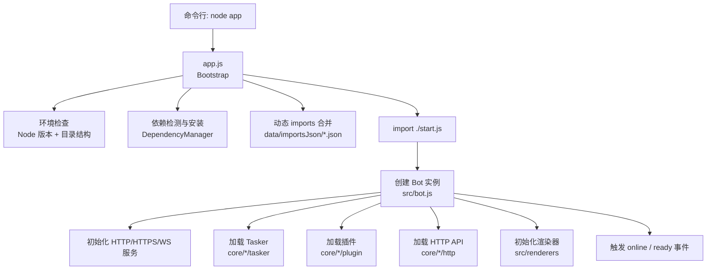
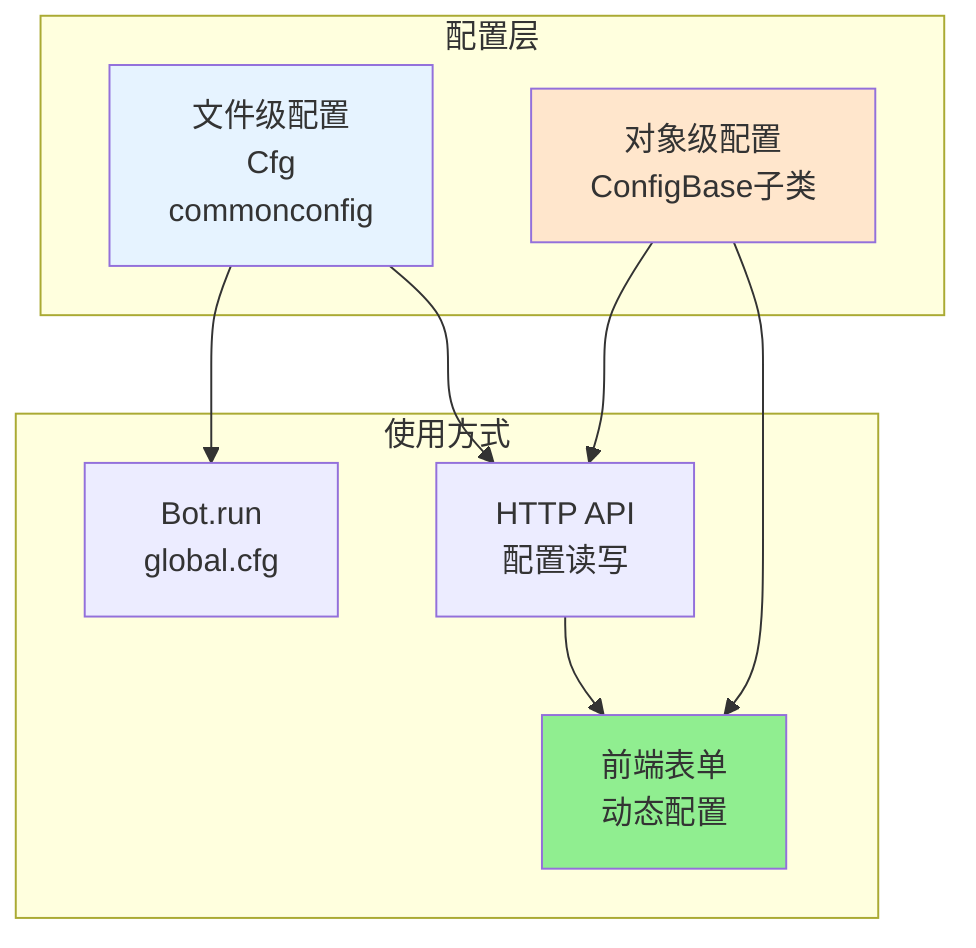
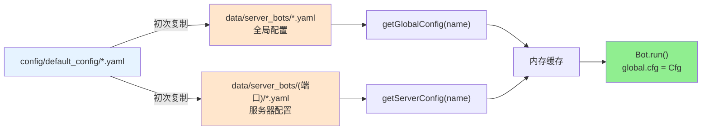
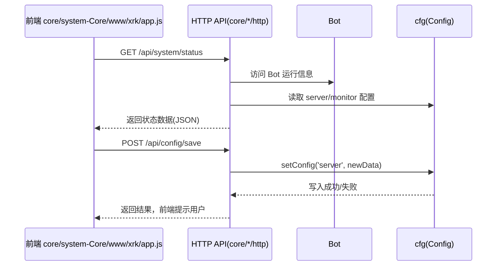
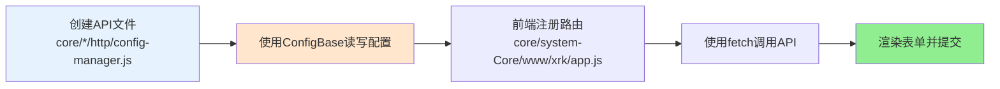
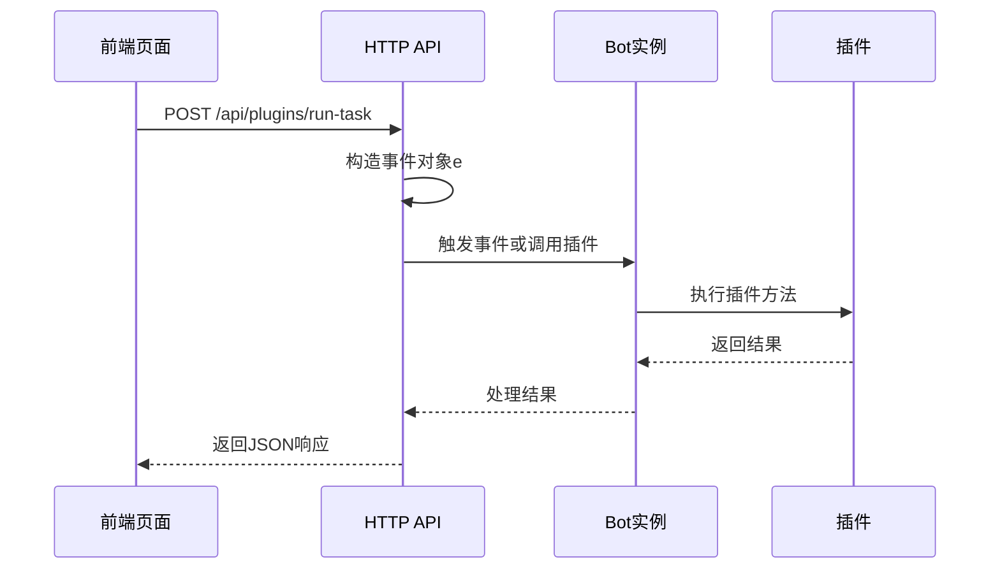
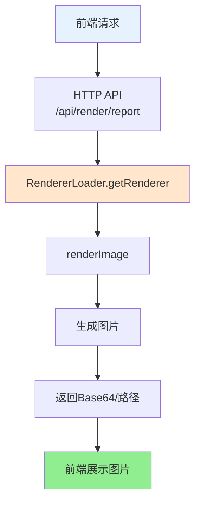
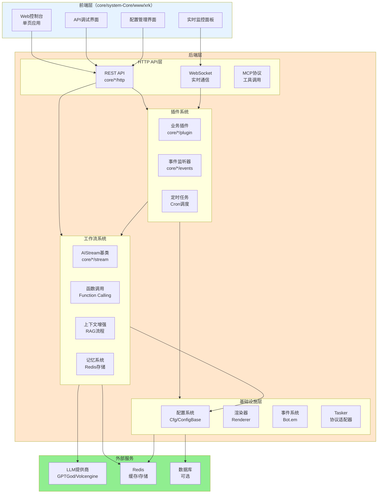
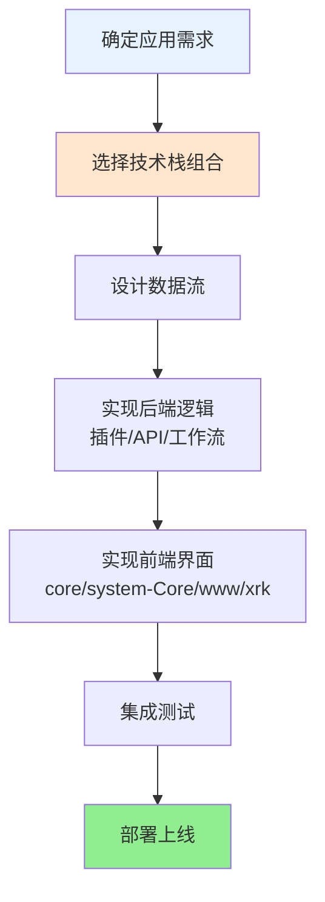

## 应用 & 前后端开发总览（app.js / www/xrk）

> **本文档面向应用开发者、前后端开发者、运维人员，提供完整的应用开发思路和技术栈整合方案。**

本篇文档说明：

- 整体启动流程（`app.js` → `start.js` → `src/bot.js`）
- 如何扩展 Web 前端（`core/system-Core/www/xrk` 控制台，访问路径：`/xrk`）
- 如何让前端与后端 API、插件、渲染器、工作流协同工作
- **完整的技术栈整合方案**：插件系统 + 工作流系统 + HTTP API + 渲染器 + 配置系统 + 事件系统

---

## 启动流程总览



**关键文件：**

| 角色 | 文件 | 说明 |
|------|------|------|
| 引导器 | `app.js` | 检查依赖与环境、安装缺失依赖、加载动态 `imports`，最后启动 `start.js` |
| 主程序入口 | `start.js` | 实际创建 `Bot` 实例、加载配置、监听事件、启动 HTTP/WS 服务 |
| 运行核心 | `src/bot.js` | 封装 HTTP/HTTPS/WebSocket、中间件、认证、Tasker/插件/API 装载 |
| Web 前端 | `core/system-Core/www/xrk/index.html` / `core/system-Core/www/xrk/app.js` | XRK Web 控制台，包含系统状态、API 调试、配置管理前端<br/>访问路径：`/<目录名>/*`（如 `/xrk/*`）<br/>**说明**：`www/` 下可以创建子目录，子目录自动挂载到 `/<目录名>/*` |

---

## app.js：引导流程详解

`app.js` 主要做三件事：

1. **环境验证（EnvironmentValidator）**
   - 检查 Node.js 版本（当前要求 \(\geq 14\)，实际项目中推荐 \(\geq 18\)）。
   - 通过 `paths.ensureBaseDirs` 确保 `logs/`、`data/`、`config/` 等基础目录存在。

2. **依赖管理（DependencyManager）**
   - 解析根目录 `package.json`。
   - 检查 `dependencies + devDependencies` 对应的模块是否存在于 `node_modules`。
   - 若有缺失，自动选择可用的包管理器（`pnpm` → `npm` → `yarn`）执行 `install`。
   - 同时扫描 `core/*` 与 `renderers/*` 子目录中的 `package.json`，为插件/渲染器单独安装依赖。

3. **动态 imports 合并**
   - 扫描 `data/importsJson/*.json`，收集所有 `imports` 字段。
   - 合并到根目录 `package.json.imports` 中，方便在运行时新增别名映射（例如第三方插件）。

完成上述步骤后，`app.js` 动态 `import('./start.js')`，交给主程序继续。

---

## commonconfig / 配置体系与前后端联动

XRK-AGT 的配置体系分为两层：



### 1. Cfg（src/infrastructure/config/config.js）

`Cfg` 负责「**每个端口一份服务器配置**」的拆分与缓存：



| 方法/属性 | 说明 |
|----------|------|
| `PATHS.DEFAULT_CONFIG` | 默认配置目录 `config/default_config` |
| `PATHS.SERVER_BOTS` | 每个端口的服务器配置目录 `data/server_bots/{port}` |
| `getConfigDir()` | 当前端口的配置根目录，例如 `data/server_bots/2537` |
| `getConfig(name)` | 读取 `{configDir}/{name}.yaml`，若不存在则从默认配置复制一份 |
| `getGlobalConfig(name)` | 读取全局配置 `data/server_bots/{name}.yaml`（不随端口变化） |
| `getServerConfig(name)` | 读取服务器配置 `data/server_bots/{port}/{name}.yaml`（随端口变化） |
| `agt/chatbot/group/server/device/monitor/notice/mongodb/redis/db/aistream` | 常用配置的快捷访问器 |
| `renderer` | 合并 `renderers/{type}/config_default.yaml` 与 `data/server_bots/{port}/renderers/{type}/config.yaml` |
| `setConfig(name, data)` | 写回 `{name}.yaml`，并更新内存缓存 |
| `watch(file, name, key)` | 监听配置变更，自动清除缓存，触发 `change_{name}` 钩子 |

> Web 前端配置界面通常通过调用 HTTP API 修改某一类配置，然后由 API 内部调用 `cfg.setConfig(name, data)` 完成写回。

### 2. ConfigBase（src/infrastructure/commonconfig/commonconfig.js）

`ConfigBase` 提供面向对象、可校验的配置操作 API，便于在后台接口/插件中精细控制配置项：

| 能力 | 方法 | 说明 |
|------|------|------|
| 文件访问 | `read()/write()/exists()/backup()` | 带缓存的 YAML/JSON 读写与自动备份 |
| 路径操作 | `get/set/delete/append/remove` | 基于「点号 + 数组下标」的读写 API，适合 Web 表单联动 |
| 合并与重置 | `merge()/reset()` | 深度合并、恢复默认配置 |
| 校验 | `validate(data)` | 按 `schema` 验证字段类型、范围、枚举、自定义规则 |
| 结构导出 | `getStructure()` | 供前端生成「动态表单」所需的字段元数据 |

前端与后端的一般协作方式：

- 前端通过 API 获取 `getStructure()` 与当前配置内容 → 渲染配置表单。
- 用户在 Web 界面修改后提交 → API 内部基于 `ConfigBase.set/merge` 写回。
- 写入时自动校验；失败则 API 返回错误信息供前端提示。

---

## Web 控制台（core/system-Core/www/xrk）与 API 交互

**访问路径**：`/<目录名>`（如 `/xrk`，具体端口由启动配置决定）

`core/system-Core/www/xrk/index.html` + `core/system-Core/www/xrk/app.js` 实现了一个单页控制台，核心功能包括：

- 系统状态监控（通过 HTTP API 拉取指标）。
- API 调试页面（动态加载可用 API 列表）。
- 配置管理器（读写配置相关 API）。
- 与后台 WebSocket 建立连接，监听运行时事件。

**关键交互路径示意：**



前端开发者需要关注：

- 所有可调用的 API 列表，可以通过 `/api/...` 中某个「API 列表接口」获取（例如 `ApiLoader.getApiList()` 暴露的接口）。
- XRK-AGT 采用常规的 REST + JSON 交互模式，支持跨域配置与 API-Key 认证。

---

## 典型开发场景

### 1. 新增一个「配置管理」页面



**步骤**:
1. **后台 API**: 在任意 `core/*/http` 目录创建 API，使用 `ConfigBase` 子类读写配置
2. **前端页面**: 在 `core/system-Core/www/xrk/app.js` 注册路由，使用 `fetch` 调用 API

### 2. 在前端触发某个插件功能



**步骤**:
1. 创建 HTTP API，构造事件对象并调用插件
2. 前端提供按钮，点击后调用 API

### 3. 前端使用渲染器生成图片



**步骤**:
1. 创建渲染API，使用 `RendererLoader.getRenderer()` 生成图片
2. 前端调用API并展示返回的图片

---

## 建议的前后端协作模式

- **后端优先提供清晰的 API 文档**：基于 `HttpApi.getInfo()` 和 `ApiLoader.getApiList()` 生成接口列表，前端直接复用。
- **统一使用 JSON 结构**：所有接口尽量遵循 `{ success, data, message }` 结构，简化前端错误处理。
- **通过 ConfigBase 提供「结构化配置」**：前端不直接操作 YAML，而是通过字段定义自动生成表单。
- **渲染输出统一走 Renderer**：无论是截图、报表、预览，尽量经由 `Renderer` 管理模板与静态资源，保持一致的目录结构。

---

## 完整技术栈整合方案

XRK-AGT 提供了完整的技术栈，开发者可以灵活组合使用：

### 技术栈架构图



### 技术栈组合方案

#### 方案1：简单AI对话应用

**技术栈**：插件 + 工作流 + LLM

```javascript
// 1. 创建插件（core/my-core/plugin/chat.js）
export default class ChatPlugin extends plugin {
  constructor() {
    super({
      name: '聊天插件',
      event: 'message',
      rule: [{ reg: '.*', fnc: 'chat' }]
    });
  }
  
  async chat(e) {
    const stream = this.getStream('chat');
    await stream.process(e, e.msg, {
      enableMemory: true  // 启用记忆系统
    });
  }
}

// 2. 工作流自动处理：
//    - 检索历史对话（Embedding相似度）
//    - 调用LLM生成回复
//    - 存储到记忆系统
//    - 自动发送回复
```

**应用场景**：智能客服、聊天机器人、问答系统

#### 方案2：复杂任务自动化应用

**技术栈**：插件 + 工作流 + TODO系统 + 记忆系统

```javascript
// 1. 创建插件（core/my-core/plugin/assistant.js）
export default class AssistantPlugin extends plugin {
  constructor() {
    super({
      name: '智能助手',
      event: 'message',
      rule: [{ reg: '^#助手', fnc: 'assistant' }]
    });
  }
  
  async assistant(e) {
    const desktopStream = this.getStream('desktop');
    await desktopStream.process(e, e.msg, {
      mergeStreams: ['tools'],      // 合并工具工作流
      // enableTodo 已移除（Node 多步工作流已删除），复杂多步编排请使用 Python 子服务端
      enableMemory: true,           // 启用记忆系统
      enableDatabase: true          // 启用知识库
    });
  }
}

// 2. 工作流自动处理：
//    - AI判断任务复杂度
//    - 复杂任务：创建TODO工作流，逐步执行
//    - 简单任务：直接执行
//    - 自动记录笔记，传递上下文
```

**应用场景**：智能办公助手、自动化脚本、任务编排

#### 方案3：Web控制台应用

**技术栈**：前端 + HTTP API + 工作流 + 渲染器

```javascript
// 1. 创建HTTP API（core/my-core/http/ai-chat.js）
import StreamLoader from '#infrastructure/aistream/loader.js';

export default {
  name: 'ai-chat-api',
  dsc: 'AI聊天API',
  routes: [
    {
      method: 'POST',
      path: '/api/ai/chat',
      handler: async (req, res, bot) => {
        const { message, streamName = 'chat' } = req.body;
        const stream = StreamLoader.getStream(streamName);
        
        if (!stream) {
          return res.status(404).json({
            success: false,
            message: '工作流未找到'
          });
        }
        
        // 构造事件对象
        const e = {
          user_id: req.user?.id || 'web_user',
          group_id: `web_${req.user?.id}`,
          msg: message,
          reply: async (msg) => {
            res.json({ success: true, response: msg });
          }
        };
        
        try {
          await stream.process(e, message, {
            enableMemory: true
          });
        } catch (error) {
          res.status(500).json({
            success: false,
            message: error.message
          });
        }
      }
    }
  ]
};

// 2. 前端调用（core/system-Core/www/xrk/app.js）
async function sendMessage(message) {
  const response = await fetch('/api/ai/chat', {
    method: 'POST',
    headers: { 'Content-Type': 'application/json' },
    body: JSON.stringify({ message })
  });
  const data = await response.json();
  displayMessage(data.response);
}
```

**应用场景**：Web聊天界面、管理后台、API服务

#### 方案4：数据可视化应用

**技术栈**：插件 + 工作流 + 渲染器 + HTTP API

```javascript
// 1. 创建插件（core/my-core/plugin/report.js）
export default class ReportPlugin extends plugin {
  constructor() {
    super({
      name: '报表生成',
      event: 'message',
      rule: [{ reg: '^#报表', fnc: 'generateReport' }]
    });
  }
  
  async generateReport(e) {
    // 调用工作流分析数据
    const stream = this.getStream('desktop');
    const analysis = await stream.process(e, '分析数据并生成报表', {
      // enableTodo 已移除
    });
    
    // 使用渲染器生成图片
    import RendererLoader from '#infrastructure/renderer/loader.js';
    const renderer = RendererLoader.getRenderer('puppeteer');
    if (renderer) {
      const imagePath = await renderer.renderImage({
        template: 'report-template',
        data: { analysis }
      });
      await this.reply(imagePath);
    }
  }
}

// 2. 创建 HTTP API（core/my-core/http/report.js）
export default {
  name: 'report-api',
  dsc: '报表生成API',
  routes: [
    {
      method: 'GET',
      path: '/api/report/generate',
      handler: async (req, res, bot) => {
        const renderer = bot.renderer?.puppeteer;
        if (!renderer) {
          return res.status(503).json({
            success: false,
            message: '渲染器未初始化'
          });
        }
        
        try {
          const imagePath = await renderer.renderImage({
            template: 'report-template',
            data: req.query
          });
          res.sendFile(imagePath);
        } catch (error) {
          res.status(500).json({
            success: false,
            message: error.message
          });
        }
      }
    }
  ]
};
```

**应用场景**：数据报表、图表生成、可视化大屏

#### 方案5：多平台统一应用

**技术栈**：Tasker + 插件 + 工作流 + 事件系统

```javascript
// 1. 创建跨平台插件（core/my-core/plugin/unified.js）
export default class UnifiedPlugin extends plugin {
  constructor() {
    super({
      name: '统一处理',
      event: 'message',  // 监听所有来源的消息
      rule: [{ reg: '^#统一', fnc: 'handle' }]
    });
  }
  
  async handle(e) {
    // 自动识别来源（OneBot/设备/Web）
    const source = e.tasker || 'unknown';
    
    // 统一调用工作流
    const stream = this.getStream('chat');
    await stream.process(e, e.msg, {
      enableMemory: true
    });
    
    // 记录跨平台日志
    BotUtil.makeLog('info', 
      `[${source}] 用户 ${e.user_id}: ${e.msg}`, 
      'UnifiedPlugin'
    );
  }
}
```

**应用场景**：多平台客服、统一管理、跨平台自动化

### 技术栈选择指南

| 应用类型 | 推荐技术栈 | 核心组件 |
|---------|-----------|---------|
| **简单对话** | 插件 + 工作流 | `chat` stream + `enableMemory` |
| **复杂任务** | 插件 + 子服务端 Agent | Python 子服务端（LangChain/LangGraph） |
| **Web应用** | 前端 + HTTP API + 工作流 | REST API + `process()` |
| **数据可视化** | 插件 + 工作流 + 渲染器 | `Renderer` + 模板系统 |
| **多平台** | Tasker + 插件 + 事件系统 | 通用事件监听 |
| **配置管理** | HTTP API + ConfigBase | 动态表单生成 |
| **实时通信** | WebSocket + 事件系统 | `Bot.em` + 事件订阅 |

### 开发流程建议



### 最佳实践

1. **分层设计**：
   - 前端：专注于UI和交互
   - HTTP API：提供标准化接口
   - 插件：处理业务逻辑
   - 工作流：AI能力和复杂任务
   - 基础设施：配置、渲染、存储

2. **技术栈组合原则**：
   - 简单功能：直接使用插件 + 工作流
   - 复杂功能：插件 + 工作流 + TODO系统
   - Web应用：前端 + HTTP API + 工作流
   - 数据展示：工作流 + 渲染器

3. **性能优化**：
   - 合理使用记忆系统（避免过度检索）
   - 工作流合并（减少重复加载）
   - 渲染器缓存（避免重复渲染）
   - 配置缓存（减少文件读取）

4. **可维护性**：
   - 使用ConfigBase管理配置
   - 统一错误处理
   - 日志记录规范
   - 代码模块化

---

## 进一步阅读

- **[PROJECT_OVERVIEW.md](../PROJECT_OVERVIEW.md)**：整体架构与运行逻辑
- **[框架可扩展性指南](框架可扩展性指南.md)**：完整的扩展能力说明
- **[AIStream 文档](aistream.md)**：Node 侧单次对话 + MCP 工具调用（复杂多步在 Python 子服务端）
- **[插件基类文档](plugin-base.md)**：插件基类完整API
- **[AIStream文档](aistream.md)**：AIStream基类完整API
- **[Bot文档](bot.md)**：Bot生命周期、中间件与认证
- **[HTTP API文档](http-api.md)**：API定义与装载
- **[配置系统文档](config-base.md)**：配置基类细节
- **[渲染器文档](renderer.md)**：模板与截图渲染能力


