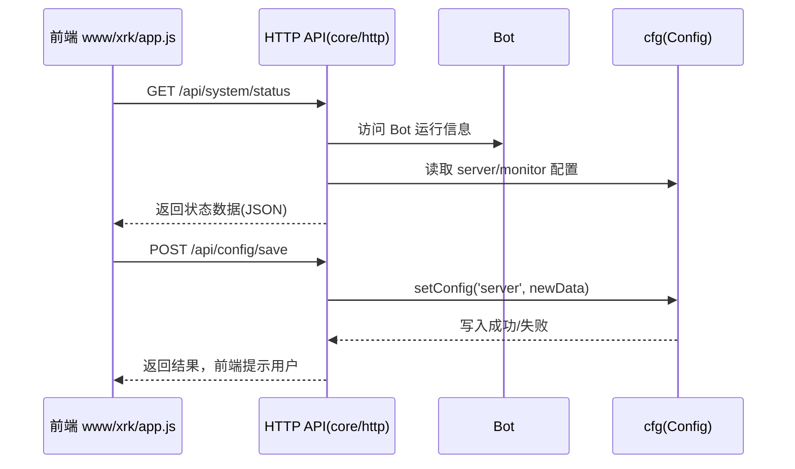

## 应用 & 前后端开发总览（app.js / www/xrk）

本篇文档面向 **应用开发者 / 前后端开发者 / 运维**，说明：

- 整体启动流程（`app.js` → `start.js` → `src/bot.js`）。
- 如何扩展 Web 前端（`www/xrk` 控制台）。
- 如何让前端与后端 API、插件、渲染器协同工作。

---

## 启动流程总览

```mermaid
flowchart TD
  Entry["命令行: node app"] --> Bootstrap["app.js\nBootstrap"]
  Bootstrap --> EnvCheck["环境检查\nNode 版本 + 目录结构"]
  Bootstrap --> Deps["依赖检测与安装\nDependencyManager"]
  Bootstrap --> Imports["动态 imports 合并\ndata/importsJson/*.json"]
  Bootstrap --> Start["import ./start.js"]
  Start --> Bot["创建 Bot 实例\nsrc/bot.js"]
  Bot --> Http["初始化 HTTP/HTTPS/WS 服务"]
  Bot --> Adapters["加载适配器\ncore/adapter"]
  Bot --> Plugins["加载插件\ncore/plugin"]
  Bot --> ApiLoader["加载 HTTP API\ncore/http"]
  Bot --> Renderers["初始化渲染器\nsrc/renderers"]
  Bot --> Online["触发 online / ready 事件"]

**关键文件：**

| 角色 | 文件 | 说明 |
|------|------|------|
| 引导器 | `app.js` | 检查依赖与环境、安装缺失依赖、加载动态 `imports`，最后启动 `start.js` |
| 主程序入口 | `start.js` | 实际创建 `Bot` 实例、加载配置、监听事件、启动 HTTP/WS 服务 |
| 运行核心 | `src/bot.js` | 封装 HTTP/HTTPS/WebSocket、中间件、认证、适配器/插件/API 装载 |
| Web 前端 | `www/xrk/index.html` / `www/xrk/app.js` | XRK Web 控制台，包含系统状态、API 调试、配置管理前端 |

---

## app.js：引导流程详解

`app.js` 主要做三件事：

1. **环境验证（EnvironmentValidator）**
   - 检查 Node.js 版本（当前要求 \(\geq 14\)，实际项目中推荐 \(\geq 18\)）。
   - 通过 `paths.ensureBaseDirs` 确保 `logs/`、`data/`、`config/` 等基础目录存在。

2. **依赖管理（DependencyManager）**
   - 解析根目录 `package.json`。
   - 检查 `dependencies + devDependencies` 对应的模块是否存在于 `node_modules`。
   - 若有缺失，自动选择可用的包管理器（`pnpm` → `npm` → `yarn`）执行 `install`。
   - 同时扫描 `core/*` 与 `renderers/*` 子目录中的 `package.json`，为插件/渲染器单独安装依赖。

3. **动态 imports 合并**
   - 扫描 `data/importsJson/*.json`，收集所有 `imports` 字段。
   - 合并到根目录 `package.json.imports` 中，方便在运行时新增别名映射（例如第三方插件）。

完成上述步骤后，`app.js` 动态 `import('./start.js')`，交给主程序继续。

---

## commonconfig / 配置体系与前后端联动

XRK-AGT 的配置体系分为两层：

1. **文件级配置（commonconfig / Cfg）**
2. **对象级配置（`ConfigBase` 子类）**

### 1. Cfg（src/infrastructure/config/config.js）

`Cfg` 负责「**每个端口一份服务器配置**」的拆分与缓存：

```mermaid
flowchart LR
  Default["config/default_config/*.yaml"] -->|初次复制| ServerCfg["data/server_bots/{port}/*.yaml"]
  ServerCfg --> Cfg["getConfig(name)"]
  Cfg --> Bot["Bot.run()\n(global.cfg = Cfg)"]
```

| 方法/属性 | 说明 |
|----------|------|
| `PATHS.DEFAULT_CONFIG` | 默认配置目录 `config/default_config` |
| `PATHS.SERVER_BOTS` | 每个端口的服务器配置目录 `data/server_bots/{port}` |
| `getConfigDir()` | 当前端口的配置根目录，例如 `data/server_bots/2537` |
| `getConfig(name)` | 读取 `{configDir}/{name}.yaml`，若不存在则从默认配置复制一份 |
| `getdefSet(name)` | 仅读取默认配置 `default_config/{name}.yaml` |
| `bot/other/redis/server/device/db/monitor` | 常用配置的快捷访问器 |
| `renderer` | 合并 `renderers/{type}/config_default.yaml` 与 `data/server_bots/{port}/renderers/{type}/config.yaml` |
| `setConfig(name, data)` | 写回 `{name}.yaml`，并更新内存缓存 |
| `watch(file, name, key)` | 监听配置变更，自动清除缓存，触发 `change_{name}` 钩子 |

> Web 前端配置界面通常通过调用 HTTP API 修改某一类配置，然后由 API 内部调用 `cfg.setConfig(name, data)` 完成写回。

### 2. ConfigBase（src/infrastructure/commonconfig/commonconfig.js）

`ConfigBase` 提供面向对象、可校验的配置操作 API，便于在后台接口/插件中精细控制配置项：

| 能力 | 方法 | 说明 |
|------|------|------|
| 文件访问 | `read()/write()/exists()/backup()` | 带缓存的 YAML/JSON 读写与自动备份 |
| 路径操作 | `get/set/delete/append/remove` | 基于「点号 + 数组下标」的读写 API，适合 Web 表单联动 |
| 合并与重置 | `merge()/reset()` | 深度合并、恢复默认配置 |
| 校验 | `validate(data)` | 按 `schema` 验证字段类型、范围、枚举、自定义规则 |
| 结构导出 | `getStructure()` | 供前端生成「动态表单」所需的字段元数据 |

前端与后端的一般协作方式：

- 前端通过 API 获取 `getStructure()` 与当前配置内容 → 渲染配置表单。
- 用户在 Web 界面修改后提交 → API 内部基于 `ConfigBase.set/merge` 写回。
- 写入时自动校验；失败则 API 返回错误信息供前端提示。

---

## Web 控制台（www/xrk）与 API 交互

`www/xrk/index.html` + `www/xrk/app.js` 实现了一个单页控制台，核心功能包括：

- 系统状态监控（通过 HTTP API 拉取指标）。
- API 调试页面（动态加载可用 API 列表）。
- 配置管理器（读写配置相关 API）。
- 与后台 WebSocket 建立连接，监听运行时事件。

**关键交互路径示意：**



前端开发者需要关注：

- 所有可调用的 API 列表，可以通过 `/api/...` 中某个「API 列表接口」获取（例如 `ApiLoader.getApiList()` 暴露的接口）。
- XRK-AGT 采用常规的 REST + JSON 交互模式，支持跨域配置与 API-Key 认证。

---

## 典型开发场景

### 1. 新增一个「配置管理」页面

1. **后台 API**
   - 在 `core/http` 新增一个配置相关 API，例如 `config-manager.js`，内部使用 `Cfg` 或 `ConfigBase` 子类读写指定配置。
2. **前端页面**
   - 在 `www/xrk/app.js` 中为新页面注册路由和组件（参考现有 `config` 页模式）。
   - 使用 `fetch` 调用新建 API，渲染表单并提交修改。

### 2. 在前端触发某个插件功能

1. 编写一个 HTTP API，将前端请求转为插件事件或直接调用插件方法：
   - 例如：`/api/plugins/run-task`，内部构造事件对象 `e` 并调用对应插件。
2. 前端页面中提供按钮或表单，点击后调用该 API。

### 3. 前端使用渲染器生成图片

1. 后台暴露一个 API，如 `/api/render/report`：
   - 内部使用 `Bot.renderer.puppeteer.renderImage(...)` 或自定义渲染器。
   - 返回 Base64 图片或可访问的临时路径。
2. 前端调用该 API，并在页面中展示返回的图片结果。

---

## 建议的前后端协作模式

- **后端优先提供清晰的 API 文档**：基于 `HttpApi.getInfo()` 和 `ApiLoader.getApiList()` 生成接口列表，前端直接复用。
- **统一使用 JSON 结构**：所有接口尽量遵循 `{ success, data, message }` 结构，简化前端错误处理。
- **通过 ConfigBase 提供「结构化配置」**：前端不直接操作 YAML，而是通过字段定义自动生成表单。
- **渲染输出统一走 Renderer**：无论是截图、报表、预览，尽量经由 `Renderer` 管理模板与静态资源，保持一致的目录结构。

---

## 进一步阅读

- `PROJECT_OVERVIEW.md`：整体架构与运行逻辑。
- `docs/bot.md`：`Bot` 生命周期、中间件与认证。
- `docs/http-api.md` / `docs/api-loader.md`：API 定义与装载。
- `docs/config-base.md`：配置基类细节。
- `docs/renderer.md`：模板与截图渲染能力。


