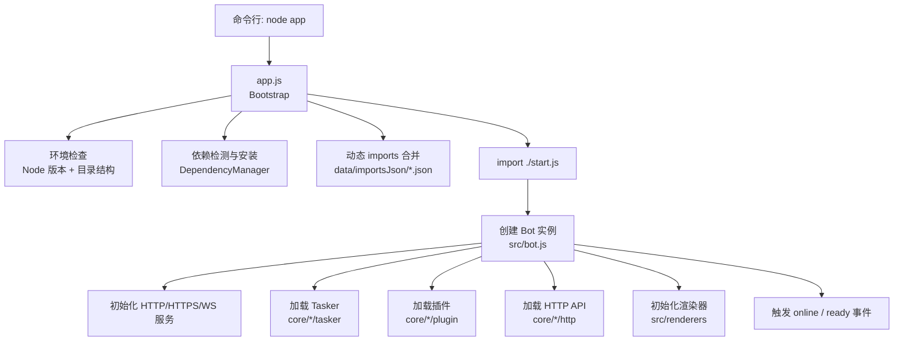
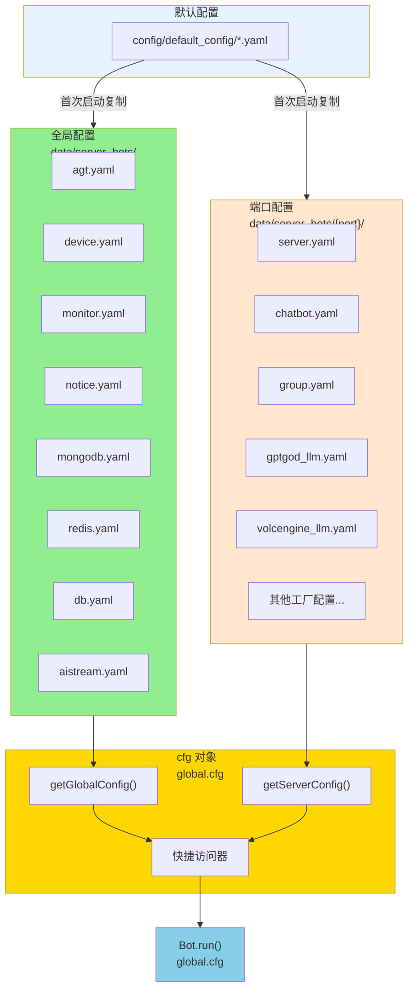
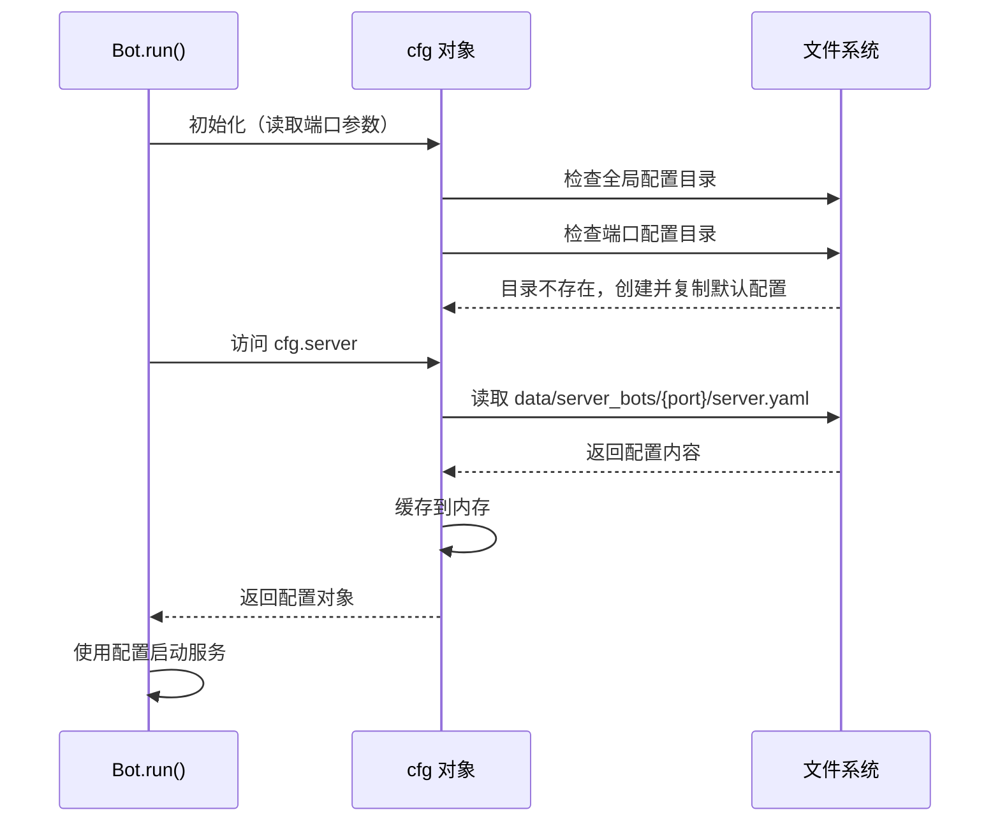
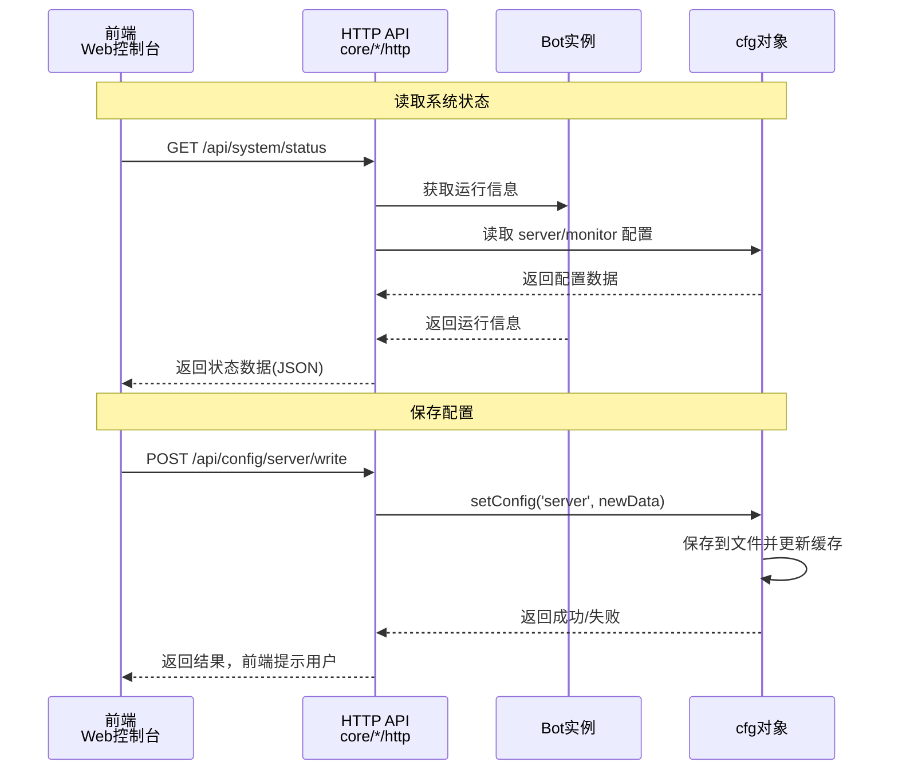
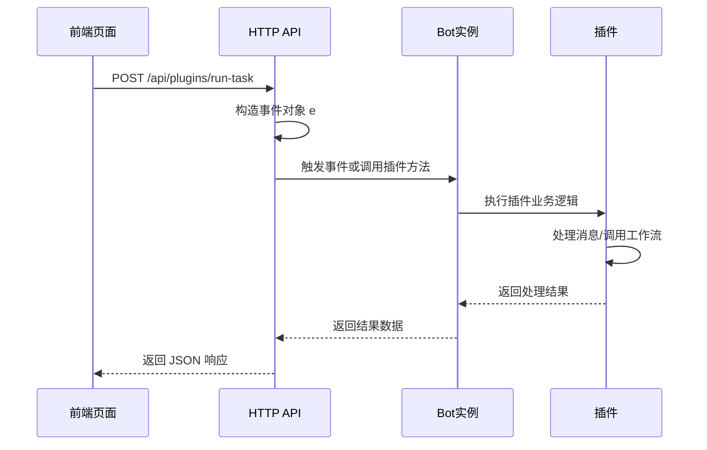
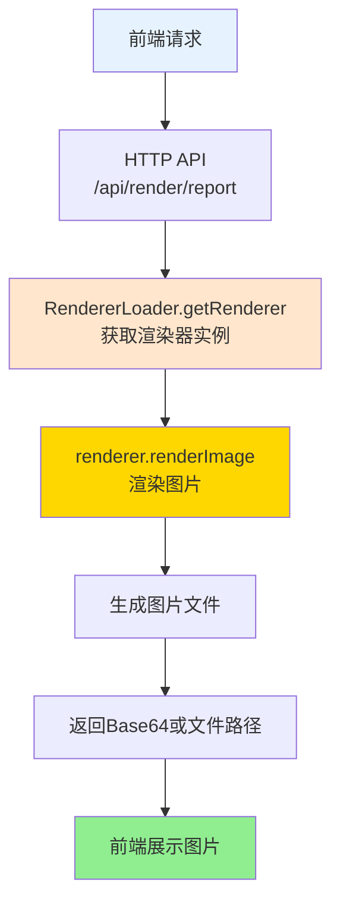
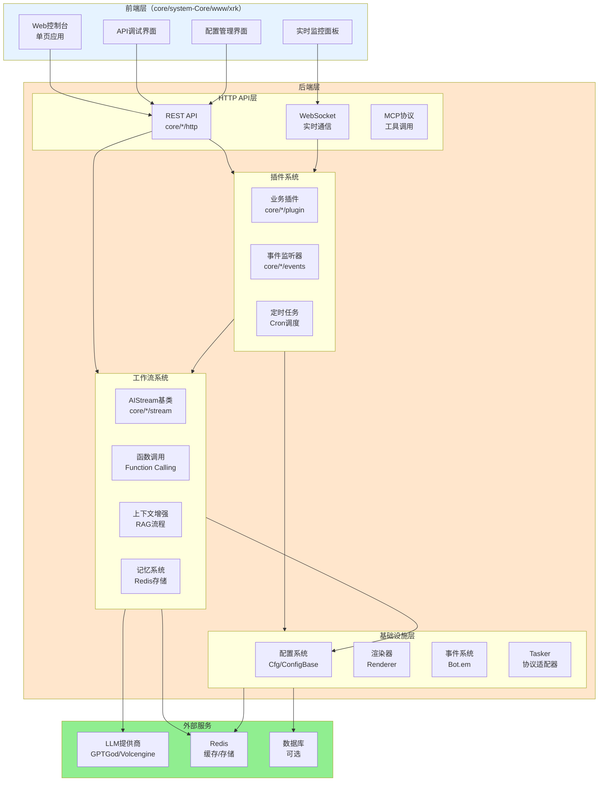
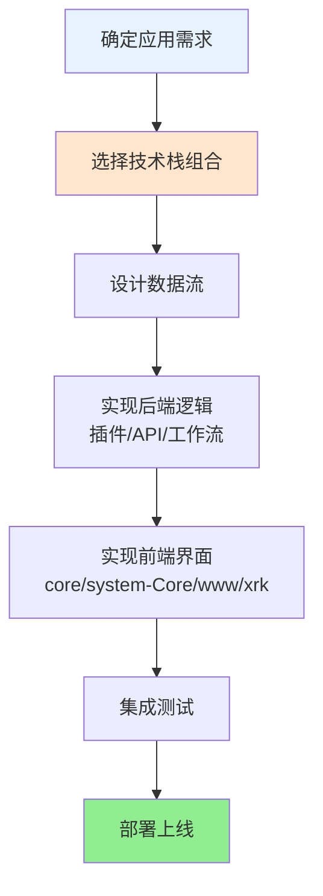

# 应用 & 前后端开发总览

> **文件位置**：`app.js`、`start.js`、`core/system-Core/www/xrk/`  
> **适用场景**：本文档面向应用开发者、前后端开发者、运维人员，提供完整的应用开发思路和技术栈整合方案

本篇文档说明：

- 整体启动流程（`app.js` → `start.js` → `src/bot.js`）
- 如何扩展 Web 前端（`core/system-Core/www/xrk` 控制台，访问路径：`/xrk`）
- 如何让前端与后端 API、插件、渲染器、工作流协同工作
- **完整的技术栈整合方案**：插件系统 + 工作流系统 + HTTP API + 渲染器 + 配置系统 + 事件系统

### 扩展特性

- ✅ **引导流程**：自动环境检查、依赖安装、配置加载
- ✅ **Web控制台**：内置Web管理界面，支持系统状态、API调试、配置管理
- ✅ **技术栈整合**：插件系统 + 工作流系统 + HTTP API + 渲染器 + 配置系统 + 事件系统
- ✅ **前后端分离**：前端通过HTTP API与后端交互
- ✅ **热重载支持**：开发时自动重载，提升开发效率

---

## 📚 目录

- [启动流程总览](#启动流程总览)
- [app.js：引导流程详解](#appjs引导流程详解)
- [配置系统（cfg 对象）](#配置系统cfg-对象)
- [Web 控制台（core/system-Core/www/xrk）与 API 交互](#web-控制台coresystem-corewwwxrk-与-api-交互)
- [典型开发场景](#典型开发场景)
- [建议的前后端协作模式](#建议的前后端协作模式)
- [完整技术栈整合方案](#完整技术栈整合方案)
- [进一步阅读](#进一步阅读)

---

## 启动流程总览



**关键文件：**

| 角色 | 文件 | 说明 |
|------|------|------|
| 引导器 | `app.js` | 检查依赖与环境、安装缺失依赖、加载动态 `imports`，最后启动 `start.js` |
| 主程序入口 | `start.js` | 实际创建 `Bot` 实例、加载配置、监听事件、启动 HTTP/WS 服务 |
| 运行核心 | `src/bot.js` | 封装 HTTP/HTTPS/WebSocket、中间件、认证、Tasker/插件/API 装载 |
| Web 前端 | `core/system-Core/www/xrk/index.html` / `core/system-Core/www/xrk/app.js` | XRK Web 控制台，包含系统状态、API 调试、配置管理前端<br/>访问路径：`/<目录名>/*`（如 `/xrk/*`）<br/>**说明**：`www/` 下可以创建子目录，子目录自动挂载到 `/<目录名>/*` |

---

## app.js：引导流程详解

`app.js` 主要做三件事：

1. **环境验证（EnvironmentValidator）**
   - 检查 Node.js 版本（当前要求 \(\geq 14\)，实际项目中推荐 \(\geq 18\)）。
   - 通过 `paths.ensureBaseDirs` 确保 `logs/`、`data/`、`config/` 等基础目录存在。

2. **依赖管理（DependencyManager）**
   - 解析根目录 `package.json`。
   - 检查 `dependencies + devDependencies` 对应的模块是否存在于 `node_modules`。
   - 若有缺失，自动选择可用的包管理器（`pnpm` → `npm` → `yarn`）执行 `install`。
   - 同时扫描 `core/*` 与 `renderers/*` 子目录中的 `package.json`，为插件/渲染器单独安装依赖。

3. **动态 imports 合并**
   - 扫描 `data/importsJson/*.json`，收集所有 `imports` 字段。
   - 合并到根目录 `package.json.imports` 中，方便在运行时新增别名映射（例如第三方插件）。

完成上述步骤后，`app.js` 动态 `import('./start.js')`，交给主程序继续。

---

## 配置系统（cfg 对象）

XRK-AGT 的配置系统采用**全局配置 + 端口配置**的分离设计，通过 `cfg` 对象统一管理。

### 配置架构



### 配置分类

#### 1. 全局配置（不随端口变化）

全局配置存储在 `data/server_bots/` 根目录，所有端口实例共享：

| 配置名称 | 文件路径 | 说明 |
|---------|---------|------|
| `agt` | `data/server_bots/agt.yaml` | AGT 主配置 |
| `device` | `data/server_bots/device.yaml` | 设备配置 |
| `monitor` | `data/server_bots/monitor.yaml` | 监控配置 |
| `notice` | `data/server_bots/notice.yaml` | 通知配置 |
| `mongodb` | `data/server_bots/mongodb.yaml` | MongoDB 连接配置 |
| `redis` | `data/server_bots/redis.yaml` | Redis 连接配置 |
| `db` | `data/server_bots/db.yaml` | 数据库配置 |
| `aistream` | `data/server_bots/aistream.yaml` | AI 工作流全局配置 |

**使用方式**：
```javascript
// 通过快捷访问器
const agtConfig = cfg.agt;
const redisConfig = cfg.redis;

// 或通过方法
const deviceConfig = cfg.getGlobalConfig('device');
```

#### 2. 端口配置（随端口变化）

端口配置存储在 `data/server_bots/{port}/` 目录，每个端口实例独立：

| 配置名称 | 文件路径 | 说明 |
|---------|---------|------|
| `server` | `data/server_bots/{port}/server.yaml` | 服务器配置（端口、代理等） |
| `chatbot` | `data/server_bots/{port}/chatbot.yaml` | 聊天机器人配置 |
| `group` | `data/server_bots/{port}/group.yaml` | 群组配置 |
| `gptgod_llm` | `data/server_bots/{port}/gptgod_llm.yaml` | GPTGod LLM 配置 |
| `volcengine_llm` | `data/server_bots/{port}/volcengine_llm.yaml` | 火山引擎 LLM 配置 |
| `其他工厂配置` | `data/server_bots/{port}/*.yaml` | 其他 LLM/ASR/TTS 提供商配置 |

**使用方式**：
```javascript
// 通过快捷访问器
const serverConfig = cfg.server;
const chatbotConfig = cfg.chatbot;

// 或通过方法
const groupConfig = cfg.getServerConfig('group');
```

### cfg 对象 API

#### 核心方法

| 方法 | 说明 | 示例 |
|------|------|------|
| `getGlobalConfig(name)` | 获取全局配置 | `cfg.getGlobalConfig('agt')` |
| `getServerConfig(name)` | 获取端口配置 | `cfg.getServerConfig('server')` |
| `getConfig(name)` | 自动判断全局/端口配置 | `cfg.getConfig('agt')` → 全局<br/>`cfg.getConfig('server')` → 端口 |
| `setConfig(name, data)` | 保存配置（自动判断类型） | `cfg.setConfig('server', {...})` |
| `getConfigDir()` | 获取当前端口配置目录 | `data/server_bots/8080` |
| `getGlobalConfigDir()` | 获取全局配置目录 | `data/server_bots` |
| `getRendererConfig(type)` | 获取渲染器配置 | `cfg.getRendererConfig('puppeteer')` |
| `watch(file, name, key)` | 监听配置变更 | 自动调用，无需手动使用 |

#### 快捷访问器

**全局配置访问器**：
- `cfg.agt` - AGT 配置
- `cfg.device` - 设备配置
- `cfg.monitor` - 监控配置
- `cfg.notice` - 通知配置
- `cfg.mongodb` - MongoDB 配置
- `cfg.redis` - Redis 配置
- `cfg.db` - 数据库配置
- `cfg.aistream` - AI 工作流配置

**端口配置访问器**：
- `cfg.server` - 服务器配置
- `cfg.chatbot` - 聊天机器人配置
- `cfg.group` - 群组配置
- `cfg.gptgod_llm` - GPTGod LLM 配置
- `cfg.volcengine_llm` - 火山引擎 LLM 配置
- `cfg.renderer` - 渲染器配置（合并 puppeteer + playwright）

**便捷方法**：
- `cfg.masterQQ` - 获取主人 QQ 号列表
- `cfg.master` - 获取主人映射对象
- `cfg.getGroup(groupId)` - 获取群组配置
- `cfg.port` - 获取当前端口号（只读）

### 配置加载流程



### 配置使用示例

```javascript
// 在插件中使用配置
export default class MyPlugin extends plugin {
  constructor() {
    super({ name: '示例插件' });
  }
  
  async onMessage(e) {
    // 读取端口配置
    const serverConfig = cfg.server;
    const chatbotConfig = cfg.chatbot;
    
    // 读取全局配置
    const redisConfig = cfg.redis;
    const aistreamConfig = cfg.aistream;
    
    // 读取群组配置
    const groupConfig = cfg.getGroup(e.group_id);
    
    // 使用配置
    if (groupConfig.enabled) {
      // 处理逻辑
    }
  }
}

// 在 HTTP API 中使用配置
export default {
  name: 'config-api',
  routes: [{
    method: 'GET',
    path: '/api/config/server',
    handler: async (req, res) => {
      // 读取配置
      const serverConfig = cfg.server;
      res.json({ success: true, data: serverConfig });
    }
  }, {
    method: 'POST',
    path: '/api/config/server',
    handler: async (req, res) => {
      // 保存配置
      const success = cfg.setConfig('server', req.body);
      res.json({ success, message: success ? '保存成功' : '保存失败' });
    }
  }]
};
```

### ConfigBase（高级配置管理）

`ConfigBase` 提供面向对象、可校验的配置操作 API，适用于需要 Schema 验证、自动备份等高级特性的场景：

| 能力 | 方法 | 说明 |
|------|------|------|
| 文件访问 | `read()/write()/exists()/backup()` | 带缓存的 YAML/JSON 读写与自动备份 |
| 路径操作 | `get/set/delete/append/remove` | 基于「点号 + 数组下标」的读写 API |
| 合并与重置 | `merge()/reset()` | 深度合并、恢复默认配置 |
| 校验 | `validate(data)` | 按 `schema` 验证字段类型、范围、枚举 |
| 结构导出 | `getStructure()` | 供前端生成「动态表单」所需的字段元数据 |

**详细文档**：参见 [ConfigBase 文档](config-base.md)

---

## Web 控制台（core/system-Core/www/xrk）与 API 交互

**访问路径**：`/<目录名>`（如 `/xrk`，具体端口由启动配置决定）

`core/system-Core/www/xrk/index.html` + `core/system-Core/www/xrk/app.js` 实现了一个单页控制台，核心功能包括：

- 系统状态监控（通过 HTTP API 拉取指标）。
- API 调试页面（动态加载可用 API 列表）。
- 配置管理器（读写配置相关 API）。
- 与后台 WebSocket 建立连接，监听运行时事件。

**关键交互路径示意：**



前端开发者需要关注：

- 所有可调用的 API 列表，可以通过 `/api/...` 中某个「API 列表接口」获取（例如 `ApiLoader.getApiList()` 暴露的接口）。
- XRK-AGT 采用常规的 REST + JSON 交互模式，支持跨域配置与 API-Key 认证。

---

## 典型开发场景

### 1. 新增一个「配置管理」页面

```mermaid
flowchart TB
    A[1. 创建API文件<br/>core/*/http/config-manager.js] --> B[2. 使用cfg对象或ConfigBase<br/>读写配置]
    B --> C[3. 前端注册路由<br/>core/system-Core/www/xrk/app.js]
    C --> D[4. 使用fetch调用API]
    D --> E[5. 渲染表单并提交]
    E --> F[6. API保存配置<br/>cfg.setConfig()]
    
    style A fill:#E6F3FF
    style B fill:#FFE6CC
    style E fill:#90EE90
    style F fill:#87CEEB
```

**步骤**:
1. **后台 API**: 在任意 `core/*/http` 目录创建 API，使用 `ConfigBase` 子类读写配置
2. **前端页面**: 在 `core/system-Core/www/xrk/app.js` 注册路由，使用 `fetch` 调用 API

### 2. 在前端触发某个插件功能



**步骤**:
1. 创建 HTTP API，构造事件对象并调用插件
2. 前端提供按钮，点击后调用 API

### 3. 前端使用渲染器生成图片



**步骤**:
1. 创建渲染API，使用 `RendererLoader.getRenderer()` 生成图片
2. 前端调用API并展示返回的图片

---

## 建议的前后端协作模式

- **后端优先提供清晰的 API 文档**：基于 `HttpApi.getInfo()` 和 `ApiLoader.getApiList()` 生成接口列表，前端直接复用。
- **统一使用 JSON 结构**：所有接口尽量遵循 `{ success, data, message }` 结构，简化前端错误处理。
- **通过 ConfigBase 提供「结构化配置」**：前端不直接操作 YAML，而是通过字段定义自动生成表单。
- **渲染输出统一走 Renderer**：无论是截图、报表、预览，尽量经由 `Renderer` 管理模板与静态资源，保持一致的目录结构。

---

## 完整技术栈整合方案

XRK-AGT 提供了完整的技术栈，开发者可以灵活组合使用：

### 技术栈架构图



### 技术栈组合方案

#### 方案1：简单AI对话应用

**技术栈**：插件 + 工作流 + LLM

```javascript
// 1. 创建插件（core/my-core/plugin/chat.js）
export default class ChatPlugin extends plugin {
  constructor() {
    super({
      name: '聊天插件',
      event: 'message',
      rule: [{ reg: '.*', fnc: 'chat' }]
    });
  }
  
  async chat(e) {
    const stream = this.getStream('chat');
    await stream.process(e, e.msg, {
      enableMemory: true  // 启用记忆系统
    });
  }
}

// 2. 工作流自动处理：
//    - 检索历史对话（Embedding相似度）
//    - 调用LLM生成回复
//    - 存储到记忆系统
//    - 自动发送回复
```

**应用场景**：智能客服、聊天机器人、问答系统

#### 方案2：复杂任务自动化应用

**技术栈**：插件 + 工作流 + 子服务端 Agent + 记忆系统

```javascript
// 1. 创建插件（core/my-core/plugin/assistant.js）
export default class AssistantPlugin extends plugin {
  constructor() {
    super({
      name: '智能助手',
      event: 'message',
      rule: [{ reg: '^#助手', fnc: 'assistant' }]
    });
  }
  
  async assistant(e) {
    // 简单任务：直接使用工作流
    const desktopStream = this.getStream('desktop');
    await desktopStream.process(e, e.msg, {
      enableMemory: true,           // 整合记忆工具工作流
      enableDatabase: true,         // 整合知识库工具工作流
      enableTools: true            // 整合文件操作工具工作流
    });
    
    // 复杂任务：调用 Python 子服务端（LangChain/LangGraph）
    // 通过 Bot.callSubserver('/api/langchain/chat') 调用
  }
}

// 2. 工作流自动处理：
//    - 简单任务：直接执行
//    - 复杂任务：调用 Python 子服务端进行多步编排
//    - 自动记录笔记，传递上下文
```

**应用场景**：智能办公助手、自动化脚本、复杂任务编排

> **注意**：Node 侧多步工作流（TODO系统）已移除，复杂多步编排请使用 Python 子服务端（LangChain/LangGraph）

#### 方案3：Web控制台应用

**技术栈**：前端 + HTTP API + 工作流 + 渲染器

```javascript
// 1. 创建HTTP API（core/my-core/http/ai-chat.js）
import StreamLoader from '#infrastructure/aistream/loader.js';

export default {
  name: 'ai-chat-api',
  dsc: 'AI聊天API',
  routes: [
    {
      method: 'POST',
      path: '/api/ai/chat',
      handler: async (req, res, bot) => {
        const { message, streamName = 'chat' } = req.body;
        const stream = StreamLoader.getStream(streamName);
        
        if (!stream) {
          return res.status(404).json({
            success: false,
            message: '工作流未找到'
          });
        }
        
        // 构造事件对象
        const e = {
          user_id: req.user?.id || 'web_user',
          group_id: `web_${req.user?.id}`,
          msg: message,
          reply: async (msg) => {
            res.json({ success: true, response: msg });
          }
        };
        
        try {
          await stream.process(e, message, {
            enableMemory: true
          });
        } catch (error) {
          res.status(500).json({
            success: false,
            message: error.message
          });
        }
      }
    }
  ]
};

// 2. 前端调用（core/system-Core/www/xrk/app.js）
async function sendMessage(message) {
  const response = await fetch('/api/ai/chat', {
    method: 'POST',
    headers: { 'Content-Type': 'application/json' },
    body: JSON.stringify({ message })
  });
  const data = await response.json();
  displayMessage(data.response);
}
```

**应用场景**：Web聊天界面、管理后台、API服务

#### 方案4：数据可视化应用

**技术栈**：插件 + 工作流 + 渲染器 + HTTP API

```javascript
// 1. 创建插件（core/my-core/plugin/report.js）
export default class ReportPlugin extends plugin {
  constructor() {
    super({
      name: '报表生成',
      event: 'message',
      rule: [{ reg: '^#报表', fnc: 'generateReport' }]
    });
  }
  
  async generateReport(e) {
    // 调用工作流分析数据
    const stream = this.getStream('desktop');
    await stream.process(e, '分析数据并生成报表', {
      enableMemory: true
    });
    
    // 使用渲染器生成图片
    import RendererLoader from '#infrastructure/renderer/loader.js';
    const renderer = RendererLoader.getRenderer('puppeteer');
    if (renderer) {
      const imagePath = await renderer.renderImage({
        template: 'report-template',
        data: { analysis }
      });
      await this.reply(imagePath);
    }
  }
}

// 2. 创建 HTTP API（core/my-core/http/report.js）
export default {
  name: 'report-api',
  dsc: '报表生成API',
  routes: [
    {
      method: 'GET',
      path: '/api/report/generate',
      handler: async (req, res, bot) => {
        const renderer = bot.renderer?.puppeteer;
        if (!renderer) {
          return res.status(503).json({
            success: false,
            message: '渲染器未初始化'
          });
        }
        
        try {
          const imagePath = await renderer.renderImage({
            template: 'report-template',
            data: req.query
          });
          res.sendFile(imagePath);
        } catch (error) {
          res.status(500).json({
            success: false,
            message: error.message
          });
        }
      }
    }
  ]
};
```

**应用场景**：数据报表、图表生成、可视化大屏

#### 方案5：多平台统一应用

**技术栈**：Tasker + 插件 + 工作流 + 事件系统

```javascript
// 1. 创建跨平台插件（core/my-core/plugin/unified.js）
export default class UnifiedPlugin extends plugin {
  constructor() {
    super({
      name: '统一处理',
      event: 'message',  // 监听所有来源的消息
      rule: [{ reg: '^#统一', fnc: 'handle' }]
    });
  }
  
  async handle(e) {
    // 自动识别来源（OneBot/设备/Web）
    const source = e.tasker || 'unknown';
    
    // 统一调用工作流
    const stream = this.getStream('chat');
    await stream.process(e, e.msg, {
      enableMemory: true
    });
    
    // 记录跨平台日志
    BotUtil.makeLog('info', 
      `[${source}] 用户 ${e.user_id}: ${e.msg}`, 
      'UnifiedPlugin'
    );
  }
}
```

**应用场景**：多平台客服、统一管理、跨平台自动化

### 技术栈选择指南

| 应用类型 | 推荐技术栈 | 核心组件 |
|---------|-----------|---------|
| **简单对话** | 插件 + 工作流 | `chat` stream + `enableMemory` |
| **复杂任务** | 插件 + 子服务端 Agent | Python 子服务端（LangChain/LangGraph）进行多步编排 |
| **Web应用** | 前端 + HTTP API + 工作流 | REST API + `process()` |
| **数据可视化** | 插件 + 工作流 + 渲染器 | `Renderer` + 模板系统 |
| **多平台** | Tasker + 插件 + 事件系统 | 通用事件监听 |
| **配置管理** | HTTP API + ConfigBase | 动态表单生成 |
| **实时通信** | WebSocket + 事件系统 | `Bot.em` + 事件订阅 |

### 开发流程建议



### 最佳实践

1. **分层设计**：
   - 前端：专注于UI和交互
   - HTTP API：提供标准化接口
   - 插件：处理业务逻辑
   - 工作流：AI能力和复杂任务
   - 基础设施：配置、渲染、存储

2. **技术栈组合原则**：
   - 简单功能：直接使用插件 + 工作流
   - 复杂功能：插件 + 工作流 + Python 子服务端（LangChain/LangGraph）
   - Web应用：前端 + HTTP API + 工作流
   - 数据展示：工作流 + 渲染器

3. **性能优化**：
   - 合理使用记忆系统（避免过度检索）
   - 工作流合并（减少重复加载）
   - 渲染器缓存（避免重复渲染）
   - 配置缓存（减少文件读取）

4. **可维护性**：
   - 使用ConfigBase管理配置
   - 统一错误处理
   - 日志记录规范
   - 代码模块化

---

## 进一步阅读

- **[PROJECT_OVERVIEW.md](../PROJECT_OVERVIEW.md)**：整体架构与运行逻辑
- **[system-Core 特性](system-core.md)**：system-Core 内置模块完整说明，包含Web控制台、所有HTTP API、工作流、插件和Tasker ⭐
- **[框架可扩展性指南](框架可扩展性指南.md)**：完整的扩展能力说明
- **[AIStream 文档](aistream.md)**：AIStream基类完整API（Node 侧单次对话 + MCP 工具调用，复杂多步在 Python 子服务端）
- **[插件基类文档](plugin-base.md)**：插件基类完整API
- **[Bot文档](bot.md)**：Bot生命周期、中间件与认证
- **[HTTP API文档](http-api.md)**：API定义与装载
- **[配置系统文档](config-base.md)**：配置基类细节
- **[渲染器文档](renderer.md)**：模板与截图渲染能力

---

*最后更新：2026-02-06*