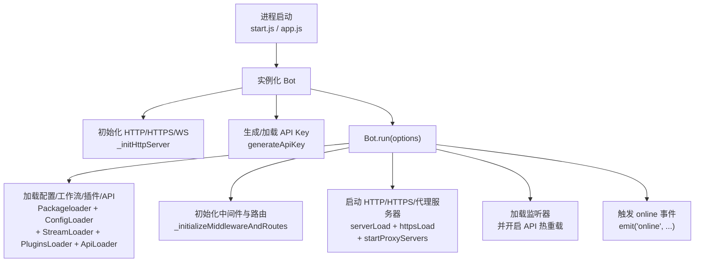

## Bot 主类文档（src/bot.js）

`Bot` 是 XRK-AGT 的核心运行时对象，负责 **HTTP/HTTPS/WebSocket 服务、反向代理、API 装载、插件与工作流集成、事件派发与资源清理** 等。

---

## 角色与职责

**高层职责分区：**

| 职责块 | 说明 |
|--------|------|
| **服务入口** | 创建 Express 应用与 HTTP/HTTPS 服务器；暴露静态目录 `www/`，处理 `favicon.ico`、`robots.txt` 等基础请求；统一配置 CORS、安全头、压缩、速率限制、请求日志等中间件 |
| **API 与 WebSocket** | 通过 `ApiLoader` 动态加载 `core/http` 下的 API 模块并注册到 `/api/*`；管理 `Bot.wss` 与 `Bot.wsf`，将不同路径的 WebSocket 升级请求分发给对应处理器 |
| **适配器与多 Bot 管理** | `this.adapter` 保存适配器实例（如 OneBotv11）；`this.bots` 按账号（`self_id`）保存底层 Bot；通过 `_createProxy()` 将 `Bot` 暴露为「多 Bot 聚合代理」 |
| **认证与安全** | 通过 `generateApiKey` 生成/加载 API 密钥；`_authMiddleware` 实现白名单、本地连接、同源 Cookie 与 API-Key 多级认证；`_setupStaticServing` 和 `_staticSecurityMiddleware` 负责静态资源访问安全 |
| **事件与数据流** | 继承 `EventEmitter`，统一事件入口为 `Bot.em(name, data)`；为消息事件注入 `friend` / `group` / `member` 对象，提供统一的发送、撤回、合并转发等能力 |
| **运维与资源管理** | `getServerUrl` / `getLocalIpAddress` 用于展示访问地址；`_startTrashCleaner` / `_clearTrashOnce` 定期清理 `trash/` 目录中的临时文件；`closeServer` 优雅关闭 HTTP/HTTPS/代理与 Redis |

---

## 生命周期与启动流程

1. **实例化**
   - `constructor()` 中：
     - 初始化 Express、HTTP 服务器、WebSocketServer、反向代理状态等。
     - 立即调用 `_initHttpServer()`、`_setupSignalHandlers()` 与 `generateApiKey()`。
     - 返回 `_createProxy()` 生成的代理对象，使 `Bot` 既是类实例又是多 Bot 访问入口。

2. **运行入口：`run(options)`**
   - 设置实际端口 `actualPort` / `actualHttpsPort` 与对外端口 `httpPort` / `httpsPort`。
   - 根据配置决定是否启用反向代理，并在启用时：
     - `_initProxyApp()` 构建专用代理 Express 应用。
     - `_loadDomainCertificates()` 与 `_createHttpsProxyServer()` 支持多域名 + HTTP/2。
   - 加载基础模块：
     - `Packageloader()`：基础运行环境与配置加载。
     - `ConfigLoader.load()`：通用配置。
     - `StreamLoader.load()`：AI 工作流。
     - `PluginsLoader.load()`：插件系统。
     - `ApiLoader.load()`：HTTP API。
   - 调用 `_initializeMiddlewareAndRoutes()` 配置中间件与系统路由。
   - `ApiLoader.register(this.express, this)` 注册 API 与 WebSocket。
   - `_setupFinalHandlers()` 配置全局 404 与错误处理。
   - `serverLoad(false)` 启动 HTTP，若开启 HTTPS 则调用 `httpsLoad()`。
   - 若开启代理，调用 `startProxyServers()` 并通过 `_displayProxyInfo()` 打印可访问域名。
   - `ListenerLoader.load(this)` 加载事件监听。
   - `ApiLoader.watch(true)` 启用 API 文件热重载。
   - `_startTrashCleaner()` 启动 trash 目录清理任务。
   - 最终通过 `this.emit("online", {...})` 广播在线事件。

3. **关闭流程：`closeServer()`**
   - 由信号处理器 `_setupSignalHandlers()` 捕获 `SIGINT` / `SIGTERM` 触发。
   - 关闭 HTTP/HTTPS/代理服务器。
   - 停止 trash 清理定时器。
   - 调用 `redisExit()`，保存并关闭 Redis。

---

## 关键方法概览

- **网络与中间件**
  - `_initializeMiddlewareAndRoutes()`：配置所有全局中间件与系统路由。
  - `_setupCors()`：按配置处理 CORS 与预检请求。
  - `_setupRequestLogging()`：请求日志与请求 ID 跟踪。
  - `_setupRateLimiting()`：全局与 `/api` 限流。
  - `_setupBodyParsers()`：JSON/URL-Encoded/Raw 请求体解析。
  - `_setupStaticServing()` / `_directoryIndexMiddleware()` / `_setStaticHeaders()`：静态资源服务。

- **认证与安全**
  - `generateApiKey()`：生成 / 加载 API 密钥并写入配置文件。
  - `_authMiddleware()`：白名单、本地、Cookie、API-Key 多重认证。
  - `_checkApiAuthorization(req)`：对单个请求进行 API-Key 验证。
  - `_staticSecurityMiddleware()`：阻止目录穿越与隐藏文件访问。

- **反向代理**
  - `_initProxyApp()`：基于 Express 创建代理服务器，支持按域名分发与路径重写。
  - `_loadDomainCertificates()`：加载多域名 SSL 证书并构建 SNI 上下文。
  - `_createHttpsProxyServer()`：可选启用 HTTP/2 的 HTTPS 代理服务。
  - `_createProxyMiddleware(domainConfig)`：为单个域构建 `http-proxy-middleware`。
  - `_findDomainConfig(hostname)` / `_findWildcardContext(servername)`：精确与通配符域名匹配。

- **WebSocket**
  - `wsConnect(req, socket, head)`：统一处理 WebSocket 升级请求，走与 HTTP 相同的认证逻辑，并通过 `Bot.wsf[path]` 分发到具体处理器。

- **事件与对象封装**
  - `prepareEvent(data)`：根据 `self_id/user_id/group_id` 等字段补充 `bot/friend/group/member` 对象。
  - `_extendEventMethods(data)`：为 `friend/group/member` 添加 `sendFile/makeForwardMsg/sendForwardMsg/getInfo` 等通用方法。
  - `em(name, data)`：如 `message.group.normal` 这类事件支持逐级截断向上派发。

- **好友与群管理**
  - `getFriendArray/getFriendList/getFriendMap` 与对应 `fl` getter：跨多 Bot 聚合好友信息。
  - `getGroupArray/getGroupList/getGroupMap` 与对应 `gl/gml` getter：聚合群与成员信息。
  - `pickFriend/pickGroup/pickMember`：在多 Bot 情况下自动选择合适的底层 Bot 实例。
  - `sendFriendMsg/sendGroupMsg/sendMasterMsg`：跨 Bot 消息发送工具方法。

- **其他**
  - `getServerUrl()`：结合反向代理 / HTTPS / 端口生成最终访问 URL。
  - `getLocalIpAddress()` / `_getPublicIP()`：用于启动时输出可访问地址。
  - `_startTrashCleaner()` / `_clearTrashOnce()`：定时清理临时文件。

---

## 与其它核心对象的关系

- **适配器层**
  - `AdapterLoader.load(Bot)` 通过 `paths.coreAdapter` 扫描 `core/adapter`，适配器文件内部会向 `Bot.adapter` 与 `Bot.wsf` 注册自身。
  - 适配器（如 `OneBotv11`）在建立连接时会在 `Bot[self_id]` 下挂接底层 Bot 对象，并通过 `Bot.em` 派发事件。

- **插件层**
  - 插件系统入口在 `src/infrastructure/plugins/loader.js`，但其事件源与回复能力均依赖 `Bot`：
    - `PluginsLoader.deal(e)` 会调用 `Bot.prepareEvent(e)` 以构造统一的 `friend/group/member` 接口。
    - 插件基类 `plugin` 中 `this.reply` 最终也会调用 `e.reply`，而 `e.reply` 基于底层 Bot 与适配器。

- **HTTP/API 层**
  - `ApiLoader.register(this.express, this)` 会为每个 `HttpApi` 实例注入 `Bot` 引用，使 API 能访问：
    - 适配器提供的底层能力（如群发消息、获取用户信息等）。
    - 插件系统状态与配置。

- **工作流与 AI 层**
  - `StreamLoader.load()` 会加载基于 `AIStream` 的工作流实例，插件可以通过 `this.getStream(name)` 调用 AI 能力。
  - Bot 本身不直接依赖 AI，但提供了统一的环境（配置 / Redis / 日志）供 `AIStream` 使用。

---

## 开发与扩展建议

- **想新增服务能力（例如新的 API / 调试页面）：**
  - 优先考虑在 `core/http/` 中写一个 `HttpApi` 模块，通过 `ApiLoader` 自动加载。
  - 使用 `req.bot` 访问 `Bot` 实例，避免在模块中直接 `import Bot`。

- **想拓展消息入口（例如接入新的 IM 平台）：**
  - 参考 `core/adapter/OneBotv11.js` 编写新适配器，并通过 `AdapterLoader` 自动加载。
  - 保持统一的事件结构（`post_type/message_type/notice_type` 等），确保可以被插件系统复用。

- **想修改安全策略（CORS、认证、静态资源策略等）：**
  - 优先修改 `config/default_config/server.yaml` 等配置文件，而不是直接改 `src/bot.js` 逻辑。
  - 若必须修改逻辑，优先在 `_initializeMiddlewareAndRoutes` 中追加中间件，而非散落在多处。

