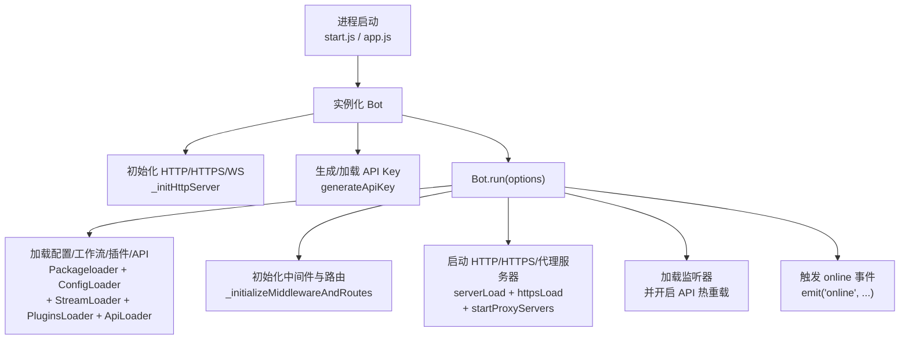

## Bot 主类文档（src/bot.js）

`Bot` 是 XRK-AGT 的核心运行时对象，负责 **HTTP/HTTPS/WebSocket 服务、反向代理、API 装载、插件与工作流集成、事件派发与资源清理** 等。

---

## 角色与职责

**高层职责分区：**

| 职责块 | 说明 |
|--------|------|
| **服务入口** | 创建 Express 应用与 HTTP/HTTPS 服务器；暴露静态目录 `www/`，处理 `favicon.ico`、`robots.txt` 等基础请求；统一配置 CORS、安全头、压缩、速率限制、请求日志等中间件 |
| **API 与 WebSocket** | 通过 `ApiLoader` 动态加载 `core/http` 下的 API 模块并注册到 `/api/*`；管理 `Bot.wss` 与 `Bot.wsf`，将不同路径的 WebSocket 升级请求分发给对应处理器 |
| **适配器与多 Bot 管理** | `this.adapter` 保存适配器实例（如 OneBotv11、ComWeChat、GSUIDCore、OPQBot、stdin、device 等）；`this.bots` 按账号或设备 ID（`self_id` / `device_id`）保存子 Bot；通过 `_createProxy()` 将 `Bot` 暴露为「多 Bot 聚合代理」并统一暴露 `BotUtil` 的静态方法 |
| **认证与安全** | 通过 `generateApiKey` 生成/加载 API 密钥；`_authMiddleware` 实现白名单、本地连接、同源 Cookie 与 API-Key 多级认证；`_setupStaticServing` 和 `_staticSecurityMiddleware` 负责静态资源访问安全 |
| **事件与数据流** | 继承 `EventEmitter`，统一事件入口为 `Bot.em(name, data)`；为消息事件注入 `friend` / `group` / `member` 对象，提供统一的发送、撤回、合并转发等能力 |
| **运维与资源管理** | `getServerUrl` / `getLocalIpAddress` 用于展示访问地址；`_startTrashCleaner` / `_clearTrashOnce` 定期清理 `trash/` 目录中的临时文件；`closeServer` 优雅关闭 HTTP/HTTPS/代理与 Redis |

---

## 生命周期与启动流程

1. **实例化**
   - `constructor()` 中：
     - 初始化 Express、HTTP 服务器、WebSocketServer、反向代理状态等。
     - 立即调用 `_initHttpServer()`、`_setupSignalHandlers()` 与 `generateApiKey()`。
     - 返回 `_createProxy()` 生成的代理对象，使 `Bot` 既是类实例又是多 Bot 访问入口。

2. **运行入口：`run(options)`**
   - 设置实际端口 `actualPort` / `actualHttpsPort` 与对外端口 `httpPort` / `httpsPort`。
   - 根据配置决定是否启用反向代理，并在启用时：
     - `_initProxyApp()` 构建专用代理 Express 应用。
     - `_loadDomainCertificates()` 与 `_createHttpsProxyServer()` 支持多域名 + HTTP/2。
   - 加载基础模块：
     - `Packageloader()`：基础运行环境与配置加载。
     - `ConfigLoader.load()`：通用配置。
     - `StreamLoader.load()`：AI 工作流。
     - `PluginsLoader.load()`：插件系统。
     - `ApiLoader.load()`：HTTP API。
   - 调用 `_initializeMiddlewareAndRoutes()` 配置中间件与系统路由。
   - `ApiLoader.register(this.express, this)` 注册 API 与 WebSocket。
   - `_setupFinalHandlers()` 配置全局 404 与错误处理。
   - `serverLoad(false)` 启动 HTTP，若开启 HTTPS 则调用 `httpsLoad()`。
   - 若开启代理，调用 `startProxyServers()` 并通过 `_displayProxyInfo()` 打印可访问域名。
   - `ListenerLoader.load(this)` 加载事件监听。
   - `ApiLoader.watch(true)` 启用 API 文件热重载。
   - `_startTrashCleaner()` 启动 trash 目录清理任务。
   - 最终通过 `this.emit("online", {...})` 广播在线事件。

3. **关闭流程：`closeServer()`**
   - 由信号处理器 `_setupSignalHandlers()` 捕获 `SIGINT` / `SIGTERM` 触发。
   - 关闭 HTTP/HTTPS/代理服务器。
   - 停止 trash 清理定时器。
   - 调用 `redisExit()`，保存并关闭 Redis。

---

## 关键方法概览

- **网络与中间件**
  - `_initializeMiddlewareAndRoutes()`：配置所有全局中间件与系统路由。
  - `_setupCors()`：按配置处理 CORS 与预检请求。
  - `_setupRequestLogging()`：请求日志与请求 ID 跟踪。
  - `_setupRateLimiting()`：全局与 `/api` 限流。
  - `_setupBodyParsers()`：JSON/URL-Encoded/Raw 请求体解析。
  - `_setupStaticServing()` / `_directoryIndexMiddleware()` / `_setStaticHeaders()`：静态资源服务。

- **认证与安全**
  - `generateApiKey()`：生成 / 加载 API 密钥并写入配置文件。
  - `_authMiddleware()`：白名单、本地、Cookie、API-Key 多重认证。
  - `_checkApiAuthorization(req)`：对单个请求进行 API-Key 验证。
  - `_staticSecurityMiddleware()`：阻止目录穿越与隐藏文件访问。

- **反向代理**
  - `_initProxyApp()`：基于 Express 创建代理服务器，支持按域名分发与路径重写。
  - `_loadDomainCertificates()`：加载多域名 SSL 证书并构建 SNI 上下文。
  - `_createHttpsProxyServer()`：可选启用 HTTP/2 的 HTTPS 代理服务。
  - `_createProxyMiddleware(domainConfig)`：为单个域构建 `http-proxy-middleware`。
  - `_findDomainConfig(hostname)` / `_findWildcardContext(servername)`：精确与通配符域名匹配。

- **WebSocket**
  - `wsConnect(req, socket, head)`：统一处理 WebSocket 升级请求，走与 HTTP 相同的认证逻辑，并通过 `Bot.wsf[path]` 分发到具体处理器。

- **事件与对象封装**
  - `prepareEvent(data)`：只处理所有适配器通用的基础属性（`bot`、`adapter_id`、`adapter_name`、基础`sender`等）。适配器特定的对象（`friend`、`group`、`member`）由对应的增强插件通过`accept`方法处理。
  - `_extendEventMethods(data)`：为事件对象添加通用的辅助方法（如通用`reply`方法）。适配器特定的方法扩展由增强插件处理。
  - `em(name, data)`：如 `message.group.normal` 这类事件支持逐级截断向上派发。

> 说明：传统的好友/群管理能力由各个 IM 适配器（如 OneBotv11）在其子 Bot（`Bot[self_id]`）上实现；`Bot` 本身只提供事件准备与工具方法，不再直接维护 IM 账号细节。

- **其他**
  - `getServerUrl()`：结合反向代理 / HTTPS / 端口生成最终访问 URL。
  - `getLocalIpAddress()` / `_getPublicIP()`：用于启动时输出可访问地址。
  - `_startTrashCleaner()` / `_clearTrashOnce()`：定时清理临时文件。

---

## 与其它核心对象的关系

### 适配器层（Adapter / 子 Bot）

- `AdapterLoader.load(Bot)` 通过 `paths.coreAdapter` 扫描 `core/adapter`，适配器文件内部通常会：
  - 将自身实例 `push` 到 `Bot.adapter`，用于后续初始化与枚举。
  - 向 `Bot.wsf[path]` 注册 WebSocket 消息处理器。
  - 在连接建立时创建子 Bot 对象并通过 `Bot[self_id] = childBot` 注册到底层（由 `_createProxy()` 负责放入 `Bot.bots` 容器）。
- 特殊适配器：
  - **stdin**：`core/adapter/stdin.js` 中通过 `StdinHandler` 创建 `Bot.stdin` 子 Bot，`adapter.id === 'stdin'`，用于命令行与 HTTP 层 `callStdin/runCommand` 的统一入口。
  - **device**：`core/http/device.js` 中的 `DeviceManager` 将物理/虚拟设备挂载为 `Bot[device_id]` 子 Bot，`adapter.id === 'device'`，提供 `sendCommand/display/emotion/camera/microphone` 等方法。

> 所有子 Bot（包括 IM 账号、设备、stdin）都集中保存在 `Bot.bots` 中，主实例通过 Proxy 暴露聚合视图，同时保持自身属性相对干净。

### 事件监听器与插件层（Events ↔ Plugins）

- **事件入口**：
  - 适配器与业务模块通过 `Bot.em(eventName, data)` 触发事件（如 `onebot.message.group.normal`、`device.online`、`stdin.message`）。
  - `Bot.em` 会调用 `prepareEvent(data)` 与 `_extendEventMethods(data)`，只处理通用字段（如 `bot/adapter_id/adapter_name/sender/reply`）。
- **事件监听器（core/events/*.js）**：
  - 继承自 `EventListenerBase`，负责：
    - 为特定适配器命名空间去重：`onebot.*`、`device.*`、`stdin.*`。
    - 补全适配器级的基础字段（但不挂载 `friend/group/member` 等对象）。
    - 在通过去重检查后，统一调用 `PluginsLoader.deal(e)` 进入插件系统。
- **插件系统（PluginsLoader + plugin 基类）**：
  - `PluginsLoader.deal(e)` 会：
    - 标准化事件（`initEvent/normalizeEventPayload/dealMsg`）。
    - 调用各适配器增强插件的 `accept(e)`，挂载 `friend/group/member/atBot/isPrivate/isGroup` 等适配器特定属性。
    - 按规则与优先级执行业务插件的 `rule`。
  - 插件开发者只需关心 `event` 名称与事件对象 `e`，无需直接操作 `Bot.em`。

> 简单理解：**适配器/业务模块只负责产生「原始事件」+ 最小字段；监听器负责「命名空间 + 去重」；插件系统负责「增强 + 业务处理」。三层之间通过 `Bot.em` 和统一的事件对象解耦。**

### HTTP/API 层（ApiLoader ↔ HttpApi ↔ Bot）

- `ApiLoader.load()` 动态加载 `core/http` 下的所有 API 模块，并按优先级排序。
- `Bot.run()` 中调用 `ApiLoader.register(this.express, this)` 完成 HTTP 与 WebSocket 注册：
  - 为所有请求注入 `req.bot = bot`、`req.apiLoader = ApiLoader`。
  - 为每个 `HttpApi` 调用 `api.init(app, bot)` 注册路由与 WS 处理器。
- **API 如何与事件系统/插件交互：**
  - 在 `handler(req, res, Bot)` 内可以：
    - 直接访问 `Bot` 与其子 Bot 能力（如 `Bot[self_id].pickFriend().sendMsg()`）。
    - 通过 `Bot.em('stdin.message', e)` 或调用 `bot.callStdin/runCommand` 把 HTTP 请求包装成 stdin 事件，让业务逻辑复用同一套插件体系。
    - 通过 `Bot.em('device.command', ...)` 与设备事件打通。

> 建议：HTTP 层尽量只做「参数解析 + 调用 `Bot` 能力或触发事件 + 返回结构化响应」，具体业务流转交给插件与工作流实现，避免 HTTP 模块里堆积业务逻辑。

### 配置与 CommonConfig（cfg ↔ ConfigLoader ↔ ConfigBase）

- `src/infrastructure/config/config.js` 暴露的 `cfg` 是对 `config/default_config/*.yaml` 的聚合视图，并在 `Bot.run()` 期间初始化为 `global.cfg`。
- `src/infrastructure/commonconfig/loader.js` 会加载 `core/commonconfig` 下所有 `ConfigBase` 子类：
  - 每个子类描述一个配置域（如 `server`、`device` 等），提供结构化 schema 与读写 API。
  - HTTP 层通过 `core/http/config.js` 对外暴露 `/api/config/*` 接口，实现可视化配置编辑。
- **Bot 与配置的关系：**
  - `Bot` 在构造和运行时大量读取 `cfg`（如端口、HTTPS/代理配置、安全策略、日志级别），但不直接管理配置文件。
  - 配置修改通过 `ConfigBase` + HTTP API 完成，`Bot` 只消费这些配置。

### Redis 与运行时状态（redis ↔ PluginsLoader ↔ Bot）

- `src/infrastructure/redis.js` 提供 Redis 客户端初始化逻辑，并在成功连接后设置 `global.redis`：
  - 插件与业务模块通过全局 `redis` 访问计数、关机状态、上下文等数据。
- `Bot.redisExit()` 在关闭流程中负责持久化与关闭 Redis 进程（兼容旧版行为）。
- **典型用法：**
  - `PluginsLoader` 使用 Redis 记录统计与关机标志（如 `Yz:shutdown:${botUin}`），`preCheck` 中会参考该状态决定是否继续处理消息。
  - 插件可以自定义使用 Redis 维护长生命周期数据。

### 渲染器（Renderer ↔ Bot ↔ 插件）

- `src/infrastructure/renderer/loader.js` 会根据配置 `cfg.renderer` 创建实际渲染器实例（Puppeteer/Playwright 等），并挂载到 `Bot.renderer`。
- 插件通过 `Bot.renderer.xxx` 调用渲染器生成图片/HTML/PDF，再利用 `e.reply` 发送到各适配器。

> 注意：渲染器本身与事件系统解耦，只作为一个「工具服务」挂到 `Bot` 下面，供插件业务层按需使用。

---

## 开发与扩展建议

- **想新增服务能力（例如新的 API / 调试页面）：**
  - 优先考虑在 `core/http/` 中写一个 `HttpApi` 模块，通过 `ApiLoader` 自动加载。
  - 使用 `req.bot` 访问 `Bot` 实例，避免在模块中直接 `import Bot`。

- **想拓展消息入口（例如接入新的 IM 平台）：**
  - 参考 `core/adapter/OneBotv11.js` 编写新适配器，并通过 `AdapterLoader` 自动加载。
  - 保持统一的事件结构（`post_type/message_type/notice_type` 等），确保可以被插件系统复用。

- **想修改安全策略（CORS、认证、静态资源策略等）：**
  - 优先修改 `config/default_config/server.yaml` 等配置文件，而不是直接改 `src/bot.js` 逻辑。
  - 若必须修改逻辑，优先在 `_initializeMiddlewareAndRoutes` 中追加中间件，而非散落在多处。

