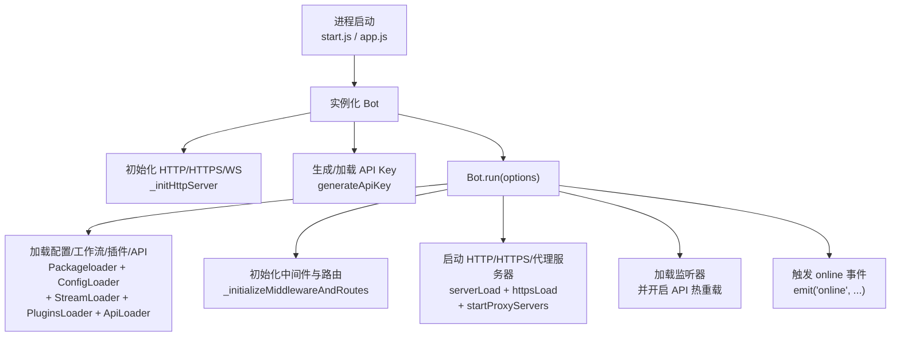
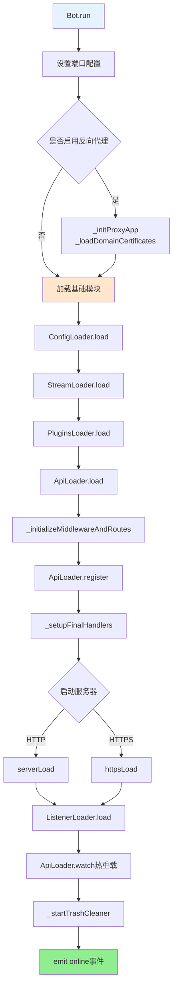
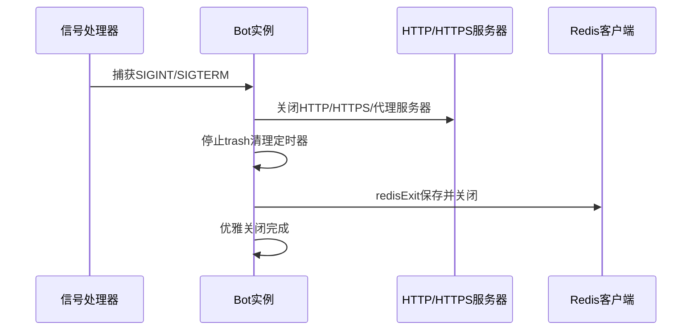
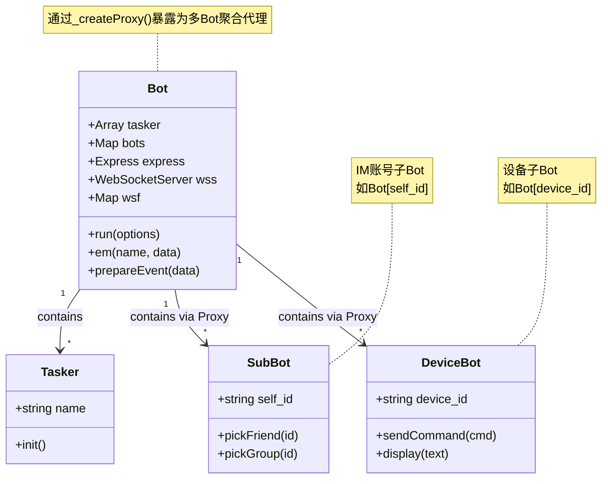
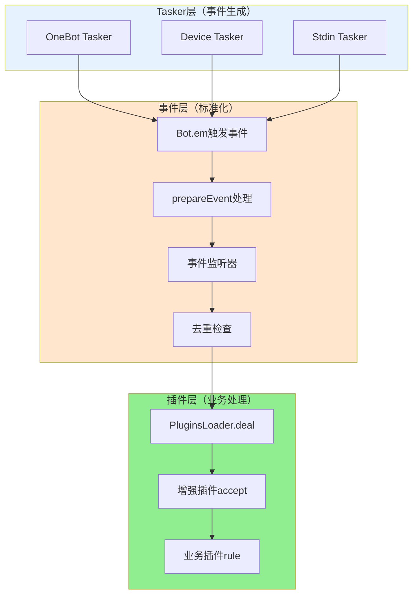
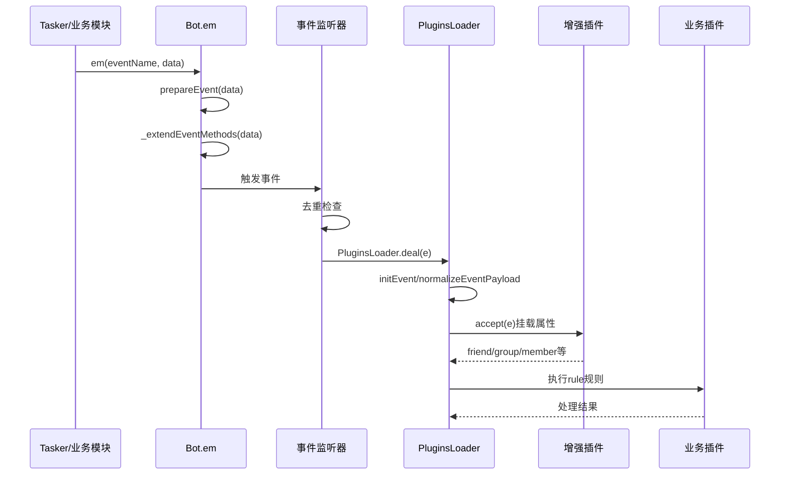

## Bot 主类文档（src/bot.js）

`Bot` 是 XRK-AGT 的核心运行时对象，负责 **HTTP/HTTPS/WebSocket 服务、反向代理、API 装载、插件与工作流集成、事件派发与资源清理** 等。

---

## 角色与职责



**高层职责分区：**

| 职责块 | 说明 |
|--------|------|
| **服务入口** | 创建 Express 应用与 HTTP/HTTPS 服务器；暴露静态目录 `www/`，处理 `favicon.ico`、`robots.txt` 等基础请求；统一配置 CORS、安全头、压缩、速率限制、请求日志等中间件 |
| **API 与 WebSocket** | 通过 `ApiLoader` 动态加载 `core/http` 下的 API 模块并注册到 `/api/*`；管理 `Bot.wss` 与 `Bot.wsf`，将不同路径的 WebSocket 升级请求分发给对应处理器 |
| **Tasker（任务层）与多 Bot 管理** | `this.tasker` 保存真实网络 Tasker 实例（事件/任务生成器，如 OneBotv11、ComWeChat、GSUIDCore、OPQBot 等）；`this.bots` 按账号或设备 ID（`self_id` / `device_id`）保存子 Bot；通过 `_createProxy()` 将 `Bot` 暴露为「多 Bot 聚合代理」并统一暴露 `BotUtil` 的静态方法 |
| **认证与安全** | 通过 `generateApiKey` 生成/加载 API 密钥；`_authMiddleware` 实现白名单、本地连接、同源 Cookie 与 API-Key 多级认证；`_setupStaticServing` 和 `_staticSecurityMiddleware` 负责静态资源访问安全 |
| **事件与数据流** | 继承 `EventEmitter`，统一事件入口为 `Bot.em(name, data)`；为消息事件注入 `friend` / `group` / `member` 对象，提供统一的发送、撤回、合并转发等能力 |
| **运维与资源管理** | `getServerUrl` / `getLocalIpAddress` 用于展示访问地址；`_startTrashCleaner` / `_clearTrashOnce` 定期清理 `trash/` 目录中的临时文件；`closeServer` 优雅关闭 HTTP/HTTPS/代理与 Redis |

---

## 生命周期与启动流程

### 实例化阶段


### 运行流程：run(options)



### 关闭流程：closeServer()



---

## 关键方法概览

- **网络与中间件**
  - `_initializeMiddlewareAndRoutes()`：配置所有全局中间件与系统路由。
  - `_setupCors()`：按配置处理 CORS 与预检请求。
  - `_setupRequestLogging()`：请求日志与请求 ID 跟踪。
  - `_setupRateLimiting()`：全局与 `/api` 限流。
  - `_setupBodyParsers()`：JSON/URL-Encoded/Raw 请求体解析。
  - `_setupStaticServing()` / `_directoryIndexMiddleware()` / `_setStaticHeaders()`：静态资源服务。

- **认证与安全**
  - `generateApiKey()`：生成 / 加载 API 密钥并写入配置文件。
  - `_authMiddleware()`：白名单、本地、Cookie、API-Key 多重认证。
  - `_checkApiAuthorization(req)`：对单个请求进行 API-Key 验证。
  - `_staticSecurityMiddleware()`：阻止目录穿越与隐藏文件访问。

- **反向代理**
  - `_initProxyApp()`：基于 Express 创建代理服务器，支持按域名分发与路径重写。
  - `_loadDomainCertificates()`：加载多域名 SSL 证书并构建 SNI 上下文。
  - `_createHttpsProxyServer()`：可选启用 HTTP/2 的 HTTPS 代理服务。
  - `_createProxyMiddleware(domainConfig)`：为单个域构建 `http-proxy-middleware`。
  - `_findDomainConfig(hostname)` / `_findWildcardContext(servername)`：精确与通配符域名匹配。

- **WebSocket**
  - `wsConnect(req, socket, head)`：统一处理 WebSocket 升级请求，走与 HTTP 相同的认证逻辑，并通过 `Bot.wsf[path]` 分发到具体处理器。

- **事件与对象封装**
  - `prepareEvent(data)`：只处理所有 Tasker 通用的基础属性（`bot`、`tasker_id`、`tasker_name`、基础`sender`等）。Tasker 特定的对象（`friend`、`group`、`member`）由对应的增强插件通过`accept`方法处理。
  - `_extendEventMethods(data)`：为事件对象添加通用的辅助方法（如通用`reply`方法）。Tasker 特定的方法扩展由增强插件处理。
  - `em(name, data)`：如 `message.group.normal` 这类事件支持逐级截断向上派发。

> 说明：传统的好友/群管理能力由各个 IM Tasker（如 OneBotv11）在其子 Bot（`Bot[self_id]`）上实现；`Bot` 本身只提供事件准备与工具方法，不再直接维护 IM 账号细节。

- **其他**
  - `getServerUrl()`：结合反向代理 / HTTPS / 端口生成最终访问 URL。
  - `getLocalIpAddress()` / `_getPublicIP()`：用于启动时输出可访问地址。
  - `_startTrashCleaner()` / `_clearTrashOnce()`：定时清理临时文件。

---

## 与其它核心对象的关系

### Bot对象关系图



### Tasker 层（任务层 / 子 Bot）

**Tasker加载流程**:

```mermaid
flowchart TB
    A[TaskerLoader.load] --> B[扫描core/tasker目录]
    B --> C[加载Tasker文件]
    C --> D[Tasker.push到Bot.tasker]
    D --> E[注册WebSocket处理器到Bot.wsf]
    E --> F[连接建立时创建子Bot]
    F --> G[Bot[self_id] = childBot]
    G --> H[_createProxy放入Bot.bots]
    
    style A fill:#E6F3FF
    style D fill:#FFE6CC
    style H fill:#90EE90
```

**特殊子Bot**:
- **stdin**: `Bot.stdin` - 命令行与HTTP统一入口，不参与Tasker枚举
- **device**: `Bot[device_id]` - 设备控制，由DeviceManager管理

> 所有子Bot都保存在 `Bot.bots` 中，通过Proxy暴露聚合视图

### 事件监听器与插件层（Events ↔ Plugins）

**事件流处理架构**:



**事件处理流程**:



> **核心设计**：Tasker生成原始事件 → 监听器标准化去重 → 插件系统增强并处理业务逻辑

### HTTP/API 层（ApiLoader ↔ HttpApi ↔ Bot）

- `ApiLoader.load()` 动态加载 `core/http` 下的所有 API 模块，并按优先级排序。
- `Bot.run()` 中调用 `ApiLoader.register(this.express, this)` 完成 HTTP 与 WebSocket 注册：
  - 为所有请求注入 `req.bot = bot`、`req.apiLoader = ApiLoader`。
  - 为每个 `HttpApi` 调用 `api.init(app, bot)` 注册路由与 WS 处理器。
- **API 如何与事件系统/插件交互：**
  - 在 `handler(req, res, Bot)` 内可以：
    - 直接访问 `Bot` 与其子 Bot 能力（如 `Bot[self_id].pickFriend().sendMsg()`）。
    - 通过 `Bot.em('stdin.message', e)` 或调用 `bot.callStdin/runCommand` 把 HTTP 请求包装成 stdin 事件，让业务逻辑复用同一套插件体系。
    - 通过 `Bot.em('device.command', ...)` 与设备事件打通。

> 建议：HTTP 层尽量只做「参数解析 + 调用 `Bot` 能力或触发事件 + 返回结构化响应」，具体业务流转交给插件与工作流实现，避免 HTTP 模块里堆积业务逻辑。

### 配置与 CommonConfig（cfg ↔ ConfigLoader ↔ ConfigBase）

- `src/infrastructure/config/config.js` 暴露的 `cfg` 是对 `config/default_config/*.yaml` 的聚合视图，并在 `Bot.run()` 期间初始化为 `global.cfg`。
- `src/infrastructure/commonconfig/loader.js` 会加载 `core/commonconfig` 下所有 `ConfigBase` 子类：
  - 每个子类描述一个配置域（如 `server`、`device` 等），提供结构化 schema 与读写 API。
  - HTTP 层通过 `core/http/config.js` 对外暴露 `/api/config/*` 接口，实现可视化配置编辑。
- **Bot 与配置的关系：**
  - `Bot` 在构造和运行时大量读取 `cfg`（如端口、HTTPS/代理配置、安全策略、日志级别），但不直接管理配置文件。
  - 配置修改通过 `ConfigBase` + HTTP API 完成，`Bot` 只消费这些配置。

### Redis 与运行时状态（redis ↔ PluginsLoader ↔ Bot）

- `src/infrastructure/redis.js` 提供 Redis 客户端初始化逻辑，并在成功连接后设置 `global.redis`：
  - 插件与业务模块通过全局 `redis` 访问计数、关机状态、上下文等数据。
- `Bot.redisExit()` 在关闭流程中负责持久化与关闭 Redis 进程（兼容旧版行为）。
- **典型用法：**
  - `PluginsLoader` 使用 Redis 记录统计与关机标志（如 `Yz:shutdown:${botUin}`），`preCheck` 中会参考该状态决定是否继续处理消息。
  - 插件可以自定义使用 Redis 维护长生命周期数据。

### 渲染器（Renderer ↔ Bot ↔ 插件）

- `src/infrastructure/renderer/loader.js` 会根据配置 `cfg.renderer` 创建实际渲染器实例（Puppeteer/Playwright 等），并挂载到 `Bot.renderer`。
- 插件通过 `Bot.renderer.xxx` 调用渲染器生成图片/HTML/PDF，再利用 `e.reply` 发送到各Tasker。

> 注意：渲染器本身与事件系统解耦，只作为一个「工具服务」挂到 `Bot` 下面，供插件业务层按需使用。

---

## 开发与扩展建议

- **想新增服务能力（例如新的 API / 调试页面）：**
  - 优先考虑在 `core/http/` 中写一个 `HttpApi` 模块，通过 `ApiLoader` 自动加载。
  - 使用 `req.bot` 访问 `Bot` 实例，避免在模块中直接 `import Bot`。

- **想拓展消息入口（例如接入新的 IM 平台）：**
  - 参考 `core/tasker/OneBotv11.js` 编写新 Tasker，并通过 `TaskerLoader` 自动加载。
  - 保持统一的事件结构（`post_type/message_type/notice_type` 等），确保可以被插件系统复用。

- **想修改安全策略（CORS、认证、静态资源策略等）：**
  - 优先修改 `config/default_config/server.yaml` 等配置文件，而不是直接改 `src/bot.js` 逻辑。
  - 若必须修改逻辑，优先在 `_initializeMiddlewareAndRoutes` 中追加中间件，而非散落在多处。


