# Bot 主类文档

> **文件位置**: `src/bot.js`  
> **核心职责**: HTTP/HTTPS/WebSocket 服务、反向代理、HTTP业务层、API 装载、插件与工作流集成、事件派发与资源清理

---

## 📋 目录

- [快速开始](#快速开始)
- [核心职责](#核心职责)
- [生命周期](#生命周期)
- [核心 API](#核心-api)
- [事件系统](#事件系统)
- [多 Bot 管理](#多-bot-管理)
- [HTTP 服务](#http-服务)
- [WebSocket 服务](#websocket-服务)
- [反向代理](#反向代理)
- [实用工具方法](#实用工具方法)
- [最佳实践](#最佳实践)
- [常见问题](#常见问题)

---

## 快速开始

### 基本使用

```javascript
import Bot from './src/bot.js';

// 创建Bot实例
const bot = new Bot();

// 启动服务
await bot.run({ port: 端口号 });  // 端口号由开发者指定

// 监听启动事件
bot.on('online', ({ url, apis }) => {
  console.log(`服务器已启动: ${url}`);
  console.log(`已加载 ${apis.length} 个API模块`);
});

// 触发事件
bot.em('message.group.normal', {
  self_id: '123456',
  user_id: '789012',
  group_id: '345678',
  message: 'Hello World'
});

// 优雅关闭
process.on('SIGINT', async () => {
  await bot.closeServer();
  process.exit(0);
});
```

### 在 HTTP API 中使用

```javascript
// core/my-core/http/myapi.js
export default {
  name: 'my-api',
  routes: [
    {
      method: 'GET',
      path: '/api/test',
      handler: async (req, res) => {
        const bot = req.bot;
        const url = bot.getServerUrl();
        const result = await bot.callRoute('/api/status');
        res.json({ success: true, url, status: result });
      }
    }
  ]
};
```

---

## 核心职责

`Bot` 类是 XRK-AGT 的核心运行时对象，统一管理以下功能：

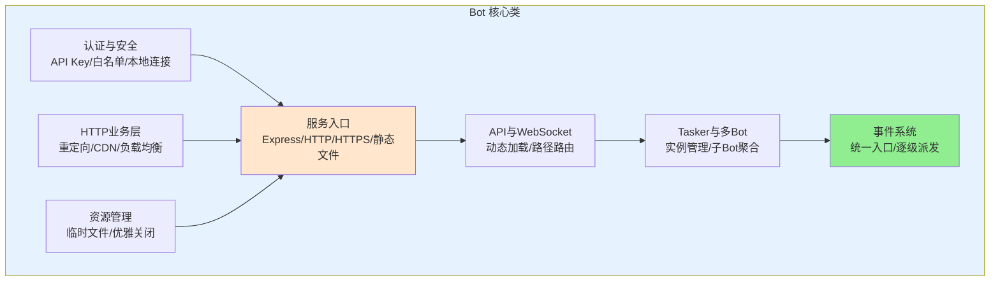

| 职责模块 | 说明 |
|---------|------|
| **服务入口** | Express 应用、HTTP/HTTPS 服务器、静态文件服务、基础中间件 |
| **API 与 WebSocket** | 动态加载所有 `core/*/http` 目录下的 API 模块，管理 WebSocket 连接与路径路由 |
| **Tasker 与多 Bot** | 管理 Tasker 实例，按账号/设备 ID 管理子 Bot |
| **认证与安全** | API Key 生成/验证、白名单、本地连接、同源 Cookie 认证 |
| **事件系统** | 统一事件入口 `Bot.em()`，事件准备与增强，逐级事件派发 |
| **HTTP业务层** | 重定向管理、CDN 支持、反向代理增强（负载均衡、健康检查） |
| **资源管理** | 临时文件清理、优雅关闭、Redis 持久化 |

---

## 生命周期

### 启动流程

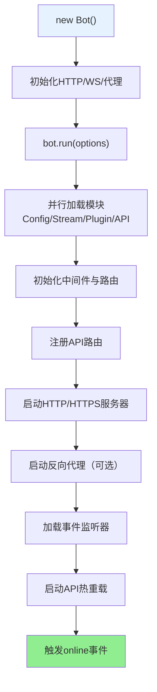

### 关闭流程

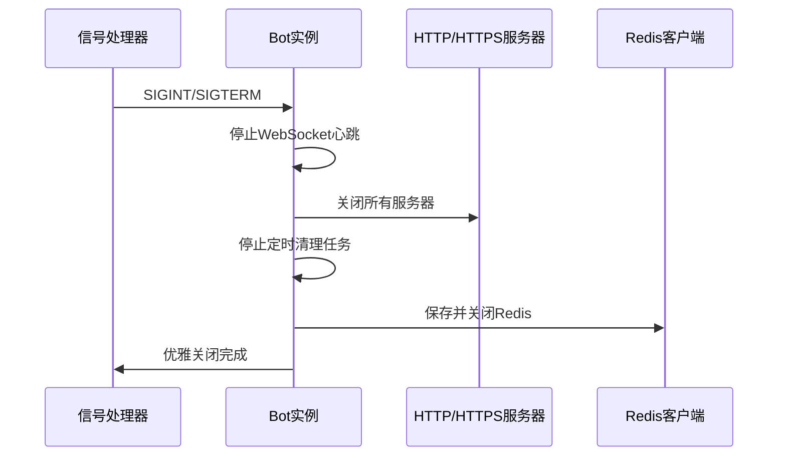

---

## 核心 API

### 事件系统

#### `em(name, data, asJson, options)`

触发事件，支持逐级派发。

```javascript
// 基本用法
bot.em('message.group.normal', {
  self_id: '123456',
  user_id: '789012',
  group_id: '345678',
  message: 'Hello'
});

// 等待stdin输出（asJson模式）
const result = await bot.em('stdin.message', {
  message: 'help'
}, true, { timeout: 5000 });
```

#### `prepareEvent(data)`

准备事件对象，自动添加通用属性：`bot`、`tasker_id`、`tasker_name`、`sender`、`reply()` 等。

### 服务器管理

#### `run(options)` / `closeServer()` / `getServerUrl()` / `getLocalIpAddress()`

```javascript
await bot.run({ port: 端口号 });  // 端口号由开发者指定
await bot.closeServer();
const url = bot.getServerUrl();
const ipInfo = await bot.getLocalIpAddress();
```

### 路由调用

#### `callRoute(routePath, options)`

内部调用已注册的 HTTP 路由，无需发起 HTTP 请求。

```javascript
const result = await bot.callRoute('/api/status', {
  method: 'GET',
  query: { format: 'json' },
  timeout: 5000
});
```

#### `getRouteList(options)`

获取已注册的路由列表（支持扁平/分组）。

### stdin 命令

#### `callStdin(command, options)` / `runCommand(command, options)`

通过 stdin 执行命令，`runCommand` 是 `callStdin` 的别名。

---

## 事件系统

### 事件逐级派发机制

Bot 支持**逐级事件派发**，事件名从具体到抽象依次触发：

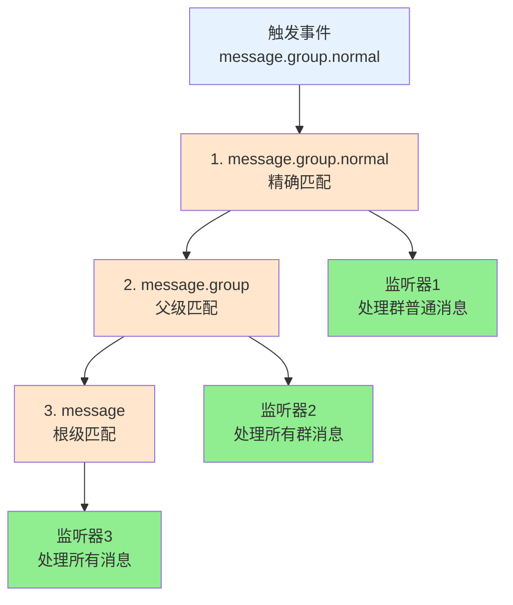

**示例**：

```javascript
// 监听精确事件
bot.on('message.group.normal', (e) => {
  console.log('收到群消息');
});

// 监听所有群消息
bot.on('message.group', (e) => {
  console.log('群消息（包括所有子类型）');
});

// 监听所有消息
bot.on('message', (e) => {
  console.log('任何类型的消息');
});
```

### 事件处理流程

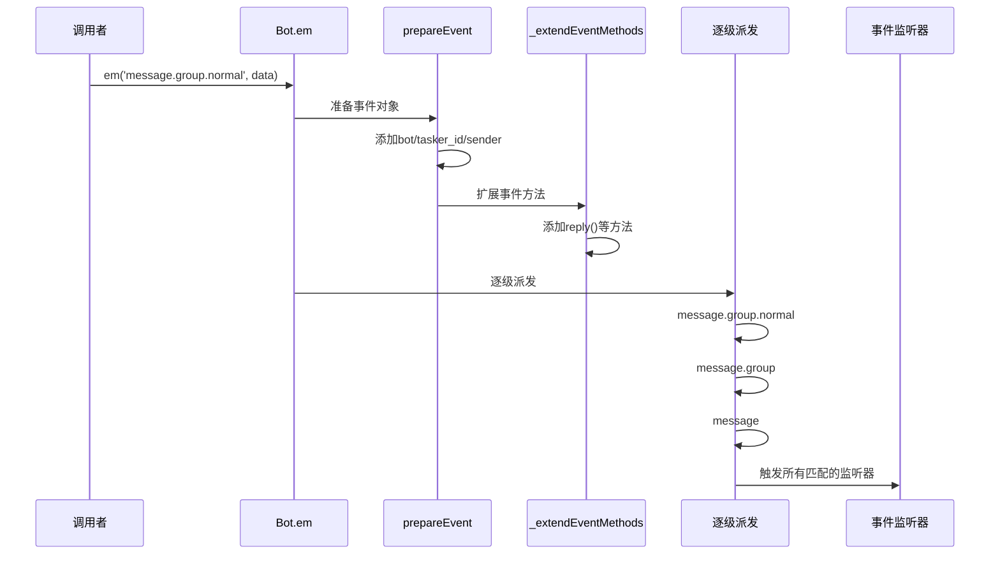

### 事件对象结构

```javascript
{
  // 基础属性（prepareEvent添加）
  bot: SubBot,              // 对应的子Bot实例
  tasker_id: 'onebotv11',   // Tasker ID
  tasker_name: 'OneBotv11', // Tasker 名称
  sender: { user_id: '...' }, // 基础发送者信息
  
  // 事件数据
  self_id: '123456',
  user_id: '789012',
  group_id: '345678',
  message: 'Hello',
  
  // 扩展方法（_extendEventMethods添加）
  reply: async (msg, quote, extraData) => {...},
  getRoutes: (options) => {...}
  
  // Tasker特定属性（由增强插件添加）
  // friend: Friend对象（OneBotv11）
  // group: Group对象（OneBotv11）
  // member: Member对象（OneBotv11）
}
```

---

## 多 Bot 管理

### Bot 聚合代理架构

Bot 通过 `_createProxy()` 暴露为**多 Bot 聚合代理**，统一访问子 Bot、BotUtil 静态方法和 Bot 自身属性：

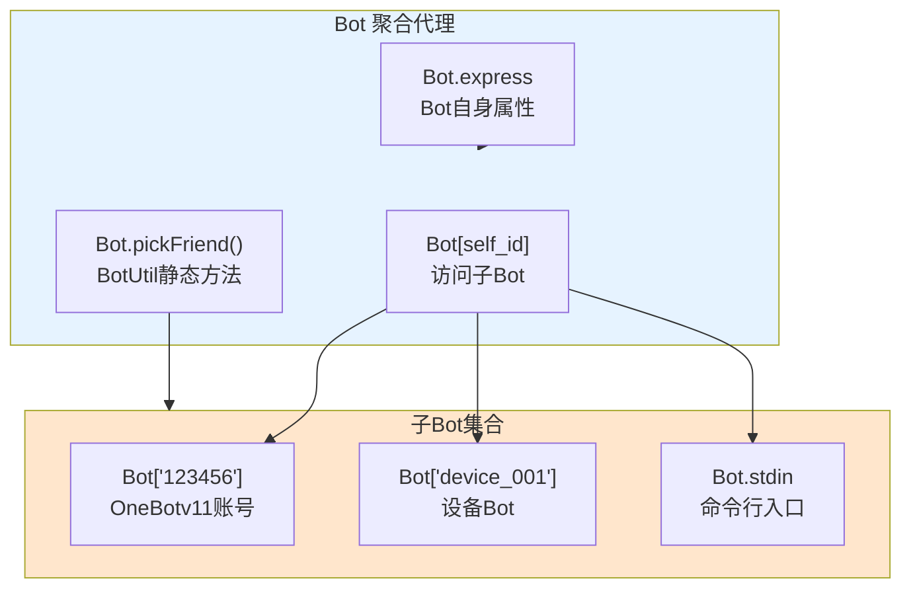

**使用示例**：

```javascript
// 访问子Bot（IM账号）
const subBot = Bot['123456'];
await subBot.pickFriend('789012').sendMsg('Hello');

// 访问设备Bot
const deviceBot = Bot['device_001'];
await deviceBot.sendCommand('reboot');

// 访问BotUtil静态方法
const friend = Bot.pickFriend('123456', '789012');
await friend.sendMsg('Hello');

// 访问Bot自身
Bot.express.get('/custom', (req, res) => {
  res.json({ message: 'Custom route' });
});
```

### Tasker 与子 Bot 关系

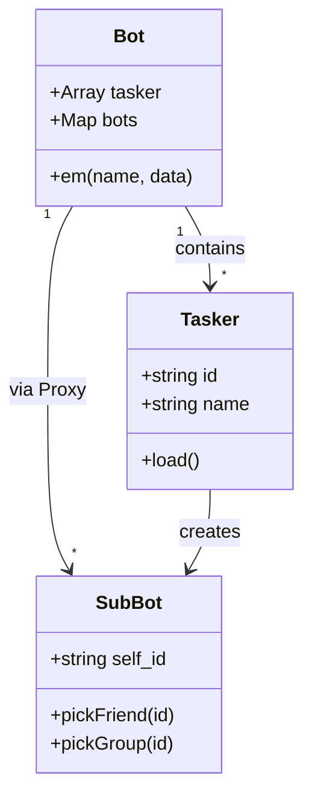

**特殊子 Bot**：
- `Bot.stdin`：命令行与 HTTP 统一入口
- `Bot[device_id]`：设备控制 Bot

---

## HTTP 服务

### 请求处理流程

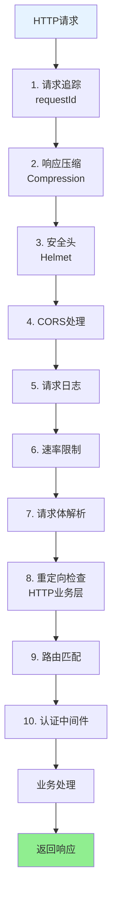

### 路由优先级

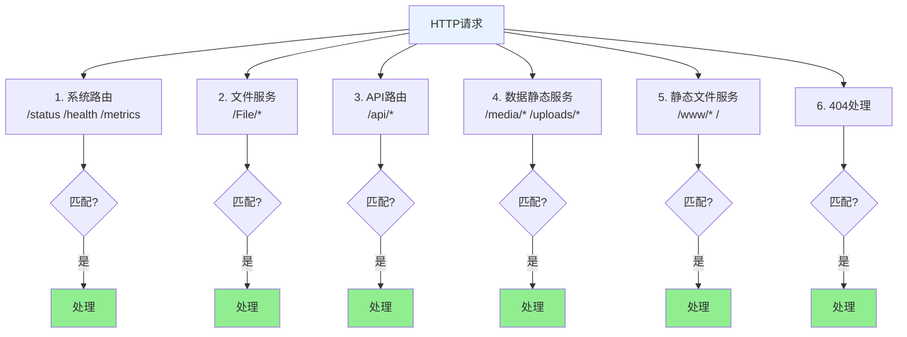

### 认证机制

Bot 支持多级认证，按优先级依次检查：

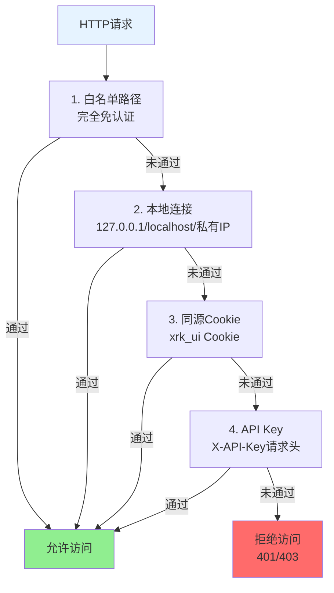

**配置示例**：

```yaml
# config/default_config/server.yaml
auth:
  apiKey:
    enabled: true
    file: "config/server_config/api_key.json"
  whitelist:
    - "/"
    - "/health"
    - "/status"
    - "/xrk"
```

---

## WebSocket 服务

### WebSocket 连接流程

```mermaid
sequenceDiagram
    participant Client as WebSocket客户端
    participant Bot as Bot.wsConnect
    participant Auth as 认证检查
    participant Handler as 路径处理器
    
    Client->>Bot: HTTP Upgrade请求
    Bot->>Auth: 检查认证（同HTTP）
    Auth->>Bot: 认证通过
    Bot->>Bot: 查找路径处理器（Bot.wsf[path]）
    Bot->>Handler: 调用处理器
    Handler->>Client: WebSocket连接建立
    Client<->Handler: 双向通信
```

### 注册 WebSocket 处理器

```javascript
// core/my-core/tasker/MyTasker.js
export default class MyTasker {
  id = 'mytasker';
  path = 'mytasker';
  
  load() {
    Bot.wsf[this.path].push((ws, req) => {
      ws.on('message', (data) => {
        const message = JSON.parse(data);
        Bot.em('mytasker.message', {
          event_id: `mytasker_${Date.now()}`,
          message: message
        });
      });
    });
  }
}

// 客户端连接: ws://localhost:{端口}/mytasker  // 端口由启动配置决定
```

### WebSocket 心跳

Bot 自动管理 WebSocket 心跳检测：
- 默认超时：60秒
- 自动清理：断开超时连接
- 统计信息：`getWebSocketStats()`

---

## 反向代理

### 反向代理架构

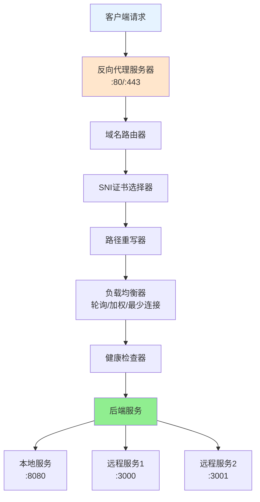

### 反向代理特性

- **多域名支持**：一个服务器支持多个域名
- **SNI 支持**：每个域名独立的 SSL 证书
- **路径重写**：灵活的路径重写规则
- **HTTP/2 支持**：提升 HTTPS 性能
- **负载均衡**：轮询/加权/最少连接（HTTP业务层）
- **健康检查**：自动故障检测和转移（HTTP业务层）

### 配置示例

```yaml
# config/default_config/server.yaml
proxy:
  enabled: true
  httpPort: 80
  httpsPort: 443
  healthCheck:
    enabled: true
    interval: 30000
    maxFailures: 3
  domains:
    - domain: "api.example.com"
      ssl:
        enabled: true
        certificate:
          key: "/path/to/api.example.com.key"
          cert: "/path/to/api.example.com.cert"
      target:
        - url: "http://backend1:3000"
          weight: 3
        - url: "http://backend2:3000"
          weight: 1
      loadBalance: "weighted"
      rewritePath:
        from: "/api"
        to: "/"
```

详细文档：参见 [Server文档](server.md) 和 [HTTP业务层文档](http-business-layer.md)

---

## 实用工具方法

### 消息发送

```javascript
// 发送消息给主人
await bot.sendMasterMsg('服务器已启动', 5000);
```

### 合并转发

```javascript
// 创建合并转发消息
const forwardMsg = bot.makeForwardMsg({
  user_id: '123456',
  nickname: '用户',
  message: 'Hello'
});

// 创建合并转发数组
const forwardArray = bot.makeForwardArray([
  { message: '消息1' },
  { message: '消息2' }
], { user_id: '123456' });
```

### 文件处理

```javascript
// 将文件转换为URL
const url = await bot.fileToUrl('/path/to/file.jpg');
// 返回: "http://localhost:8080/File/..."  // 端口根据实际配置而定
```

### 错误处理

```javascript
// 创建标准化错误对象（自动记录日志）
const error = bot.makeError('操作失败', 'OperationError', {
  code: 'E001',
  context: 'user_action'
});
```

---

## 最佳实践

### 1. 事件处理

```javascript
// ✅ 推荐：使用精确事件名
bot.on('message.group.normal', (e) => {
  // 只处理普通群消息
});

// ❌ 不推荐：监听过于宽泛的事件
bot.on('message', (e) => {
  // 会收到所有类型的消息，性能较差
});
```

### 2. HTTP API 开发

```javascript
// ✅ 推荐：通过 req.bot 访问
export default {
  routes: [{
    handler: async (req, res) => {
      const bot = req.bot;
      const url = bot.getServerUrl();
      res.json({ url });
    }
  }]
};

// ❌ 不推荐：直接 import Bot
import Bot from '#src/bot.js';  // 可能导致循环依赖
```

### 3. 子 Bot 访问

```javascript
// ✅ 推荐：使用 Proxy 访问
const subBot = Bot['123456'];
if (subBot) {
  await subBot.pickFriend('789012').sendMsg('Hello');
}

// ❌ 不推荐：直接访问 bots 对象
const subBot = Bot.bots['123456'];  // 绕过 Proxy，可能缺少功能
```

### 4. 错误处理

```javascript
// ✅ 推荐：使用 makeError
try {
  // 操作
} catch (err) {
  const error = bot.makeError(err, 'OperationError', {
    context: 'my_operation'
  });
  // 错误已自动记录日志
}

// ❌ 不推荐：直接 throw
throw new Error('操作失败');  // 不会记录日志
```

### 5. 资源清理

```javascript
// ✅ 推荐：使用 closeServer
process.on('SIGINT', async () => {
  await bot.closeServer();
  process.exit(0);
});

// ❌ 不推荐：直接退出
process.exit(0);  // 不会清理资源
```

---

## 常见问题

### Q: 如何修改默认端口？

A: 在 `config/default_config/server.yaml` 中配置，或通过 `run({ port: 8080 })` 传入。

### Q: 如何添加自定义中间件？

A: 在 `_initializeMiddlewareAndRoutes()` 方法中添加，或通过插件系统扩展。

### Q: WebSocket 连接失败怎么办？

A: 检查：
1. WebSocket 路径是否正确注册（`Bot.wsf[path]`）
2. 认证是否通过（同 HTTP 认证）
3. 防火墙是否开放端口

### Q: 如何实现负载均衡？

A: 使用反向代理配置，支持轮询/加权/最少连接算法。详见 [HTTP业务层文档](http-business-layer.md#反向代理增强)。

### Q: 事件监听器没有触发？

A: 检查：
1. 事件名是否正确（支持逐级派发）
2. 事件数据是否包含必要字段（`self_id`、`user_id` 等）
3. 监听器是否在 `ListenerLoader.load()` 之后注册

### Q: 如何获取所有已注册的路由？

A: 使用 `bot.getRouteList()` 或 `bot.getRoutes()`。

### Q: 如何内部调用 API 而不发起 HTTP 请求？

A: 使用 `bot.callRoute('/api/endpoint', options)`。

### Q: 如何清理临时文件？

A: Bot 自动清理 `trash/` 目录，可通过配置调整：

```yaml
server:
  misc:
    trashCleanupIntervalMinutes: 60  # 清理间隔（分钟）
    trashMaxAgeHours: 24              # 保留时间（小时）
```

---

## 相关文档

- [Server 服务器架构](server.md) - HTTP/HTTPS/WebSocket 服务详细说明
- [HTTP业务层](http-business-layer.md) - 重定向、CDN、反向代理增强
- [项目概览](../PROJECT_OVERVIEW.md) - 项目整体架构
- [插件系统](plugin-base.md) - 插件开发指南
- [AIStream 文档](aistream.md) - Node 侧单次对话 + MCP 工具调用（复杂多步在 Python 子服务端）

---

*本文档持续更新中，如有问题或建议，请提交 Issue。*
