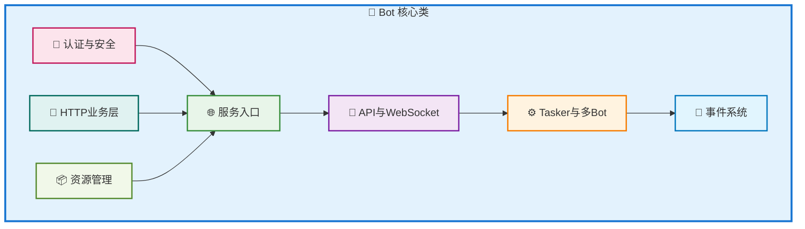
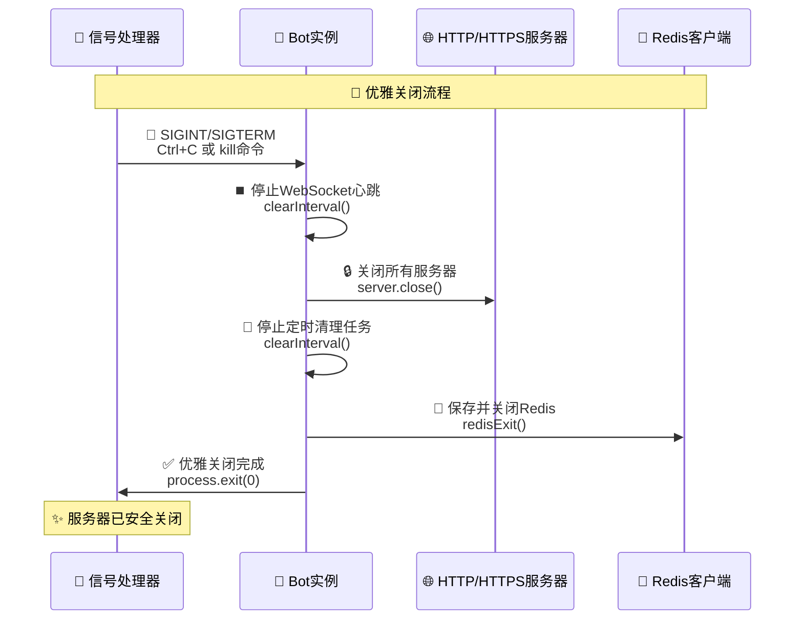
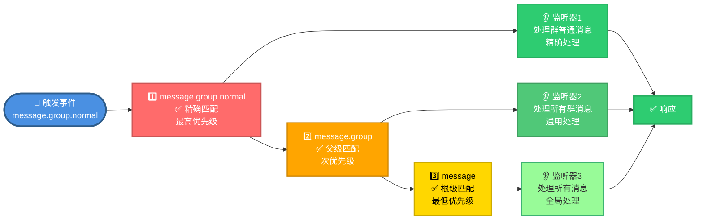
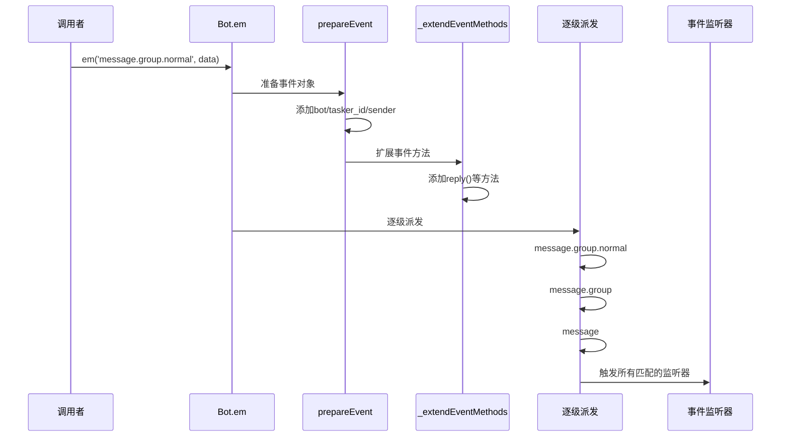
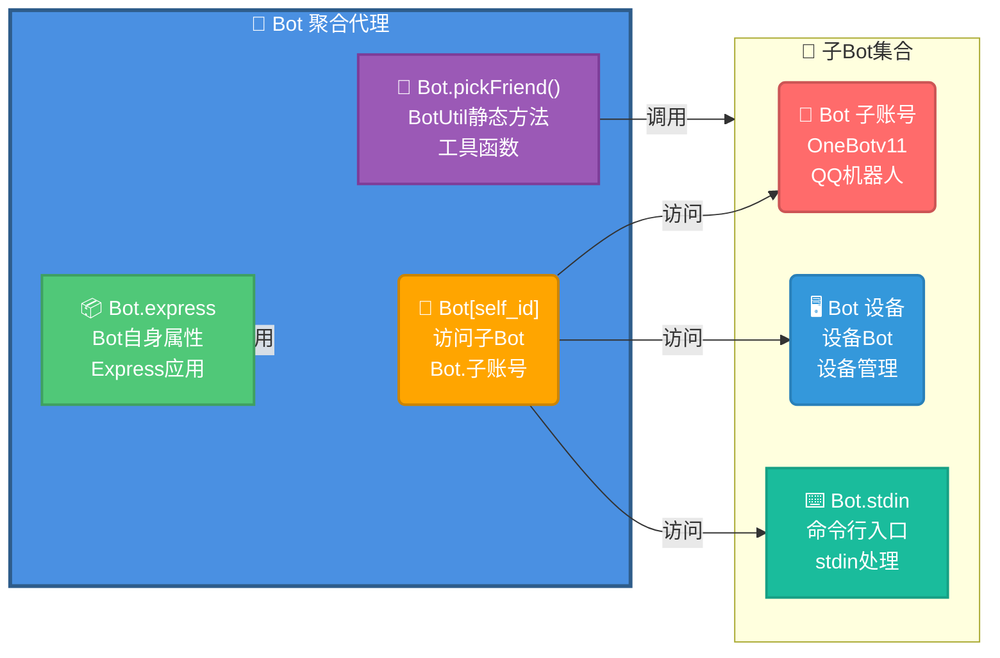
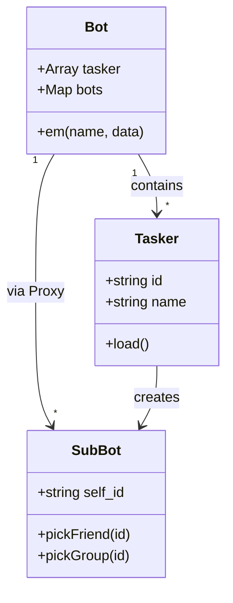
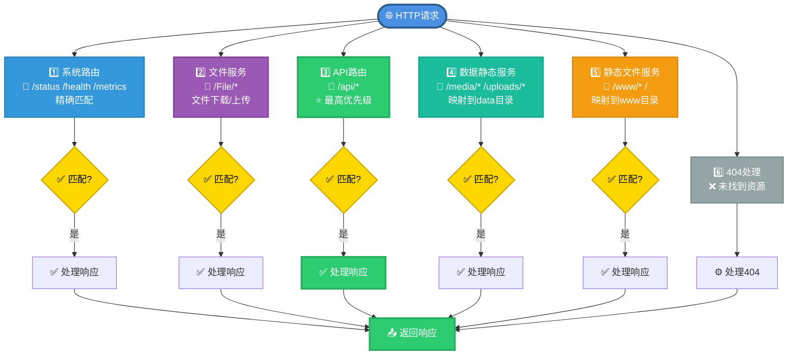
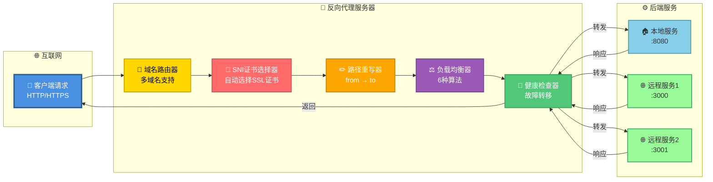

# Bot 主类文档

> **文件位置**：`src/bot.js`  
> **说明**：Bot 是 XRK-AGT 的核心运行时对象，负责 HTTP/HTTPS/WebSocket 服务、反向代理、HTTP业务层、API 装载、插件与工作流集成、事件派发与资源清理

---

## 📚 目录

- [快速开始](#快速开始)
- [核心职责](#核心职责)
- [生命周期](#生命周期)
- [核心 API](#核心-api)
- [事件系统](#事件系统)
- [多 Bot 管理](#多-bot-管理)
- [HTTP 服务](#http-服务)
- [WebSocket 服务](#websocket-服务)
- [反向代理](#反向代理)
- [实用工具方法](#实用工具方法)
- [最佳实践](#最佳实践)
- [常见问题](#常见问题)

---

## 快速开始

### 推荐用法：通过启动脚本与全局 `Bot`

在实际项目中，一般**不需要手动 `import Bot` 或 `new Bot()`**，而是通过 `node app` / `node start.js` 启动，框架会自动创建并挂载全局 `Bot` 实例：

- 启动：`node app`（推荐）或 `node app server {端口}` / `node start.js server {端口}`
- 运行时：
  - 在插件 / Tasker / 事件监听器等代码中，直接使用全局 `Bot`（由启动脚本挂载）
  - 在 HTTP API 中使用 `req.bot`（由 `HttpApi` 基类自动注入）

插件、Tasker 等业务代码中直接使用全局对象：

```javascript
// 在插件或 Tasker 中（全局 Bot 由启动脚本挂载，无需手动 import）
const subBot = Bot['123456'];           // 访问子 Bot
await subBot.sendMasterMsg('Hello');    // 发送消息给主人
```

### 在 HTTP API 中使用

```javascript
// core/my-core/http/myapi.js
export default {
  name: 'my-api',
  routes: [
    {
      method: 'GET',
      path: '/api/test',
      handler: async (req, res) => {
        const bot = req.bot;
        const url = bot.getServerUrl();
        const result = await bot.callRoute('/api/status');
        res.json({ success: true, url, status: result });
      }
    }
  ]
};
```

---

## 核心职责

`Bot` 类是 XRK-AGT 的核心运行时对象，统一管理以下功能：


```mermaid
flowchart TB
    subgraph Bot["🤖 Bot 核心类"]
        Service["🌐 服务入口"]
        API["📡 API与WebSocket"]
        Tasker["⚙️ Tasker与多Bot"]
        Auth["🔐 认证与安全"]
        Event["📢 事件系统"]
        Business["💼 HTTP业务层"]
        Resource["📦 资源管理"]
    end
    
    Service --> API
    API --> Tasker
    Tasker --> Event
    Auth --> Service
    Business --> Service
    Resource --> Service
    
    style Bot fill:#E3F2FD,stroke:#1976D2,stroke-width:3px
    style Service fill:#E8F5E9,stroke:#388E3C,stroke-width:2px
    style API fill:#F3E5F5,stroke:#7B1FA2,stroke-width:2px
    style Tasker fill:#FFF3E0,stroke:#F57C00,stroke-width:2px
    style Auth fill:#FCE4EC,stroke:#C2185B,stroke-width:2px
    style Event fill:#E1F5FE,stroke:#0277BD,stroke-width:2px
    style Business fill:#E0F2F1,stroke:#00695C,stroke-width:2px
    style Resource fill:#F1F8E9,stroke:#558B2F,stroke-width:2px
```

| 职责模块 | 说明 |
|---------|------|
| **服务入口** | Express 应用、HTTP/HTTPS 服务器、静态文件服务、基础中间件 |
| **API 与 WebSocket** | 动态加载所有 `core/*/http` 目录下的 API 模块，管理 WebSocket 连接与路径路由 |
| **Tasker 与多 Bot** | 管理 Tasker 实例，按账号/设备 ID 管理子 Bot |
| **认证与安全** | API Key 生成/验证、白名单、本地连接、同源 Cookie 认证 |
| **事件系统** | 统一事件入口 `Bot.em()`，事件准备与增强，逐级事件派发 |
| **HTTP业务层** | 重定向管理、CDN 支持、反向代理增强（负载均衡、健康检查） |
| **资源管理** | 临时文件清理、优雅关闭、Redis 持久化 |

---

## 生命周期

### 启动流程


```mermaid
flowchart LR
    Start([🚀 node app / start.js<br/>启动脚本]) --> Create["📦 创建Bot实例<br/>（由启动脚本自动完成）<br/>new Bot()"]
    Create --> Init["⚙️ 初始化HTTP/WS/代理<br/>_initHttpServer()<br/>_initProxyApp()"]
    Init --> Run["▶️ bot.run(options)<br/>传入端口配置"]
    
    Run --> Load["📚 并行加载模块<br/>Config/Stream/Plugin/API<br/>Promise.allSettled()"]
    Load --> Middleware["🛠️ 初始化中间件与路由<br/>压缩/安全头/CORS<br/>日志/限流/解析"]
    Middleware --> Register["📝 注册API路由<br/>ApiLoader.register()"]
    Register --> Server["🌐 启动HTTP/HTTPS服务器<br/>server.listen()"]
    Server --> Proxy["🔄 启动反向代理（可选）<br/>startProxyServers()"]
    Proxy --> Listener["👂 加载事件监听器<br/>ListenerLoader.load()"]
    Listener --> Watch["🔄 启动API热重载<br/>ApiLoader.watch()"]
    Watch --> Online([✅ 触发online事件<br/>服务器就绪])
    
    style Start fill:#4A90E2,stroke:#2E5C8A,stroke-width:3px,color:#fff
    style Create fill:#E6F3FF,stroke:#2E5C8A,stroke-width:2px
    style Init fill:#FFE6CC,stroke:#CC8400,stroke-width:2px
    style Run fill:#FFD700,stroke:#CCAA00,stroke-width:2px,color:#000
    style Load fill:#87CEEB,stroke:#5F9EA0,stroke-width:2px
    style Middleware fill:#DDA0DD,stroke:#9370DB,stroke-width:2px
    style Register fill:#98FB98,stroke:#3CB371,stroke-width:2px
    style Server fill:#50C878,stroke:#3FA060,stroke-width:2px,color:#fff
    style Proxy fill:#FFA500,stroke:#CC8400,stroke-width:2px,color:#fff
    style Listener fill:#9B59B6,stroke:#7D3C98,stroke-width:2px,color:#fff
    style Watch fill:#F39C12,stroke:#D68910,stroke-width:2px,color:#fff
    style Online fill:#2ECC71,stroke:#27AE60,stroke-width:3px,color:#fff
```

### 关闭流程


```mermaid
sequenceDiagram
    participant Signal as 🛑 信号处理器
    participant Bot as 🤖 Bot实例
    participant Server as 🌐 HTTP/HTTPS服务器
    participant Redis as 💾 Redis客户端
    
    Note over Signal,Redis: 🔄 优雅关闭流程
    
    Signal->>Bot: 📨 SIGINT/SIGTERM<br/>Ctrl+C 或 kill命令
    Bot->>Bot: ⏹️ 停止WebSocket心跳<br/>clearInterval()
    Bot->>Server: 🔒 关闭所有服务器<br/>server.close()
    Bot->>Bot: 🧹 停止定时清理任务<br/>clearInterval()
    Bot->>Redis: 💾 保存并关闭Redis<br/>redisExit()
    Bot->>Signal: ✅ 优雅关闭完成<br/>process.exit(0)
    
    Note over Signal: ✨ 服务器已安全关闭
```

---

## 核心 API

### 事件系统

#### `em(name, data, asJson, options)`

触发事件，支持逐级派发。

```javascript
// 基本用法
bot.em('message.group.normal', {
  self_id: '123456',
  user_id: '789012',
  group_id: '345678',
  message: 'Hello'
});

// 等待stdin输出（asJson模式）
const result = await bot.em('stdin.message', {
  message: 'help'
}, true, { timeout: 5000 });
```

#### `prepareEvent(data)`

准备事件对象，自动添加通用属性：`bot`、`tasker_id`、`tasker_name`、`sender`、`reply()` 等。

### 服务器管理

#### `run(options)` / `closeServer()` / `getServerUrl()` / `getLocalIpAddress()`

```javascript
await bot.run({ port: 端口号 });  // 端口号由开发者指定
await bot.closeServer();
const url = bot.getServerUrl();
const ipInfo = await bot.getLocalIpAddress();
```

### 路由调用

#### `callRoute(routePath, options)`

内部调用已注册的 HTTP 路由，无需发起 HTTP 请求。

```javascript
const result = await bot.callRoute('/api/status', {
  method: 'GET',
  query: { format: 'json' },
  timeout: 5000
});
```

#### `getRouteList(options)`

获取已注册的路由列表（支持扁平/分组）。

### stdin 命令

#### `callStdin(command, options)` / `runCommand(command, options)`

通过 stdin 执行命令，`runCommand` 是 `callStdin` 的别名。

---

## 事件系统

### 事件逐级派发机制

Bot 支持**逐级事件派发**，事件名从具体到抽象依次触发：


```mermaid
flowchart LR
    Trigger(["📢 触发事件<br/>message.group.normal"]) --> Level1["1️⃣ message.group.normal<br/>✅ 精确匹配<br/>最高优先级"]
    Level1 --> Level2["2️⃣ message.group<br/>✅ 父级匹配<br/>次优先级"]
    Level2 --> Level3["3️⃣ message<br/>✅ 根级匹配<br/>最低优先级"]
    
    Level1 --> Listener1["👂 监听器1<br/>处理群普通消息<br/>精确处理"]
    Level2 --> Listener2["👂 监听器2<br/>处理所有群消息<br/>通用处理"]
    Level3 --> Listener3["👂 监听器3<br/>处理所有消息<br/>全局处理"]
    
    Listener1 --> Response["✅ 响应"]
    Listener2 --> Response
    Listener3 --> Response
    
    style Trigger fill:#4A90E2,stroke:#2E5C8A,stroke-width:3px,color:#fff
    style Level1 fill:#FF6B6B,stroke:#CC5555,stroke-width:2px,color:#fff
    style Level2 fill:#FFA500,stroke:#CC8400,stroke-width:2px,color:#fff
    style Level3 fill:#FFD700,stroke:#CCAA00,stroke-width:2px,color:#000
    style Listener1 fill:#2ECC71,stroke:#27AE60,stroke-width:2px,color:#fff
    style Listener2 fill:#50C878,stroke:#3FA060,stroke-width:2px,color:#fff
    style Listener3 fill:#98FB98,stroke:#3CB371,stroke-width:2px
    style Response fill:#2ECC71,stroke:#27AE60,stroke-width:3px,color:#fff
```

**示例**：

```javascript
// 监听精确事件
bot.on('message.group.normal', (e) => {
  console.log('收到群消息');
});

// 监听所有群消息
bot.on('message.group', (e) => {
  console.log('群消息（包括所有子类型）');
});

// 监听所有消息
bot.on('message', (e) => {
  console.log('任何类型的消息');
});
```

### 事件处理流程


```mermaid
sequenceDiagram
    participant Caller as 调用者
    participant Bot as Bot.em
    participant Prepare as prepareEvent
    participant Extend as _extendEventMethods
    participant Cascade as 逐级派发
    participant Listener as 事件监听器
    
    Caller->>Bot: em('message.group.normal', data)
    Bot->>Prepare: 准备事件对象
    Prepare->>Prepare: 添加bot/tasker_id/sender
    Prepare->>Extend: 扩展事件方法
    Extend->>Extend: 添加reply()等方法
    Bot->>Cascade: 逐级派发
    Cascade->>Cascade: message.group.normal
    Cascade->>Cascade: message.group
    Cascade->>Cascade: message
    Cascade->>Listener: 触发所有匹配的监听器
```

### 事件对象结构

```javascript
{
  // 基础属性（prepareEvent添加）
  bot: SubBot,              // 对应的子Bot实例
  tasker_id: 'onebotv11',   // Tasker ID
  tasker_name: 'OneBotv11', // Tasker 名称
  sender: { user_id: '...' }, // 基础发送者信息
  
  // 事件数据
  self_id: '123456',
  user_id: '789012',
  group_id: '345678',
  message: 'Hello',
  
  // 扩展方法（_extendEventMethods添加）
  reply: async (msg, quote, extraData) => {...},
  getRoutes: (options) => {...}
  
  // Tasker特定属性（由增强插件添加）
  // friend: Friend对象（OneBotv11）
  // group: Group对象（OneBotv11）
  // member: Member对象（OneBotv11）
}
```

---

## 多 Bot 管理

### Bot 聚合代理架构

Bot 通过 `_createProxy()` 暴露为**多 Bot 聚合代理**，统一访问子 Bot、BotUtil 静态方法和 Bot 自身属性：


```mermaid
flowchart LR
    subgraph Proxy["🤖 Bot 聚合代理"]
        direction TB
        Access1("🔑 Bot[self_id]<br/>访问子Bot<br/>Bot.子账号")
        Access2["🔧 Bot.pickFriend()<br/>BotUtil静态方法<br/>工具函数"]
        Access3["📦 Bot.express<br/>Bot自身属性<br/>Express应用"]
    end

    subgraph Bots["👥 子Bot集合"]
        direction TB
        SubBot1("📱 Bot 子账号<br/>OneBotv11<br/>QQ机器人")
        SubBot2("🖥️ Bot 设备<br/>设备Bot<br/>设备管理")
        SubBot3["⌨️ Bot.stdin<br/>命令行入口<br/>stdin处理"]
    end
    
    Access1 -->|"访问"| SubBot1
    Access1 -->|"访问"| SubBot2
    Access1 -->|"访问"| SubBot3
    Access2 -->|"调用"| Bots
    Access3 -->|"使用"| Proxy
    
    style Proxy fill:#4A90E2,stroke:#2E5C8A,stroke-width:3px,color:#fff
    style Access1 fill:#FFA500,stroke:#CC8400,stroke-width:2px,color:#fff
    style Access2 fill:#9B59B6,stroke:#7D3C98,stroke-width:2px,color:#fff
    style Access3 fill:#50C878,stroke:#3FA060,stroke-width:2px,color:#fff
    style SubBot1 fill:#FF6B6B,stroke:#CC5555,stroke-width:2px,color:#fff
    style SubBot2 fill:#3498DB,stroke:#2980B9,stroke-width:2px,color:#fff
    style SubBot3 fill:#1ABC9C,stroke:#16A085,stroke-width:2px,color:#fff
```

**使用示例**：

```javascript
// 访问子Bot（IM账号）
const subBot = Bot['123456'];
await subBot.pickFriend('789012').sendMsg('Hello');

// 访问设备Bot
const deviceBot = Bot['device_001'];
await deviceBot.sendCommand('reboot');

// 访问BotUtil静态方法
const friend = Bot.pickFriend('123456', '789012');
await friend.sendMsg('Hello');

// 访问Bot自身
Bot.express.get('/custom', (req, res) => {
  res.json({ message: 'Custom route' });
});
```

### Tasker 与子 Bot 关系


```mermaid
classDiagram
    class Bot {
        +Array tasker
        +Map bots
        +em(name, data)
    }
    
    class Tasker {
        +string id
        +string name
        +load()
    }
    
    class SubBot {
        +string self_id
        +pickFriend(id)
        +pickGroup(id)
    }
    
    Bot "1" --> "*" Tasker : contains
    Bot "1" --> "*" SubBot : via Proxy
    Tasker --> SubBot : creates
```

**特殊子 Bot**：
- `Bot.stdin`：命令行与 HTTP 统一入口
- `Bot[device_id]`：设备控制 Bot

---

## HTTP 服务

### 请求处理流程


```mermaid
flowchart LR
    Request["🌐 HTTP请求<br/>进入服务器"] --> Track["1️⃣ 请求追踪<br/>📝 requestId<br/>⏱️ startTime"]
    Track --> Compress["2️⃣ 响应压缩<br/>🗜️ Compression<br/>✨ 支持brotli"]
    Compress --> Helmet["3️⃣ 安全头<br/>🛡️ Helmet<br/>🔒 X-Content-Type-Options"]
    Helmet --> CORS["4️⃣ CORS处理<br/>🌍 跨域<br/>✅ 预检请求"]
    CORS --> Log["5️⃣ 请求日志<br/>📊 记录请求<br/>⏱️ 响应时间"]
    Log --> RateLimit["6️⃣ 速率限制<br/>🚦 全局限流<br/>⚡ API限流"]
    RateLimit --> BodyParser["7️⃣ 请求体解析<br/>📦 JSON<br/>📋 URL-Encoded"]
    BodyParser --> Redirect["8️⃣ 重定向检查<br/>🔄 HTTP业务层<br/>📍 路径匹配"]
    Redirect --> Route["9️⃣ 路由匹配<br/>🔍 系统路由<br/>📡 API路由"]
    Route --> Auth["🔟 认证中间件<br/>✅ 白名单<br/>🔑 API Key"]
    Auth --> Handler["⚙️ 业务处理<br/>处理请求逻辑"]
    Handler --> Response["✅ 返回响应<br/>HTTP状态码<br/>响应数据"]
    
    style Request fill:#4A90E2,stroke:#2E5C8A,stroke-width:3px,color:#fff
    style Track fill:#E6F3FF,stroke:#2E5C8A,stroke-width:2px
    style Compress fill:#FFE6CC,stroke:#CC8400,stroke-width:2px
    style Helmet fill:#FFD700,stroke:#CCAA00,stroke-width:2px,color:#000
    style CORS fill:#87CEEB,stroke:#5F9EA0,stroke-width:2px
    style Log fill:#DDA0DD,stroke:#9370DB,stroke-width:2px
    style RateLimit fill:#FF6B6B,stroke:#CC5555,stroke-width:2px,color:#fff
    style BodyParser fill:#98FB98,stroke:#3CB371,stroke-width:2px
    style Redirect fill:#FFA500,stroke:#CC8400,stroke-width:2px,color:#fff
    style Route fill:#50C878,stroke:#3FA060,stroke-width:2px,color:#fff
    style Auth fill:#9B59B6,stroke:#7D3C98,stroke-width:2px,color:#fff
    style Handler fill:#3498DB,stroke:#2980B9,stroke-width:2px,color:#fff
    style Response fill:#2ECC71,stroke:#27AE60,stroke-width:3px,color:#fff
```

### 路由优先级


```mermaid
flowchart TB
    Request(["🌐 HTTP请求"]) --> Priority1["1️⃣ 系统路由<br/>🔧 /status /health /metrics<br/>精确匹配"]
    Request --> Priority2["2️⃣ 文件服务<br/>📁 /File/*<br/>文件下载/上传"]
    Request --> Priority3["3️⃣ API路由<br/>📡 /api/*<br/>⭐ 最高优先级"]
    Request --> Priority4["4️⃣ 数据静态服务<br/>💾 /media/* /uploads/*<br/>映射到data目录"]
    Request --> Priority5["5️⃣ 静态文件服务<br/>📄 /www/* /<br/>映射到www目录"]
    Request --> Priority6["6️⃣ 404处理<br/>❌ 未找到资源"]
    
    Priority1 --> Match1{"✅ 匹配?"}
    Priority2 --> Match2{"✅ 匹配?"}
    Priority3 --> Match3{"✅ 匹配?"}
    Priority4 --> Match4{"✅ 匹配?"}
    Priority5 --> Match5{"✅ 匹配?"}
    Priority6 --> Match6["⚙️ 处理404"]
    
    Match1 -->|"是"| Handler1["✅ 处理响应"]
    Match2 -->|"是"| Handler2["✅ 处理响应"]
    Match3 -->|"是"| Handler3["✅ 处理响应"]
    Match4 -->|"是"| Handler4["✅ 处理响应"]
    Match5 -->|"是"| Handler5["✅ 处理响应"]
    
    Handler1 --> Response["📤 返回响应"]
    Handler2 --> Response
    Handler3 --> Response
    Handler4 --> Response
    Handler5 --> Response
    Match6 --> Response
    
    style Request fill:#4A90E2,stroke:#2E5C8A,stroke-width:3px,color:#fff
    style Priority1 fill:#3498DB,stroke:#2980B9,stroke-width:2px,color:#fff
    style Priority2 fill:#9B59B6,stroke:#7D3C98,stroke-width:2px,color:#fff
    style Priority3 fill:#2ECC71,stroke:#27AE60,stroke-width:3px,color:#fff
    style Priority4 fill:#1ABC9C,stroke:#16A085,stroke-width:2px,color:#fff
    style Priority5 fill:#F39C12,stroke:#D68910,stroke-width:2px,color:#fff
    style Priority6 fill:#95A5A6,stroke:#7F8C8D,stroke-width:2px,color:#fff
    style Match1 fill:#FFD700,stroke:#CCAA00,stroke-width:2px,color:#000
    style Match2 fill:#FFD700,stroke:#CCAA00,stroke-width:2px,color:#000
    style Match3 fill:#FFD700,stroke:#CCAA00,stroke-width:2px,color:#000
    style Match4 fill:#FFD700,stroke:#CCAA00,stroke-width:2px,color:#000
    style Match5 fill:#FFD700,stroke:#CCAA00,stroke-width:2px,color:#000
    style Handler3 fill:#2ECC71,stroke:#27AE60,stroke-width:3px,color:#fff
    style Response fill:#2ECC71,stroke:#27AE60,stroke-width:3px,color:#fff
```

### 认证机制

当前版本中，Bot 的认证职责划分如下（详见 `docs/AUTH.md`）：

- **Server 层 (`src/bot.js`)**  
  - 只做静态资源放行（根据扩展名）和本地/内网 IP 放行；  
  - 不再根据 URL 白名单或 Cookie 做统一鉴权。
- **system-Core HTTP (`core/system-Core/http/*.js`)**  
  - 在各自模块顶部通过 `ensureSystemCoreAuth` 调用 `Bot.checkApiAuthorization(req)`，统一使用系统级 API Key。  
- **其他 Core HTTP / Tasker**  
  - 可选择接入系统 API Key，或定义自己的鉴权方案（如自有 token / 签名）；  
  - Tasker 暴露的 WebSocket 路径统一经过 `wsConnect` 做系统级 API Key 校验（本地/内网除外）。

**配置示例**：

```yaml
# config/default_config/server.yaml
auth:
  apiKey:
    enabled: true
    file: "config/server_config/api_key.json"
  whitelist:
    - "/"
    - "/health"
    - "/status"
    - "/xrk"
```

同源 Cookie 认证（用于 Web 控制台免 API Key）可通过 `uiCookie` 配置：

```yaml
uiCookie:
  enabled: true
  pathPrefix: "/xrk"
  name: "xrk_ui"
  value: "1"
  sameSite: "lax"
  httpOnly: true
  maxAgeMs: 86400000
```

---

## WebSocket 服务

### WebSocket 连接流程

```mermaid
sequenceDiagram
    participant Client as 💻 WebSocket客户端
    participant Bot as 🤖 Bot.wsConnect
    participant Auth as 🔐 认证检查
    participant Handler as ⚙️ 路径处理器
    
    Note over Client,Handler: 🔌 WebSocket连接建立流程
    
    Client->>Bot: 📨 HTTP Upgrade请求<br/>GET /ws HTTP/1.1<br/>Upgrade: websocket<br/>Connection: Upgrade
    Bot->>Auth: 🔍 检查认证<br/>同HTTP认证机制<br/>API Key验证
    Auth->>Bot: ✅ 认证通过<br/>允许连接
    Bot->>Bot: 🔎 查找路径处理器<br/>Bot.wsf['/ws']<br/>匹配处理器
    Bot->>Handler: ⚙️ 调用处理器<br/>注册的WebSocket处理函数
    Handler->>Client: 🔌 WebSocket连接建立<br/>101 Switching Protocols
    
    Note over Client,Handler: 🔄 双向通信开始
    
    Client<->Handler: 💬 双向通信<br/>实时消息交换<br/>心跳保持连接
```

### 注册 WebSocket 处理器

```javascript
// core/my-core/tasker/MyTasker.js
export default class MyTasker {
  id = 'mytasker';
  path = 'mytasker';
  
  load() {
    Bot.wsf[this.path].push((ws, req) => {
      ws.on('message', (data) => {
        const message = JSON.parse(data);
        Bot.em('mytasker.message', {
          event_id: `mytasker_${Date.now()}`,
          message: message
        });
      });
    });
  }
}

// 客户端连接: ws://localhost:{端口}/mytasker  // 端口由启动配置决定
```

### WebSocket 心跳

Bot 自动管理 WebSocket 心跳检测：
- 默认超时：60秒（可通过 `server.yaml` 的 `websocket.heartbeatTimeout` 配置）
- 自动清理：断开超时连接
- 统计信息：`getWebSocketStats()`

---

## 反向代理

### 反向代理架构


```mermaid
flowchart LR
    subgraph Internet["🌐 互联网"]
        Client["👤 客户端请求<br/>HTTP/HTTPS"]
    end
    
    subgraph Proxy["🔄 反向代理服务器"]
        direction TB
        Domain["📍 域名路由器<br/>多域名支持"]
        SNI["🔐 SNI证书选择器<br/>自动选择SSL证书"]
        Rewrite["✏️ 路径重写器<br/>from → to"]
        LB["⚖️ 负载均衡器<br/>6种算法"]
        Health["🏥 健康检查器<br/>故障转移"]
    end
    
    subgraph Backend["⚙️ 后端服务"]
        direction TB
        Backend1["🏠 本地服务<br/>:8080"]
        Backend2["🌐 远程服务1<br/>:3000"]
        Backend3["🌐 远程服务2<br/>:3001"]
    end
    
    Client --> Domain
    Domain --> SNI
    SNI --> Rewrite
    Rewrite --> LB
    LB --> Health
    Health -->|"转发"| Backend1
    Health -->|"转发"| Backend2
    Health -->|"转发"| Backend3
    
    Backend1 -->|"响应"| Health
    Backend2 -->|"响应"| Health
    Backend3 -->|"响应"| Health
    Health -->|"返回"| Client
    
    style Client fill:#4A90E2,stroke:#2E5C8A,stroke-width:3px,color:#fff
    style Domain fill:#FFD700,stroke:#CCAA00,stroke-width:2px,color:#000
    style SNI fill:#FF6B6B,stroke:#CC5555,stroke-width:2px,color:#fff
    style Rewrite fill:#FFA500,stroke:#CC8400,stroke-width:2px,color:#fff
    style LB fill:#9B59B6,stroke:#7D3C98,stroke-width:2px,color:#fff
    style Health fill:#50C878,stroke:#3FA060,stroke-width:2px,color:#fff
    style Backend1 fill:#87CEEB,stroke:#5F9EA0,stroke-width:2px
    style Backend2 fill:#98FB98,stroke:#3CB371,stroke-width:2px
    style Backend3 fill:#98FB98,stroke:#3CB371,stroke-width:2px
```

### 反向代理特性

- **多域名支持**：一个服务器支持多个域名
- **SNI 支持**：每个域名独立的 SSL 证书
- **路径重写**：灵活的路径重写规则
- **HTTP/2 支持**：提升 HTTPS 性能
- **负载均衡**：轮询/加权/最少连接（HTTP业务层）
- **健康检查**：自动故障检测和转移（HTTP业务层）

### 配置示例

```yaml
# config/default_config/server.yaml
proxy:
  enabled: true
  httpPort: 80
  httpsPort: 443
  healthCheck:
    enabled: true
    interval: 30000
    maxFailures: 3
  domains:
    - domain: "api.example.com"
      ssl:
        enabled: true
        certificate:
          key: "/path/to/api.example.com.key"
          cert: "/path/to/api.example.com.cert"
      target:
        - url: "http://backend1:3000"
          weight: 3
        - url: "http://backend2:3000"
          weight: 1
      loadBalance: "weighted"
      rewritePath:
        from: "/api"
        to: "/"
```

详细文档：参见 [Server文档](server.md) 和 [HTTP业务层文档](http-business-layer.md)

---

## 实用工具方法

### 消息发送

```javascript
// 发送消息给主人（按配置的 masterQQ 逐个发送）
await bot.sendMasterMsg('服务器已启动', 5000);

// 发送好友消息（指定机器人）
await bot.sendFriendMsg('3652962217', '123456789', '你好，这是测试消息');

// 发送群消息（指定机器人）
await bot.sendGroupMsg('3652962217', '1075364017', '群里好');

// 不指定 botId 时，会自动选用一个已连接的机器人
await bot.sendGroupMsg(null, '1075364017', '用默认机器人发送');
```

### 合并转发

```javascript
// 创建合并转发消息
const forwardMsg = bot.makeForwardMsg({
  user_id: '123456',
  nickname: '用户',
  message: 'Hello'
});

// 创建合并转发数组
const forwardArray = bot.makeForwardArray([
  { message: '消息1' },
  { message: '消息2' }
], { user_id: '123456' });
```

### 文件处理

```javascript
// 将文件转换为URL
const url = await bot.fileToUrl('/path/to/file.jpg');
// 返回: "http://localhost:8080/File/..."  // 端口根据实际配置而定
```

### 错误处理

```javascript
// 创建标准化错误对象（自动记录日志）
const error = bot.makeError('操作失败', 'OperationError', {
  code: 'E001',
  context: 'user_action'
});
```

---

## 最佳实践

### 1. 事件处理

```javascript
// ✅ 推荐：使用精确事件名
bot.on('message.group.normal', (e) => {
  // 只处理普通群消息
});

// ❌ 不推荐：监听过于宽泛的事件
bot.on('message', (e) => {
  // 会收到所有类型的消息，性能较差
});
```

### 2. HTTP API 开发

```javascript
// ✅ 推荐：通过 req.bot 访问
export default {
  routes: [{
    handler: async (req, res) => {
      const bot = req.bot;
      const url = bot.getServerUrl();
      res.json({ url });
    }
  }]
};

// ❌ 不推荐：直接 import Bot（业务代码应使用全局 Bot，避免循环依赖）
import Bot from './src/bot.js';
```

### 3. 子 Bot 访问

```javascript
// ✅ 推荐：使用 Proxy 访问
const subBot = Bot['123456'];
if (subBot) {
  await subBot.pickFriend('789012').sendMsg('Hello');
}

// ❌ 不推荐：直接访问 bots 对象
const subBot = Bot.bots['123456'];  // 绕过 Proxy，可能缺少功能
```

### 4. 错误处理

```javascript
// ✅ 推荐：使用 makeError
try {
  // 操作
} catch (err) {
  const error = bot.makeError(err, 'OperationError', {
    context: 'my_operation'
  });
  // 错误已自动记录日志
}

// ❌ 不推荐：直接 throw
throw new Error('操作失败');  // 不会记录日志
```

### 5. 资源清理

```javascript
// ✅ 推荐：使用 closeServer
process.on('SIGINT', async () => {
  await bot.closeServer();
  process.exit(0);
});

// ❌ 不推荐：直接退出
process.exit(0);  // 不会清理资源
```

---

## 常见问题

### Q: 如何修改默认端口？

A: 在 `config/default_config/server.yaml` 中配置，或通过 `run({ port: 8080 })` 传入。

### Q: 如何添加自定义中间件？

A: 在 `_initializeMiddlewareAndRoutes()` 方法中添加，或通过插件系统扩展。

### Q: WebSocket 连接失败怎么办？

A: 检查：
1. WebSocket 路径是否正确注册（`Bot.wsf[path]`）
2. 认证是否通过（同 HTTP 认证）
3. 防火墙是否开放端口

### Q: 如何实现负载均衡？

A: 使用反向代理配置，支持轮询/加权/最少连接算法。详见 [HTTP业务层文档](http-business-layer.md#反向代理增强)。

### Q: 事件监听器没有触发？

A: 检查：
1. 事件名是否正确（支持逐级派发）
2. 事件数据是否包含必要字段（`self_id`、`user_id` 等）
3. 监听器是否在 `ListenerLoader.load()` 之后注册

### Q: 如何获取所有已注册的路由？

A: 使用 `bot.getRouteList()` 或 `bot.getRoutes()`。

### Q: 如何内部调用 API 而不发起 HTTP 请求？

A: 使用 `bot.callRoute('/api/endpoint', options)`。

### Q: 如何清理临时文件？

A: Bot 自动清理 `trash/` 目录，可通过配置调整：

```yaml
server:
  misc:
    trashCleanupIntervalMinutes: 60  # 清理间隔（分钟）
    trashMaxAgeHours: 24              # 保留时间（小时）
```

---

## 相关文档

- **[Server 服务器架构](server.md)** - HTTP/HTTPS/WebSocket 服务详细说明
- **[HTTP业务层](http-business-layer.md)** - 重定向、CDN、反向代理增强
- **[system-Core 特性](system-core.md)** - system-Core 内置模块完整说明，包含所有HTTP API、工作流、插件和Web控制台 ⭐
- **[项目概览](../PROJECT_OVERVIEW.md)** - 项目整体架构
- **[插件系统](plugin-base.md)** - 插件开发指南
- **[AIStream 文档](aistream.md)** - Node 侧单次对话 + MCP 工具调用（复杂多步在 Python 子服务端）

---

*最后更新：2026-02-12*
