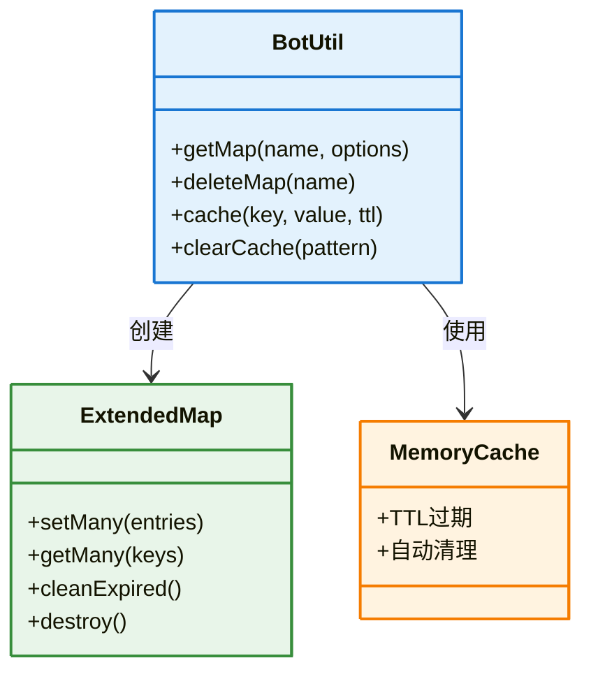

# BotUtil 工具类文档

> **文件位置**: `src/utils/botutil.js`  
> **说明**：`BotUtil` 是 XRK-AGT 的核心工具类，提供 **日志封装、缓存管理、文件系统操作、网络请求、批处理与重试、时间和大小格式化、消息辅助等** 能力，被 `Bot`、Tasker、插件和 API 广泛使用。

## 📋 目录

- [基本信息](#基本信息)
- [Map 与缓存管理](#map-与缓存管理)
- [日志与字符串工具](#日志与字符串工具)
- [文件系统操作](#文件系统操作)
- [网络请求](#网络请求)
- [批处理与重试](#批处理与重试)
- [时间与大小格式化](#时间与大小格式化)
- [消息辅助](#消息辅助)
- [使用示例](#使用示例)

---

## 基本信息

| 项目 | 内容 |
|------|------|
| 所在文件 | `src/utils/botutil.js` |
| 类型 | 全静态工具类（`export default class BotUtil`） |
| 典型使用方式 | `import BotUtil from '#utils/botutil.js'` |
| 主要服务对象 | `Bot`、插件（`plugin`）、Tasker、`ApiLoader` 等 |

---

## 静态属性概览

| 属性 | 类型 | 说明 |
|------|------|------|
| `apiKey` | `string` | 由 `Bot.generateApiKey()` 填充的 API 密钥，全局共享 |
| `regexCache` | `Object` | 常用正则缓存（URL/base64/IPv4/IPv6/中文等），用于快速检测字符串模式 |
| `mimeToExtMap` | `Map<string,string>` | MIME → 文件扩展名映射，用于推断下载文件的扩展名 |
| `idColorSchemes` | `Record<string,string[]>` | 日志 ID 渐变色方案，用于美化控制台输出 |
| `#globalMaps` | `Map<string,Map>` | 命名 Map 存储，用于跨模块的缓存或状态管理 |
| `#memoryCache` | `Map<string,object>` | 简单 KV 缓存，用于 `BotUtil.cache` |

---

## Map 与缓存管理

**缓存系统架构**:



### 扩展 Map：`getMap` 与 `deleteMap`

**功能特性**：

- `getMap(name?, options?)` - 返回带TTL、LRU驱逐和批量操作能力的Map
- `deleteMap(name)` - 删除命名Map并清理资源

**扩展方法**：

- `setMany(entries)` - 批量写入
- `getMany(keys)` - 批量读取
- `cleanExpired()` - 手动清理过期条目
- `destroy()` - 销毁Map与定时器

### 轻量缓存：`cache` 与 `clearCache`

- `cache(key, value?, ttl?)` - 设置或获取内存缓存，支持TTL过期
- `clearCache(pattern?)` - 清除所有缓存或按模式匹配清除

> 该缓存用于日志ID格式化、复杂对象字符串化等场景，减少重复计算

---

## 日志与字符串工具

### 日志辅助

| 方法 | 说明 |
|------|------|
| `makeLogID(id)` | 根据配置生成带颜色/对齐的 `[ID]` 前缀，可作为日志前缀使用 |
| `makeLog(level, msg, id?, trace?)` | 按配置的日志级别过滤后，格式化输出日志，并可附带调用堆栈 |
| `getCircularReplacer()` | 返回一个可在 `JSON.stringify` 中使用的 replacer，安全处理循环引用、Map/Set/Error/Buffer 等 |

### 字符串与数据格式化

| 方法 | 说明 |
|------|------|
| `String(data)` | 将任意数据转为字符串；对 Error/Buffer/Object 做有意义的处理 |
| `StringOrBuffer(data, base64?)` | 若是 Buffer，则在可打印时返回字符串，否则返回 Buffer 或 `base64://...` |
| `hash(data, algorithm?)` | 计算哈希（默认 MD5，可选其他算法） |
| `uuid(version?)` | 生成 `v4` UUID 或 `ulid` |
| `randomString(length?, chars?)` | 生成指定长度的随机字符串 |

---

## 文件与网络操作

| 方法 | 说明 |
|------|------|
| `fsStat(filePath)` | 安全获取 `fs.stat`，不存在时返回 `false` |
| `mkdir(dir, opts?)` | 递归创建目录，已存在视为成功 |
| `rm(file)` | 递归删除文件或目录（`fs.rm` + `force`） |
| `readFile(filePath, encoding?)` | 读取文件内容（自动校验路径为空） |
| `writeFile(filePath, data, opts?)` | 写入文件，自动创建目录 |
| `fileExists(filePath)` | 判断文件是否存在 |
| `glob(pattern, opts?)` | 使用 fast-glob / glob 查找匹配模式的文件；若非模式则回退为普通路径检测 |
| `Buffer(data, opts?)` | 将 base64/URL/文件路径/字符串转换为 Buffer 或临时文件 URL，支持大小阈值与 HTTP 超时 |
| `fileType({ name, file }, opts?)` | 检测文件类型（扩展名/MIME/MD5），并规范化文件名 |
| `fileToUrl(file, opts?)` | 将 Buffer/本地文件/网络 URL 转为 `http(s)://.../media/...`，并安排定时清理临时文件 |

这些方法是截图、文件转发、日志附件、媒体缓存等功能的基础。

---

## 命令与异步控制

| 方法 | 说明 |
|------|------|
| `exec(cmd, opts?)` | 执行系统命令（字符串或 `[cmd, ...args]`），捕获 stdout/stderr，并输出日志 |
| `sleep(time, promise?)` | 延迟一段时间，或与另一个 Promise 竞争超时 |
| `promiseEvent(emitter, event, errorEvent?, timeout?)` | 等待 EventEmitter 上的事件，支持错误事件和超时 |

---

## 时间与大小工具

| 方法 | 说明 |
|------|------|
| `getTimeDiff(t1?, t2?)` | 将两个时间点的差值格式化为「X天 X小时 X分钟 X秒」或毫秒 |
| `formatFileSize(bytes, decimals?)` | 将字节数转换为「KB/MB/GB/TB」格式 |
| `formatDate(date?, format?)` | 将日期格式化为字符串（支持 `YYYY-MM-DD HH:mm:ss` 等模式） |

---

## 对象工具与函数控制

| 方法 | 说明 |
|------|------|
| `deepClone(obj)` | 深度克隆各种结构（Date/Array/Map/Set 等） |
| `deepMerge(target, ...sources)` | 深度合并普通对象 |
| `isObject(item)` | 判断是否为普通对象 |
| `throttle(func, limit?)` | 为函数增加节流控制（在 limit 内最多执行一次） |
| `debounce(func, delay?)` | 为函数增加防抖控制（支持 `debounced.cancel()`） |

---

## 消息辅助方法

| 方法 | 说明 |
|------|------|
| `extractTextContent(message)` | 从字符串/消息数组/事件对象中提取纯文本内容，适合日志与检索 |
| `makeChatRecord(e, messages, title, description?)` | 根据事件 `e` 创建聊天记录：在 ICQQ 情况下生成合并转发消息，否则退化为普通消息 |
| `makeMsg(e, messages, title, description)` | 制作合并转发消息，尽量调用Tasker的 `makeForwardMsg` 能力，并附带摘要与标题 |
| `parseJSON(str, defaultValue?)` | 安全解析 JSON 字符串，异常时返回默认值 |

同时还导出了两个兼容函数：

- `makemsg(e, messages, title, description)`：代理到 `BotUtil.makeMsg`。  
- `制作聊天记录(e, messages, title, description)`：代理到 `BotUtil.makeChatRecord`。

---

## 使用示例

### 缓存管理

```javascript
import BotUtil from '#utils/botutil.js';

// 获取命名Map（带TTL和LRU）
const cache = BotUtil.getMap('my-cache', {
  maxSize: 1000,
  ttl: 3600000  // 1小时
});

// 批量写入
cache.setMany([
  ['key1', 'value1'],
  ['key2', 'value2']
]);

// 批量读取
const values = cache.getMany(['key1', 'key2']);

// 轻量缓存
BotUtil.cache('key', 'value', 60000);  // 缓存1分钟
const value = BotUtil.cache('key');    // 获取缓存
```

### 文件操作

```javascript
// 读取文件
const content = await BotUtil.readFile('config.yaml');

// 写入文件（自动创建目录）
await BotUtil.writeFile('data/output.txt', 'content');

// 检查文件是否存在
if (await BotUtil.fileExists('data/file.txt')) {
  // 文件存在
}

// 文件转URL（用于发送图片等）
const url = await BotUtil.fileToUrl(buffer, {
  name: 'image.png',
  ttl: 3600000
});
```

### 网络请求

```javascript
// 带重试的HTTP请求
const response = await BotUtil.retry(
  async () => {
    const res = await fetch('https://api.example.com/data');
    if (!res.ok) throw new Error('Request failed');
    return res.json();
  },
  {
    maxRetries: 3,
    delay: 1000,
    exponential: true
  }
);
```

### 批处理

```javascript
// 批量处理任务
const items = [1, 2, 3, 4, 5];
const results = await BotUtil.batch(
  items,
  async (item) => {
    // 处理单个item
    return await processItem(item);
  },
  {
    batchSize: 2,      // 每批2个
    concurrency: 3,    // 并发3个
    onProgress: (current, total) => {
      console.log(`进度: ${current}/${total}`);
    }
  }
);
```

### 日志输出

```javascript
// 生成日志ID
const logId = BotUtil.makeLogID('123456');
// 输出: [123456] (带颜色)

// 输出日志
BotUtil.makeLog('info', '这是一条信息', '123456');
BotUtil.makeLog('error', '错误信息', '123456', true);  // 包含堆栈
```

### 时间格式化

```javascript
// 时间差格式化
const diff = BotUtil.getTimeDiff(startTime, endTime);
// 输出: "2天 3小时 15分钟 30秒"

// 文件大小格式化
const size = BotUtil.formatFileSize(1024 * 1024 * 5);
// 输出: "5.00 MB"

// 日期格式化
const date = BotUtil.formatDate(new Date(), 'YYYY-MM-DD HH:mm:ss');
// 输出: "2026-02-06 12:30:45"
```

---

## 与其它模块的关系

- **`Bot`（`src/bot.js`）**
  - 使用 `BotUtil.getMap` 管理本地 IP 缓存等。
  - 使用 `BotUtil.makeLog` 统一输出 HTTP/WS/代理/认证等日志。
  - 借助 `BotUtil.fileToUrl/formatFileSize` 处理文件服务与统计输出。

- **插件系统**
  - 插件中常用 `BotUtil.sleep/retry/batch` 实现复杂的异步流程。
  - 使用 `BotUtil.extractTextContent` 或 `String` 做调试输出与上下文处理。

- **Tasker与 API**
  - Tasker在大量网络/文件转换场景中复用 `Buffer/fileType/fileToUrl`。
  - `ApiLoader` 与自定义 API 通过 `makeLog` 与 `getTimeDiff` 进行监控与审计。

> 推荐做法：在需要「基础设施能力」时优先使用 `BotUtil` 封装的方法，而不是在插件或业务代码中直接操作 Node.js 底层 API，以保证行为一致、易于维护和统一审计。


