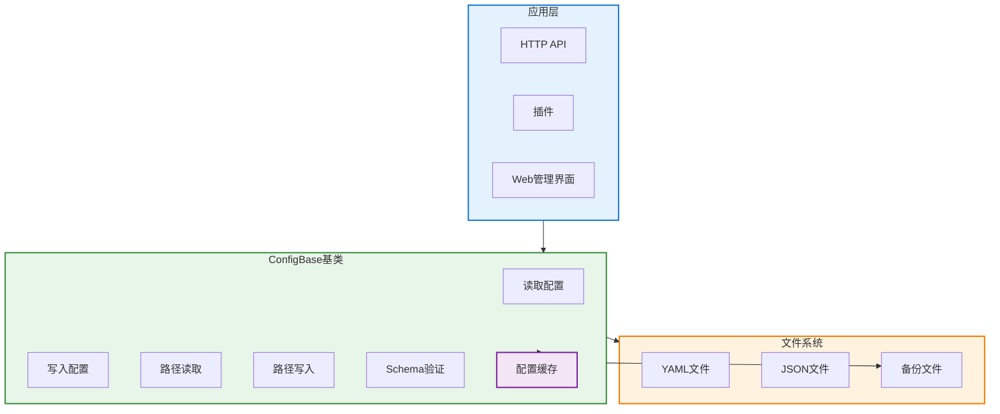
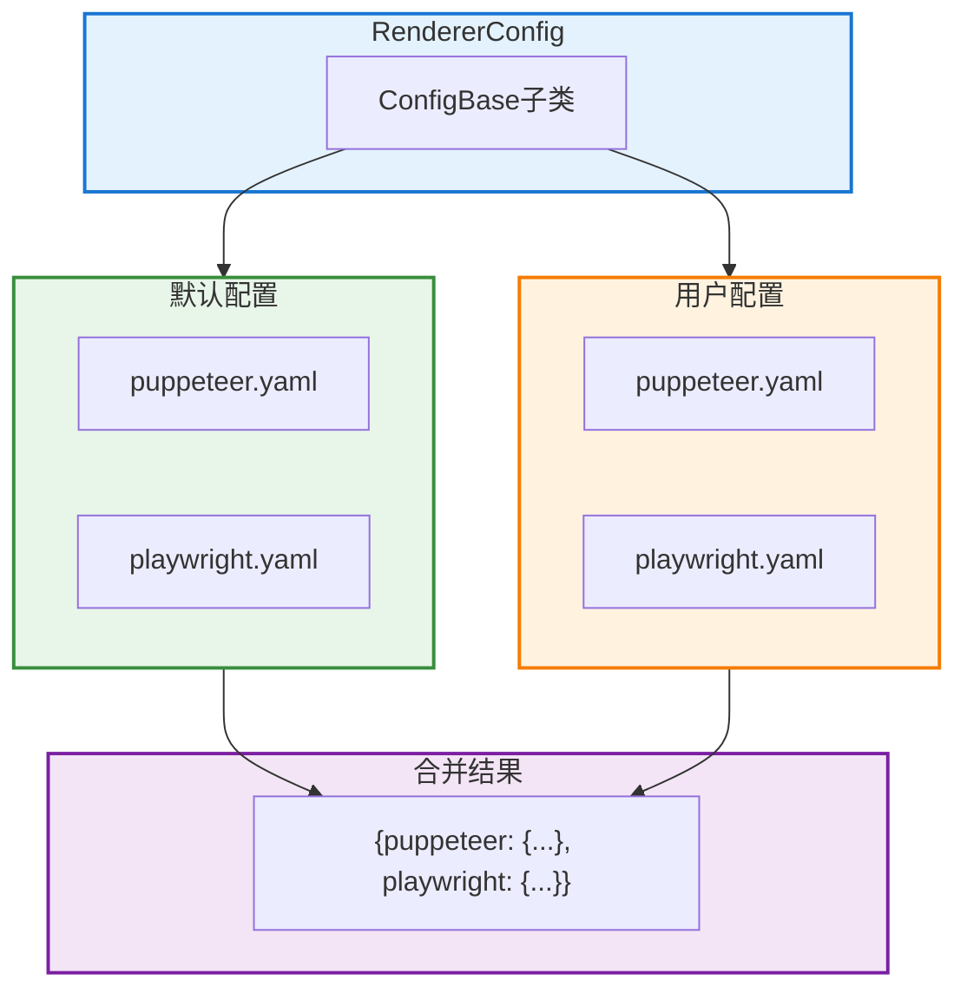
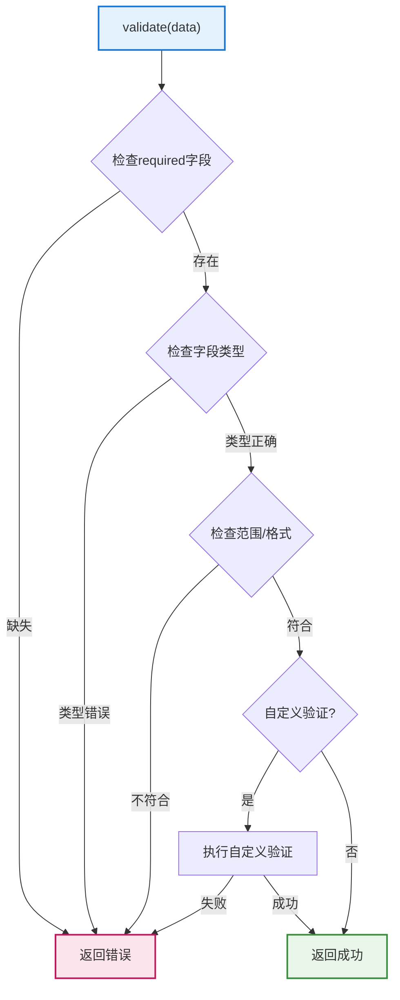

# ConfigBase 文档

> **文件位置**: `src/infrastructure/commonconfig/commonconfig.js`  
> **可扩展性**：ConfigBase是配置系统的核心基类。通过继承ConfigBase，开发者可以快速创建自定义配置类，支持动态路径、Schema验证、多文件配置等高级特性。详见 **[框架可扩展性指南](框架可扩展性指南.md)** ⭐

`ConfigBase` 是 XRK-AGT 的 **配置管理基类**，用于统一处理 YAML/JSON 配置文件的读写、缓存、备份、验证等功能。

### 扩展特性

- ✅ **动态路径**：支持函数式路径计算
- ✅ **Schema验证**：支持严格的类型和结构验证
- ✅ **配置缓存**：自动缓存（默认5秒），提升性能
- ✅ **自动备份**：写入时自动备份（`*.backup.时间戳`）
- ✅ **路径操作**：支持点号路径和数组下标（`get/set/delete/append/remove`）
- ✅ **多文件配置**：支持一个配置包含多个子文件（如 renderer 包含 puppeteer 和 playwright）
- ✅ **Schema 严格检查**：在构造阶段校验 `default/enum/itemType` 与 `type` 是否匹配，错误会直接抛出，避免运行期才发现类型问题
- ✅ **扁平化支持**：支持配置扁平化，便于前端编辑
- ✅ **类型安全**：完整的类型定义和验证，减少配置错误

---

## 架构概览



---

## 构造参数

```javascript
constructor(metadata = {})
```

**参数说明**：

| 参数 | 类型 | 说明 | 默认值 |
|------|------|------|--------|
| `name` | `string` | 配置名称（必填，用于日志和结构导出） | `'config'` |
| `displayName` | `string` | UI 上显示的友好名称 | `name` |
| `description` | `string` | 配置说明文案 | `''` |
| `filePath` | `string\|Function` | 相对路径字符串或动态路径函数 | `''` |
| `fileType` | `string` | `'yaml'` 或 `'json'` | `'yaml'` |
| `schema` | `Object` | 结构化校验规则 | `{}` |
| `multiFile` | `Object` | 多文件配置定义（可选） | `null` |

**filePath 格式**：
- 字符串：相对于项目根目录的路径，如 `'config/server.yaml'`
- 函数：动态路径函数 `(cfg) => 'data/server_bots/' + cfg.port + '/server.yaml'`

---

## 核心方法

### 文件操作

| 方法 | 说明 |
|------|------|
| `exists()` | 检查配置文件是否存在 |
| `read(useCache?)` | 读取并解析 YAML/JSON 内容，支持缓存（默认启用） |
| `write(data, options?)` | 写入配置，自动备份/校验/建目录 |
| `backup()` | 生成带时间戳的备份文件 |
| `getFilePath()` | 获取配置文件路径 |

### 路径操作

| 方法 | 说明 |
|------|------|
| `get(keyPath)` | 获取指定路径的值（支持点号路径和数组下标） |
| `set(keyPath, value, options)` | 设置指定路径的值 |
| `delete(keyPath, options)` | 删除指定路径的字段 |
| `append(keyPath, value, options)` | 向数组追加元素 |
| `remove(keyPath, indexOrPredicate, options)` | 从数组移除元素 |

**路径示例**：
- `'server.host'` - 对象属性
- `'server.proxy.domains[0].domain'` - 嵌套对象和数组

### 合并与重置

| 方法 | 说明 |
|------|------|
| `merge(newData, options?)` | 浅/深合并新配置并写回（`deep` 默认 `true`） |
| `reset(options?)` | 将配置重置为 `defaultConfig`（需子类定义） |
| `clearCache()` | 清空内存缓存 |

### 校验与结构

| 方法 | 说明 |
|------|------|
| `validate(data)` | 按 schema 校验并可附加自定义验证（返回 `{ valid, errors }`） |
| `getStructure()` | 返回用于前端动态表单的结构描述 |
| `flattenData(data)` | 扁平化配置数据（用于前端编辑） |
| `expandFlatData(flatData)` | 展开扁平化数据为嵌套结构 |

---

## 多文件配置

`ConfigBase` 支持一个配置包含多个子文件的情况（如 renderer 包含 puppeteer 和 playwright）。



**配置方式**：
```javascript
{
  name: 'renderer',
  filePath: (cfg) => `data/server_bots/${cfg.port}/renderers/{type}/config.yaml`, // 占位路径
  multiFile: {
    keys: ['puppeteer', 'playwright'],
    getFilePath: (key) => {
      const cfg = global.cfg;
      const port = cfg?.port ?? cfg?._port;
      return path.join(paths.root, `data/server_bots/${port}/renderers/${key}/config.yaml`);
    },
    getDefaultFilePath: (key) => {
      return path.join(paths.renderers, key, 'config_default.yaml');
    }
  }
}
```

**工作原理**：
- **读取**：依次读取每个 `key` 对应的文件（先读取默认配置，再读取实际配置并合并）
- **写入**：根据传入的数据对象，分别写入每个 `key` 对应的文件
- **扁平化**：自动处理嵌套结构，前端可通过扁平化路径进行编辑

---

## Schema 验证



`validate(data)` 提供轻量、可扩展的校验机制：

- 按 `schema.required` 检查必需字段
- 按 `schema.fields[field].type` 检测类型（`string/number/boolean/array/object`）
- 按 `min/max`、`minLength/maxLength`、`pattern`、`enum` 做范围与格式校验
- 对于 `null/undefined`，结合 `nullable` 控制是否允许
- 若子类实现了 `customValidate(data)`，则追加自定义校验
- 返回 `{ valid, errors }` 结构，在 `write` 时若无效会抛出错误

---

## 使用示例

### 单文件配置

```javascript
import ConfigBase from '#infrastructure/commonconfig/commonconfig.js';

export default class ServerConfig extends ConfigBase {
  constructor() {
    super({
      name: 'server',
      displayName: '服务器配置',
      filePath: (cfg) => `data/server_bots/${cfg.port || cfg._port}/server.yaml`,
      fileType: 'yaml',
      schema: {
        required: ['server'],
        fields: {
          'server.server.port': { type: 'number', min: 1, max: 65535 },
          'server.host': { type: 'string' }
        }
      }
    });
  }
}

// 使用
const config = new ServerConfig();
const data = await config.read();
await config.set('server.host', '0.0.0.0');
await config.write();
```

### 多文件配置

```javascript
export default class RendererConfig extends ConfigBase {
  constructor() {
    super({
      name: 'renderer',
      filePath: (cfg) => `data/server_bots/${cfg.port}/renderers/{type}/config.yaml`,
      multiFile: {
        keys: ['puppeteer', 'playwright'],
        getFilePath: (key) => {
          const port = global.cfg?.port ?? global.cfg?._port;
          return path.join(paths.root, `data/server_bots/${port}/renderers/${key}/config.yaml`);
        }
      }
    });
  }
}

// 使用
const config = new RendererConfig();
const data = await config.read(); // 返回 { puppeteer: {...}, playwright: {...} }
await config.write({ puppeteer: {...}, playwright: {...} });
```

---

## HTTP API 集成

Web 前端可通过 HTTP API 调用 `ConfigBase` 子类的方法：

| 端点 | 方法 | 说明 |
|------|------|------|
| `/api/config/:name/read` | GET | 读取配置（支持 `path` 参数读取子配置） |
| `/api/config/:name/batch-set` | POST | 批量扁平写入 |
| `/api/config/:name/flat-structure` | GET | 获取扁平化结构（用于前端表单） |
| `/api/config/:name/validate` | POST | 校验配置 |
| `/api/config/:name/write` | POST | 写入配置 |
| `/api/config/:name/backup` | POST | 备份配置 |

**使用示例**：
```javascript
// 前端调用示例
// 读取配置
const response = await fetch('/api/config/server/read');
const data = await response.json();

// 批量设置配置（扁平化）
await fetch('/api/config/server/batch-set', {
  method: 'POST',
  headers: { 'Content-Type': 'application/json' },
  body: JSON.stringify({
    flat: {
      'server.host': '0.0.0.0',
      'server.port': 8080
    }
  })
});
```

详见 [system-Core 配置管理API](system-core.md#3-配置管理api-configjs) 和 [HTTP API 文档](http-api.md)。

---

## 相关文档

- **[框架可扩展性指南](框架可扩展性指南.md)** - 扩展开发完整指南
- **[HTTP API文档](http-api.md)** - HTTP API基类文档
