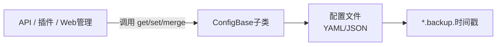

## ConfigBase 文档（src/infrastructure/commonconfig/commonconfig.js）

`ConfigBase` 是 XRK-AGT 的 **配置管理基类**，用于统一处理：

- YAML/JSON 配置文件的读写。
- 配置缓存与备份。
- 路径解析（支持动态路径）。
- 基于 schema 的基础验证。
- 按路径读写（支持对象与数组）。

具体的配置类型（如 server 配置、设备配置等）会继承此类，并在相应模块中定义。

---

## 总览：核心属性与方法



| 分类 | 名称 | 说明 |
|------|------|------|
| **构造参数** | `name` | 配置名称（用于日志和结构导出） |
| | `displayName` | UI 上显示的友好名称 |
| | `description` | 配置说明文案 |
| | `filePath` | 相对路径字符串或动态路径函数 `(cfg) => 'config/server_8086.yaml'` |
| | `fileType` | `'yaml'` 或 `'json'`（默认 `'yaml'`） |
| | `schema` | 结构化校验规则（必填项、字段类型、范围等） |
| **内部字段** | `fullPath` | 当 `filePath` 是字符串时预先计算的绝对路径 |
| | `_cache/_cacheTime/_cacheTTL` | 读缓存与缓存有效期（默认为 5 秒） |
| **文件相关方法** | `_resolveFilePath()` | 根据 `filePath` / `global.cfg` 动态计算实际路径 |
| | `getFilePath()` | 对外暴露的配置文件路径 |
| | `exists()` | 检查配置文件是否存在 |
| | `read(useCache?)` | 读取并解析 YAML/JSON 内容，支持缓存 |
| | `write(data, options?)` | 写入配置，自动备份/校验/建目录 |
| | `backup()` | 生成带时间戳的备份文件 |
| **路径操作方法** | `get/set/delete/append/remove` | 基于点号路径和数组下标精细读写配置 |
| **合并与重置** | `merge(newData, options?)` | 浅/深合并新配置并写回 |
| | `reset(options?)` | 将配置重置为 `defaultConfig` |
| | `clearCache()` | 清空内存缓存 |
| **校验与结构** | `validate(data)` | 按 schema 校验并可附加自定义验证 |
| | `getStructure()` | 返回用于前端动态表单的结构描述 |

---

## 构造参数与路径解析

构造函数接收一个 `metadata` 对象，常用字段：

- `name` / `displayName` / `description`：基础元数据。
- `filePath`：
  - 字符串：相对于项目根目录 `paths.root` 的路径，如 `config/server.yaml`。
  - 函数：动态路径函数 `(cfg) => 'data/server_bots/' + cfg._port + '/server.yaml'`。
- `fileType`：`'yaml'` / `'json'`。
- `schema`：结构定义。

路径解析：

- `_resolveFilePath()`：
  - 若 `filePath` 是函数：
    - 使用 `global.cfg` 或环境变量端口构造一个 `cfg` 对象。
    - 调用 `_getFilePath(cfg)` 得到相对路径，再拼接 `paths.root`。
  - 若 `fullPath` 已存在，直接返回。
  - 若都未设置，则使用默认约定：`paths.config/config/${name}.yaml`。
- `getFilePath()` 简单封装 `_resolveFilePath()`。

---

## 读取与写入（文件级）

### exists()

- 调用 `_resolveFilePath()` 获取路径并尝试 `fs.access`。
- 返回 `true/false` 表示文件是否存在。

### read(useCache = true)

1. 若启用缓存且未过期，直接返回 `_cache`。
2. 若文件不存在，抛出错误。
3. 根据 `fileType` 解析内容：
   - `yaml`：`yaml.parse(content)`。
   - `json`：`JSON.parse(content)`。
4. 更新 `_cache` 与 `_cacheTime`，返回数据对象。

### write(data, { backup = true, validate = true } = {})

1. 若 `validate` 为 `true`，先调用 `validate(data)`。
2. 若 `backup` 为 `true` 且文件存在，调用 `backup()`。
3. 确保目录存在。
4. 按 `fileType` 序列化：
   - YAML：`yaml.stringify(data, { indent: 2, lineWidth: 0 })`。
   - JSON：`JSON.stringify(data, null, 2)`。
5. 写入文件并更新 `_cache` 与 `_cacheTime`。

### backup()

- 生成 `filePath.backup.yyyy-MM-ddTHH-mm-ss` 文件，并复制当前内容。

---

## 按路径读写（对象级）

`ConfigBase` 提供了基于「点号路径 + 数组索引」的读写接口，适用于 Web 控制台或 API 细粒度修改配置：

- `get(keyPath)`：
  - `await read()` 获取完整对象。
  - `_getValueByPath(obj, keyPath)` 解析路径，如：
    - `server.host`
    - `server.proxy.domains[0].domain`

- `set(keyPath, value, options)`：
  - `read()` → `_setValueByPath` 写入 → `write(data, options)`。

- `delete(keyPath, options)`：
  - `_deleteValueByPath` 删除路径字段 → `write`。

- `append(keyPath, value, options)`：
  - 确认路径对应的是数组，`push` 新值并写回，否则抛错。

- `remove(keyPath, indexOrPredicate, options)`：
  - 若为数字：按索引 `splice`。
  - 若为函数：`findIndex` 出目标后移除。

> 典型用法：动态增删「反向代理域名」「白名单路径」「Webhook 列表」等数组配置。

---

## 合并、重置与缓存

- `merge(newData, { deep = true, ... } = {})`：
  - `current = await read()`。
  - 若 `deep` 为 `true`，使用 `_deepMerge(current, newData)`。
  - 否则浅拷贝 `{ ...current, ...newData }`。
  - 最终 `write(mergedData, options)`。

- `reset(options)`：
  - 要求子类定义 `this.defaultConfig`。
  - 直接 `write(this.defaultConfig, options)`。

- `clearCache()`：
  - 将 `_cache` 置空、时间置 0，强制下次 `read()` 重新从磁盘加载。

---

## 验证逻辑：`validate(data)`

`ConfigBase` 提供轻量、可扩展的校验机制：

- 按 `schema.required` 检查必需字段是否存在。
- 按 `schema.fields[field].type` 检测类型（`string/number/boolean/array/object`）。
- 按 `min/max` / `minLength/maxLength` / `pattern` / `enum` 做范围与格式校验。
- 对于 `null/undefined`，结合 `nullable` 控制是否允许。
- 若子类实现了 `customValidate(data)`，则追加自定义校验。
- 返回 `{ valid, errors }` 结构，在 `write` 时若无效会抛出错误。

---

## 与系统其它部分的关系

- `paths`：提供 `paths.root` / `paths.config` 等基础路径信息。
- `cfg`（`src/infrastructure/config/config.js`）：
  - 被 `Bot.run()` 初始化为 `global.cfg`。
  - 可被 `ConfigBase` 动态路径函数使用，根据端口/环境决定文件位置。
- Web 前端：
  - 可通过 HTTP API 调用 `ConfigBase` 子类的 `get/set/merge/getStructure` 方法，实现动态配置页面。

---

## 使用示例（子类）

```js
// 示例：定义一个 server 配置类
import ConfigBase from '#infrastructure/commonconfig/commonconfig.js';

export default class ServerConfig extends ConfigBase {
  constructor() {
    super({
      name: 'server',
      displayName: '服务器配置',
      description: 'HTTP/HTTPS 端口、域名、代理、CORS 等',
      filePath: (cfg) => `data/server_bots/${cfg._port}/server.yaml`,
      fileType: 'yaml',
      schema: {
        required: ['server'],
        fields: {
          server: { type: 'object' },
          'server.port': { type: 'number', min: 1, max: 65535 },
          'server.host': { type: 'string', pattern: '^.+$' }
        }
      }
    });
  }
}
```

在 API 中使用：

```js
// 伪代码：core/http/server-config.js
import ServerConfig from '#infrastructure/commonconfig/server-config.js';
const serverConfig = new ServerConfig();

export default {
  name: 'server-config',
  routes: [
    {
      method: 'GET',
      path: '/api/config/server',
      handler: async (req, res) => {
        const data = await serverConfig.read();
        res.json({ success: true, data });
      }
    },
    {
      method: 'POST',
      path: '/api/config/server',
      handler: async (req, res) => {
        await serverConfig.write(req.body);
        res.json({ success: true });
      }
    }
  ]
};
```

