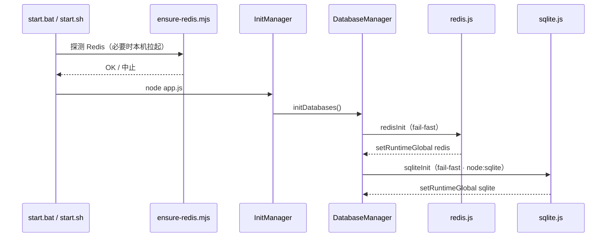

# Runtime 数据库（Redis + SQLite）

> **代码**：`src/infrastructure/redis.js` · `src/infrastructure/sqlite.js` · `src/infrastructure/database/index.js`  
> **配置模板**：`config/default_config/redis.yaml` · `config/default_config/sqlite.yaml`  
> Runtime **必需**：Redis（热数据 / 会话）+ SQLite（嵌入式落盘，Node 内置 `node:sqlite`）。  
> Mongo / Postgres / Qdrant 仍由可选业务 Core 引入（soft-skip）。

官方参考：[Node.js SQLite（node:sqlite）](https://nodejs.org/api/sqlite.html)（`DatabaseSync`，同步 API，封装 SQLite3 C API）。

---

## 文档索引

| 主题 | 文档 |
|------|------|
| 配置字段与路径 | 本文 · [config-base.md](config-base.md) · [app-dev.md](app-dev.md) |
| Docker | [docker.md](docker.md) |
| 插件内访问 | [plugin-base.md](plugin-base.md) |
| 启动链路 | [startup.md](startup.md) |

---

## 用途分工

| 存储 | 归属 | 典型用途 |
|------|------|----------|
| **Redis** | Runtime | `AGT:restart:` / 插件计数 / 会话热缓存 / HTTP 控制面 |
| **SQLite** | Runtime（`node:sqlite`） | 本地持久表、掉电可恢复状态、单机查询；**不替代** Redis |
| Mongo / PG / Qdrant | 可选 Core | 文档 / 关系 / 向量；soft-skip |

业务侧：

- Redis：裸名 **`redis`** 或 `getRedis()`
- SQLite：裸名 **`sqlite`** 或 `getSqlite()` / `withSqliteTransaction`

**禁止**再引入 npm `sqlite3` / `sqlite` / `sequelize` 做 Runtime 嵌入库（Node ≥26 已内置）。

---

## 启动与生命周期



- Redis：入口 `ensure-redis.mjs` + 运行时重试（见下节）。
- SQLite：打开 `filePath`（默认 `data/runtime/xrk_agt.db`），可选 WAL / foreign_keys / busy timeout。
- 关闭：`ProcessManager.cleanup()` → `closeDatabases()`（先 Redis 后 SQLite）。

| 变量 | 作用 |
|------|------|
| `XRK_FAST_START=1` | Redis 少重试 / 短超时 |
| `XRK_SQLITE_MEMORY=1` | 强制 `:memory:`（测试） |

---

## Redis

### 本机探测与拉起（`scripts/ensure-redis.mjs`）

| 步骤 | 行为 |
|------|------|
| 1. 探测 | Node `net` TCP |
| 2. Windows 服务 | `Memurai` → `Redis` |
| 3. 可执行文件 | Redis / Memurai / `PATH` |
| 4. Unix | `redis-server --daemonize yes` |

`XRK_REDIS_HOST`（默认 `127.0.0.1`）、`XRK_REDIS_PORT`（默认 `6379`）。

### 配置

| 配置 | 默认模板 | 运行时 |
|------|----------|--------|
| Redis | `config/default_config/redis.yaml` | `data/server_bots/redis.yaml` |

字段：`host`、`port`、`db`、`username`、`password`、`options.connectTimeout`。  
Schema：`core/system-Core/commonconfig/system.js`（全局段 `redis`）。

```javascript
if (redis?.isOpen) await redis.set('my:key', 'value')
import { getRedis } from '#infrastructure/database/index.js'
```

---

## SQLite（node:sqlite）

### 配置三件套

| 件 | 路径 |
|----|------|
| 默认模板 | `config/default_config/sqlite.yaml` |
| 运行时 | `data/server_bots/sqlite.yaml` |
| Schema | `core/system-Core/commonconfig/system/system-sqlite.js` |

字段：`enabled`、`filePath`、`memory`、`walMode`、`busyTimeoutMs`、`foreignKeys`。  
`enabled: false` → 启动失败（与 Redis 同为 Runtime 基础能力，勿随意关）。

### 业务使用

```javascript
// 裸名（启动后）
sqlite.prepare('SELECT 1 AS ok').get()

import { getSqlite, withSqliteTransaction } from '#infrastructure/database/index.js'
const db = getSqlite()
db.exec(`CREATE TABLE IF NOT EXISTS demo (id INTEGER PRIMARY KEY, v TEXT)`)
withSqliteTransaction((tx) => {
  tx.prepare('INSERT INTO demo (v) VALUES (?)').run('x')
})
```

`DatabaseSync` API 均为**同步**（`exec` / `prepare` / `get` / `all` / `run`）；勿包一层无意义的 Promise。详见 Node 文档。

框架内置表：`_xrk_runtime_meta`、`_xrk_runtime_kv`；业务可用 `sqliteKvGet/Set/Del(namespace, key)` 做本地标记（**不是** Redis 替代）。

### 就绪面

`GET /api/health` → `services.redis` 与 `services.sqlite` 任一 `down` → `unhealthy`（503）。

---

## 其它数据库（业务 Core）· 多模 SPI

Mongo / Postgres / Qdrant 由 `core/<db>-Core/` 自管连接，**不**进 `DatabaseManager`。  
通过 `registerPersistenceProvider` 注册探活 → `/api/health.services.persistence`（可选全挂 **不会** 单独打成 `unhealthy`）。

| 范围 | 保证 |
|------|------|
| Redis 内 / SQLite 内 | 各自语义（SQLite 用 `withSqliteTransaction`） |
| 跨引擎 | **仅最终一致**；无跨库 UoW（`PERSISTENCE_POLICY`） |

---

## FAQ

**可以不装 Redis 吗？**  
不可以。

**可以不用 SQLite 吗？**  
不建议。Runtime 把它与 Redis 同级初始化；测试可用 `XRK_SQLITE_MEMORY=1`。

**为何不用 npm sqlite3？**  
Node 26 提供 `node:sqlite`，零原生编译、与引擎版本对齐。旧 npm 包已从根依赖移除。

**配置改了要不要重启？**  
要。连接仅在启动期建立。

---

## 相关文档

- [startup.md](startup.md) · [docker.md](docker.md) · [app-dev.md](app-dev.md) · [config-base.md](config-base.md)

*最后更新：2026-07-18*
