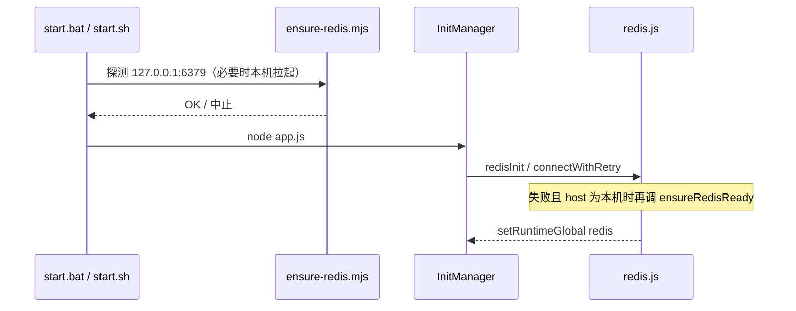

# Redis（框架内置数据库）

> **代码**：`src/infrastructure/redis.js` · `src/infrastructure/database/index.js`  
> **本机拉起**：`scripts/ensure-redis.mjs`（`start.bat` / `start.sh` / 连接重试共用）  
> Redis 为 Runtime **必需**；Mongo / Postgres / Vector 等由业务 Core 自行引入。

---

## 文档索引

| 主题 | 文档 |
|------|------|
| 配置字段与路径 | 本文 · [config-base.md](config-base.md) · [app-dev.md](app-dev.md) |
| Docker | [docker.md](docker.md) |
| 插件内访问 | [plugin-base.md](plugin-base.md) |
| 启动链路 | [startup.md](startup.md) |

---

## 用途

| 存储 | 归属 | 典型用途 |
|------|------|----------|
| **Redis** | Runtime 内置 | `AGT:restart:` / `AGT:shutdown:`、插件计数与会话、HTTP 控制面 |
| 其它 | 业务 Core | MongoDB 等，非 Runtime |

业务侧优先裸名 **`redis`** 或 `getRedis()`。

---

## 启动与生命周期



- **入口探测**：`start.bat` / `start.sh` → `node scripts/ensure-redis.mjs`（缺文件或不可达则中止）。
- **运行时重试**：`redis.js` 在 `connectWithRetry` 失败且 `host` 为回环地址时，**同一模块** `ensureRedisReady` 再试；远程 host 不拉起本机进程。
- **关闭**：`ProcessManager.cleanup()` → `closeDatabases()`。

---

## 本机探测与拉起（`scripts/ensure-redis.mjs`）

| 步骤 | 行为 |
|------|------|
| 1. 探测 | Node `net` TCP（**不依赖** PowerShell / WSL / redis-cli） |
| 2. Windows 服务 | `Memurai` → `Redis`（MSI 常见服务名）；坏掉的 ImagePath 静默跳过 |
| 3. 可执行文件 | `%ProgramFiles%\Redis\redis-server.exe`、Memurai、`PATH` |
| 4. Unix | `redis-server --daemonize yes`（须在 `PATH`） |

环境变量：`XRK_REDIS_HOST`（默认 `127.0.0.1`）、`XRK_REDIS_PORT`（默认 `6379`）。

薄包装 `scripts/ensure-redis.cmd` 仅转调 Node，便于手动双击；**逻辑只在 `.mjs`**。勿再整目录忽略 `scripts/`（gitignore 已白名单上述文件）。

**推荐**：Windows 用 **Memurai Developer**（服务开机自启）。MSI「Redis for Windows」亦可。勿用 WSL Redis（localhost 转发易断）。Docker 见 [docker.md](docker.md)。

---

## 配置

| 配置 | 默认模板 | 运行时（全局） |
|------|----------|----------------|
| Redis | `config/default_config/redis.yaml` | `data/server_bots/redis.yaml` |

字段：`host`、`port`、`db`（0–15）、`username`、`password`、`options.connectTimeout`。  
CommonConfig schema：`core/system-Core/commonconfig/system.js`。

```javascript
import runtimeConfig from '#infrastructure/config/config.js'
const { host, port } = runtimeConfig.redis
```

连接 URL 由 `buildRedisUrl` 生成；Docker 下 `normalizeHost` 可将 `127.0.0.1` 映射为服务名 `redis`。

| 变量 | 作用 |
|------|------|
| `XRK_FAST_START=1` | 减少连接重试 / 缩短超时（冒烟） |

连接失败记 error 并阻断启动（`finalizeDbConnectionFailure`）。

---

## 业务使用

```javascript
if (redis?.isOpen) await redis.set('my:key', 'value')
```

```javascript
import { getRedis } from '#infrastructure/database/index.js'
```

```javascript
import getDatabaseManager from '#infrastructure/database/index.js'
const redisOk = await getDatabaseManager().checkRedis()
```

---

## 本地与 Docker

| 场景 | host | 说明 |
|------|------|------|
| 本机 | `127.0.0.1:6379` | `ensure-redis.mjs` 负责探测/拉起 |
| docker-compose | 服务名 `redis` | 卷 `redis-data`；不跑本机服务拉起 |

---

## 连接实现要点

- 重试：`connectWithRetry`（`db-connect-utils.js`）
- URL 脱敏：`maskConnectionUrl`
- 健康检查：客户端就绪后定时 `ping`

勿在 Core 重复造连接池。

---

## 其它数据库（业务 Core）

Mongo / Postgres / Qdrant 由 `core/<产品>/` 引入，**不在** Runtime `database/index.js` 初始化。可选 Core 在依赖未装时 bootstrap **软失败**（不阻断 AGT）。

---

## FAQ

**可以不装 Redis 吗？**  
不可以。本机安装（Memurai / MSI / redis-server）或 `docker compose` 起 `redis`。

**配置改了要不要重启？**  
要。连接仅在启动期建立。

**和 `runtimeConfig.db`？**  
历史字段；框架内置连接以 **`redis.yaml`** 为准。

---

## 相关文档

- [startup.md](startup.md) · [docker.md](docker.md) · [app-dev.md](app-dev.md) · [config-base.md](config-base.md)

*最后更新：2026-07-14*
