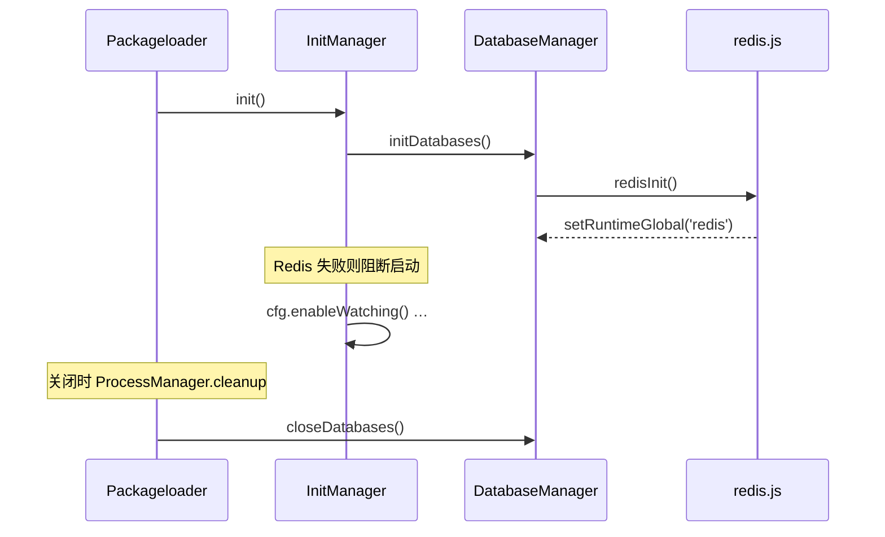

# Redis（框架内置数据库）

> **代码位置**：`src/infrastructure/database/index.js`、`src/infrastructure/redis.js`  
> **连接工具**：`src/utils/db-connect-utils.js`  
> **说明**：XRK-AGT 启动时初始化 **Redis** 作为框架内置数据库；其它存储由业务 Core 自行引入。

---

## 在文档体系中的位置

| 主题 | 文档 |
|------|------|
| 配置字段与路径 | 本文 + [config-base.md](config-base.md) · [app-dev.md §配置分类](app-dev.md#配置分类) |
| Docker 编排与持久化目录 | [docker.md](docker.md) |
| 分层与模块索引 | [底层架构设计.md](底层架构设计.md) |
| 插件内访问 | [plugin-base.md §系统集成](plugin-base.md#系统集成) |

---

## 用途（概览）

| 存储 | 归属 | 典型用途 |
|------|------|----------|
| **Redis** | **Runtime 内置** | 进程/机器人状态（`AGT:restart:`、`AGT:shutdown:`）、插件计数与会话键、HTTP 控制面、重启插件上下文 |
| **其它存储** | **业务 Core** | 企业自行部署（MongoDB 等），非 Runtime |

插件与 HTTP 优先使用 **裸名 `redis`** 或 `getRedis()`。

---

## 启动与生命周期



- **触发点**：`src/infrastructure/config/loader.js` → `InitManager.init()` 在 `setLog()`、`cfg.warmupConfigs()` 之后调用 `initDatabases()`。
- **关闭**：`ProcessManager.cleanup()` → `closeDatabases()`（与 Ctrl+C 三击、`registerShutdownHook` 协同，见 [bot.md](bot.md)）。

---

## 配置

### 模板与运行时路径

| 配置 | 默认模板 | 运行时（全局，不按端口） |
|------|----------|--------------------------|
| Redis | `config/default_config/redis.yaml` | `data/server_bots/redis.yaml` |

首次运行由 ConfigBase 从 `default_config` 复制到 `data/server_bots/`。Web 控制台 / CommonConfig 亦可编辑（schema 在 `core/system-Core/commonconfig/system.js`）。

### 主要字段

**Redis**（`redis.yaml`）：`host`、`port`、`db`（0–15）、`username`、`password`、`options.connectTimeout`。

### 读取方式

```javascript
import cfg from '#infrastructure/config/config.js';

const { host, port } = cfg.redis;
```

业务代码在连接建立后使用客户端，而非重复拼 URL（连接串由 `redis.js` 内 `buildRedisUrl` 生成；Docker 下 `normalizeHost` 会将 `127.0.0.1` 映射为服务名 `redis`）。

---

## 环境变量

| 变量 | 作用 |
|------|------|
| `XRK_FAST_START=1` | 减少连接重试次数、缩短超时（测试/快速冒烟） |

Redis 在 `DatabaseManager.init()` 中连接失败会记 **error** 并阻断正常启动。

---

## 在业务代码中使用

### 推荐访问方式

```javascript
// 插件 / 事件 / Tasker（连接已由框架建立）
if (redis?.isOpen) {
  await redis.set('my:key', 'value');
}
```

```javascript
// HTTP API（推荐 import，便于判空）
import { getRedis } from '#infrastructure/database/index.js';
```

### 健康检查

```javascript
import getDatabaseManager from '#infrastructure/database/index.js';

const { redis } = await getDatabaseManager().getHealthStatus();
```

system-Core HTTP（如 `core/system-Core/http/core.js`）与 `src/modules/systemmonitor.js` 会引用上述能力做状态展示。

---

## 本地与 Docker

| 场景 | Redis host | 数据目录 |
|------|------------|----------|
| 本机开发 | `127.0.0.1:6379` | 按本机 redis 安装 |
| docker-compose | 服务名 `redis` | 卷 `redis-data` |

连接失败时，非生产环境日志会提示手动启动命令。完整编排见 [docker.md](docker.md)。

**Windows**（`start.bat` → `scripts/ensure-redis.cmd`，探测 `127.0.0.1:6379`）：

1. 已在监听则直接通过  
2. 依次尝试服务 **`Memurai`**、**`Redis`**（MSI「Redis for Windows」常用服务名）  
3. 再试 `%ProgramFiles%\Redis\redis-server.exe` / Memurai 可执行文件 / PATH 上的 `redis-server`

推荐 **Memurai Developer**（服务开机自启，CLI：`memurai-cli` 或 `%ProgramFiles%\Memurai\memurai-cli.exe`）。MSI Redis 亦可；勿用 WSL Redis（localhost 转发易断）。`ensure-redis.cmd` / `probe-redis-port.ps1` 已入库，勿再整目录忽略 `scripts/`。

---

## 连接实现要点

- **重试**：`connectWithRetry`（`db-connect-utils.js`），默认最多 3 次；失败走 `finalizeDbConnectionFailure`（`process.exit(1)`）。
- **日志脱敏**：`maskConnectionUrl` 隐藏 URL 中的密码。
- **健康检查**：客户端就绪后定时 ping（间隔见 `redis.js` 内 `HEALTH_CHECK_INTERVAL`）。

扩展连接行为应改 `redis.js` 或 `db-connect-utils.js`（基础设施层），**不要在 Core 重复实现连接池**。

---

## 其它数据库（业务 Core）

MongoDB / Postgres / Qdrant（Vector）由 `core/<产品>/` 自行引入，**不在** Runtime `database/index.js` 初始化；亦无 `getMongoDb` 等 Runtime 导出。业务侧应：

```javascript
const { getDb } = await import('../../mongodb-Core/lib/index.js');
```

可选存储 Core（mongodb / postgres / vector）在服务未就绪或 npm 依赖未装时 **bootstrap 软失败**（warn，不阻断 AGT）。缺少 `mongodb` / `pg` 等包时，插件 Loader 会归类为「缺少 npm 依赖」并提示 `pnpm add`。

---

## 常见问题

### Q: 可以不装 Redis 吗？

不可以。Redis 为框架必需依赖；请本机安装或通过 `docker-compose` 启动 `redis` 服务。

### Q: 配置改了要不要重启？

全局 `redis.yaml` 变更后需**重启进程**（连接在启动期建立；热重载不负责重连数据库）。

### Q: 和 `cfg.db` 的关系？

CommonConfig 列表中含历史字段 `db`；当前框架内置连接以 **`redis.yaml`** 为准，无单独 `db.yaml` 模板。

---

## 相关文档

- [app-dev.md](app-dev.md) — `cfg.redis` 与全局配置表
- [docker.md](docker.md) — 容器、卷、环境变量
- [config-base.md](config-base.md) — ConfigBase 读写与复制默认模板
- [底层架构设计.md](底层架构设计.md) — 基础设施分层

---

*最后更新：2026-07-13*
