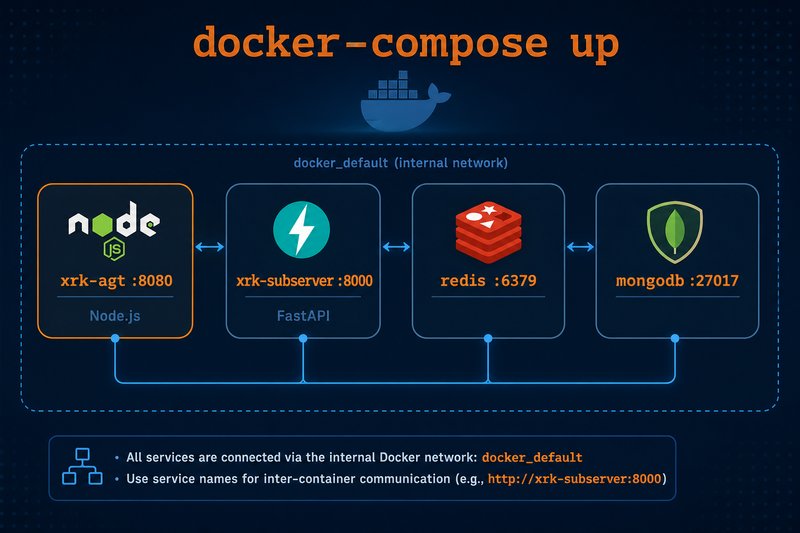

# Docker 部署指南

> **文件位置**：`docker-compose.yml`、`Dockerfile`  
> **说明**：本文档介绍如何使用 Docker 容器化部署 XRK-AGT，支持 Windows 10+ / Linux / macOS，包括主服务端、Python 子服务端、Redis 和 MongoDB 的容器化部署。

### 核心特性

- ✅ **一键部署**：Docker Compose 一键启动所有服务
- ✅ **自动构建**：自动构建 Python 子服务端，无需手动配置
- ✅ **无内置模型**：LLM/ASR/TTS 均走外部 API 或本机 Ollama 等；**容器内不下载、不打包** Whisper/ONNX 等权重
- ✅ **数据持久化**：支持数据、日志、配置的持久化存储
- ✅ **代理支持**：按需为容器出网（调用 LLM API 等）配置 `HTTP_PROXY`
- ✅ **健康检查**：内置健康检查机制，确保服务正常运行

---

## 📚 目录

- [概述](#概述)
- [快速开始](#快速开始)
- [Docker 构建说明](#docker-构建说明)
- [代理配置](#代理配置)
- [数据持久化](#数据持久化)
- [自动配置](#自动配置)
- [环境变量](#环境变量)
- [故障排查](#故障排查)
- [生产环境建议](#生产环境建议)
- [相关文档](#相关文档)

---

## 概述



服务定义见根目录 `docker-compose.yml`（`xrk-agt`、`xrk-subserver`、`redis`、`mongodb`）。

## 快速开始

### 1. 克隆项目

```bash
git clone --depth=1 https://github.com/sunflowermm/XRK-AGT.git
cd XRK-AGT
```

### 2. 配置环境变量

创建 `.env` 文件（可选，用于自定义配置）：

```bash
# 主服务端口（默认 8080）
XRK_SERVER_PORT=8080

# 代理配置（可选：容器访问外网 LLM / Git 等，非模型下载）
HTTP_PROXY=http://host.docker.internal:7890
HTTPS_PROXY=http://host.docker.internal:7890
NO_PROXY=127.0.0.1,localhost,xrk-agt,redis,mongodb

# MongoDB 认证（可选）
MONGO_ROOT_USERNAME=admin
MONGO_ROOT_PASSWORD=password
```

### 3. 构建并启动服务

```bash
# 构建并启动所有服务（包括子服务端）
docker-compose up -d

# 查看日志
docker-compose logs -f

# 停止服务
docker-compose down
```

**服务说明：**
- `xrk-agt`: 主服务（端口：`${XRK_SERVER_PORT:-8080}`）
  - 提供HTTP/HTTPS/WebSocket服务
  - 提供AI工作流和MCP工具
  - 提供Web控制台（`/xrk/`）
- `xrk-subserver`: Python 子服务端（端口：8000，**自动构建**）
  - 提供底层系统接口（`/api/system/*`）
  - 可按 `subserver/pyserver/apis/` 结构挂载自定义 API
- `redis`: Redis 缓存服务（端口：6379，内部）
  - 用于缓存和会话管理
  - 数据持久化到 `data/redis/`
- `mongodb`: MongoDB 数据库服务（端口：27017，内部）
  - 用于数据存储（可选）
  - 数据持久化到 `data/mongodb/`

### 4. 验证服务

```bash
# 查看服务状态
docker-compose ps

# 查看日志
docker-compose logs -f xrk-agt
docker-compose logs -f xrk-subserver

# 健康检查
curl http://localhost:8080/health
curl http://localhost:8000/health
```

## Docker 构建说明

### 自动构建子服务端

Docker 构建时会自动安装 Python 运行依赖（FastAPI、uvicorn、pyyaml）并配置虚拟环境。

**构建阶段**（`Dockerfile`）：
- 安装 Python 3 和构建工具、`uv` 包管理器
- 创建 Python 虚拟环境并安装底层依赖，清理构建缓存

**运行阶段**：
- 复制构建好的虚拟环境并启动子服务端服务

### Redis

- **镜像**：`redis:7-alpine`
- **端口**：6379（内部）
- **持久化**：AOF 已启用

### MongoDB

- **镜像**：`mongo:8.0`
- **端口**：27017（内部）
- **认证**：通过 `MONGO_ROOT_USERNAME` 和 `MONGO_ROOT_PASSWORD` 设置

## 代理配置

### 为什么需要代理？

Docker 容器内的应用无法直接使用宿主机的系统代理设置。当主服务需要访问**外网 LLM API**、Git、或子服务端扩展 API 拉取外部资源时，需通过环境变量传入代理（**与「模型下载」无关**——当前版本不在镜像或启动流程中预拉 AI 权重）。

### 配置代理（按需）

#### 方式 1：使用 .env 文件（推荐）

```bash
# .env
HTTP_PROXY=http://127.0.0.1:7890
HTTPS_PROXY=http://127.0.0.1:7890
```

#### 方式 2：环境变量

```bash
# Linux/macOS
export HTTP_PROXY=http://127.0.0.1:7890
export HTTPS_PROXY=http://127.0.0.1:7890
docker-compose up -d

# Windows PowerShell
$env:HTTP_PROXY="http://127.0.0.1:7890"
$env:HTTPS_PROXY="http://127.0.0.1:7890"
docker-compose up -d
```

#### 方式 3：Windows/Mac Docker Desktop

如果 Clash 监听 `127.0.0.1:7890`，容器内需要使用：

```bash
HTTP_PROXY=http://host.docker.internal:7890
HTTPS_PROXY=http://host.docker.internal:7890
```

### 代理说明

- **容器出网请求**：可按需通过代理访问外网
- **主服务端连接**：不走代理（已自动排除）
- **本地服务**：Redis、MongoDB 不走代理（已自动排除）

## 轻量性与适用场景

| 维度 | 现状 | 说明 |
|------|------|------|
| **子服务端** | 轻 | FastAPI + uvicorn + pyyaml；无 PyTorch/Whisper；历史 AI 推理接口已下线（见 [subserver-api.md](subserver-api.md)） |
| **主镜像** | 偏重 | `node:26-slim` + 完整 `node_modules` + **Chromium**（截图/Playwright 渲染）；构建后常见 **1GB+** |
| **Compose 默认** | 四服务 | `xrk-agt` + `xrk-subserver`（同镜像不同 command）+ `redis:7-alpine` + `mongo:8.0`；内存上限合计约 **4.5GB**（见 `docker-compose.yml` `deploy.resources`） |
| **LLM 推理** | 不在容器内 | 配置各 `*_llm.yaml` 指向云端或宿主机 Ollama；镜像不含模型文件 |

**算轻量吗？** 相对「带 GPU + 本地大模型」的 AI 栈，**是的**（无模型权重、子服务极简）。相对「纯 Node API + SQLite」，**不算**（Chromium + Mongo + 双应用容器）。

**好用吗？** 开箱 `docker-compose up -d` 即可跑通控制台与 Redis/Mongo；注意：

1. 首次构建需拉 Node/Python 依赖，耗时取决于网络（可配代理）。
2. 不需要 Python 扩展 API 时，可只起 `xrk-agt` + `redis`（自行改 compose 或 `docker-compose up xrk-agt redis`）。
3. MongoDB 在 compose 中为默认依赖；本机调试可用 `XRK_OPTIONAL_DB=1`（见 [database.md](database.md)），生产仍建议至少 Redis 或 Mongo 其一。
4. `.env` 中的 `HTTP_PROXY` 需写入 compose 才会进容器（见下节环境变量表）。

## 数据持久化

以下目录通过 volume 挂载：

- `./data` - 运行时数据（配置、业务数据、子服务配置等）
- `./logs` - 日志文件
- `./config` - 配置文件
- `./resources` - 资源文件

## 自动配置

Docker 环境自动配置：

- **Redis/MongoDB**：自动将配置中的 `127.0.0.1` 替换为 Docker 服务名
- **主服务端连接**：子服务端通过环境变量自动连接主服务端
- **代理隔离**：可用 `NO_PROXY` 排除内部服务地址

## 环境变量

| 变量名 | 说明 | 默认值 |
|--------|------|--------|
| `XRK_SERVER_PORT` | 主服务端口 | `8080` |
| `HTTP_PROXY` / `HTTPS_PROXY` | 容器出网代理（LLM API 等） | 空（不启用） |
| `NO_PROXY` | 不走代理的地址 | `127.0.0.1,localhost,redis,mongodb,xrk-agt` |
| `MONGO_ROOT_USERNAME` | MongoDB 用户名 | 空 |
| `MONGO_ROOT_PASSWORD` | MongoDB 密码 | 空 |

## 故障排查

### 查看服务状态

```bash
docker-compose ps
```

### 查看日志

```bash
# 所有服务
docker-compose logs -f

# 特定服务
docker-compose logs -f xrk-agt
docker-compose logs -f xrk-subserver
```

### 进入容器调试

```bash
docker exec -it xrk-agt sh
docker exec -it xrk-subserver sh
```

### 常见问题

#### 端口被占用

**问题**：启动时提示端口已被占用

**解决方案**：
```bash
# 方式1：修改 .env 中的端口
XRK_SERVER_PORT=3000 docker-compose up -d

# 方式2：查找并停止占用端口的进程
# Linux/macOS
lsof -i :8080
kill -9 <PID>

# Windows
netstat -ano | findstr :8080
taskkill /PID <PID> /F
```

#### 健康检查失败

**问题**：容器启动后健康检查失败，服务无法访问

**排查步骤**：
```bash
# 1. 查看服务日志
docker-compose logs xrk-agt
docker-compose logs xrk-subserver

# 2. 检查容器状态
docker-compose ps

# 3. 进入容器检查
docker exec -it xrk-agt sh
# 在容器内检查服务是否正常运行
curl http://localhost:8080/health

# 4. 检查网络连接
docker exec -it xrk-subserver sh
curl http://xrk-agt:8080/health
```

**常见原因**：
- 服务启动时间过长，健康检查超时
- 配置文件错误导致服务启动失败
- 依赖服务（Redis/MongoDB）未就绪

#### 容器网络访问失败

**问题**：子服务端无法访问外部网络资源

**解决方案**：
```bash
# 1. 检查代理配置
docker exec xrk-subserver env | grep -i proxy

# 2. 验证代理连接
docker exec xrk-subserver curl -I https://www.google.com

# 3. 查看子服务端日志
docker-compose logs xrk-subserver
```

#### 主服务端连接失败

**问题**：子服务端无法连接到主服务端

**排查步骤**：
```bash
# 1. 检查主服务端是否正常运行
docker-compose ps xrk-agt

# 2. 检查网络连接
docker exec -it xrk-subserver sh
curl http://xrk-agt:8080/health

# 3. 检查环境变量
docker exec xrk-subserver env | grep -i MAIN_SERVER

# 4. 查看子服务端日志
docker-compose logs xrk-subserver | grep -i "main server"
```

**解决方案**：
- 确保主服务端已启动：`docker-compose up -d xrk-agt`
- 检查服务名称是否正确（Docker Compose 网络中使用服务名 `xrk-agt`）
- 确认端口配置正确

#### 数据持久化问题

**问题**：重启容器后数据丢失

**解决方案**：
```bash
# 1. 检查数据卷挂载
docker-compose config | grep -A 5 volumes

# 2. 确认数据目录存在
ls -la data/

# 3. 检查权限
chmod -R 755 data/
```

#### 内存不足

**问题**：容器因内存不足被杀死

**解决方案**：
```bash
# 1. 检查资源限制
docker stats

# 2. 调整 docker-compose.yml 中的资源限制
# 增加 memory 限制或移除限制

# 3. 子服务端仅承载扩展 API 时，通常内存占用低于重型 AI 推理场景
```

## 生产环境建议

### 1. 反向代理

使用 Nginx 或 Traefik 提供 HTTPS 和负载均衡。

**Nginx 配置示例**：
```nginx
server {
    listen 80;
    server_name your-domain.com;
    
    location / {
        proxy_pass http://localhost:8080;
        proxy_set_header Host $host;
        proxy_set_header X-Real-IP $remote_addr;
        proxy_set_header X-Forwarded-For $proxy_add_x_forwarded_for;
        proxy_set_header X-Forwarded-Proto $scheme;
        
        # WebSocket 支持
        proxy_http_version 1.1;
        proxy_set_header Upgrade $http_upgrade;
        proxy_set_header Connection "upgrade";
    }
}
```

### 2. 资源限制

`docker-compose.yml` 中已配置资源限制，可根据需求调整。

**推荐配置**：
- 主服务端：至少 512MB 内存
- 子服务端：按扩展 API 复杂度评估内存（基础系统接口场景占用较低）
- Redis：至少 256MB 内存
- MongoDB：至少 512MB 内存

### 3. 定期备份

定期备份 `data` 和 `config` 目录。

**备份脚本示例**：
```bash
#!/bin/bash
# backup.sh
BACKUP_DIR="/backup/xrk-agt"
DATE=$(date +%Y%m%d_%H%M%S)

mkdir -p $BACKUP_DIR

# 备份数据目录
tar -czf $BACKUP_DIR/data_$DATE.tar.gz data/

# 备份配置目录
tar -czf $BACKUP_DIR/config_$DATE.tar.gz config/

# 保留最近7天的备份
find $BACKUP_DIR -name "*.tar.gz" -mtime +7 -delete
```

### 4. 监控和日志

**日志**：`docker-compose.yml` 已配置日志驱动；生产环境可接入 ELK 等日志收集工具。

**健康检查**：
```bash
# 设置监控脚本
#!/bin/bash
# health-check.sh
curl -f http://localhost:8080/health || exit 1
```

### 5. 安全建议

- 使用强密码（MongoDB、Redis），为 Redis/MongoDB 设置密码
- 配置防火墙规则，限制 API 访问（使用 API Key 认证）
- 使用 HTTPS（通过反向代理）
- 定期更新镜像和依赖
- 使用非 root 用户运行（Docker 已配置）、使用 secrets 管理敏感信息

### 6. 性能优化

- 使用 SSD 存储（提升数据库性能）
- 配置 Redis 持久化策略
- 优化子服务端扩展 API 的资源使用
- 使用 CDN 加速静态资源

---

## 相关文档

- **[子服务端 API 文档](subserver-api.md)** - Python 子服务端的 API 说明
- **[Bot 主类文档](bot.md)** - Bot 主类说明，包含 HTTP/WebSocket 服务
- **[应用开发指南](app-dev.md)** - 应用开发完整指南
- **[system-Core 特性](system-core.md)** - system-Core 内置模块说明

---

*最后更新：2026-06-19*
