# 工厂系统文档

> **文件位置**: `src/factory/`  
> **可扩展性**：工厂系统是 XRK-AGT 的核心扩展点之一。通过工厂模式，开发者可以轻松接入新的 AI 服务提供商，实现统一的多厂商支持。详见 **[框架可扩展性指南](框架可扩展性指南.md)** ⭐

XRK-AGT 采用**工厂模式**统一管理多种 AI 服务提供商，包括大语言模型（LLM）、语音识别（ASR）和语音合成（TTS）。工厂系统提供了统一的接口，屏蔽了不同厂商的 API 差异，让开发者可以轻松切换和扩展服务提供商。多模态识图能力由各家 LLM 自身的多模态接口提供，不再通过单独的「识图工厂」转发。

### 核心特性

- ✅ **统一接口**：所有工厂提供一致的 API，简化调用逻辑
- ✅ **多厂商支持**：每个工厂支持多个服务提供商，可动态切换
- ✅ **易于扩展**：通过 `registerProvider` 方法轻松注册新的提供商
- ✅ **配置驱动**：通过配置文件选择提供商，无需修改代码
- ✅ **自动路由**：根据配置自动选择对应的服务提供商
- ✅ **错误处理**：统一的错误处理和日志记录

---

## 📚 目录

- [架构概览](#架构概览)
- [工厂类型](#工厂类型)
- [配置说明](#配置说明)
- [扩展工厂](#扩展工厂)
- [工厂方法参考](#工厂方法参考)
- [使用场景](#使用场景)
- [最佳实践](#最佳实践)
- [常见问题](#常见问题)
- [AI HTTP API 路由](#ai-http-api-路由)
- [相关文档](#相关文档)

---

## 架构概览

### 工厂系统架构图

```mermaid
flowchart LR
    subgraph App["💼 应用层"]
        direction TB
        AIStream["🌊 AIStream工作流<br/>AI工作流基类"]
        Device["🖥️ 设备服务<br/>ASR/TTS集成"]
        Plugin["🔌 插件<br/>调用工作流"]
        HTTPAPI["🌐 HTTP API<br/>/api/v3/chat/completions"]
    end
    
    subgraph Factory["🏭 工厂层"]
        direction TB
        LLMFactory["🤖 LLMFactory<br/>大语言模型工厂<br/>统一LLM接口"]
        ASRFactory["🎤 ASRFactory<br/>语音识别工厂<br/>语音转文本"]
        TTSFactory["🔊 TTSFactory<br/>语音合成工厂<br/>文本转语音"]
    end

    subgraph Providers["🔌 提供商实现"]
        direction TB
        LLMProviders["📡 LLM提供商（含多模态）<br/>gptgod/volcengine/xiaomimimo<br/>openai/gemini/anthropic<br/>azure_openai/openai_compat"]
        ASRProviders["🎙️ ASR提供商<br/>volcengine"]
        TTSProviders["🔊 TTS提供商<br/>volcengine"]
    end
    
    App -->|"调用"| Factory
    Factory -->|"路由"| Providers
    
    style App fill:#4A90E2,stroke:#2E5C8A,stroke-width:2px,color:#fff
    style Factory fill:#50C878,stroke:#3FA060,stroke-width:3px,color:#fff
    style Providers fill:#FFA500,stroke:#CC8400,stroke-width:2px,color:#fff
    style LLMFactory fill:#9B59B6,stroke:#7D3C98,stroke-width:2px,color:#fff
    style ASRFactory fill:#3498DB,stroke:#2980B9,stroke-width:2px,color:#fff
    style TTSFactory fill:#E74C3C,stroke:#C0392B,stroke-width:2px,color:#fff
```



### 工厂调用流程

```mermaid
sequenceDiagram
    participant App as 💼 应用层
    participant Factory as 🏭 工厂类
    participant Config as ⚙️ 配置系统
    participant Provider as 🔌 提供商客户端
    
    Note over App,Provider: 🔄 工厂调用流程
    
    App->>Config: 📖 读取配置<br/>选择提供商<br/>aistream.llm.Provider
    Config-->>App: ✅ 返回配置对象<br/>provider配置
    App->>Factory: 🏭 createClient(config)<br/>创建客户端
    Factory->>Factory: 🔍 根据 provider 选择工厂函数<br/>LLMFactory.hasProvider()
    Factory->>Provider: 📦 创建客户端实例<br/>new ProviderClient(config)
    Provider-->>Factory: ✅ 返回客户端实例
    Factory-->>App: 📤 返回客户端实例
    App->>Provider: 📞 调用服务方法<br/>chat() / chatStream()
    Provider-->>App: ✅ 返回结果<br/>AI响应文本
    
    Note over App: ✨ 调用完成
```



---

## 工厂类型

### 1. LLMFactory（大语言模型工厂）

**文件位置**: `src/factory/llm/LLMFactory.js`

LLMFactory 负责管理所有大语言模型服务提供商，支持多种 LLM API 协议。

#### 支持的提供商

| 提供商 | 标识符 | 说明 | 接口地址 | 多模态支持 |
|--------|--------|------|----------|-----------|
| GPTGod | `gptgod` | GPTGod 大语言模型，支持识图功能 | `https://api.gptgod.online/v1` | ✅ 支持 |
| 火山引擎 | `volcengine` | 火山引擎豆包大模型 | `https://ark.cn-beijing.volces.com/api/v3` | ✅ 支持 |
| 小米 MiMo | `xiaomimimo` | 兼容 OpenAI API 的 MiMo 大语言模型（仅文本） | `https://api.xiaomimimo.com/v1` | ❌ 不支持 |
| OpenAI | `openai` | OpenAI Chat Completions | `https://api.openai.com/v1` | ✅ 支持 |
| Gemini | `gemini` | Google Generative Language API | `https://generativelanguage.googleapis.com/v1beta` | ✅ 支持 |
| OpenAI 兼容 | `openai_compat` | 任意 OpenAI-like Chat Completions（可自定义 baseUrl） | 可配置 | 取决于后端 |
| Anthropic | `anthropic` | Claude Messages API | `https://api.anthropic.com/v1` | ✅ 支持 |
| Azure OpenAI | `azure_openai` | Azure OpenAI（deployment + api-version 体系） | 可配置 | ✅ 支持 |

**多模态说明**：
- 多模态能力由各家 LLM 自身的多模态接口提供
- 支持图片识别、图片理解等功能
- 通过 `messages` 数组中的 `image_url` 字段传递图片

#### 基本用法

```javascript
import LLMFactory from '#factory/llm/LLMFactory.js';

// 创建客户端
const config = {
  provider: 'gptgod',  // 选择提供商
  apiKey: 'your-api-key',
  baseUrl: 'https://api.gptgod.online/v1',
  temperature: 0.7,
  maxTokens: 2000
};

const client = LLMFactory.createClient(config);

// 调用聊天接口
const messages = [
  { role: 'user', content: '你好' }
];

// 非流式调用
const response = await client.chat(messages);
console.log(response); // AI 回复文本

// 流式调用
const stream = await client.chatStream(messages, (chunk) => {
  process.stdout.write(chunk);
});
```

#### 客户端接口规范

所有 LLM 客户端必须实现以下接口：

```javascript
class LLMClient {
  /**
   * 非流式聊天
   * @param {Array} messages - 消息数组
   * @param {Object} overrides - 覆盖配置
   * @returns {Promise<string>} AI 回复文本
   */
  async chat(messages, overrides = {}) {}

  /**
   * 流式聊天
   * @param {Array} messages - 消息数组
   * @param {Function} onChunk - 数据块回调函数
   * @param {Object} overrides - 覆盖配置
   * @returns {Promise<string>} 完整回复文本
   */
  async chatStream(messages, onChunk, overrides = {}) {}
}
```

#### 特殊功能

- **Tool Calling 支持**：所有 LLM 客户端都支持工具调用，通过 `MCPToolAdapter` 统一处理
- **多模态输入**：部分 LLM（如 GPTGod、Volcengine、OpenAI、Gemini、Azure OpenAI 等）直接支持图片输入，消息结构会通过 `transformMessagesWithVision` 统一转成各家兼容的 text + image_url（含 base64 data URL）格式。

---

### 2. ASRFactory（语音识别工厂）

**文件位置**: `src/factory/asr/ASRFactory.js`

ASRFactory 负责管理语音识别服务提供商，将语音转换为文本。

#### 支持的提供商

| 提供商 | 标识符 | 说明 |
|--------|--------|------|
| 火山引擎 | `volcengine` | 火山引擎语音识别服务，支持实时流式识别 |

#### 基本用法

```javascript
import ASRFactory from '#factory/asr/ASRFactory.js';

// 创建客户端
const config = {
  provider: 'volcengine',
  enabled: true,
  apiKey: 'your-api-key',
  appId: 'your-app-id',
  // ... 其他配置
};

const deviceId = 'device-001';
const client = ASRFactory.createClient(deviceId, config, Bot);

// 启动识别
await client.start();

// 发送音频数据
client.sendAudio(audioBuffer);

// 监听识别结果
client.on('result', (text) => {
  console.log('识别结果:', text);
});

// 停止识别
await client.stop();
```

#### 客户端接口规范

所有 ASR 客户端必须实现以下接口：

```javascript
class ASRClient {
  /**
   * 启动识别
   * @returns {Promise<void>}
   */
  async start() {}

  /**
   * 发送音频数据
   * @param {Buffer} audioData - 音频数据
   */
  sendAudio(audioData) {}

  /**
   * 停止识别
   * @returns {Promise<void>}
   */
  async stop() {}

  /**
   * 监听识别结果事件
   * @param {string} event - 事件名称（如 'result'）
   * @param {Function} callback - 回调函数
   */
  on(event, callback) {}
}
```

---

### 4. TTSFactory（语音合成工厂）

**文件位置**: `src/factory/tts/TTSFactory.js`

TTSFactory 负责管理语音合成服务提供商，将文本转换为语音。

#### 支持的提供商

| 提供商 | 标识符 | 说明 |
|--------|--------|------|
| 火山引擎 | `volcengine` | 火山引擎语音合成服务 |

#### 基本用法

```javascript
import TTSFactory from '#factory/tts/TTSFactory.js';

// 创建客户端
const config = {
  provider: 'volcengine',
  enabled: true,
  apiKey: 'your-api-key',
  appId: 'your-app-id',
  voice: 'zh_female_shuangkuaisisi_meet',
  // ... 其他配置
};

const deviceId = 'device-001';
const client = TTSFactory.createClient(deviceId, config, Bot);

// 合成语音
const text = '你好，我是语音助手';
const audioData = await client.synthesize(text);
console.log('音频数据:', audioData);
```

#### 客户端接口规范

所有 TTS 客户端必须实现以下接口：

```javascript
class TTSClient {
  /**
   * 合成语音
   * @param {string} text - 要合成的文本
   * @param {Object} options - 合成选项
   * @returns {Promise<Buffer>} 音频数据
   */
  async synthesize(text, options = {}) {}
}
```

---

## 配置说明

### 工厂配置位置

工厂配置分为两个层级：

1. **全局配置**（`data/server_bots/aistream.yaml`）：选择使用的工厂提供商
2. **提供商配置**（`data/server_bots/{port}/*.yaml`）：各提供商的具体配置

### 配置示例

#### aistream.yaml（全局配置）

```yaml
# LLM 工厂运营商选择
llm:
  Provider: gptgod  # 选择 LLM 提供商
  timeout: 360000
  retry:
    enabled: true
    maxAttempts: 3

# ASR 工厂运营商选择
asr:
  Provider: volcengine  # 选择 ASR 提供商
  workflow: device

# TTS 工厂运营商选择
tts:
  Provider: volcengine  # 选择 TTS 提供商
  onlyForASR: true
```

#### gptgod_llm.yaml（提供商配置）

```yaml
# GPTGod LLM 工厂配置
enabled: true
apiKey: your-api-key
baseUrl: https://api.gptgod.online/v1
chatModel: gemini-exp-1114
temperature: 0.7
maxTokens: 2000
```

### 配置读取

在代码中读取工厂配置：

```javascript
// 读取 LLM 配置
const llmConfig = Bot.cfg.aistream.llm;
const providerConfig = Bot.cfg[`${llmConfig.Provider}_llm`];

// 创建客户端
const client = LLMFactory.createClient({
  provider: llmConfig.Provider,
  ...providerConfig
});
```

---

## 扩展工厂

### 注册新的提供商

所有工厂都支持通过 `registerProvider` 方法注册新的提供商。

#### 示例：注册新的 LLM 提供商

```javascript
import LLMFactory from '#factory/llm/LLMFactory.js';
import MyCustomLLMClient from './MyCustomLLMClient.js';

// 注册提供商
LLMFactory.registerProvider('myprovider', (config) => {
  return new MyCustomLLMClient(config);
});

// 使用新提供商
const client = LLMFactory.createClient({
  provider: 'myprovider',
  apiKey: 'your-api-key',
  // ... 其他配置
});
```

### 实现客户端类

实现新的提供商客户端时，需要遵循对应的接口规范：

#### LLM 客户端实现示例

```javascript
export default class MyCustomLLMClient {
  constructor(config = {}) {
    this.config = config;
    this.endpoint = config.baseUrl + '/chat/completions';
  }

  async chat(messages, overrides = {}) {
    // 实现非流式聊天逻辑
    const response = await fetch(this.endpoint, {
      method: 'POST',
      headers: {
        'Content-Type': 'application/json',
        'Authorization': `Bearer ${this.config.apiKey}`
      },
      body: JSON.stringify({
        messages,
        model: this.config.model,
        ...overrides
      })
    });

    const data = await response.json();
    return data.choices[0].message.content;
  }

  async chatStream(messages, onChunk, overrides = {}) {
    // 实现流式聊天逻辑
    // ...
  }
}
```

### 在配置中启用新提供商

1. 在 `aistream.yaml` 中设置新提供商为默认值
2. 创建对应的配置文件（如 `myprovider_llm.yaml`）
3. 在配置管理界面中配置 API Key 等参数

---

## 工厂方法参考

### LLMFactory

```javascript
class LLMFactory {
  /**
   * 注册自定义 LLM 提供商
   * @param {string} name - 提供商名称
   * @param {Function} factoryFn - 工厂函数，接收 config 参数，返回 LLM 客户端实例
   */
  static registerProvider(name, factoryFn)

  /**
   * 列出所有已注册的提供商
   * @returns {Array<string>} 提供商名称列表
   */
  static listProviders()

  /**
   * 检查提供商是否存在
   * @param {string} name - 提供商名称
   * @returns {boolean} 是否存在
   */
  static hasProvider(name)

  /**
   * 创建 LLM 客户端
   * @param {Object} config - 配置对象
   *   - provider: 提供商名称（如 'gptgod', 'volcengine'）
   *   - baseUrl: API 基础地址
   *   - apiKey: API 密钥
   *   - 其他 LLM 参数
   * @returns {Object} LLM 客户端实例
   */
  static createClient(config = {})
}
```

### ASRFactory

```javascript
class ASRFactory {
  /**
   * 注册自定义 ASR 提供商
   * @param {string} name - 提供商名称
   * @param {Function} factoryFn - 工厂函数，接收 (deviceId, config, Bot) 参数
   */
  static registerProvider(name, factoryFn)

  /**
   * 列出所有已注册的提供商
   * @returns {Array<string>} 提供商名称列表
   */
  static listProviders()

  /**
   * 检查提供商是否支持
   * @param {string} provider - 提供商名称
   * @returns {boolean} 是否支持
   */
  static isProviderSupported(provider)

  /**
   * 创建 ASR 客户端
   * @param {string} deviceId - 设备ID
   * @param {Object} config - 配置对象
   * @param {Object} Bot - Bot 实例
   * @returns {Object} ASR 客户端实例
   */
  static createClient(deviceId, config = {}, Bot)
}
```

### TTSFactory

```javascript
class TTSFactory {
  /**
   * 注册自定义 TTS 提供商
   * @param {string} name - 提供商名称
   * @param {Function} factoryFn - 工厂函数，接收 (deviceId, config, Bot) 参数
   */
  static registerProvider(name, factoryFn)

  /**
   * 列出所有已注册的提供商
   * @returns {Array<string>} 提供商名称列表
   */
  static listProviders()

  /**
   * 检查提供商是否支持
   * @param {string} provider - 提供商名称
   * @returns {boolean} 是否支持
   */
  static isProviderSupported(provider)

  /**
   * 创建 TTS 客户端
   * @param {string} deviceId - 设备ID
   * @param {Object} config - 配置对象
   * @param {Object} Bot - Bot 实例
   * @returns {Object} TTS 客户端实例
   */
  static createClient(deviceId, config = {}, Bot)
}
```

---

## 使用场景

### 场景 1：在 AIStream 中使用 LLM 工厂

```javascript
import LLMFactory from '#factory/llm/LLMFactory.js';

class MyStream extends AIStream {
  async process(e, question) {
    // 从配置读取 LLM 设置
    const llmConfig = this.getLLMConfig();
    
    // 创建 LLM 客户端
    const client = LLMFactory.createClient(llmConfig);
    
    // 调用 LLM
    const messages = [{ role: 'user', content: question }];
    const response = await client.chat(messages);
    
    return response;
  }
}
```

### 场景 2：在设备服务中使用 ASR/TTS 工厂

```javascript
import ASRFactory from '#factory/asr/ASRFactory.js';
import TTSFactory from '#factory/tts/TTSFactory.js';

// 创建 ASR 客户端
const asrConfig = Bot.cfg.device.asr;
const asrClient = ASRFactory.createClient(deviceId, asrConfig, Bot);

// 创建 TTS 客户端
const ttsConfig = Bot.cfg.device.tts;
const ttsClient = TTSFactory.createClient(deviceId, ttsConfig, Bot);
```

### 场景 3：在 HTTP API 中使用工厂

XRK-AGT 提供了标准的 AI HTTP API，位于 `core/system-Core/http/ai.js`：

**OpenAI 兼容接口**（推荐用于外部调用）：
```javascript
// POST /api/v3/chat/completions
// 完全兼容 OpenAI Chat Completions API
const response = await fetch('http://localhost:8080/api/v3/chat/completions', {
  method: 'POST',
  headers: {
    'Content-Type': 'application/json',
    'Authorization': 'Bearer YOUR_API_KEY'
  },
  body: JSON.stringify({
    model: 'gptgod',  // 使用 provider 名称
    messages: [
      { role: 'user', content: '你好' }
    ],
    stream: false  // 或 true 启用流式输出
  })
});
```

**自定义工作流接口**：
```javascript
// GET /api/ai/stream?prompt=你好&workflow=chat&profile=gptgod
// SSE 流式输出，使用指定工作流
const eventSource = new EventSource('http://localhost:8080/api/ai/stream?prompt=你好&workflow=chat');
eventSource.onmessage = (e) => {
  const data = JSON.parse(e.data);
  console.log(data.delta);  // 流式输出片段
};
```

**获取模型和工作流列表**：
```javascript
// GET /api/ai/models
// 返回所有可用的 LLM 提供商和工作流
const response = await fetch('http://localhost:8080/api/ai/models');
const data = await response.json();
console.log(data.profiles);   // LLM 提供商列表
console.log(data.workflows);  // 工作流列表
```

**自定义 HTTP API 中使用工厂**：
```javascript
import LLMFactory from '#factory/llm/LLMFactory.js';

export default {
  path: '/api/chat',
  method: 'POST',
  async handler(req, res) {
    const { messages, provider } = req.body;
    
    // 根据请求选择提供商
    const config = {
      provider: provider || 'gptgod',
      ...Bot.cfg[`${provider}_llm`]
    };
    
    const client = LLMFactory.createClient(config);
    const response = await client.chat(messages);
    
    res.json({ response });
  }
};
```

---

## 最佳实践

### 1. 配置管理

- ✅ 使用配置文件管理提供商选择，避免硬编码
- ✅ 将敏感信息（API Key）存储在配置文件中，不要提交到代码仓库
- ✅ 使用环境变量或配置管理界面管理不同环境的配置

### 2. 错误处理

- ✅ 始终使用 try-catch 包裹工厂调用
- ✅ 检查提供商是否存在（使用 `hasProvider` 方法）
- ✅ 提供友好的错误提示

```javascript
try {
  if (!LLMFactory.hasProvider(provider)) {
    throw new Error(`不支持的提供商: ${provider}`);
  }
  const client = LLMFactory.createClient(config);
  const response = await client.chat(messages);
} catch (error) {
  Bot.makeLog('error', `LLM调用失败: ${error.message}`);
  throw error;
}
```

### 3. 性能优化

- ✅ 复用客户端实例，避免频繁创建
- ✅ 使用流式接口处理长文本响应
- ✅ 合理设置超时时间

### 4. 扩展开发

- ✅ 遵循接口规范，确保兼容性
- ✅ 提供完整的错误处理和日志记录
- ✅ 编写单元测试验证功能
- ✅ 在文档中说明新提供商的特性和限制

---

## 常见问题

### Q: 如何切换 LLM 提供商？

A: 修改 `data/server_bots/aistream.yaml` 中的 `llm.Provider` 字段，然后重启服务或重新加载配置。

### Q: 如何添加新的 LLM 提供商？

A: 
1. 实现新的 LLM 客户端类（继承接口规范）
2. 使用 `LLMFactory.registerProvider()` 注册提供商
3. 创建对应的配置文件（如 `myprovider_llm.yaml`）
4. 在 `aistream.yaml` 中设置新提供商

### Q: 如何查看当前支持的所有提供商？

A: 使用工厂的 `listProviders()` 方法：

```javascript
console.log(LLMFactory.listProviders());
console.log(ASRFactory.listProviders());
console.log(TTSFactory.listProviders());
```

### Q: 工厂客户端是单例吗？

A: 不是。每次调用 `createClient()` 都会创建新的客户端实例。如果需要复用，应该缓存客户端实例。

---

## AI HTTP API 路由

XRK-AGT 提供了标准的 AI HTTP API，位于 `core/system-Core/http/ai.js`，支持 OpenAI 兼容接口和工作流调用。

### OpenAI 兼容接口

**POST `/api/v3/chat/completions`**

完全兼容 OpenAI Chat Completions API，支持流式和非流式输出。

**请求示例**（非流式）：
```http
POST /api/v3/chat/completions HTTP/1.1
Host: localhost:8080
Content-Type: application/json
Authorization: Bearer YOUR_API_KEY

{
  "model": "gptgod",
  "messages": [
    { "role": "user", "content": "你好" }
  ],
  "stream": false,
  "temperature": 0.7,
  "max_tokens": 2000
}
```

**响应示例**：
```json
{
  "id": "chatcmpl_1703123456789",
  "object": "chat.completion",
  "created": 1703123456,
  "model": "gptgod",
  "choices": [{
    "index": 0,
    "message": {
      "role": "assistant",
      "content": "你好！有什么可以帮助你的吗？"
    },
    "finish_reason": "stop"
  }],
  "usage": {
    "prompt_tokens": 2,
    "completion_tokens": 10,
    "total_tokens": 12
  }
}
```

**流式输出**（`stream: true`）：
```http
POST /api/v3/chat/completions HTTP/1.1
Content-Type: application/json
Authorization: Bearer YOUR_API_KEY

{
  "model": "gptgod",
  "messages": [{ "role": "user", "content": "你好" }],
  "stream": true
}
```

**响应**（Server-Sent Events）：
```
data: {"id":"chatcmpl_...","object":"chat.completion.chunk","created":1703123456,"model":"gptgod","choices":[{"index":0,"delta":{"role":"assistant","content":"你"},"finish_reason":null}]}

data: {"id":"chatcmpl_...","object":"chat.completion.chunk","created":1703123456,"model":"gptgod","choices":[{"index":0,"delta":{"content":"好"},"finish_reason":null}]}

data: {"id":"chatcmpl_...","object":"chat.completion.chunk","created":1703123456,"model":"gptgod","choices":[{"index":0,"delta":{},"finish_reason":"stop","usage":{...}}]}

data: [DONE]
```

**重要说明**：
- `model` 参数使用 provider 名称（如 `gptgod`、`volcengine`），不是真实模型名
- 支持多种认证方式：`Authorization: Bearer TOKEN` 或 `body.apiKey`
- 支持所有 OpenAI 兼容参数：`temperature`、`max_tokens`、`top_p`、`tools`、`tool_choice` 等
- 流式输出需要提供商配置中 `enableStream: true`（默认启用）

### 工作流接口

**GET `/api/ai/stream`**

使用指定工作流进行 SSE 流式输出，支持上下文增强和记忆系统。

**请求示例**：
```http
GET /api/ai/stream?prompt=你好&workflow=chat&profile=gptgod&persona=助手 HTTP/1.1
Host: localhost:8080
```

**查询参数**：

| 参数 | 类型 | 说明 | 默认值 |
|------|------|------|--------|
| `prompt` | string | 用户输入（必需） | - |
| `workflow` | string | 工作流名称（chat/desktop/tools等） | `chat` |
| `profile` / `llm` | string | LLM 提供商名称 | 配置默认值 |
| `provider` / `model` | string | LLM 提供商名称（备用） | 配置默认值 |
| `persona` | string | 角色设定 | - |
| `context` | JSON | 上下文对象 | - |
| `meta` | JSON | 元数据 | - |

**响应**（Server-Sent Events）：
```
data: {"delta":"你","workflow":"chat"}

data: {"delta":"好","workflow":"chat"}

data: {"done":true,"workflow":"chat","text":"你好！有什么可以帮助你的吗？"}
```

### 模型和工作流列表

**GET `/api/ai/models`**

获取所有可用的 LLM 提供商和工作流列表。

**请求示例**：
```http
GET /api/ai/models HTTP/1.1
Host: localhost:8080
```

**响应示例**：
```json
{
  "success": true,
  "data": {
    "enabled": true,
    "defaultProfile": "gptgod",
    "defaultWorkflow": "chat",
    "persona": "",
    "profiles": [
      {
        "key": "gptgod",
        "label": "gptgod",
        "description": "LLM提供商: gptgod",
        "model": "gemini-exp-1114",
        "baseUrl": "https://api.gptgod.online/v1",
        "maxTokens": 2000,
        "temperature": 0.7,
        "hasApiKey": true,
        "capabilities": ["stream", "tools"]
      }
    ],
    "workflows": [
      {
        "key": "chat",
        "label": "智能聊天互动工作流",
        "description": "智能聊天互动工作流",
        "profile": null,
        "persona": null,
        "uiHidden": false
      },
      {
        "key": "desktop",
        "label": "桌面与通用助手工作流",
        "description": "桌面与通用助手工作流",
        "profile": null,
        "persona": null,
        "uiHidden": false
      }
    ]
  }
}
```

**GET `/api/v3/models`**

OpenAI 格式的模型列表（用于兼容 OpenAI 客户端）。

**请求示例**：
```http
GET /api/v3/models HTTP/1.1
Host: localhost:8080
```

**响应示例**：
```json
{
  "object": "list",
  "data": [
    {
      "id": "gptgod",
      "object": "model",
      "created": 1703123456,
      "owned_by": "xrk-agt"
    },
    {
      "id": "volcengine",
      "object": "model",
      "created": 1703123456,
      "owned_by": "xrk-agt"
    }
  ]
}
```

---

## 相关文档

- **[system-Core 特性](system-core.md)** - system-Core 内置模块完整说明，包含AI服务API和所有工作流的实际实现 ⭐
- **[AIStream 文档](aistream.md)** - AIStream 基类技术文档，了解如何在 AIStream 中使用 LLM 工厂
- **[配置基类文档](config-base.md)** - 了解配置系统的使用
- **[MCP 完整指南](mcp-guide.md)** - MCP 工具注册与连接
- **[HTTP API 文档](http-api.md)** - 了解 HTTP API 基类
- **[框架可扩展性指南](框架可扩展性指南.md)** - 扩展开发完整指南

---

*最后更新：2026-02-06*
