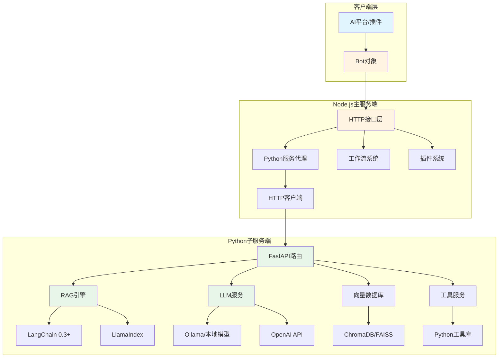
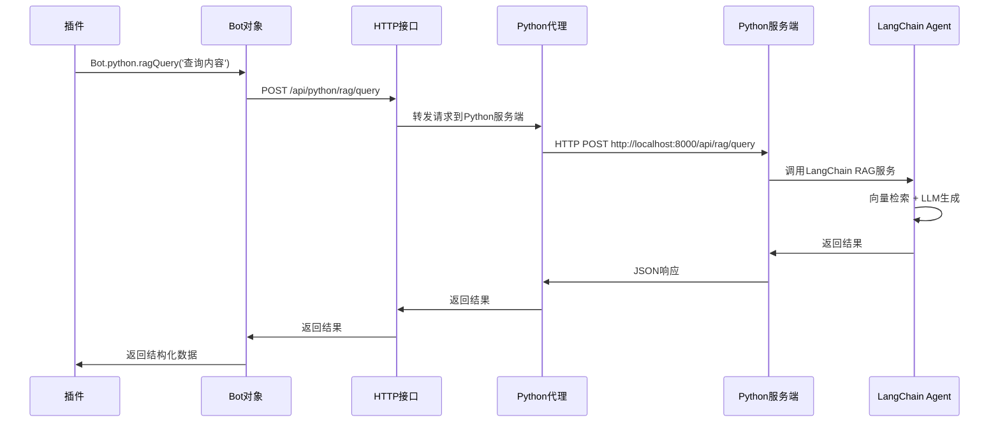
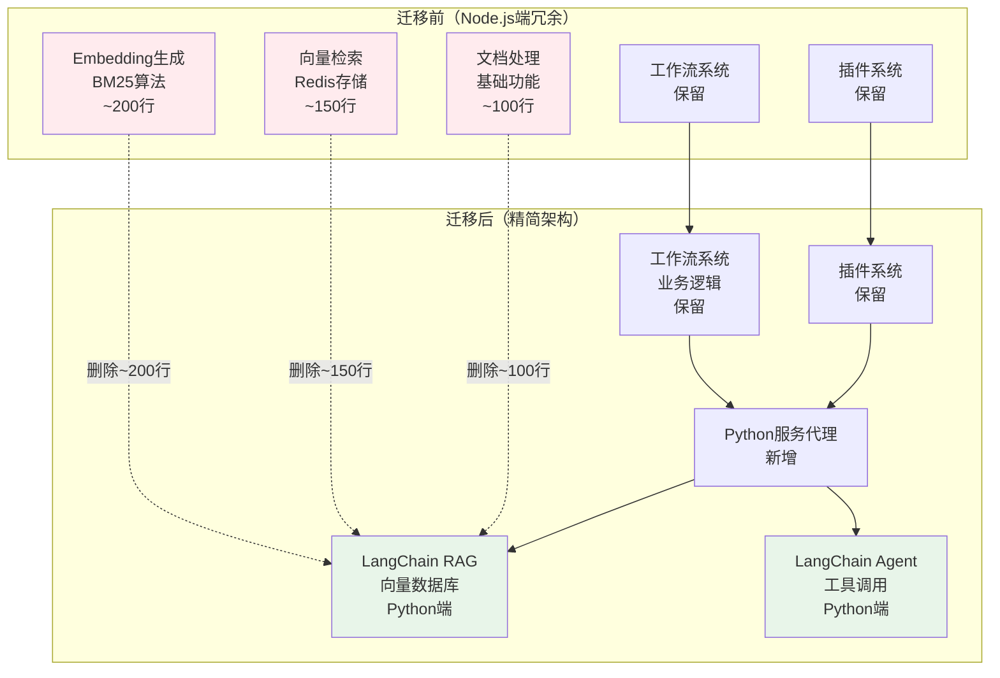
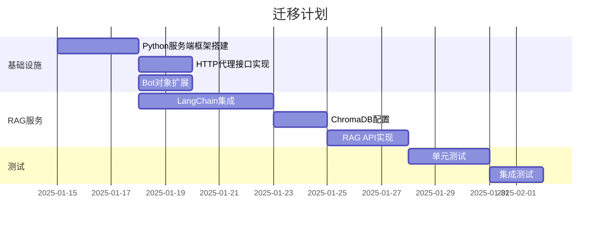
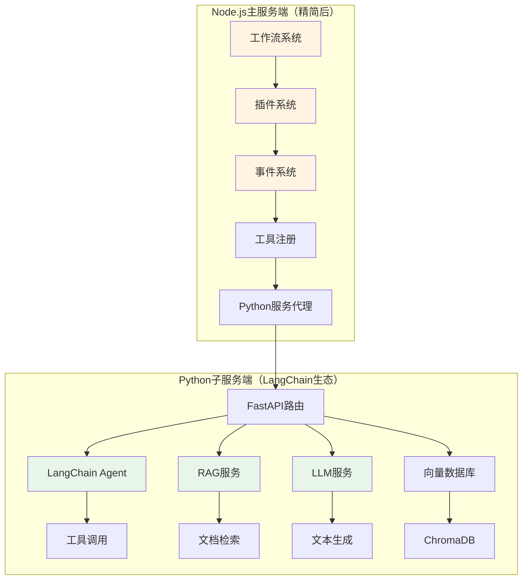
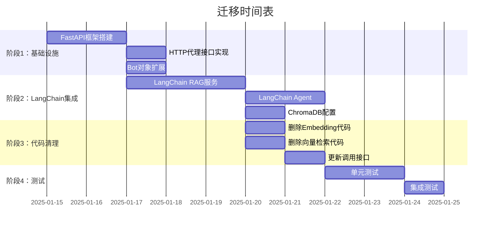

# XRK-AGT 未来架构规划（2025）

## 📋 目录

- [概述](#概述)
- [架构设计](#架构设计)
- [技术栈升级](#技术栈升级)
- [实现方案](#实现方案)
- [迁移计划](#迁移计划)
- [示例代码](#示例代码)

---

## 概述

### 核心目标

1. **统一接口调用**：主服务端（Node.js）通过HTTP接口连接Python子服务端
2. **简化插件开发**：插件通过Bot对象直接调用Python服务，无需关心底层实现
3. **利用Python AI生态**：集成2025年最新的Python AI工具和框架（LangChain、Ollama等）
4. **代码精简**：删除Node.js端冗余的AI功能代码，迁移到Python端
5. **提升性能**：使用LangChain Agent减少多轮AI调用，利用RAG等成熟技术

### 问题现状

- ❌ 当前AI无法使用MCP协议，需要多轮调用
- ❌ RAG等AI功能在Node端生态不成熟（BM25算法效果差）
- ❌ Node.js端有大量冗余的Embedding和向量检索代码
- ❌ 代码分散，维护困难
- ❌ 性能瓶颈，响应慢

### 解决方案

- ✅ **迁移AI功能到Python端**：使用LangChain生态（RAG、LLM、向量数据库）
- ✅ **删除Node.js端冗余代码**：删除Embedding、BM25、向量检索等代码
- ✅ **保留业务逻辑层**：工作流、插件、事件系统保留在Node.js端
- ✅ **统一调用接口**：通过Bot对象统一调用Python服务

---

## 架构设计

### 整体架构图



### 数据流图



### 架构对比（迁移前后）



### 代码量对比

| 模块 | 迁移前 | 迁移后 | 变化 |
|------|--------|--------|------|
| **Node.js端** | ~15,000行 | ~12,000行 | **-3,000行（-20%）** |
| **Python端** | ~500行 | ~3,000行 | **+2,500行（新增）** |
| **总计** | ~15,500行 | ~15,000行 | **-500行（精简）** |

**优势**：
- ✅ Node.js端代码更精简，职责更清晰
- ✅ Python端功能更强大，使用成熟生态
- ✅ 总体代码量减少，维护更容易

---

## 技术栈升级

### Python子服务端（2025新特性）

#### 1. 核心框架

```python
# FastAPI 0.115+ (2025最新)
- 异步性能优化
- 更好的类型提示支持
- WebSocket增强

# Pydantic v2.5+
- 性能提升50%+
- 更好的验证和序列化
- 支持JSON Schema自动生成
```

#### 2. AI/ML框架

```python
# LangChain 0.3+ (2025)
- LangGraph: 工作流编排
- LangServe: API服务化
- LangChain Expression Language (LCEL)
- 更好的RAG支持

# LlamaIndex 0.10+
- 向量存储优化
- 多模态支持
- 更好的检索性能

# Transformers 4.40+
- 支持最新模型（Llama 3.2, Qwen 2.5等）
- 量化优化
- 推理加速

# Ollama (本地模型)
- 本地LLM运行
- 无需API密钥
- 隐私保护
```

#### 3. 向量数据库

```python
# ChromaDB 0.5+
- 更好的性能
- 持久化优化
- 多租户支持

# FAISS (Meta)
- 高性能向量检索
- GPU加速支持

# Qdrant (可选)
- 云原生设计
- 更好的扩展性
```

#### 4. 工具库

```python
# httpx (异步HTTP客户端)
- 更好的性能
- HTTP/2支持

# aiofiles (异步文件操作)
- 高性能文件I/O

# python-dotenv (配置管理)
- 环境变量管理
```

---

## 实现方案

### 1. Node.js端：Python服务代理

#### 1.1 HTTP接口层

**文件**: `core/http/python.js`

```javascript
import BotUtil from '#utils/botutil.js';
import axios from 'axios';
import cfg from '#infrastructure/config/config.js';

/**
 * Python子服务端代理
 * 提供统一的接口调用Python服务端
 */
export default {
  name: 'python',
  dsc: 'Python子服务端代理接口',
  priority: 100,

  routes: [
    {
      method: 'POST',
      path: '/api/python/:service/:action',
      handler: async (req, res, Bot) => {
        const { service, action } = req.params;
        const pythonUrl = cfg.python?.url || 'http://localhost:8000';
        
        try {
          const response = await axios.post(
            `${pythonUrl}/api/${service}/${action}`,
            req.body,
            {
              timeout: 30000,
              headers: {
                'Content-Type': 'application/json',
                'X-Request-ID': req.headers['x-request-id'] || Date.now().toString()
              }
            }
          );
          
          res.json({
            success: true,
            data: response.data
          });
        } catch (error) {
          BotUtil.makeLog('error', `Python服务调用失败: ${error.message}`, 'PythonProxy');
          res.status(error.response?.status || 500).json({
            success: false,
            error: error.message,
            data: error.response?.data
          });
        }
      }
    },
    
    {
      method: 'GET',
      path: '/api/python/health',
      handler: async (req, res, Bot) => {
        const pythonUrl = cfg.python?.url || 'http://localhost:8000';
        try {
          const response = await axios.get(`${pythonUrl}/health`, { timeout: 5000 });
          res.json({ success: true, status: response.data });
        } catch (error) {
          res.status(503).json({ success: false, error: 'Python服务不可用' });
        }
      }
    }
  ]
};
```

#### 1.2 Bot对象扩展

**文件**: `src/utils/python-client.js`

```javascript
import axios from 'axios';
import cfg from '#infrastructure/config/config.js';
import BotUtil from '#utils/botutil.js';

/**
 * Python服务客户端
 * 供Bot对象和插件使用
 */
export class PythonClient {
  constructor(bot) {
    this.bot = bot;
    this.baseUrl = cfg.python?.url || 'http://localhost:8000';
    this.timeout = cfg.python?.timeout || 30000;
  }

  /**
   * 调用Python API
   * @param {string} service - 服务名称（如：rag, llm, tools）
   * @param {string} action - 操作名称（如：query, generate, search）
   * @param {Object} params - 参数
   * @returns {Promise<any>} 结果
   */
  async call(service, action, params = {}) {
    try {
      const response = await axios.post(
        `${this.baseUrl}/api/${service}/${action}`,
        params,
        {
          timeout: this.timeout,
          headers: {
            'Content-Type': 'application/json',
            'X-Request-ID': `${Date.now()}-${Math.random().toString(36).substr(2, 9)}`
          }
        }
      );
      
      return {
        success: true,
        data: response.data
      };
    } catch (error) {
      BotUtil.makeLog('error', `Python API调用失败[${service}.${action}]: ${error.message}`, 'PythonClient');
      return {
        success: false,
        error: error.message,
        data: error.response?.data
      };
    }
  }

  /**
   * RAG查询
   */
  async ragQuery(query, options = {}) {
    return this.call('rag', 'query', { query, ...options });
  }

  /**
   * LLM生成
   */
  async llmGenerate(prompt, options = {}) {
    return this.call('llm', 'generate', { prompt, ...options });
  }

  /**
   * 向量搜索
   */
  async vectorSearch(query, topK = 5, options = {}) {
    return this.call('vector', 'search', { query, top_k: topK, ...options });
  }

  /**
   * 文档处理
   */
  async documentProcess(filePath, options = {}) {
    return this.call('document', 'process', { file_path: filePath, ...options });
  }
}
```

**在Bot类中集成**:

```javascript
// src/bot.js
import { PythonClient } from '#utils/python-client.js';

export default class Bot extends EventEmitter {
  constructor() {
    super();
    // ... 其他初始化
    this.python = new PythonClient(this);
  }
}
```

### 2. Python子服务端实现

#### 2.1 RAG服务

**文件**: `subserver/pyserver/apis/rag_api.py`

```python
"""RAG服务API"""
from fastapi import APIRouter, HTTPException
from pydantic import BaseModel, Field
from typing import Optional, List
from core.rag_service import RAGService

router = APIRouter(prefix="/api/rag", tags=["RAG"])

rag_service = RAGService()

class QueryRequest(BaseModel):
    query: str = Field(..., description="查询文本")
    top_k: int = Field(5, ge=1, le=50, description="返回结果数量")
    collection: Optional[str] = Field(None, description="集合名称")
    filter: Optional[dict] = Field(None, description="过滤条件")

class QueryResponse(BaseModel):
    query: str
    results: List[dict]
    total: int
    time_ms: float

@router.post("/query", response_model=QueryResponse)
async def query(request: QueryRequest):
    """RAG查询接口"""
    try:
        results = await rag_service.query(
            query=request.query,
            top_k=request.top_k,
            collection=request.collection,
            filter=request.filter
        )
        return QueryResponse(
            query=request.query,
            results=results,
            total=len(results),
            time_ms=rag_service.last_query_time
        )
    except Exception as e:
        raise HTTPException(status_code=500, detail=str(e))

@router.post("/index")
async def index_document(file_path: str, collection: str = "default"):
    """索引文档"""
    try:
        result = await rag_service.index_document(file_path, collection)
        return {"success": True, "document_id": result}
    except Exception as e:
        raise HTTPException(status_code=500, detail=str(e))
```

#### 2.2 RAG服务实现（使用LangChain 0.3+）

**文件**: `subserver/pyserver/core/rag_service.py`

```python
"""RAG服务实现（使用LangChain 0.3+）"""
import time
from typing import List, Optional, Dict
from langchain_community.vectorstores import Chroma
from langchain_community.embeddings import OllamaEmbeddings
from langchain_community.llms import Ollama
from langchain.chains import RetrievalQA
from langchain.prompts import PromptTemplate
from langchain.text_splitter import RecursiveCharacterTextSplitter
from langchain_community.document_loaders import TextLoader, PyPDFLoader
import chromadb

class RAGService:
    """RAG服务（使用LangChain 0.3+）"""
    
    def __init__(self):
        # 使用Ollama本地嵌入模型（或OpenAI）
        self.embeddings = OllamaEmbeddings(model="nomic-embed-text")
        
        # ChromaDB向量存储
        self.vectorstore = Chroma(
            collection_name="documents",
            embedding_function=self.embeddings,
            persist_directory="./data/chroma"
        )
        
        # LLM（本地Ollama或OpenAI）
        self.llm = Ollama(model="llama3.2")
        
        # 检索链
        self.qa_chain = RetrievalQA.from_chain_type(
            llm=self.llm,
            chain_type="stuff",
            retriever=self.vectorstore.as_retriever(search_kwargs={"k": 5}),
            return_source_documents=True
        )
        
        self.last_query_time = 0.0
    
    async def query(self, query: str, top_k: int = 5, collection: Optional[str] = None, filter: Optional[Dict] = None) -> List[Dict]:
        """RAG查询"""
        start_time = time.time()
        
        # 使用LangChain检索链
        result = self.qa_chain.invoke({"query": query})
        
        # 格式化结果
        results = []
        for doc in result.get("source_documents", []):
            results.append({
                "content": doc.page_content,
                "metadata": doc.metadata,
                "score": 1.0  # LangChain不直接提供分数
            })
        
        self.last_query_time = (time.time() - start_time) * 1000
        
        return results[:top_k]
    
    async def index_document(self, file_path: str, collection: str = "default") -> str:
        """索引文档"""
        # 加载文档
        if file_path.endswith('.pdf'):
            loader = PyPDFLoader(file_path)
        else:
            loader = TextLoader(file_path)
        
        documents = loader.load()
        
        # 文本分割
        text_splitter = RecursiveCharacterTextSplitter(
            chunk_size=1000,
            chunk_overlap=200
        )
        splits = text_splitter.split_documents(documents)
        
        # 添加到向量存储
        self.vectorstore.add_documents(splits)
        
        return f"indexed_{len(splits)}_chunks"
```

#### 2.3 LLM服务

**文件**: `subserver/pyserver/apis/llm_api.py`

```python
"""LLM服务API"""
from fastapi import APIRouter
from pydantic import BaseModel
from core.llm_service import LLMService

router = APIRouter(prefix="/api/llm", tags=["LLM"])

llm_service = LLMService()

class GenerateRequest(BaseModel):
    prompt: str
    model: str = "llama3.2"
    temperature: float = 0.7
    max_tokens: int = 1000

@router.post("/generate")
async def generate(request: GenerateRequest):
    """生成文本"""
    result = await llm_service.generate(
        prompt=request.prompt,
        model=request.model,
        temperature=request.temperature,
        max_tokens=request.max_tokens
    )
    return {"success": True, "text": result}
```

#### 2.4 API注册

**文件**: `subserver/pyserver/core/loader.py`

```python
"""API加载器"""
from fastapi import FastAPI
from apis.rag_api import router as rag_router
from apis.llm_api import router as llm_router

class ApiLoader:
    @staticmethod
    async def load_all(app: FastAPI):
        """加载所有API"""
        app.include_router(rag_router)
        app.include_router(llm_router)
        # ... 其他API
```

### 3. 插件使用示例

**文件**: `core/plugin/example/rag_example.js`

```javascript
/**
 * RAG插件示例
 * 使用Bot对象调用Python服务端
 */
export default {
  name: 'rag_example',
  dsc: 'RAG功能示例插件',
  
  async onMessage(e, Bot) {
    const text = e.message;
    
    // 使用Bot对象调用Python RAG服务
    const result = await Bot.python.ragQuery(text, {
      top_k: 5,
      collection: 'documents'
    });
    
    if (result.success) {
      const answers = result.data.results.map(r => r.content).join('\n\n');
      await Bot.reply(e, `RAG查询结果：\n${answers}`);
    } else {
      await Bot.reply(e, `查询失败：${result.error}`);
    }
  }
};
```

---

## 迁移计划

### 阶段1：基础设施搭建（1-2周）



### 阶段2：核心功能迁移（2-3周）

- ✅ RAG功能迁移到Python端
- ✅ LLM服务迁移到Python端
- ✅ 向量数据库集成
- ✅ 文档处理功能

### 阶段3：优化和扩展（持续）

- ✅ 性能优化
- ✅ 缓存机制
- ✅ 监控和日志
- ✅ 更多AI功能集成

---

## 配置示例

### Node.js配置

**文件**: `config/default_config/python.yaml`

```yaml
python:
  enabled: true
  url: "http://localhost:8000"
  timeout: 30000
  retry:
    max_attempts: 3
    delay: 1000
  health_check:
    interval: 5000
    timeout: 3000
```

### Python配置

**文件**: `subserver/pyserver/config.yaml`

```yaml
server:
  host: "0.0.0.0"
  port: 8000
  reload: false

rag:
  embeddings:
    provider: "ollama"  # ollama | openai | local
    model: "nomic-embed-text"
  llm:
    provider: "ollama"  # ollama | openai
    model: "llama3.2"
  vectorstore:
    type: "chroma"
    persist_directory: "./data/chroma"
  chunk_size: 1000
  chunk_overlap: 200

llm:
  default_model: "llama3.2"
  temperature: 0.7
  max_tokens: 2000
```

---

## 优势总结

### 1. 性能提升

- ✅ **单次调用**：减少多轮AI调用，一次完成
- ✅ **异步处理**：Python异步框架性能优异
- ✅ **本地模型**：Ollama本地运行，无需API限制

### 2. 生态优势

- ✅ **成熟工具**：LangChain、LlamaIndex等成熟框架
- ✅ **丰富模型**：支持各种开源和商业模型
- ✅ **向量数据库**：ChromaDB、FAISS等高性能方案

### 3. 开发体验

- ✅ **统一接口**：Bot对象统一调用
- ✅ **类型安全**：Pydantic提供类型验证
- ✅ **易于扩展**：FastAPI路由系统灵活

### 4. 维护性

- ✅ **代码分离**：Node端和Python端职责清晰
- ✅ **独立部署**：Python服务可独立扩展
- ✅ **技术选型**：使用最适合的工具

---

## 代码清理和迁移规划

### 🗑️ 可删除的Node.js端代码

#### 1. Embedding相关代码（迁移到LangChain）

**位置**: `src/infrastructure/aistream/aistream.js`

**可删除的方法**：
- ❌ `initLightweightEmbedding()` - BM25算法（LangChain有更好的）
- ❌ `generateEmbedding()` - Embedding生成（LangChain处理）
- ❌ `generateRemoteEmbedding()` - 远程Embedding API（LangChain处理）
- ❌ `cosineSimilarity()` - 向量相似度计算（LangChain处理）
- ❌ `retrieveContexts()` - 上下文检索（LangChain RAG处理）
- ❌ `storeMessageWithEmbedding()` - 消息存储（LangChain向量数据库处理）

**保留**：
- ✅ `initEmbedding()` - 保留接口，但改为调用Python服务
- ✅ `embeddingConfig` - 保留配置，但改为指向Python服务

#### 2. 知识库向量检索（迁移到LangChain）

**位置**: `core/stream/database.js`

**可删除的方法**：
- ❌ `queryKnowledgeWithEmbedding()` - 向量检索（LangChain处理）
- ❌ `generateEmbeddingAsync()` - Embedding生成（LangChain处理）
- ❌ `saveEmbeddingAsync()` - Embedding保存（LangChain向量数据库处理）
- ❌ `retrieveKnowledgeContexts()` - 知识检索（LangChain RAG处理）

**保留**：
- ✅ `saveKnowledge()` - 保留，但改为调用Python服务索引
- ✅ `queryKnowledge()` - 保留接口，但改为调用Python RAG服务
- ✅ `listDatabases()` - 保留，业务逻辑

#### 3. 记忆系统向量检索（迁移到LangChain）

**位置**: `core/stream/memory.js`

**可删除的方法**：
- ❌ 所有向量检索相关代码（迁移到LangChain）

**保留**：
- ✅ 记忆存储和查询接口（改为调用Python服务）

#### 4. BM25算法实现（完全删除）

**位置**: `src/infrastructure/aistream/aistream.js`

**可删除**：
- ❌ `SimilarityCalculator` 类（BM25算法）
- ❌ 所有BM25相关代码

**原因**：LangChain的向量检索比BM25效果好得多

---

### 🔄 迁移到Python端的代码

#### 1. RAG功能 → LangChain

```python
# 迁移前（Node.js）
# core/stream/database.js
async queryKnowledgeWithEmbedding(records, query) {
  // 向量检索逻辑
  const queryEmbedding = await this.generateEmbedding(query);
  // ... 相似度计算
}

# 迁移后（Python + LangChain）
# subserver/pyserver/core/rag_service.py
from langchain.chains import RetrievalQA
from langchain.vectorstores import Chroma

class RAGService:
    async def query(self, query: str):
        # LangChain处理RAG查询
        result = self.qa_chain.invoke({"query": query})
        return result
```

#### 2. Embedding生成 → LangChain

```python
# 迁移前（Node.js）
# src/infrastructure/aistream/aistream.js
async generateEmbedding(text) {
  // 调用API或BM25
}

# 迁移后（Python + LangChain）
# subserver/pyserver/core/rag_service.py
from langchain_community.embeddings import OllamaEmbeddings

embeddings = OllamaEmbeddings(model="nomic-embed-text")
vector = embeddings.embed_query(text)
```

#### 3. 向量数据库 → ChromaDB/FAISS

```python
# 迁移前（Node.js）
# 使用Redis存储向量（临时方案）

# 迁移后（Python + LangChain）
# subserver/pyserver/core/rag_service.py
from langchain.vectorstores import Chroma

vectorstore = Chroma(
    collection_name="documents",
    embedding_function=embeddings,
    persist_directory="./data/chroma"
)
```

---

### 📋 详细删除清单

#### 文件级别删除

| 文件/模块 | 删除内容 | 迁移到 | 优先级 |
|-----------|---------|--------|--------|
| `src/infrastructure/aistream/aistream.js` | BM25算法、Embedding生成 | LangChain | 🔴 高 |
| `core/stream/database.js` | 向量检索逻辑 | LangChain RAG | 🔴 高 |
| `core/stream/memory.js` | 向量检索逻辑 | LangChain RAG | 🔴 高 |
| `src/infrastructure/aistream/aistream.js` | `retrieveContexts()` | LangChain RAG | 🔴 高 |

#### 方法级别删除

**`src/infrastructure/aistream/aistream.js`**：
- ❌ `initLightweightEmbedding()` (~50行)
- ❌ `generateEmbedding()` (~30行)
- ❌ `generateRemoteEmbedding()` (~30行)
- ❌ `cosineSimilarity()` (~20行)
- ❌ `retrieveContexts()` (~100行)
- ❌ `storeMessageWithEmbedding()` (~50行)
- ❌ `SimilarityCalculator` 类 (~200行)

**`core/stream/database.js`**：
- ❌ `queryKnowledgeWithEmbedding()` (~50行)
- ❌ `generateEmbeddingAsync()` (~20行)
- ❌ `saveEmbeddingAsync()` (~30行)
- ❌ `retrieveKnowledgeContexts()` (~40行)

**总计可删除**：~620行代码

#### 4. 配置项清理

**位置**: `config/default_config/aistream.yaml`

**可删除的配置**：
- ❌ `embedding.mode: local` - BM25模式（不再需要）
- ❌ `embedding.remote.apiUrl` - 远程Embedding API（LangChain处理）
- ❌ `embedding.remote.apiKey` - API密钥（LangChain处理）

**保留的配置**：
- ✅ `embedding.enabled` - 保留，但改为指向Python服务
- ✅ 工作流相关配置
- ✅ 插件相关配置

---

### 🔄 迁移映射表

| Node.js端功能 | 迁移到 | Python端实现 |
|--------------|--------|-------------|
| `generateEmbedding()` | LangChain | `OllamaEmbeddings.embed_query()` |
| `queryKnowledgeWithEmbedding()` | LangChain RAG | `RetrievalQA.invoke()` |
| `retrieveContexts()` | LangChain RAG | `vectorstore.similarity_search()` |
| `cosineSimilarity()` | LangChain | `vectorstore.similarity_search()` |
| BM25算法 | LangChain | 向量检索（效果更好） |
| Redis向量存储 | ChromaDB | `Chroma(vectorstore)` |
| 文档加载/分割 | LangChain | `TextLoader` + `RecursiveCharacterTextSplitter` |

---

### 📝 具体迁移步骤

#### 步骤1：创建Python服务端基础

```bash
# 1. 安装依赖
cd subserver/pyserver
pip install -r requirements-2025.txt

# 2. 创建API目录结构
mkdir -p apis core
```

#### 步骤2：实现LangChain RAG服务

```python
# subserver/pyserver/core/rag_service.py
# 使用LangChain实现RAG，替代Node.js端的向量检索
```

#### 步骤3：更新Node.js端调用

```javascript
// core/stream/database.js
// 修改前：
async queryKnowledge(db, keyword) {
  // 使用本地向量检索
  return await this.queryKnowledgeWithEmbedding(records, keyword);
}

// 修改后：
async queryKnowledge(db, keyword) {
  // 调用Python LangChain服务
  const result = await this.stream.bot.python.ragQuery(keyword, {
    collection: db
  });
  return result.data.results;
}
```

#### 步骤4：删除冗余代码

```bash
# 删除Node.js端的Embedding相关代码
# 1. 删除 src/infrastructure/aistream/aistream.js 中的：
#    - initLightweightEmbedding()
#    - generateEmbedding()
#    - generateRemoteEmbedding()
#    - cosineSimilarity()
#    - SimilarityCalculator类

# 2. 删除 core/stream/database.js 中的：
#    - queryKnowledgeWithEmbedding()
#    - generateEmbeddingAsync()
#    - saveEmbeddingAsync()
```

#### 步骤5：更新配置

```yaml
# config/default_config/aistream.yaml
embedding:
  enabled: true
  mode: python  # 改为python，指向Python服务
  python:
    url: "http://localhost:8000"
    service: "rag"
```

---

### ⚠️ 注意事项

1. **向后兼容**
   - 保留接口方法，但改为调用Python服务
   - 逐步迁移，不要一次性删除

2. **错误处理**
   - Python服务不可用时，需要有降级方案
   - 添加健康检查和重试机制

3. **数据迁移**
   - 现有Redis中的向量数据需要迁移到ChromaDB
   - 提供迁移脚本

4. **测试覆盖**
   - 充分测试迁移后的功能
   - 确保性能不下降

---

### ✅ 保留的Node.js端代码

#### 1. 工作流系统（必须保留）

**位置**: `core/workflow-manager.js`

**保留原因**：
- ✅ 业务逻辑层任务规划
- ✅ 状态管理和持久化
- ✅ 多平台集成（QQ、微信）
- ✅ 错误处理和重试

**但需要修改**：
- 🔄 工作流步骤可以调用LangChain Agent

#### 2. 插件系统（必须保留）

**位置**: `src/infrastructure/plugins/`

**保留原因**：
- ✅ 功能模块化
- ✅ 生命周期管理
- ✅ 权限验证

#### 3. 事件系统（必须保留）

**位置**: `src/infrastructure/listener/`

**保留原因**：
- ✅ 事件驱动架构
- ✅ 多平台事件处理

#### 4. 工具注册和调用（保留但简化）

**位置**: `src/infrastructure/aistream/loader.js`

**保留原因**：
- ✅ 工具注册机制
- ✅ 函数调用框架

**但需要修改**：
- 🔄 部分工具可以调用LangChain Agent

---

### 🔄 迁移后的架构



---

### 📅 迁移时间表

#### 阶段1：Python服务端搭建（1周）



#### 阶段2：功能迁移（2周）

- ✅ 迁移RAG功能到LangChain
- ✅ 迁移Embedding生成到LangChain
- ✅ 迁移向量数据库到ChromaDB
- ✅ 迁移文档处理到LangChain

#### 阶段3：代码清理（1周）

- ✅ 删除Node.js端的Embedding代码
- ✅ 删除BM25算法实现
- ✅ 删除向量检索逻辑
- ✅ 更新调用接口

#### 阶段4：测试和优化（1周）

- ✅ 功能测试
- ✅ 性能测试
- ✅ 文档更新

---

### 🎯 迁移后的代码结构

#### Node.js端（精简后）

```
src/
├── infrastructure/
│   ├── aistream/
│   │   └── aistream.js          # 精简：只保留工作流、插件框架
│   └── plugins/                 # 保留：插件系统
├── utils/
│   └── python-client.js         # 新增：Python服务客户端
└── bot.js                       # 保留：Bot主类

core/
├── workflow-manager.js          # 保留：工作流系统
├── stream/
│   ├── desktop.js              # 保留：桌面工具
│   ├── tools.js                # 保留：基础工具
│   ├── database.js             # 精简：只保留接口，调用Python
│   └── memory.js               # 精简：只保留接口，调用Python
└── http/
    └── python.js               # 新增：Python服务代理
```

#### Python端（新增）

```
subserver/pyserver/
├── apis/
│   ├── rag_api.py              # 新增：RAG服务API
│   ├── llm_api.py              # 新增：LLM服务API
│   ├── agent_api.py            # 新增：Agent服务API
│   └── document_api.py         # 新增：文档处理API
├── core/
│   ├── rag_service.py          # 新增：RAG服务（LangChain）
│   ├── llm_service.py          # 新增：LLM服务（LangChain）
│   ├── agent_service.py        # 新增：Agent服务（LangChain）
│   └── document_service.py      # 新增：文档处理（LangChain）
└── main.py                     # 保留：FastAPI应用
```

---

### 📊 代码量变化

| 项目 | 迁移前 | 迁移后 | 变化 |
|------|--------|--------|------|
| **Node.js端** | ~15,000行 | ~12,000行 | -3,000行（-20%） |
| **Python端** | ~500行 | ~3,000行 | +2,500行（新增） |
| **总计** | ~15,500行 | ~15,000行 | -500行（精简） |

**优势**：
- ✅ Node.js端代码更精简
- ✅ Python端功能更强大
- ✅ 职责更清晰

---

## 📋 删除和保留总结

### ❌ 必须删除的代码（迁移到LangChain）

| 模块 | 代码位置 | 删除内容 | 替代方案 |
|------|---------|---------|---------|
| **Embedding生成** | `src/infrastructure/aistream/aistream.js` | `generateEmbedding()`, `generateRemoteEmbedding()` | LangChain `OllamaEmbeddings` |
| **BM25算法** | `src/infrastructure/aistream/aistream.js` | `SimilarityCalculator`类 | LangChain向量检索 |
| **向量检索** | `core/stream/database.js` | `queryKnowledgeWithEmbedding()` | LangChain RAG |
| **向量存储** | Redis临时方案 | Redis向量存储 | ChromaDB |
| **文档处理** | Node.js基础实现 | 文档加载/分割 | LangChain文档处理 |

### ✅ 必须保留的代码（业务逻辑层）

| 模块 | 代码位置 | 保留原因 |
|------|---------|---------|
| **工作流系统** | `core/workflow-manager.js` | 业务逻辑规划、状态管理 |
| **插件系统** | `src/infrastructure/plugins/` | 功能模块化、生命周期管理 |
| **事件系统** | `src/infrastructure/listener/` | 事件驱动架构 |
| **工具注册** | `src/infrastructure/aistream/loader.js` | 工具注册机制 |
| **多平台适配** | `core/tasker/` | QQ、微信等平台集成 |

### 🔄 需要修改的代码（改为调用Python服务）

| 模块 | 修改内容 | 新实现 |
|------|---------|--------|
| **知识库查询** | `core/stream/database.js` | 改为调用`Bot.python.ragQuery()` |
| **记忆查询** | `core/stream/memory.js` | 改为调用`Bot.python.ragQuery()` |
| **上下文检索** | `src/infrastructure/aistream/aistream.js` | 改为调用`Bot.python.ragQuery()` |

---

## 🎯 迁移优先级

### 🔴 高优先级（立即执行）

1. **搭建Python服务端框架**
   - FastAPI应用
   - HTTP路由
   - 配置管理

2. **实现LangChain RAG服务**
   - RAG服务实现
   - ChromaDB配置
   - API接口

3. **实现HTTP代理接口**
   - Node.js端Python代理
   - Bot对象扩展

### 🟡 中优先级（1-2周内）

4. **迁移知识库功能**
   - 更新`database.js`调用Python服务
   - 删除向量检索代码

5. **迁移记忆系统**
   - 更新`memory.js`调用Python服务
   - 删除向量检索代码

6. **删除Embedding代码**
   - 删除`aistream.js`中的Embedding相关代码
   - 删除BM25算法

### 🟢 低优先级（后续优化）

7. **集成LangChain Agent**
   - Agent服务实现
   - 工具调用

8. **性能优化**
   - 缓存机制
   - 批量处理

---

## 下一步行动

### 立即执行（优先级高）

1. ✅ **搭建Python服务端基础框架**
   - FastAPI应用
   - HTTP路由
   - 配置管理

2. ✅ **实现HTTP代理接口**
   - Node.js端Python代理
   - Bot对象扩展
   - 错误处理

3. ✅ **集成LangChain RAG服务**
   - RAG服务实现
   - ChromaDB配置
   - API接口

### 后续执行（优先级中）

4. ✅ **集成LangChain Agent**
   - Agent服务实现
   - 工具调用
   - API接口

5. ✅ **迁移现有功能**
   - 知识库向量检索 → LangChain
   - 记忆系统向量检索 → LangChain
   - Embedding生成 → LangChain

6. ✅ **代码清理**
   - 删除Node.js端Embedding代码
   - 删除BM25算法
   - 删除向量检索逻辑

### 优化和扩展（优先级低）

7. ✅ **性能优化**
   - 缓存机制
   - 异步优化
   - 批量处理

8. ✅ **监控和日志**
   - 性能监控
   - 错误追踪
   - 使用统计

---

**文档版本**: 2.0  
**最后更新**: 2025-01-13  
**维护者**: XRK-AGT Team
