# XRK-AGT 未来架构规划（2025）

## 📋 目录

- [概述](#概述)
- [架构设计](#架构设计)
- [技术栈升级](#技术栈升级)
- [实现方案](#实现方案)
- [迁移计划](#迁移计划)
- [示例代码](#示例代码)

---

## 概述

### 核心目标

1. **统一接口调用**：主服务端（Node.js）通过HTTP接口连接Python子服务端
2. **简化插件开发**：插件通过Bot对象直接调用Python服务，无需关心底层实现
3. **利用Python AI生态**：集成2025年最新的Python AI工具和框架
4. **提升性能**：减少多轮AI调用，利用RAG等成熟技术

### 问题现状

- ❌ 当前AI无法使用MCP协议，需要多轮调用
- ❌ RAG等AI功能在Node端生态不成熟
- ❌ 代码分散，维护困难
- ❌ 性能瓶颈，响应慢

---

## 架构设计

### 整体架构图

```mermaid
graph TB
    subgraph "客户端层"
        A[AI平台/插件] --> B[Bot对象]
    end
    
    subgraph "Node.js主服务端"
        B --> C[HTTP接口层]
        C --> D[Python服务代理]
        D --> E[HTTP客户端]
        C --> F[工作流系统]
        C --> G[插件系统]
    end
    
    subgraph "Python子服务端"
        E --> H[FastAPI路由]
        H --> I[RAG引擎]
        H --> J[LLM服务]
        H --> K[向量数据库]
        H --> L[工具服务]
        
        I --> M[LangChain 0.3+]
        I --> N[LlamaIndex]
        J --> O[Ollama/本地模型]
        J --> P[OpenAI API]
        K --> Q[ChromaDB/FAISS]
        L --> R[Python工具库]
    end
    
    style A fill:#e1f5ff
    style B fill:#fff4e1
    style C fill:#fff4e1
    style H fill:#e8f5e9
    style I fill:#e8f5e9
    style J fill:#e8f5e9
```



### 数据流图

```mermaid
sequenceDiagram
    participant Plugin as 插件
    participant Bot as Bot对象
    participant API as HTTP接口
    participant Proxy as Python代理
    participant Python as Python服务端
    participant RAG as RAG引擎
    
    Plugin->>Bot: Bot.callPythonAPI('rag.query', {query: '...'})
    Bot->>API: POST /api/python/rag/query
    API->>Proxy: 转发请求到Python服务端
    Proxy->>Python: HTTP POST http://localhost:8000/api/rag/query
    Python->>RAG: 调用RAG引擎
    RAG->>Python: 返回结果
    Python->>Proxy: JSON响应
    Proxy->>API: 返回结果
    API->>Bot: 返回结果
    Bot->>Plugin: 返回结构化数据
```



---

## 技术栈升级

### Python子服务端（2025新特性）

#### 1. 核心框架

```python
# FastAPI 0.115+ (2025最新)
- 异步性能优化
- 更好的类型提示支持
- WebSocket增强

# Pydantic v2.5+
- 性能提升50%+
- 更好的验证和序列化
- 支持JSON Schema自动生成
```

#### 2. AI/ML框架

```python
# LangChain 0.3+ (2025)
- LangGraph: 工作流编排
- LangServe: API服务化
- LangChain Expression Language (LCEL)
- 更好的RAG支持

# LlamaIndex 0.10+
- 向量存储优化
- 多模态支持
- 更好的检索性能

# Transformers 4.40+
- 支持最新模型（Llama 3.2, Qwen 2.5等）
- 量化优化
- 推理加速

# Ollama (本地模型)
- 本地LLM运行
- 无需API密钥
- 隐私保护
```

#### 3. 向量数据库

```python
# ChromaDB 0.5+
- 更好的性能
- 持久化优化
- 多租户支持

# FAISS (Meta)
- 高性能向量检索
- GPU加速支持

# Qdrant (可选)
- 云原生设计
- 更好的扩展性
```

#### 4. 工具库

```python
# httpx (异步HTTP客户端)
- 更好的性能
- HTTP/2支持

# aiofiles (异步文件操作)
- 高性能文件I/O

# python-dotenv (配置管理)
- 环境变量管理
```

---

## 实现方案

### 1. Node.js端：Python服务代理

#### 1.1 HTTP接口层

**文件**: `core/http/python.js`

```javascript
import BotUtil from '#utils/botutil.js';
import axios from 'axios';
import cfg from '#infrastructure/config/config.js';

/**
 * Python子服务端代理
 * 提供统一的接口调用Python服务端
 */
export default {
  name: 'python',
  dsc: 'Python子服务端代理接口',
  priority: 100,

  routes: [
    {
      method: 'POST',
      path: '/api/python/:service/:action',
      handler: async (req, res, Bot) => {
        const { service, action } = req.params;
        const pythonUrl = cfg.python?.url || 'http://localhost:8000';
        
        try {
          const response = await axios.post(
            `${pythonUrl}/api/${service}/${action}`,
            req.body,
            {
              timeout: 30000,
              headers: {
                'Content-Type': 'application/json',
                'X-Request-ID': req.headers['x-request-id'] || Date.now().toString()
              }
            }
          );
          
          res.json({
            success: true,
            data: response.data
          });
        } catch (error) {
          BotUtil.makeLog('error', `Python服务调用失败: ${error.message}`, 'PythonProxy');
          res.status(error.response?.status || 500).json({
            success: false,
            error: error.message,
            data: error.response?.data
          });
        }
      }
    },
    
    {
      method: 'GET',
      path: '/api/python/health',
      handler: async (req, res, Bot) => {
        const pythonUrl = cfg.python?.url || 'http://localhost:8000';
        try {
          const response = await axios.get(`${pythonUrl}/health`, { timeout: 5000 });
          res.json({ success: true, status: response.data });
        } catch (error) {
          res.status(503).json({ success: false, error: 'Python服务不可用' });
        }
      }
    }
  ]
};
```

#### 1.2 Bot对象扩展

**文件**: `src/utils/python-client.js`

```javascript
import axios from 'axios';
import cfg from '#infrastructure/config/config.js';
import BotUtil from '#utils/botutil.js';

/**
 * Python服务客户端
 * 供Bot对象和插件使用
 */
export class PythonClient {
  constructor(bot) {
    this.bot = bot;
    this.baseUrl = cfg.python?.url || 'http://localhost:8000';
    this.timeout = cfg.python?.timeout || 30000;
  }

  /**
   * 调用Python API
   * @param {string} service - 服务名称（如：rag, llm, tools）
   * @param {string} action - 操作名称（如：query, generate, search）
   * @param {Object} params - 参数
   * @returns {Promise<any>} 结果
   */
  async call(service, action, params = {}) {
    try {
      const response = await axios.post(
        `${this.baseUrl}/api/${service}/${action}`,
        params,
        {
          timeout: this.timeout,
          headers: {
            'Content-Type': 'application/json',
            'X-Request-ID': `${Date.now()}-${Math.random().toString(36).substr(2, 9)}`
          }
        }
      );
      
      return {
        success: true,
        data: response.data
      };
    } catch (error) {
      BotUtil.makeLog('error', `Python API调用失败[${service}.${action}]: ${error.message}`, 'PythonClient');
      return {
        success: false,
        error: error.message,
        data: error.response?.data
      };
    }
  }

  /**
   * RAG查询
   */
  async ragQuery(query, options = {}) {
    return this.call('rag', 'query', { query, ...options });
  }

  /**
   * LLM生成
   */
  async llmGenerate(prompt, options = {}) {
    return this.call('llm', 'generate', { prompt, ...options });
  }

  /**
   * 向量搜索
   */
  async vectorSearch(query, topK = 5, options = {}) {
    return this.call('vector', 'search', { query, top_k: topK, ...options });
  }

  /**
   * 文档处理
   */
  async documentProcess(filePath, options = {}) {
    return this.call('document', 'process', { file_path: filePath, ...options });
  }
}
```

**在Bot类中集成**:

```javascript
// src/bot.js
import { PythonClient } from '#utils/python-client.js';

export default class Bot extends EventEmitter {
  constructor() {
    super();
    // ... 其他初始化
    this.python = new PythonClient(this);
  }
}
```

### 2. Python子服务端实现

#### 2.1 RAG服务

**文件**: `subserver/pyserver/apis/rag_api.py`

```python
"""RAG服务API"""
from fastapi import APIRouter, HTTPException
from pydantic import BaseModel, Field
from typing import Optional, List
from core.rag_service import RAGService

router = APIRouter(prefix="/api/rag", tags=["RAG"])

rag_service = RAGService()

class QueryRequest(BaseModel):
    query: str = Field(..., description="查询文本")
    top_k: int = Field(5, ge=1, le=50, description="返回结果数量")
    collection: Optional[str] = Field(None, description="集合名称")
    filter: Optional[dict] = Field(None, description="过滤条件")

class QueryResponse(BaseModel):
    query: str
    results: List[dict]
    total: int
    time_ms: float

@router.post("/query", response_model=QueryResponse)
async def query(request: QueryRequest):
    """RAG查询接口"""
    try:
        results = await rag_service.query(
            query=request.query,
            top_k=request.top_k,
            collection=request.collection,
            filter=request.filter
        )
        return QueryResponse(
            query=request.query,
            results=results,
            total=len(results),
            time_ms=rag_service.last_query_time
        )
    except Exception as e:
        raise HTTPException(status_code=500, detail=str(e))

@router.post("/index")
async def index_document(file_path: str, collection: str = "default"):
    """索引文档"""
    try:
        result = await rag_service.index_document(file_path, collection)
        return {"success": True, "document_id": result}
    except Exception as e:
        raise HTTPException(status_code=500, detail=str(e))
```

#### 2.2 RAG服务实现（使用LangChain 0.3+）

**文件**: `subserver/pyserver/core/rag_service.py`

```python
"""RAG服务实现（使用LangChain 0.3+）"""
import time
from typing import List, Optional, Dict
from langchain_community.vectorstores import Chroma
from langchain_community.embeddings import OllamaEmbeddings
from langchain_community.llms import Ollama
from langchain.chains import RetrievalQA
from langchain.prompts import PromptTemplate
from langchain.text_splitter import RecursiveCharacterTextSplitter
from langchain_community.document_loaders import TextLoader, PyPDFLoader
import chromadb

class RAGService:
    """RAG服务（使用LangChain 0.3+）"""
    
    def __init__(self):
        # 使用Ollama本地嵌入模型（或OpenAI）
        self.embeddings = OllamaEmbeddings(model="nomic-embed-text")
        
        # ChromaDB向量存储
        self.vectorstore = Chroma(
            collection_name="documents",
            embedding_function=self.embeddings,
            persist_directory="./data/chroma"
        )
        
        # LLM（本地Ollama或OpenAI）
        self.llm = Ollama(model="llama3.2")
        
        # 检索链
        self.qa_chain = RetrievalQA.from_chain_type(
            llm=self.llm,
            chain_type="stuff",
            retriever=self.vectorstore.as_retriever(search_kwargs={"k": 5}),
            return_source_documents=True
        )
        
        self.last_query_time = 0.0
    
    async def query(self, query: str, top_k: int = 5, collection: Optional[str] = None, filter: Optional[Dict] = None) -> List[Dict]:
        """RAG查询"""
        start_time = time.time()
        
        # 使用LangChain检索链
        result = self.qa_chain.invoke({"query": query})
        
        # 格式化结果
        results = []
        for doc in result.get("source_documents", []):
            results.append({
                "content": doc.page_content,
                "metadata": doc.metadata,
                "score": 1.0  # LangChain不直接提供分数
            })
        
        self.last_query_time = (time.time() - start_time) * 1000
        
        return results[:top_k]
    
    async def index_document(self, file_path: str, collection: str = "default") -> str:
        """索引文档"""
        # 加载文档
        if file_path.endswith('.pdf'):
            loader = PyPDFLoader(file_path)
        else:
            loader = TextLoader(file_path)
        
        documents = loader.load()
        
        # 文本分割
        text_splitter = RecursiveCharacterTextSplitter(
            chunk_size=1000,
            chunk_overlap=200
        )
        splits = text_splitter.split_documents(documents)
        
        # 添加到向量存储
        self.vectorstore.add_documents(splits)
        
        return f"indexed_{len(splits)}_chunks"
```

#### 2.3 LLM服务

**文件**: `subserver/pyserver/apis/llm_api.py`

```python
"""LLM服务API"""
from fastapi import APIRouter
from pydantic import BaseModel
from core.llm_service import LLMService

router = APIRouter(prefix="/api/llm", tags=["LLM"])

llm_service = LLMService()

class GenerateRequest(BaseModel):
    prompt: str
    model: str = "llama3.2"
    temperature: float = 0.7
    max_tokens: int = 1000

@router.post("/generate")
async def generate(request: GenerateRequest):
    """生成文本"""
    result = await llm_service.generate(
        prompt=request.prompt,
        model=request.model,
        temperature=request.temperature,
        max_tokens=request.max_tokens
    )
    return {"success": True, "text": result}
```

#### 2.4 API注册

**文件**: `subserver/pyserver/core/loader.py`

```python
"""API加载器"""
from fastapi import FastAPI
from apis.rag_api import router as rag_router
from apis.llm_api import router as llm_router

class ApiLoader:
    @staticmethod
    async def load_all(app: FastAPI):
        """加载所有API"""
        app.include_router(rag_router)
        app.include_router(llm_router)
        # ... 其他API
```

### 3. 插件使用示例

**文件**: `core/plugin/example/rag_example.js`

```javascript
/**
 * RAG插件示例
 * 使用Bot对象调用Python服务端
 */
export default {
  name: 'rag_example',
  dsc: 'RAG功能示例插件',
  
  async onMessage(e, Bot) {
    const text = e.message;
    
    // 使用Bot对象调用Python RAG服务
    const result = await Bot.python.ragQuery(text, {
      top_k: 5,
      collection: 'documents'
    });
    
    if (result.success) {
      const answers = result.data.results.map(r => r.content).join('\n\n');
      await Bot.reply(e, `RAG查询结果：\n${answers}`);
    } else {
      await Bot.reply(e, `查询失败：${result.error}`);
    }
  }
};
```

---

## 迁移计划

### 阶段1：基础设施搭建（1-2周）

```mermaid
gantt
    title 迁移计划
    dateFormat  YYYY-MM-DD
    section 基础设施
    Python服务端框架搭建    :a1, 2025-01-15, 3d
    HTTP代理接口实现        :a2, after a1, 2d
    Bot对象扩展            :a3, after a1, 2d
    section RAG服务
    LangChain集成          :b1, after a1, 5d
    ChromaDB配置           :b2, after b1, 2d
    RAG API实现            :b3, after b2, 3d
    section 测试
    单元测试               :c1, after b3, 3d
    集成测试               :c2, after c1, 2d
```



### 阶段2：核心功能迁移（2-3周）

- ✅ RAG功能迁移到Python端
- ✅ LLM服务迁移到Python端
- ✅ 向量数据库集成
- ✅ 文档处理功能

### 阶段3：优化和扩展（持续）

- ✅ 性能优化
- ✅ 缓存机制
- ✅ 监控和日志
- ✅ 更多AI功能集成

---

## 配置示例

### Node.js配置

**文件**: `config/default_config/python.yaml`

```yaml
python:
  enabled: true
  url: "http://localhost:8000"
  timeout: 30000
  retry:
    max_attempts: 3
    delay: 1000
  health_check:
    interval: 5000
    timeout: 3000
```

### Python配置

**文件**: `subserver/pyserver/config.yaml`

```yaml
server:
  host: "0.0.0.0"
  port: 8000
  reload: false

rag:
  embeddings:
    provider: "ollama"  # ollama | openai | local
    model: "nomic-embed-text"
  llm:
    provider: "ollama"  # ollama | openai
    model: "llama3.2"
  vectorstore:
    type: "chroma"
    persist_directory: "./data/chroma"
  chunk_size: 1000
  chunk_overlap: 200

llm:
  default_model: "llama3.2"
  temperature: 0.7
  max_tokens: 2000
```

---

## 优势总结

### 1. 性能提升

- ✅ **单次调用**：减少多轮AI调用，一次完成
- ✅ **异步处理**：Python异步框架性能优异
- ✅ **本地模型**：Ollama本地运行，无需API限制

### 2. 生态优势

- ✅ **成熟工具**：LangChain、LlamaIndex等成熟框架
- ✅ **丰富模型**：支持各种开源和商业模型
- ✅ **向量数据库**：ChromaDB、FAISS等高性能方案

### 3. 开发体验

- ✅ **统一接口**：Bot对象统一调用
- ✅ **类型安全**：Pydantic提供类型验证
- ✅ **易于扩展**：FastAPI路由系统灵活

### 4. 维护性

- ✅ **代码分离**：Node端和Python端职责清晰
- ✅ **独立部署**：Python服务可独立扩展
- ✅ **技术选型**：使用最适合的工具

---

## 下一步行动

1. ✅ 搭建Python服务端基础框架
2. ✅ 实现HTTP代理接口
3. ✅ 集成LangChain RAG服务
4. ✅ 编写示例插件
5. ✅ 性能测试和优化

---

**文档版本**: 1.0  
**最后更新**: 2025-01-13  
**维护者**: XRK-AGT Team
