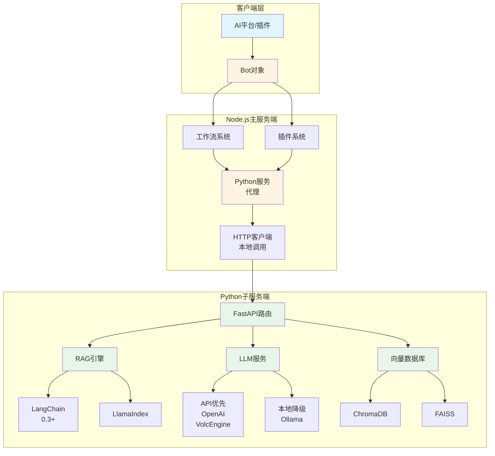
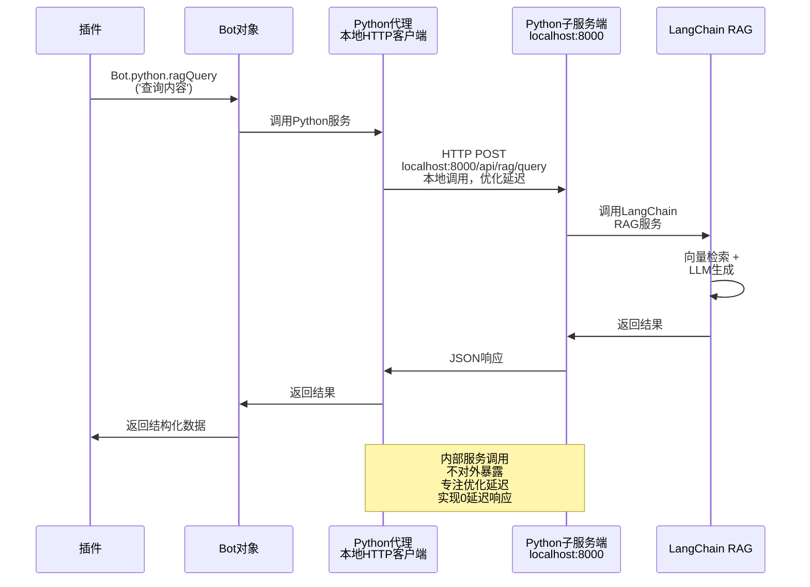
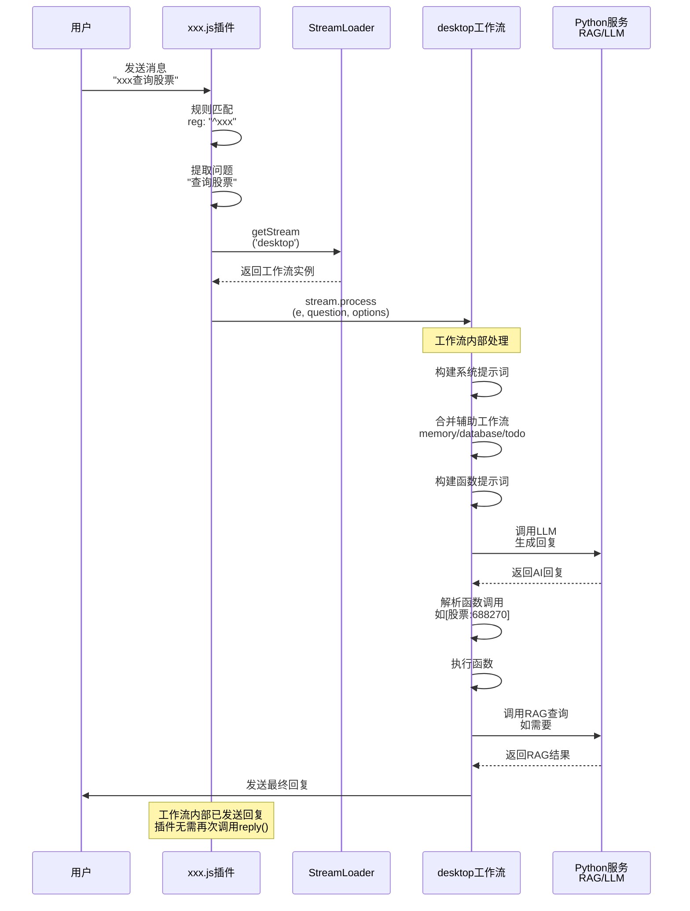
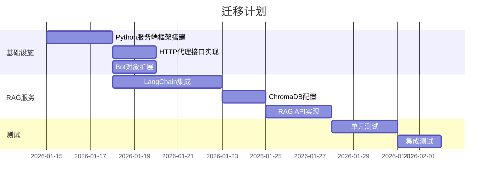
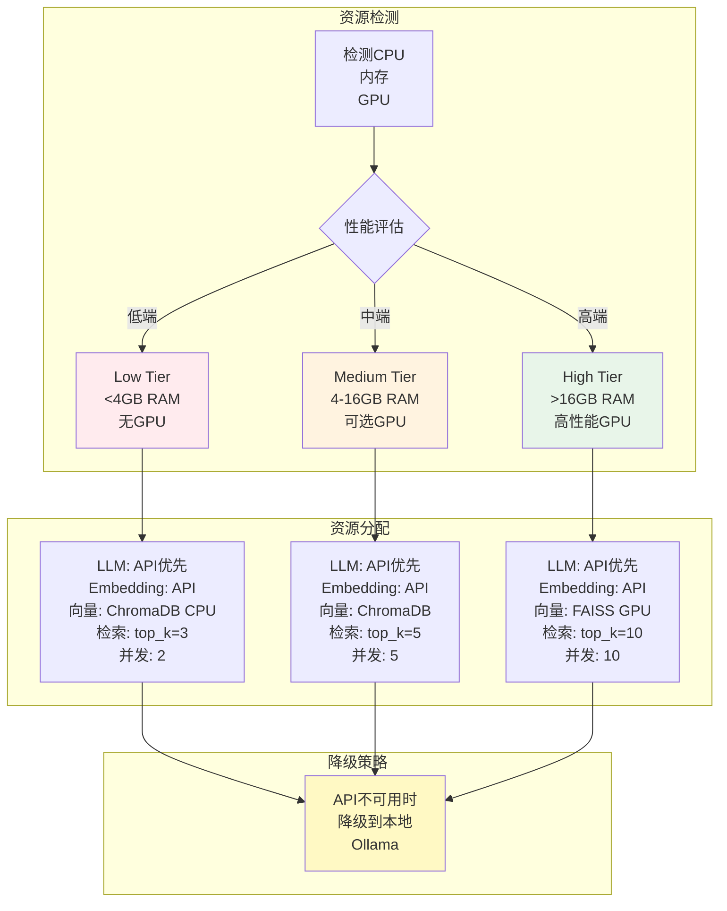
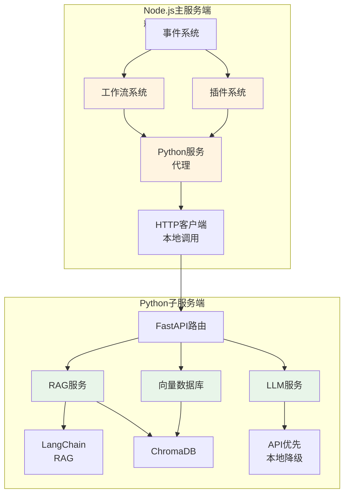
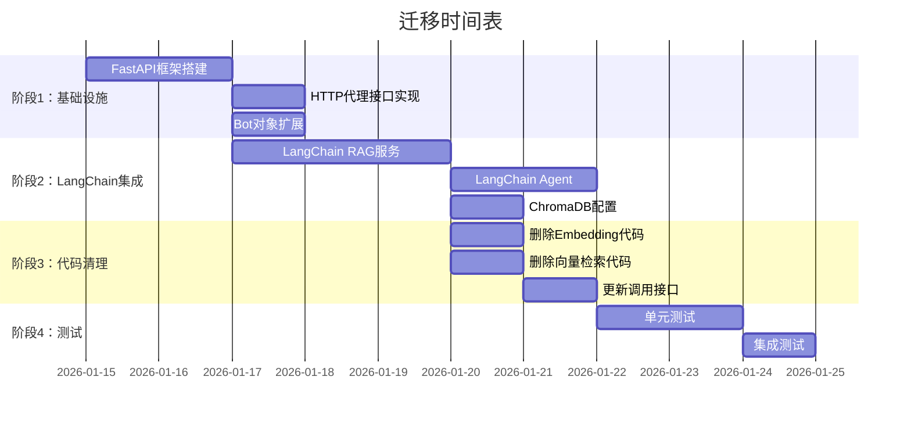

# XRK-AGT 未来架构规划（2026）

## 📋 目录

- [概述](#概述)
- [架构设计](#架构设计)
- [技术栈升级](#技术栈升级)
- [实现方案](#实现方案)
- [迁移计划](#迁移计划)
- [示例代码](#示例代码)

---

## 概述

### 核心目标

1. **高性能内服务调用**：Python作为子服务端，仅面向Node.js主服务端，不暴露给外部，专注优化延迟实现0延迟响应
2. **简化插件开发**：插件通过Bot对象直接调用Python服务，无需关心底层实现
3. **利用Python AI生态**：集成2026年最新的Python AI工具和框架（LangChain、Ollama等）
4. **代码精简**：删除Node.js端冗余的AI功能代码，迁移到Python端
5. **提升性能**：使用LangChain Agent减少多轮AI调用，利用RAG等成熟技术

### 问题现状

- ⚠️ 当前AI部分功能无法使用MCP协议，需要多轮调用（正在完善MCP支持）
- ❌ RAG等AI功能在Node端生态不成熟（BM25算法效果差）
- ❌ Node.js端有大量冗余的Embedding和向量检索代码
- ❌ 代码分散，维护困难
- ❌ 性能瓶颈，响应慢

### 解决方案

- ✅ **迁移AI功能到Python端**：使用LangChain生态（RAG、LLM、向量数据库）
- ✅ **删除Node.js端冗余代码**：删除Embedding、BM25、向量检索等代码
- ✅ **保留业务逻辑层**：工作流、插件、事件系统保留在Node.js端
- ✅ **统一调用接口**：通过Bot对象统一调用Python子服务，优化延迟实现近零延迟响应

---

## 架构设计

### 整体架构图



### 数据流图



### 架构对比（迁移前后）

```mermaid
graph TB
    subgraph Before["迁移前<br/>Node.js端<br/>冗余"]
        A1["Embedding生成<br/>BM25算法<br/>~200行"]
        A2["向量检索<br/>Redis存储<br/>~150行"]
        A3["文档处理<br/>基础功能<br/>~100行"]
        A4["工作流系统<br/>保留"]
        A5["插件系统<br/>保留"]
    end
    
    subgraph After["迁移后<br/>精简架构"]
        B1["工作流系统<br/>业务逻辑<br/>保留"]
        B2["插件系统<br/>保留"]
        B3["Python服务<br/>代理新增"]
        B4["LangChain RAG<br/>向量数据库<br/>Python端"]
        B5["LangChain Agent<br/>工具调用<br/>Python端"]
    end
    
    A1 -.删除~200行.-> B4
    A2 -.删除~150行.-> B4
    A3 -.删除~100行.-> B4
    A4 --> B1
    A5 --> B2
    B1 --> B3
    B2 --> B3
    B3 --> B4
    B3 --> B5
    
    style A1 fill:#ffebee
    style A2 fill:#ffebee
    style A3 fill:#ffebee
    style B4 fill:#e8f5e9
    style B5 fill:#e8f5e9
```



### 代码量对比

| 模块 | 迁移前 | 迁移后 | 变化 |
|------|--------|--------|------|
| **Node.js端** | ~15,000行 | ~12,000行 | **-3,000行（-20%）** |
| **Python端** | ~500行 | ~3,000行 | **+2,500行（新增）** |
| **总计** | ~15,500行 | ~15,000行 | **-500行（精简）** |

**优势**：
- ✅ Node.js端代码更精简，职责更清晰
- ✅ Python端功能更强大，使用成熟生态
- ✅ 总体代码量减少，维护更容易

---

## 技术栈升级

### Python子服务端（2026新特性）

#### 1. 核心框架

```python
# FastAPI 0.115+ (2026最新)
- 异步性能优化
- 更好的类型提示支持
- WebSocket增强

# Pydantic v2.5+
- 性能提升50%+
- 更好的验证和序列化
- 支持JSON Schema自动生成
```

#### 2. AI/ML框架

```python
# LangChain 0.3+ (2026)
- LangGraph: 工作流编排
- LangServe: API服务化
- LangChain Expression Language (LCEL)
- 更好的RAG支持

# LlamaIndex 0.10+
- 向量存储优化
- 多模态支持
- 更好的检索性能

# Transformers 4.40+
- 支持最新模型（Llama 3.2, Qwen 2.5等）
- 量化优化
- 推理加速

# Ollama (本地降级方案)
- API不可用时的降级选择
- 纯本地环境支持
- 隐私保护场景
```

#### 3. 向量数据库

**ChromaDB（主要选择）**
- 轻量级、易于部署
- 持久化支持，数据安全可靠
- 与LangChain深度集成
- 支持多集合（collections）管理
- 本地部署，无外部依赖

**FAISS（高性能场景）**
- Meta开源的高性能向量检索库
- 支持GPU加速（可选）
- 适合大规模向量检索
- 需要额外的集成工作

**规划**：
- 默认使用ChromaDB作为向量存储
- 数据持久化到本地目录（`data/chroma`）
- 支持知识库、记忆系统等多个集合
- 未来可根据需求扩展FAISS支持

#### 4. 提示词优化方案

**问题**：工作流系统需要构建大量提示词（系统提示词、函数提示词、上下文等），直接拼接会导致token消耗大、响应慢。

**优化方案**：

1. **提示词模板化**
   - 使用LangChain的`PromptTemplate`管理模板
   - 动态变量替换，避免重复构建
   - 模板缓存，减少重复计算

2. **提示词压缩**
   - 使用LangChain的`PromptCompressor`压缩长提示词
   - 保留关键信息，去除冗余内容
   - 可减少30-50%的token消耗

3. **分层提示词构建**
   - 系统提示词：静态模板，启动时加载
   - 函数提示词：按需动态生成
   - 上下文提示词：使用RAG检索，只包含相关内容

4. **提示词缓存**
   - 相同查询的提示词缓存
   - 使用哈希值判断是否命中缓存
   - 减少重复的提示词构建开销

**实现示例**：

```python
# subserver/pyserver/core/prompt_optimizer.py
from langchain.prompts import PromptTemplate
from langchain.prompt_compressor import PromptCompressor
import hashlib
import json

class PromptOptimizer:
    """提示词优化器"""
    
    def __init__(self):
        self.template_cache = {}
        self.prompt_cache = {}
        self.compressor = PromptCompressor()
    
    def get_template(self, template_name: str, **kwargs) -> str:
        """获取模板（带缓存）"""
        cache_key = f"{template_name}_{hashlib.md5(json.dumps(kwargs, sort_keys=True).encode()).hexdigest()}"
        if cache_key not in self.template_cache:
            template = PromptTemplate.from_template(self._load_template(template_name))
            self.template_cache[cache_key] = template.format(**kwargs)
        return self.template_cache[cache_key]
    
    def compress_prompt(self, prompt: str, max_tokens: int = 2000) -> str:
        """压缩提示词"""
        if len(prompt) <= max_tokens:
            return prompt
        return self.compressor.compress(prompt, max_tokens=max_tokens)
    
    def build_system_prompt(self, functions: list, context: dict) -> str:
        """构建系统提示词（优化版）"""
        # 1. 使用模板
        base_prompt = self.get_template("system_base", **context)
        
        # 2. 函数提示词动态生成（只包含启用的函数）
        function_prompts = [f.get("prompt", "") for f in functions if f.get("enabled")]
        functions_text = "\n".join(function_prompts)
        
        # 3. 合并并压缩
        full_prompt = f"{base_prompt}\n\n可用函数：\n{functions_text}"
        return self.compress_prompt(full_prompt, max_tokens=3000)
```

**好处**：
- ✅ **减少token消耗**：压缩和缓存可减少30-50%的token使用
- ✅ **提升响应速度**：模板缓存和分层构建减少计算时间
- ✅ **降低API成本**：更少的token意味着更低的API调用成本
- ✅ **更好的性能**：优化的提示词结构提升LLM理解效率

**改动说明**：
- Node.js端：工作流构建提示词时，调用Python服务的提示词优化接口
- Python端：新增`PromptOptimizer`类，提供提示词模板化、压缩、缓存功能
- 接口：`POST /api/prompt/optimize` - 优化提示词
- 接口：`POST /api/prompt/build` - 构建完整提示词

---

## 实现方案

### 1. Node.js端：Python服务代理

#### 1.1 HTTP接口层

**文件**: `core/http/python.js`

```javascript
import BotUtil from '#utils/botutil.js';
import axios from 'axios';
import cfg from '#infrastructure/config/config.js';

/**
 * Python子服务端代理
 * 提供统一的接口调用Python服务端
 */
export default {
  name: 'python',
  dsc: 'Python子服务端代理接口',
  priority: 100,

  routes: [
    {
      method: 'POST',
      path: '/api/python/:service/:action',
      handler: async (req, res, Bot) => {
        const { service, action } = req.params;
        const pythonUrl = cfg.python?.url || 'http://localhost:8000';
        
        try {
          const response = await axios.post(
            `${pythonUrl}/api/${service}/${action}`,
            req.body,
            {
              timeout: 30000,
              headers: {
                'Content-Type': 'application/json',
                'X-Request-ID': req.headers['x-request-id'] || Date.now().toString()
              }
            }
          );
          
          res.json({
            success: true,
            data: response.data
          });
        } catch (error) {
          BotUtil.makeLog('error', `Python服务调用失败: ${error.message}`, 'PythonProxy');
          res.status(error.response?.status || 500).json({
            success: false,
            error: error.message,
            data: error.response?.data
          });
        }
      }
    },
    
    {
      method: 'GET',
      path: '/api/python/health',
      handler: async (req, res, Bot) => {
        const pythonUrl = cfg.python?.url || 'http://localhost:8000';
        try {
          const response = await axios.get(`${pythonUrl}/health`, { timeout: 5000 });
          res.json({ success: true, status: response.data });
        } catch (error) {
          res.status(503).json({ success: false, error: 'Python服务不可用' });
        }
      }
    }
  ]
};
```

#### 1.2 Bot对象扩展

**文件**: `src/utils/python-client.js`

```javascript
import axios from 'axios';
import cfg from '#infrastructure/config/config.js';
import BotUtil from '#utils/botutil.js';

/**
 * Python服务客户端
 * 供Bot对象和插件使用
 */
export class PythonClient {
  constructor(bot) {
    this.bot = bot;
    this.baseUrl = cfg.python?.url || 'http://localhost:8000';
    this.timeout = cfg.python?.timeout || 30000;
  }

  /**
   * 调用Python API
   * @param {string} service - 服务名称（如：rag, llm, tools）
   * @param {string} action - 操作名称（如：query, generate, search）
   * @param {Object} params - 参数
   * @returns {Promise<any>} 结果
   */
  async call(service, action, params = {}) {
    try {
      const response = await axios.post(
        `${this.baseUrl}/api/${service}/${action}`,
        params,
        {
          timeout: this.timeout,
          headers: {
            'Content-Type': 'application/json',
            'X-Request-ID': `${Date.now()}-${Math.random().toString(36).substr(2, 9)}`
          }
        }
      );
      
      return {
        success: true,
        data: response.data
      };
    } catch (error) {
      BotUtil.makeLog('error', `Python API调用失败[${service}.${action}]: ${error.message}`, 'PythonClient');
      return {
        success: false,
        error: error.message,
        data: error.response?.data
      };
    }
  }

  /**
   * RAG查询
   */
  async ragQuery(query, options = {}) {
    return this.call('rag', 'query', { query, ...options });
  }

  /**
   * LLM生成
   */
  async llmGenerate(prompt, options = {}) {
    return this.call('llm', 'generate', { prompt, ...options });
  }

  /**
   * 向量搜索
   */
  async vectorSearch(query, topK = 5, options = {}) {
    return this.call('vector', 'search', { query, top_k: topK, ...options });
  }

  /**
   * 文档处理
   */
  async documentProcess(filePath, options = {}) {
    return this.call('document', 'process', { file_path: filePath, ...options });
  }
}
```

**在Bot类中集成**:

```javascript
// src/bot.js
import { PythonClient } from '#utils/python-client.js';

export default class Bot extends EventEmitter {
  constructor() {
    super();
    // ... 其他初始化
    this.python = new PythonClient(this);
  }
}
```

### 2. Python子服务端实现

#### 2.1 RAG服务

**文件**: `subserver/pyserver/apis/rag_api.py`

```python
"""RAG服务API"""
from fastapi import APIRouter, HTTPException
from pydantic import BaseModel, Field
from typing import Optional, List
from core.rag_service import RAGService

router = APIRouter(prefix="/api/rag", tags=["RAG"])

rag_service = RAGService()

class QueryRequest(BaseModel):
    query: str = Field(..., description="查询文本")
    top_k: int = Field(5, ge=1, le=50, description="返回结果数量")
    collection: Optional[str] = Field(None, description="集合名称")
    filter: Optional[dict] = Field(None, description="过滤条件")

class QueryResponse(BaseModel):
    query: str
    results: List[dict]
    total: int
    time_ms: float

@router.post("/query", response_model=QueryResponse)
async def query(request: QueryRequest):
    """RAG查询接口"""
    try:
        results = await rag_service.query(
            query=request.query,
            top_k=request.top_k,
            collection=request.collection,
            filter=request.filter
        )
        return QueryResponse(
            query=request.query,
            results=results,
            total=len(results),
            time_ms=rag_service.last_query_time
        )
    except Exception as e:
        raise HTTPException(status_code=500, detail=str(e))

@router.post("/index")
async def index_document(file_path: str, collection: str = "default"):
    """索引文档"""
    try:
        result = await rag_service.index_document(file_path, collection)
        return {"success": True, "document_id": result}
    except Exception as e:
        raise HTTPException(status_code=500, detail=str(e))
```

#### 2.2 RAG服务实现（使用LangChain 0.3+）

**文件**: `subserver/pyserver/core/rag_service.py`

```python
"""RAG服务实现（使用LangChain 0.3+）"""
import time
from typing import List, Optional, Dict
from langchain_community.vectorstores import Chroma
from langchain_community.embeddings import OllamaEmbeddings
from langchain_community.llms import Ollama
from langchain.chains import RetrievalQA
from langchain.prompts import PromptTemplate
from langchain.text_splitter import RecursiveCharacterTextSplitter
from langchain_community.document_loaders import TextLoader, PyPDFLoader
import chromadb

class RAGService:
    """RAG服务（使用LangChain 0.3+）"""
    
    def __init__(self):
        # Embedding模型：API优先，本地降级
        self.embedding_provider = config.get("embedding", {}).get("provider", "api")
        if self.embedding_provider == "api":
            from langchain_openai import OpenAIEmbeddings
            self.embeddings = OpenAIEmbeddings()
        else:
            from langchain_community.embeddings import OllamaEmbeddings
            self.embeddings = OllamaEmbeddings(model="nomic-embed-text")
        
        # 向量存储：根据性能选择ChromaDB或FAISS
        vectorstore_type = config.get("vectorstore", {}).get("type", "chroma")
        if vectorstore_type == "faiss":
            from langchain_community.vectorstores import FAISS
            self.vectorstore = FAISS(embedding_function=self.embeddings)
        else:
            self.vectorstore = Chroma(
                collection_name="documents",
                embedding_function=self.embeddings,
                persist_directory="./data/chroma"
            )
        
        # LLM：API优先，本地降级
        llm_provider = config.get("llm", {}).get("provider", "api")
        if llm_provider == "api":
            from langchain_openai import ChatOpenAI
            self.llm = ChatOpenAI()
        else:
            from langchain_community.llms import Ollama
            self.llm = Ollama(model="llama3.2:7b")
        
        # 检索链
        self.qa_chain = RetrievalQA.from_chain_type(
            llm=self.llm,
            chain_type="stuff",
            retriever=self.vectorstore.as_retriever(search_kwargs={"k": 5}),
            return_source_documents=True
        )
        
        self.last_query_time = 0.0
    
    async def query(self, query: str, top_k: int = 5, collection: Optional[str] = None, filter: Optional[Dict] = None) -> List[Dict]:
        """RAG查询"""
        start_time = time.time()
        
        # 使用LangChain检索链
        result = self.qa_chain.invoke({"query": query})
        
        # 格式化结果
        results = []
        for doc in result.get("source_documents", []):
            results.append({
                "content": doc.page_content,
                "metadata": doc.metadata,
                "score": 1.0  # LangChain不直接提供分数
            })
        
        self.last_query_time = (time.time() - start_time) * 1000
        
        return results[:top_k]
    
    async def index_document(self, file_path: str, collection: str = "default") -> str:
        """索引文档"""
        # 加载文档
        if file_path.endswith('.pdf'):
            loader = PyPDFLoader(file_path)
        else:
            loader = TextLoader(file_path)
        
        documents = loader.load()
        
        # 文本分割
        text_splitter = RecursiveCharacterTextSplitter(
            chunk_size=1000,
            chunk_overlap=200
        )
        splits = text_splitter.split_documents(documents)
        
        # 添加到向量存储
        self.vectorstore.add_documents(splits)
        
        return f"indexed_{len(splits)}_chunks"
```

#### 2.3 LLM服务

**文件**: `subserver/pyserver/apis/llm_api.py`

```python
"""LLM服务API"""
from fastapi import APIRouter
from pydantic import BaseModel
from core.llm_service import LLMService

router = APIRouter(prefix="/api/llm", tags=["LLM"])

llm_service = LLMService()

class GenerateRequest(BaseModel):
    prompt: str
    model: str = "llama3.2"
    temperature: float = 0.7
    max_tokens: int = 1000

@router.post("/generate")
async def generate(request: GenerateRequest):
    """生成文本"""
    result = await llm_service.generate(
        prompt=request.prompt,
        model=request.model,
        temperature=request.temperature,
        max_tokens=request.max_tokens
    )
    return {"success": True, "text": result}
```

#### 2.4 API注册

**文件**: `subserver/pyserver/core/loader.py`

```python
"""API加载器"""
from fastapi import FastAPI
from apis.rag_api import router as rag_router
from apis.llm_api import router as llm_router

class ApiLoader:
    @staticmethod
    async def load_all(app: FastAPI):
        """加载所有API"""
        app.include_router(rag_router)
        app.include_router(llm_router)
        # ... 其他API
```

### 3. 插件系统调用工作流流程

#### 3.1 插件调用工作流的完整流程

以 `xxx.js` 插件为例，展示插件如何调用工作流系统：

**文件**: `core/plugin/example/xxx.js`

```javascript
import StreamLoader from '#infrastructure/aistream/loader.js';

export default class xxx extends plugin {
  constructor() {
    super({
      name: "XXX工作流",
      event: "message",
      priority: 1000,
      rule: [
        {
          reg: "^xxx",
          fnc: "triggerWorkflow",
          permission: 'master'
        }
      ]
    });
  }

  async triggerWorkflow() {
    const question = this.e.msg.trim().substring(3).trim();
    if (!question) {
      return this.reply('请输入要询问的内容');
    }

    // 1. 获取工作流实例
    const stream = StreamLoader.getStream('desktop');
    if (!stream) return this.reply('工作流未加载');

    // 2. 调用工作流的process方法
    await stream.process(this.e, question, {
      enableTodo: true,        // 启用TODO工作流
      enableMemory: true,      // 启用记忆系统
      enableDatabase: true     // 启用知识库
    });

    return true;
  }
}
```

#### 3.2 插件调用工作流的流程图



#### 3.3 关键要点

1. **插件获取工作流**：通过 `StreamLoader.getStream(name)` 获取工作流实例
2. **调用process方法**：使用 `stream.process(e, question, options)` 统一接口
3. **自动合并辅助工作流**：通过 `enableMemory`、`enableDatabase` 等选项自动合并
4. **回复机制**：工作流内部已处理回复发送，插件无需再次调用 `reply()`
5. **错误处理**：插件应检查工作流是否存在，并提供友好的错误提示

#### 3.4 插件调用Python服务的示例

```javascript
// 插件直接调用Python服务（不通过工作流）
async queryRAG(e) {
  const result = await Bot.python.ragQuery(e.msg, {
    top_k: 5,
    collection: 'documents'
  });
  
  if (result.success) {
    await this.reply(`查询结果：${result.data.results[0].content}`);
  }
}
```

---

## 迁移计划

### 阶段1：基础设施搭建（1-2周）



### 阶段2：核心功能迁移（2-3周）

- ✅ RAG功能迁移到Python端
- ✅ LLM服务迁移到Python端
- ✅ 向量数据库集成
- ✅ 文档处理功能

### 阶段3：优化和扩展（持续）

- ✅ 性能优化
- ✅ 缓存机制
- ✅ 监控和日志
- ✅ 更多AI功能集成

---

## 配置示例

### Node.js配置

**文件**: `config/default_config/python.yaml`

```yaml
python:
  enabled: true
  url: "http://localhost:8000"  # 本地调用，不对外暴露
  timeout: 5000                 # 超时时间（毫秒）
  keep_alive: true              # 保持连接，减少延迟
  retry:
    max_attempts: 3
    delay: 500
  health_check:
    interval: 10000
    timeout: 2000
  connection_pool:
    max: 10                     # 连接池大小
    idle_timeout: 30000
```

### Python配置

**文件**: `subserver/pyserver/config.yaml`

```yaml
server:
  host: "127.0.0.1"    # 仅本地监听，不对外暴露
  port: 8000
  reload: false
  workers: 1           # 单进程，减少开销

# 模型策略：API优先，本地为辅
llm:
  provider: "api"  # api | ollama
  api_provider: "openai"  # openai | volcengine
  local_fallback: true  # API不可用时降级到本地
  local_model: "llama3.2:7b"
  temperature: 0.7
  max_tokens: 2000

embedding:
  provider: "api"  # api | ollama
  api_provider: "openai"
  local_fallback: true
  local_model: "nomic-embed-text"

# 向量存储和检索（根据性能自动选择）
rag:
  vectorstore:
    type: "auto"  # auto | chroma | faiss
    persist_directory: "./data/chroma"
    collection_prefix: "xrk_"
  retrieval:
    top_k: "auto"  # 根据性能等级自动调整
  chunk_size: 1000
  chunk_overlap: 200

# 性能适配配置
performance:
  auto_detect: true
  device_tier: "auto"
  resource_monitor: true
  adaptive_degradation: true
```

---

## 资源分配与性能适配

### 模型策略：API优先，本地为辅

**核心原则**：
- ✅ **LLM模型**：优先使用API（OpenAI、VolcEngine等），本地模型（Ollama）作为降级方案
- ✅ **Embedding模型**：优先使用API，本地模型仅用于纯本地环境
- ✅ **向量存储**：本地ChromaDB/FAISS，根据设备性能选择
- ✅ **向量检索**：本地执行，根据数据规模选择ChromaDB或FAISS

### 资源分配策略



### 性能等级与资源分配

| 性能等级 | 硬件特征 | LLM模型 | Embedding模型 | 向量存储 | 检索top_k | 并发数 |
|---------|---------|---------|--------------|---------|----------|--------|
| **低端** | <4GB RAM, 无GPU | API优先 | API优先 | ChromaDB CPU | 3 | 2 |
| **中端** | 4-16GB RAM, 可选GPU | API优先 | API优先 | ChromaDB | 5 | 5 |
| **高端** | >16GB RAM, 高性能GPU | API优先 | API优先 | FAISS GPU | 10 | 10 |

**说明**：
- **LLM/Embedding模型**：默认使用API，仅在API不可用或配置为纯本地模式时使用Ollama
- **向量存储**：本地ChromaDB（轻量）或FAISS（高性能），根据设备性能选择
- **向量检索**：本地执行，top_k根据设备性能调整

### 资源分配实现

**文件**: `subserver/pyserver/core/performance_adapter.py`

```python
"""资源分配适配器"""
import psutil
from typing import Literal

DeviceTier = Literal["low", "medium", "high"]

class PerformanceAdapter:
    """资源分配适配器 - 根据设备性能分配向量存储和检索资源"""
    
    def __init__(self):
        self.tier = self.detect_device_tier()
        self.config = self.get_tier_config()
    
    def detect_device_tier(self) -> DeviceTier:
        """自动检测设备性能等级"""
        memory_gb = psutil.virtual_memory().total / (1024**3)
        has_gpu = self._check_gpu()
        gpu_memory = self._get_gpu_memory() if has_gpu else 0
        
        if memory_gb < 4:
            return "low"
        elif memory_gb >= 16 and has_gpu and gpu_memory >= 8:
            return "high"
        else:
            return "medium"
    
    def get_tier_config(self) -> dict:
        """根据性能等级获取资源分配配置"""
        configs = {
            "low": {
                "llm_provider": "api",  # API优先
                "embedding_provider": "api",  # API优先
                "vectorstore": "chroma",  # ChromaDB CPU模式
                "vectorstore_use_gpu": False,
                "retrieval_top_k": 3,  # 减少检索数量
                "max_concurrent": 2,
                "chunk_size": 500,
                "enable_local_fallback": True  # 允许降级到本地
            },
            "medium": {
                "llm_provider": "api",
                "embedding_provider": "api",
                "vectorstore": "chroma",
                "vectorstore_use_gpu": False,
                "retrieval_top_k": 5,
                "max_concurrent": 5,
                "chunk_size": 1000,
                "enable_local_fallback": True
            },
            "high": {
                "llm_provider": "api",
                "embedding_provider": "api",
                "vectorstore": "faiss",  # FAISS GPU加速
                "vectorstore_use_gpu": True,
                "retrieval_top_k": 10,
                "max_concurrent": 10,
                "chunk_size": 2000,
                "enable_local_fallback": True
            }
        }
        return configs.get(self.tier, configs["medium"])
    
    def _check_gpu(self) -> bool:
        """检查是否有GPU（用于向量检索加速）"""
        try:
            import torch
            return torch.cuda.is_available()
        except:
            return False
    
    def _get_gpu_memory(self) -> float:
        """获取GPU显存（GB）"""
        try:
            import torch
            if torch.cuda.is_available():
                return torch.cuda.get_device_properties(0).total_memory / (1024**3)
        except:
            pass
        return 0
```

### 资源监控与降级策略

**监控指标**：
- 向量存储内存使用率
- 向量检索响应时间
- API调用成功率
- 本地模型资源占用（如启用）

**降级策略**：
- API不可用时，自动降级到本地Ollama
- 向量存储内存不足时，减少检索top_k
- 检索响应时间过长时，切换到更轻量的向量存储
- 动态调整并发数，避免资源耗尽

**实现示例**：

```python
# subserver/pyserver/core/resource_monitor.py
class ResourceMonitor:
    """资源监控器 - 监控向量存储和检索资源"""
    
    def __init__(self, adapter: PerformanceAdapter):
        self.adapter = adapter
        self.memory_threshold = 85
        self.retrieval_timeout = 5000  # 检索超时时间（ms）
    
    def check_and_degrade(self) -> bool:
        """检查资源并决定是否降级"""
        memory_usage = psutil.virtual_memory().percent
        
        # 内存不足时，减少检索top_k
        if memory_usage > self.memory_threshold:
            if self.adapter.config["retrieval_top_k"] > 3:
                self.adapter.config["retrieval_top_k"] -= 2
                return True
        return False
    
    def should_use_local_fallback(self, api_available: bool) -> bool:
        """判断是否应该使用本地降级"""
        return not api_available and self.adapter.config["enable_local_fallback"]
```

### 配置示例

```yaml
# subserver/pyserver/config.yaml
# 模型策略：API优先，本地为辅
llm:
  provider: "api"  # api | ollama
  api_provider: "openai"  # openai | volcengine | 其他
  local_fallback: true  # API不可用时降级到本地
  local_model: "llama3.2:7b"  # 本地降级模型

embedding:
  provider: "api"  # api | ollama
  api_provider: "openai"
  local_fallback: true
  local_model: "nomic-embed-text"

# 向量存储和检索（根据性能自动选择）
vectorstore:
  type: "auto"  # auto | chroma | faiss
  auto_detect: true
  chroma:
    persist_directory: "./data/chroma"
  faiss:
    use_gpu: true  # 高端设备启用GPU加速

retrieval:
  top_k: "auto"  # auto | 3 | 5 | 10（根据性能等级）
  timeout_ms: 5000

performance:
  device_tier: "auto"  # auto | low | medium | high
  resource_monitor: true
  adaptive_degradation: true
```

### 好处与改动

**好处**：
- ✅ **API优先**：默认使用API，性能稳定，成本可控
- ✅ **本地降级**：API不可用时自动降级，保证服务可用性
- ✅ **资源优化**：向量存储和检索根据设备性能自动分配
- ✅ **灵活适配**：支持纯本地环境，满足隐私和安全需求

**改动说明**：
- 模型策略：LLM和Embedding默认使用API，本地模型作为降级方案
- 向量存储：根据设备性能自动选择ChromaDB或FAISS
- 检索优化：根据设备性能动态调整top_k和并发数
- 资源监控：重点监控向量存储内存和检索性能

---

## 优势总结

### 1. 性能优化

- ✅ **本地调用**：Python服务运行在本地，网络延迟极低
- ✅ **连接池**：HTTP连接复用，减少连接建立开销
- ✅ **异步处理**：Python异步框架性能优异
- ✅ **批量处理**：支持批量请求，提升吞吐量
- ✅ **API优先**：默认使用API，性能稳定；本地模型作为降级方案

### 2. 生态优势

- ✅ **成熟工具**：LangChain、LlamaIndex等成熟框架
- ✅ **丰富模型**：支持各种开源和商业模型
- ✅ **向量数据库**：ChromaDB持久化存储，性能优异

### 3. 设备性能适配

- ✅ **自动检测**：启动时自动检测CPU/内存/GPU，确定性能等级
- ✅ **分级配置**：低端/中端/高端三档配置，自动适配
- ✅ **资源监控**：实时监控资源使用率，必要时自动降级
- ✅ **灵活部署**：支持从低端到高端的各种设备，广泛兼容

### 4. 提示词优化

- ✅ **模板化**：使用LangChain PromptTemplate，减少重复构建
- ✅ **压缩**：PromptCompressor压缩长提示词，减少30-50% token消耗
- ✅ **缓存**：提示词缓存机制，避免重复计算
- ✅ **分层构建**：系统/函数/上下文分层，按需生成

### 5. 开发体验

- ✅ **统一接口**：Bot对象统一调用，插件开发简单
- ✅ **类型安全**：Pydantic提供类型验证
- ✅ **易于扩展**：FastAPI路由系统灵活

### 6. 安全性

- ✅ **内部服务**：Python服务仅监听本地，不对外暴露
- ✅ **权限控制**：所有调用经过Node.js主服务端验证
- ✅ **隔离部署**：Python服务独立运行，故障隔离

---

## 代码清理和迁移规划

### 🗑️ 可删除的Node.js端代码

#### 1. Embedding相关代码（迁移到LangChain）

**位置**: `src/infrastructure/aistream/aistream.js`

**可删除的方法**：
- ❌ `initLightweightEmbedding()` - BM25算法（LangChain有更好的）
- ❌ `generateEmbedding()` - Embedding生成（LangChain处理）
- ❌ `generateRemoteEmbedding()` - 远程Embedding API（LangChain处理）
- ❌ `cosineSimilarity()` - 向量相似度计算（LangChain处理）
- ❌ `retrieveContexts()` - 上下文检索（LangChain RAG处理）
- ❌ `storeMessageWithEmbedding()` - 消息存储（LangChain向量数据库处理）

**保留**：
- ✅ `initEmbedding()` - 保留接口，但改为调用Python服务
- ✅ `embeddingConfig` - 保留配置，但改为指向Python服务

#### 2. 知识库向量检索（迁移到LangChain）

**位置**: `core/stream/database.js`

**可删除的方法**：
- ❌ `queryKnowledgeWithEmbedding()` - 向量检索（LangChain处理）
- ❌ `generateEmbeddingAsync()` - Embedding生成（LangChain处理）
- ❌ `saveEmbeddingAsync()` - Embedding保存（LangChain向量数据库处理）
- ❌ `retrieveKnowledgeContexts()` - 知识检索（LangChain RAG处理）

**保留**：
- ✅ `saveKnowledge()` - 保留，但改为调用Python服务索引
- ✅ `queryKnowledge()` - 保留接口，但改为调用Python RAG服务
- ✅ `listDatabases()` - 保留，业务逻辑

#### 3. 记忆系统向量检索（迁移到LangChain）

**位置**: `core/stream/memory.js`

**可删除的方法**：
- ❌ 所有向量检索相关代码（迁移到LangChain）

**保留**：
- ✅ 记忆存储和查询接口（改为调用Python服务）

#### 4. BM25算法实现（完全删除）

**位置**: `src/infrastructure/aistream/aistream.js`

**可删除**：
- ❌ `SimilarityCalculator` 类（BM25算法）
- ❌ 所有BM25相关代码

**原因**：LangChain的向量检索比BM25效果好得多

---

### 🔄 迁移到Python端的代码

#### 1. RAG功能 → LangChain

```python
# 迁移前（Node.js）
# core/stream/database.js
async queryKnowledgeWithEmbedding(records, query) {
  // 向量检索逻辑
  const queryEmbedding = await this.generateEmbedding(query);
  // ... 相似度计算
}

# 迁移后（Python + LangChain）
# subserver/pyserver/core/rag_service.py
from langchain.chains import RetrievalQA
from langchain.vectorstores import Chroma

class RAGService:
    async def query(self, query: str):
        # LangChain处理RAG查询
        result = self.qa_chain.invoke({"query": query})
        return result
```

#### 2. Embedding生成 → LangChain

```python
# 迁移前（Node.js）
# src/infrastructure/aistream/aistream.js
async generateEmbedding(text) {
  // 调用API或BM25
}

# 迁移后（Python + LangChain）
# subserver/pyserver/core/rag_service.py
from langchain_community.embeddings import OllamaEmbeddings

embeddings = OllamaEmbeddings(model="nomic-embed-text")
vector = embeddings.embed_query(text)
```

#### 3. 向量数据库 → ChromaDB/FAISS

```python
# 迁移前（Node.js）
# 使用Redis存储向量（临时方案）

# 迁移后（Python + LangChain）
# subserver/pyserver/core/rag_service.py
from langchain.vectorstores import Chroma

vectorstore = Chroma(
    collection_name="documents",
    embedding_function=embeddings,
    persist_directory="./data/chroma"
)
```

---

### 📋 详细删除清单

#### 文件级别删除

| 文件/模块 | 删除内容 | 迁移到 | 优先级 |
|-----------|---------|--------|--------|
| `src/infrastructure/aistream/aistream.js` | BM25算法、Embedding生成 | LangChain | 🔴 高 |
| `core/stream/database.js` | 向量检索逻辑 | LangChain RAG | 🔴 高 |
| `core/stream/memory.js` | 向量检索逻辑 | LangChain RAG | 🔴 高 |
| `src/infrastructure/aistream/aistream.js` | `retrieveContexts()` | LangChain RAG | 🔴 高 |

#### 方法级别删除

**`src/infrastructure/aistream/aistream.js`**：
- ❌ `initLightweightEmbedding()` (~50行)
- ❌ `generateEmbedding()` (~30行)
- ❌ `generateRemoteEmbedding()` (~30行)
- ❌ `cosineSimilarity()` (~20行)
- ❌ `retrieveContexts()` (~100行)
- ❌ `storeMessageWithEmbedding()` (~50行)
- ❌ `SimilarityCalculator` 类 (~200行)

**`core/stream/database.js`**：
- ❌ `queryKnowledgeWithEmbedding()` (~50行)
- ❌ `generateEmbeddingAsync()` (~20行)
- ❌ `saveEmbeddingAsync()` (~30行)
- ❌ `retrieveKnowledgeContexts()` (~40行)

**总计可删除**：~620行代码

#### 4. 配置项清理

**位置**: `config/default_config/aistream.yaml`

**可删除的配置**：
- ❌ `embedding.mode: local` - BM25模式（不再需要）
- ❌ `embedding.remote.apiUrl` - 远程Embedding API（LangChain处理）
- ❌ `embedding.remote.apiKey` - API密钥（LangChain处理）

**保留的配置**：
- ✅ `embedding.enabled` - 保留，但改为指向Python服务
- ✅ 工作流相关配置
- ✅ 插件相关配置

---

### 🔄 迁移映射表

| Node.js端功能 | 迁移到 | Python端实现 |
|--------------|--------|-------------|
| `generateEmbedding()` | LangChain | `OllamaEmbeddings.embed_query()` |
| `queryKnowledgeWithEmbedding()` | LangChain RAG | `RetrievalQA.invoke()` |
| `retrieveContexts()` | LangChain RAG | `vectorstore.similarity_search()` |
| `cosineSimilarity()` | LangChain | `vectorstore.similarity_search()` |
| BM25算法 | LangChain | 向量检索（效果更好） |
| Redis向量存储 | ChromaDB | `Chroma(vectorstore)` |
| 文档加载/分割 | LangChain | `TextLoader` + `RecursiveCharacterTextSplitter` |

---

### 📝 迁移步骤概览

1. **搭建Python服务端**：安装依赖，创建API目录结构
2. **实现LangChain RAG服务**：使用LangChain替代Node.js端向量检索
3. **更新Node.js端调用**：将`queryKnowledge`等方法改为调用Python服务
4. **删除冗余代码**：删除Embedding、BM25、向量检索相关代码
5. **更新配置**：修改配置指向Python服务

---

### ⚠️ 重要说明

1. **Python子服务端定位**
   - Python服务作为内部子服务，仅面向Node.js主服务端调用
   - 不对外暴露HTTP接口，确保安全性
   - 本地调用（localhost），专注优化延迟实现0延迟响应
   - 通过连接池、请求缓存等技术优化性能

2. **错误处理**
   - Python服务不可用时，需要有降级方案
   - 添加健康检查和自动重连机制
   - 服务启动失败时，Node.js端应优雅降级

3. **数据迁移**
   - 现有Redis中的向量数据需要迁移到ChromaDB
   - 提供数据迁移脚本，支持增量迁移
   - 迁移期间保证服务可用性

4. **性能优化**
   - 本地HTTP调用使用keep-alive连接
   - 实现请求缓存机制，减少重复调用
   - 异步批量处理，提升吞吐量

---

### ✅ 保留的Node.js端代码

#### 1. 工作流系统（必须保留）

**位置**: `src/utils/workflow-manager.js`

**保留原因**：
- ✅ 业务逻辑层任务规划
- ✅ 状态管理和持久化
- ✅ 多平台集成（QQ等）
- ✅ 错误处理和重试

**但需要修改**：
- 🔄 工作流步骤可以调用LangChain Agent

#### 2. 插件系统（必须保留）

**位置**: `src/infrastructure/plugins/`

**保留原因**：
- ✅ 功能模块化
- ✅ 生命周期管理
- ✅ 权限验证

#### 3. 事件系统（必须保留）

**位置**: `src/infrastructure/listener/`

**保留原因**：
- ✅ 事件驱动架构
- ✅ 多平台事件处理

#### 4. 工具注册和调用（保留但简化）

**位置**: `src/infrastructure/aistream/loader.js`

**保留原因**：
- ✅ 工具注册机制
- ✅ 函数调用框架

**但需要修改**：
- 🔄 部分工具可以调用LangChain Agent

---

### 🔄 迁移后的架构



---

### 📅 迁移时间表

#### 阶段1：Python服务端搭建（1周）



#### 阶段2：功能迁移（2周）

- ✅ RAG功能迁移到LangChain
- ✅ Embedding生成迁移到LangChain
- ✅ 向量数据库迁移到ChromaDB
- ✅ 文档处理迁移到LangChain
- ✅ 提示词优化功能实现
- ✅ 设备性能适配系统实现
- ✅ 设备性能适配系统实现

#### 阶段3：代码清理（1周）

- ✅ 删除Node.js端的Embedding代码
- ✅ 删除BM25算法实现
- ✅ 删除向量检索逻辑
- ✅ 更新调用接口

#### 阶段4：测试和优化（1周）

- ✅ 功能测试
- ✅ 性能测试（包括提示词优化效果）
- ✅ 文档更新

---

### 🎯 迁移后的代码结构

#### Node.js端（精简后）

```
src/
├── infrastructure/
│   ├── aistream/
│   │   └── aistream.js          # 精简：只保留工作流、插件框架
│   └── plugins/                 # 保留：插件系统
├── utils/
│   └── python-client.js         # 新增：Python服务客户端
└── bot.js                       # 保留：Bot主类

core/
├── workflow-manager.js          # 保留：工作流系统
├── stream/
│   ├── desktop.js              # 保留：桌面工具
│   ├── tools.js                # 保留：基础工具
│   ├── database.js             # 精简：只保留接口，调用Python
│   └── memory.js               # 精简：只保留接口，调用Python
└── http/
    └── python.js               # 新增：Python服务代理
```

#### Python端（新增）

```
subserver/pyserver/
├── apis/
│   ├── rag_api.py              # 新增：RAG服务API
│   ├── llm_api.py              # 新增：LLM服务API
│   ├── prompt_api.py           # 提示词优化API
│   └── document_api.py         # 文档处理API
├── core/
│   ├── rag_service.py          # RAG服务（LangChain）
│   ├── llm_service.py          # LLM服务（LangChain）
│   ├── prompt_optimizer.py     # 提示词优化器
│   ├── performance_adapter.py  # 性能适配器
│   ├── resource_monitor.py     # 资源监控器
│   └── document_service.py     # 文档处理（LangChain）
└── main.py                     # FastAPI应用
```

---

### 📊 代码量变化

| 项目 | 迁移前 | 迁移后 | 变化 |
|------|--------|--------|------|
| **Node.js端** | ~15,000行 | ~12,000行 | **-3,000行（-20%）** |
| **Python端** | ~500行 | ~3,500行 | **+3,000行（新增）** |
| **总计** | ~15,500行 | ~15,500行 | **持平** |

**优势**：
- ✅ Node.js端代码精简，职责清晰
- ✅ Python端功能强大，包含提示词优化
- ✅ 总体代码量持平，但功能更强大

---

## 📋 删除和保留总结

### ❌ 必须删除的代码（迁移到LangChain）

| 模块 | 代码位置 | 删除内容 | 替代方案 |
|------|---------|---------|---------|
| **Embedding生成** | `src/infrastructure/aistream/aistream.js` | `generateEmbedding()`, `generateRemoteEmbedding()` | LangChain `OllamaEmbeddings` |
| **BM25算法** | `src/infrastructure/aistream/aistream.js` | `SimilarityCalculator`类 | LangChain向量检索 |
| **向量检索** | `core/stream/database.js` | `queryKnowledgeWithEmbedding()` | LangChain RAG |
| **向量存储** | Redis临时方案 | Redis向量存储 | ChromaDB |
| **文档处理** | Node.js基础实现 | 文档加载/分割 | LangChain文档处理 |

### ✅ 必须保留的代码（业务逻辑层）

| 模块 | 代码位置 | 保留原因 |
|------|---------|---------|
| **工作流系统** | `core/workflow-manager.js` | 业务逻辑规划、状态管理 |
| **插件系统** | `src/infrastructure/plugins/` | 功能模块化、生命周期管理 |
| **事件系统** | `src/infrastructure/listener/` | 事件驱动架构 |
| **工具注册** | `src/infrastructure/aistream/loader.js` | 工具注册机制 |
| **多平台适配** | `core/tasker/` | QQ等平台集成 |

### 🔄 需要修改的代码（改为调用Python服务）

| 模块 | 修改内容 | 新实现 |
|------|---------|--------|
| **知识库查询** | `core/stream/database.js` | 改为调用`Bot.python.ragQuery()` |
| **记忆查询** | `core/stream/memory.js` | 改为调用`Bot.python.ragQuery()` |
| **上下文检索** | `src/infrastructure/aistream/aistream.js` | 改为调用`Bot.python.ragQuery()` |

---

## 🎯 迁移优先级

### 🔴 高优先级（立即执行）

1. **搭建Python服务端框架**
   - FastAPI应用
   - HTTP路由
   - 配置管理

2. **实现LangChain RAG服务**
   - RAG服务实现
   - ChromaDB配置
   - API接口

3. **实现HTTP代理接口**
   - Node.js端Python代理
   - Bot对象扩展

### 🟡 中优先级（1-2周内）

4. **迁移知识库功能**
   - 更新`database.js`调用Python服务
   - 删除向量检索代码

5. **迁移记忆系统**
   - 更新`memory.js`调用Python服务
   - 删除向量检索代码

6. **删除Embedding代码**
   - 删除`aistream.js`中的Embedding相关代码
   - 删除BM25算法

### 🟢 低优先级（后续优化）

7. **集成LangChain Agent**
   - Agent服务实现
   - 工具调用

8. **性能优化**
   - 缓存机制
   - 批量处理

---

---

**文档版本**: 2.0  
**最后更新**: 2026-01-13  
**维护者**: XRK-AGT Team
