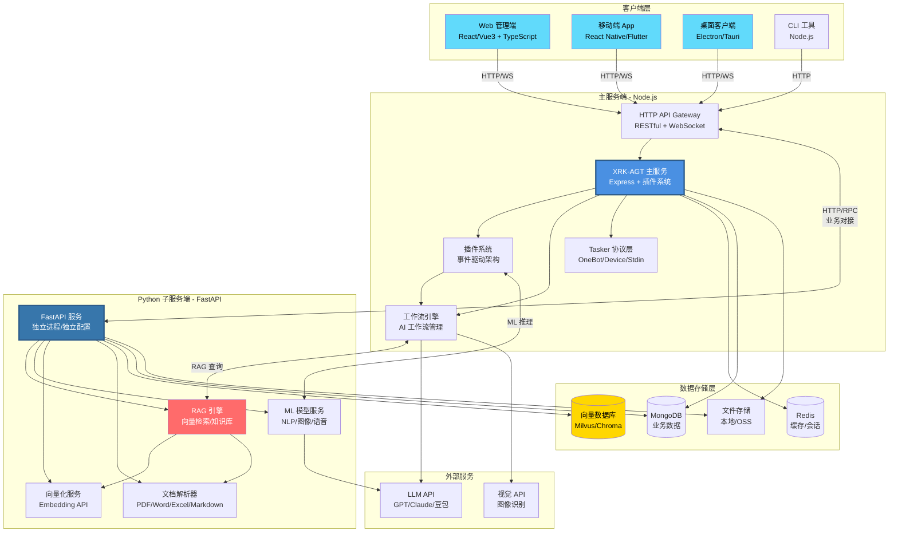

# 未来架构规划

## 技术栈说明

### 主服务端 (Node.js)
- **框架**: Express/Fastify
- **语言**: JavaScript/TypeScript
- **核心**: 插件系统、工作流引擎、Tasker 协议层
- **端口**: 由启动配置决定（HTTP/HTTPS）
- **说明**: 端口在启动时通过 `bot.run({ port: 端口号 })` 指定，可通过配置修改

### Python 子服务端 (FastAPI)
- **框架**: FastAPI + Uvicorn
- **语言**: Python 3.10+
- **核心能力**:
  - RAG 引擎: LangChain, LlamaIndex, FAISS
  - ML 模型: Transformers, PyTorch, ONNX
  - 向量化: sentence-transformers, OpenAI Embeddings
  - 文档解析: PyPDF2, python-docx, pandas
- **端口**: 8000 (独立启动)
- **部署**: 独立进程，独立依赖环境 (requirements.txt, venv)

### 客户端技术栈
- **Web**: React 18+ / Vue 3 + TypeScript + Vite
- **移动端**: React Native / Flutter
- **桌面端**: Electron / Tauri
- **CLI**: Node.js + Commander.js

### 数据存储
- **Redis**: 缓存、会话、实时数据
- **MongoDB**: 业务数据、配置、日志
- **向量数据库**: Milvus / Chroma (向量检索)
- **文件存储**: 本地文件系统 / OSS (阿里云/腾讯云)

### 通信协议
- **主服务端 ↔ Python 服务**: HTTP REST API / gRPC
- **客户端 ↔ 主服务端**: HTTP REST + WebSocket
- **数据同步**: 异步消息队列 (可选 Redis Stream / RabbitMQ)
