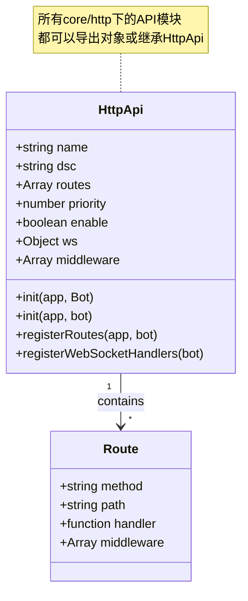
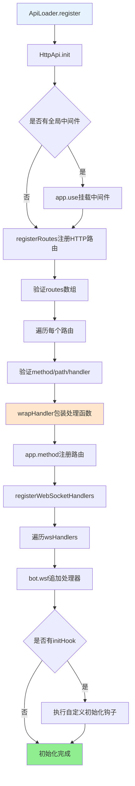
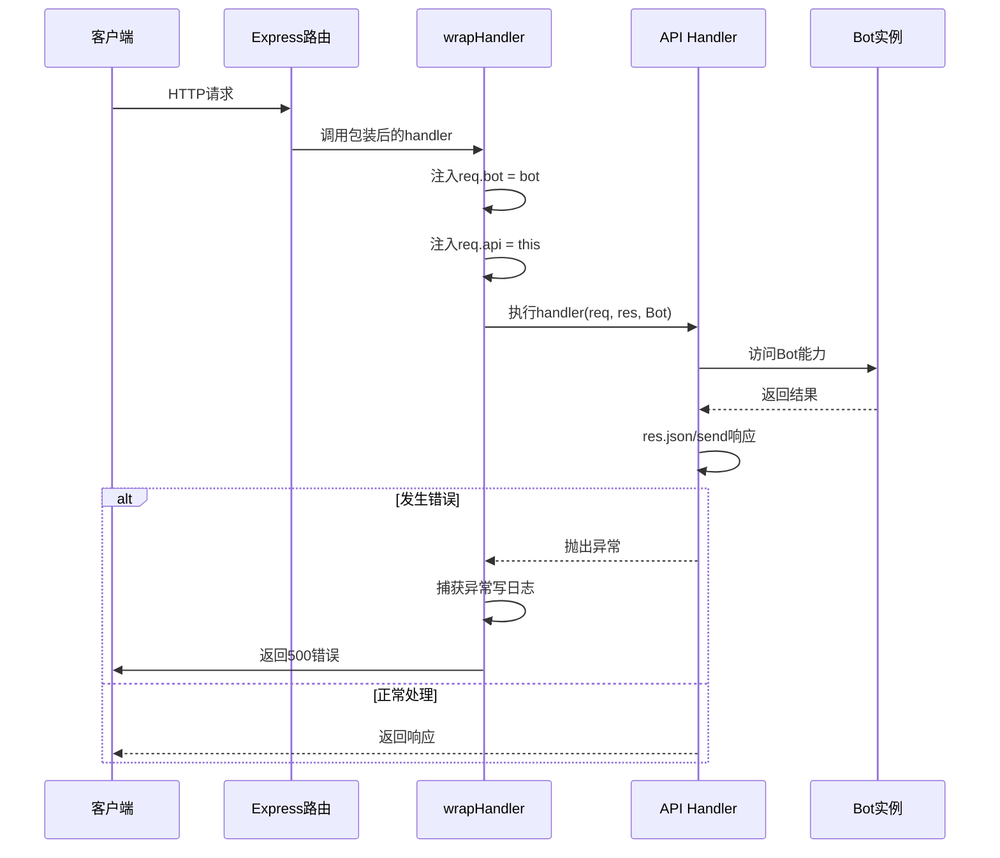

## HttpApi 文档（src/infrastructure/http/http.js）

> **可扩展性**：HttpApi是HTTP/API系统的核心扩展点。通过继承HttpApi或导出对象，开发者可以快速创建自定义API，无需修改底层代码。详见 **[框架可扩展性指南](框架可扩展性指南.md)** ⭐

`HttpApi` 是 XRK-AGT 中的 **HTTP API 基类**，用于统一定义：

- REST 路由（GET/POST/PUT/DELETE 等）。
- WebSocket 处理器。
- API 启用/停用与重载逻辑。

所有位于 `core/http` 下的 API 模块都可以：

- 直接导出对象（推荐），由 `ApiLoader` 自动包装为 `HttpApi` 实例。
- 或继承 `HttpApi` 类，手动控制初始化逻辑。

### 扩展特性

- ✅ **零配置扩展**：放置到 `core/http/` 目录即可自动加载
- ✅ **标准化接口**：统一的基类和接口规范
- ✅ **灵活路由**：支持REST API和WebSocket
- ✅ **中间件支持**：支持全局和路由级中间件
- ✅ **热重载支持**：修改代码后自动重载

---

## 构造参数与属性

**HttpApi结构图**:



**构造参数**：

- `name` - API名称（必填）
- `dsc` - 描述
- `routes` - 路由数组（method/path/handler/middleware）
- `priority` - 优先级（默认100）
- `enable` - 是否启用（默认true）
- `init(app, Bot)` - 自定义初始化钩子
- `ws` - WebSocket处理器映射
- `middleware` - 全局中间件数组

**内部属性**：

- `this.loader` - 指向ApiLoader单例
- `this.wsHandlers` - WebSocket处理器集合
- `this.middleware` - API级中间件
- `this.createTime` - 创建时间戳

---

## 初始化流程：`init(app, bot)`

**API初始化完整流程**:



**步骤说明**：

1. **挂载全局中间件** - 若 `this.middleware` 非空，依次 `app.use(mw)`
2. **注册HTTP路由** - `registerRoutes` 验证并注册所有路由
3. **注册WebSocket处理器** - `registerWebSocketHandlers` 注册WS处理函数
4. **执行自定义初始化钩子** - 若存在 `initHook`，执行自定义初始化

---

## 路由处理包装：`wrapHandler(handler, bot)`

**请求处理流程**:



**包装逻辑**：

- 执行前注入：
  - `req.bot = bot` - 便于访问Bot实例
  - `req.api = this` - 便于访问当前API实例
- 错误处理：
  - 捕获handler内部错误并写日志
  - 若响应未发送，返回500 JSON错误
  - 若响应已发送，只记录警告日志

> **最佳实践**：handler内推荐直接使用 `res.json/res.send` 返回结果，不依赖返回值自动发送响应

---

## WebSocket 集成：`registerWebSocketHandlers(bot)`

- `this.wsHandlers` 结构示例：
  - `{ '/ws/chat': handler }` 或 `{ '/ws/chat': [handler1, handler2] }`。
- 注册流程：
  - 确保 `bot.wsf` 存在（即 `Bot.wsf` 用于保存路径到处理函数列表的映射）。
  - 对每个路径 `path`：
    - 确保 `bot.wsf[path]` 为数组。
    - 将包装后的处理函数加入数组：
      - 处理函数签名：`(conn, req, bot, socket, head)`。
      - 内部捕获异常并写日志。
- 最终由 `Bot.wsConnect` 根据路径将 WebSocket 连接挂到对应处理器上。

---

## 启停与重载

- `start()`：启用 API
  - 将 `this.enable` 标记为 `true`。
  - 输出日志 `[HttpApi] name 已启用`。

- `stop()`：停用 API
  - 将 `this.enable` 标记为 `false`。
  - 输出日志 `[HttpApi] name 已停用`。

- `reload(app, bot)`：重载 API
  - 典型流程：
    1. 记录日志 `[HttpApi] name 开始重载`。
    2. `this.stop()`。
    3. 重新调用 `init(app, bot)` 完成路由与 WS 注册。
    4. `this.start()`。
    5. 记录重载完成日志。

> 实际文件级别的重载由 `ApiLoader.changeApi` 负责，`HttpApi.reload` 更适用于逻辑级微调。

---

## 信息获取：`getInfo()`

返回结构化信息：

- `name/dsc/priority/routes/enable/createTime`。

`ApiLoader.getApiList()` 会调用该方法，生成对外 API 列表与文档展示数据。

---

## 使用示例（推荐写法）

在 `core/http` 下新建 `example.js`：

```js
// core/http/example.js
export default {
  name: 'example-api',
  dsc: '示例 API',
  priority: 100,
  routes: [
    {
      method: 'GET',
      path: '/api/example/ping',
      handler: async (req, res, Bot) => {
        res.json({
          success: true,
          message: 'pong',
          botOnline: Bot.uin?.length > 0,
        });
      }
    }
  ],
  ws: {
    '/ws/example': async (conn, req, Bot) => {
      conn.on('message', msg => {
        conn.sendMsg(`echo: ${msg}`);
      });
    }
  }
};
```

放入 `core/http` 后，`ApiLoader` 会在启动时自动加载并注册上述路由与 WebSocket。

---

## 与事件系统 / 插件系统的关系

- 所有 `HttpApi` 路由都运行在 **Bot 的中间件栈之后**：
  - 先经过 CORS、安全头、日志、认证（`_authMiddleware` 等），再进入具体 API。
  - 因此 API 不需要自己重复做这些全局安全校验，只需关注业务参数与返回值。
- 常见交互模式：
  - **调用子 Bot 能力**：例如在设备 API 中使用 `Bot[deviceId].sendCommand(...)` 下发控制命令。
  - **桥接到插件体系**：
    - 通过 `Bot.em('stdin.message', e)` 构造一个 stdin 事件，让 HTTP 请求走与命令行同一套插件逻辑。
    - 通过 `Bot.em('device.message', e)` 触发设备消息事件，复用既有设备插件。
  - **配置 & 管理接口**：配合 `ConfigBase` 子类暴露 `/api/config/*`，统一管理 `server/device/other` 等配置，并通过前端页面操作。

> 建议：业务尽量沉淀在插件与工作流中，HTTP 层负责提供「入口与管理界面」，保持清晰分层，避免出现「HTTP 里写一套逻辑、事件里又写一套」的重复实现。
