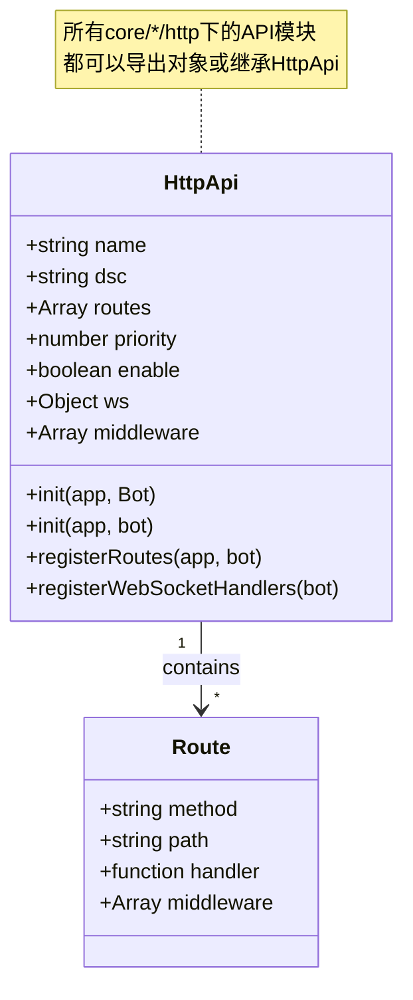
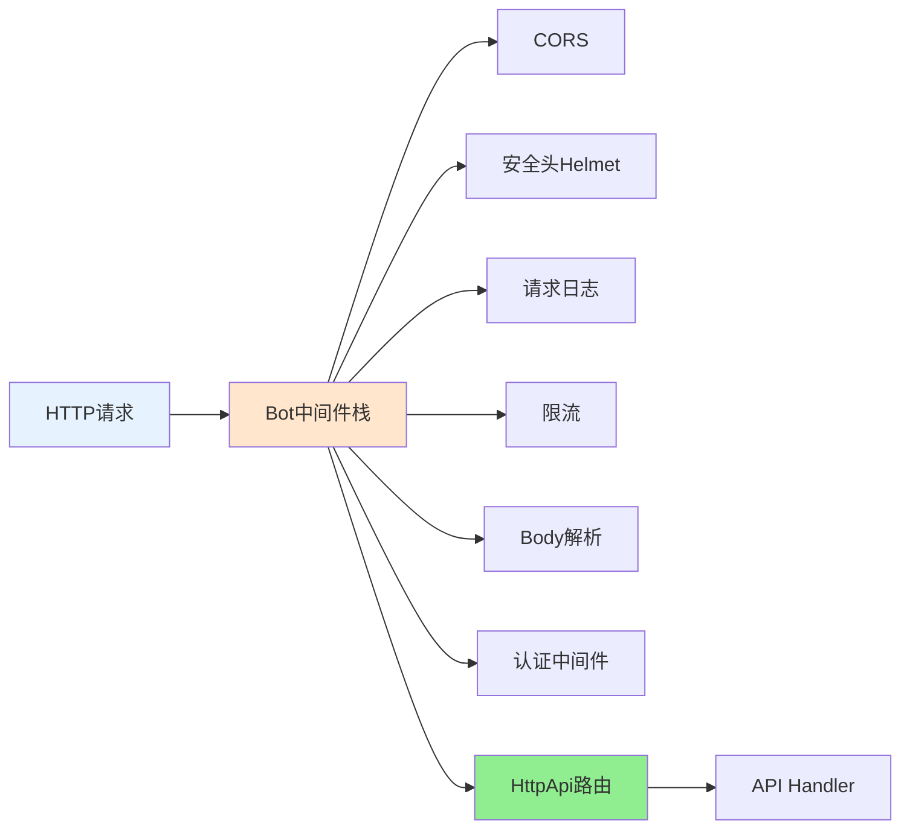

## HttpApi 文档（src/infrastructure/http/http.js）

> **可扩展性**：HttpApi是HTTP/API系统的核心扩展点。通过继承HttpApi或导出对象，开发者可以快速创建自定义API，无需修改底层代码。详见 **[框架可扩展性指南](框架可扩展性指南.md)** ⭐

`HttpApi` 是 XRK-AGT 中的 **HTTP API 基类**，用于统一定义：

- REST 路由（GET/POST/PUT/DELETE 等）
- WebSocket 处理器
- API 启用/停用与重载逻辑
- 全局中间件支持

所有位于 `core/*/http` 目录下的 API 模块都可以：

- **直接导出对象（推荐）**：由 `ApiLoader` 自动包装为 `HttpApi` 实例
- **继承 HttpApi 类**：手动控制初始化逻辑，适合复杂场景

### 扩展特性

- ✅ **零配置扩展**：放置到任意 `core/*/http/` 目录即可自动加载
- ✅ **标准化接口**：统一的基类和接口规范
- ✅ **灵活路由**：支持REST API和WebSocket
- ✅ **中间件支持**：支持全局和路由级中间件
- ✅ **热重载支持**：修改代码后自动重载

---

## 构造参数与属性

**HttpApi结构图**:



**构造参数**：

- `name` - API名称（必填，用于标识和日志）
- `dsc` - API描述（用于文档和日志，默认"暂无描述"）
- `routes` - 路由配置数组
  - `method`: HTTP方法（GET/POST/PUT/DELETE等，不区分大小写）
  - `path`: 路由路径（如 `/api/example/ping`）
  - `handler`: 处理函数 `(req, res, bot, next) => {}`
  - `middleware`: 可选的路由级中间件数组
- `priority` - 优先级（数字越大优先级越高，默认100）
- `enable` - 是否启用（默认true）
- `init` - 自定义初始化钩子函数 `(app, bot) => {}`
- `ws` - WebSocket处理器对象 `{ '/path': handler | [handler1, handler2] }`
- `middleware` - 全局中间件数组（在路由注册前执行）

**内部属性**：

- `this.loader` - 指向ApiLoader单例
- `this.wsHandlers` - WebSocket处理器集合（从 `ws` 参数初始化）
- `this.middleware` - API级全局中间件（从 `middleware` 参数初始化）
- `this.initHook` - 初始化钩子函数（从 `init` 参数初始化）
- `this.createTime` - 创建时间戳
- `this.key` - API键名（由ApiLoader设置，相对路径）
- `this.filePath` - API文件路径（由ApiLoader设置）

---

## 初始化流程：`init(app, bot)`

**API初始化完整流程**:


**步骤说明**：

1. **挂载全局中间件** - 若 `this.middleware` 非空，依次 `app.use(mw)`（在路由注册前执行）
2. **注册HTTP路由** - `registerRoutes(app, bot)` 验证并注册所有路由
   - 验证路由配置完整性（method、path、handler）
   - 使用 `wrapHandler` 包装处理函数（注入 `req.bot` 和 `req.api`）
   - 支持路由级中间件
3. **注册WebSocket处理器** - `registerWebSocketHandlers(bot)` 注册WS处理函数
   - 支持单个处理器或处理器数组
   - 自动处理错误捕获
4. **执行自定义初始化钩子** - 若存在 `initHook`，执行自定义初始化（异步）

**返回值**：`Promise<boolean>` - 始终返回 `true`（表示初始化成功）

---

## 路由处理包装：`wrapHandler(handler, bot)`

**请求处理流程**:


**包装逻辑**：

- **执行前检查**：
  - 如果响应已发送（`res.headersSent`），直接返回，避免重复处理
- **注入上下文**：
  - `req.bot = bot` - 便于访问Bot实例
  - `req.api = this` - 便于访问当前API实例
- **错误处理**：
  - 捕获handler内部错误并写日志
  - 若响应未发送，返回500 JSON错误（开发环境包含错误详情）
  - 若响应已发送，只记录警告日志，不尝试发送错误响应
- **返回值处理**：
  - handler可以返回数据，但不会自动发送响应
  - 推荐在handler内直接使用 `res.json()` 或 `res.send()` 发送响应

**处理函数签名**：
```javascript
async (req, res, bot, next) => {
  // req.bot - Bot实例（已注入）
  // req.api - 当前API实例（已注入）
  // bot - Bot实例（参数传递）
  // next - Express next函数（可选）
  
  // 推荐方式：直接发送响应
  res.json({ success: true, data: result });
  
  // 或使用next传递到下一个中间件
  // next();
}
```

> **最佳实践**：handler内推荐直接使用 `res.json/res.send` 返回结果，不依赖返回值自动发送响应

> **相关文档**：
> - [HTTP业务层文档](http-business-layer.md) - 重定向、CDN、反向代理增强功能
> - [Server服务器架构文档](server.md) - 完整的服务器架构说明

---

## WebSocket 集成：`registerWebSocketHandlers(bot)`

### WebSocket处理器配置

`this.wsHandlers` 结构示例：
```javascript
ws: {
  '/ws/chat': handler,                    // 单个处理器
  '/ws/notify': [handler1, handler2]      // 多个处理器（数组）
}
```

### 注册流程

1. **检查配置**：验证 `this.wsHandlers` 是否为对象
2. **初始化bot.wsf**：确保 `bot.wsf` 存在（用于保存路径到处理函数列表的映射）
3. **遍历处理器**：对每个路径 `path`：
   - 确保 `bot.wsf[path]` 为数组
   - 将处理器转换为数组（支持单个或数组形式）
   - 包装处理函数（自动捕获异常并写日志）
   - 添加到 `bot.wsf[path]` 数组
4. **连接处理**：最终由 `Bot.wsConnect` 根据路径将 WebSocket 连接挂到对应处理器上

### 处理函数签名

```javascript
(conn, req, bot, socket, head) => {
  // conn - WebSocket连接对象
  // req - HTTP请求对象
  // bot - Bot实例
  // socket - 底层socket对象
  // head - HTTP头信息
  
  conn.on('message', (msg) => {
    // 处理消息
    conn.sendMsg('响应消息');
  });
  
  conn.on('close', () => {
    // 处理关闭
  });
}
```

### 错误处理

- 所有WebSocket处理器都会自动包装错误捕获
- 发生错误时记录日志，不会导致整个连接断开

---

## 启停与重载

- `start()`：启用 API
  - 将 `this.enable` 标记为 `true`。
  - 输出日志 `[HttpApi] name 已启用`。

- `stop()`：停用 API
  - 将 `this.enable` 标记为 `false`。
  - 输出日志 `[HttpApi] name 已停用`。

- `reload(app, bot)`：重载 API
  - 典型流程：
    1. 记录日志 `[HttpApi] name 开始重载`。
    2. `this.stop()`。
    3. 重新调用 `init(app, bot)` 完成路由与 WS 注册。
    4. `this.start()`。
    5. 记录重载完成日志。

> 实际文件级别的重载由 `ApiLoader.changeApi` 负责，`HttpApi.reload` 更适用于逻辑级微调。

---

## 信息获取：`getInfo()`

返回结构化信息：

- `name/dsc/priority/routes/enable/createTime`。

`ApiLoader.getApiList()` 会调用该方法，生成对外 API 列表与文档展示数据。

---

## 使用示例

### 方式1：对象导出（推荐）

在任意 `core/*/http` 目录下新建 `example.js`（如 `core/my-core/http/example.js`）：

```javascript
// core/my-core/http/example.js
export default {
  name: 'example-api',
  dsc: '示例 API',
  priority: 100,
  
  // 全局中间件（可选）
  middleware: [
    (req, res, next) => {
      // 全局中间件逻辑
      next();
    }
  ],
  
  // HTTP路由
  routes: [
    {
      method: 'GET',
      path: '/api/example/ping',
      handler: async (req, res, bot) => {
        // req.bot 和 req.api 已自动注入
        res.json({
          success: true,
          message: 'pong',
          botOnline: bot.uin?.length > 0,
          apiName: req.api.name
        });
      }
    },
    {
      method: 'POST',
      path: '/api/example/echo',
      // 路由级中间件（可选）
      middleware: [
        (req, res, next) => {
          // 路由级中间件逻辑
          next();
        }
      ],
      handler: async (req, res, bot) => {
        const { message } = req.body;
        res.json({
          success: true,
          echo: message
        });
      }
    }
  ],
  
  // WebSocket处理器（可选）
  ws: {
    '/ws/example': async (conn, req, bot) => {
      conn.on('message', (msg) => {
        conn.sendMsg(`echo: ${msg}`);
      });
      
      conn.on('close', () => {
        console.log('WebSocket连接已关闭');
      });
    }
  },
  
  // 自定义初始化钩子（可选）
  init: async (app, bot) => {
    // 初始化逻辑，如数据库连接、缓存预热等
    console.log('Example API 初始化完成');
  }
};
```

### 方式2：继承HttpApi类

```javascript
// core/my-core/http/advanced-api.js
import HttpApi from '#infrastructure/http/http.js';

export default class AdvancedAPI extends HttpApi {
  constructor() {
    super({
      name: 'advanced-api',
      dsc: '高级API示例',
      priority: 200,
      routes: [
        {
          method: 'GET',
          path: '/api/advanced/status',
          handler: this.handleStatus.bind(this)
        }
      ]
    });
  }
  
  async handleStatus(req, res, bot) {
    // 可以访问 this 实例属性
    const info = this.getInfo();
    res.json({
      success: true,
      api: info,
      bot: {
        online: bot.uin?.length > 0
      }
    });
  }
}
```

### 方式3：调用工作流系统

```javascript
// core/my-core/http/ai-chat-api.js
import StreamLoader from '#infrastructure/aistream/loader.js';

export default {
  name: 'ai-chat-api',
  dsc: 'AI聊天API',
  routes: [
    {
      method: 'POST',
      path: '/api/ai/chat',
      handler: async (req, res, bot) => {
        const { message, streamName = 'chat' } = req.body;
        
        // 获取工作流
        const stream = StreamLoader.getStream(streamName);
        if (!stream) {
          return res.status(404).json({
            success: false,
            message: '工作流未找到'
          });
        }
        
        // 构造事件对象
        const e = {
          user_id: req.user?.id || 'web_user',
          group_id: `web_${req.user?.id}`,
          msg: message,
          reply: async (msg) => {
            res.json({ success: true, response: msg });
          }
        };
        
        try {
          // 调用工作流
          await stream.process(e, message, {
            enableMemory: true,
            enableDatabase: true
          });
        } catch (error) {
          res.status(500).json({
            success: false,
            message: error.message
          });
        }
      }
    }
  ]
};
```

放入任意 `core/*/http` 目录后，`ApiLoader` 会在启动时自动加载并注册上述路由与 WebSocket。

---

## 与事件系统 / 插件系统 / 工作流系统的关系

### 中间件执行顺序

所有 `HttpApi` 路由都运行在 **Bot 的中间件栈之后**：



**说明**：
- API 不需要自己重复做全局安全校验（CORS、认证等）
- API 只需关注业务参数与返回值
- 可以通过 `req.bot` 访问Bot实例

### 常见交互模式

#### 1. 调用子 Bot 能力

```javascript
handler: async (req, res, bot) => {
  const { deviceId, command } = req.body;
  
  // 调用设备Bot发送命令
  if (bot[deviceId]?.sendCommand) {
    const result = await bot[deviceId].sendCommand(command);
    res.json({ success: true, result });
  } else {
    res.status(404).json({ success: false, message: '设备未找到' });
  }
}
```

#### 2. 桥接到插件体系

```javascript
handler: async (req, res, bot) => {
  const { message } = req.body;
  
  // 构造stdin事件，走插件逻辑
  const e = {
    event_id: `api_${Date.now()}`,
    tasker: 'stdin',
    user_id: req.user?.id || 'api_user',
    msg: message,
    reply: async (msg) => {
      res.json({ success: true, response: msg });
    }
  };
  
  // 触发事件，由插件系统处理
  bot.em('stdin.message', e);
}
```

#### 3. 调用工作流系统

```javascript
handler: async (req, res, bot) => {
  const { message, streamName = 'chat' } = req.body;
  const stream = StreamLoader.getStream(streamName);
  
  if (!stream) {
    return res.status(404).json({ success: false, message: '工作流未找到' });
  }
  
  const e = {
    user_id: req.user?.id || 'web_user',
    msg: message,
    reply: async (msg) => {
      res.json({ success: true, response: msg });
    }
  };
  
  await stream.process(e, message, {
    enableMemory: true,
    enableDatabase: true
  });
}
```

#### 4. 配置管理接口

```javascript
import MyConfig from '#infrastructure/commonconfig/myconfig.js';

handler: async (req, res, bot) => {
  const config = new MyConfig();
  
  if (req.method === 'GET') {
    // 获取配置
    const data = await config.read();
    const structure = config.getStructure();
    res.json({ success: true, data, structure });
  } else if (req.method === 'POST') {
    // 更新配置
    const { key, value } = req.body;
    await config.set(key, value);
    await config.write();
    res.json({ success: true });
  }
}
```

### 最佳实践

1. **业务逻辑分层**：
   - 业务逻辑尽量沉淀在插件与工作流中
   - HTTP 层负责提供「入口与管理界面」
   - 避免在HTTP中重复实现业务逻辑

2. **统一错误处理**：
   - 使用统一的错误响应格式：`{ success: false, message: string }`
   - 利用 `wrapHandler` 的自动错误捕获
   - 开发环境返回详细错误信息

3. **与前端协作**：
   - 提供清晰的API文档（通过 `getInfo()` 生成）
   - 统一使用JSON格式
   - 支持跨域配置（由Bot中间件处理）

4. **性能优化**：
   - 合理使用中间件（避免不必要的处理）
   - 异步操作使用 `async/await`
   - 长时间操作考虑使用WebSocket或SSE
