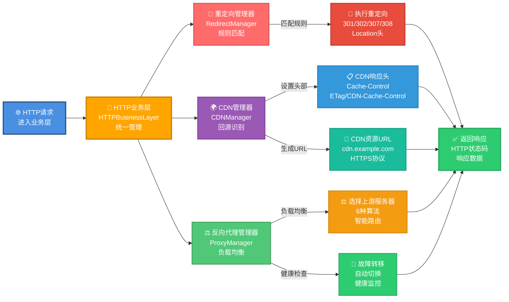
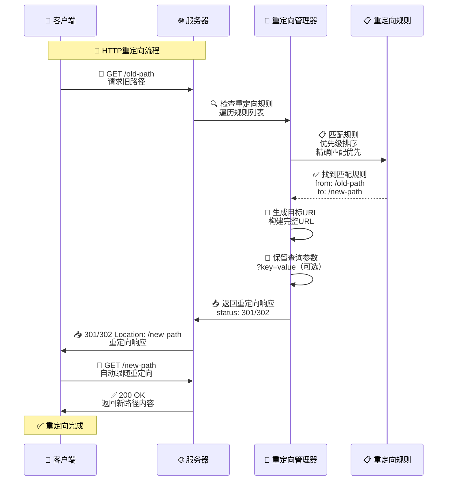
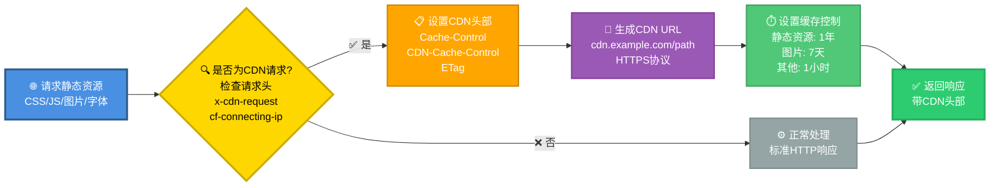
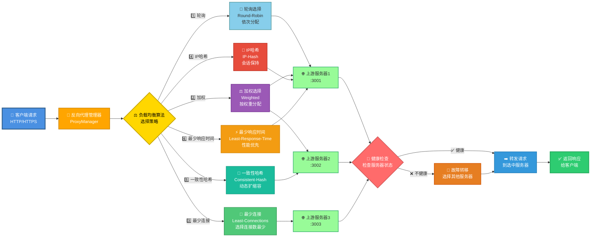
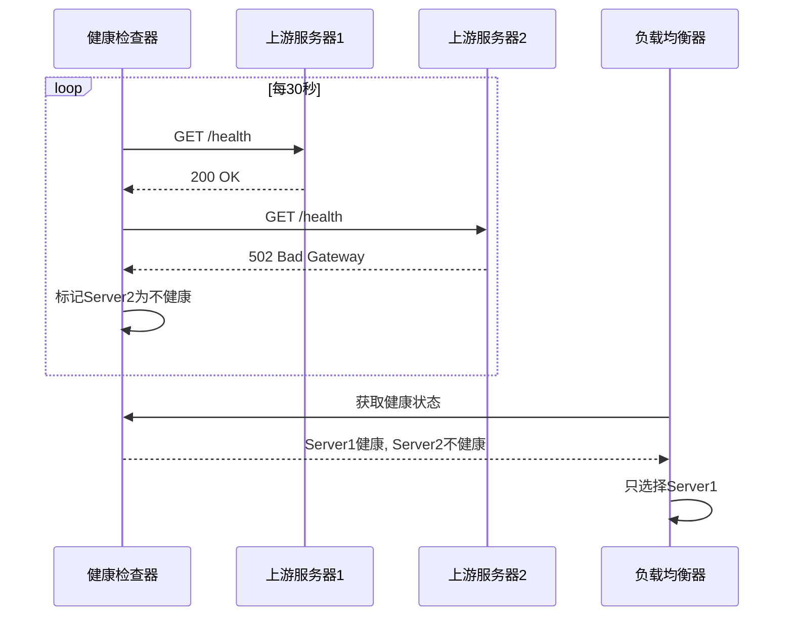

# HTTP 业务层

> **文件位置**：`src/utils/http-business.js`  
> **说明**：本文档详细介绍了XRK-AGT框架的HTTP业务层功能，包括重定向、CDN支持、反向代理增强等

HTTP业务层（`HTTPBusinessLayer`）是XRK-AGT框架的核心HTTP功能模块，统一管理重定向、CDN支持和反向代理增强功能。

### 核心特性

- ✅ **重定向管理**：配置化HTTP重定向规则（301/302/307/308）
- ✅ **CDN支持**：静态资源CDN回源、缓存控制、CDN头部处理
- ✅ **反向代理增强**：负载均衡、健康检查、故障转移
- ✅ **配置驱动**：通过YAML配置文件管理所有功能
- ✅ **灵活路由**：支持多种负载均衡算法

---

## 📚 目录

- [概述](#概述)
- [实际应用场景](#实际应用场景)
- [重定向功能](#重定向功能)
- [CDN支持](#cdn支持)
- [反向代理增强](#反向代理增强)
- [配置说明](#配置说明)
- [Node.js 24.13新特性](#nodejs-2413新特性)
- [最佳实践](#最佳实践)

---

## 概述

HTTP业务层（`HTTPBusinessLayer`）是XRK-AGT框架的核心HTTP功能模块，统一管理：

- **重定向管理**：配置化HTTP重定向规则（301/302/307/308）
- **CDN支持**：静态资源CDN回源、缓存控制、CDN头部处理
- **反向代理增强**：负载均衡、健康检查、故障转移

### 架构设计



**流程说明**：请求首先进入HTTP业务层，依次经过重定向检查、CDN处理、反向代理路由，最终返回响应。HTTP业务层在Bot的中间件链中，位于请求体解析之后、路由匹配之前。

### 文件位置

- **核心实现**：`src/utils/http-business.js`
- **集成位置**：`src/bot.js`（Bot类中初始化）
- **配置文件**：`config/default_config/server.yaml`

---

## 实际应用场景

### 场景1：网站迁移（重定向）

**需求**：将旧网站 `/blog/*` 迁移到新路径 `/articles/*`

```yaml
redirects:
  - from: "/blog/*"
    to: "/articles/*"
    status: 301
    preserveQuery: true
```

**效果**：
- 访问 `https://example.com/blog/post1?page=1` 
- 自动重定向到 `https://example.com/articles/post1?page=1`
- 保留查询参数，SEO友好

### 场景2：移动端分离（条件重定向）

**需求**：移动设备访问 `/dashboard` 时重定向到移动版

```yaml
redirects:
  - from: "/dashboard"
    to: "/mobile/dashboard"
    status: 302
    condition: "req.headers['user-agent'].includes('Mobile')"
```

### 场景3：CDN加速静态资源

**需求**：将CSS/JS/图片等静态资源通过CDN加速

```yaml
cdn:
  enabled: true
  domain: "cdn.example.com"
  https: true
  cacheControl:
    static: 31536000  # CSS/JS缓存1年
    images: 604800    # 图片缓存7天
```

**效果**：
- 静态资源自动使用CDN域名
- 浏览器缓存优化，减少服务器负载
- CDN自动回源到服务器

### 场景4：高可用后端服务（负载均衡）

**需求**：后端服务部署了3个实例，需要负载均衡和故障转移

```yaml
proxy:
  enabled: true
  healthCheck:
    enabled: true
    interval: 30000
    maxFailures: 3
  domains:
    - domain: "api.example.com"
      target:
        - url: "http://backend1:3000"
          weight: 3
        - url: "http://backend2:3000"
          weight: 2
        - url: "http://backend3:3000"
          weight: 1
      loadBalance: "weighted"
```

**效果**：
- 请求按权重分发到3个后端服务
- 自动健康检查，故障自动切换
- 确保服务高可用

### 场景5：多服务统一入口

**需求**：一个域名代理多个不同的后端服务

```yaml
proxy:
  enabled: true
  domains:
    - domain: "example.com"
      target: "http://frontend:3000"
      rewritePath:
        from: "/api"
        to: "/"
    - domain: "api.example.com"
      target: "http://backend:3001"
    - domain: "admin.example.com"
      target: "http://admin:3002"
```

---

## 重定向功能

### 功能说明

重定向管理器支持多种HTTP重定向类型，可以配置复杂的重定向规则。

### 支持的重定向类型

| 状态码 | 名称 | 用途 | 是否保持HTTP方法 |
|-------|------|------|----------------|
| 301 | Moved Permanently | 永久重定向 | 否 |
| 302 | Found | 临时重定向 | 否 |
| 307 | Temporary Redirect | 临时重定向 | 是 |
| 308 | Permanent Redirect | 永久重定向 | 是 |

### 重定向处理流程



**说明**：重定向规则按优先级排序，精确匹配优先于通配符匹配。

### 配置示例

```yaml
redirects:
  # 简单路径重定向
  - from: "/old-page"
    to: "/new-page"
    status: 301
  
  # 通配符重定向（支持*）
  - from: "/blog/*"
    to: "/articles/*"
    status: 301
    preserveQuery: true
  
  # 外部重定向
  - from: "/external"
    to: "https://other-site.com"
    status: 302
  
  # 条件重定向（JavaScript表达式）
  - from: "/mobile"
    to: "/mobile-site"
    status: 302
    condition: "req.headers['user-agent'].includes('Mobile')"
```

### 特性

1. **模式匹配**：使用Node.js 24.13全局URLPattern API
2. **优先级排序**：精确匹配优先于通配符匹配
3. **查询参数保留**：可配置是否保留原始查询参数
4. **条件重定向**：支持基于请求头的条件判断

---

## CDN支持

### 功能说明

CDN管理器提供静态资源CDN支持，包括CDN回源识别、缓存控制和CDN URL生成。

### CDN处理流程



**说明**：CDN请求通过请求头识别（如`x-cdn-request`、`cf-connecting-ip`等），自动设置CDN相关响应头。

### 配置示例

```yaml
cdn:
  enabled: true
  domain: "cdn.example.com"
  staticPrefix: "/static"
  https: true
  cacheControl:
    static: 31536000    # CSS/JS/字体：1年
    images: 604800      # 图片：7天
    default: 3600       # 其他：1小时
```

### 功能特性

1. **CDN回源识别**：自动识别来自CDN的请求
2. **缓存控制**：根据文件类型设置不同缓存时间
3. **CDN头部设置**：自动设置CDN相关HTTP响应头
4. **静态资源识别**：自动识别CSS、JS、图片、字体等

### 支持的CDN头部

- `x-cdn-request`：CDN请求标识
- `x-forwarded-for`：代理IP（可能来自CDN）
- `cf-connecting-ip`：Cloudflare CDN
- `x-real-ip`：Nginx代理

### 缓存策略

| 文件类型 | 默认缓存时间 | 说明 |
|---------|------------|------|
| CSS/JS/字体 | 1年（31536000秒） | 使用版本号或哈希控制更新 |
| 图片 | 7天（604800秒） | 平衡性能和更新需求 |
| 其他 | 1小时（3600秒） | 保守策略 |

---

## 反向代理增强

### 功能说明

反向代理管理器在原有反向代理基础上，提供了负载均衡、健康检查和故障转移等高级功能。

### 负载均衡架构



**说明**：负载均衡支持三种算法，自动健康检查确保请求分发到健康的服务器。

### 负载均衡算法

#### 1. 轮询（Round-Robin）

按顺序依次分发请求到各个上游服务器。

```yaml
target:
  - "http://localhost:3001"
  - "http://localhost:3002"
  - "http://localhost:3003"
loadBalance: "round-robin"
```

#### 2. 加权轮询（Weighted）

根据服务器权重分配请求，权重越高接收的请求越多。

```yaml
target:
  - url: "http://localhost:3001"
    weight: 3  # 处理60%的请求
  - url: "http://localhost:3002"
    weight: 2  # 处理40%的请求
loadBalance: "weighted"
```

#### 3. 最少连接（Least-Connections）

将请求分发到当前连接数最少的服务器。

```yaml
target:
  - "http://localhost:3001"
  - "http://localhost:3002"
loadBalance: "least-connections"
```

#### 4. IP Hash（IP哈希）

基于客户端IP的哈希值分配请求，相同IP总是路由到同一服务器，适合会话保持。

```yaml
target:
  - "http://localhost:3001"
  - "http://localhost:3002"
loadBalance: "ip-hash"
```

#### 5. 一致性哈希（Consistent Hash）

当服务器列表变化时，最小化重新路由，适合动态扩缩容场景。

```yaml
target:
  - "http://localhost:3001"
  - "http://localhost:3002"
loadBalance: "consistent-hash"
```

#### 6. 最少响应时间（Least Response Time）

选择响应时间最短的服务器，适合性能敏感场景。

```yaml
target:
  - "http://localhost:3001"
  - "http://localhost:3002"
loadBalance: "least-response-time"
```

### 健康检查流程



**说明**：健康检查定期向每个上游服务器发送请求，连续失败超过阈值后标记为不健康。

### 健康检查配置

```yaml
proxy:
  healthCheck:
    enabled: true
    interval: 30000      # 检查间隔：30秒
    maxFailures: 3       # 最大失败次数：3次
    timeout: 5000       # 健康检查超时：5秒
    cacheTime: 5000      # 结果缓存时间：5秒（减少频繁检查）
    path: "/health"     # 自定义健康检查路径（可选）
```

**特性**：
- **并行检查**：所有上游服务器并行检查，提升效率
- **结果缓存**：健康检查结果缓存，避免频繁请求
- **自定义路径**：支持为每个上游服务器配置自定义健康检查URL
- **详细指标**：记录响应时间、失败次数等指标

### 故障转移

当上游服务器出现故障时：

1. 自动标记为不健康
2. 负载均衡自动跳过不健康的服务器
3. 如果所有服务器都不健康，仍会尝试请求（确保服务可用）
4. 健康检查恢复后，自动重新加入负载均衡

---

## 配置说明

### 完整配置示例

```yaml
server:
  host: "0.0.0.0"
  url: "https://example.com"

# 重定向配置
redirects:
  - from: "/old"
    to: "/new"
    status: 301

# CDN配置
cdn:
  enabled: true
  domain: "cdn.example.com"
  https: true
  cacheControl:
    static: 31536000
    images: 604800
    default: 3600

# 反向代理配置
proxy:
  enabled: true
  httpPort: 80
  httpsPort: 443
  healthCheck:
    enabled: true
    interval: 30000
    maxFailures: 3
  domains:
    - domain: "example.com"
      target:
        - url: "http://localhost:3001"
          weight: 3
        - url: "http://localhost:3002"
          weight: 1
      loadBalance: "weighted"
```

### 配置项说明

#### 重定向配置（redirects）

| 配置项 | 类型 | 必填 | 说明 |
|-------|------|------|------|
| from | string | 是 | 源路径（支持通配符*） |
| to | string | 是 | 目标路径或URL |
| status | number | 否 | HTTP状态码（默认301） |
| preserveQuery | boolean | 否 | 是否保留查询参数（默认true） |
| condition | string | 否 | JavaScript条件表达式 |

#### CDN配置（cdn）

| 配置项 | 类型 | 必填 | 说明 |
|-------|------|------|------|
| enabled | boolean | 否 | 是否启用CDN（默认false） |
| domain | string | 否 | CDN域名 |
| type | string | 否 | CDN类型：general, cloudflare, aliyun, tencent, aws, baidu, qiniu, ucloud（默认general） |
| staticPrefix | string | 否 | 静态资源前缀（默认"/static"） |
| https | boolean | 否 | 是否使用HTTPS（默认true） |
| cacheControl | object | 否 | 缓存控制配置 |

**CDN类型说明**：
- `general`：通用CDN（默认）
- `cloudflare`：Cloudflare CDN（自动识别cf-*头部）
- `aliyun`：阿里云CDN（自动识别ali-*头部）
- `tencent`：腾讯云CDN（自动识别x-qcloud-*头部）
- `aws`：AWS CloudFront（自动识别x-amz-*头部）
- `baidu`：百度云CDN
- `qiniu`：七牛云CDN
- `ucloud`：UCloud CDN

#### 反向代理配置（proxy）

| 配置项 | 类型 | 必填 | 说明 |
|-------|------|------|------|
| enabled | boolean | 否 | 是否启用反向代理（默认false） |
| httpPort | number | 否 | HTTP端口（默认80） |
| httpsPort | number | 否 | HTTPS端口（默认443） |
| healthCheck | object | 否 | 健康检查配置 |
| domains | array | 否 | 域名配置列表 |

**健康检查配置（healthCheck）**：

| 配置项 | 类型 | 必填 | 说明 |
|-------|------|------|------|
| enabled | boolean | 否 | 是否启用健康检查（默认false） |
| interval | number | 否 | 检查间隔（毫秒，默认30000） |
| maxFailures | number | 否 | 最大失败次数（默认3） |
| timeout | number | 否 | 健康检查超时（毫秒，默认5000） |
| cacheTime | number | 否 | 结果缓存时间（毫秒，默认5000） |
| path | string | 否 | 自定义健康检查路径（默认/health） |

**域名配置（domains）**：

| 配置项 | 类型 | 必填 | 说明 |
|-------|------|------|------|
| domain | string | 是 | 域名 |
| target | string/array | 否 | 目标服务器（字符串或数组） |
| loadBalance | string | 否 | 负载均衡算法：round-robin, weighted, least-connections, ip-hash, consistent-hash, least-response-time |
| healthUrl | string | 否 | 自定义健康检查URL（覆盖全局配置） |
| ssl | object | 否 | SSL证书配置 |
| rewritePath | object | 否 | 路径重写规则 |

#### 性能优化配置（performance）

| 配置项 | 类型 | 必填 | 说明 |
|-------|------|------|------|
| keepAlive | object | 否 | Keep-Alive配置 |
| http2Push | object | 否 | HTTP/2 Server Push配置 |
| connectionPool | object | 否 | 连接池配置 |

**Keep-Alive配置**：

| 配置项 | 类型 | 必填 | 说明 |
|-------|------|------|------|
| enabled | boolean | 否 | 是否启用Keep-Alive（默认true） |
| initialDelay | number | 否 | 初始延迟（毫秒，默认1000） |
| timeout | number | 否 | 超时时间（毫秒，默认120000） |

**HTTP/2 Push配置**：

| 配置项 | 类型 | 必填 | 说明 |
|-------|------|------|------|
| enabled | boolean | 否 | 是否启用HTTP/2 Push（默认false） |
| criticalAssets | array | 否 | 关键资源列表（自动推送） |

**连接池配置**：

| 配置项 | 类型 | 必填 | 说明 |
|-------|------|------|------|
| maxSockets | number | 否 | 每个主机的最大socket数（默认50） |
| maxFreeSockets | number | 否 | 空闲socket的最大数量（默认10） |
| timeout | number | 否 | socket超时时间（毫秒，默认30000） |

---

## 企业级特性

### 1. 智能负载均衡

支持6种负载均衡算法，根据场景自动选择最优策略：

- **轮询（Round-Robin）**：简单均匀分配
- **加权轮询（Weighted）**：根据服务器权重分配
- **最少连接（Least-Connections）**：优先选择连接数最少的服务器
- **IP哈希（IP-Hash）**：基于客户端IP分配，适合会话保持
- **一致性哈希（Consistent-Hash）**：服务器变化时最小化重新路由
- **最少响应时间（Least-Response-Time）**：选择响应最快的服务器

### 2. 健康检查与故障转移

- **并行健康检查**：所有上游服务器并行检查，提升效率
- **结果缓存**：健康检查结果缓存，减少频繁请求
- **自动故障转移**：服务器故障时自动切换，确保服务可用
- **详细指标**：记录响应时间、失败次数等指标

### 3. CDN智能识别

自动识别主流CDN类型，优化缓存策略和头部设置：

- Cloudflare、阿里云、腾讯云、AWS CloudFront等
- 智能提取真实客户端IP
- 优化CDN特定响应头

### 4. 性能优化

- **Keep-Alive**：减少连接开销
- **HTTP/2支持**：提升HTTPS性能
- **连接池管理**：优化socket复用
- **响应压缩**：支持brotli压缩（Node.js 24+）

---

## Node.js 24.13新特性

HTTP业务层充分利用了Node.js 24.13的新特性：

### 1. 全局URLPattern API

```javascript
// Node.js 24.13+ 全局可用，无需导入
const pattern = new URLPattern({ pathname: '/api/*' });
const match = pattern.test({ pathname: '/api/users' });
```

**使用位置**：`RedirectManager._compileRules()`

### 2. Error.isError()

```javascript
// 可靠的错误类型判断
if (Error.isError(err)) {
  console.error(err.message);
}
```

**使用位置**：`bot.js`中多处错误处理

### 3. 原生fetch API

```javascript
// 使用AbortController控制超时
const controller = new AbortController();
const timeout = setTimeout(() => controller.abort(), 5000);
const response = await fetch(url, { signal: controller.signal });
clearTimeout(timeout);
```

**使用位置**：`ProxyManager._performHealthChecks()`

---

## 最佳实践

### 1. 重定向配置

- **使用301进行永久重定向**，有助于SEO
- **保留查询参数**，避免丢失重要信息
- **使用条件重定向**处理移动端和桌面端分离

### 2. CDN配置

- **只对静态资源启用CDN**，动态内容不要使用CDN
- **设置合理的缓存时间**，平衡性能和更新需求
- **使用版本号或哈希控制静态资源更新**

### 3. 反向代理配置

- **启用健康检查**，提高服务可用性
- **使用加权负载均衡**，根据服务器性能分配权重
- **配置多个上游服务器**，实现高可用

### 4. 性能优化

- **重定向规则按优先级排序**，精确匹配优先
- **CDN缓存时间设置合理**，避免缓存过大
- **健康检查间隔不要过短**，避免增加服务器负担

### 5. 安全建议

- **HTTPS重定向使用301或308**
- **CDN配置使用HTTPS**
- **反向代理启用SSL/TLS**

---

## API参考

### HTTPBusinessLayer

```javascript
class HTTPBusinessLayer {
  constructor(config)
  handleRedirect(req, res): boolean
  handleCDN(req, res, filePath): string
  selectProxyUpstream(domain, algorithm): Object|null
  markProxyFailure(domain, upstreamUrl): void
}
```

### RedirectManager

```javascript
class RedirectManager {
  constructor(config)
  check(req, res): boolean
}
```

### CDNManager

```javascript
class CDNManager {
  constructor(config)
  isCDNRequest(req): boolean
  setCDNHeaders(res, filePath): void
  getCDNUrl(filePath): string
}
```

### ProxyManager

```javascript
class ProxyManager {
  constructor(config)
  selectUpstream(domain, algorithm): Object|null
  markUpstreamFailure(domain, upstreamUrl): void
}
```

---

## 相关文档

- **[Bot 主类文档](bot.md)** - HTTP/HTTPS/WebSocket 服务详细说明
- **[Server 服务器架构](server.md)** - 完整的服务器架构说明
- **[system-Core 特性](system-core.md)** - system-Core 内置模块完整说明 ⭐

---

*最后更新：2026-02-12*
