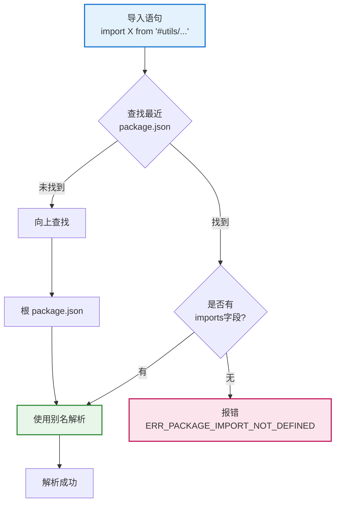

# 导入路径迁移指南

> **文件位置**：本文档说明 XRK-AGT 框架中导入路径的使用规则和迁移指南  
> **适用场景**：开发 Core 模块、插件、API 等业务代码时的导入路径选择

XRK-AGT 框架使用 Node.js 的 `imports` 字段定义路径别名，支持在项目根目录使用 `#` 别名简化导入。但对于独立 Core 包，需要使用相对路径进行跨包引用。

### 扩展特性

- ✅ **路径别名**：项目根目录支持 `#` 别名，代码更简洁
- ✅ **自动解析**：Node.js 自动解析 `imports` 字段定义的别名
- ✅ **跨包支持**：独立 Core 包使用相对路径，确保正确引用
- ✅ **类型安全**：TypeScript 支持路径别名映射

---

## 📚 目录

- [概述](#概述)
- [导入路径规则](#导入路径规则)
- [迁移检查清单](#迁移检查清单)
- [常见问题](#常见问题)
- [最佳实践](#最佳实践)
- [相关文档](#相关文档)

---

## 概述

### 当前状态

- `core/*` 下模块（如 `system-Core`）均**无独立 `package.json`**，统一使用根包 `#` 别名
- 若将来新增带 `package.json` 的独立 Core 包，则需按「独立 Core 包」一节使用相对路径

### 路径解析机制



**关键规则**：
- Node.js 按「最近 `package.json`」解析 `imports` 字段
- 如果当前目录有 `package.json`，优先使用该包的 `imports`
- 如果当前目录没有 `package.json`，向上查找直到根目录

---

## 导入路径规则

### 1. 项目根目录（主包）

项目根目录的代码可以使用 `package.json` 中定义的 `imports` 别名：

```javascript
// ✅ 正确：在项目根目录的代码中
import BotUtil from '#utils/botutil.js';
import StreamLoader from '#infrastructure/aistream/loader.js';
import { HttpResponse } from '#utils/http-utils.js';
```

**可用别名**（定义在根 `package.json`）：

| 别名 | 实际路径 | 说明 |
|------|----------|------|
| `#utils/*` | `./src/utils/*` | 工具类 |
| `#infrastructure/*` | `./src/infrastructure/*` | 基础设施层 |
| `#core/*` | `./core/*` | Core 模块 |
| `#config/*` | `./config/*` | 配置文件 |
| `#data/*` | `./data/*` | 数据目录 |
| `#renderers/*` | `./src/renderers/*` | 渲染器 |
| `#modules/*` | `./src/modules/*` | 模块 |
| `#factory/*` | `./src/factory/*` | 工厂类 |

**适用场景**：
- `src/*` 目录下的所有代码
- `core/system-Core/*` 等无独立 `package.json` 的 Core 模块
- 项目根目录的其他代码

### 2. 独立 Core 包（如 `core/my-core` 且自带 `package.json`）

**自带 `package.json` 的 Core 包必须使用相对路径**，不能使用 `#` 别名。

**原因**：Node.js 的 `imports` 作用域限于当前包；跨包引用需用相对路径。

**路径规则**：

| 源文件位置 | 目标位置 | 相对路径 |
|-----------|----------|----------|
| `core/my-core/plugin/*` | `src/utils/*` | `../../../src/utils/*` |
| `core/my-core/http/*` | `src/infrastructure/*` | `../../../src/infrastructure/*` |
| `core/my-core/stream/*` | `src/factory/*` | `../../../src/factory/*` |

**示例**：

```javascript
// ✅ 正确：独立 Core 包中使用相对路径
// 文件：core/my-core/http/my-api.js
import BotUtil from '../../../src/utils/botutil.js';
import StreamLoader from '../../../src/infrastructure/aistream/loader.js';
import { HttpResponse } from '../../../src/utils/http-utils.js';

// ❌ 错误：独立 Core 包中不能使用 # 别名
import BotUtil from '#utils/botutil.js';  // 会报 ERR_PACKAGE_IMPORT_NOT_DEFINED
```

**路径计算示例**：

```javascript
// 源文件：core/my-core/plugin/my-plugin.js
// 目标文件：src/utils/botutil.js

// 步骤1：从 core/my-core/plugin/ 到 core/my-core/
//        ../

// 步骤2：从 core/my-core/ 到 core/
//        ../../

// 步骤3：从 core/ 到项目根目录
//        ../../../

// 步骤4：从项目根目录到 src/utils/
//        ../../../src/utils/

// 最终路径：../../../src/utils/botutil.js
```

### 3. 同一 Core 包内的导入

同一 Core 包内使用相对路径：

```javascript
// ✅ 正确：同一包内使用相对路径
// 文件：core/my-core/plugin/my-plugin.js
import OtherPlugin from './other-plugin.js';
import Util from '../common/util.js';

// ✅ 正确：跨子目录导入
// 文件：core/my-core/http/my-api.js
import MyPlugin from '../plugin/my-plugin.js';
```

---

## 迁移检查清单

### 从 #imports 迁移到相对路径

#### 1. 识别需要迁移的文件

**需要迁移的文件**：
- 仅限 **自带 `package.json`** 的 `core/*/` 目录（如 `core/my-core`）
- 检查是否有 `import ... from '#utils/...'` 或 `import ... from '#infrastructure/...'`

**无需迁移的文件**：
- `core/system-Core` 等无 `package.json` 的模块（使用根包 `#` 别名）
- `src/*` 目录下的所有代码（使用根包 `#` 别名）

#### 2. 计算相对路径

**路径计算规则**：

```
源文件：core/my-core/http/my-api.js
目标文件：src/utils/http-utils.js

相对路径计算：
1. core/my-core/http/ → core/my-core/     (../)
2. core/my-core/ → core/                   (../../)
3. core/ → 项目根目录                      (../../../)
4. 项目根目录 → src/utils/                 (../../../src/utils/)
5. 最终路径：../../../src/utils/http-utils.js
```

**常用路径对照表**：

| 从 | 到 | 相对路径 |
|---|----|---------|
| `core/my-core/plugin/*` | `src/utils/*` | `../../../src/utils/*` |
| `core/my-core/http/*` | `src/infrastructure/*` | `../../../src/infrastructure/*` |
| `core/my-core/stream/*` | `src/factory/*` | `../../../src/factory/*` |
| `core/my-core/plugin/*` | `core/my-core/http/*` | `../http/*` |

#### 3. 更新导入语句

**批量替换示例**：

```javascript
// 之前（错误）
import BotUtil from '#utils/botutil.js';
import StreamLoader from '#infrastructure/aistream/loader.js';
import { HttpResponse } from '#utils/http-utils.js';

// 之后（正确）
import BotUtil from '../../../src/utils/botutil.js';
import StreamLoader from '../../../src/infrastructure/aistream/loader.js';
import { HttpResponse } from '../../../src/utils/http-utils.js';
```

#### 4. 验证

- 运行 `node app` 确保没有模块解析错误
- 检查控制台是否有 `ERR_PACKAGE_IMPORT_NOT_DEFINED` 或 `Cannot find module` 错误
- 使用 IDE 的路径跳转功能验证路径是否正确

---

## 常见问题

### Q: 为什么自带 package.json 的 Core 不能使用 # 别名？

**A**: Node.js 按「最近 `package.json`」解析。`core/my-core/*` 下有 `package.json` 时，会先查该包；若未定义 `#utils/*` 等，会报 `ERR_PACKAGE_IMPORT_NOT_DEFINED`。

**示例**：

```javascript
// 文件：core/my-core/plugin/my-plugin.js
// core/my-core/ 下有 package.json

import BotUtil from '#utils/botutil.js';
// ❌ 错误：Node.js 会在 core/my-core/package.json 中查找 #utils/* 别名
//         如果该文件中没有定义，会报错
```

### Q: system-Core 为什么可以用根包的 # 别名？

**A**: `core/system-Core` **无** `package.json`，Node.js 向上查找，最终使用根 `package.json` 的 `imports`。

**示例**：

```javascript
// 文件：core/system-Core/plugin/my-plugin.js
// core/system-Core/ 下没有 package.json

import BotUtil from '#utils/botutil.js';
// ✅ 正确：Node.js 向上查找，找到根 package.json 中的 #utils/* 别名
```

### Q: 能否在独立 Core 的 package.json 里定义 imports 指向 src？

**A**: 不行。Node.js 的 `imports` **不允许** target 使用 `../../` 等跨包路径，故须用相对路径导入。

**错误示例**：

```json
// core/my-core/package.json
{
  "imports": {
    "#utils/*": "../../src/utils/*"  // ❌ 不允许跨包路径
  }
}
```

### Q: 如何判断一个 Core 包是否需要迁移？

**A**: 
1. 检查 `core/*/` 目录下是否有 `package.json`
2. 如果有 `package.json`，需要迁移（使用相对路径）
3. 如果没有 `package.json`，无需迁移（使用 `#` 别名）

### Q: 迁移后如何验证路径是否正确？

**A**: 
1. 使用 IDE 的路径跳转功能（Ctrl/Cmd + 点击）
2. 运行 `node app` 检查是否有模块解析错误
3. 查看控制台日志，确认没有 `ERR_PACKAGE_IMPORT_NOT_DEFINED` 错误

---

## 最佳实践

### 1. 路径选择原则

- **项目根目录代码**：使用 `#` 别名，代码更简洁
- **独立 Core 包**：使用相对路径，确保跨包引用正确
- **同一包内**：使用相对路径，避免依赖包配置

### 2. 路径计算技巧

- 使用 IDE 的自动补全功能，减少手动计算错误
- 从源文件位置逐级向上，再向下到目标文件
- 使用路径跳转功能验证路径是否正确

### 3. 代码组织建议

- 尽量将相关代码放在同一 Core 包内，减少跨包引用
- 公共工具放在 `src/utils/`，供所有 Core 包使用
- 避免深层嵌套，保持路径简洁

### 4. 迁移策略

- 先识别需要迁移的文件（有 `package.json` 的 Core 包）
- 批量替换导入语句，使用相对路径
- 验证所有路径是否正确
- 更新相关文档和示例代码

### 5. 文档维护

- 确保示例代码使用正确的导入方式
- 在 Core 包开发文档中说明路径使用规则
- 定期检查是否有新的独立 Core 包需要迁移

---

## 相关文档

- **[框架可扩展性指南](框架可扩展性指南.md)** - Core 模块开发完整说明
- **[插件基类文档](plugin-base.md)** - 插件开发中的导入路径使用
- **[HTTP API 文档](http-api.md)** - API 开发中的导入路径使用
- 根 `package.json` - 定义 `#` 别名，供无独立 `package.json` 的 core（如 `system-Core`）使用
- `core/my-core/package.json`（可选）- 独立 Core 包配置；有则须用相对路径导入 `src/*`

---

*最后更新：2026-02-06*
