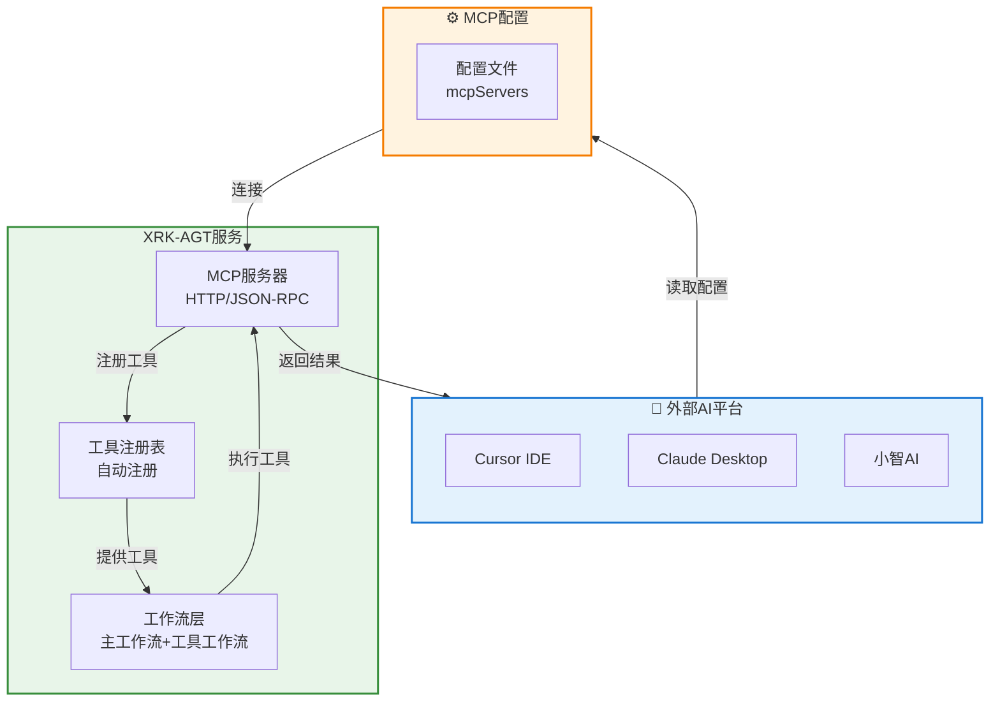

# MCP 配置指南

> **文件位置**：`core/system-Core/http/mcp.js`  
> **说明**：本文档说明如何配置 Cursor、Claude Desktop 等外部平台连接 XRK-AGT 的 MCP 服务。XRK-AGT 支持按工作流分组使用 MCP 工具，可灵活选择所需工具集。  
> **协议版本**：2025-11-25（最新规范）  
> **参考文档**：https://modelcontextprotocol.io/specification/2025-11-25

XRK-AGT 提供标准化的 **Model Context Protocol (MCP)** 服务，允许外部 AI 平台（如 Cursor、Claude Desktop、小智 AI）通过 HTTP 连接并调用系统工具。

### 核心特性

- ✅ **按工作流分组**：支持按工作流分组使用工具，灵活选择所需功能
- ✅ **标准化协议**：遵循 MCP 2025-11-25 标准，兼容主流 AI 平台
- ✅ **自动工具注册**：工作流函数自动注册为 MCP 工具，无需手动配置
- ✅ **多平台支持**：支持 Cursor、Claude Desktop、小智 AI 等平台
- ✅ **灵活配置**：支持路径参数和查询参数两种配置方式

---

## 📚 目录

- [架构与定位](#架构与定位)
- [配置方式](#配置方式)
- [可用工作流](#可用工作流)
- [配置示例](#配置示例)
- [查看可用工具](#查看可用工具)
- [最佳实践](#最佳实践)
- [常见问题](#常见问题)
- [相关文档](#相关文档)

---

## 架构与定位

MCP 配置是连接外部 AI 平台与 XRK-AGT 工作流工具的桥梁：



**配置作用**：
- 定义外部平台如何连接到 XRK-AGT 的 MCP 服务
- 指定使用哪些工作流的工具（按需选择）
- 配置连接参数（URL、端口、传输方式等）

> 关于 MCP 协议详情、工具注册机制和完整工具列表，请参考 [MCP 完整指南](mcp-guide.md)。

---

## 配置方式

XRK-AGT 支持两种方式指定工作流：

### 方式1：路径参数（推荐）

使用 URL 路径指定工作流，更直观：

```json
{
  "mcpServers": {
    "xrk-agt-desktop": {
      "url": "http://localhost:8080/api/mcp/jsonrpc/desktop",
      "transport": "http",
      "description": "XRK-AGT 桌面工作流 - 仅提供桌面操作工具"
    }
  }
}
```

### 方式2：查询参数

使用查询参数指定工作流，兼容性更好：

```json
{
  "mcpServers": {
    "xrk-agt-desktop": {
      "url": "http://localhost:8080/api/mcp/jsonrpc?stream=desktop",
      "transport": "http",
      "description": "XRK-AGT 桌面工作流 - 仅提供桌面操作工具"
    }
  }
}
```

> **注意**：
> - 端口号（8080）由启动配置决定，请替换为实际使用的端口
> - 两种方式功能相同，推荐使用路径参数（更清晰）
> - 不指定工作流时，默认使用所有工作流的工具

---

## 可用工作流

XRK-AGT 提供以下工作流，每个工作流包含一组相关工具：

### 主工作流（完整功能工作流）

| 工作流 | 说明 | 主要工具 |
|--------|------|----------|
| `chat` | 聊天工作流 | 群聊功能、消息处理等 |
| `device` | 设备工作流 | 设备控制、语音识别等 |
| `desktop` | 桌面工作流 | `show_desktop`, `open_system_tool`, `open_browser`, `screenshot` 等 |

### 工具工作流（提供MCP工具）

| 工作流 | 说明 | 主要工具 |
|--------|------|----------|
| `tools` | 文件操作工具 | `read`, `grep`, `write`, `create_file`, `delete_file`, `modify_file`, `list_files`, `run` |
| `memory` | 记忆系统 | `query_memory`, `save_memory`, `list_memories`, `delete_memory` |
| `database` | 知识库 | `query_knowledge`, `save_knowledge`, `list_knowledge`, `delete_knowledge` |

**工作流使用说明**：
- **主工作流**：通过 `mergeStreams` 参数合并，用于完整功能场景
- **工具工作流**：通过 `enableMemory`、`enableDatabase`、`enableTools` 标志启用，自动整合到主工作流中

> 详细工具列表和参数说明请参考 [MCP 完整指南](mcp-guide.md)。

---

## 配置示例

### 配置单个工作流

只使用桌面操作工具：

```json
{
  "mcpServers": {
    "xrk-agt-desktop": {
      "url": "http://localhost:8080/api/mcp/jsonrpc/desktop",
      "transport": "http",
      "description": "XRK-AGT 桌面工作流"
    }
  }
}
```

### 配置多个工作流

同时使用多个工作流，配置多个 MCP 服务器：

```json
{
  "mcpServers": {
    "xrk-agt-desktop": {
      "url": "http://localhost:8080/api/mcp/jsonrpc/desktop",
      "transport": "http",
      "description": "桌面操作工具"
    },
    "xrk-agt-tools": {
      "url": "http://localhost:8080/api/mcp/jsonrpc/tools",
      "transport": "http",
      "description": "基础工具"
    },
    "xrk-agt-memory": {
      "url": "http://localhost:8080/api/mcp/jsonrpc/memory",
      "transport": "http",
      "description": "记忆系统"
    }
  }
}
```

### 使用所有工作流

不指定工作流，使用所有可用工具：

```json
{
  "mcpServers": {
    "xrk-agt": {
      "url": "http://localhost:8080/api/mcp/jsonrpc",
      "transport": "http",
      "description": "XRK-AGT 智能助手服务器 - 提供所有工作流工具"
    }
  }
}
```

### Cursor IDE 配置示例

在 Cursor 的 MCP 配置文件中添加：

```json
{
  "mcpServers": {
    "xrk-agt": {
      "url": "http://localhost:8080/api/mcp/jsonrpc",
      "transport": "http",
      "description": "XRK-AGT 智能助手 - 提供桌面、工具、聊天等功能"
    }
  }
}
```

### Claude Desktop 配置示例

在 Claude Desktop 的配置文件中添加：

```json
{
  "mcpServers": {
    "xrk-agt-desktop": {
      "url": "http://localhost:8080/api/mcp/jsonrpc/desktop",
      "transport": "http"
    }
  }
}
```

---

## 查看可用工具

### RESTful API

查询所有可用工作流和工具：

```bash
GET http://localhost:8080/api/mcp/tools/streams
```

### JSON-RPC

使用 JSON-RPC 协议查询：

```bash
POST http://localhost:8080/api/mcp/jsonrpc
Content-Type: application/json

{
  "jsonrpc": "2.0",
  "id": 1,
  "method": "tools/list"
}
```

### 响应示例

```json
{
  "success": true,
  "data": {
    "streams": ["desktop", "tools", "chat", "memory", "database"],
    "groups": {
      "desktop": [
        {
          "name": "desktop.show_desktop",
          "description": "显示桌面",
          "inputSchema": {
            "type": "object",
            "properties": {}
          }
        },
        {
          "name": "desktop.open_browser",
          "description": "打开浏览器",
          "inputSchema": {
            "type": "object",
            "properties": {
              "url": {
                "type": "string",
                "description": "要打开的URL"
              }
            }
          }
        }
      ],
      "tools": [
        {
          "name": "tools.read",
          "description": "读取文件",
          "inputSchema": {
            "type": "object",
            "properties": {
              "path": {
                "type": "string",
                "description": "文件路径"
              }
            }
          }
        }
      ],
      "chat": [...],
      "memory": [...],
      "database": [...]
    },
    "count": 5
  }
}
```

---

## 最佳实践

### 1. 按需选择工作流

- **开发场景**：使用 `desktop` + `tools` 工作流，提供桌面操作和文件操作能力
- **聊天场景**：使用 `chat` + `memory` 工作流，提供群聊功能和记忆能力
- **知识管理**：使用 `database` 工作流，提供知识库查询和存储能力
- **全功能场景**：不指定工作流，使用所有工具（注意工具数量可能较多）

### 2. 端口配置

- 默认端口为 `8080`，可在启动配置中修改
- 确保防火墙允许外部平台访问该端口
- 生产环境建议使用 HTTPS 和认证机制

### 3. 命名规范

- 使用有意义的服务器名称（如 `xrk-agt-desktop`）
- 在 `description` 中说明该配置提供的功能
- 多个工作流时，使用清晰的命名区分

### 4. 错误排查

- 检查 XRK-AGT 服务是否正常运行
- 验证端口是否正确
- 查看 XRK-AGT 日志，确认 MCP 服务是否启动
- 使用 RESTful API 测试连接是否正常

### 5. 性能优化

- 只配置需要的工作流，减少工具数量
- 避免同时配置过多工作流，影响工具发现速度
- 定期检查工具列表，移除不需要的工具

---

## 常见问题

### Q: 如何知道当前可用的工作流？

**A**: 使用 RESTful API 或 JSON-RPC 查询 `/api/mcp/tools/streams` 接口，返回所有可用工作流列表。

### Q: 配置后无法连接怎么办？

**A**: 
1. 检查 XRK-AGT 服务是否正常运行
2. 验证端口号是否正确
3. 检查防火墙设置
4. 查看 XRK-AGT 日志中的错误信息

### Q: 可以同时配置多个工作流吗？

**A**: 可以。配置多个 `mcpServers` 条目，每个条目对应一个工作流。

### Q: 不指定工作流会怎样？

**A**: 不指定工作流时，会使用所有工作流的工具。工具数量较多，可能影响性能。

### Q: 如何查看某个工作流的具体工具？

**A**: 使用 `/api/mcp/tools/streams` 接口，返回的 `groups` 字段包含每个工作流的工具列表。

### Q: 支持 WebSocket 连接吗？

**A**: 当前版本主要支持 HTTP 传输。WebSocket 支持请参考 [MCP 完整指南](mcp-guide.md)。

---

## 相关文档

- **[MCP 完整指南](mcp-guide.md)** - MCP 协议详情、工具注册机制和完整工具列表
- **[AI Stream 文档](aistream.md)** - 工作流基类设计和使用说明
- **[system-Core 特性](system-core.md)** - system-Core 内置工作流和工具说明
- **[框架可扩展性指南](框架可扩展性指南.md)** - 如何创建自定义工作流和工具

---

*最后更新：2026-02-12*
