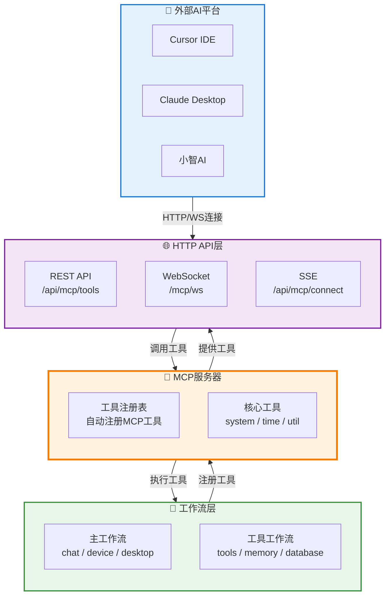

# MCP (Model Context Protocol) 完整指南

> **文件位置**：`src/utils/mcp-server.js`、`core/system-Core/http/mcp.js`  
> **说明**：Model Context Protocol (MCP) 是一个开放协议，使LLM应用能够无缝集成外部数据源和工具。XRK-AGT实现了MCP服务器，允许外部AI平台（如Cursor、Claude、小智AI）通过HTTP/WebSocket连接并调用系统工具。  
> **协议版本**：2025-11-25（最新规范）  
> **相关文档**：关于工作流扩展的详细说明，请参考 **[AIStream文档](aistream.md)** 📖  
> **配置指南**：关于外部平台连接配置，请参考 **[MCP配置指南](mcp-config-guide.md)** ⚙️

## 📚 目录

- [MCP概述](#mcp概述)
- [MCP架构](#mcp架构)
- [核心工具列表](#核心工具列表)
- [HTTP API](#http-api)
- [WebSocket API](#websocket-api)
- [开发指南](#开发指南)

---

## MCP概述

### 核心特性

- ✅ **统一工具管理**：所有工作流的函数自动注册为MCP工具
- ✅ **标准化接口**：提供HTTP REST API和WebSocket接口
- ✅ **多平台支持**：支持Cursor、Claude、小智AI等外部平台连接
- ✅ **自动注册**：系统启动时自动收集并注册所有工作流工具
- ✅ **完整工具集**：文件操作、代码操作、记忆系统、知识库等

---

## MCP架构



---

## 核心工具列表

### 1. 文件操作工具（tools工作流）

#### `tools.read`
读取文件内容

**参数**：
- `filePath` (string, 必需): 文件路径

**示例**：
```json
{
  "name": "tools.read",
  "arguments": {
    "filePath": "test.txt"
  }
}
```

#### `tools.write`
写入文件内容（覆盖）

**参数**：
- `filePath` (string, 必需): 文件路径
- `content` (string, 必需): 文件内容

#### `tools.create_file`
创建新文件

**参数**：
- `filePath` (string, 必需): 文件路径
- `content` (string, 可选): 文件内容，默认为空

#### `tools.delete_file`
删除文件

**参数**：
- `filePath` (string, 必需): 文件路径

#### `tools.modify_file`
修改文件内容

**参数**：
- `filePath` (string, 必需): 文件路径
- `content` (string, 必需): 要添加或替换的内容
- `mode` (string, 可选): 修改模式
  - `replace`: 替换全部内容（默认）
  - `append`: 追加到末尾
  - `prepend`: 插入到开头
- `lineNumber` (integer, 可选): 插入行号（仅在replace模式下有效）

#### `tools.grep`
在文件中搜索文本

**参数**：
- `pattern` (string, 必需): 搜索关键词
- `filePath` (string, 可选): 文件路径，如果不指定则搜索所有文件

#### `tools.list_files`
列出目录中的文件

**参数**：
- `dirPath` (string, 可选): 目录路径，默认为工作区
- `includeHidden` (boolean, 可选): 是否包含隐藏文件，默认false
- `type` (string, 可选): 文件类型过滤
  - `all`: 全部（默认）
  - `files`: 仅文件
  - `dirs`: 仅目录

#### `tools.run`
执行命令（工作区：桌面）

**参数**：
- `command` (string, 必需): 要执行的命令

**注意**：仅在Windows上支持

### 2. 记忆系统工具（memory工作流）

#### `memory.save_memory`
保存长期记忆

**参数**：
- `content` (string, 必需): 记忆内容

#### `memory.query_memory`
根据关键词查询相关记忆

**参数**：
- `keyword` (string, 必需): 搜索关键词

#### `memory.delete_memory`
删除长期记忆

**参数**：
- `id` (string, 必需): 记忆ID

#### `memory.list_memories`
列出所有保存的长期记忆

**参数**：无

### 3. 知识库工具（database工作流）

#### `database.save_knowledge`
保存知识到知识库

**参数**：
- `db` (string, 必需): 知识库名称
- `content` (string, 必需): 知识内容（支持文本或JSON格式）

#### `database.query_knowledge`
从知识库查询知识

**参数**：
- `db` (string, 必需): 知识库名称
- `keyword` (string, 可选): 搜索关键词，使用"*"查询所有

#### `database.delete_knowledge`
从知识库删除知识

**参数**：
- `db` (string, 必需): 知识库名称
- `condition` (string, 可选): 删除条件，使用"*"删除所有

#### `database.list_knowledge`
列出所有可用的知识库

**参数**：无

### 4. 系统工具（核心工具）

#### `system.info`
获取系统信息

**参数**：
- `detail` (boolean, 可选): 是否返回详细信息，默认false

#### `time.now`
获取当前时间信息

**参数**：
- `format` (string, 可选): 时间格式
  - `iso`: ISO 8601格式
  - `locale`: 本地格式（默认）
  - `timestamp`: 毫秒时间戳
  - `unix`: 秒时间戳
- `timezone` (string, 可选): 时区

#### `util.uuid`
生成UUID

**参数**：
- `version` (string, 可选): UUID版本，默认"v4"
- `count` (integer, 可选): 生成数量（1-100），默认1

#### `util.hash`
计算哈希值

**参数**：
- `data` (string, 必需): 要计算哈希的数据
- `algorithm` (string, 可选): 哈希算法
  - `md5`
  - `sha1`
  - `sha256`（默认）
  - `sha512`

**注意**：这些是MCP服务器注册的核心工具，不属于特定工作流

---

## HTTP API

### 基础URL
```
http://your-server:port/api/mcp
```

### 端点列表

#### 1. 获取工具列表
```http
GET /api/mcp/tools
```

**查询参数**：
- `stream` (可选): 工作流名称，用于过滤工具

**响应**：
```json
{
  "success": true,
  "tools": [
    {
      "name": "tools.read",
      "description": "读取文件内容，返回文件路径和内容",
      "inputSchema": {
        "type": "object",
        "properties": {
          "filePath": {
            "type": "string",
            "description": "文件路径，例如：易忘信息.txt"
          }
        },
        "required": ["filePath"]
      }
    }
  ],
  "count": 10
}
```

#### 2. 调用工具（JSON-RPC标准）
```http
POST /api/mcp/jsonrpc
Content-Type: application/json

{
  "jsonrpc": "2.0",
  "id": 1,
  "method": "tools/call",
  "params": {
    "name": "tools.read",
    "arguments": {
      "filePath": "test.txt"
    }
  }
}
```

**响应**：
```json
{
  "jsonrpc": "2.0",
  "id": 1,
  "result": {
    "content": [
      {
        "type": "text",
        "text": "{\"success\":true,\"data\":{\"filePath\":\"...\",\"content\":\"...\"}}"
      }
    ],
    "isError": false
  }
}
```

#### 3. 调用工具（RESTful API）
```http
POST /api/mcp/tools/call
Content-Type: application/json

{
  "name": "tools.read",
  "arguments": {
    "filePath": "test.txt"
  }
}
```

**响应**：
```json
{
  "success": true,
  "content": [
    {
      "type": "text",
      "text": "{\"success\":true,\"data\":{\"filePath\":\"...\",\"content\":\"...\"}}"
    }
  ],
  "isError": false,
  "metadata": {
    "tool": "tools.read",
    "duration": "15ms",
    "timestamp": 1703123456789
  }
}
```

#### 4. 获取工作流分组
```http
GET /api/mcp/tools/streams
```

**响应**：
```json
{
  "success": true,
  "streams": ["chat", "device", "desktop", "tools", "memory", "database"],
  "groups": {
    "chat": [...],
    "device": [...],
    "desktop": [...],
    "tools": [
      {
        "name": "tools.read",
        "description": "读取文件内容，返回文件路径和内容",
        "inputSchema": {...}
      }
    ],
    "memory": [...],
    "database": [...]
  },
  "count": 6
}
```

**工作流分类**：
- **主工作流**：`chat`、`device`、`desktop`（完整功能工作流）
- **工具工作流**：`tools`、`memory`、`database`（提供MCP工具的工作流）

#### 5. 健康检查
```http
GET /api/mcp/health
```

---

## 与 v3 接口 / LLM 工厂的集成

在 AI 聊天链路中，MCP 不仅可以被外部（Cursor/Claude 等）直接调用，也会被 **LLM 工厂 + `/api/v3/chat/completions`** 间接调用，用于实现 OpenAI style tool calling：

- `/api/v3/chat/completions` 会将前端选择的「带 MCP 工具的工作流」打包进请求体的 `workflow` 字段；
- 后端将其解析为 `streams` 白名单，传给 LLM 工厂和 `MCPToolAdapter`；
- LLM 客户端在收到 `tool_calls` 时，会通过 `MCPToolAdapter.handleToolCalls(tool_calls, { streams })` 执行工具；
- `MCPToolAdapter` 会基于 `streams` 计算出**允许的工具集合**，只有这些工具可以被真正调用，其它工具调用会被拒绝并返回错误结果。

> 换句话说：**前端/调用方在 v3 接口里没有显式允许的工作流，其下所有 MCP 工具都不会被 AI 使用**，确保工具权限和作用域可控。

**响应**：
```json
{
  "success": true,
  "status": "healthy",
  "enabled": true,
  "initialized": true,
  "toolsCount": 20,
  "resourcesCount": 0,
  "promptsCount": 0,
  "protocolVersion": "2025-11-25",
  "timestamp": 1703123456789
}
```

---

## WebSocket API

### 连接
```javascript
const ws = new WebSocket('ws://your-server:port/mcp/ws');
```

### 消息格式

#### 1. 调用工具（JSON-RPC格式）
```json
{
  "jsonrpc": "2.0",
  "id": 1,
  "method": "tools/call",
  "params": {
    "name": "tools.read",
    "arguments": {
      "filePath": "test.txt"
    }
  }
}
```

#### 2. 获取工具列表
```json
{
  "jsonrpc": "2.0",
  "id": 2,
  "method": "tools/list"
}
```

#### 3. 响应格式
```json
{
  "jsonrpc": "2.0",
  "id": 1,
  "result": {
    "content": [
      {
        "type": "text",
        "text": "{\"success\":true,\"data\":{...}}"
      }
    ],
    "isError": false
  }
}
```

---

## 开发指南

### 在工作流中注册MCP工具

```javascript
import AIStream from '#infrastructure/aistream/aistream.js';

export default class MyStream extends AIStream {
  async init() {
    await super.init();
    this.registerAllFunctions();
  }

  registerAllFunctions() {
    this.registerMCPTool('my_tool', {
      description: '我的工具描述',
      inputSchema: {
        type: 'object',
        properties: {
          param1: {
            type: 'string',
            description: '参数1描述'
          }
        },
        required: ['param1']
      },
      handler: async (args = {}, context = {}) => {
        const { param1 } = args;
        if (!param1) {
          return { success: false, error: '参数1不能为空' };
        }

        // 工具处理逻辑
        const result = await this.doSomething(param1);

        return {
          success: true,
          data: {
            result: result,
            message: '操作成功'
          }
        };
      },
      enabled: true
    });
  }
}
```

### 工具返回格式

工具handler应返回以下格式：

**成功**：
```javascript
{
  success: true,
  data: {
    // 工具返回的数据
  }
}
```

**失败**：
```javascript
{
  success: false,
  error: '错误消息'
}
```

### 工具命名规范

- 工具名称格式：`{streamName}.{toolName}`
- 例如：`tools.read`、`memory.save_memory`、`database.query_knowledge`
- 使用小写字母和下划线

---

## 配置说明

MCP服务在系统启动时自动初始化，可通过配置文件控制：

```yaml
aistream:
  mcp:
    enabled: true  # 是否启用MCP服务
```

---

## 常见问题

### Q: 如何查看所有可用工具？
A: 调用 `GET /api/mcp/tools` 或使用WebSocket发送 `{"jsonrpc":"2.0","id":1,"method":"tools/list"}`

### Q: 工具调用失败怎么办？
A: 检查工具名称是否正确，参数是否符合inputSchema要求，查看错误响应中的error字段

### Q: 如何添加自定义工具？
A: 在工作流的 `registerAllFunctions` 方法中使用 `this.registerMCPTool()` 注册工具

### Q: 工具支持哪些数据类型？
A: 支持string、number、boolean、array、object等JSON Schema支持的所有类型

---

---

## 相关文档

- **[MCP配置指南](mcp-config-guide.md)** - Cursor、Claude Desktop 等外部平台连接配置
- **[工作流开发指南](aistream.md)** - AIStream 基类技术文档
- **[API文档](http-api.md)** - HTTP API 基类文档

---

*最后更新：2026-02-12*
