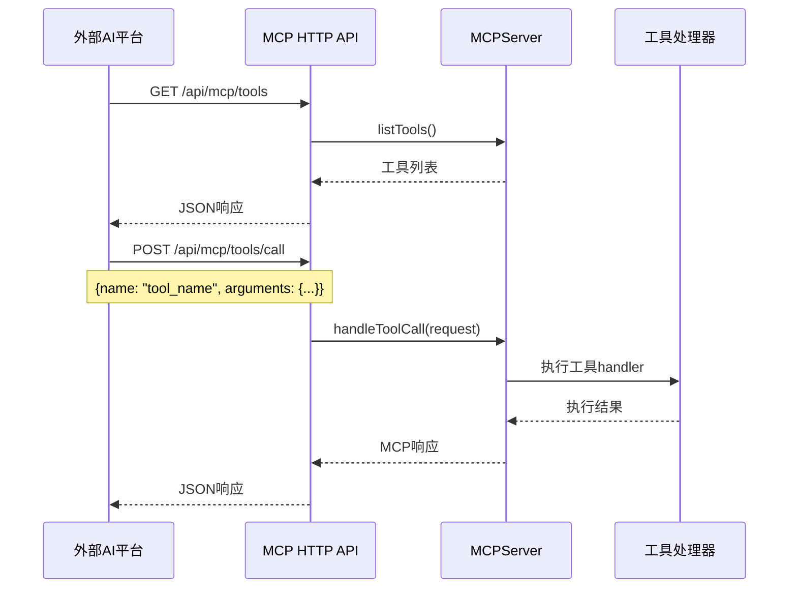
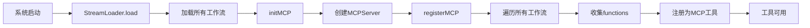

# MCP (Model Context Protocol) 完整指南

## 📚 目录导航

- [MCP概述](#mcp概述)
- [MCP架构图](#mcp架构图)
- [MCP服务器](#mcp服务器)
- [MCP HTTP API](#mcp-http-api)
- [工具注册机制](#工具注册机制)
- [外部平台连接](#外部平台连接)
- [示例工具](#示例工具)
- [开发指南](#开发指南)
- [配置说明](#配置说明)

---

## MCP概述

**Model Context Protocol (MCP)** 是XRK-AGT提供的标准化工具调用协议，允许外部AI平台（如小智AI、Claude、豆包）通过HTTP/WebSocket连接并调用系统工具。

### 核心作用

- ✅ **统一工具管理**：所有工作流的函数自动注册为MCP工具
- ✅ **标准化接口**：提供HTTP REST API和WebSocket接口
- ✅ **多平台支持**：支持小智AI、Claude、豆包等外部平台连接
- ✅ **自动注册**：系统启动时自动收集并注册所有工作流工具

### 应用场景

1. **外部AI平台调用**：小智AI、Claude等平台可以调用XRK-AGT的工具
2. **工具聚合**：将多个工作流的函数统一暴露为MCP工具
3. **跨平台协作**：不同AI平台可以共享同一套工具集

---

## MCP架构图

```mermaid
flowchart TB
    subgraph External["外部AI平台"]
        XiaoZhi["小智AI"]
        Claude["Claude"]
        Doubao["豆包"]
    end

    subgraph XRKAGT["XRK-AGT系统"]
        subgraph Streams["工作流层"]
            ChatStream["chat工作流<br/>聊天功能"]
            DesktopStream["desktop工作流<br/>桌面操作"]
            DeviceStream["device工作流<br/>设备控制"]
        end

        subgraph MCPServer["MCP服务器"]
            ToolRegistry["工具注册表<br/>MCPServer.tools"]
            ExampleTools["示例工具<br/>get_system_info<br/>calculate<br/>text_process<br/>get_time"]
        end

        subgraph HTTPAPI["HTTP API层"]
            GETTools["GET /api/mcp/tools<br/>获取工具列表"]
            POSTCall["POST /api/mcp/tools/call<br/>调用工具"]
            SSEConnect["GET /api/mcp/connect<br/>SSE连接"]
            WSConnect["WS /mcp/ws<br/>WebSocket连接"]
        end

        StreamLoader["StreamLoader<br/>工作流加载器"]
    end

    ChatStream -->|自动注册| ToolRegistry
    DesktopStream -->|自动注册| ToolRegistry
    DeviceStream -->|自动注册| ToolRegistry
    ExampleTools -->|内置工具| ToolRegistry

    StreamLoader -->|initMCP()| MCPServer
    MCPServer -->|工具列表| HTTPAPI

    XiaoZhi -->|HTTP/WS| HTTPAPI
    Claude -->|HTTP/WS| HTTPAPI
    Doubao -->|HTTP/WS| HTTPAPI

    HTTPAPI -->|调用工具| MCPServer
    MCPServer -->|执行结果| HTTPAPI
    HTTPAPI -->|返回结果| External
```

### 数据流图



---

## MCP服务器

### MCPServer类

**位置**: `core/stream/mcp-server.js`

**核心功能**：
- 工具注册与管理
- 工具调用处理
- 错误处理与日志记录

### 初始化

MCP服务器在系统启动时自动初始化：

```javascript
// src/infrastructure/aistream/loader.js
async initMCP() {
  const mcpConfig = cfg.aistream?.mcp || {};
  if (mcpConfig.enabled === false) {
    return; // MCP服务已禁用
  }

  // 创建MCP服务器实例
  this.mcpServer = new MCPServer();
  
  // 注册所有工作流的工具
  this.registerMCP(this.mcpServer);
}
```

### 工具注册

```javascript
// 注册MCP工具
mcpServer.registerTool('tool_name', {
  description: '工具描述',
  inputSchema: {
    type: 'object',
    properties: {
      param1: { type: 'string', description: '参数1' }
    },
    required: ['param1']
  },
  handler: async (args) => {
    // 工具处理逻辑
    return result;
  }
});
```

### 工具调用

```javascript
// 处理工具调用请求
const result = await mcpServer.handleToolCall({
  name: 'tool_name',
  arguments: { param1: 'value1' }
});

// 返回格式
{
  content: [{ type: 'text', text: '结果文本或JSON' }],
  isError: false
}
```

---

## MCP HTTP API

### API端点

| 端点 | 方法 | 说明 | 请求格式 | 响应格式 |
|------|------|------|----------|----------|
| `/api/mcp/tools` | GET | 获取所有可用工具列表 | - | `{success: true, tools: [...], count: N}` |
| `/api/mcp/tools/call` | POST | 调用MCP工具 | `{name: "tool_name", arguments: {...}}` | `{success: true, content: [...], isError: false}` |
| `/api/mcp/connect` | GET | SSE连接（Server-Sent Events） | - | `text/event-stream` |
| `/mcp/ws` | WS | WebSocket连接 | JSON消息 | JSON响应 |

### 工具列表查询

**请求**：
```http
GET /api/mcp/tools HTTP/1.1
Host: your-server:port
```

**响应**：
```json
{
  "success": true,
  "tools": [
    {
      "name": "get_system_info",
      "description": "获取系统信息（操作系统、CPU、内存等）",
      "inputSchema": {
        "type": "object",
        "properties": {},
        "required": []
      }
    },
    {
      "name": "chat.send_message",
      "description": "发送消息",
      "inputSchema": {...}
    }
  ],
  "count": 10
}
```

### 工具调用

**请求**：
```http
POST /api/mcp/tools/call HTTP/1.1
Host: your-server:port
Content-Type: application/json

{
  "name": "get_system_info",
  "arguments": {}
}
```

**成功响应**：
```json
{
  "success": true,
  "content": [
    {
      "type": "text",
      "text": "{\"platform\":\"win32\",\"arch\":\"x64\",...}"
    }
  ],
  "isError": false
}
```

**错误响应**：
```json
{
  "success": false,
  "error": {
    "code": "TOOL_NOT_FOUND",
    "message": "工具未找到: invalid_tool"
  },
  "isError": true
}
```

### SSE连接

**请求**：
```http
GET /api/mcp/connect HTTP/1.1
Host: your-server:port
```

**响应**（Server-Sent Events）：
```
Content-Type: text/event-stream
Cache-Control: no-cache
Connection: keep-alive

data: {"type":"connected","message":"MCP连接已建立"}

data: {"type":"ping","timestamp":1703123456789}

...
```

### WebSocket连接

**连接**：
```javascript
const ws = new WebSocket('ws://your-server:port/mcp/ws');
```

**消息格式**：

1. **调用工具**：
```json
{
  "type": "call_tool",
  "requestId": "req_123",
  "name": "get_system_info",
  "arguments": {}
}
```

2. **获取工具列表**：
```json
{
  "type": "list_tools"
}
```

**响应格式**：

1. **工具调用结果**：
```json
{
  "type": "tool_result",
  "requestId": "req_123",
  "result": {
    "content": [{"type": "text", "text": "..."}],
    "isError": false
  }
}
```

2. **工具列表**：
```json
{
  "type": "tools_list",
  "tools": [...]
}
```

---

## 工具注册机制

### 自动注册流程



### 工具命名规则

- **工作流工具**：`{streamName}.{functionName}`
  - 例如：`chat.send_message`、`desktop.open_application`
- **示例工具**：直接使用工具名
  - 例如：`get_system_info`、`calculate`

### 工具Schema生成

系统自动从工作流函数的`prompt`中提取参数信息，生成JSON Schema：

```javascript
// 工作流函数定义
this.registerFunction('send_message', {
  prompt: '[发送消息:消息内容:目标群组]',
  handler: async (params, context) => {...}
});

// 自动生成的MCP工具
{
  name: 'chat.send_message',
  description: '发送消息',
  inputSchema: {
    type: 'object',
    properties: {
      '消息内容': { type: 'string' },
      '目标群组': { type: 'string' }
    },
    required: ['消息内容']
  }
}
```

---

## 外部平台连接

### 小智AI连接

小智AI支持通过HTTP API调用MCP工具：

```python
import requests

# 获取工具列表
response = requests.get('http://your-server:port/api/mcp/tools')
tools = response.json()['tools']

# 调用工具
result = requests.post('http://your-server:port/api/mcp/tools/call', json={
    'name': 'get_system_info',
    'arguments': {}
})
print(result.json())
```

### Claude连接

Claude支持MCP协议，可以通过配置文件连接：

```json
{
  "mcpServers": {
    "xrk-agt": {
      "command": "node",
      "args": ["path/to/mcp-client.js"],
      "env": {
        "MCP_SERVER_URL": "http://your-server:port/api/mcp"
      }
    }
  }
}
```

### 豆包连接

豆包可以通过WebSocket连接：

```python
import websocket
import json

def on_message(ws, message):
    data = json.loads(message)
    if data['type'] == 'tools_list':
        print('工具列表:', data['tools'])

ws = websocket.WebSocketApp(
    'ws://your-server:port/mcp/ws',
    on_message=on_message
)

# 获取工具列表
ws.send(json.dumps({'type': 'list_tools'}))

# 调用工具
ws.send(json.dumps({
    'type': 'call_tool',
    'requestId': 'req_1',
    'name': 'get_system_info',
    'arguments': {}
}))

ws.run_forever()
```

---

## 示例工具

MCP服务器内置了4个示例工具，供测试和演示使用：

### 1. get_system_info

获取系统信息（操作系统、CPU、内存等）

**参数**：无

**示例**：
```json
{
  "name": "get_system_info",
  "arguments": {}
}
```

**返回**：
```json
{
  "platform": "win32",
  "arch": "x64",
  "nodeVersion": "v18.14.0",
  "cpuCount": 8,
  "totalMemory": "16GB",
  "freeMemory": "8GB",
  "uptime": "24小时",
  "hostname": "DESKTOP-XXX"
}
```

### 2. calculate

计算数学表达式（支持基本运算）

**参数**：
```json
{
  "expression": "2 + 2 * 3"
}
```

**示例**：
```json
{
  "name": "calculate",
  "arguments": {
    "expression": "10 * 5 + 20"
  }
}
```

**返回**：
```json
{
  "expression": "10 * 5 + 20",
  "result": 70,
  "formatted": "10 * 5 + 20 = 70"
}
```

### 3. text_process

文本处理工具（统计字数、转换大小写等）

**参数**：
```json
{
  "text": "Hello World",
  "operation": "uppercase"  // count, uppercase, lowercase, reverse
}
```

**示例**：
```json
{
  "name": "text_process",
  "arguments": {
    "text": "Hello World",
    "operation": "count"
  }
}
```

**返回**：
```json
{
  "text": "Hello World",
  "operation": "count",
  "result": {
    "length": 11,
    "words": 2,
    "lines": 1
  }
}
```

### 4. get_time

获取当前时间信息

**参数**：
```json
{
  "format": "locale",  // iso, locale, timestamp
  "timezone": "Asia/Shanghai"  // 可选
}
```

**示例**：
```json
{
  "name": "get_time",
  "arguments": {
    "format": "locale"
  }
}
```

**返回**：
```json
{
  "format": "locale",
  "time": "2024/1/1 12:00:00",
  "date": "2024/1/1",
  "timeOnly": "12:00:00",
  "timestamp": 1703123456789
}
```

---

## 开发指南

### 1. 开发自定义MCP工具

#### 方式1：在工作流中注册（推荐）

```javascript
// core/stream/my-stream.js
export default class MyStream extends AIStream {
  async init() {
    await super.init();
    
    // 注册函数（自动注册为MCP工具）
    this.registerFunction('my_tool', {
      description: '我的自定义工具',
      prompt: '[我的工具:参数1:参数2]',
      handler: async (params, context) => {
        // 工具逻辑
        return { result: 'success' };
      }
    });
  }
}
```

工具会自动注册为：`my-stream.my_tool`

#### 方式2：直接注册到MCPServer

```javascript
// 在系统初始化时
const mcpServer = StreamLoader.mcpServer;
mcpServer.registerTool('custom_tool', {
  description: '自定义工具',
  inputSchema: {
    type: 'object',
    properties: {
      param1: { type: 'string' }
    },
    required: ['param1']
  },
  handler: async (args) => {
    return { result: 'success' };
  }
});
```

### 2. 工具设计原则

- **标准化**：遵循MCP协议规范
- **安全性**：验证输入参数，防止注入攻击
- **错误处理**：提供清晰的错误信息
- **文档化**：提供详细的工具描述和参数说明

### 3. 工具测试

```bash
# 获取工具列表
curl http://localhost:2537/api/mcp/tools

# 调用工具
curl -X POST http://localhost:2537/api/mcp/tools/call \
  -H "Content-Type: application/json" \
  -d '{"name": "get_system_info", "arguments": {}}'
```

---

## 配置说明

### MCP配置

在 `core/commonconfig/system.js` 中配置：

```javascript
aistream: {
  mcp: {
    enabled: true,        // 启用MCP服务
    port: 2537,          // HTTP服务端口（使用主服务器端口）
    autoRegister: true   // 自动注册所有工作流工具
  }
}
```

### 配置项说明

| 配置项 | 类型 | 默认值 | 说明 |
|--------|------|--------|------|
| `enabled` | boolean | `true` | 是否启用MCP服务 |
| `port` | number | `2537` | HTTP服务端口（使用主服务器端口） |
| `autoRegister` | boolean | `true` | 是否自动注册所有工作流工具 |

---

## 总结

XRK-AGT的MCP系统提供了：

- ✅ **标准化工具接口**：遵循MCP协议，支持外部AI平台连接
- ✅ **自动工具注册**：所有工作流函数自动注册为MCP工具
- ✅ **多协议支持**：HTTP REST API、SSE、WebSocket
- ✅ **示例工具**：内置4个示例工具，便于测试和演示
- ✅ **易于扩展**：支持自定义工具开发

通过MCP协议，XRK-AGT可以轻松与外部AI平台集成，实现工具共享和跨平台协作。

